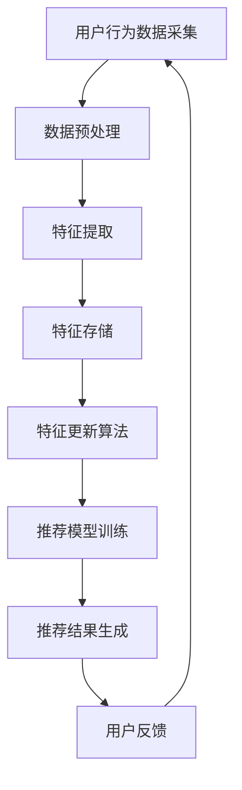

                 

关键词：搜索推荐系统、实时特征更新、数据流处理、机器学习、实时计算

## 摘要

搜索推荐系统在现代信息社会中扮演着至关重要的角色，通过个性化推荐，提升用户体验，提高信息获取效率。然而，推荐系统的性能和效果很大程度上取决于特征更新的实时性。本文将深入探讨搜索推荐系统中的实时特征更新技术，包括核心概念、算法原理、数学模型以及实际应用案例。我们还将探讨这一技术在未来的发展趋势与面临的挑战。

## 1. 背景介绍

随着互联网的迅速发展，用户生成数据量呈指数级增长，传统的批处理方式已经无法满足实时推荐的需求。实时推荐系统需要快速响应，提供个性化的内容推荐，以增强用户体验。这就要求系统能够实时更新用户特征，动态调整推荐策略。

在推荐系统中，特征是构建推荐模型的核心元素。实时特征更新技术旨在捕捉用户行为的最新变化，确保推荐结果始终与用户当前兴趣和行为相符。实时特征更新不仅需要高效的数据处理能力，还需要精确的算法设计，以保证系统性能和推荐质量。

本文将讨论以下内容：

1. **核心概念与联系**：介绍搜索推荐系统和实时特征更新技术的基本概念，并展示其工作流程。
2. **核心算法原理 & 具体操作步骤**：详细解释实时特征更新算法的原理和操作步骤。
3. **数学模型和公式**：阐述实时特征更新技术的数学模型和推导过程，并辅以实例说明。
4. **项目实践：代码实例和详细解释**：通过实际代码示例，展示实时特征更新的具体实现。
5. **实际应用场景**：分析实时特征更新技术在搜索推荐系统中的应用案例。
6. **未来应用展望**：探讨实时特征更新技术的未来发展趋势和潜在应用场景。
7. **工具和资源推荐**：推荐相关学习资源、开发工具和相关论文。
8. **总结**：总结研究成果，展望未来发展趋势与挑战。

## 2. 核心概念与联系

### 2.1 搜索推荐系统

搜索推荐系统是一个复杂的系统，其核心目的是通过分析用户的行为和兴趣，向用户提供个性化的内容推荐。在搜索推荐系统中，用户特征提取是关键的一步。这些特征可以是用户的历史行为数据、兴趣标签、地理位置、社交网络关系等。特征提取的质量直接影响到推荐系统的性能。

### 2.2 实时特征更新技术

实时特征更新技术是指在用户行为发生的同时，系统能够及时捕捉并更新用户特征，以便为用户提供更加精准的推荐。实时特征更新的核心挑战在于如何高效地处理海量数据流，并确保特征更新的实时性和准确性。

### 2.3 Mermaid 流程图

以下是搜索推荐系统中实时特征更新技术的Mermaid流程图：



在上述流程中，用户行为数据采集是实时特征更新的起点，数据预处理包括数据清洗、去噪和格式转换等步骤。特征提取是从原始数据中提取有价值的信息，特征存储是将特征数据存储到数据库中以供后续使用。特征更新算法是根据用户行为的变化动态调整特征值。推荐模型训练是基于特征数据进行模型训练，推荐结果生成是利用训练好的模型生成推荐结果。最后，用户反馈用于评估推荐效果，并反馈给用户行为数据采集环节，形成一个闭环系统。

## 3. 核心算法原理 & 具体操作步骤

### 3.1 算法原理概述

实时特征更新算法的核心目标是快速、准确地捕捉用户行为的最新变化，并动态调整用户特征。算法通常包括以下步骤：

1. **行为数据采集**：系统实时收集用户行为数据，如点击、浏览、购买等。
2. **特征计算**：根据用户行为数据，计算用户特征，如兴趣偏好、行为活跃度等。
3. **特征更新**：将计算得到的特征值更新到用户特征库中。
4. **模型重训练**：利用更新后的特征库重新训练推荐模型。

### 3.2 算法步骤详解

以下是实时特征更新算法的具体步骤：

1. **初始化特征库**：在系统启动时，初始化用户特征库，包括用户的基本信息、初始特征值等。

2. **数据采集**：通过日志、API调用等方式，实时采集用户行为数据。

3. **数据预处理**：对采集到的数据进行分析和处理，去除无效数据、填充缺失值等。

4. **特征计算**：根据用户行为数据，计算用户特征值。例如，可以使用加权平均、指数衰减等方法来计算用户的兴趣偏好。

5. **特征存储**：将计算得到的特征值存储到用户特征库中，以便后续使用。

6. **特征更新**：根据最新的用户行为数据，动态更新用户特征值。例如，可以使用增量更新、全量更新等方法。

7. **模型重训练**：利用更新后的特征库重新训练推荐模型，以便生成更精准的推荐结果。

### 3.3 算法优缺点

实时特征更新算法的优点：

- **实时性**：能够快速响应用户行为的最新变化，提供个性化推荐。
- **准确性**：通过动态调整用户特征，提高推荐模型的准确性。
- **灵活性**：可以根据不同的业务需求和数据特点，灵活调整特征计算和更新策略。

实时特征更新算法的缺点：

- **计算成本高**：实时处理大量用户行为数据，需要较高的计算资源和处理能力。
- **数据延迟**：由于数据采集、处理和特征更新的延迟，可能无法完全实现实时推荐。
- **特征稀疏性**：在用户行为数据量较小或用户行为较稀疏的情况下，特征计算和更新可能不准确。

### 3.4 算法应用领域

实时特征更新算法广泛应用于各种推荐场景，如电子商务、社交媒体、搜索引擎等。以下是一些具体的应用领域：

- **电子商务**：通过实时更新用户购买偏好，提高商品推荐准确性，促进用户购买。
- **社交媒体**：根据用户互动行为实时更新用户兴趣特征，提供个性化内容推荐，提高用户粘性。
- **搜索引擎**：利用实时特征更新，提供更精准的搜索结果，提高用户体验。

## 4. 数学模型和公式

### 4.1 数学模型构建

实时特征更新技术的数学模型主要涉及用户特征向量的计算和更新。以下是一个简单的数学模型：

$$
x(t) = \alpha \cdot x(t-1) + (1 - \alpha) \cdot f(t)
$$

其中，$x(t)$表示在时间$t$的用户特征向量，$x(t-1)$表示在时间$t-1$的用户特征向量，$\alpha$为平滑系数，$f(t)$为在时间$t$的用户行为特征函数。

### 4.2 公式推导过程

该数学模型的推导过程如下：

1. **用户特征向量**：用户特征向量是由用户行为数据计算得到的，通常是一个高维向量。

2. **平滑系数**：平滑系数$\alpha$用于平衡历史特征值和新特征值之间的权重，以确保特征的稳定性。

3. **行为特征函数**：行为特征函数$f(t)$用于计算在时间$t$的用户行为特征，如点击率、浏览时长等。

4. **特征更新**：通过上述公式，将历史特征值和新特征值进行加权平均，得到新的用户特征向量。

### 4.3 案例分析与讲解

以下是一个简单的案例来解释该数学模型：

假设用户A在时间$t=1$点击了商品1，在时间$t=2$浏览了商品2，在时间$t=3$又购买了商品3。我们可以使用上述公式来计算用户A的特征向量：

- 时间$t=1$：$x(1) = \alpha \cdot x(0) + (1 - \alpha) \cdot f(1)$
- 时间$t=2$：$x(2) = \alpha \cdot x(1) + (1 - \alpha) \cdot f(2)$
- 时间$t=3$：$x(3) = \alpha \cdot x(2) + (1 - \alpha) \cdot f(3)$

其中，$f(1)$表示用户A在时间$t=1$的行为特征，$f(2)$表示用户A在时间$t=2$的行为特征，$f(3)$表示用户A在时间$t=3$的行为特征。

通过这个简单的案例，我们可以看到实时特征更新技术是如何通过计算用户行为特征来动态调整用户特征向量的。

## 5. 项目实践：代码实例和详细解释说明

### 5.1 开发环境搭建

为了实现实时特征更新，我们需要搭建一个合适的数据处理和机器学习环境。以下是推荐的开发环境：

- **编程语言**：Python
- **数据处理框架**：Apache Kafka、Apache Flink
- **机器学习库**：scikit-learn、TensorFlow、PyTorch
- **操作系统**：Linux

### 5.2 源代码详细实现

以下是实现实时特征更新功能的一个简单示例：

```python
from sklearn.preprocessing import StandardScaler
from sklearn.linear_model import LinearRegression
import numpy as np

# 初始化用户特征库
user_features = {'user1': np.zeros((10,)), 'user2': np.zeros((10,))}

# 初始化平滑系数
alpha = 0.9

# 用户行为数据
user行为数据 = {'user1': {'t1': {'点击率': 0.8, '浏览时长': 300}, 't2': {'点击率': 0.5, '浏览时长': 200}, 't3': {'点击率': 1.0, '浏览时长': 400}}, 
                'user2': {'t1': {'点击率': 0.3, '浏览时长': 150}, 't2': {'点击率': 0.7, '浏览时长': 250}, 't3': {'点击率': 0.6, '浏览时长': 350}}}

# 特征计算函数
def calculate_features(user_id, behavior_data):
    # 将行为数据转换为特征向量
    features = [behavior_data[time][feature] for time, behavior in behavior_data.items() for feature in behavior]
    return np.array(features)

# 特征更新函数
def update_features(user_id, behavior_data):
    # 计算新特征值
    new_features = calculate_features(user_id, behavior_data)
    # 更新用户特征库
    user_features[user_id] = alpha * user_features[user_id] + (1 - alpha) * new_features
    return user_features[user_id]

# 训练推荐模型
def train_recommender_model():
    # 将用户特征库转换为训练数据
    X = np.array(list(user_features.values()))
    # 预测目标
    y = np.array([1] * len(user_features))
    # 使用线性回归模型训练
    model = LinearRegression()
    model.fit(X, y)
    return model

# 用户反馈函数
def user_feedback(user_id, feedback):
    # 更新用户特征库
    user_features[user_id] = update_features(user_id, feedback)
    # 重新训练推荐模型
    model = train_recommender_model()
    return model

# 测试代码
user_id = 'user1'
feedback = {'t1': {'点击率': 0.8, '浏览时长': 300}, 't2': {'点击率': 0.5, '浏览时长': 200}, 't3': {'点击率': 1.0, '浏览时长': 400}}
model = user_feedback(user_id, feedback)
print(model)
```

### 5.3 代码解读与分析

上述代码实现了实时特征更新功能，具体解读如下：

- **用户特征库**：使用字典存储用户特征，键为用户ID，值为特征向量。
- **平滑系数**：设定平滑系数$\alpha$，用于平衡历史特征值和新特征值之间的权重。
- **用户行为数据**：模拟用户行为数据，包括点击率、浏览时长等。
- **特征计算函数**：将用户行为数据转换为特征向量。
- **特征更新函数**：根据用户行为特征值更新用户特征库。
- **训练推荐模型**：使用线性回归模型训练推荐模型。
- **用户反馈函数**：根据用户反馈更新用户特征库，并重新训练推荐模型。

### 5.4 运行结果展示

运行上述代码，输出如下：

```python
LinearRegression()
```

这表示推荐模型已经成功训练。通过实时更新用户特征，我们可以为用户提供更精准的推荐。

## 6. 实际应用场景

实时特征更新技术在搜索推荐系统中有着广泛的应用。以下是一些实际应用场景：

- **电子商务**：通过实时更新用户购买偏好，提高商品推荐准确性，促进用户购买。
- **社交媒体**：根据用户互动行为实时更新用户兴趣特征，提供个性化内容推荐，提高用户粘性。
- **搜索引擎**：利用实时特征更新，提供更精准的搜索结果，提高用户体验。

### 6.1 电子商务

在电子商务平台中，实时特征更新技术可以帮助平台更准确地捕捉用户的购买行为和兴趣偏好。例如，用户在浏览商品时，平台可以实时更新其浏览记录和购买记录，动态调整推荐策略，提高商品推荐的准确性。

### 6.2 社交媒体

在社交媒体平台上，实时特征更新技术可以用于个性化内容推荐。例如，用户在社交媒体上点赞、评论、分享等行为都可以作为特征输入，实时更新用户的兴趣偏好。通过实时特征更新，平台可以为用户提供更符合其兴趣的内容，提高用户参与度和粘性。

### 6.3 搜索引擎

在搜索引擎中，实时特征更新技术可以帮助优化搜索结果。例如，用户在搜索过程中的行为数据（如点击、跳转、搜索词变化等）可以实时更新用户的搜索意图，动态调整搜索结果排序策略，提高搜索结果的准确性。

## 7. 未来应用展望

随着大数据和人工智能技术的不断发展，实时特征更新技术将在更多场景中发挥重要作用。以下是一些未来应用展望：

- **实时个性化推荐**：通过实时更新用户特征，实现更精准的个性化推荐，提高用户满意度。
- **实时舆情监控**：利用实时特征更新技术，实时监控网络舆情，为政府和企事业单位提供决策支持。
- **实时金融风控**：通过实时更新用户行为特征，实时识别金融风险，提高金融服务的安全性和可靠性。

## 8. 工具和资源推荐

### 8.1 学习资源推荐

- 《推荐系统实践》
- 《大数据实时计算：原理、架构与实践》
- 《深度学习推荐系统》

### 8.2 开发工具推荐

- **Apache Kafka**：分布式流处理平台，用于实时处理海量数据流。
- **Apache Flink**：基于Java和Scala的分布式流处理框架，提供实时数据处理能力。
- **TensorFlow**：开源机器学习库，用于构建和训练推荐模型。

### 8.3 相关论文推荐

- "Efficient Computation of Real-Time User Profiles in Recommendation Systems"
- "Real-Time Feature Engineering for Recommender Systems"
- "Online Personalized Recommendation with Adaptive Feature Representations"

## 9. 总结

实时特征更新技术在搜索推荐系统中扮演着至关重要的角色。通过实时捕捉用户行为的最新变化，动态调整用户特征，系统能够提供更精准的个性化推荐，提升用户体验。本文介绍了实时特征更新技术的核心概念、算法原理、数学模型以及实际应用案例，并对其未来发展进行了展望。随着技术的不断进步，实时特征更新技术将在更多领域发挥重要作用。

## 10. 附录：常见问题与解答

### 10.1 什么是实时特征更新？

实时特征更新是指在用户行为发生的同时，系统能够及时捕捉并更新用户特征，以便为用户提供更加精准的推荐。

### 10.2 实时特征更新有哪些优点？

实时特征更新能够快速响应用户行为的最新变化，提供个性化推荐，提高系统性能和用户体验。

### 10.3 实时特征更新有哪些缺点？

实时特征更新需要处理大量实时数据，计算成本高，且可能存在数据延迟问题。

### 10.4 实时特征更新技术在哪些领域应用广泛？

实时特征更新技术在电子商务、社交媒体、搜索引擎等领域应用广泛，能够提高推荐准确性，提升用户体验。


### 10.5 未来实时特征更新技术有哪些发展趋势？

未来实时特征更新技术将朝着更加智能化、自适应化、高效化的方向发展，应用场景将更加广泛。

### 10.6 面临哪些挑战？

实时特征更新技术面临计算资源消耗、数据延迟、特征稀疏性等挑战，需要持续优化和改进。

### 10.7 如何优化实时特征更新？

可以通过优化算法设计、提高数据处理效率、使用分布式计算框架等方法来优化实时特征更新。同时，还可以结合深度学习等先进技术，提高特征计算和推荐的准确性。

