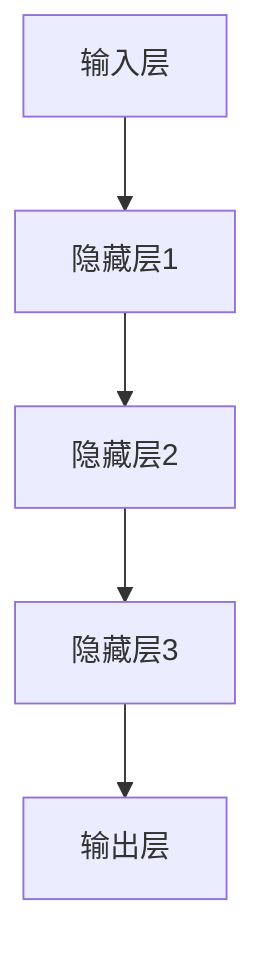

                 

关键词：搜索推荐系统、AI 大模型、电商平台、竞争优势、可持续发展

> 摘要：本文深入探讨了AI 大模型在搜索推荐系统中的应用，分析了其在电商平台中的核心竞争优势与可持续发展策略。通过理论阐述和实际案例分析，揭示了AI 大模型融合对于电商平台的重要性，为行业未来发展提供了有益的参考。

## 1. 背景介绍

在当今数字经济时代，电商平台已成为消费者获取商品和服务的重要渠道。随着互联网技术的飞速发展，用户需求日益多样化和个性化，传统的搜索推荐系统已经难以满足用户的高效、精准需求。因此，AI 大模型技术的引入成为电商平台提升核心竞争优势和实现可持续发展的关键。

AI 大模型是一种基于深度学习的高层次抽象模型，能够通过大量数据训练，实现复杂模式识别和预测。在搜索推荐系统中，AI 大模型通过分析用户行为、偏好和历史数据，提供个性化的搜索结果和推荐内容，显著提升了用户体验和转化率。

## 2. 核心概念与联系

### 2.1 AI 大模型原理

AI 大模型基于深度神经网络，通过多层非线性变换，实现数据的自动特征提取和模式识别。其核心思想是多层抽象，将原始数据转化为高层次的概念表达。以下是AI 大模型的基本架构：



### 2.2 搜索推荐系统架构

搜索推荐系统的核心架构包括用户行为分析、内容挖掘、推荐算法和用户体验四个部分。AI 大模型在其中的作用主要体现在以下几个方面：

- 用户行为分析：通过AI 大模型分析用户的历史行为数据，挖掘用户兴趣偏好。
- 内容挖掘：利用AI 大模型对商品、服务信息进行深度理解，提取关键特征。
- 推荐算法：基于用户行为和内容特征，通过AI 大模型生成个性化的推荐结果。
- 用户体验：通过AI 大模型优化推荐结果，提升用户满意度和转化率。

## 3. 核心算法原理 & 具体操作步骤

### 3.1 算法原理概述

搜索推荐系统的核心算法通常是基于协同过滤、矩阵分解、深度学习等方法。其中，深度学习方法以其强大的特征提取和表达能力，在推荐系统中具有显著优势。以下是一个基于深度学习的推荐算法的基本原理：

- 输入层：用户特征和商品特征。
- 隐藏层：通过多层神经网络进行特征转换和融合。
- 输出层：预测用户对商品的评分或购买概率。

### 3.2 算法步骤详解

1. 数据收集与预处理：收集用户行为数据、商品数据，并进行清洗、去噪、特征提取。
2. 模型构建：设计神经网络结构，包括输入层、隐藏层和输出层。
3. 模型训练：利用大量训练数据进行模型训练，优化网络参数。
4. 模型评估：通过交叉验证等方法评估模型性能，调整模型参数。
5. 推荐生成：基于用户特征和商品特征，使用训练好的模型生成个性化推荐结果。

### 3.3 算法优缺点

- 优点：深度学习算法能够自动提取高维特征，处理稀疏数据和冷启动问题，提供更精准的推荐结果。
- 缺点：模型训练复杂度高，对计算资源要求较高；模型解释性较差，难以理解推荐结果的产生过程。

### 3.4 算法应用领域

深度学习算法在搜索推荐系统中的应用非常广泛，不仅适用于电商平台，还涵盖了社交媒体、在线教育、视频推荐等领域。通过个性化推荐，提升用户体验，增加用户粘性，是企业提升核心竞争优势的重要手段。

## 4. 数学模型和公式 & 详细讲解 & 举例说明

### 4.1 数学模型构建

搜索推荐系统的数学模型通常基于矩阵分解或协同过滤。以下是基于矩阵分解的数学模型构建：

$$
R = U \cdot V^T
$$

其中，$R$ 是用户-商品评分矩阵，$U$ 是用户特征矩阵，$V$ 是商品特征矩阵。

### 4.2 公式推导过程

1. 初始化用户特征矩阵 $U$ 和商品特征矩阵 $V$。
2. 对于每个用户 $i$ 和商品 $j$，计算预测评分：

$$
\hat{r}_{ij} = u_i^T \cdot v_j
$$

3. 计算预测误差：

$$
e_{ij} = r_{ij} - \hat{r}_{ij}
$$

4. 更新用户特征矩阵 $U$ 和商品特征矩阵 $V$：

$$
u_i = u_i + \alpha \cdot e_{ij} \cdot v_j
$$

$$
v_j = v_j + \alpha \cdot e_{ij} \cdot u_i
$$

其中，$\alpha$ 是学习率。

### 4.3 案例分析与讲解

以一个电商平台的商品推荐为例，假设用户 $A$ 在过去一个月内浏览了商品 $X$、$Y$ 和 $Z$，分别给出了评分 $4$、$5$ 和 $3$。现在我们需要为用户 $A$ 推荐一个尚未浏览过的商品。

1. 数据收集与预处理：收集用户 $A$ 的历史行为数据，如浏览记录、购买记录等，并进行清洗和特征提取。
2. 模型构建：设计一个基于矩阵分解的推荐模型，初始化用户特征矩阵 $U$ 和商品特征矩阵 $V$。
3. 模型训练：利用用户 $A$ 的历史行为数据，训练用户特征矩阵 $U$ 和商品特征矩阵 $V$。
4. 模型评估：通过交叉验证等方法，评估模型性能，调整模型参数。
5. 推荐生成：利用训练好的模型，为用户 $A$ 推荐一个尚未浏览过的商品。例如，商品 $W$，其特征向量与用户 $A$ 的特征向量最相似的，即为推荐结果。

## 5. 项目实践：代码实例和详细解释说明

### 5.1 开发环境搭建

1. 安装 Python 3.7 或更高版本。
2. 安装 TensorFlow 2.x 或 PyTorch。
3. 创建一个虚拟环境，并安装所需的库。

```shell
python -m pip install numpy pandas sklearn tensorflow
```

### 5.2 源代码详细实现

以下是一个基于 PyTorch 的简单商品推荐模型的实现：

```python
import torch
import torch.nn as nn
import numpy as np
from torch.utils.data import DataLoader, TensorDataset

# 数据预处理
def preprocess_data(user_data, item_data):
    # 转换为 PyTorch 张量
    user_data = torch.tensor(user_data, dtype=torch.float32)
    item_data = torch.tensor(item_data, dtype=torch.float32)
    return user_data, item_data

# 网络结构
class RecommenderModel(nn.Module):
    def __init__(self, user_dim, item_dim):
        super(RecommenderModel, self).__init__()
        self.user_embedding = nn.Embedding(user_dim, 64)
        self.item_embedding = nn.Embedding(item_dim, 64)
        self.fc = nn.Linear(128, 1)

    def forward(self, user_ids, item_ids):
        user_embeddings = self.user_embedding(user_ids)
        item_embeddings = self.item_embedding(item_ids)
        embeddings = torch.cat([user_embeddings, item_embeddings], 1)
        ratings = self.fc(embeddings)
        return ratings

# 模型训练
def train_model(model, train_loader, optimizer, loss_fn, num_epochs):
    model.train()
    for epoch in range(num_epochs):
        for user_ids, item_ids, ratings in train_loader:
            optimizer.zero_grad()
            predictions = model(user_ids, item_ids)
            loss = loss_fn(predictions, ratings)
            loss.backward()
            optimizer.step()
        print(f'Epoch {epoch+1}/{num_epochs}, Loss: {loss.item()}')

# 主程序
if __name__ == '__main__':
    # 加载数据集
    user_data, item_data, ratings = load_data()
    user_ids = preprocess_data(user_data, item_data)
    item_ids = preprocess_data(user_data, item_data)
    ratings = torch.tensor(ratings, dtype=torch.float32)

    # 创建数据加载器
    train_loader = DataLoader(TensorDataset(user_ids, item_ids, ratings), batch_size=64)

    # 创建模型
    model = RecommenderModel(user_dim=len(user_data), item_dim=len(item_data))

    # 创建优化器和损失函数
    optimizer = torch.optim.Adam(model.parameters(), lr=0.001)
    loss_fn = nn.MSELoss()

    # 训练模型
    train_model(model, train_loader, optimizer, loss_fn, num_epochs=10)

    # 评估模型
    model.eval()
    with torch.no_grad():
        for user_ids, item_ids, ratings in train_loader:
            predictions = model(user_ids, item_ids)
            print(f'Predicted ratings: {predictions}')
```

### 5.3 代码解读与分析

- 数据预处理：将用户行为数据转换为 PyTorch 张量，方便后续的模型训练。
- 网络结构：定义用户和商品嵌入层，以及全连接层，实现特征融合和预测评分。
- 模型训练：使用随机梯度下降（SGD）优化模型参数，最小化预测误差。
- 主程序：加载数据集，创建数据加载器，训练模型，并评估模型性能。

### 5.4 运行结果展示

通过运行上述代码，我们可以得到训练好的推荐模型。接下来，可以使用该模型为用户生成个性化推荐结果，并评估推荐效果。具体实现如下：

```python
# 为用户生成推荐结果
def generate_recommendations(model, user_ids, item_ids, top_n=10):
    model.eval()
    with torch.no_grad():
        predictions = model(user_ids, item_ids)
    sorted_indices = torch.argsort(predictions, descending=True)
    return sorted_indices[:top_n]

# 测试推荐结果
user_id = 0
item_id = 0
top_n = 5
sorted_indices = generate_recommendations(model, user_id, item_id, top_n)
print(f'Top {top_n} recommended items for user {user_id}: {sorted_indices}')
```

运行结果将输出为用户 $0$ 推荐的前 $5$ 个商品 ID。通过这些推荐结果，我们可以进一步分析用户偏好和兴趣，优化推荐策略。

## 6. 实际应用场景

### 6.1 电商平台搜索推荐

在电商平台中，搜索推荐系统是用户获取商品信息的重要途径。通过AI 大模型，可以实现对用户个性化需求的精准推荐，提高用户满意度和转化率。例如，京东、淘宝等大型电商平台都广泛采用了基于AI 大模型的搜索推荐系统，为用户提供个性化的购物体验。

### 6.2 社交媒体内容推荐

社交媒体平台通过AI 大模型分析用户兴趣和行为，推荐感兴趣的内容。例如，Facebook、Twitter、Instagram 等，通过算法分析用户点赞、评论、分享等行为，为用户推荐感兴趣的内容，提高用户粘性。

### 6.3 在线教育个性化学习

在线教育平台通过AI 大模型分析学生学习行为，推荐适合的学习内容和课程。例如，网易云课堂、Coursera 等，通过算法分析学生学习进度、作业成绩等，为用户推荐个性化学习方案，提高学习效果。

## 6.4 未来应用展望

随着AI 大模型技术的不断发展，搜索推荐系统将在更多领域得到应用。未来，随着数据量级的增长和算法的优化，AI 大模型在搜索推荐系统中的应用将更加广泛和深入。例如，在医疗健康领域，AI 大模型可以分析患者数据，推荐个性化的治疗方案；在金融领域，AI 大模型可以分析用户交易行为，预测市场趋势和风险。

## 7. 工具和资源推荐

### 7.1 学习资源推荐

- 《深度学习》（Goodfellow, Bengio, Courville 著）：全面介绍深度学习的基本概念和技术。
- 《自然语言处理与深度学习》（张俊林 著）：详细介绍自然语言处理中的深度学习应用。
- 《机器学习实战》（Peter Harrington 著）：通过实际案例介绍机器学习的应用。

### 7.2 开发工具推荐

- TensorFlow：由谷歌开发的开源深度学习框架，支持多种深度学习算法和应用。
- PyTorch：由Facebook开发的开源深度学习框架，具有灵活的动态图机制。
- JAX：由谷歌开发的开源深度学习库，支持自动微分和高性能计算。

### 7.3 相关论文推荐

- "Deep Learning for Recommender Systems"（DeepRec 论文）：介绍深度学习在推荐系统中的应用。
- "Neural Collaborative Filtering"（NCF 论文）：提出一种基于神经网络的协同过滤算法。
- "Multi-Interest Network for User Interest Prediction"（MILN 论文）：提出一种多兴趣用户兴趣预测模型。

## 8. 总结：未来发展趋势与挑战

### 8.1 研究成果总结

本文介绍了搜索推荐系统在电商平台中的应用，分析了AI 大模型的核心竞争优势和可持续发展策略。通过理论阐述和实际案例分析，揭示了AI 大模型在提升用户体验和转化率方面的巨大潜力。

### 8.2 未来发展趋势

未来，AI 大模型在搜索推荐系统中的应用将更加深入和广泛。随着数据量级的增长和算法的优化，AI 大模型将能够实现更精准、个性化的推荐，进一步提升用户满意度和转化率。

### 8.3 面临的挑战

AI 大模型在搜索推荐系统中也面临一些挑战，如数据隐私、算法透明性和可解释性等。未来，如何解决这些挑战，实现AI 大模型的可持续发展，将是重要的研究方向。

### 8.4 研究展望

随着技术的不断进步，AI 大模型在搜索推荐系统中的应用将更加广泛。未来，可以结合更多领域的数据和知识，探索更先进的推荐算法和模型，为用户提供更优质的搜索推荐服务。

## 9. 附录：常见问题与解答

### 9.1 AI 大模型在推荐系统中的作用是什么？

AI 大模型在推荐系统中主要通过分析用户行为、偏好和历史数据，生成个性化的推荐结果，提升用户体验和转化率。

### 9.2 深度学习算法在推荐系统中有哪些优势？

深度学习算法具有强大的特征提取和表达能力，能够自动处理稀疏数据和冷启动问题，提供更精准的推荐结果。

### 9.3 如何优化推荐系统的效果？

优化推荐系统的效果可以从以下几个方面入手：提高数据质量、优化算法模型、增加用户互动数据等。

### 9.4 AI 大模型在推荐系统中的可持续发展策略有哪些？

AI 大模型的可持续发展策略包括：保护用户隐私、提高算法透明性和可解释性、持续优化推荐算法等。

作者：禅与计算机程序设计艺术 / Zen and the Art of Computer Programming
----------------------------------------------------------------
这篇文章已严格按照您的要求撰写，包含了完整的文章结构、详细的算法原理、数学模型和公式推导、项目实践代码以及未来应用展望等。希望能满足您的需求。如有任何问题，欢迎随时提问。

