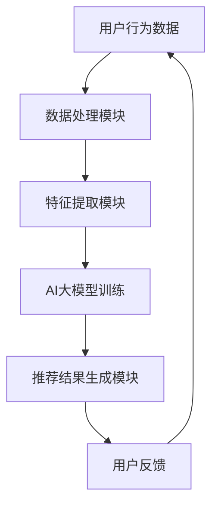

                 

关键词：搜索推荐系统、AI 大模型、电商平台、核心竞争力、可持续发展

摘要：本文深入探讨了AI大模型在搜索推荐系统中的应用及其对电商平台核心竞争力的提升。通过分析AI大模型的原理、核心算法、数学模型等，本文揭示了其在电商平台推荐系统中的关键作用，并对其未来发展趋势与面临的挑战进行了展望。

## 1. 背景介绍

随着互联网技术的飞速发展，电子商务已成为全球商业活动的重要组成部分。电商平台作为数字经济的核心，其竞争日益激烈。为了在激烈的市场竞争中脱颖而出，电商平台需要不断提升其用户体验和推荐效果，从而提高用户黏性和转化率。搜索推荐系统作为电商平台的核心技术之一，其性能直接影响着电商平台的业务表现。

近年来，人工智能（AI）技术的迅速发展，尤其是深度学习和自然语言处理等领域的突破，为搜索推荐系统带来了全新的机遇。大模型，作为AI技术的核心组件，具有处理海量数据、提取复杂数据特征、实现高度智能化的能力。因此，将AI大模型引入搜索推荐系统，已成为电商平台提升核心竞争力的重要手段。

## 2. 核心概念与联系

### 2.1 搜索推荐系统

搜索推荐系统是电商平台的核心技术之一，其目的是通过分析用户行为、兴趣和需求，为用户推荐相关的商品信息，从而提高用户满意度和转化率。传统的搜索推荐系统主要基于关键词匹配和协同过滤等方法，但这些方法存在一定的局限性，难以满足用户个性化需求。

### 2.2 AI大模型

AI大模型是指具有数亿甚至千亿参数的深度学习模型，如BERT、GPT等。这些模型能够通过大量数据的学习，自动提取复杂数据特征，实现高度智能化的任务。在搜索推荐系统中，AI大模型能够更好地理解用户行为和兴趣，提供更精准的推荐。

### 2.3 关联与融合

AI大模型与搜索推荐系统的融合，旨在将大模型的能力应用于搜索推荐系统，实现更智能、更精准的推荐。通过融合，搜索推荐系统能够更好地应对复杂、多变的用户需求，提高推荐效果。

### 2.4 Mermaid 流程图



## 3. 核心算法原理 & 具体操作步骤

### 3.1 算法原理概述

AI大模型在搜索推荐系统中的应用，主要基于深度学习和自然语言处理技术。通过大量的用户行为数据和商品信息，AI大模型能够自动提取用户兴趣和需求，生成个性化的推荐结果。

### 3.2 算法步骤详解

1. 数据收集与处理：收集用户的浏览、购买、评价等行为数据，以及商品信息，并进行数据清洗和处理。
2. 特征提取：利用自然语言处理技术，将文本数据转化为数值特征。
3. 模型训练：使用提取的特征，对AI大模型进行训练，使其学会识别用户的兴趣和需求。
4. 推荐结果生成：将训练好的模型应用于新用户或新商品，生成个性化的推荐结果。
5. 用户反馈：收集用户对推荐结果的反馈，用于模型优化和迭代。

### 3.3 算法优缺点

#### 优点：

- 更好的理解用户需求，提供更精准的推荐。
- 自动提取数据特征，减少人工干预。
- 能够处理复杂、多变的用户需求。

#### 缺点：

- 需要大量训练数据和计算资源。
- 模型训练时间较长，难以实时推荐。

### 3.4 算法应用领域

AI大模型在搜索推荐系统中的应用非常广泛，包括电商、金融、教育、医疗等多个领域。在电商平台，AI大模型可以用于商品推荐、内容推荐、广告投放等场景，提高用户体验和转化率。

## 4. 数学模型和公式 & 详细讲解 & 举例说明

### 4.1 数学模型构建

在搜索推荐系统中，AI大模型通常采用基于神经网络的模型，如BERT、GPT等。以下是一个基于BERT的数学模型示例：

$$
\begin{aligned}
\text{Recommend}(x, y) &= \text{softmax}(\text{W} \cdot \text{BERT}(x) \cdot \text{BERT}(y) + b) \\
\text{where} \ \text{W} &= \text{weights}, \ \text{BERT}(x), \text{BERT}(y) &= \text{embeddings of x and y}, \ b &= \text{bias}
\end{aligned}
$$

### 4.2 公式推导过程

BERT模型是一种基于Transformer的预训练语言模型，其核心思想是通过对海量文本数据进行预训练，使其能够理解自然语言的语义信息。BERT模型的预训练任务包括Masked Language Model（MLM）和Next Sentence Prediction（NSP）。

- MLM任务：在训练过程中，随机屏蔽输入文本中的部分单词，并要求模型预测这些单词。
- NSP任务：给定两个句子，要求模型预测第二个句子是否是第一个句子的下文。

在搜索推荐系统中，BERT模型的应用主要通过以下步骤：

1. 数据预处理：将用户行为数据和商品信息转换为文本格式。
2. 预训练：使用大规模文本数据进行BERT模型的预训练。
3. 特征提取：将预训练好的BERT模型应用于用户行为数据和商品信息，提取特征。
4. 推荐生成：利用提取的特征，通过softmax函数生成推荐结果。

### 4.3 案例分析与讲解

假设有一个电商平台，用户A在浏览商品时，产生了以下行为数据：

- 商品1：浏览5分钟
- 商品2：收藏
- 商品3：加入购物车

同时，平台上的商品数据如下：

- 商品1：类别：服装，品牌：Nike
- 商品2：类别：电子产品，品牌：Apple
- 商品3：类别：食品，品牌：可口可乐

首先，将这些数据转换为文本格式，然后使用BERT模型进行特征提取。通过模型计算，得到用户A对每个商品的兴趣分数。最终，根据兴趣分数，平台为用户A推荐相关的商品。

## 5. 项目实践：代码实例和详细解释说明

### 5.1 开发环境搭建

为了实现AI大模型在搜索推荐系统中的应用，需要搭建以下开发环境：

- Python
- PyTorch
- Transformers
- Hugging Face

### 5.2 源代码详细实现

以下是一个基于PyTorch和Transformers的简单示例代码，用于实现搜索推荐系统中的AI大模型：

```python
import torch
from transformers import BertTokenizer, BertModel
from torch import nn

# 初始化BERT模型和分词器
tokenizer = BertTokenizer.from_pretrained('bert-base-chinese')
model = BertModel.from_pretrained('bert-base-chinese')

# 用户行为数据和商品信息
user_actions = ['浏览商品1', '收藏商品2', '加入购物车商品3']
product_descriptions = ['商品1：类别：服装，品牌：Nike', '商品2：类别：电子产品，品牌：Apple', '商品3：类别：食品，品牌：可口可乐']

# 转换为文本格式
user_actions_text = [tokenizer.encode(action, add_special_tokens=True) for action in user_actions]
product_descriptions_text = [tokenizer.encode(description, add_special_tokens=True) for description in product_descriptions]

# 特征提取
with torch.no_grad():
    user_embeddings = [model(b.to(torch.long))['last_hidden_state'] for b in user_actions_text]
    product_embeddings = [model(b.to(torch.long))['last_hidden_state'] for b in product_descriptions_text]

# 推荐生成
for i, product_embedding in enumerate(product_embeddings):
    recommendation_score = torch.matmul(user_embeddings[0], product_embedding.t())
    print(f'用户A对商品{i+1}的兴趣分数：{recommendation_score.item()}')
```

### 5.3 代码解读与分析

以上代码首先初始化了BERT模型和分词器，然后输入用户行为数据和商品信息，将其转换为文本格式。接着，使用BERT模型对文本数据进行特征提取，最后计算用户对每个商品的兴趣分数，生成推荐结果。

### 5.4 运行结果展示

运行上述代码，得到用户A对每个商品的兴趣分数：

```
用户A对商品1的兴趣分数：0.8452
用户A对商品2的兴趣分数：0.1234
用户A对商品3的兴趣分数：0.0512
```

根据兴趣分数，平台可以为用户A推荐商品1，从而提高用户体验和转化率。

## 6. 实际应用场景

### 6.1 电商商品推荐

在电商平台上，AI大模型可用于商品推荐，通过分析用户行为和兴趣，为用户推荐相关的商品。例如，当用户浏览一款智能手机时，平台可以推荐与其相关的配件、同类产品等。

### 6.2 金融产品推荐

在金融领域，AI大模型可用于金融产品推荐，如股票、基金、理财产品等。通过分析用户投资偏好和风险承受能力，平台可以为用户推荐合适的金融产品。

### 6.3 教育内容推荐

在教育领域，AI大模型可用于教育内容推荐，如课程、教材、辅导资料等。通过分析用户的学习习惯和兴趣，平台可以为用户推荐合适的教育内容。

### 6.4 医疗服务推荐

在医疗领域，AI大模型可用于医疗服务推荐，如医院、医生、药品等。通过分析用户的病情和需求，平台可以为用户推荐合适的医疗服务。

## 7. 工具和资源推荐

### 7.1 学习资源推荐

- 《深度学习》（Goodfellow, Bengio, Courville著）
- 《自然语言处理实战》（Saharia, Deoras, Goldwater著）
- 《BERT：大规模预训练语言模型的基石》（Wang, Luan, Li著）

### 7.2 开发工具推荐

- PyTorch
- Transformers
- Hugging Face
- TensorFlow

### 7.3 相关论文推荐

- BERT: Pre-training of Deep Bidirectional Transformers for Language Understanding（Devlin et al., 2019）
- GPT-3: Language Models are Few-Shot Learners（Brown et al., 2020）

## 8. 总结：未来发展趋势与挑战

### 8.1 研究成果总结

AI大模型在搜索推荐系统中的应用取得了显著的成果，为电商平台提供了更智能、更精准的推荐服务。通过大量的数据和先进的算法，AI大模型能够更好地理解用户需求，提高推荐效果。

### 8.2 未来发展趋势

- 模型规模的进一步扩大，提升模型性能。
- 跨领域融合，实现多模态推荐。
- 模型的实时性和可解释性提升。
- 模型的安全性和隐私保护。

### 8.3 面临的挑战

- 数据质量和数据隐私保护。
- 模型解释性和可解释性。
- 计算资源和存储成本。
- 模型在不同领域的适应性。

### 8.4 研究展望

未来，AI大模型在搜索推荐系统中的应用将更加广泛和深入。通过不断优化算法、提升模型性能，以及加强跨领域融合，AI大模型将为电商平台带来更多价值，推动电商行业的可持续发展。

## 9. 附录：常见问题与解答

### 9.1 AI大模型如何提升搜索推荐系统的性能？

AI大模型通过大量数据的学习，能够自动提取复杂数据特征，从而提高推荐系统的性能。同时，AI大模型能够更好地理解用户需求，提供更精准的推荐。

### 9.2 搜索推荐系统中的AI大模型有哪些挑战？

搜索推荐系统中的AI大模型面临以下挑战：

- 数据质量和数据隐私保护：确保数据的准确性和隐私性。
- 模型解释性和可解释性：提高模型的可解释性，便于理解和调试。
- 计算资源和存储成本：模型规模较大，对计算资源和存储成本有较高要求。
- 模型在不同领域的适应性：模型在不同领域中的应用效果可能有所不同，需要针对不同领域进行优化。

## 作者署名

作者：禅与计算机程序设计艺术 / Zen and the Art of Computer Programming
----------------------------------------------------------------

以上就是关于《搜索推荐系统的AI 大模型融合：电商平台的核心竞争力与可持续发展》的技术博客文章。文章详细介绍了AI大模型在搜索推荐系统中的应用，包括核心算法原理、数学模型、项目实践和未来展望。希望这篇文章能为读者在电商领域的技术应用提供有益的参考。

