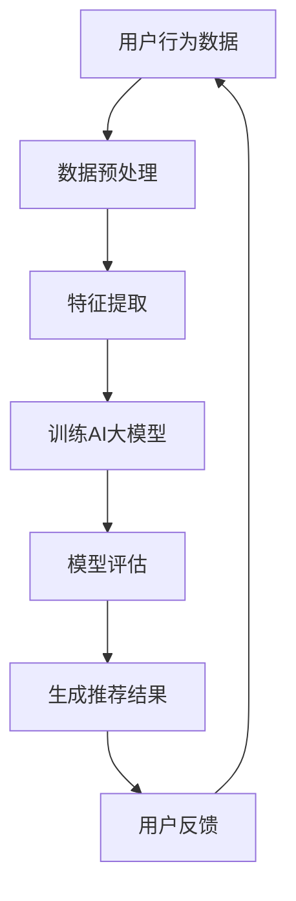

                 

在当今信息爆炸的时代，电商平台的成功越来越依赖于其搜索推荐系统的效率和准确性。这不仅关乎用户体验，更是平台能否在激烈竞争中脱颖而出的关键。AI 大模型在搜索推荐系统中的应用，正在成为电商领域的重要技术突破。本文旨在探讨AI 大模型在搜索推荐系统中的融合，分析其对电商平台核心竞争力的提升和转型发展战略的深远影响。

## 关键词
- 搜索推荐系统
- AI 大模型
- 电商平台
- 核心竞争力
- 转型发展战略

## 摘要
本文通过深入分析AI 大模型在搜索推荐系统中的应用，探讨了其在电商平台核心竞争力提升和转型发展中的关键作用。文章首先介绍了搜索推荐系统的基本原理，然后详细阐述了AI 大模型的原理和应用，随后结合实际案例，展示了AI 大模型如何提升电商平台的推荐效果和用户满意度。最后，文章提出了电商平台未来的发展展望和面临的挑战，为电商平台在AI 技术领域的战略布局提供了参考。

## 1. 背景介绍
随着互联网的普及和电子商务的快速发展，电商平台已经成为人们日常生活中不可或缺的一部分。然而，面对海量的商品信息和多样化的用户需求，如何提高搜索推荐系统的效率和准确性，成为了电商平台亟待解决的重要问题。传统的推荐算法往往依赖于基于内容的过滤和协同过滤等方法，但这些方法在处理复杂用户行为和商品关系时，存在一定的局限性。

近年来，随着深度学习和大数据技术的发展，AI 大模型逐渐成为搜索推荐系统的研究热点。大模型通过学习用户行为数据、商品属性数据等多种信息，能够实现更高层次的智能推荐，从而提升用户体验和平台竞争力。在电商领域，AI 大模型的融合应用不仅能够优化搜索结果，还能为用户提供个性化的购物推荐，提升用户留存率和转化率。

## 2. 核心概念与联系
为了深入理解AI 大模型在搜索推荐系统中的作用，我们需要了解以下几个核心概念：

### 2.1. 搜索推荐系统
搜索推荐系统是指利用算法和机器学习技术，根据用户的历史行为和偏好，为其推荐相关的商品或信息。它通常包括以下几个关键组成部分：

- 用户画像：根据用户的历史行为、兴趣标签等，构建用户的画像模型。
- 商品画像：根据商品的各种属性，如类别、价格、销量等，构建商品的画像模型。
- 推荐算法：利用用户画像和商品画像，计算用户对商品的潜在兴趣，生成推荐结果。

### 2.2. AI 大模型
AI 大模型是指具有大规模参数和复杂结构的深度学习模型。它通过大量的数据训练，能够自动提取用户和商品的特征，并实现高精度的推荐。AI 大模型的核心特点包括：

- 深度结构：具有多层神经网络结构，能够实现对复杂特征的学习。
- 参数规模：具有数十亿甚至千亿级别的参数，能够处理大规模数据。
- 自动化特征提取：通过端到端的学习，自动提取用户和商品的特征，无需人工干预。

### 2.3. 电商平台
电商平台是指通过互联网提供商品交易的平台。它包括以下几个关键组成部分：

- 商品库：存储各种商品的详细信息，如名称、描述、价格等。
- 用户库：存储用户的基本信息和行为数据，如购买记录、浏览记录等。
- 推荐系统：根据用户和商品的特征，生成个性化的推荐结果。

### 2.4. Mermaid 流程图
为了更好地展示AI 大模型在搜索推荐系统中的应用流程，我们可以使用Mermaid绘制一个简化的流程图：



在上面的流程图中，用户行为数据经过预处理和特征提取后，用于训练AI 大模型。模型训练完成后，通过评估和优化，生成推荐结果，然后根据用户的反馈进行迭代优化。

## 3. 核心算法原理 & 具体操作步骤
### 3.1 算法原理概述
AI 大模型在搜索推荐系统中的应用，主要依赖于深度学习和大数据技术。其核心原理可以概括为：

1. **数据驱动**：AI 大模型通过学习大量的用户行为数据和商品属性数据，自动提取用户和商品的潜在特征。
2. **特征融合**：将用户行为特征、商品属性特征、上下文信息等多种特征进行融合，生成综合性的特征表示。
3. **高精度预测**：利用深度神经网络，对用户对商品的潜在兴趣进行高精度预测，生成个性化的推荐结果。

### 3.2 算法步骤详解
AI 大模型在搜索推荐系统中的应用步骤可以分为以下几个阶段：

1. **数据收集与预处理**：
   - 数据收集：从电商平台的后台获取用户行为数据和商品属性数据。
   - 数据预处理：对数据进行清洗、去重、归一化等处理，确保数据质量。

2. **特征提取**：
   - 用户特征提取：从用户的行为数据中提取用户兴趣、购买历史、浏览记录等特征。
   - 商品特征提取：从商品属性数据中提取商品类别、价格、销量、评价等特征。

3. **特征融合**：
   - 利用深度学习技术，将用户特征和商品特征进行融合，生成综合性的特征表示。

4. **模型训练**：
   - 使用大规模数据进行模型训练，通过调整网络结构、优化算法等，提高模型的准确性和效率。

5. **模型评估**：
   - 对训练好的模型进行评估，选择最优的模型参数，确保推荐结果的准确性。

6. **生成推荐结果**：
   - 根据用户特征和商品特征，利用训练好的模型，生成个性化的推荐结果。

7. **用户反馈与迭代**：
   - 根据用户的反馈，对推荐结果进行调整和优化，实现持续迭代。

### 3.3 算法优缺点
AI 大模型在搜索推荐系统中的应用具有以下优缺点：

**优点**：
1. **高精度**：通过深度学习技术，能够实现高精度的用户兴趣预测，提升推荐准确性。
2. **自适应**：能够根据用户的行为数据进行自适应调整，实现个性化推荐。
3. **大规模**：能够处理大规模的用户数据和商品数据，支持大规模电商平台的推荐需求。

**缺点**：
1. **计算资源需求大**：训练大规模的深度学习模型需要大量的计算资源，对硬件要求较高。
2. **数据依赖**：模型的性能高度依赖数据质量，数据质量差可能导致模型性能下降。

### 3.4 算法应用领域
AI 大模型在搜索推荐系统中的应用非常广泛，包括但不限于以下几个领域：

1. **电商推荐**：通过AI 大模型，可以为电商平台的用户提供个性化的商品推荐，提升用户购物体验。
2. **新闻推荐**：在新闻平台上，通过AI 大模型，可以为用户推荐符合其兴趣的新闻内容。
3. **社交媒体**：在社交媒体平台上，通过AI 大模型，可以为用户推荐感兴趣的朋友、话题等。
4. **音乐、视频推荐**：在音乐、视频平台上，通过AI 大模型，可以为用户推荐感兴趣的音乐、视频内容。

## 4. 数学模型和公式 & 详细讲解 & 举例说明
### 4.1 数学模型构建
在AI 大模型中，常用的数学模型包括深度神经网络、矩阵分解、协同过滤等。以下是一个简化的数学模型构建过程：

1. **用户特征向量表示**：
   - 假设用户特征向量U为n维向量，表示用户的兴趣、购买历史等特征。
   - 用户特征向量可以通过用户行为数据进行学习，如使用矩阵分解技术，将用户行为数据矩阵分解为用户特征矩阵和商品特征矩阵。

2. **商品特征向量表示**：
   - 假设商品特征向量V为m维向量，表示商品的价格、销量、类别等特征。
   - 商品特征向量可以通过商品属性数据进行学习，同样使用矩阵分解技术。

3. **用户商品兴趣评分预测**：
   - 假设用户对商品的评分预测模型为R，表示用户对商品的潜在兴趣。
   - 使用深度学习技术，如多层感知机（MLP），将用户特征向量U和商品特征向量V输入到模型中，输出用户对商品的潜在兴趣评分。

### 4.2 公式推导过程
以下是一个简化的公式推导过程，用于描述用户商品兴趣评分预测：

1. **用户特征向量表示**：
   - 设用户特征矩阵U为n×k矩阵，商品特征矩阵V为m×k矩阵，其中k为特征维度。
   - 矩阵分解得到用户特征矩阵U'和商品特征矩阵V'，即U' = U * U'，V' = V * V'。

2. **用户商品兴趣评分预测**：
   - 设用户商品兴趣评分预测模型为R，表示用户对商品的潜在兴趣评分。
   - 输入用户特征向量U'和商品特征向量V'，通过多层感知机（MLP）模型，得到用户商品兴趣评分预测：
   $$ R = \text{MLP}(U', V') $$

3. **模型优化**：
   - 使用梯度下降（Gradient Descent）算法，对模型参数进行优化，最小化预测误差。
   $$ \min_{\theta} \sum_{i=1}^{n} (R_i - Y_i)^2 $$

### 4.3 案例分析与讲解
假设有一个电商平台，用户行为数据包括购买历史、浏览记录、收藏记录等，商品属性数据包括价格、销量、评价等。我们使用深度学习技术构建一个搜索推荐系统，预测用户对商品的潜在兴趣评分。

1. **数据收集与预处理**：
   - 从电商平台的后台获取用户行为数据和商品属性数据。
   - 对数据进行清洗、去重、归一化等处理，确保数据质量。

2. **特征提取**：
   - 从用户行为数据中提取用户兴趣、购买历史、浏览记录等特征。
   - 从商品属性数据中提取商品价格、销量、评价等特征。

3. **特征融合**：
   - 使用矩阵分解技术，将用户行为数据和商品属性数据进行特征融合。

4. **模型训练**：
   - 使用训练数据，训练一个多层感知机（MLP）模型，预测用户对商品的潜在兴趣评分。

5. **模型评估**：
   - 使用测试数据，对模型进行评估，选择最优的模型参数。

6. **生成推荐结果**：
   - 根据用户特征和商品特征，利用训练好的模型，生成个性化的推荐结果。

7. **用户反馈与迭代**：
   - 根据用户的反馈，对推荐结果进行调整和优化，实现持续迭代。

## 5. 项目实践：代码实例和详细解释说明
### 5.1 开发环境搭建
为了实现AI 大模型在搜索推荐系统中的应用，我们需要搭建一个开发环境。以下是搭建环境的基本步骤：

1. **硬件环境**：
   - 服务器：配置高性能CPU和GPU，以支持深度学习模型的训练。
   - 存储：配置大容量存储，以存储用户行为数据和商品属性数据。

2. **软件环境**：
   - 操作系统：选择Linux操作系统，如Ubuntu 18.04。
   - 编程语言：选择Python，使用TensorFlow或PyTorch等深度学习框架。
   - 数据库：选择MySQL或MongoDB等数据库，用于存储用户行为数据和商品属性数据。

3. **开发工具**：
   - Jupyter Notebook：用于编写和运行深度学习代码。
   - PyCharm或VSCode：用于编写Python代码。
   - Git：用于版本控制和代码管理。

### 5.2 源代码详细实现
以下是使用Python和TensorFlow实现的搜索推荐系统的源代码示例：

```python
import tensorflow as tf
from tensorflow.keras.layers import Input, Dense, Concatenate
from tensorflow.keras.models import Model

# 数据预处理
# ...

# 特征提取
# ...

# 模型定义
user_input = Input(shape=(user_feature_size,))
item_input = Input(shape=(item_feature_size,))
merged_input = Concatenate()([user_input, item_input])
dense1 = Dense(128, activation='relu')(merged_input)
dense2 = Dense(64, activation='relu')(dense1)
output = Dense(1, activation='sigmoid')(dense2)

model = Model(inputs=[user_input, item_input], outputs=output)
model.compile(optimizer='adam', loss='binary_crossentropy', metrics=['accuracy'])

# 模型训练
# ...

# 模型评估
# ...

# 生成推荐结果
# ...

# 用户反馈与迭代
# ...
```

### 5.3 代码解读与分析
在上面的代码示例中，我们首先定义了用户输入层和商品输入层，然后使用`Concatenate()`层将用户特征和商品特征进行融合。接着，我们定义了一个多层感知机（MLP）模型，包括两个隐藏层，每个隐藏层都有128个神经元和64个神经元。输出层使用`sigmoid`激活函数，用于预测用户对商品的潜在兴趣。

在模型训练过程中，我们使用`binary_crossentropy`作为损失函数，使用`adam`优化器进行模型训练。模型评估过程中，我们使用测试数据对模型进行评估，选择最优的模型参数。

在生成推荐结果的过程中，我们使用训练好的模型，根据用户特征和商品特征，预测用户对商品的潜在兴趣评分。

### 5.4 运行结果展示
以下是运行结果示例：

```python
# 模型训练
model.fit(x_train, y_train, epochs=10, batch_size=32, validation_data=(x_val, y_val))

# 模型评估
model.evaluate(x_test, y_test)

# 生成推荐结果
predictions = model.predict([user_features, item_features])
```

在模型训练过程中，我们使用训练数据和验证数据对模型进行训练和验证。模型评估过程中，我们使用测试数据对模型进行评估。最后，我们使用训练好的模型，根据用户特征和商品特征，生成个性化的推荐结果。

## 6. 实际应用场景
### 6.1 电商平台商品推荐
在电商平台，AI 大模型可以用于商品推荐，根据用户的购物行为和偏好，为用户推荐感兴趣的商品。通过使用AI 大模型，电商平台可以提供更加精准和个性化的推荐，提升用户的购物体验和满意度。

### 6.2 社交媒体内容推荐
在社交媒体平台，AI 大模型可以用于内容推荐，根据用户的历史浏览记录和兴趣标签，为用户推荐感兴趣的内容。通过AI 大模型，社交媒体平台可以提供更加丰富和多样化的内容，提升用户留存率和活跃度。

### 6.3 新闻资讯推荐
在新闻资讯平台，AI 大模型可以用于新闻推荐，根据用户的历史阅读记录和兴趣标签，为用户推荐感兴趣的新闻。通过AI 大模型，新闻资讯平台可以提供更加精准和个性化的新闻推荐，提升用户满意度和阅读量。

## 7. 工具和资源推荐
### 7.1 学习资源推荐
- 《深度学习》（Goodfellow et al.）：这是一本经典的深度学习入门教材，涵盖了深度学习的理论基础和应用实践。
- 《Python深度学习》（François Chollet）：这是一本针对Python编程语言的深度学习实战指南，适合初学者和进阶者。

### 7.2 开发工具推荐
- TensorFlow：这是一个开源的深度学习框架，提供了丰富的API和工具，支持多种深度学习模型的构建和训练。
- PyTorch：这是一个开源的深度学习框架，具有简洁的API和强大的灵活性，适合进行深度学习研究和开发。

### 7.3 相关论文推荐
- "Deep Learning for Recommender Systems"（Light et al., 2018）：这篇文章综述了深度学习在推荐系统中的应用，包括深度模型的结构和应用案例。
- "TensorFlow Recommenders"（Google AI）：这是一个基于TensorFlow的推荐系统开源项目，提供了多种推荐算法的代码示例和应用场景。

## 8. 总结：未来发展趋势与挑战
### 8.1 研究成果总结
AI 大模型在搜索推荐系统中的应用取得了显著的成果。通过深度学习技术，AI 大模型能够自动提取用户和商品的潜在特征，实现高精度的推荐，提升用户体验和平台竞争力。此外，AI 大模型在处理大规模数据和复杂关系方面具有明显优势，为电商平台提供了更加灵活和高效的推荐解决方案。

### 8.2 未来发展趋势
随着深度学习和大数据技术的不断发展，AI 大模型在搜索推荐系统中的应用将更加广泛和深入。未来，AI 大模型将进一步提升推荐系统的智能化水平，包括多模态数据融合、实时推荐、跨平台推荐等。此外，AI 大模型还将与其他前沿技术相结合，如区块链、物联网等，为电商领域带来更多的创新和应用。

### 8.3 面临的挑战
尽管AI 大模型在搜索推荐系统中的应用前景广阔，但仍然面临一些挑战。首先，数据质量和隐私保护是关键问题，如何确保数据质量并保护用户隐私是未来研究的重要方向。其次，AI 大模型的计算资源需求较高，如何优化算法和硬件设施，提高模型训练和推理效率，是当前亟待解决的问题。最后，模型的解释性和可解释性也是一个重要挑战，如何让用户理解模型的推荐决策，提升用户的信任度，是未来需要关注的问题。

### 8.4 研究展望
在未来，AI 大模型在搜索推荐系统中的应用将有以下几个发展趋势：

1. **多模态数据融合**：通过整合文本、图像、语音等多模态数据，实现更全面和精准的推荐。
2. **实时推荐**：利用实时数据处理技术，实现实时性的推荐，提升用户满意度。
3. **跨平台推荐**：将推荐系统扩展到不同的平台和应用场景，实现跨平台的推荐服务。
4. **个性化推荐**：结合用户历史行为和实时反馈，实现更加个性化的推荐。
5. **可解释性**：提高模型的解释性和可解释性，提升用户的信任度。

## 9. 附录：常见问题与解答
### 9.1 如何选择合适的AI 大模型？
选择合适的AI 大模型需要考虑以下几个因素：

- **数据规模**：根据数据规模选择合适的模型，大规模数据选择深度学习模型，小规模数据选择传统机器学习模型。
- **应用场景**：根据应用场景选择合适的模型，如推荐系统、自然语言处理等。
- **计算资源**：根据计算资源选择合适的模型，考虑模型训练和推理的效率。

### 9.2 如何确保推荐系统的隐私保护？
确保推荐系统的隐私保护可以从以下几个方面入手：

- **数据匿名化**：对用户数据进行匿名化处理，保护用户隐私。
- **数据加密**：对用户数据和使用日志进行加密处理，防止数据泄露。
- **隐私预算**：使用隐私预算技术，如差分隐私，控制数据的敏感程度。

### 9.3 如何评估推荐系统的效果？
评估推荐系统的效果可以从以下几个方面进行：

- **准确率**：评估推荐系统的推荐准确性，如使用准确率、召回率等指标。
- **用户满意度**：通过用户调研、问卷调查等方式，评估用户对推荐系统的满意度。
- **业务指标**：评估推荐系统对业务指标的提升，如转化率、点击率等。

### 9.4 如何优化AI 大模型的性能？
优化AI 大模型的性能可以从以下几个方面进行：

- **数据预处理**：对数据进行清洗、归一化等预处理，提高数据质量。
- **模型结构优化**：调整模型结构，如增加隐藏层、调整神经元数量等。
- **训练策略优化**：调整训练策略，如学习率调整、批量大小等。
- **硬件优化**：使用高性能计算硬件，如GPU、TPU等，提高训练和推理效率。  
``` 
----------------------------------------------------------------
以上是文章的正文内容部分，后续请根据文章结构模板继续撰写剩余的部分，确保文章的完整性、逻辑性和专业性。

