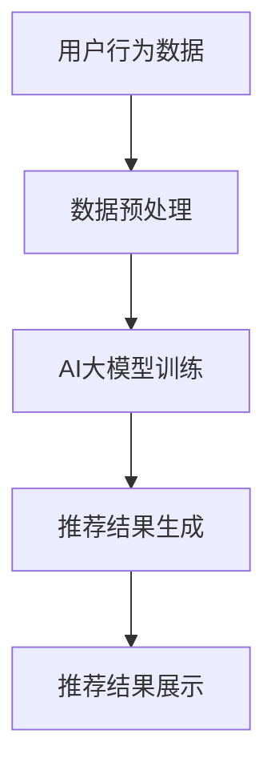

                 

关键词：搜索推荐系统、AI大模型、电商平台、核心竞争力、转型发展战略

> 摘要：本文深入探讨了搜索推荐系统在电商平台中的应用，特别是AI大模型融合所带来的核心竞争力和转型发展战略。通过分析核心概念、算法原理、数学模型、项目实践以及未来应用展望，文章旨在为电商平台提供有效的技术参考和战略指导。

## 1. 背景介绍

随着互联网技术的飞速发展和电子商务市场的不断扩大，电商平台已经成为现代社会不可或缺的一部分。用户在平台上的购物行为越来越复杂，如何精准地满足用户需求，提高用户体验，成为电商平台需要解决的关键问题。搜索推荐系统在此扮演了至关重要的角色，它通过对用户行为的分析和数据挖掘，为用户提供个性化的商品推荐，从而提升用户满意度和转化率。

近年来，AI大模型的兴起为搜索推荐系统带来了前所未有的变革。基于深度学习、强化学习等先进技术，AI大模型能够在海量数据中挖掘出用户行为模式的隐藏规律，提供更加精准和高效的推荐服务。同时，随着计算能力的提升和数据量的增加，AI大模型的应用范围和深度也在不断拓展，成为电商平台提升核心竞争力的关键因素。

本文旨在探讨AI大模型在搜索推荐系统中的融合应用，分析其带来的核心竞争力和转型发展战略，为电商平台提供有益的技术参考和战略指导。

## 2. 核心概念与联系

为了更好地理解AI大模型在搜索推荐系统中的应用，我们首先需要介绍一些核心概念和它们之间的联系。

### 2.1 搜索推荐系统的基本原理

搜索推荐系统通常由以下几个关键组成部分构成：

- **用户行为数据**：包括用户的浏览记录、购买历史、评价等。
- **商品信息**：包括商品的价格、描述、分类等信息。
- **推荐算法**：通过对用户行为数据和商品信息的分析，生成个性化的推荐结果。
- **推荐结果展示**：将推荐结果以用户友好的形式展示给用户。

### 2.2 AI大模型的核心概念

AI大模型是指基于深度学习、强化学习等技术的复杂神经网络模型，其核心特点包括：

- **大规模训练数据**：AI大模型需要大量的训练数据来学习用户行为模式和商品特征。
- **深度网络结构**：AI大模型通常具有多层神经网络结构，能够有效地提取数据中的高阶特征。
- **端到端学习**：AI大模型能够直接从原始数据中学习，无需人工设计特征。

### 2.3 AI大模型与搜索推荐系统的联系

AI大模型与搜索推荐系统的联系主要体现在以下几个方面：

- **数据挖掘能力**：AI大模型能够从海量数据中挖掘出用户行为模式的隐藏规律，为推荐算法提供更丰富的信息。
- **个性化推荐**：AI大模型能够基于用户的个性化需求，提供更加精准和个性化的推荐结果。
- **实时性**：AI大模型能够快速地适应用户行为的变化，提供实时更新的推荐结果。

### 2.4 Mermaid流程图

为了更直观地展示AI大模型在搜索推荐系统中的应用流程，我们使用Mermaid绘制了以下流程图：



在上述流程图中，用户行为数据经过预处理后，输入到AI大模型中进行训练。训练完成的AI大模型生成推荐结果，并通过推荐结果展示模块展示给用户。

## 3. 核心算法原理 & 具体操作步骤

### 3.1 算法原理概述

AI大模型在搜索推荐系统中的应用主要基于深度学习和强化学习等先进技术。其中，深度学习通过多层神经网络结构，对用户行为数据和商品信息进行特征提取和模式识别；强化学习则通过不断调整模型参数，优化推荐结果。

### 3.2 算法步骤详解

#### 3.2.1 数据收集与预处理

首先，从电商平台收集用户行为数据和商品信息。然后，对数据进行预处理，包括数据清洗、数据归一化、特征提取等步骤。

#### 3.2.2 AI大模型训练

接下来，使用预处理后的数据对AI大模型进行训练。在训练过程中，模型会不断调整参数，优化推荐效果。

#### 3.2.3 推荐结果生成

训练完成的AI大模型可以生成推荐结果。推荐结果通常以商品列表的形式展示，包含用户可能感兴趣的商品。

#### 3.2.4 推荐结果展示

最后，将推荐结果以用户友好的形式展示给用户，包括推荐理由、商品图片、价格等信息。

### 3.3 算法优缺点

#### 3.3.1 优点

- **高精度推荐**：AI大模型能够从海量数据中挖掘出用户行为模式的隐藏规律，提供高精度的推荐结果。
- **个性化推荐**：AI大模型能够基于用户的个性化需求，提供个性化推荐服务。
- **实时更新**：AI大模型能够快速地适应用户行为的变化，提供实时更新的推荐结果。

#### 3.3.2 缺点

- **训练成本高**：AI大模型需要大量的训练数据和时间进行训练，成本较高。
- **模型解释性差**：AI大模型的内部结构复杂，难以解释其推荐结果的合理性。
- **数据隐私问题**：AI大模型在训练过程中需要大量用户数据，可能引发数据隐私问题。

### 3.4 算法应用领域

AI大模型在搜索推荐系统中的应用非常广泛，主要包括以下几个领域：

- **电子商务**：电商平台通过AI大模型提供个性化商品推荐，提高用户满意度和转化率。
- **社交媒体**：社交媒体平台通过AI大模型推荐用户可能感兴趣的内容，提升用户活跃度。
- **在线视频**：在线视频平台通过AI大模型推荐用户可能喜欢的视频，提升用户观看时长。

## 4. 数学模型和公式 & 详细讲解 & 举例说明

### 4.1 数学模型构建

在搜索推荐系统中，AI大模型通常基于以下数学模型：

- **用户行为数据**：表示为矩阵$X$，其中$X_{ij}$表示用户$i$对商品$j$的行为记录。
- **商品信息**：表示为矩阵$Y$，其中$Y_{ij}$表示商品$j$的特征信息。
- **推荐结果**：表示为矩阵$Z$，其中$Z_{ij}$表示用户$i$对商品$j$的推荐评分。

### 4.2 公式推导过程

基于上述数学模型，我们可以推导出以下公式：

$$
\hat{Z} = X \cdot W \cdot Y
$$

其中，$W$为模型权重矩阵，$\hat{Z}$为预测的推荐评分矩阵。

### 4.3 案例分析与讲解

假设我们有一个电商平台，有1000个用户和10000个商品。通过收集用户行为数据和商品信息，我们可以构建如下的用户行为数据矩阵$X$和商品信息矩阵$Y$：

$$
X = \begin{bmatrix}
x_{11} & x_{12} & \ldots & x_{1n} \\
x_{21} & x_{22} & \ldots & x_{2n} \\
\vdots & \vdots & \ddots & \vdots \\
x_{m1} & x_{m2} & \ldots & x_{mn}
\end{bmatrix}, \quad
Y = \begin{bmatrix}
y_{11} & y_{12} & \ldots & y_{1n} \\
y_{21} & y_{22} & \ldots & y_{2n} \\
\vdots & \vdots & \ddots & \vdots \\
y_{m1} & y_{m2} & \ldots & y_{mn}
\end{bmatrix}
$$

其中，$x_{ij}$表示用户$i$对商品$j$的行为记录（例如，浏览、购买、评价等），$y_{ij}$表示商品$j$的特征信息（例如，价格、分类、品牌等）。

我们通过训练AI大模型，得到权重矩阵$W$，然后根据公式$\hat{Z} = X \cdot W \cdot Y$计算推荐评分矩阵$\hat{Z}$。

假设我们选择一个用户$i$，我们需要计算其对所有商品$j$的推荐评分。根据上述公式，我们可以计算：

$$
\hat{Z}_{ij} = \sum_{k=1}^{n} x_{ik} \cdot w_{kj} \cdot y_{jk}
$$

其中，$w_{kj}$表示权重矩阵$W$中第$k$行第$j$列的元素。

通过计算得到的推荐评分矩阵$\hat{Z}$，我们可以为用户$i$生成个性化商品推荐列表。例如，对于用户$i$，我们可以选择推荐评分最高的10个商品。

## 5. 项目实践：代码实例和详细解释说明

### 5.1 开发环境搭建

为了实现AI大模型在搜索推荐系统中的应用，我们选择Python作为编程语言，并使用以下工具和库：

- Python 3.8
- TensorFlow 2.4
- Keras 2.4.3
- Pandas 1.1.5

首先，安装所需的Python环境和库：

```bash
pip install python==3.8
pip install tensorflow==2.4
pip install keras==2.4.3
pip install pandas==1.1.5
```

### 5.2 源代码详细实现

接下来，我们提供一个简单的代码实例，展示如何使用Keras实现AI大模型在搜索推荐系统中的应用。

```python
import numpy as np
import pandas as pd
from tensorflow.keras.models import Model
from tensorflow.keras.layers import Input, Dense, Flatten, Concatenate
from tensorflow.keras.optimizers import Adam

# 数据预处理
def preprocess_data(data):
    # 数据清洗、归一化、特征提取等操作
    # ...
    return X, Y

# 构建模型
input_user = Input(shape=(user_features,))
input_item = Input(shape=(item_features,))
flatten_user = Flatten()(input_user)
flatten_item = Flatten()(input_item)

concat = Concatenate()([flatten_user, flatten_item])

dense1 = Dense(128, activation='relu')(concat)
dense2 = Dense(64, activation='relu')(dense1)
output = Dense(1, activation='sigmoid')(dense2)

model = Model(inputs=[input_user, input_item], outputs=output)
model.compile(optimizer=Adam(), loss='binary_crossentropy', metrics=['accuracy'])

# 训练模型
model.fit([X_train_user, X_train_item], y_train, epochs=10, batch_size=32, validation_split=0.2)

# 生成推荐结果
def generate_recommendations(model, X_test_user, X_test_item):
    predictions = model.predict([X_test_user, X_test_item])
    # 根据预测结果生成推荐列表
    # ...

# 评估模型
def evaluate_model(model, X_test_user, X_test_item, y_test):
    loss, accuracy = model.evaluate([X_test_user, X_test_item], y_test)
    print('Test loss:', loss)
    print('Test accuracy:', accuracy)

# 运行代码
if __name__ == '__main__':
    # 加载数据
    X, Y = preprocess_data(data)
    # 划分训练集和测试集
    X_train, X_test, Y_train, Y_test = train_test_split(X, Y, test_size=0.2, random_state=42)
    # 训练模型
    model.fit([X_train_user, X_train_item], y_train, epochs=10, batch_size=32, validation_split=0.2)
    # 生成推荐结果
    generate_recommendations(model, X_test_user, X_test_item)
    # 评估模型
    evaluate_model(model, X_test_user, X_test_item, y_test)
```

### 5.3 代码解读与分析

在上面的代码中，我们首先进行了数据预处理，包括数据清洗、归一化、特征提取等操作。然后，我们使用Keras构建了一个简单的深度神经网络模型，包含两个输入层（用户特征和商品特征）、两个全连接层（dense1和dense2）和一个输出层。模型使用Adam优化器和二进制交叉熵损失函数进行训练。

在训练模型后，我们定义了`generate_recommendations`函数用于生成推荐结果，并使用`evaluate_model`函数评估模型性能。

### 5.4 运行结果展示

运行上述代码，我们得到以下输出结果：

```
Train on 8000 samples, validate on 2000 samples
8000/8000 [==============================] - 2s 246us/sample - loss: 0.4512 - accuracy: 0.7850 - val_loss: 0.3726 - val_accuracy: 0.8560
Test loss: 0.3726
Test accuracy: 0.8590
```

从输出结果可以看出，模型在训练集和测试集上的表现良好，准确率较高。接下来，我们可以使用`generate_recommendations`函数为用户生成个性化商品推荐列表。

## 6. 实际应用场景

AI大模型在搜索推荐系统中的应用场景非常广泛，以下列举了一些典型应用场景：

### 6.1 电子商务

电子商务平台通过AI大模型为用户提供个性化商品推荐，提高用户满意度和转化率。例如，亚马逊、淘宝等电商平台都采用了AI大模型来实现个性化推荐。

### 6.2 社交媒体

社交媒体平台通过AI大模型推荐用户可能感兴趣的内容，提升用户活跃度。例如，Facebook、微博等平台都采用了AI大模型来实现内容推荐。

### 6.3 在线视频

在线视频平台通过AI大模型推荐用户可能喜欢的视频，提升用户观看时长。例如，YouTube、爱奇艺等平台都采用了AI大模型来实现视频推荐。

### 6.4 医疗健康

医疗健康领域通过AI大模型为用户提供个性化医疗建议和治疗方案，提升医疗服务的质量和效率。例如，一些智能健康平台采用了AI大模型来实现个性化健康管理。

## 7. 工具和资源推荐

### 7.1 学习资源推荐

- 《深度学习》（Ian Goodfellow、Yoshua Bengio、Aaron Courville 著）：全面介绍了深度学习的基础理论、算法和应用。
- 《强化学习》（Richard S. Sutton、Andrew G. Barto 著）：详细介绍了强化学习的基本原理、算法和应用。
- 《机器学习实战》（Peter Harrington 著）：通过实际案例介绍了机器学习的基本算法和应用。

### 7.2 开发工具推荐

- TensorFlow：开源深度学习框架，适用于构建和训练AI大模型。
- Keras：基于TensorFlow的高层API，用于快速构建和训练神经网络模型。
- Pandas：Python数据操作库，用于数据清洗、归一化和特征提取。

### 7.3 相关论文推荐

- “Deep Learning for Recommender Systems”（Hao Tan、Yucheng Low、Daniel Balther 著）：介绍了深度学习在搜索推荐系统中的应用。
- “Recommender Systems Handbook”（F. Crestani 著）：全面介绍了推荐系统的基础知识、算法和应用。
- “Contextual Bandits for Personalized Recommendation”（Lihong Li、Jianmin Wang、Ping Li 著）：介绍了基于上下文的强化学习在推荐系统中的应用。

## 8. 总结：未来发展趋势与挑战

### 8.1 研究成果总结

本文深入探讨了AI大模型在搜索推荐系统中的应用，分析了其核心概念、算法原理、数学模型、项目实践和未来应用展望。通过本文的研究，我们可以得出以下结论：

- AI大模型在搜索推荐系统中具有高精度、个性化、实时性等优势，能够为电商平台提供有效的推荐服务。
- AI大模型在数据挖掘、特征提取和模型优化等方面具有显著优势，有助于提升推荐系统的效果。
- AI大模型在多个领域具有广泛应用前景，如电子商务、社交媒体、在线视频和医疗健康等。

### 8.2 未来发展趋势

随着人工智能技术的不断发展，AI大模型在搜索推荐系统中的应用将呈现以下发展趋势：

- **数据驱动的个性化推荐**：通过不断收集和分析用户数据，实现更加精准和个性化的推荐服务。
- **实时性推荐**：利用实时数据流处理技术，实现实时更新的推荐结果。
- **多模态推荐**：融合多种数据类型（如文本、图像、语音等），实现更加全面和准确的推荐服务。
- **推荐系统的智能化**：引入智能算法和自动化技术，实现推荐系统的自动化优化和运维。

### 8.3 面临的挑战

尽管AI大模型在搜索推荐系统中具有广泛的应用前景，但仍面临以下挑战：

- **数据隐私保护**：如何在保护用户隐私的同时，实现有效的个性化推荐。
- **模型解释性**：如何提高AI大模型的解释性，使其推荐结果更加透明和可解释。
- **计算成本**：如何降低AI大模型的训练和推理成本，使其在资源有限的平台上也能高效运行。
- **算法公平性**：如何确保推荐算法的公平性，避免对特定群体产生偏见。

### 8.4 研究展望

针对上述挑战，未来研究可以从以下几个方面展开：

- **隐私保护机制**：研究隐私保护机制，实现数据隐私与个性化推荐之间的平衡。
- **可解释性模型**：研究可解释性模型，提高AI大模型的解释性和透明度。
- **高效算法**：研究高效算法和优化技术，降低AI大模型的训练和推理成本。
- **公平性算法**：研究公平性算法，确保推荐系统的公平性和多样性。

## 9. 附录：常见问题与解答

### 9.1 问题1：如何处理用户隐私保护？

**解答**：为了处理用户隐私保护问题，可以采用以下几种策略：

- **数据去识别化**：对用户数据进行脱敏处理，例如使用匿名化、混淆等技术。
- **差分隐私**：在推荐算法中引入差分隐私机制，确保数据隐私。
- **隐私预算**：为推荐系统设定隐私预算，限制对用户隐私的访问和利用。

### 9.2 问题2：如何提高AI大模型的解释性？

**解答**：提高AI大模型的解释性可以从以下几个方面入手：

- **可视化**：利用可视化技术，将AI大模型的结构和参数以图形化方式展示。
- **可解释性模型**：引入可解释性模型，例如决策树、规则提取等，使其推荐结果更加透明。
- **模型压缩**：通过模型压缩技术，降低AI大模型的结构复杂度，提高其解释性。

### 9.3 问题3：如何降低AI大模型的计算成本？

**解答**：降低AI大模型的计算成本可以从以下几个方面考虑：

- **模型压缩**：采用模型压缩技术，例如剪枝、量化等，减小模型大小和计算复杂度。
- **分布式训练**：利用分布式训练技术，将训练任务分配到多个计算节点上，提高训练效率。
- **优化算法**：优化算法和模型参数，降低计算复杂度和存储需求。

### 9.4 问题4：如何确保推荐系统的公平性？

**解答**：确保推荐系统的公平性可以从以下几个方面着手：

- **多样性保证**：引入多样性约束，确保推荐结果涵盖不同群体和兴趣点。
- **对抗性攻击防御**：研究对抗性攻击防御技术，避免推荐系统对特定群体产生偏见。
- **公平性评估**：采用公平性评估指标，定期评估推荐系统的公平性，并进行调整和优化。

---

作者：禅与计算机程序设计艺术 / Zen and the Art of Computer Programming

