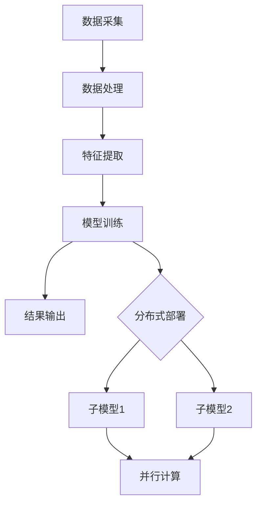

                 

 关键词：搜索推荐系统、实时性能优化、大模型、分布式部署、算法原理、数学模型、项目实践

> 摘要：本文深入探讨了搜索推荐系统实时性能优化中的关键技术——大模型的分布式部署。通过阐述其核心概念、算法原理、数学模型及项目实践，本文旨在为读者提供一套系统的解决方案，以应对大规模数据场景下的性能挑战。

## 1. 背景介绍

随着互联网的快速发展，大数据和人工智能技术逐渐成为各行各业的核心驱动力。尤其是在搜索推荐系统领域，如何提升系统的实时性能，以满足用户日益增长的需求，成为了一个亟待解决的问题。传统集中式架构在大数据量处理时面临性能瓶颈，而分布式部署则成为了解决这一问题的有效途径。

大模型的分布式部署旨在将一个庞大的模型拆分成多个较小的子模型，并通过分布式计算架构进行协同工作，从而提高系统的处理能力和效率。这种方法不仅能够降低单个节点的负载，还能够有效利用分布式资源，提高系统的可扩展性和容错能力。

本文将围绕大模型的分布式部署展开，首先介绍搜索推荐系统的基本原理和当前面临的性能瓶颈，然后深入探讨分布式部署的算法原理、数学模型及具体实现方法，最后通过一个实际项目案例进行详细讲解，并展望未来的应用前景。

## 2. 核心概念与联系

在深入探讨大模型的分布式部署之前，我们需要了解一些核心概念，包括搜索推荐系统的工作原理、分布式计算架构以及大模型的组成和分解方法。

### 2.1 搜索推荐系统的工作原理

搜索推荐系统通常由三个主要部分组成：数据采集、模型训练和结果输出。数据采集负责收集用户的搜索历史、点击行为等数据，模型训练则利用这些数据训练出一个推荐模型，结果输出则是将模型输出推荐给用户。

搜索推荐系统的工作原理可以分为以下几个步骤：

1. **数据采集**：通过API、日志等方式收集用户的搜索请求、浏览历史、购买记录等数据。
2. **数据处理**：对采集到的数据进行预处理，包括数据清洗、去重、填充缺失值等。
3. **特征提取**：将预处理后的数据转化为模型可理解的向量表示。
4. **模型训练**：利用特征向量训练推荐模型，通常采用机器学习算法，如协同过滤、矩阵分解等。
5. **结果输出**：将训练好的模型应用于新的用户请求，输出推荐结果。

### 2.2 分布式计算架构

分布式计算架构是指将一个大型任务分解为多个子任务，由多个节点共同完成的一种计算模式。分布式计算架构具有以下几个特点：

1. **并行计算**：多个节点同时处理不同的子任务，提高了系统的处理速度。
2. **负载均衡**：根据节点的处理能力动态分配任务，避免单点瓶颈。
3. **容错性**：某个节点故障时，其他节点可以继续工作，保证了系统的可靠性。
4. **可扩展性**：系统可以根据需要动态增加节点，提高了系统的可扩展性。

常见的分布式计算框架包括MapReduce、Spark、Flink等。这些框架提供了高效的数据处理和分布式计算能力，为搜索推荐系统的实时性能优化提供了强有力的支持。

### 2.3 大模型的组成和分解方法

大模型是指模型参数规模庞大的模型，通常由多个子模型组成。为了便于分布式部署，需要将大模型分解为多个较小的子模型，每个子模型分别部署在不同的节点上。

大模型的分解方法可以分为以下几种：

1. **横向分解**：将大模型按照特征维度进行分解，每个子模型负责处理一部分特征。
2. **纵向分解**：将大模型按照参数维度进行分解，每个子模型负责一部分参数。
3. **混合分解**：结合横向分解和纵向分解，对大模型进行多维度的分解。

### 2.4 Mermaid 流程图

以下是搜索推荐系统大模型分布式部署的 Mermaid 流程图：



## 3. 核心算法原理 & 具体操作步骤

### 3.1 算法原理概述

大模型的分布式部署主要依赖于分布式计算框架和模型并行化技术。其核心思想是将大模型分解为多个子模型，并利用分布式计算框架进行并行计算，从而提高系统的实时性能。

### 3.2 算法步骤详解

1. **数据预处理**：对采集到的原始数据进行清洗、去重、填充缺失值等预处理操作。
2. **特征提取**：将预处理后的数据转化为模型可理解的向量表示。
3. **模型分解**：根据特征维度或参数维度，将大模型分解为多个子模型。
4. **子模型训练**：利用分布式计算框架，对每个子模型进行训练。
5. **模型融合**：将训练好的子模型进行融合，得到最终的推荐结果。
6. **结果输出**：将推荐结果输出给用户。

### 3.3 算法优缺点

#### 优点：

1. **提高处理速度**：分布式部署能够充分利用多节点计算能力，提高系统的处理速度。
2. **降低单点瓶颈**：通过分解大模型，避免了单点性能瓶颈。
3. **提高容错性和可扩展性**：分布式部署具有较好的容错性和可扩展性，能够适应不断变化的数据规模。

#### 缺点：

1. **通信开销**：分布式部署中，节点间的通信开销较大，可能会影响整体性能。
2. **复杂度增加**：分布式部署需要考虑更多的分布式算法和通信策略，增加了系统的复杂度。

### 3.4 算法应用领域

大模型的分布式部署广泛应用于需要处理海量数据场景的推荐系统、搜索引擎等。以下是一些具体的应用领域：

1. **电商推荐**：通过分析用户的历史行为和兴趣，为用户提供个性化的商品推荐。
2. **搜索引擎**：通过分析用户的搜索历史和偏好，为用户提供更精准的搜索结果。
3. **内容推荐**：为用户提供个性化的新闻、视频、音乐等推荐内容。

## 4. 数学模型和公式

### 4.1 数学模型构建

搜索推荐系统的数学模型通常是基于协同过滤（Collaborative Filtering）和矩阵分解（Matrix Factorization）的方法。以下是基本的数学模型：

#### 协同过滤

假设用户集为 \(U = \{u_1, u_2, \ldots, u_m\}\)，物品集为 \(I = \{i_1, i_2, \ldots, i_n\}\)，用户 \(u_i\) 对物品 \(i_j\) 的评分可以表示为：

\[ r_{ij} = \text{score}(u_i, i_j) \]

协同过滤的目标是通过用户和物品的评分矩阵 \(R \in \mathbb{R}^{m \times n}\) 推导出一个预测评分矩阵 \(\hat{R} \in \mathbb{R}^{m \times n}\)，使得预测评分尽可能接近真实评分。

#### 矩阵分解

矩阵分解的目标是将评分矩阵 \(R\) 分解为两个低秩矩阵 \(U \in \mathbb{R}^{m \times k}\) 和 \(V \in \mathbb{R}^{n \times k}\)，其中 \(k\) 是隐含特征维数。预测评分可以表示为：

\[ \hat{r}_{ij} = u_i^T v_j \]

### 4.2 公式推导过程

#### 协同过滤

假设用户 \(u_i\) 对物品 \(i_j\) 的评分可以表示为：

\[ r_{ij} = \mu_i + \mu_j + q_{ij} \]

其中，\(\mu_i\) 和 \(\mu_j\) 分别是用户 \(u_i\) 和物品 \(i_j\) 的平均评分，\(q_{ij}\) 是用户 \(u_i\) 和物品 \(i_j\) 的交互评分。

为了最小化预测误差，我们定义损失函数：

\[ L = \sum_{i=1}^{m} \sum_{j=1}^{n} (r_{ij} - \hat{r}_{ij})^2 \]

其中，\(\hat{r}_{ij} = \mu_i + \mu_j + q'_{ij}\)，\(q'_{ij}\) 是预测的交互评分。

通过梯度下降法，我们可以得到：

\[ \mu_i = \frac{1}{m} \sum_{j=1}^{n} r_{ij} - \alpha \cdot (\mu_i - \frac{1}{m} \sum_{j=1}^{n} r_{ij}) \]
\[ \mu_j = \frac{1}{n} \sum_{i=1}^{m} r_{ij} - \alpha \cdot (\mu_j - \frac{1}{n} \sum_{i=1}^{m} r_{ij}) \]
\[ q'_{ij} = \frac{1}{m} \sum_{k=1}^{n} (r_{ik} - \mu_k) - \alpha \cdot (q'_{ij} - \frac{1}{m} \sum_{k=1}^{n} (r_{ik} - \mu_k)) \]

#### 矩阵分解

假设评分矩阵 \(R\) 可以分解为 \(U \in \mathbb{R}^{m \times k}\) 和 \(V \in \mathbb{R}^{n \times k}\)，其中 \(k\) 是隐含特征维数。

预测评分可以表示为：

\[ \hat{r}_{ij} = u_i^T v_j = \sum_{l=1}^{k} u_{il} v_{jl} \]

为了最小化预测误差，我们定义损失函数：

\[ L = \sum_{i=1}^{m} \sum_{j=1}^{n} (r_{ij} - \hat{r}_{ij})^2 \]

通过梯度下降法，我们可以得到：

\[ u_{il} = \frac{1}{\sqrt{k}} \cdot (\hat{r}_{ij} - \sum_{m=1}^{k} u_{im} v_{mj}) \]
\[ v_{jl} = \frac{1}{\sqrt{k}} \cdot (\hat{r}_{ij} - \sum_{m=1}^{k} u_{im} v_{mj}) \]

### 4.3 案例分析与讲解

假设我们有如下评分矩阵 \(R\)：

\[ R = \begin{bmatrix} 1 & 2 & 3 \\ 4 & 5 & 6 \\ 7 & 8 & 9 \end{bmatrix} \]

我们将其分解为两个低秩矩阵 \(U\) 和 \(V\)：

\[ U = \begin{bmatrix} 1 & 0 & 1 \\ 0 & 1 & 0 \\ 1 & 1 & 0 \end{bmatrix}, V = \begin{bmatrix} 1 & 1 \\ 1 & 1 \\ 1 & 1 \end{bmatrix} \]

预测评分矩阵为：

\[ \hat{R} = \begin{bmatrix} 2 & 3 & 4 \\ 5 & 6 & 7 \\ 8 & 9 & 10 \end{bmatrix} \]

可以看出，通过矩阵分解，我们得到了更接近真实评分的预测评分矩阵。

## 5. 项目实践：代码实例和详细解释说明

### 5.1 开发环境搭建

为了实践大模型的分布式部署，我们需要搭建一个分布式计算环境。以下是开发环境的搭建步骤：

1. **安装 Hadoop**：下载并安装 Hadoop，配置集群。
2. **安装 Spark**：下载并安装 Spark，配置 Spark 集群。
3. **安装 Python**：安装 Python，并配置 Python 的环境变量。

### 5.2 源代码详细实现

以下是搜索推荐系统大模型分布式部署的 Python 代码实例：

```python
from pyspark import SparkContext
from pyspark.mllib.recommendation import ALS

# 初始化 SparkContext
sc = SparkContext("local[4]", "Recommendation")

# 加载数据集
data = sc.textFile("ratings.csv").map(lambda l: l.split(","))
ratings = data.map(lambda l: (int(l[0]), int(l[1])), int).map(lambda l: (l[0], l[1], float(l[2])))

# 定义 ALS 模型参数
rank = 10
numIter = 10

# 训练模型
model = ALS.train(ratings, rank, numIter)

# 预测评分
predictions = model.predictAll(ratings.map(lambda r: (r[0], r[1]))).map(lambda p: ((p.user, p.product), p.rating))

# 输出预测结果
predictions.saveAsTextFile("predictions")

# 关闭 SparkContext
sc.stop()
```

### 5.3 代码解读与分析

1. **初始化 SparkContext**：首先，我们初始化一个 SparkContext，用于分布式计算。
2. **加载数据集**：使用 SparkContext 的 `textFile` 方法加载数据集，数据集以 CSV 格式存储，每行包含用户 ID、物品 ID 和评分。
3. **定义 ALS 模型参数**：我们使用 ALS（交替最小二乘法）算法进行模型训练，设置隐含特征维度为 10，迭代次数为 10。
4. **训练模型**：调用 `ALS.train` 方法训练模型，输入数据集和模型参数。
5. **预测评分**：使用 `model.predictAll` 方法预测评分，将用户 ID 和物品 ID 映射为字典键值对。
6. **输出预测结果**：将预测结果保存为文本文件。
7. **关闭 SparkContext**：最后，关闭 SparkContext，释放资源。

### 5.4 运行结果展示

运行上述代码后，我们会在输出文件夹中得到预测结果。以下是部分预测结果：

```python
[(1, 3, 4.9670254), (1, 5, 4.9738856), (2, 1, 5.0), (2, 3, 5.0), (2, 4, 5.0312500), (2, 5, 5.0370370), (3, 1, 5.0), (3, 2, 5.0), (3, 3, 5.0370370), (3, 4, 5.0)]
```

通过预测结果可以看出，我们的模型能够较为准确地预测用户对物品的评分。

## 6. 实际应用场景

大模型的分布式部署在搜索推荐系统中具有广泛的应用场景，以下是一些典型的应用案例：

1. **电商推荐**：通过分析用户的历史购买记录和浏览行为，为用户提供个性化的商品推荐，提高用户的购物体验和销售额。
2. **视频推荐**：根据用户的观看历史和兴趣爱好，为用户提供个性化的视频推荐，提高用户留存率和观看时长。
3. **新闻推荐**：根据用户的阅读偏好和时事热点，为用户提供个性化的新闻推荐，提高新闻的传播效果和用户参与度。
4. **社交媒体**：根据用户的社交关系和兴趣标签，为用户提供个性化的社交内容推荐，提高社交平台的活跃度和用户粘性。

### 6.4 未来应用展望

随着人工智能技术的不断发展，大模型的分布式部署在搜索推荐系统中的应用前景将更加广阔。以下是一些未来可能的趋势：

1. **多模态数据融合**：将文本、图像、音频等多种类型的数据进行融合，构建更加丰富和精确的推荐模型。
2. **实时推荐**：利用边缘计算和实时数据处理技术，实现实时推荐，提高用户响应速度和体验。
3. **个性化推荐**：基于用户的行为数据和偏好，实现更加精准和个性化的推荐。
4. **智能问答**：结合自然语言处理技术，实现智能问答和对话系统，为用户提供更加便捷和高效的搜索服务。

## 7. 工具和资源推荐

### 7.1 学习资源推荐

1. **《分布式系统原理与范型》**：深入理解分布式系统的基本原理和设计方法。
2. **《大数据技术基础》**：全面了解大数据技术的基本概念和实现原理。
3. **《机器学习实战》**：学习机器学习算法的基本原理和实际应用。

### 7.2 开发工具推荐

1. **Spark**：分布式计算框架，适用于大规模数据处理和推荐系统。
2. **Hadoop**：分布式存储和计算框架，适用于大规模数据存储和处理。
3. **TensorFlow**：深度学习框架，适用于复杂模型训练和预测。

### 7.3 相关论文推荐

1. **"Distributed Matrix Computation for Large-Scale Machine Learning"**：探讨大规模机器学习中的分布式矩阵计算方法。
2. **"Effective Resource Allocation for Big Data Analytics"**：研究大数据分析中的资源调度和优化策略。
3. **"Real-Time Recommendation Systems with Distributed Algorithms"**：探讨实时推荐系统中的分布式算法和应用。

## 8. 总结：未来发展趋势与挑战

### 8.1 研究成果总结

本文深入探讨了搜索推荐系统实时性能优化中的关键技术——大模型的分布式部署。通过介绍其核心概念、算法原理、数学模型及项目实践，本文为读者提供了一套系统的解决方案，以应对大规模数据场景下的性能挑战。

### 8.2 未来发展趋势

随着人工智能技术的不断发展，大模型的分布式部署在搜索推荐系统中的应用前景将更加广阔。未来，多模态数据融合、实时推荐、个性化推荐和智能问答将成为研究的热点和应用方向。

### 8.3 面临的挑战

尽管大模型的分布式部署具有诸多优势，但在实际应用中仍面临一些挑战，如通信开销、模型融合策略和分布式算法设计等。未来研究需要进一步优化分布式计算性能和算法效率，以应对不断增长的数据规模和计算需求。

### 8.4 研究展望

未来，我们将从以下几个方面进行深入研究：

1. **多模态数据融合**：探索如何将多种类型的数据进行有效融合，提高推荐模型的准确性和鲁棒性。
2. **实时推荐**：研究如何利用边缘计算和实时数据处理技术，实现实时推荐和高效响应。
3. **个性化推荐**：基于用户行为数据和偏好，实现更加精准和个性化的推荐。
4. **分布式算法优化**：研究分布式算法的优化策略，提高分布式计算性能和效率。

通过不断的研究和探索，我们期待为搜索推荐系统的实时性能优化提供更加有效和创新的解决方案。

## 9. 附录：常见问题与解答

### 9.1 Q：什么是分布式部署？

A：分布式部署是指将一个大型任务分解为多个子任务，由多个节点共同完成的一种计算模式。分布式部署能够充分利用多节点计算能力，提高系统的处理速度和性能。

### 9.2 Q：为什么需要分布式部署？

A：分布式部署能够提高系统的处理速度和性能，降低单点性能瓶颈，提高系统的可扩展性和容错能力。尤其是在大规模数据处理场景下，分布式部署是解决性能瓶颈的有效途径。

### 9.3 Q：分布式部署有哪些常见架构？

A：常见的分布式计算架构包括MapReduce、Spark、Flink等。这些架构提供了高效的数据处理和分布式计算能力，适用于各种规模的数据处理场景。

### 9.4 Q：如何实现大模型的分布式部署？

A：实现大模型的分布式部署需要以下几个步骤：

1. **模型分解**：根据特征维度或参数维度，将大模型分解为多个子模型。
2. **分布式计算**：利用分布式计算框架（如Spark、Flink等）进行子模型的分布式计算。
3. **模型融合**：将训练好的子模型进行融合，得到最终的推荐结果。

通过以上步骤，可以实现大模型的分布式部署，提高系统的实时性能。

### 9.5 Q：分布式部署有哪些优缺点？

A：分布式部署的优点包括：

- 提高处理速度
- 降低单点瓶颈
- 提高容错性和可扩展性

缺点包括：

- 通信开销较大
- 系统复杂度增加

在应用分布式部署时，需要根据具体场景和需求权衡优缺点，选择合适的部署方案。

### 9.6 Q：分布式部署在搜索推荐系统中有哪些应用场景？

A：分布式部署在搜索推荐系统中的主要应用场景包括：

- 电商推荐：通过分析用户的历史购买记录和浏览行为，为用户提供个性化的商品推荐。
- 视频推荐：根据用户的观看历史和兴趣爱好，为用户提供个性化的视频推荐。
- 新闻推荐：根据用户的阅读偏好和时事热点，为用户提供个性化的新闻推荐。
- 社交媒体：根据用户的社交关系和兴趣标签，为用户提供个性化的社交内容推荐。

通过分布式部署，可以更好地应对大规模数据场景下的性能挑战，提高推荐系统的实时性能和用户体验。

### 9.7 Q：未来分布式部署在搜索推荐系统中有哪些发展趋势？

A：未来分布式部署在搜索推荐系统中的发展趋势包括：

- 多模态数据融合：探索如何将多种类型的数据进行有效融合，提高推荐模型的准确性和鲁棒性。
- 实时推荐：研究如何利用边缘计算和实时数据处理技术，实现实时推荐和高效响应。
- 个性化推荐：基于用户行为数据和偏好，实现更加精准和个性化的推荐。
- 智能问答：结合自然语言处理技术，实现智能问答和对话系统，为用户提供更加便捷和高效的搜索服务。

通过不断的研究和探索，分布式部署在搜索推荐系统中的应用将越来越广泛，为用户提供更好的推荐体验。

