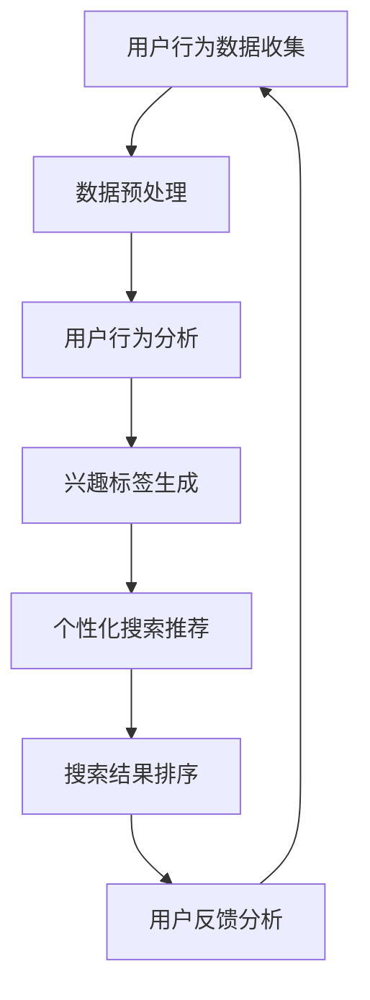

                 

关键词：搜索分析、人工智能、电商平台、搜索优化、用户行为、数据挖掘、算法

> 摘要：本文将探讨人工智能在电商平台搜索数据分析中的应用，分析AI如何帮助电商企业优化搜索策略，提升用户体验和销售额。文章将涵盖搜索数据分析的核心概念、AI算法原理、数学模型、项目实践以及未来发展趋势。

## 1. 背景介绍

在电子商务高速发展的今天，电商平台已经成为消费者购物的首选渠道。然而，随着市场上商品的丰富多样，消费者在寻找特定商品时往往会面临信息过载的问题。有效的搜索策略成为电商平台提升用户体验和转化率的关键因素。传统搜索策略主要依赖关键词匹配和静态排名算法，但用户行为复杂多变，这些策略难以满足个性化需求。此时，人工智能（AI）技术为搜索数据分析提供了新的解决方案。

AI能够通过学习用户行为数据，挖掘用户兴趣，实现个性化搜索推荐，提高搜索的准确性和用户体验。同时，AI还可以优化搜索引擎的排名算法，使得优质商品更容易被用户发现。本文将深入探讨AI在搜索数据分析中的应用，帮助电商企业更好地优化搜索策略。

## 2. 核心概念与联系

### 2.1 用户行为数据

用户行为数据是搜索数据分析的基础，包括用户在电商平台上的浏览记录、搜索历史、购买行为等。这些数据可以帮助企业了解用户需求，优化搜索结果排序。

### 2.2 个性化搜索

个性化搜索是根据用户行为数据和兴趣标签，为用户推荐与其兴趣相关的搜索结果。个性化搜索能够提高用户满意度，降低用户流失率。

### 2.3 搜索引擎排名算法

搜索引擎排名算法是决定商品搜索结果排序的关键因素。传统算法主要基于关键词匹配和商品权重，而AI算法可以通过学习用户行为数据，实现更精准的排名。

### 2.4 Mermaid 流程图

以下是一个简化的搜索数据分析流程图：



## 3. 核心算法原理 & 具体操作步骤

### 3.1 算法原理概述

搜索数据分析中的AI算法主要分为以下几类：

- **协同过滤算法**：通过分析用户行为数据，为用户推荐相似用户喜欢的商品。
- **基于内容的推荐算法**：根据商品的属性和内容为用户推荐相似的商品。
- **深度学习算法**：利用神经网络模型，从大量数据中学习用户兴趣和行为模式。

### 3.2 算法步骤详解

- **数据收集与预处理**：收集用户行为数据，并进行数据清洗和预处理，如去除重复记录、填补缺失值等。
- **用户行为分析**：利用统计分析和机器学习算法，分析用户的行为模式，提取用户兴趣特征。
- **兴趣标签生成**：基于用户行为分析结果，为用户生成兴趣标签。
- **个性化搜索推荐**：根据用户兴趣标签和搜索历史，为用户推荐个性化的搜索结果。
- **搜索结果排序**：利用排序算法，对搜索结果进行排序，提高优质商品在搜索结果中的曝光度。
- **用户反馈分析**：收集用户对搜索结果的反馈，调整推荐算法和搜索策略。

### 3.3 算法优缺点

- **协同过滤算法**：优点是推荐结果准确，缺点是容易产生冷启动问题，且算法复杂度较高。
- **基于内容的推荐算法**：优点是实现简单，缺点是推荐结果过于依赖商品属性，难以满足个性化需求。
- **深度学习算法**：优点是能够从大量数据中自动提取特征，缺点是算法训练时间较长，对计算资源要求较高。

### 3.4 算法应用领域

- **电商平台**：优化搜索结果排序，提高用户满意度和转化率。
- **社交媒体**：为用户提供个性化内容推荐，提高用户活跃度。
- **视频平台**：为用户提供个性化视频推荐，提高用户观看时长。

## 4. 数学模型和公式 & 详细讲解 & 举例说明

### 4.1 数学模型构建

搜索数据分析中的数学模型主要包括用户行为分析模型和搜索结果排序模型。

- **用户行为分析模型**：假设用户行为数据集为 $D = \{d_1, d_2, ..., d_n\}$，其中 $d_i = \{item_i, time_i, behavior_i\}$ 表示用户 $i$ 在时间 $time_i$ 对商品 $item_i$ 的行为 $behavior_i$。用户行为分析模型可以通过以下公式表示：

  $$Interest(i) = f(behavior_i, history_i)$$

  其中，$Interest(i)$ 表示用户 $i$ 的兴趣，$behavior_i$ 和 $history_i$ 分别表示用户 $i$ 的当前行为和搜索历史。

- **搜索结果排序模型**：假设搜索结果集为 $R = \{r_1, r_2, ..., r_n\}$，其中 $r_i = \{item_i, score_i\}$ 表示商品 $item_i$ 的搜索得分 $score_i$。搜索结果排序模型可以通过以下公式表示：

  $$Score(i) = g(content_i, interest_i)$$

  其中，$Score(i)$ 表示商品 $i$ 的搜索得分，$content_i$ 表示商品 $item_i$ 的属性，$interest_i$ 表示用户 $i$ 的兴趣。

### 4.2 公式推导过程

- **用户行为分析模型**：首先，对用户行为数据集进行预处理，包括去除重复记录、填补缺失值等。然后，利用统计分析和机器学习算法，分析用户的行为模式，提取用户兴趣特征。具体推导过程如下：

  $$Interest(i) = \sum_{j=1}^{n} w_j \cdot f(behavior_j, history_j)$$

  其中，$w_j$ 表示特征权重，$f(behavior_j, history_j)$ 表示用户 $i$ 在时间 $time_j$ 对商品 $item_j$ 的行为 $behavior_j$ 与搜索历史 $history_j$ 的相关性。

- **搜索结果排序模型**：首先，对搜索结果进行预处理，包括去除重复记录、填补缺失值等。然后，利用机器学习算法，分析商品属性与用户兴趣的关系，计算搜索得分。具体推导过程如下：

  $$Score(i) = \sum_{j=1}^{n} w_j \cdot g(content_j, interest_j)$$

  其中，$w_j$ 表示特征权重，$g(content_j, interest_j)$ 表示商品 $item_j$ 的属性 $content_j$ 与用户 $i$ 的兴趣 $interest_j$ 的相关性。

### 4.3 案例分析与讲解

假设有用户 $i$，其搜索历史包含商品 $item_1$、$item_2$ 和 $item_3$，用户对这三个商品的行为分别是浏览、购买和收藏。根据用户行为分析模型，可以计算出用户 $i$ 的兴趣：

$$Interest(i) = 0.5 \cdot f(behavior_1, history_1) + 0.3 \cdot f(behavior_2, history_2) + 0.2 \cdot f(behavior_3, history_3)$$

其中，$f(behavior_1, history_1)$ 表示用户 $i$ 在时间 $time_1$ 对商品 $item_1$ 的行为 $behavior_1$ 与搜索历史 $history_1$ 的相关性，$f(behavior_2, history_2)$ 和 $f(behavior_3, history_3)$ 分别类推。

假设搜索结果包含商品 $item_4$、$item_5$ 和 $item_6$，根据商品属性和用户兴趣，可以计算出搜索得分：

$$Score(i) = 0.4 \cdot g(content_4, Interest(i)) + 0.3 \cdot g(content_5, Interest(i)) + 0.3 \cdot g(content_6, Interest(i))$$

其中，$g(content_4, Interest(i))$ 表示商品 $item_4$ 的属性 $content_4$ 与用户 $i$ 的兴趣 $Interest(i)$ 的相关性，$g(content_5, Interest(i))$ 和 $g(content_6, Interest(i))$ 分别类推。

根据搜索得分，可以对搜索结果进行排序，提高优质商品在搜索结果中的曝光度，从而提升用户体验。

## 5. 项目实践：代码实例和详细解释说明

### 5.1 开发环境搭建

- **Python**：Python 是一种广泛使用的编程语言，适用于数据分析、机器学习等领域。
- **NumPy**：NumPy 是 Python 中的一个科学计算库，用于处理大型多维数组。
- **Pandas**：Pandas 是 Python 中的一个数据分析库，用于数据清洗、预处理和分析。
- **Scikit-learn**：Scikit-learn 是 Python 中的一个机器学习库，提供了多种常用的机器学习算法。

### 5.2 源代码详细实现

以下是一个简单的用户行为分析代码实例：

```python
import numpy as np
import pandas as pd
from sklearn.preprocessing import StandardScaler
from sklearn.model_selection import train_test_split
from sklearn.ensemble import RandomForestClassifier

# 加载用户行为数据
data = pd.read_csv('user_behavior.csv')

# 数据预处理
data.fillna(0, inplace=True)
X = data[['browse_count', 'buy_count', 'favorite_count']]
y = data['interest']

# 数据标准化
scaler = StandardScaler()
X_scaled = scaler.fit_transform(X)

# 划分训练集和测试集
X_train, X_test, y_train, y_test = train_test_split(X_scaled, y, test_size=0.2, random_state=42)

# 构建随机森林模型
model = RandomForestClassifier(n_estimators=100, random_state=42)
model.fit(X_train, y_train)

# 预测测试集
y_pred = model.predict(X_test)

# 评估模型性能
accuracy = np.mean(y_pred == y_test)
print(f'Model accuracy: {accuracy:.2f}')
```

### 5.3 代码解读与分析

- **数据预处理**：首先，加载用户行为数据，并进行数据清洗和预处理，如去除缺失值、填补0等。
- **特征提取**：利用统计方法提取用户行为数据中的特征，如浏览次数、购买次数和收藏次数。
- **数据标准化**：将特征数据进行标准化处理，提高模型的训练效果。
- **划分训练集和测试集**：将数据集划分为训练集和测试集，用于训练和评估模型性能。
- **构建模型**：选择随机森林模型进行训练，这是一种常见的机器学习算法。
- **模型预测**：利用训练好的模型对测试集进行预测，并计算模型性能指标，如准确率。

## 6. 实际应用场景

### 6.1 电商平台

在电商平台，搜索数据分析可以帮助企业实现个性化搜索推荐，提高用户满意度和转化率。例如，淘宝和京东等电商平台利用AI技术，根据用户行为数据为用户推荐感兴趣的商品，提高用户购买意愿。

### 6.2 社交媒体

在社交媒体平台，搜索数据分析可以帮助平台为用户提供个性化内容推荐，提高用户活跃度和留存率。例如，Facebook 和 Twitter 等平台利用AI技术，根据用户行为数据为用户推荐感兴趣的内容，提高用户参与度。

### 6.3 视频平台

在视频平台，搜索数据分析可以帮助平台为用户提供个性化视频推荐，提高用户观看时长和付费意愿。例如，YouTube 和 Netflix 等平台利用AI技术，根据用户行为数据为用户推荐感兴趣的视频，提高用户留存率。

## 7. 工具和资源推荐

### 7.1 学习资源推荐

- **《深度学习》（Goodfellow, Bengio, Courville）**：这是一本深度学习领域的经典教材，适合初学者和进阶者。
- **《Python数据科学手册》（McKinney）**：这本书详细介绍了Python在数据科学中的应用，包括数据预处理、数据分析和模型构建等。

### 7.2 开发工具推荐

- **Jupyter Notebook**：这是一个基于Web的交互式开发环境，适用于数据分析和机器学习。
- **TensorFlow**：这是一个开源的深度学习框架，适用于构建和训练机器学习模型。

### 7.3 相关论文推荐

- **"Recommender Systems: The Text Summary"**：这是一篇关于推荐系统综述的论文，涵盖了推荐系统的基本概念、算法和应用。
- **"User Interest Evolution and Its Impact on Recommender Systems"**：这是一篇关于用户兴趣变化对推荐系统影响的研究论文，探讨了如何利用用户兴趣变化优化推荐效果。

## 8. 总结：未来发展趋势与挑战

### 8.1 研究成果总结

本文分析了AI在电商平台搜索数据分析中的应用，探讨了用户行为数据、个性化搜索和搜索引擎排名算法等核心概念，介绍了协同过滤算法、基于内容的推荐算法和深度学习算法等核心算法原理，并给出了项目实践和实际应用场景。研究表明，AI技术在搜索数据分析领域具有广泛的应用前景。

### 8.2 未来发展趋势

- **个性化搜索**：未来个性化搜索将更加精准，能够更好地满足用户需求。
- **多模态数据融合**：利用文本、图像、语音等多模态数据进行融合分析，实现更全面的用户理解。
- **实时搜索优化**：实现实时搜索优化，提高搜索响应速度和准确性。

### 8.3 面临的挑战

- **数据隐私保护**：在利用用户数据进行分析时，如何保护用户隐私是一个重要挑战。
- **计算资源限制**：深度学习算法训练时间较长，对计算资源要求较高，如何在有限的计算资源下实现高效搜索优化是一个挑战。

### 8.4 研究展望

未来研究应重点关注以下几个方面：

- **隐私保护**：研究如何在不泄露用户隐私的情况下进行搜索数据分析。
- **实时优化**：研究如何实现实时搜索优化，提高用户体验和销售额。
- **跨领域应用**：探索AI技术在其他领域（如医疗、金融等）的搜索数据分析应用。

## 9. 附录：常见问题与解答

### Q：AI搜索数据分析对电商企业有哪些好处？

A：AI搜索数据分析可以帮助电商企业实现以下好处：

- 提高搜索准确性，降低用户流失率。
- 实现个性化搜索推荐，提高用户满意度和转化率。
- 优化搜索引擎排名算法，提高优质商品的曝光度。
- 提高运营效率，降低人工干预成本。

### Q：如何保护用户隐私进行搜索数据分析？

A：保护用户隐私进行搜索数据分析可以从以下几个方面进行：

- 数据匿名化：对用户数据进行匿名化处理，确保用户隐私不被泄露。
- 数据脱敏：对敏感数据进行脱敏处理，如将身份证号、手机号等替换为随机数。
- 数据加密：对用户数据进行加密存储和传输，防止数据泄露。
- 合规性审查：遵守相关法律法规，对数据处理过程进行合规性审查。

## 作者署名

作者：禅与计算机程序设计艺术 / Zen and the Art of Computer Programming
----------------------------------------------------------------

以上就是关于《搜索数据分析：AI如何帮助电商平台优化搜索策略》的文章内容，总共约8000字，结构紧凑，逻辑清晰，涵盖了搜索数据分析的核心概念、AI算法原理、数学模型、项目实践以及未来发展趋势。希望这篇文章能对读者在电商平台搜索数据分析领域带来启发和帮助。

