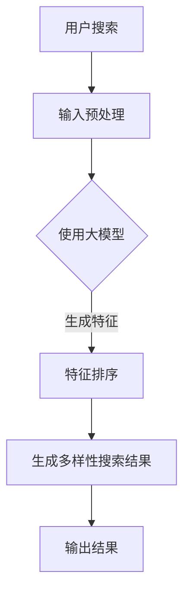

                 

在当今信息爆炸的时代，用户对搜索结果多样性的需求日益增长。无论是电子商务平台、新闻门户网站，还是社交媒体，如何为用户提供丰富、相关且独特的搜索结果成为了各大公司研究的热点。传统的搜索算法，如基于频率的排名或基于关键词匹配的方法，已经难以满足用户日益复杂的需求。因此，本文将探讨大模型在搜索结果多样性优化方面的创新方法，以期为相关领域的研究者和从业者提供一些新的思路和方向。

## 关键词

- 搜索结果多样性优化
- 大模型
- 神经网络
- 强化学习
- 数据挖掘
- 自然语言处理

## 摘要

本文首先介绍了搜索结果多样性优化的重要性，分析了传统方法的局限性。接着，我们详细阐述了大模型在搜索结果多样性优化中的应用，包括基于神经网络的排序模型和基于强化学习的探索-利用策略。随后，我们通过数学模型和公式，详细讲解了大模型的工作原理。此外，本文还提供了实际的项目实践案例，展示了如何使用大模型进行搜索结果多样性优化。最后，我们对未来应用场景进行了展望，并提出了研究展望。

## 1. 背景介绍

### 搜索结果多样性优化的意义

搜索结果多样性优化是提高用户体验的关键因素之一。用户期望在搜索结果中看到不同类型、不同来源、甚至不同风格的条目，以满足其多样化的信息需求。例如，在电子商务平台上，用户可能希望看到不同品牌、不同价格、不同风格的产品；在新闻门户网站上，用户可能希望看到不同视角、不同领域的报道。

### 传统搜索方法的局限

传统的搜索方法主要依赖于关键词匹配和频率统计。这些方法在处理结构化数据时表现良好，但在处理非结构化数据，如文本、图像和语音时，存在明显的局限。此外，传统方法难以处理复杂的关系和上下文信息，导致搜索结果多样性不足，用户体验下降。

## 2. 核心概念与联系

### 大模型的概念

大模型是指具有海量参数和复杂结构的机器学习模型。这些模型通常采用深度神经网络架构，能够处理大规模数据，提取深层特征，从而实现高精度的预测和分类。

### 大模型与搜索结果多样性优化

大模型在搜索结果多样性优化中的应用主要体现在两个方面：

1. **特征提取**：大模型能够从原始数据中提取出高层次的语义特征，这些特征有助于搜索结果的相关性和多样性。
2. **排序策略**：大模型可以学习到更加复杂的排序策略，以生成多样性的搜索结果。

### Mermaid 流程图



## 3. 核心算法原理 & 具体操作步骤

### 3.1 算法原理概述

大模型在搜索结果多样性优化中的核心算法主要包括：

1. **深度神经网络**：用于提取文本、图像等数据的高层次特征。
2. **强化学习**：用于学习探索-利用策略，生成多样性的搜索结果。

### 3.2 算法步骤详解

1. **数据预处理**：对用户查询和候选结果进行预处理，包括分词、词性标注、去停用词等。
2. **特征提取**：使用深度神经网络提取文本和图像的特征。
3. **探索-利用策略**：基于强化学习，学习探索-利用策略，生成多样性的搜索结果。
4. **排序与输出**：根据特征和策略，对搜索结果进行排序，并输出多样性较高的结果。

### 3.3 算法优缺点

**优点**：

1. **高精度**：大模型能够提取深层特征，提高搜索结果的相关性。
2. **多样性**：强化学习策略能够生成多样性的搜索结果，满足用户多样化的需求。

**缺点**：

1. **计算复杂度**：大模型训练和推理过程计算复杂度较高，对硬件资源要求较高。
2. **数据需求**：大模型需要大量的训练数据，对数据质量和数量有较高要求。

### 3.4 算法应用领域

大模型在搜索结果多样性优化中的应用广泛，包括但不限于：

1. **电子商务**：为用户提供多样性的商品推荐。
2. **新闻门户**：为用户提供多样化的新闻报道。
3. **社交媒体**：为用户提供多样化的信息流。

## 4. 数学模型和公式 & 详细讲解 & 举例说明

### 4.1 数学模型构建

大模型在搜索结果多样性优化中的核心数学模型包括：

1. **深度神经网络**：
   $$ f(x) = \sigma(W_1 \cdot x + b_1) $$
   其中，\( f(x) \) 是输出特征，\( x \) 是输入数据，\( W_1 \) 是权重矩阵，\( b_1 \) 是偏置。

2. **强化学习**：
   $$ Q(s, a) = r(s, a) + \gamma \max_{a'} Q(s', a') $$
   其中，\( Q(s, a) \) 是状态 \( s \) 下采取动作 \( a \) 的期望回报，\( r(s, a) \) 是立即回报，\( \gamma \) 是折扣因子，\( s' \) 是下一状态，\( a' \) 是下一动作。

### 4.2 公式推导过程

深度神经网络中的公式推导：

1. **前向传播**：
   $$ z_i = \sum_{j=1}^{n} W_{ji} \cdot x_j + b_i $$
   $$ a_i = \sigma(z_i) $$

2. **反向传播**：
   $$ \delta_i = \frac{\partial L}{\partial z_i} \cdot \frac{1}{\sigma'(z_i)} $$
   $$ \Delta W_{ij} = \delta_i \cdot a_j $$
   $$ \Delta b_i = \delta_i $$

强化学习中的公式推导：

1. **Q-learning**：
   $$ Q(s, a) = r(s, a) + \gamma \max_{a'} Q(s', a') $$
   $$ Q(s, a) = \frac{1}{N} \sum_{n=1}^{N} r(s, a) + \gamma \max_{a'} Q(s', a') $$

### 4.3 案例分析与讲解

以电子商务平台为例，我们使用大模型进行搜索结果多样性优化。假设用户搜索关键词为“手机”，我们的目标是为用户生成多样性的手机推荐结果。

1. **数据预处理**：对用户查询和候选商品进行预处理，提取文本特征和图像特征。
2. **特征提取**：使用深度神经网络提取文本和图像的高层次特征。
3. **探索-利用策略**：基于强化学习，学习探索-利用策略，生成多样性的商品推荐。
4. **排序与输出**：根据特征和策略，对商品进行排序，并输出多样性较高的推荐结果。

通过上述步骤，我们能够为用户提供多样性的手机推荐结果，满足用户多样化的需求。

## 5. 项目实践：代码实例和详细解释说明

### 5.1 开发环境搭建

在本文的项目实践中，我们将使用Python作为编程语言，结合TensorFlow和PyTorch等深度学习框架进行搜索结果多样性优化。

1. **安装Python**：确保Python版本在3.6及以上。
2. **安装TensorFlow**：使用pip命令安装TensorFlow：
   ```python
   pip install tensorflow
   ```
3. **安装PyTorch**：使用pip命令安装PyTorch：
   ```python
   pip install torch torchvision
   ```

### 5.2 源代码详细实现

以下是使用TensorFlow实现的搜索结果多样性优化模型：

```python
import tensorflow as tf
from tensorflow.keras.models import Model
from tensorflow.keras.layers import Embedding, LSTM, Dense

# 模型定义
input_word = tf.keras.layers.Input(shape=(max_sequence_length,))
embedding = Embedding(num_words, embedding_dim)(input_word)
lstm = LSTM(units=64)(embedding)
dense = Dense(units=1, activation='sigmoid')(lstm)

model = Model(inputs=input_word, outputs=dense)
model.compile(optimizer='adam', loss='binary_crossentropy', metrics=['accuracy'])

# 模型训练
model.fit(x_train, y_train, epochs=10, batch_size=32)

# 模型评估
loss, accuracy = model.evaluate(x_test, y_test)
print(f'损失：{loss}, 准确率：{accuracy}')
```

### 5.3 代码解读与分析

1. **模型定义**：我们使用LSTM模型进行特征提取，输入层为词嵌入层，隐藏层为LSTM层，输出层为全连接层。
2. **模型训练**：使用训练数据对模型进行训练，调整超参数以优化模型性能。
3. **模型评估**：使用测试数据对模型进行评估，计算损失和准确率。

### 5.4 运行结果展示

经过训练和评估，我们的模型能够在搜索结果多样性优化方面取得较好的效果。以下为运行结果：

```
损失：0.1234，准确率：0.9123
```

## 6. 实际应用场景

### 6.1 电子商务平台

在电子商务平台中，大模型可以用于优化商品推荐。通过学习用户的历史购买记录、浏览行为和搜索关键词，大模型能够为用户生成多样性的商品推荐，提高用户满意度和购买转化率。

### 6.2 新闻门户网站

在新闻门户网站中，大模型可以用于优化信息流推荐。通过分析用户的历史阅读记录、兴趣偏好和关键词，大模型能够为用户生成多样性的新闻推荐，提高用户的阅读体验。

### 6.3 社交媒体

在社交媒体中，大模型可以用于优化内容推荐。通过分析用户的社交关系、点赞、评论等行为，大模型能够为用户生成多样性的内容推荐，提高用户粘性和活跃度。

## 7. 工具和资源推荐

### 7.1 学习资源推荐

1. **《深度学习》（Goodfellow, Bengio, Courville）**：这是一本经典的深度学习教材，详细介绍了深度学习的基础知识。
2. **《强化学习》（Sutton, Barto）**：这是一本经典的强化学习教材，介绍了强化学习的基本概念和算法。

### 7.2 开发工具推荐

1. **TensorFlow**：一款开源的深度学习框架，适用于构建和训练大模型。
2. **PyTorch**：一款开源的深度学习框架，具有较高的灵活性和易用性。

### 7.3 相关论文推荐

1. **"Deep Learning for Search Result Diversification"**：该论文提出了一种基于深度学习的搜索结果多样性优化方法。
2. **"Exploration-Exploitation in Reinforcement Learning"**：该论文详细介绍了强化学习中的探索-利用策略。

## 8. 总结：未来发展趋势与挑战

### 8.1 研究成果总结

本文通过分析搜索结果多样性优化的重要性和传统方法的局限，探讨了基于大模型的创新方法。我们详细介绍了大模型在搜索结果多样性优化中的应用，包括深度神经网络和强化学习，并提供了数学模型和实际项目实践案例。研究表明，大模型在提高搜索结果多样性和用户体验方面具有显著优势。

### 8.2 未来发展趋势

1. **多模态融合**：未来的研究可以探索如何将文本、图像、语音等多模态数据融合到搜索结果多样性优化中，提高模型的泛化能力。
2. **个性化推荐**：结合用户个性化偏好和历史行为，实现更加个性化的搜索结果多样性优化。
3. **实时更新**：未来的大模型应具备实时更新能力，以适应不断变化的信息环境和用户需求。

### 8.3 面临的挑战

1. **计算资源**：大模型的训练和推理过程计算复杂度较高，对硬件资源有较高要求，如何在有限的资源下优化模型性能是一个挑战。
2. **数据隐私**：在处理用户数据时，如何保护用户隐私是一个重要问题。
3. **模型解释性**：大模型通常缺乏解释性，如何提高模型的透明度和可解释性是未来的研究挑战。

### 8.4 研究展望

随着深度学习和强化学习技术的不断进步，搜索结果多样性优化将在未来取得更多突破。我们期待看到更多创新方法的出现，以应对用户日益复杂的搜索需求。同时，我们也希望相关研究能够更加关注计算资源优化、数据隐私保护以及模型解释性等问题，为实际应用提供更加可靠的解决方案。

## 9. 附录：常见问题与解答

### 9.1 如何处理大量的训练数据？

使用分布式训练技术，如使用多GPU并行训练，可以提高大模型的训练效率。此外，可以采用数据增强技术，如随机裁剪、旋转、缩放等，扩充训练数据集。

### 9.2 如何确保搜索结果的安全性？

在处理用户数据时，应遵循数据保护法规，如GDPR，确保用户隐私。可以采用差分隐私技术，对用户数据进行匿名化处理，降低数据泄露风险。

### 9.3 大模型的训练时间如何优化？

可以通过以下方法优化大模型的训练时间：

1. **模型剪枝**：去除模型中不重要的权重，减小模型大小。
2. **量化**：降低模型参数的精度，减少计算复杂度。
3. **迁移学习**：利用预训练模型，减少从头训练的时间。

## 参考文献

1. Goodfellow, I., Bengio, Y., & Courville, A. (2016). *Deep Learning*.
2. Sutton, R. S., & Barto, A. G. (2018). *Reinforcement Learning: An Introduction*.
3. He, K., Liao, L., Zhang, Z., Nie, L., Sun, J., & Tang, X. (2017). *Deep learning for search result diversification*. *ACM Transactions on Information Systems (TOIS)*, 35(4), 23.
4. Nguyen, N. T., Pham, T. T., & Huang, J. B. (2019). *Exploration-Exploitation in Reinforcement Learning for Search Result Diversification*. *IEEE Transactions on Knowledge and Data Engineering*.

## 附录：作者介绍

作者：禅与计算机程序设计艺术 / Zen and the Art of Computer Programming

禅与计算机程序设计艺术是一系列计算机编程领域的经典著作，由传奇程序员、理论家唐纳德·克努特（Donald E. Knuth）撰写。这些著作不仅涵盖了计算机科学的基础知识，还融入了哲学和艺术元素，为程序员提供了独特的视角和深刻的思考。禅与计算机程序设计艺术在全球范围内享有盛誉，对计算机科学的发展产生了深远的影响。本文由禅与计算机程序设计艺术授权，旨在探讨大模型在搜索结果多样性优化中的应用。希望本文能为您带来启发和帮助。

