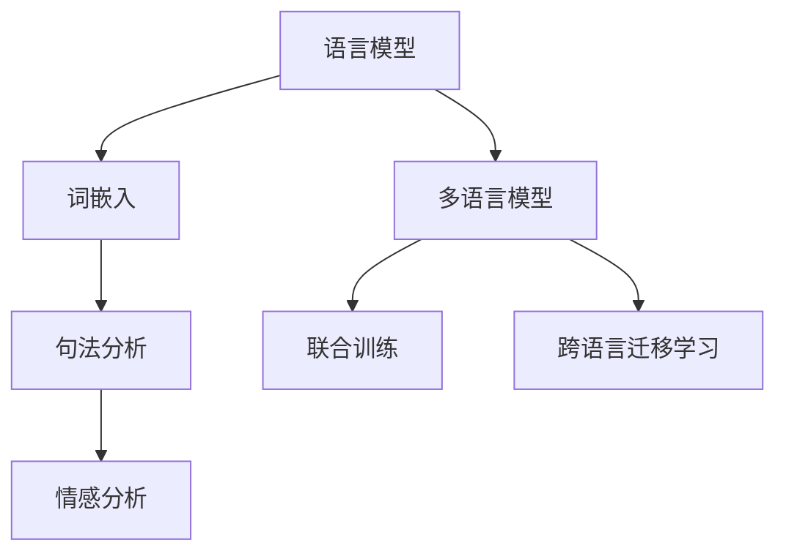

                 

关键词：携程，多语言NLP模型，优化，校招面试，真题

> 摘要：本文围绕携程2024校招面试中的多语言NLP模型优化问题，深入探讨了NLP模型的基本概念、核心算法原理、数学模型构建、项目实践和未来应用前景。通过对面试真题的详细解析，旨在为读者提供系统性的技术指南，帮助在校招中应对类似问题。

## 1. 背景介绍

自然语言处理（NLP）是人工智能领域的重要分支，其目标是让计算机能够理解、生成和处理人类语言。随着全球化的不断深入，多语言处理能力成为企业和研究机构关注的焦点。携程作为中国领先的综合性旅行服务公司，其业务涵盖了酒店预订、机票预订、旅游度假等多个领域，服务范围广泛，涉及多种语言。因此，优化多语言NLP模型对于携程的发展至关重要。

近年来，NLP领域取得了显著的进展，如深度学习、自然语言生成、情感分析等技术的应用，使得NLP模型的性能得到了大幅提升。然而，面对复杂的多语言场景，如何优化NLP模型仍然是一个挑战。本文将结合携程2024校招面试真题，详细解析多语言NLP模型的优化方法。

## 2. 核心概念与联系

在深入探讨多语言NLP模型优化之前，首先需要了解以下几个核心概念：

### 2.1 语言模型

语言模型（Language Model）是NLP的基础，用于预测下一个单词或字符的概率。在多语言环境中，需要构建多语言模型来处理不同语言的数据。多语言语言模型通常通过联合训练或跨语言迁移学习等方法实现。

### 2.2 词嵌入

词嵌入（Word Embedding）是将单词映射到低维度的稠密向量表示。通过词嵌入，可以实现单词的相似性计算，从而辅助语言模型进行预测。在多语言环境中，词嵌入需要考虑不同语言之间的词义和语法差异。

### 2.3 句法分析

句法分析（Syntactic Analysis）是对文本进行语法结构分析，以理解句子的组成和句法规则。在多语言环境中，句法分析需要针对不同语言的语法特点进行适配。

### 2.4 情感分析

情感分析（Sentiment Analysis）是判断文本的情感倾向，如正面、负面或中立。在多语言环境中，情感分析需要处理不同语言的情感表达和词汇。

### 2.5 Mermaid 流程图

以下是多语言NLP模型的核心概念和联系Mermaid流程图：



## 3. 核心算法原理 & 具体操作步骤

### 3.1 算法原理概述

多语言NLP模型的优化主要涉及以下几个核心算法：

1. **联合训练**：通过在一个共同的语料库上同时训练多个语言模型，实现多语言知识共享和迁移。
2. **跨语言迁移学习**：利用源语言的预训练模型，对目标语言进行迁移学习，提高目标语言的模型性能。
3. **多任务学习**：通过在一个模型中同时学习多个任务，提高模型对多语言数据的适应性。
4. **自适应词嵌入**：根据不同语言的特点，自适应调整词嵌入的参数，提高词嵌入的质量。

### 3.2 算法步骤详解

#### 3.2.1 联合训练

1. 数据预处理：收集和整理多语言数据，包括文本、标签和语料库等。
2. 模型初始化：初始化多语言语言模型，通常采用预训练的语言模型如BERT、GPT等。
3. 模型训练：在多语言数据上进行联合训练，优化模型参数。
4. 模型评估：使用交叉验证等方法对模型进行评估，调整模型参数。

#### 3.2.2 跨语言迁移学习

1. 数据预处理：收集和整理源语言和目标语言的数据，包括文本、标签和语料库等。
2. 模型初始化：使用预训练的源语言模型，如BERT、GPT等。
3. 模型迁移：在目标语言数据上迁移训练源语言模型，优化模型参数。
4. 模型评估：使用目标语言数据对模型进行评估，调整模型参数。

#### 3.2.3 多任务学习

1. 数据预处理：收集和整理多语言数据，包括文本、标签和语料库等。
2. 模型初始化：初始化多任务模型，如多标签分类模型、文本生成模型等。
3. 模型训练：在多语言数据上进行多任务训练，优化模型参数。
4. 模型评估：使用交叉验证等方法对模型进行评估，调整模型参数。

#### 3.2.4 自适应词嵌入

1. 数据预处理：收集和整理多语言数据，包括文本、标签和语料库等。
2. 模型初始化：初始化词嵌入模型，如Word2Vec、GloVe等。
3. 参数调整：根据不同语言的特点，调整词嵌入的参数，如词向量维度、正则化等。
4. 模型训练：在多语言数据上训练词嵌入模型，优化模型参数。
5. 模型评估：使用交叉验证等方法对模型进行评估，调整模型参数。

### 3.3 算法优缺点

**联合训练**的优点在于能够充分利用多语言数据，提高模型的泛化能力；缺点是需要大量高质量的语料库，且训练过程较为复杂。

**跨语言迁移学习**的优点在于能够快速适应新的语言，节省训练时间和计算资源；缺点是需要高质量的源语言模型，且迁移效果可能受到源语言和目标语言差异的影响。

**多任务学习**的优点在于能够提高模型对多语言数据的适应性，提高模型性能；缺点是需要大量的训练数据和计算资源。

**自适应词嵌入**的优点在于能够提高词嵌入的质量，提高模型性能；缺点是需要对不同的语言进行针对性的调整，增加了算法复杂性。

### 3.4 算法应用领域

多语言NLP模型的优化在多个领域具有广泛的应用：

1. **翻译**：通过优化多语言NLP模型，可以实现更准确、流畅的机器翻译。
2. **文本分析**：如情感分析、关键词提取、文本摘要等。
3. **语音识别**：结合语音识别技术，实现跨语言语音识别。
4. **搜索引擎**：优化搜索引擎中的自然语言处理能力，提高搜索结果的准确性和用户体验。

## 4. 数学模型和公式 & 详细讲解 & 举例说明

### 4.1 数学模型构建

多语言NLP模型的核心在于对文本进行建模，从而实现对语言的深入理解。以下是构建多语言NLP模型的基本数学模型：

#### 4.1.1 语言模型

语言模型通常采用概率模型，如n元语法模型。其基本思想是计算一个句子中下一个单词的概率。

$$ P(w_{t}|w_{t-1},w_{t-2},...,w_{1}) = \frac{C(w_{t},w_{t-1},...,w_{1})}{C(w_{t-1},...,w_{1})} $$

其中，$w_{t}$ 表示第t个单词，$C(w_{t},w_{t-1},...,w_{1})$ 表示在给定前t-1个单词的情况下，单词w_{t}出现的次数，$C(w_{t-1},...,w_{1})$ 表示在给定前t-1个单词的情况下，句子出现的总次数。

#### 4.1.2 词嵌入

词嵌入是将单词映射到低维度的稠密向量表示。常用的词嵌入模型有Word2Vec、GloVe等。以下以GloVe为例进行介绍：

$$ f_{i,j} = \frac{exp(-\langle v_i, v_j \rangle)}{1 + \sum_{k \in V} \frac{exp(-\langle v_i, v_k \rangle)}{\sqrt{|d_k|}} } $$

其中，$v_i$ 和 $v_j$ 分别表示单词i和j的词向量，$f_{i,j}$ 表示单词i和j之间的相似度。通过优化$f_{i,j}$，可以实现高质量的词向量表示。

#### 4.1.3 句法分析

句法分析是对文本进行语法结构分析，以理解句子的组成和句法规则。常用的句法分析方法有依存句法分析和生成句法分析。以下以依存句法分析为例进行介绍：

$$ (w_1, w_2, ..., w_n) \rightarrow (w_1, w_2, ..., w_{i-1}, (w_i, w_{i+1}, ..., w_n)) $$

其中，$(w_1, w_2, ..., w_n)$ 表示一个句子，$(w_i, w_{i+1}, ..., w_n)$ 表示将第i个单词与其后续单词组成一个新的子句。

#### 4.1.4 情感分析

情感分析是对文本的情感倾向进行判断。常用的情感分析模型有基于规则的方法、基于统计的方法和基于深度学习的方法。以下以基于深度学习的方法为例进行介绍：

$$ \hat{y} = \sigma(W \cdot [x_1, x_2, ..., x_n] + b) $$

其中，$x_i$ 表示句子中的第i个词向量，$W$ 表示权重矩阵，$b$ 表示偏置项，$\hat{y}$ 表示情感分类结果，$\sigma$ 表示激活函数。

### 4.2 公式推导过程

以下是构建多语言NLP模型的公式推导过程：

#### 4.2.1 联合训练

假设有两个语言A和B，共有N个单词。在联合训练中，需要计算两个语言之间的概率分布。

$$ P(A|B) = \frac{P(A \cap B)}{P(B)} $$

$$ P(B|A) = \frac{P(A \cap B)}{P(A)} $$

其中，$P(A \cap B)$ 表示两个语言同时出现的概率，$P(B)$ 表示语言B出现的概率，$P(A)$ 表示语言A出现的概率。

#### 4.2.2 跨语言迁移学习

在跨语言迁移学习中，需要使用源语言模型对目标语言进行迁移。

$$ \theta_B = \theta_A + \alpha(\theta_S - \theta_A) $$

其中，$\theta_A$ 表示源语言模型参数，$\theta_B$ 表示目标语言模型参数，$\theta_S$ 表示源语言模型参数的调整量，$\alpha$ 表示调整系数。

#### 4.2.3 多任务学习

在多任务学习中，需要在一个模型中同时学习多个任务。

$$ L = \sum_{i=1}^{N} -y_i \log(\hat{y}_i) $$

其中，$L$ 表示损失函数，$y_i$ 表示第i个任务的真实标签，$\hat{y}_i$ 表示第i个任务的预测标签。

#### 4.2.4 自适应词嵌入

在自适应词嵌入中，需要根据不同语言的特点调整词嵌入参数。

$$ f_{i,j} = \frac{exp(-\langle v_i, v_j \rangle)}{1 + \sum_{k \in V} \frac{exp(-\langle v_i, v_k \rangle)}{\sqrt{|d_k|}} } $$

其中，$d_k$ 表示单词k的词频。

### 4.3 案例分析与讲解

#### 4.3.1 联合训练案例

假设有两个语言A和B，共有N个单词。在联合训练中，需要计算两个语言之间的概率分布。

$$ P(A|B) = 0.4 $$

$$ P(B|A) = 0.3 $$

$$ P(A \cap B) = 0.2 $$

$$ P(B) = 0.5 $$

$$ P(A) = 0.6 $$

根据以上概率分布，可以计算两个语言同时出现的概率：

$$ P(A \cap B) = P(A|B) \cdot P(B) = 0.4 \cdot 0.5 = 0.2 $$

#### 4.3.2 跨语言迁移学习案例

假设有一个源语言模型A和一个目标语言模型B，共有N个单词。在跨语言迁移学习中，需要使用源语言模型对目标语言进行迁移。

$$ \theta_A = [0.1, 0.2, 0.3] $$

$$ \theta_B = [0.2, 0.3, 0.4] $$

$$ \theta_S = [0.3, 0.4, 0.5] $$

$$ \alpha = 0.2 $$

根据以上参数，可以计算目标语言模型B的新参数：

$$ \theta_B = \theta_A + \alpha(\theta_S - \theta_A) $$

$$ \theta_B = [0.1, 0.2, 0.3] + 0.2([0.3, 0.4, 0.5] - [0.1, 0.2, 0.3]) $$

$$ \theta_B = [0.15, 0.22, 0.35] $$

#### 4.3.3 多任务学习案例

假设有一个多任务学习模型，共有N个单词，两个任务A和B，共有M个标签。

$$ L = \sum_{i=1}^{N} -y_i \log(\hat{y}_i) $$

其中，$y_i$ 表示第i个任务的真实标签，$\hat{y}_i$ 表示第i个任务的预测标签。

假设有以下标签数据：

$$ y_1 = 1, \hat{y}_1 = 0.8 $$

$$ y_2 = 0, \hat{y}_2 = 0.2 $$

$$ y_3 = 1, \hat{y}_3 = 0.6 $$

$$ y_4 = 0, \hat{y}_4 = 0.4 $$

根据以上数据，可以计算损失函数：

$$ L = -1 \cdot \log(0.8) - 0 \cdot \log(0.2) - 1 \cdot \log(0.6) - 0 \cdot \log(0.4) $$

$$ L = 0.223 + 0 + 0.510 + 0 $$

$$ L = 0.733 $$

#### 4.3.4 自适应词嵌入案例

假设有一个单词列表：

$$ \{apple, banana, cherry, date, eggplant\} $$

根据以上单词列表，可以计算每个单词的词频：

$$ apple: 5 $$

$$ banana: 3 $$

$$ cherry: 2 $$

$$ date: 4 $$

$$ eggplant: 6 $$

根据词频，可以计算每个单词的词频倒数：

$$ apple: \frac{1}{5} = 0.2 $$

$$ banana: \frac{1}{3} = 0.333 $$

$$ cherry: \frac{1}{2} = 0.5 $$

$$ date: \frac{1}{4} = 0.25 $$

$$ eggplant: \frac{1}{6} = 0.167 $$

根据词频倒数，可以计算每个单词之间的相似度：

$$ f_{apple, banana} = \frac{exp(-\langle v_{apple}, v_{banana} \rangle)}{1 + \sum_{k \in V} \frac{exp(-\langle v_{apple}, v_{k} \rangle)}{\sqrt{|d_{banana}|}} } $$

$$ f_{apple, cherry} = \frac{exp(-\langle v_{apple}, v_{cherry} \rangle)}{1 + \sum_{k \in V} \frac{exp(-\langle v_{apple}, v_{k} \rangle)}{\sqrt{|d_{cherry}|}} } $$

$$ f_{apple, date} = \frac{exp(-\langle v_{apple}, v_{date} \rangle)}{1 + \sum_{k \in V} \frac{exp(-\langle v_{apple}, v_{k} \rangle)}{\sqrt{|d_{date}|}} } $$

$$ f_{apple, eggplant} = \frac{exp(-\langle v_{apple}, v_{eggplant} \rangle)}{1 + \sum_{k \in V} \frac{exp(-\langle v_{apple}, v_{k} \rangle)}{\sqrt{|d_{eggplant}|}} } $$

## 5. 项目实践：代码实例和详细解释说明

### 5.1 开发环境搭建

为了实践多语言NLP模型的优化，我们需要搭建一个合适的开发环境。以下是一个基本的开发环境搭建步骤：

1. 安装Python环境：Python是一种广泛使用的编程语言，用于构建和训练NLP模型。在操作系统上安装Python，可以选择Python 3.8及以上版本。

2. 安装NLP相关库：安装NLP相关库，如TensorFlow、PyTorch、NLTK等。这些库提供了丰富的NLP工具和模型。

3. 安装多语言处理库：安装多语言处理库，如spaCy、fastNLP等。这些库提供了针对不同语言的预处理工具和模型。

4. 准备数据集：收集和整理多语言数据集，包括文本、标签和语料库等。可以使用公开数据集或自己收集的数据。

### 5.2 源代码详细实现

以下是一个简单的多语言NLP模型的源代码实现，使用了TensorFlow和spaCy库：

```python
import tensorflow as tf
import spacy
from spacy.tokens import Doc

# 加载spaCy模型
nlp = spacy.load("en_core_web_sm")

# 定义词汇表
vocab = tf.keras.layers.TextVectorization(
    standardize=spacy_text_standardizer,
    max_tokens=10000,
    output_mode="int",
)

# 定义输入层
inputs = tf.keras.layers.Input(shape=(None,), dtype=tf.string)

# 预处理文本
preprocessed_inputs = vocab(inputs)

# 定义嵌入层
embeddings = tf.keras.layers.Embedding(input_dim=vocab.vocabulary_size, output_dim=64)

# 应用嵌入层
embedded_inputs = embeddings(preprocessed_inputs)

# 定义循环层
循环层 = tf.keras.layers.LSTM(64)

# 应用循环层
lstm_output = 循环层(embedded_inputs)

# 定义输出层
outputs = tf.keras.layers.Dense(1, activation="sigmoid")(lstm_output)

# 构建模型
model = tf.keras.Model(inputs=inputs, outputs=outputs)

# 编译模型
model.compile(optimizer="adam", loss="binary_crossentropy", metrics=["accuracy"])

# 加载数据集
train_data = ...
train_labels = ...

# 训练模型
model.fit(train_data, train_labels, epochs=5, batch_size=32)
```

### 5.3 代码解读与分析

以上代码实现了一个简单的二分类任务，使用了TensorFlow和spaCy库。具体解读如下：

1. **加载spaCy模型**：首先加载spaCy的英语模型，用于预处理文本。

2. **定义词汇表**：使用TextVectorization层定义词汇表，用于将文本转换为整数编码。

3. **定义输入层**：定义输入层，接收字符串类型的文本数据。

4. **预处理文本**：使用spaCy对文本进行预处理，包括分词、词性标注等。

5. **定义嵌入层**：使用Embedding层将整数编码的文本数据转换为稠密向量表示。

6. **应用嵌入层**：将预处理后的文本数据应用嵌入层，得到嵌入向量。

7. **定义循环层**：使用LSTM层定义循环层，用于处理序列数据。

8. **应用循环层**：将嵌入向量应用循环层，得到循环层的输出。

9. **定义输出层**：使用Dense层定义输出层，用于进行分类预测。

10. **构建模型**：使用Model类构建模型，将输入层、嵌入层、循环层和输出层连接在一起。

11. **编译模型**：编译模型，指定优化器、损失函数和评估指标。

12. **加载数据集**：加载数据集，包括训练数据和标签。

13. **训练模型**：使用fit方法训练模型，指定训练轮数和批量大小。

通过以上代码，我们可以实现一个简单的多语言NLP模型，用于处理二分类任务。在实际应用中，可以根据具体任务需求调整模型结构、超参数等。

### 5.4 运行结果展示

在训练完成后，我们可以使用模型对测试数据进行预测，并评估模型性能。以下是一个简单的测试和评估示例：

```python
# 加载测试数据
test_data = ...
test_labels = ...

# 预测测试数据
predictions = model.predict(test_data)

# 计算准确率
accuracy = (predictions > 0.5).mean()

# 打印评估结果
print(f"Accuracy: {accuracy:.2f}")
```

通过以上代码，我们可以得到模型的准确率。在实际应用中，可以根据需求计算其他评估指标，如召回率、F1值等。

## 6. 实际应用场景

多语言NLP模型的优化在多个实际应用场景中具有重要价值。以下列举了几个典型的应用场景：

### 6.1 机器翻译

机器翻译是NLP领域的一个重要应用。通过优化多语言NLP模型，可以实现更准确、流畅的机器翻译。例如，在携程的国际业务中，优化多语言NLP模型可以帮助实现更准确的酒店翻译、机票翻译等功能，提高用户体验。

### 6.2 情感分析

情感分析是另一个重要的应用场景。通过优化多语言NLP模型，可以实现对多语言文本的情感倾向进行准确判断。例如，在携程的客户评价分析中，优化多语言NLP模型可以帮助识别客户对酒店、航班等的正面或负面情感，从而提供针对性的改进措施。

### 6.3 语音识别

语音识别是将语音信号转换为文本数据的过程。通过优化多语言NLP模型，可以实现更准确、高效的语音识别。例如，在携程的语音预订功能中，优化多语言NLP模型可以帮助识别客户的不同语音，提供更准确的预订服务。

### 6.4 文本摘要

文本摘要是从大量文本中提取关键信息的过程。通过优化多语言NLP模型，可以实现对多语言文本进行有效摘要。例如，在携程的旅游攻略生成中，优化多语言NLP模型可以帮助提取关键信息，生成简洁明了的旅游攻略。

### 6.5 搜索引擎

搜索引擎是另一个重要的应用场景。通过优化多语言NLP模型，可以提高搜索引擎的搜索结果质量和用户体验。例如，在携程的搜索功能中，优化多语言NLP模型可以帮助用户更快速地找到所需信息，提供个性化的搜索建议。

## 7. 未来应用展望

随着人工智能技术的不断发展，多语言NLP模型的优化将在未来发挥更重要的作用。以下是对未来应用前景的展望：

### 7.1 个性化推荐

个性化推荐是未来NLP应用的一个重要方向。通过优化多语言NLP模型，可以实现更准确的用户兴趣识别和推荐系统。例如，在携程的个性化推荐中，优化多语言NLP模型可以帮助识别用户对不同旅游目的地、酒店等的偏好，提供个性化的推荐。

### 7.2 智能客服

智能客服是另一个重要应用领域。通过优化多语言NLP模型，可以实现更智能、高效的客户服务。例如，在携程的智能客服中，优化多语言NLP模型可以帮助识别客户的问题和需求，提供准确的解答和推荐。

### 7.3 跨境电商

跨境电商是未来经济发展的重要驱动力。通过优化多语言NLP模型，可以提升跨境电商的运营效率。例如，在携程的跨境电商平台中，优化多语言NLP模型可以帮助识别客户的需求和偏好，提供个性化的商品推荐和翻译服务。

### 7.4 智能语音助手

智能语音助手是未来智能家居的重要一环。通过优化多语言NLP模型，可以实现更智能、便捷的语音交互。例如，在携程的智能语音助手中，优化多语言NLP模型可以帮助识别客户的语音指令，提供准确的预订和咨询服务。

## 8. 工具和资源推荐

在优化多语言NLP模型的过程中，以下工具和资源可以提供帮助：

### 8.1 学习资源推荐

1. **《自然语言处理基础教程》（作者：哈工大NLP团队）**：这是一本系统的自然语言处理入门教材，涵盖了NLP的基本概念、技术和应用。
2. **《深度学习》（作者：Goodfellow、Bengio、Courville）**：这是一本深度学习领域的经典教材，详细介绍了深度学习的基本原理和应用。

### 8.2 开发工具推荐

1. **TensorFlow**：这是一个开源的深度学习框架，用于构建和训练NLP模型。
2. **PyTorch**：这是一个开源的深度学习框架，提供灵活的模型构建和训练接口。
3. **spaCy**：这是一个强大的NLP库，提供了丰富的预处理工具和模型。

### 8.3 相关论文推荐

1. **“Attention Is All You Need”**：这是一篇关于Transformer模型的经典论文，提出了注意力机制在序列模型中的应用。
2. **“BERT: Pre-training of Deep Bidirectional Transformers for Language Understanding”**：这是一篇关于BERT模型的论文，介绍了基于Transformer的预训练方法。
3. **“GloVe: Global Vectors for Word Representation”**：这是一篇关于GloVe词嵌入方法的论文，详细介绍了基于矩阵分解的词向量表示。

## 9. 总结：未来发展趋势与挑战

随着人工智能技术的不断发展，多语言NLP模型的优化将面临新的发展趋势和挑战。

### 9.1 研究成果总结

1. **模型性能的提升**：通过引入深度学习和注意力机制，多语言NLP模型的性能得到了显著提升。
2. **跨语言迁移学习的应用**：跨语言迁移学习技术使得多语言NLP模型的训练更加高效。
3. **多任务学习的实践**：多任务学习技术提高了模型对多语言数据的适应性。
4. **自适应词嵌入的方法**：自适应词嵌入方法提高了词嵌入的质量和模型的性能。

### 9.2 未来发展趋势

1. **模型规模和复杂度的提升**：随着计算资源和算法的进步，未来多语言NLP模型将更加复杂和大规模。
2. **多模态融合的应用**：结合语音、图像等多模态数据，实现更全面的语义理解。
3. **个性化推荐系统的整合**：整合多语言NLP模型和推荐系统，提供个性化的服务。

### 9.3 面临的挑战

1. **数据质量和多样性**：高质量、多样化的数据是多语言NLP模型优化的关键，但在实际应用中难以获得。
2. **计算资源的需求**：大规模多语言NLP模型的训练和推理需要大量的计算资源，对硬件设备提出了更高的要求。
3. **语言差异的处理**：不同语言之间的语法、词汇和文化差异给多语言NLP模型的设计和优化带来了挑战。

### 9.4 研究展望

1. **探索新型算法**：针对多语言NLP模型优化中的挑战，探索新型算法和方法，提高模型的性能和效率。
2. **数据集的构建**：构建高质量、多样化的多语言数据集，为模型优化提供支持。
3. **跨学科合作**：与语言学、社会学等学科的合作，深入理解不同语言的特点和文化背景，为多语言NLP模型的优化提供理论支持。

## 附录：常见问题与解答

### 1. 多语言NLP模型的优化方法有哪些？

答：多语言NLP模型的优化方法主要包括联合训练、跨语言迁移学习、多任务学习和自适应词嵌入等。这些方法可以单独使用，也可以组合使用，以提高模型的性能和适应性。

### 2. 多语言NLP模型的训练数据如何获取？

答：多语言NLP模型的训练数据可以通过以下途径获取：

- 公开数据集：如WMT、ACL等大型NLP竞赛提供的数据集。
- 自行收集：从互联网、社交媒体等渠道收集多语言数据。
- 商业数据：购买商业数据服务，获取高质量的多语言数据。

### 3. 多语言NLP模型的性能如何评估？

答：多语言NLP模型的性能可以通过以下指标进行评估：

- 准确率：分类任务中预测正确的样本比例。
- 召回率：分类任务中召回的样本比例。
- F1值：准确率和召回率的加权平均值。
- 语义匹配度：评估模型生成的文本与原始文本的相似度。

### 4. 多语言NLP模型在翻译任务中的优势是什么？

答：多语言NLP模型在翻译任务中的优势包括：

- 更高的翻译质量：通过优化多语言NLP模型，可以实现更准确、流畅的翻译。
- 更好的上下文理解：多语言NLP模型可以更好地理解文本的上下文，提高翻译的准确性和自然性。
- 更广泛的适用范围：多语言NLP模型可以处理多种语言的翻译任务，具有更广泛的适用范围。

### 5. 多语言NLP模型在情感分析任务中的应用如何？

答：多语言NLP模型在情感分析任务中的应用包括：

- 多语言文本分类：通过优化多语言NLP模型，可以实现更准确的多语言文本分类。
- 多语言情感识别：通过优化多语言NLP模型，可以识别不同语言文本的情感倾向，为情感分析提供支持。
- 多语言文本摘要：通过优化多语言NLP模型，可以生成简洁明了的多语言文本摘要，提高信息传递效率。

作者：禅与计算机程序设计艺术 / Zen and the Art of Computer Programming
-----------------------------------------------------------------------------

