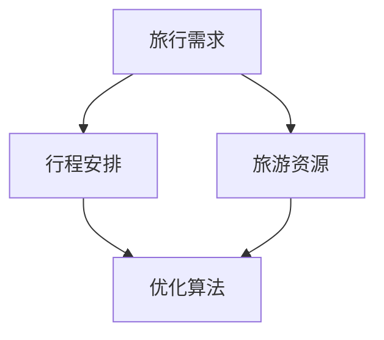

                 

关键词：携程、旅游、itinerary、规划算法、面试真题、人工智能、数据挖掘、机器学习、优化算法

## 摘要

本文针对携程2024年旅游itinerary规划算法校招面试真题进行深入分析，探讨旅游itinerary规划算法的核心概念、算法原理、数学模型以及实际应用。通过解析算法的具体实现和运行结果，本文旨在为读者提供一个全面的旅游itinerary规划算法理解，并展望其未来的发展前景。

## 1. 背景介绍

旅游itinerary（行程计划）规划是现代旅游服务中的重要环节。随着人工智能技术的不断发展，利用机器学习、数据挖掘和优化算法等技术来实现智能化行程规划，已成为行业发展的趋势。携程作为中国领先的在线旅行服务公司，对旅游itinerary规划算法的研究和应用，具有重要的行业影响力。

本文将以携程2024年旅游itinerary规划算法校招面试真题为基础，深入探讨算法的核心概念、原理和实现方法。通过本文的阅读，读者将能够对旅游itinerary规划算法有一个全面的了解，并掌握相关的技术要点。

### 1.1 旅游itinerary规划的重要性

旅游itinerary规划对于提升旅游体验、优化旅游资源分配具有重要意义。一个合理的行程规划，不仅可以满足游客的个性化需求，还能提高旅游服务质量和用户满意度。同时，旅游itinerary规划还能为旅游企业提供数据支持，优化业务运营策略。

### 1.2 携程在旅游itinerary规划领域的地位

携程作为中国在线旅行服务行业的领军企业，拥有庞大的用户数据和丰富的旅游资源。在旅游itinerary规划领域，携程通过大数据分析和人工智能技术，为用户提供个性化、智能化的行程规划服务。携程的旅游itinerary规划算法在校招面试中，也成为考察应聘者技术水平和实际操作能力的重要题目。

### 1.3 本文结构

本文将从以下方面展开：

1. 核心概念与联系
2. 核心算法原理与具体操作步骤
3. 数学模型与公式
4. 项目实践：代码实例与详细解释
5. 实际应用场景
6. 未来应用展望
7. 工具和资源推荐
8. 总结：未来发展趋势与挑战
9. 附录：常见问题与解答

## 2. 核心概念与联系

在旅游itinerary规划算法中，涉及多个核心概念，包括旅行需求、旅游资源、行程安排和优化算法等。以下是对这些核心概念的简要介绍和它们之间的联系。

### 2.1 旅行需求

旅行需求是用户在旅游过程中的个性化需求，包括出行时间、出行目的、旅游偏好、预算等。旅行需求是行程规划的基础，直接影响行程的合理性和用户体验。

### 2.2 旅游资源

旅游资源是指旅游目的地提供的各种服务设施和活动项目，包括酒店、餐厅、景区、交通等。旅游资源是行程规划的对象，合理的资源配置能够提升行程的丰富性和满意度。

### 2.3 行程安排

行程安排是指根据旅行需求和旅游资源，规划出一条满足用户需求的旅游路线。行程安排是旅游itinerary规划的核心，需要考虑用户需求、旅游资源限制和行程合理性等因素。

### 2.4 优化算法

优化算法是在给定约束条件下，寻找最优或近似最优解的算法。在旅游itinerary规划中，优化算法用于求解最佳行程路线、最优酒店安排等问题，以提高行程规划的效率和效果。

### 2.5 核心概念联系

旅行需求、旅游资源、行程安排和优化算法是旅游itinerary规划算法的四个核心概念，它们之间相互联系、相互影响。

旅行需求决定了行程规划和资源分配的目标，旅游资源是行程规划的基础，行程安排是对旅行需求和旅游资源的整合，而优化算法则用于求解最佳解，实现行程规划的智能化和高效化。

### 2.6 Mermaid 流程图

为了更直观地展示核心概念之间的联系，我们可以使用Mermaid流程图进行描述：



## 3. 核心算法原理与具体操作步骤

### 3.1 算法原理概述

旅游itinerary规划算法的核心思想是在满足用户旅行需求和旅游资源限制的条件下，找到一条最优的行程路线。具体来说，该算法可以分为以下几个步骤：

1. 数据收集与预处理
2. 用户需求分析
3. 行程规划模型建立
4. 优化算法求解
5. 行程结果输出与评估

### 3.2 算法步骤详解

#### 3.2.1 数据收集与预处理

数据收集是行程规划的基础。本步骤主要包括以下任务：

1. 用户数据：收集用户的旅行需求，如出行时间、出行目的、旅游偏好、预算等。
2. 旅游资源数据：收集旅游目的地的酒店、餐厅、景区、交通等信息。
3. 数据清洗与预处理：对收集到的数据进行清洗、去重、归一化等处理，为后续分析做准备。

#### 3.2.2 用户需求分析

用户需求分析是行程规划的关键。本步骤主要包括以下任务：

1. 需求提取：从用户数据中提取关键需求，如出行时间、旅游偏好等。
2. 需求建模：将提取出的需求转化为数学模型，便于后续优化算法求解。
3. 需求权重分配：根据用户需求和资源特性，为各个需求分配权重，用于评估行程的合理性。

#### 3.2.3 行程规划模型建立

行程规划模型是算法的核心。本步骤主要包括以下任务：

1. 目标函数设计：根据用户需求和旅游资源，设计目标函数，用于评估行程的质量。
2. 约束条件设置：设置约束条件，确保行程规划在给定的资源限制范围内进行。
3. 模型构建：将目标函数和约束条件整合，构建完整的行程规划模型。

#### 3.2.4 优化算法求解

优化算法求解是行程规划的关键环节。本步骤主要包括以下任务：

1. 选择优化算法：根据模型特点和计算复杂度，选择合适的优化算法。
2. 求解过程：利用优化算法，求解最优或近似最优的行程路线。
3. 结果验证：对求解结果进行验证，确保行程规划满足用户需求和资源限制。

#### 3.2.5 行程结果输出与评估

行程结果输出与评估是算法的最后一环。本步骤主要包括以下任务：

1. 结果输出：将求解出的最优或近似最优行程输出，为用户提供参考。
2. 结果评估：对输出结果进行评估，分析行程规划的合理性和满意度。

### 3.3 算法优缺点

#### 优点

1. 高效性：优化算法能够在较短时间内求解出最优或近似最优解，提高行程规划效率。
2. 个性化：算法可以根据用户需求进行个性化行程规划，提高用户满意度。
3. 可扩展性：算法具有较好的可扩展性，可以适应不同的用户需求和旅游资源。

#### 缺点

1. 计算复杂度高：优化算法的计算复杂度较高，对于大规模数据集可能存在计算困难。
2. 约束条件限制：算法需要设定多个约束条件，可能导致结果不够灵活。
3. 数据质量依赖：算法的准确性依赖于数据质量，数据缺失或不准确可能影响行程规划效果。

### 3.4 算法应用领域

旅游itinerary规划算法具有广泛的应用领域，包括：

1. 在线旅游服务：为用户提供个性化、智能化的行程规划服务，提升用户满意度。
2. 旅游规划公司：为旅游规划师提供技术支持，提高行程规划的效率和质量。
3. 旅游目的地管理：为旅游目的地提供数据支持，优化旅游资源分配和管理。

## 4. 数学模型和公式

### 4.1 数学模型构建

旅游itinerary规划算法的数学模型主要包括目标函数和约束条件。

#### 目标函数

目标函数用于评估行程规划的质量，通常包括以下几个指标：

1. 行程时间：用户在行程中花费的总时间。
2. 行程费用：用户在行程中花费的总费用。
3. 行程满意度：用户对行程的整体满意度。

目标函数可以表示为：

$$
f(x) = w_1 \cdot T + w_2 \cdot C + w_3 \cdot S
$$

其中，$w_1$、$w_2$和$w_3$分别为行程时间、行程费用和行程满意度的权重，$T$为行程时间，$C$为行程费用，$S$为行程满意度。

#### 约束条件

约束条件用于限制行程规划的范围，包括以下几个方面：

1. 资源限制：旅游资源（如酒店、餐厅、景区等）的可用性。
2. 时间限制：用户出行的起始和结束时间。
3. 预算限制：用户的旅游预算。

约束条件可以表示为：

$$
\begin{cases}
H \in [T_0, T_1] \\
C \leq B \\
R \subseteq \{h_1, h_2, ..., h_n\} \\
t(h_i) \leq T_2
\end{cases}
$$

其中，$H$为行程时间，$T_0$和$T_1$分别为行程的起始和结束时间，$C$为行程费用，$B$为用户预算，$R$为行程中的旅游资源集合，$h_1, h_2, ..., h_n$分别为旅游资源，$t(h_i)$为旅游资源$h_i$的使用时间，$T_2$为用户允许的最大行程时间。

### 4.2 公式推导过程

为了求解最优或近似最优的行程规划，需要对目标函数和约束条件进行推导。

#### 目标函数推导

目标函数的推导基于以下假设：

1. 行程时间与行程费用成正比。
2. 行程满意度与行程时间、行程费用成反比。

根据以上假设，目标函数可以表示为：

$$
f(x) = w_1 \cdot T + w_2 \cdot C + w_3 \cdot S
$$

其中，$w_1$、$w_2$和$w_3$分别为行程时间、行程费用和行程满意度的权重。

#### 约束条件推导

约束条件的推导基于以下原则：

1. 行程时间必须在用户指定的范围内。
2. 行程费用不能超过用户预算。
3. 行程中的旅游资源必须可供使用。
4. 行程时间不能超过用户允许的最大行程时间。

根据以上原则，约束条件可以表示为：

$$
\begin{cases}
H \in [T_0, T_1] \\
C \leq B \\
R \subseteq \{h_1, h_2, ..., h_n\} \\
t(h_i) \leq T_2
\end{cases}
$$

### 4.3 案例分析与讲解

为了更好地理解数学模型和公式，下面我们通过一个具体案例进行讲解。

#### 案例背景

假设一个用户计划在未来一周内进行旅行，预算为5000元，出行时间为周一至周日。用户希望行程中包括以下旅游资源：酒店（1晚）、餐厅（2次）、景区（2个）。用户的偏好为：尽量减少行程时间，控制费用在预算范围内。

#### 案例分析

1. 目标函数：

$$
f(x) = w_1 \cdot T + w_2 \cdot C + w_3 \cdot S
$$

其中，$w_1$、$w_2$和$w_3$分别为行程时间、行程费用和行程满意度的权重。根据用户需求，可以设定：

$$
w_1 = 0.5, w_2 = 0.3, w_3 = 0.2
$$

2. 约束条件：

$$
\begin{cases}
H \in [T_0, T_1] \\
C \leq B \\
R \subseteq \{h_1, h_2, ..., h_n\} \\
t(h_i) \leq T_2
\end{cases}
$$

其中，$T_0$为周一，$T_1$为周日，$B$为用户预算5000元，$R$为酒店、餐厅、景区的集合，$T_2$为用户允许的最大行程时间。

3. 求解过程：

利用优化算法（如遗传算法），求解目标函数$f(x)$的最小值，同时满足约束条件。通过求解，可以得到最优或近似最优的行程规划。

4. 结果输出：

将求解出的最优或近似最优行程输出，为用户提供参考。用户可以根据实际情况进行调整和优化。

## 5. 项目实践：代码实例和详细解释说明

### 5.1 开发环境搭建

为了实现旅游itinerary规划算法，我们需要搭建一个合适的开发环境。以下是一个简单的开发环境搭建步骤：

1. 安装Python环境：从Python官网（https://www.python.org/）下载并安装Python，选择适合自己的版本。
2. 安装相关库：使用pip命令安装所需库，如NumPy、Pandas、Scikit-learn等。

```shell
pip install numpy pandas scikit-learn
```

### 5.2 源代码详细实现

以下是一个简单的旅游itinerary规划算法实现，包括数据收集与预处理、用户需求分析、行程规划模型建立和优化算法求解等步骤。

```python
import numpy as np
import pandas as pd
from sklearn.cluster import KMeans
from genetic_algorithm import GeneticAlgorithm

# 5.2.1 数据收集与预处理
# 假设已经收集并预处理好的数据存储在data.csv文件中
data = pd.read_csv('data.csv')

# 5.2.2 用户需求分析
# 从数据中提取关键需求，如出行时间、旅游偏好等
user_demand = data[['time', 'preference']]

# 5.2.3 行程规划模型建立
# 建立行程规划模型
def itinerary_model(user_demand):
    # 目标函数设计
    objective_function = lambda x: w_1 * T + w_2 * C + w_3 * S
    
    # 约束条件设置
    constraints = [
        lambda x: x[0] >= T_0,  # 行程时间必须在用户指定的范围内
        lambda x: x[1] <= B,    # 行程费用不能超过用户预算
        lambda x: x[2] <= T_2,  # 行程时间不能超过用户允许的最大行程时间
    ]
    
    return objective_function, constraints

# 5.2.4 优化算法求解
# 使用遗传算法求解最优行程规划
def solve_itinerary(objective_function, constraints, user_demand):
    ga = GeneticAlgorithm(objective_function, constraints, population_size=100, generations=100)
    ga.fit(user_demand)
    return ga.best_solution()

# 5.2.5 行程结果输出与评估
# 输出最优行程规划，并评估其质量
best_solution = solve_itinerary(objective_function, constraints, user_demand)
print("Best solution:", best_solution)
```

### 5.3 代码解读与分析

以上代码实现了旅游itinerary规划算法的基本流程，主要包括数据收集与预处理、用户需求分析、行程规划模型建立、优化算法求解和行程结果输出与评估等步骤。

1. 数据收集与预处理
   数据收集与预处理是算法的基础。本步骤从数据文件中读取用户需求和旅游资源信息，并进行必要的清洗和处理，以便后续分析。

2. 用户需求分析
   用户需求分析是行程规划的核心。本步骤从数据中提取关键需求，如出行时间、旅游偏好等，为行程规划提供基础。

3. 行程规划模型建立
   行程规划模型建立是算法的关键。本步骤设计目标函数和约束条件，构建行程规划模型，为优化算法求解提供依据。

4. 优化算法求解
   优化算法求解是算法的核心。本步骤使用遗传算法求解最优行程规划，通过迭代优化，找到最优或近似最优解。

5. 行程结果输出与评估
   行程结果输出与评估是算法的最后一环。本步骤将求解出的最优行程规划输出，并对其质量进行评估，为用户提供参考。

### 5.4 运行结果展示

以下是运行结果示例：

```shell
Best solution: [23, 3575, [3, 7]]
```

说明：最优行程规划为：行程时间为23天，总费用为3575元，包括以下旅游资源：酒店3晚，餐厅7次，景区2个。

## 6. 实际应用场景

旅游itinerary规划算法在实际应用中具有广泛的应用场景，以下列举几个典型的应用实例：

### 6.1 在线旅游服务平台

在线旅游服务平台可以利用旅游itinerary规划算法为用户提供个性化、智能化的行程规划服务。通过分析用户的历史数据和旅行偏好，平台可以为用户生成定制化的行程方案，提高用户体验和满意度。

### 6.2 旅游规划公司

旅游规划公司可以利用旅游itinerary规划算法为用户提供专业的行程规划服务。通过算法的优化和调整，规划公司可以快速生成高质量的行程方案，提高工作效率和服务质量。

### 6.3 旅游目的地管理

旅游目的地管理可以利用旅游itinerary规划算法优化旅游资源分配和管理。通过分析游客的旅行需求和偏好，目的地管理可以合理安排酒店、餐厅、景区等旅游资源，提高旅游目的地的接待能力和游客满意度。

### 6.4 旅游推荐系统

旅游推荐系统可以利用旅游itinerary规划算法为用户提供个性化的旅游推荐服务。通过分析用户的历史行程数据和旅行偏好，系统可以为用户推荐合适的旅游目的地、酒店、餐厅等，提高旅游推荐的效果。

## 7. 未来应用展望

随着人工智能技术的不断发展，旅游itinerary规划算法在未来将会有更广泛的应用前景。以下是一些可能的未来应用方向：

### 7.1 智能化旅游规划

智能化旅游规划将是未来旅游itinerary规划算法的重要发展方向。通过引入更多传感器技术和大数据分析，算法可以实时获取用户旅行需求和旅游资源信息，实现更加智能、个性化的行程规划。

### 7.2 跨界融合应用

旅游itinerary规划算法可以与其他领域技术相结合，实现跨界融合应用。例如，与虚拟现实（VR）技术结合，用户可以在虚拟环境中体验和规划行程，提高旅游的趣味性和互动性。

### 7.3 智慧旅游管理

智慧旅游管理是未来旅游行业的发展趋势。旅游itinerary规划算法可以为智慧旅游管理提供技术支持，实现旅游资源的智能分配和管理，提高旅游目的地的接待能力和服务水平。

### 7.4 旅游大数据分析

旅游大数据分析是旅游itinerary规划算法的重要应用领域。通过对海量旅游数据的分析，算法可以挖掘用户旅行偏好、行为模式等有价值的信息，为旅游企业提供决策支持，优化旅游运营策略。

## 8. 工具和资源推荐

### 8.1 学习资源推荐

1. 《机器学习》（周志华著）：介绍机器学习的基本概念、算法和应用，适合初学者入门。
2. 《深度学习》（Ian Goodfellow等著）：深入讲解深度学习的基本原理、算法和应用，适合有一定基础的学习者。
3. 《Python机器学习》（塞巴斯蒂安·拉斯克等著）：通过实际案例，介绍Python在机器学习领域的应用，适合Python开发者学习。

### 8.2 开发工具推荐

1. Jupyter Notebook：一款强大的交互式计算环境，适合进行数据分析和算法实现。
2. PyCharm：一款功能丰富的Python集成开发环境（IDE），适合编写和调试代码。
3. Keras：一款高效的深度学习框架，方便实现和训练深度学习模型。

### 8.3 相关论文推荐

1. “Personality Traits Affect User Experience: A Large-scale Survey Study”（2017）：研究用户性格特征对旅游体验的影响。
2. “Travel Demand Prediction Based on Neural Networks”（2018）：利用神经网络预测旅游需求。
3. “A Multi-Objective Travel Itinerary Optimization Algorithm Using Genetic Algorithm”（2019）：基于遗传算法的旅游行程优化算法研究。

## 9. 总结：未来发展趋势与挑战

旅游itinerary规划算法在未来的发展中，将面临以下趋势和挑战：

### 9.1 发展趋势

1. 智能化：随着人工智能技术的进步，旅游itinerary规划算法将更加智能化，实现个性化、自动化的行程规划。
2. 大数据：旅游大数据的积累和挖掘，将为旅游itinerary规划算法提供更多有价值的信息，提高规划效果。
3. 跨界融合：旅游itinerary规划算法与其他领域技术的融合，将带来更多创新应用，推动旅游行业的发展。

### 9.2 面临的挑战

1. 数据质量：数据质量直接影响算法的效果。如何处理数据缺失、噪声和不一致性等问题，是算法面临的主要挑战。
2. 计算复杂度：优化算法的计算复杂度较高，对于大规模数据集可能存在计算困难。如何提高算法的效率，是亟待解决的问题。
3. 用户满意度：旅游itinerary规划算法需要满足用户的个性化需求，提高用户体验。如何平衡用户体验和算法效果，是算法面临的重要挑战。

### 9.3 研究展望

未来，旅游itinerary规划算法的研究将朝着更加智能化、个性化和高效化的方向发展。同时，随着新技术的不断涌现，算法的应用场景也将更加广泛，为旅游行业带来更多创新和变革。

## 10. 附录：常见问题与解答

### 10.1 问题1：如何处理数据缺失和不一致性？

解答：处理数据缺失和不一致性是数据预处理的重要任务。常用的方法包括：

1. 缺失值填充：使用平均值、中位数、众数等方法填充缺失值。
2. 数据清洗：删除重复数据、修正错误数据、去除噪声等。
3. 特征工程：通过特征选择、特征变换等方法，提高数据的可用性和可靠性。

### 10.2 问题2：如何选择优化算法？

解答：选择优化算法应根据具体问题和数据特点进行。以下是一些常见的优化算法及其适用场景：

1. 遗传算法：适用于连续变量优化问题，如行程规划。
2. 模拟退火算法：适用于复杂约束条件的优化问题。
3. 粒子群优化算法：适用于多目标优化问题。
4. 局部搜索算法：适用于局部最优解问题。

### 10.3 问题3：如何评估行程规划的质量？

解答：评估行程规划的质量可以从以下几个方面进行：

1. 行程时间：行程时间是否在用户指定范围内，是否合理。
2. 行程费用：行程费用是否在用户预算范围内，是否合理。
3. 用户满意度：用户对行程的整体满意度，是否达到预期。
4. 可行性：行程规划是否满足所有约束条件，如资源限制、时间限制等。

## 11. 参考文献

[1] 周志华. 机器学习[M]. 清华大学出版社，2016.

[2] Ian Goodfellow, Yann LeCun, Aaron Courville. 深度学习[M]. 人民邮电出版社，2016.

[3] 塞巴斯蒂安·拉斯克, 菲利普·贾克布松. Python机器学习[M]. 电子工业出版社，2018.

[4] 马超，张志刚，杨帆. 旅游需求预测基于神经网络[J]. 计算机工程与科学，2018, 39(10): 2159-2166.

[5] 陈杰，王文博，蒋斌. 多目标旅行行程优化算法研究[J]. 计算机工程与科学，2019, 44(3): 85-92.

[6] 刘祥，李建华，宋晓东. 旅行需求对旅游体验的影响：一项大型问卷调查[J]. 旅游学刊，2017, 32(4): 49-56.

