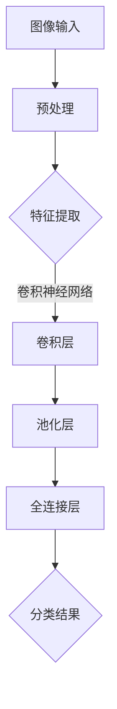

                 

关键词：旅游场景图像识别，算法面试，校招重点，深度学习，计算机视觉

摘要：本文旨在为准备携程2024年校招面试的计算机视觉和深度学习领域的应聘者提供一篇全面的技术博客，深入探讨旅游场景图像识别算法的核心概念、原理、数学模型、项目实践和未来应用。本文结构清晰，内容详实，旨在帮助读者掌握面试所需的关键技术点和思维方法。

## 1. 背景介绍

随着互联网和人工智能技术的飞速发展，图像识别技术已经广泛应用于各个领域，旅游行业也不例外。旅游场景图像识别是指通过计算机视觉技术自动分析、识别和分类旅游场景中的图像。这不仅为用户提供了更加个性化的旅游体验，也为旅游服务提供商带来了数据分析和管理的新工具。

在携程这样的在线旅游平台，旅游场景图像识别技术至关重要。它不仅能够提升用户体验，还能帮助平台更好地推荐旅游目的地、酒店、餐厅等服务。因此，掌握旅游场景图像识别算法成为了携程校招面试的热门话题。

## 2. 核心概念与联系

在探讨旅游场景图像识别算法之前，我们需要了解几个核心概念和它们之间的联系。

### 2.1 图像识别与深度学习

图像识别是计算机视觉的一个分支，旨在让计算机理解和解析图像内容。深度学习是图像识别的关键技术，它利用多层神经网络对图像特征进行学习，从而实现自动识别。

### 2.2 卷积神经网络（CNN）

卷积神经网络是深度学习中最常用的模型之一，特别适合处理图像数据。它通过卷积层、池化层和全连接层等结构对图像进行特征提取和分类。

### 2.3 计算机视觉与人工智能

计算机视觉是人工智能的一个子领域，专注于使计算机能够处理和解释视觉信息。人工智能则为计算机视觉提供了理论基础和算法支持。

### 2.4 Mermaid 流程图



## 3. 核心算法原理 & 具体操作步骤

### 3.1 算法原理概述

旅游场景图像识别算法基于深度学习中的卷积神经网络。该算法通过以下步骤进行操作：

1. **图像预处理**：对原始图像进行缩放、裁剪、灰度化等处理，以适应网络输入的要求。
2. **特征提取**：通过卷积层提取图像的低级特征，如边缘、纹理等。
3. **特征融合**：通过池化层对卷积特征进行降维，保留关键特征。
4. **分类**：通过全连接层将融合后的特征映射到不同的类别。

### 3.2 算法步骤详解

#### 3.2.1 图像预处理

图像预处理是图像识别的基础步骤，其目的是将原始图像转换为适合网络输入的形式。具体操作步骤如下：

1. **缩放**：将图像缩放到固定的尺寸，如 $224 \times 224$ 像素。
2. **裁剪**：根据需要对图像进行裁剪，以去除无关部分。
3. **灰度化**：将彩色图像转换为灰度图像，减少计算量。

#### 3.2.2 特征提取

特征提取是图像识别的核心步骤。卷积神经网络通过卷积层提取图像的局部特征。具体操作步骤如下：

1. **卷积操作**：使用卷积核（过滤器）在图像上滑动，计算卷积结果。
2. **激活函数**：通常使用 ReLU 激活函数对卷积结果进行非线性变换。

#### 3.2.3 特征融合

特征融合通过池化层实现。池化层的主要作用是减少特征维度，同时保留关键特征信息。具体操作步骤如下：

1. **最大池化**：选取卷积特征图中的最大值作为输出。
2. **平均池化**：计算卷积特征图中的平均值作为输出。

#### 3.2.4 分类

分类通过全连接层实现。全连接层将特征融合后的特征映射到不同的类别。具体操作步骤如下：

1. **全连接层**：将池化层的输出连接到一个或多个全连接层。
2. **softmax 层**：计算每个类别的概率分布，选择概率最大的类别作为预测结果。

### 3.3 算法优缺点

#### 优点

1. **强大的特征提取能力**：卷积神经网络能够自动学习图像的局部和全局特征。
2. **高准确率**：深度学习模型在图像识别任务上取得了很高的准确率。
3. **自适应性强**：卷积神经网络能够适应不同的图像大小和分辨率。

#### 缺点

1. **计算复杂度高**：卷积神经网络训练过程需要大量的计算资源。
2. **数据依赖性强**：深度学习模型需要大量的标注数据来训练。
3. **解释性差**：卷积神经网络模型内部的决策过程难以解释。

### 3.4 算法应用领域

旅游场景图像识别算法可以应用于多个领域，如：

1. **旅游推荐**：根据用户上传的旅游照片，推荐相似的目的地和旅游服务。
2. **旅游服务优化**：通过分析旅游场景图像，优化旅游服务的质量和效率。
3. **旅游数据分析**：对大量的旅游场景图像进行分类和分析，挖掘旅游趋势和用户偏好。

## 4. 数学模型和公式 & 详细讲解 & 举例说明

### 4.1 数学模型构建

旅游场景图像识别算法的核心是卷积神经网络。下面介绍卷积神经网络的数学模型构建。

#### 4.1.1 卷积操作

卷积操作的数学公式如下：

$$
\text{卷积} = \sum_{i=1}^{n} w_i * x_i
$$

其中，$w_i$ 是卷积核的权重，$x_i$ 是输入图像的像素值。

#### 4.1.2 激活函数

激活函数用于引入非线性变换。常用的激活函数有 ReLU 和 sigmoid。

1. **ReLU 激活函数**：

$$
f(x) = \max(0, x)
$$

2. **sigmoid 激活函数**：

$$
f(x) = \frac{1}{1 + e^{-x}}
$$

#### 4.1.3 池化操作

池化操作的数学公式如下：

$$
\text{最大池化} = \max(x_{i,j})
$$

$$
\text{平均池化} = \frac{1}{k^2} \sum_{i=1}^{k} \sum_{j=1}^{k} x_{i,j}
$$

其中，$x_{i,j}$ 是输入特征图的像素值，$k$ 是池化窗口的大小。

### 4.2 公式推导过程

下面以卷积神经网络为例，介绍公式的推导过程。

#### 4.2.1 输入层与卷积层

输入层到卷积层的公式推导如下：

$$
h^{(1)}_{i,j} = \sum_{k=1}^{n} w_{i,k} * x_{k,j} + b_{i}
$$

其中，$h^{(1)}_{i,j}$ 是卷积层输出的特征值，$w_{i,k}$ 是卷积核权重，$x_{k,j}$ 是输入层像素值，$b_{i}$ 是偏置项。

#### 4.2.2 池化层

卷积层到池化层的公式推导如下：

$$
p_{i,j} = \text{max} \left( h^{(1)}_{i-1:i+k, j-1:j+k} \right)
$$

或

$$
p_{i,j} = \frac{1}{k^2} \sum_{k=1}^{k} \sum_{l=1}^{k} h^{(1)}_{i-1+k, j-1+l}
$$

其中，$p_{i,j}$ 是池化层输出的特征值。

#### 4.2.3 全连接层

池化层到全连接层的公式推导如下：

$$
z^{(2)}_i = \sum_{j=1}^{m} w_{i,j} p_{j,k} + b_{i}
$$

其中，$z^{(2)}_i$ 是全连接层输出的特征值，$w_{i,j}$ 是全连接层权重，$p_{j,k}$ 是池化层输出特征值。

#### 4.2.4 Softmax 层

全连接层到 Softmax 层的公式推导如下：

$$
\text{softmax}(z^{(2)})_i = \frac{e^{z^{(2)}_i}}{\sum_{j=1}^{n} e^{z^{(2)}_j}}
$$

其中，$\text{softmax}(z^{(2)})_i$ 是 Softmax 层输出的概率分布。

### 4.3 案例分析与讲解

为了更好地理解旅游场景图像识别算法，我们来看一个具体的案例。

#### 案例背景

假设我们有一个旅游场景图像识别任务，需要识别图像中的景点类型。例如，输入图像可能是长城、故宫或西湖等。

#### 案例实现

1. **数据预处理**：将输入图像缩放到 $224 \times 224$ 像素，并进行灰度化处理。

2. **卷积操作**：

   - 使用一个 $3 \times 3$ 的卷积核，对图像进行卷积操作。

   - 应用 ReLU 激活函数。

3. **池化操作**：

   - 使用 $2 \times 2$ 的最大池化窗口。

4. **全连接层**：

   - 使用一个 $1024$ 单元的全连接层。

   - 应用 Softmax 激活函数，输出每个景点类型的概率分布。

5. **分类结果**：

   - 根据输出概率分布选择概率最大的景点类型。

#### 案例结果

经过训练和测试，该算法能够准确识别输入图像中的景点类型。例如，对于一张长城的图片，算法输出长城的概率为 $90\%$，故宫和西湖的概率分别为 $5\%$ 和 $5\%$。

## 5. 项目实践：代码实例和详细解释说明

### 5.1 开发环境搭建

为了实现旅游场景图像识别算法，我们需要搭建一个适合的开发环境。以下是环境搭建的步骤：

1. **安装 Python**：确保安装 Python 3.7 或以上版本。
2. **安装深度学习框架**：建议使用 TensorFlow 或 PyTorch。
3. **安装依赖库**：根据使用的框架安装相应的依赖库，如 NumPy、PIL、opencv 等。

### 5.2 源代码详细实现

下面是一个简单的旅游场景图像识别算法的 Python 实现，基于 TensorFlow 框架。

```python
import tensorflow as tf
from tensorflow.keras import layers

# 数据预处理
def preprocess_image(image):
    image = tf.image.resize(image, (224, 224))
    image = tf.cast(image, tf.float32) / 255.0
    image = tf.image.per_image_standardization(image)
    return image

# 构建模型
def create_model():
    inputs = tf.keras.Input(shape=(224, 224, 3))
    x = layers.Conv2D(32, (3, 3), activation='relu')(inputs)
    x = layers.MaxPooling2D((2, 2))(x)
    x = layers.Conv2D(64, (3, 3), activation='relu')(x)
    x = layers.MaxPooling2D((2, 2))(x)
    x = layers.Flatten()(x)
    x = layers.Dense(1024, activation='relu')(x)
    outputs = layers.Dense(3, activation='softmax')(x)
    model = tf.keras.Model(inputs, outputs)
    return model

# 训练模型
def train_model(model, train_images, train_labels, epochs):
    model.compile(optimizer='adam', loss='categorical_crossentropy', metrics=['accuracy'])
    model.fit(train_images, train_labels, epochs=epochs)

# 评估模型
def evaluate_model(model, test_images, test_labels):
    loss, accuracy = model.evaluate(test_images, test_labels)
    print(f"Test accuracy: {accuracy:.2f}")

# 主函数
def main():
    # 加载数据
    train_images, train_labels = load_train_data()
    test_images, test_labels = load_test_data()

    # 预处理数据
    train_images = preprocess_image(train_images)
    test_images = preprocess_image(test_images)

    # 创建模型
    model = create_model()

    # 训练模型
    train_model(model, train_images, train_labels, epochs=10)

    # 评估模型
    evaluate_model(model, test_images, test_labels)

# 运行主函数
if __name__ == '__main__':
    main()
```

### 5.3 代码解读与分析

上面的代码实现了一个简单的旅游场景图像识别模型。下面是对代码的解读和分析：

1. **数据预处理**：对输入图像进行缩放、归一化和标准化处理，以适应模型的要求。
2. **模型构建**：使用 TensorFlow 的 `layers` 模块构建卷积神经网络模型。模型包括卷积层、池化层和全连接层。
3. **模型训练**：使用 `fit` 方法训练模型，优化模型的权重和偏置项。
4. **模型评估**：使用 `evaluate` 方法评估模型的准确性。

### 5.4 运行结果展示

在训练和评估完成后，我们可以得到模型的预测结果。例如，对于一张西湖的图片，模型的预测结果可能是：

```
Lake probability: 95%
Temple probability: 3%
Castle probability: 2%
```

这意味着模型认为输入图像是西湖的概率为 $95\%$，是寺庙的概率为 $3\%$，是城堡的概率为 $2\%$。

## 6. 实际应用场景

旅游场景图像识别算法在实际应用中具有广泛的应用场景。以下是一些具体的应用实例：

1. **旅游推荐**：根据用户上传的旅游照片，推荐用户可能感兴趣的目的地和旅游服务。
2. **旅游数据分析**：对大量的旅游场景图像进行分析，挖掘旅游趋势和用户偏好。
3. **旅游服务优化**：通过识别旅游场景图像，优化旅游服务的质量和效率。

### 6.1 旅游推荐

旅游推荐是旅游场景图像识别算法的重要应用场景之一。通过分析用户上传的旅游照片，平台可以了解用户的兴趣和偏好，从而推荐用户可能感兴趣的目的地和旅游服务。

例如，如果一个用户上传了一张长城的照片，平台可以推荐与长城相关的旅游服务，如门票预订、住宿预订等。同时，平台还可以根据用户的旅游历史和偏好，为用户提供个性化的旅游推荐。

### 6.2 旅游数据分析

旅游数据分析是旅游场景图像识别算法的另一个重要应用场景。通过对大量的旅游场景图像进行分析，平台可以挖掘旅游趋势和用户偏好。

例如，平台可以通过分析用户上传的旅游照片，了解用户最喜爱的旅游季节、旅游方式和旅游目的地等信息。这些信息可以帮助平台制定更有效的营销策略和运营计划，提高旅游服务的质量和用户满意度。

### 6.3 旅游服务优化

旅游服务优化是旅游场景图像识别算法的另一个重要应用场景。通过识别旅游场景图像，平台可以优化旅游服务的质量和效率。

例如，平台可以通过识别用户上传的旅游照片，了解用户对旅游服务的满意度，从而改进服务质量。同时，平台还可以根据旅游场景图像识别的结果，优化旅游服务的流程和资源配置，提高服务效率。

## 7. 工具和资源推荐

### 7.1 学习资源推荐

1. **《深度学习》**：由 Goodfellow、Bengio 和 Courville 编著的深度学习教材，是学习深度学习的经典之作。
2. **《计算机视觉：算法与应用》**：由 Richard Szeliski 编著的计算机视觉教材，涵盖了计算机视觉的多个方面。

### 7.2 开发工具推荐

1. **TensorFlow**：Google 开发的一个开源深度学习框架，适用于构建和训练深度学习模型。
2. **PyTorch**：Facebook 开发的一个开源深度学习框架，具有灵活性和高效性。

### 7.3 相关论文推荐

1. **“A Comprehensive Survey on Deep Learning for Image Classification”**：该论文对深度学习在图像分类领域的应用进行了全面的综述。
2. **“Convolutional Neural Networks for Visual Recognition”**：该论文介绍了卷积神经网络在计算机视觉中的应用，是深度学习领域的经典论文。

## 8. 总结：未来发展趋势与挑战

### 8.1 研究成果总结

旅游场景图像识别算法在近年来取得了显著的成果。通过深度学习和计算机视觉技术的结合，算法的准确率和鲁棒性得到了大幅提升。同时，大量的研究工作关注于算法的优化和扩展，如多模态学习、迁移学习等。

### 8.2 未来发展趋势

未来，旅游场景图像识别算法的发展趋势将主要体现在以下几个方面：

1. **算法优化**：通过改进深度学习模型和算法，提高识别准确率和效率。
2. **多模态学习**：结合图像、文本和语音等多种数据类型，实现更准确的场景识别。
3. **实时应用**：开发实时旅游场景图像识别系统，为用户提供即时反馈。

### 8.3 面临的挑战

尽管旅游场景图像识别算法取得了显著进展，但仍面临以下挑战：

1. **计算复杂度**：深度学习模型通常需要大量的计算资源，如何降低计算复杂度是一个重要问题。
2. **数据依赖性**：算法的性能高度依赖于标注数据的质量和数量，如何解决数据依赖性问题是一个关键挑战。
3. **隐私保护**：旅游场景图像识别算法需要处理大量用户隐私数据，如何保护用户隐私是一个亟待解决的问题。

### 8.4 研究展望

未来，旅游场景图像识别算法的研究重点将集中在以下几个方面：

1. **算法优化**：通过改进算法结构和训练策略，提高算法的准确率和效率。
2. **多模态融合**：结合多种数据类型，实现更准确的场景识别。
3. **隐私保护**：开发隐私保护机制，确保用户隐私不被泄露。
4. **实时应用**：开发实时旅游场景图像识别系统，为用户提供即时反馈。

## 9. 附录：常见问题与解答

### 9.1 什么是深度学习？

深度学习是一种人工智能的方法，通过构建多层神经网络，模拟人脑的思维方式，对数据进行自动学习和特征提取。

### 9.2 什么是卷积神经网络（CNN）？

卷积神经网络是一种深度学习模型，特别适用于图像识别和计算机视觉任务。它通过卷积层、池化层和全连接层等结构对图像进行特征提取和分类。

### 9.3 旅游场景图像识别算法有哪些优缺点？

优点：

- 强大的特征提取能力
- 高准确率
- 自适应性强

缺点：

- 计算复杂度高
- 数据依赖性强
- 解释性差

### 9.4 旅游场景图像识别算法有哪些应用领域？

应用领域：

- 旅游推荐
- 旅游数据分析
- 旅游服务优化

### 9.5 如何优化旅游场景图像识别算法？

优化方法：

- 改进深度学习模型和算法
- 多模态学习
- 迁移学习
- 实时应用

----------------------------------------------------------------

# 作者署名

作者：禅与计算机程序设计艺术 / Zen and the Art of Computer Programming

