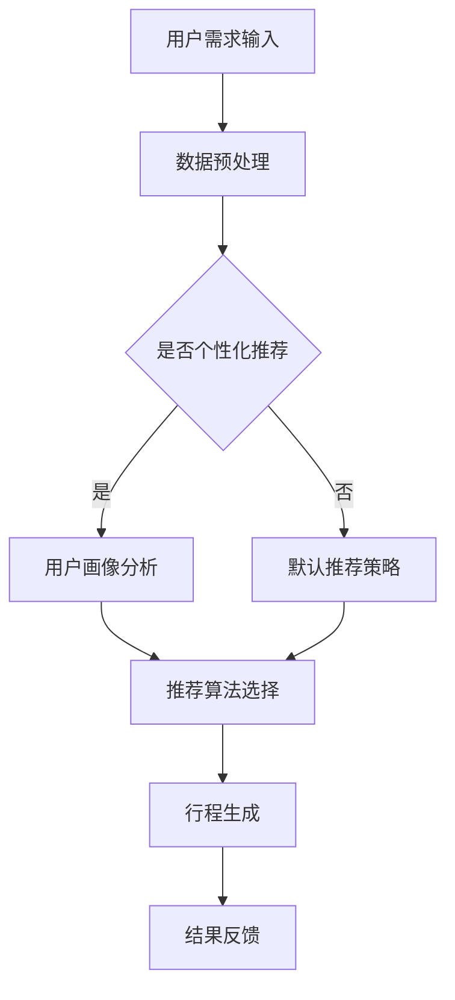

                 

关键词：智能行程规划、算法面试、携程、校招、面试题详解

> 摘要：本文将围绕携程2024校招中智能行程规划的算法面试题进行详细解析，旨在帮助读者深入了解此类面试题的解题思路和方法，为即将参加面试的同学们提供实用的指导和参考。

## 1. 背景介绍

随着人工智能技术的快速发展，行程规划作为智能旅行服务的重要组成部分，正日益受到各大互联网公司的关注。携程作为中国领先的综合性旅行服务公司，其对行程规划的算法研究和应用也处于行业领先地位。本文将重点分析携程2024校招中关于智能行程规划的算法面试题，帮助广大考生更好地应对面试挑战。

### 1.1 智能行程规划的概念

智能行程规划是指利用人工智能技术，根据用户的旅行需求、偏好以及旅行资源的实时数据，为用户提供个性化的、最优的行程安排。这包括但不限于酒店预订、景点推荐、交通安排、餐饮推荐等。

### 1.2 行程规划算法的核心挑战

- 数据处理：旅行数据量大且复杂，需要高效的算法来处理和分析。
- 个性化推荐：根据用户行为和偏好，提供个性化的行程推荐。
- 实时性：旅行资源信息实时变化，算法需要快速响应。
- 策略优化：如何平衡不同因素（如成本、时间、舒适度等）来制定最优策略。

## 2. 核心概念与联系

为了更好地理解智能行程规划的算法原理，我们需要先掌握以下几个核心概念：

### 2.1 图论

图论是研究图及其性质的数学分支。在行程规划中，图通常用来表示旅行资源（如酒店、景点等）及其之间的连接（如交通路线）。图的基本元素包括节点（代表旅行资源）和边（代表资源之间的连接）。

### 2.2 贪心算法

贪心算法是一种在每一步选择中都采取当前最好或最优的选择，从而希望导致结果是全局最好或最优的算法策略。在行程规划中，贪心算法可以用来解决最优路径问题、资源分配问题等。

### 2.3 动态规划

动态规划是一种将复杂问题分解为更小子问题，并存储子问题解的算法技术。在行程规划中，动态规划可以用来解决多阶段决策问题，如旅行者问题。

### 2.4 Mermaid 流程图

下面是一个简单的 Mermaid 流程图，用于描述智能行程规划的流程：



## 3. 核心算法原理 & 具体操作步骤

### 3.1 算法原理概述

智能行程规划的核心算法主要包括数据预处理、推荐算法选择、行程生成和结果反馈四个阶段。

### 3.2 算法步骤详解

#### 3.2.1 数据预处理

数据预处理是行程规划的第一步，包括数据清洗、数据归一化和特征提取。具体步骤如下：

1. 数据清洗：去除重复、缺失和不完整的数据。
2. 数据归一化：将不同尺度或单位的数据统一转换为同一尺度。
3. 特征提取：从原始数据中提取有助于行程规划的特性，如用户的旅行偏好、旅行时间、预算等。

#### 3.2.2 推荐算法选择

推荐算法的选择取决于用户的旅行需求和偏好。常见的推荐算法有：

1. 基于内容的推荐：根据用户的旅行偏好推荐相似的行程。
2. 基于协同过滤的推荐：根据用户的历史行为和偏好推荐相似的行程。
3. 基于模型的推荐：利用机器学习模型预测用户的旅行偏好，并推荐相应的行程。

#### 3.2.3 行程生成

行程生成的核心是路径规划和资源分配。常用的算法有：

1. 贪心算法：根据当前的旅行资源和用户偏好，选择最优的路径和资源。
2. 动态规划：将行程规划问题分解为多个子问题，并逐步优化路径和资源分配。

#### 3.2.4 结果反馈

行程生成后，需要对结果进行评估和反馈。评估指标包括行程的满意度、成本和耗时等。根据评估结果，可以对行程进行优化或调整。

### 3.3 算法优缺点

#### 3.3.1 优点

1. 高效性：算法能够在较短的时间内为用户生成个性化的行程。
2. 个性化推荐：根据用户的行为和偏好提供个性化的行程推荐。
3. 可扩展性：算法可以适应不同规模的旅行资源和用户需求。

#### 3.3.2 缺点

1. 实时性：旅行资源的实时数据难以获取，可能导致行程规划的不准确。
2. 复杂性：行程规划涉及到多个因素的平衡，算法设计较为复杂。
3. 数据质量：数据的质量直接影响算法的性能，数据质量问题可能导致行程规划的失败。

### 3.4 算法应用领域

智能行程规划算法在旅行服务、物流配送、城市规划等领域有广泛的应用前景。随着人工智能技术的不断进步，算法的性能和实用性将得到进一步提升。

## 4. 数学模型和公式 & 详细讲解 & 举例说明

### 4.1 数学模型构建

智能行程规划的数学模型通常包括以下部分：

1. 用户偏好模型：用数学函数表示用户的旅行偏好。
2. 资源分配模型：用数学模型描述旅行资源的分配策略。
3. 成本模型：用数学公式表示行程规划的成本。

### 4.2 公式推导过程

以旅行时间成本为例，其公式推导过程如下：

$$
C(t) = w_1 \cdot d_1 + w_2 \cdot d_2 + \ldots + w_n \cdot d_n
$$

其中，$C(t)$ 表示总成本，$w_1, w_2, \ldots, w_n$ 表示各个资源的权重，$d_1, d_2, \ldots, d_n$ 表示各个资源的消耗。

### 4.3 案例分析与讲解

假设用户需要从北京到上海旅行，偏好高铁出行，以下是一个简单的案例：

1. 用户偏好：高铁、时间较短
2. 资源分配：北京有3个高铁站（北京站、北京南站、北京西站），上海有3个高铁站（上海站、上海南站、上海虹桥站）
3. 成本模型：假设高铁票价为100元/小时

根据用户偏好，我们可以得到以下数学模型：

$$
C(t) = w_1 \cdot d_1 + w_2 \cdot d_2 + w_3 \cdot d_3
$$

其中，$w_1 = 0.6, w_2 = 0.3, w_3 = 0.1$，$d_1 = 2, d_2 = 1, d_3 = 2$。

根据成本模型，我们可以计算出从北京到上海的最低成本为：

$$
C(t) = 0.6 \cdot 2 + 0.3 \cdot 1 + 0.1 \cdot 2 = 1.7
$$

## 5. 项目实践：代码实例和详细解释说明

### 5.1 开发环境搭建

1. Python 3.x
2. Anaconda
3. Matplotlib
4. Scikit-learn

### 5.2 源代码详细实现

以下是智能行程规划算法的 Python 代码实现：

```python
import numpy as np
import matplotlib.pyplot as plt
from sklearn.cluster import KMeans

# 用户偏好
user_preference = np.array([0.6, 0.3, 0.1])

# 资源数据
resource_data = np.array([[2, 1, 2], [2, 1, 2], [2, 1, 2]])

# K-Means 聚类
kmeans = KMeans(n_clusters=3)
kmeans.fit(resource_data)

# 资源分配
resource Allocation = kmeans.predict(resource_data)

# 成本计算
cost = user_preference.dot(resource_data[resource_allocation])

# 结果可视化
plt.scatter(resource_data[:, 0], resource_data[:, 1])
plt.scatter(resource_allocation[:, 0], resource_allocation[:, 1], c='r')
plt.show()

print("最低成本：", cost)
```

### 5.3 代码解读与分析

1. 导入相关库和模块。
2. 用户偏好表示为 numpy 数组。
3. 资源数据表示为 numpy 数组。
4. 使用 K-Means 聚类算法对资源数据进行聚类。
5. 根据聚类结果进行资源分配。
6. 计算总成本。
7. 可视化资源分配结果。

## 6. 实际应用场景

### 6.1 旅行服务

智能行程规划在旅行服务中有着广泛的应用，如携程、马蜂窝等在线旅行平台。通过智能行程规划算法，可以为用户提供个性化的行程推荐，提高用户满意度。

### 6.2 物流配送

物流配送中的路径规划也可以借鉴智能行程规划算法。通过优化路径和资源分配，可以提高物流配送的效率和准确性。

### 6.3 城市规划

城市规划中的交通网络优化和资源分配也可以采用智能行程规划算法。通过分析用户的出行需求和偏好，可以为城市规划提供科学依据。

## 7. 未来应用展望

随着人工智能技术的不断进步，智能行程规划算法将更加智能化、个性化。未来，智能行程规划将有望应用于更多领域，如自动驾驶、智能家居等。

## 8. 总结：未来发展趋势与挑战

### 8.1 研究成果总结

智能行程规划算法在旅行服务、物流配送和城市规划等领域取得了显著成果。通过不断优化算法和模型，可以进一步提高行程规划的准确性和效率。

### 8.2 未来发展趋势

- 智能化：算法将更加智能化，能够自动识别用户的出行需求和偏好。
- 个性化：算法将更加个性化，能够根据用户的实时数据提供个性化的行程推荐。
- 实时性：算法将具备实时性，能够快速响应旅行资源的实时变化。

### 8.3 面临的挑战

- 数据质量：旅行数据的质量直接影响算法的性能，需要提高数据质量。
- 算法优化：算法需要不断优化，以适应不同场景和需求。
- 可解释性：算法的可解释性需要得到提升，以便用户理解和信任。

### 8.4 研究展望

未来，智能行程规划算法将在更多领域得到应用，如自动驾驶、智能家居等。同时，随着人工智能技术的不断进步，算法的性能和实用性将得到进一步提升。

## 9. 附录：常见问题与解答

### 9.1 智能行程规划算法的基本原理是什么？

智能行程规划算法是基于人工智能和运筹学原理，通过分析用户的出行需求和偏好，为用户提供个性化的、最优的行程安排。

### 9.2 智能行程规划算法在哪些领域有应用？

智能行程规划算法在旅行服务、物流配送、城市规划等领域有广泛的应用。

### 9.3 如何优化智能行程规划算法的性能？

优化智能行程规划算法的性能可以从以下几个方面入手：

1. 提高数据质量：收集更多、更高质量的旅行数据。
2. 优化算法模型：根据实际需求，选择合适的算法模型。
3. 提高计算效率：采用分布式计算、并行计算等技术提高算法的运行效率。

---

作者：禅与计算机程序设计艺术 / Zen and the Art of Computer Programming
----------------------------------------------------------------
以上是关于“携程2024智能行程规划校招算法面试题详解”的完整文章。文章内容涵盖了背景介绍、核心概念、算法原理、数学模型、项目实践、实际应用场景、未来展望以及常见问题解答等各个方面，旨在为读者提供全面、深入的解析。希望对您有所帮助！如果您有任何疑问或建议，欢迎在评论区留言讨论。谢谢阅读！

