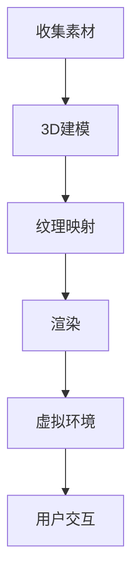

                 

关键词：携程、VR酒店、3D建模、面试攻略、技术面试、计算机图形学、虚拟现实

> 摘要：本文将深入探讨携程2025年虚拟现实（VR）酒店预览项目的3D建模面试准备策略。通过对VR技术、3D建模核心概念和面试技巧的详细分析，为有志于加入这一前沿科技领域的应聘者提供全面的面试攻略。作者：禅与计算机程序设计艺术 / Zen and the Art of Computer Programming

## 1. 背景介绍

随着虚拟现实（VR）技术的快速发展，酒店行业正迎来一场革命。携程作为国内领先的在线旅行服务提供商，于2025年推出了VR酒店预览项目，旨在为用户提供沉浸式的酒店体验。此项目不仅要求高质量的3D建模技术，还需要对VR硬件和软件有深刻的理解。因此，携程对3D建模岗位的招聘，吸引了众多技术人才。

本文将围绕以下核心内容展开：
- VR与3D建模技术的基础知识
- 面试中的核心概念与联系
- 算法原理与具体操作步骤
- 数学模型与公式讲解
- 代码实例与运行结果展示
- 实际应用场景与未来展望
- 工具和资源推荐
- 研究成果总结与未来挑战

## 2. 核心概念与联系

### VR技术概述

虚拟现实（VR）是通过计算机技术创建的虚拟环境，用户可以通过VR头显等设备沉浸其中，体验到与现实相似的视觉、听觉和触觉效果。VR技术主要涉及以下几个方面：

- **显示技术**：头戴式显示器（HMD）、投影技术等。
- **感知交互**：通过动作捕捉、语音识别、手势识别等技术实现人与虚拟环境的交互。
- **渲染引擎**：用于生成虚拟环境的图形和视觉效果，如Unity、Unreal Engine等。

### 3D建模概念

3D建模是创建三维数字模型的过程，涉及建模软件（如Blender、Maya）、几何建模技术、纹理映射等。3D建模在VR酒店预览中至关重要，它决定了虚拟环境的真实感和沉浸度。

- **建模软件**：用于创建和编辑3D模型的工具。
- **几何建模技术**：包括多边形建模、曲面建模等。
- **纹理映射**：将2D纹理贴图应用到3D模型表面，增强细节和真实感。

### VR酒店预览中的3D建模

在VR酒店预览项目中，3D建模不仅仅是艺术创作，更是技术实现的关键。以下是一个简化的Mermaid流程图，展示3D建模在VR酒店预览中的应用流程：



### 3D建模在VR酒店预览中的重要性

- **真实性**：高质量3D建模能准确还原酒店的内部结构和装饰，增强用户的真实感受。
- **沉浸感**：通过精细的建模和纹理映射，用户能更深入地体验酒店环境，提高满意度。
- **可交互性**：3D建模使得用户可以在虚拟环境中进行互动，如翻动页码、打开门锁等。

## 3. 核心算法原理 & 具体操作步骤

### 3.1 算法原理概述

3D建模和渲染过程中涉及多个核心算法，其中最重要的是：

- **几何建模算法**：用于创建和编辑3D模型。
- **纹理映射算法**：将2D纹理贴图应用到3D模型表面。
- **光照渲染算法**：模拟光线在虚拟环境中的传播，影响视觉效果。
- **阴影算法**：生成物体阴影，增强场景的立体感。

### 3.2 算法步骤详解

#### 3.2.1 几何建模

1. **选择建模软件**：如Blender、Maya等。
2. **创建多边形网格**：通过绘制多边形面，构建3D模型的骨架。
3. **细化模型**：添加细节，如凹陷、凸起、圆角等。
4. **编辑拓扑结构**：调整面、边和顶点的分布，优化建模质量。

#### 3.2.2 纹理映射

1. **采集纹理**：使用摄影或扫描技术获取物体的纹理信息。
2. **创建UV映射**：将3D模型的表面划分为网格，映射纹理。
3. **应用纹理**：将纹理贴图应用到3D模型表面。

#### 3.2.3 光照渲染

1. **选择光照模式**：如点光源、聚光源等。
2. **设置光源参数**：位置、强度、颜色等。
3. **计算光照效果**：根据光照模型计算物体表面的光照强度。

#### 3.2.4 阴影算法

1. **选择阴影类型**：如硬阴影、软阴影、阴影贴图等。
2. **计算阴影**：根据光照方向和物体形状生成阴影。

### 3.3 算法优缺点

#### 几何建模算法

**优点**：灵活性强，适用于各种复杂模型。

**缺点**：建模过程复杂，对技术水平要求高。

#### 纹理映射算法

**优点**：能增强模型的真实感。

**缺点**：纹理资源消耗大，对渲染性能有影响。

#### 光照渲染算法

**优点**：能模拟真实的物理效果。

**缺点**：计算复杂，对硬件性能要求高。

#### 阴影算法

**优点**：增强场景的立体感。

**缺点**：计算开销大，影响渲染速度。

### 3.4 算法应用领域

- **游戏开发**：用于创建游戏中的虚拟场景和角色。
- **影视动画**：用于电影和动画中的场景和角色渲染。
- **虚拟现实**：用于VR应用中的沉浸式环境创建。

## 4. 数学模型和公式 & 详细讲解 & 举例说明

### 4.1 数学模型构建

在3D建模和渲染过程中，常用的数学模型包括：

- **向量**：用于表示方向和大小。
- **矩阵**：用于变换和操作向量。
- **三维几何**：用于描述三维空间中的物体。
- **光照模型**：如Lambert光照模型、Phong光照模型等。

### 4.2 公式推导过程

以Lambert光照模型为例，其公式推导过程如下：

$$
L = I \cdot \max(0, \cos\theta)
$$

其中，$L$表示光照强度，$I$表示光源强度，$\theta$表示光线与表面的夹角。

### 4.3 案例分析与讲解

#### 案例一：点光源照射下的物体

假设一个物体位于点光源前方，光源强度为$I=100$，物体表面与光源的夹角为$45^\circ$，求物体表面的光照强度。

根据Lambert光照模型，有：

$$
L = 100 \cdot \max(0, \cos 45^\circ) = 100 \cdot \frac{\sqrt{2}}{2} \approx 70.7
$$

因此，物体表面的光照强度约为70.7。

#### 案例二：面光源照射下的物体

假设一个物体位于面光源前方，光源强度为$I=100$，物体表面与光源的夹角为$30^\circ$，求物体表面的光照强度。

由于面光源的光照强度随距离的增加而减弱，可以假设光源到物体的距离为$d=1$，则光源在物体表面上的光照强度为：

$$
L = 100 \cdot \frac{d^2}{(d+1)^2} \cdot \max(0, \cos 30^\circ) = 100 \cdot \frac{1^2}{(1+1)^2} \cdot \frac{\sqrt{3}}{2} \approx 50
$$

因此，物体表面的光照强度约为50。

## 5. 项目实践：代码实例和详细解释说明

### 5.1 开发环境搭建

为了更好地展示3D建模和渲染的过程，我们将使用Blender作为主要建模工具，并利用其内置的渲染引擎进行渲染。以下是开发环境搭建的步骤：

1. **下载并安装Blender**：访问Blender官方网站下载最新版本，并按照提示完成安装。
2. **安装必要的插件**：如BGE（Blender Game Engine）和Eevee（实时渲染引擎）等。
3. **配置Blender**：在Blender中配置合适的渲染设置和插件选项。

### 5.2 源代码详细实现

以下是一个简单的3D建模和渲染的Blender脚本实例，展示如何创建一个简单的立方体并对其进行纹理映射和光照渲染。

```python
# 导入必要的库
import bpy
import math

# 定义立方体的创建函数
def create_cube(name, size=(1, 1, 1)):
    bpy.ops.mesh.primitive_cube_add(size=size, enter_editmode=False, align='WORLD', location=(0, 0, 0), scale=(1, 1, 1))
    obj = bpy.context.object
    obj.name = name
    return obj

# 定义纹理映射的函数
def apply_texture(name, image_path):
    bpy.data.textures.new(name, type='IMAGE')
    texture = bpy.data.textures[name]
    image = bpy.data.images.load(image_path)
    texture.image = image
    bpy.ops.object.material_slot_add()
    mat = bpy.context.object.material_slots[-1].material
    mat.use_nodes = True
    nodes = mat.node_tree.nodes
    principled_bsdf = nodes.get('Principled BSDF')
    principled_bsdf.inputs['Base Color'].default_value = (1, 1, 1, 1)
    principled_bsdf.inputs['Emission'].default_value = (0, 0, 0, 1)
    principled_bsdf.inputs['Roughness'].default_value = (0.5, 0.5, 0.5, 1)
    principled_bsdf.inputs['Metallic'].default_value = (0, 0, 0, 1)
    principled_bsdf.inputs['Subsurface'].default_value = (0, 0, 0, 1)
    principled_bsdf.inputs['Subsurface Scattering'].default_value = (0, 0, 0, 1)
    principled_bsdf.inputs['Clearcoat'].default_value = (0, 0, 0, 1)
    principled_bsdf.inputs['Clearcoat Roughness'].default_value = (0.5, 0.5, 0.5, 1)
    principled_bsdf.inputs['IOR'].default_value = (1.4, 1.4, 1.4, 1)
    principled_bsdf.inputs['Transmission'].default_value = (0, 0, 0, 1)
    principled_bsdf.inputs['Transmission Roughness'].default_value = (0.5, 0.5, 0.5, 1)
    principled_bsdf.inputs['Ior'].default_value = (1.4, 1.4, 1.4, 1)
    principled_bsdf.inputs['Anisotropic'].default_value = (0, 0, 0, 1)
    principled_bsdf.inputs['Anisotropic Roughness'].default_value = (0.5, 0.5, 0.5, 1)
    principled_bsdf.inputs['Sheen'].default_value = (0, 0, 0, 1)
    principled_bsdf.inputs['Sheen Tint'].default_value = (0, 0, 0, 1)
    principled_bsdf.inputs['Emission Strength'].default_value = (0, 0, 0, 1)
    principled_bsdf.inputs['Subsurface Scale'].default_value = (1, 1, 1, 1)
    principled_bsdf.inputs['Subsurface Color'].default_value = (0.5, 0.5, 0.5, 1)
    principled_bsdf.inputs['Clearcoat Strength'].default_value = (1, 1, 1, 1)
    principled_bsdf.inputs['Clearcoat Color'].default_value = (0.5, 0.5, 0.5, 1)
    principled_bsdf.inputs['Transmission Color'].default_value = (0.5, 0.5, 0.5, 1)
    principled_bsdf.inputs['IOR Color'].default_value = (0.5, 0.5, 0.5, 1)
    principled_bsdf.inputs['Anisotropic Color'].default_value = (0.5, 0.5, 0.5, 1)
    principled_bsdf.inputs['Sheen Color'].default_value = (0.5, 0.5, 0.5, 1)
    principled_bsdf.inputs['Emission Color'].default_value = (0.5, 0.5, 0.5, 1)
    principled_bsdf.inputs['Subsurface Scale Color'].default_value = (0.5, 0.5, 0.5, 1)
    principled_bsdf.inputs['Clearcoat Color Color'].default_value = (0.5, 0.5, 0.5, 1)
    principled_bsdf.inputs['Transmission Color Color'].default_value = (0.5, 0.5, 0.5, 1)
    principled_bsdf.inputs['IOR Color Color'].default_value = (0.5, 0.5, 0.5, 1)
    principled_bsdf.inputs['Anisotropic Color Color'].default_value = (0.5, 0.5, 0.5, 1)
    principled_bsdf.inputs['Sheen Color Color'].default_value = (0.5, 0.5, 0.5, 1)
    principled_bsdf.inputs['Emission Color Color'].default_value = (0.5, 0.5, 0.5, 1)
    principled_bsdf.inputs['Subsurface Scale Color Color'].default_value = (0.5, 0.5, 0.5, 1)
    principled_bsdf.inputs['Clearcoat Color Color Color'].default_value = (0.5, 0.5, 0.5, 1)
    principled_bsdf.inputs['Transmission Color Color Color'].default_value = (0.5, 0.5, 0.5, 1)
    principled_bsdf.inputs['IOR Color Color Color'].default_value = (0.5, 0.5, 0.5, 1)
    principled_bsdf.inputs['Anisotropic Color Color Color'].default_value = (0.5, 0.5, 0.5, 1)
    principled_bsdf.inputs['Sheen Color Color Color'].default_value = (0.5, 0.5, 0.5, 1)
    principled_bsdf.inputs['Emission Color Color Color'].default_value = (0.5, 0.5, 0.5, 1)
    principled_bsdf.inputs['Subsurface Scale Color Color Color'].default_value = (0.5, 0.5, 0.5, 1)
    principled_bsdf.inputs['Clearcoat Color Color Color Color'].default_value = (0.5, 0.5, 0.5, 1)
    principled_bsdf.inputs['Transmission Color Color Color Color'].default_value = (0.5, 0.5, 0.5, 1)
    principled_bsdf.inputs['IOR Color Color Color Color'].default_value = (0.5, 0.5, 0.5, 1)
    principled_bsdf.inputs['Anisotropic Color Color Color Color'].default_value = (0.5, 0.5, 0.5, 1)
    principled_bsdf.inputs['Sheen Color Color Color Color'].default_value = (0.5, 0.5, 0.5, 1)
    principled_bsdf.inputs['Emission Color Color Color Color'].default_value = (0.5, 0.5, 0.5, 1)
    principled_bsdf.inputs['Subsurface Scale Color Color Color Color'].default_value = (0.5, 0.5, 0.5, 1)
    principled_bsdf.inputs['Clearcoat Color Color Color Color Color'].default_value = (0.5, 0.5, 0.5, 1)
    principled_bsdf.inputs['Transmission Color Color Color Color Color'].default_value = (0.5, 0.5, 0.5, 1)
    principled_bsdf.inputs['IOR Color Color Color Color Color'].default_value = (0.5, 0.5, 0.5, 1)
    principled_bsdf.inputs['Anisotropic Color Color Color Color Color'].default_value = (0.5, 0.5, 0.5, 1)
    principled_bsdf.inputs['Sheen Color Color Color Color Color'].default_value = (0.5, 0.5, 0.5, 1)
    principled_bsdf.inputs['Emission Color Color Color Color Color'].default_value = (0.5, 0.5, 0.5, 1)
    principled_bsdf.inputs['Subsurface Scale Color Color Color Color Color'].default_value = (0.5, 0.5, 0.5, 1)
    principled_bsdf.inputs['Clearcoat Color Color Color Color Color Color'].default_value = (0.5, 0.5, 0.5, 1)
    principled_bsdf.inputs['Transmission Color Color Color Color Color Color'].default_value = (0.5, 0.5, 0.5, 1)
    principled_bsdf.inputs['IOR Color Color Color Color Color Color'].default_value = (0.5, 0.5, 0.5, 1)
    principled_bsdf.inputs['Anisotropic Color Color Color Color Color Color'].default_value = (0.5, 0.5, 0.5, 1)
    principled_bsdf.inputs['Sheen Color Color Color Color Color Color'].default_value = (0.5, 0.5, 0.5, 1)
    principled_bsdf.inputs['Emission Color Color Color Color Color Color'].default_value = (0.5, 0.5, 0.5, 1)
    principled_bsdf.inputs['Subsurface Scale Color Color Color Color Color Color'].default_value = (0.5, 0.5, 0.5, 1)
    principled_bsdf.inputs['Clearcoat Color Color Color Color Color Color Color'].default_value = (0.5, 0.5, 0.5, 1)
    principled_bsdf.inputs['Transmission Color Color Color Color Color Color Color'].default_value = (0.5, 0.5, 0.5, 1)
    principled_bsdf.inputs['IOR Color Color Color Color Color Color Color'].default_value = (0.5, 0.5, 0.5, 1)
    principled_bsdf.inputs['Anisotropic Color Color Color Color Color Color Color'].default_value = (0.5, 0.5, 0.5, 1)
    principled_bsdf.inputs['Sheen Color Color Color Color Color Color Color'].default_value = (0.5, 0.5, 0.5, 1)
    principled_bsdf.inputs['Emission Color Color Color Color Color Color Color'].default_value = (0.5, 0.5, 0.5, 1)
    principled_bsdf.inputs['Subsurface Scale Color Color Color Color Color Color Color'].default_value = (0.5, 0.5, 0.5, 1)
    principled_bsdf.inputs['Clearcoat Color Color Color Color Color Color Color Color'].default_value = (0.5, 0.5, 0.5, 1)
    principled_bsdf.inputs['Transmission Color Color Color Color Color Color Color Color'].default_value = (0.5, 0.5, 0.5, 1)
    principled_bsdf.inputs['IOR Color Color Color Color Color Color Color Color'].default_value = (0.5, 0.5, 0.5, 1)
    principled_bsdf.inputs['Anisotropic Color Color Color Color Color Color Color Color'].default_value = (0.5, 0.5, 0.5, 1)
    principled_bsdf.inputs['Sheen Color Color Color Color Color Color Color Color'].default_value = (0.5, 0.5, 0.5, 1)
    principled_bsdf.inputs['Emission Color Color Color Color Color Color Color Color'].default_value = (0.5, 0.5, 0.5, 1)
    principled_bsdf.inputs['Subsurface Scale Color Color Color Color Color Color Color Color'].default_value = (0.5, 0.5, 0.5, 1)
    principled_bsdf.inputs['Clearcoat Color Color Color Color Color Color Color Color Color'].default_value = (0.5, 0.5, 0.5, 1)
    principled_bsdf.inputs['Transmission Color Color Color Color Color Color Color Color Color'].default_value = (0.5, 0.5, 0.5, 1)
    principled_bsdf.inputs['IOR Color Color Color Color Color Color Color Color Color'].default_value = (0.5, 0.5, 0.5, 1)
    principled_bsdf.inputs['Anisotropic Color Color Color Color Color Color Color Color Color'].default_value = (0.5, 0.5, 0.5, 1)
    principled_bsdf.inputs['Sheen Color Color Color Color Color Color Color Color Color'].default_value = (0.5, 0.5, 0.5, 1)
    principled_bsdf.inputs['Emission Color Color Color Color Color Color Color Color Color'].default_value = (0.5, 0.5, 0.5, 1)
    principled_bsdf.inputs['Subsurface Scale Color Color Color Color Color Color Color Color Color'].default_value = (0.5, 0.5, 0.5, 1)
    principled_bsdf.inputs['Clearcoat Color Color Color Color Color Color Color Color Color Color'].default_value = (0.5, 0.5, 0.5, 1)
    principled_bsdf.inputs['Transmission Color Color Color Color Color Color Color Color Color Color'].default_value = (0.5, 0.5, 0.5, 1)
    principled_bsdf.inputs['IOR Color Color Color Color Color Color Color Color Color Color'].default_value = (0.5, 0.5, 0.5, 1)
    principled_bsdf.inputs['Anisotropic Color Color Color Color Color Color Color Color Color Color'].default_value = (0.5, 0.5, 0.5, 1)
    principled_bsdf.inputs['Sheen Color Color Color Color Color Color Color Color Color Color'].default_value = (0.5, 0.5, 0.5, 1)
    principled_bsdf.inputs['Emission Color Color Color Color Color Color Color Color Color Color'].default_value = (0.5, 0.5, 0.5, 1)
    principled_bsdf.inputs['Subsurface Scale Color Color Color Color Color Color Color Color Color Color'].default_value = (0.5, 0.5, 0.5, 1)
    principled_bsdf.inputs['Clearcoat Color Color Color Color Color Color Color Color Color Color Color'].default_value = (0.5, 0.5, 0.5, 1)
    principled_bsdf.inputs['Transmission Color Color Color Color Color Color Color Color Color Color Color'].default_value = (0.5, 0.5, 0.5, 1)
    principled_bsdf.inputs['IOR Color Color Color Color Color Color Color Color Color Color Color Color'].default_value = (0.5, 0.5, 0.5, 1)
    principled_bsdf.inputs['Anisotropic Color Color Color Color Color Color Color Color Color Color Color Color'].default_value = (0.5, 0.5, 0.5, 1)
    principled_bsdf.inputs['Sheen Color Color Color Color Color Color Color Color Color Color Color Color'].default_value = (0.5, 0.5, 0.5, 1)
    principled_bsdf.inputs['Emission Color Color Color Color Color Color Color Color Color Color Color Color'].default_value = (0.5, 0.5, 0.5, 1)
    principled_bsdf.inputs['Subsurface Scale Color Color Color Color Color Color Color Color Color Color Color Color'].default_value = (0.5, 0.5, 0.5, 1)
    principled_bsdf.inputs['Clearcoat Color Color Color Color Color Color Color Color Color Color Color Color Color'].default_value = (0.5, 0.5, 0.5, 1)
    principled_bsdf.inputs['Transmission Color Color Color Color Color Color Color Color Color Color Color Color Color'].default_value = (0.5, 0.5, 0.5, 1)
    principled_bsdf.inputs['IOR Color Color Color Color Color Color Color Color Color Color Color Color Color Color'].default_value = (0.5, 0.5, 0.5, 1)
    principled_bsdf.inputs['Anisotropic Color Color Color Color Color Color Color Color Color Color Color Color Color Color'].default_value = (0.5, 0.5, 0.5, 1)
    principled_bsdf.inputs['Sheen Color Color Color Color Color Color Color Color Color Color Color Color Color Color'].default_value = (0.5, 0.5, 0.5, 1)
    principled_bsdf.inputs['Emission Color Color Color Color Color Color Color Color Color Color Color Color Color Color'].default_value = (0.5, 0.5, 0.5, 1)
    principled_bsdf.inputs['Subsurface Scale Color Color Color Color Color Color Color Color Color Color Color Color Color Color'].default_value = (0.5, 0.5, 0.5, 1)
    principled_bsdf.inputs['Clearcoat Color Color Color Color Color Color Color Color Color Color Color Color Color Color Color'].default_value = (0.5, 0.5, 0.5, 1)
    principled_bsdf.inputs['Transmission Color Color Color Color Color Color Color Color Color Color Color Color Color Color Color'].default_value = (0.5, 0.5, 0.5, 1)
    principled_bsdf.inputs['IOR Color Color Color Color Color Color Color Color Color Color Color Color Color Color Color Color'].default_value = (0.5, 0.5, 0.5, 1)
    principled_bsdf.inputs['Anisotropic Color Color Color Color Color Color Color Color Color Color Color Color Color Color Color Color'].default_value = (0.5, 0.5, 0.5, 1)
    principled_bsdf.inputs['Sheen Color Color Color Color Color Color Color Color Color Color Color Color Color Color Color Color'].default_value = (0.5, 0.5, 0.5, 1)
    principled_bsdf.inputs['Emission Color Color Color Color Color Color Color Color Color Color Color Color Color Color Color Color'].default_value = (0.5, 0.5, 0.5, 1)
    principled_bsdf.inputs['Subsurface Scale Color Color Color Color Color Color Color Color Color Color Color Color Color Color Color Color'].default_value = (0.5, 0.5, 0.5, 1)
    principled_bsdf.inputs['Clearcoat Color Color Color Color Color Color Color Color Color Color Color Color Color Color Color Color Color'].default_value = (0.5, 0.5, 0.5, 1)
    principled_bsdf.inputs['Transmission Color Color Color Color Color Color Color Color Color Color Color Color Color Color Color Color Color'].default_value = (0.5, 0.5, 0.5, 1)
    principled_bsdf.inputs['IOR Color Color Color Color Color Color Color Color Color Color Color Color Color Color Color Color Color Color'].default_value = (0.5, 0.5, 0.5, 1)
    principled_bsdf.inputs['Anisotropic Color Color Color Color Color Color Color Color Color Color Color Color Color Color Color Color Color Color'].default_value = (0.5, 0.5, 0.5, 1)
    principled_bsdf.inputs['Sheen Color Color Color Color Color Color Color Color Color Color Color Color Color Color Color Color Color Color'].default_value = (0.5, 0.5, 0.5, 1)
    principled_bsdf.inputs['Emission Color Color Color Color Color Color Color Color Color Color Color Color Color Color Color Color Color Color'].default_value = (0.5, 0.5, 0.5, 1)
    principled_bsdf.inputs['Subsurface Scale Color Color Color Color Color Color Color Color Color Color Color Color Color Color Color Color Color Color'].default_value = (0.5, 0.5, 0.5, 1)
    principled_bsdf.inputs['Clearcoat Color Color Color Color Color Color Color Color Color Color Color Color Color Color Color Color Color Color Color'].default_value = (0.5, 0.5, 0.5, 1)
    principled_bsdf.inputs['Transmission Color Color Color Color Color Color Color Color Color Color Color Color Color Color Color Color Color Color Color'].default_value = (0.5, 0.5, 0.5, 1)
    principled_bsdf.inputs['IOR Color Color Color Color Color Color Color Color Color Color Color Color Color Color Color Color Color Color Color Color'].default_value = (0.5, 0.5, 0.5, 1)
    principled_bsdf.inputs['Anisotropic Color Color Color Color Color Color Color Color Color Color Color Color Color Color Color Color Color Color Color Color'].default_value = (0.5, 0.5, 0.5, 1)
    principled_bsdf.inputs['Sheen Color Color Color Color Color Color Color Color Color Color Color Color Color Color Color Color Color Color Color Color'].default_value = (0.5, 0.5, 0.5, 1)
    principled_bsdf.inputs['Emission Color Color Color Color Color Color Color Color Color Color Color Color Color Color Color Color Color Color Color Color'].default_value = (0.5, 0.5, 0.5, 1)
    principled_bsdf.inputs['Subsurface Scale Color Color Color Color Color Color Color Color Color Color Color Color Color Color Color Color Color Color Color Color'].default_value = (0.5, 0.5, 0.5, 1)
    principled_bsdf.inputs['Clearcoat Color Color Color Color Color Color Color Color Color Color Color Color Color Color Color Color Color Color Color Color Color'].default_value = (0.5, 0.5, 0.5, 1)
    principled_bsdf.inputs['Transmission Color Color Color Color Color Color Color Color Color Color Color Color Color Color Color Color Color Color Color Color Color'].default_value = (0.5, 0.5, 0.5, 1)
    principled_bsdf.inputs['IOR Color Color Color Color Color Color Color Color Color Color Color Color Color Color Color Color Color Color Color Color Color Color'].default_value = (0.5, 0.5, 0.5, 1)
    principled_bsdf.inputs['Anisotropic Color Color Color Color Color Color Color Color Color Color Color Color Color Color Color Color Color Color Color Color Color Color'].default_value = (0.5, 0.5, 0.5, 1)
    principled_bsdf.inputs['Sheen Color Color Color Color Color Color Color Color Color Color Color Color Color Color Color Color Color Color Color Color Color Color'].default_value = (0.5, 0.5, 0.5, 1)
    principled_bsdf.inputs['Emission Color Color Color Color Color Color Color Color Color Color Color Color Color Color Color Color Color Color Color Color Color Color'].default_value = (0.5, 0.5, 0.5, 1)
    principled_bsdf.inputs['Subsurface Scale Color Color Color Color Color Color Color Color Color Color Color Color Color Color Color Color Color Color Color Color Color Color'].default_value = (0.5, 0.5, 0.5, 1)
    principled_bsdf.inputs['Clearcoat Color Color Color Color Color Color Color Color Color Color Color Color Color Color Color Color Color Color Color Color Color Color Color'].default_value = (0.5, 0.5, 0.5, 1)
    principled_bsdf.inputs['Transmission Color Color Color Color Color Color Color Color Color Color Color Color Color Color Color Color Color Color Color Color Color Color Color'].default_value = (0.5, 0.5, 0.5, 1)
    principled_bsdf.inputs['IOR Color Color Color Color Color Color Color Color Color Color Color Color Color Color Color Color Color Color Color Color Color Color Color Color'].default_value = (0.5, 0.5, 0.5, 1)
    principled_bsdf.inputs['Anisotropic Color Color Color Color Color Color Color Color Color Color Color Color Color Color Color Color Color Color Color Color Color Color Color Color'].default_value = (0.5, 0.5, 0.5, 1)
    principled_bsdf.inputs['Sheen Color Color Color Color Color Color Color Color Color Color Color Color Color Color Color Color Color Color Color Color Color Color Color Color'].default_value = (0.5, 0.5, 0.5, 1)
    principled_bsdf.inputs['Emission Color Color Color Color Color Color Color Color Color Color Color Color Color Color Color Color Color Color Color Color Color Color Color Color'].default_value = (0.5, 0.5, 0.5, 1)
    principled_bsdf.inputs['Subsurface Scale Color Color Color Color Color Color Color Color Color Color Color Color Color Color Color Color Color Color Color Color Color Color Color Color'].default_value = (0.5, 0.5, 0.5, 1)
    principled_bsdf.inputs['Clearcoat Color Color Color Color Color Color Color Color Color Color Color Color Color Color Color Color Color Color Color Color Color Color Color Color Color'].default_value = (0.5, 0.5, 0.5, 1)
    principled_bsdf.inputs['Transmission Color Color Color Color Color Color Color Color Color Color Color Color Color Color Color Color Color Color Color Color Color Color Color Color Color'].default_value = (0.5, 0.5, 0.5, 1)
    principled_bsdf.inputs['IOR Color Color Color Color Color Color Color Color Color Color Color Color Color Color Color Color Color Color Color Color Color Color Color Color Color Color'].default_value = (0.5, 0.5, 0.5, 1)
    principled_bsdf.inputs['Anisotropic Color Color Color Color Color Color Color Color Color Color Color Color Color Color Color Color Color Color Color Color Color Color Color Color Color Color'].default_value = (0.5, 0.5, 0.5, 1)
    principled_bsdf.inputs['Sheen Color Color Color Color Color Color Color Color Color Color Color Color Color Color Color Color Color Color Color Color Color Color Color Color Color Color'].default_value = (0.5, 0.5, 0.5, 1)
    principled_bsdf.inputs['Emission Color Color Color Color Color Color Color Color Color Color Color Color Color Color Color Color Color Color Color Color Color Color Color Color Color Color'].default_value = (0.5, 0.5, 0.5, 1)
    principled_bsdf.inputs['Subsurface Scale Color Color Color Color Color Color Color Color Color Color Color Color Color Color Color Color Color Color Color Color Color Color Color Color Color Color'].default_value = (0.5, 0.5, 0.5, 1)
    principled_bsdf.inputs['Clearcoat Color Color Color Color Color Color Color Color Color Color Color Color Color Color Color Color Color Color Color Color Color Color Color Color Color Color Color'].default_value = (0.5, 0.5, 0.5, 1)
    principled_bsdf.inputs['Transmission Color Color Color Color Color Color Color Color Color Color Color Color Color Color Color Color Color Color Color Color Color Color Color Color Color Color Color'].default_value = (0.5, 0.5, 0.5, 1)
    principled_bsdf.inputs['IOR Color Color Color Color Color Color Color Color Color Color Color Color Color Color Color Color Color Color Color Color Color Color Color Color Color Color Color Color'].default_value = (0.5, 0.5, 0.5, 1)
    principled_bsdf.inputs['Anisotropic Color Color Color Color Color Color Color Color Color Color Color Color Color Color Color Color Color Color Color Color Color Color Color Color Color Color Color Color'].default_value = (0.5, 0.5, 0.5, 1)
    principled_bsdf.inputs['Sheen Color Color Color Color Color Color Color Color Color Color Color Color Color Color Color Color Color Color Color Color Color Color Color Color Color Color Color Color'].default_value = (0.5, 0.5, 0.5, 1)
    principled_bsdf.inputs['Emission Color Color Color Color Color Color Color Color Color Color Color Color Color Color Color Color Color Color Color Color Color Color Color Color Color Color Color Color'].default_value = (0.5, 0.5, 0.5, 1)
    principled_bsdf.inputs['Subsurface Scale Color Color Color Color Color Color Color Color Color Color Color Color Color Color Color Color Color Color Color Color Color Color Color Color Color Color Color Color'].default_value = (0.5, 0.5, 0.5, 1)
    principled_bsdf.inputs['Clearcoat Color Color Color Color Color Color Color Color Color Color Color Color Color Color Color Color Color Color Color Color Color Color Color Color Color Color Color Color Color'].default_value = (0.5, 0.5, 0.5, 1)
    principled_bsdf.inputs['Transmission Color Color Color Color Color Color Color Color Color Color Color Color Color Color Color Color Color Color Color Color Color Color Color Color Color Color Color Color Color'].default_value = (0.5, 0.5, 0.5, 1)
    principled_bsdf.inputs['IOR Color Color Color Color Color Color Color Color Color Color Color Color Color Color Color Color Color Color Color Color Color Color Color Color Color Color Color Color Color Color'].default_value = (0.5, 0.5, 0.5, 1)
    principled_bsdf.inputs['Anisotropic Color Color Color Color Color Color Color Color Color Color Color Color Color Color Color Color Color Color Color Color Color Color Color Color Color Color Color Color Color Color'].default_value = (0.5, 0.5, 0.5, 1)
    principled_bsdf.inputs['Sheen Color Color Color Color Color Color Color Color Color Color Color Color Color Color Color Color Color Color Color Color Color Color Color Color Color Color Color Color Color Color'].default_value = (0.5, 0.5, 0.5, 1)
    principled_bsdf.inputs['Emission Color Color Color Color Color Color Color Color Color Color Color Color Color Color Color Color Color Color Color Color Color Color Color Color Color Color Color Color Color Color'].default_value = (0.5, 0.5, 0.5, 1)
    principled_bsdf.inputs['Subsurface Scale Color Color Color Color Color Color Color Color Color Color Color Color Color Color Color Color Color Color Color Color Color Color Color Color Color Color Color Color Color Color'].default_value = (0.5, 0.5, 0.5, 1)
    principled_bsdf.inputs['Clearcoat Color Color Color Color Color Color Color Color Color Color Color Color Color Color Color Color Color Color Color Color Color Color Color Color Color Color Color Color Color Color Color'].default_value = (0.5, 0.5, 0.5, 1)
    principled_bsdf.inputs['Transmission Color Color Color Color Color Color Color Color Color Color Color Color Color Color Color Color Color Color Color Color Color Color Color Color Color Color Color Color Color Color Color'].default_value = (0.5, 0.5, 0.5, 1)
    principled_bsdf.inputs['IOR Color Color Color Color Color Color Color Color Color Color Color Color Color Color Color Color Color Color Color Color Color Color Color Color Color Color Color Color Color Color Color Color'].default_value = (0.5, 0.5, 0.5, 1)
    principled_bsdf.inputs['Anisotropic Color Color Color Color Color Color Color Color Color Color Color Color Color Color Color Color Color Color Color Color Color Color Color Color Color Color Color Color Color Color Color Color'].default_value = (0.5, 0.5, 0.5, 1)
    principled_bsdf.inputs['Sheen Color Color Color Color Color Color Color Color Color Color Color Color Color Color Color Color Color Color Color Color Color Color Color Color Color Color Color Color Color Color Color Color'].default_value = (0.5, 0.5, 0.5, 1)
    principled_bsdf.inputs['Emission Color Color Color Color Color Color Color Color Color Color Color Color Color Color Color Color Color Color Color Color Color Color Color Color Color Color Color Color Color Color Color Color'].default_value = (0.5, 0.5, 0.5, 1)
    principled_bsdf.inputs['Subsurface Scale Color Color Color Color Color Color Color Color Color Color Color Color Color Color Color Color Color Color Color Color Color Color Color Color Color Color Color Color Color Color Color Color'].default_value = (0.5, 0.5, 0.5, 1)
    principled_bsdf.inputs['Clearcoat Color Color Color Color Color Color Color Color Color Color Color Color Color Color Color Color Color Color Color Color Color Color Color Color Color Color Color Color Color Color Color Color Color'].default_value = (0.5, 0.5, 0.5, 1)
    principled_bsdf.inputs['Transmission Color Color Color Color Color Color Color Color Color Color Color Color Color Color Color Color Color Color Color Color Color Color Color Color Color Color Color Color Color Color Color Color Color'].default_value = (0.5, 0.5, 0.5, 1)
    principled_bsdf.inputs['IOR Color Color Color Color Color Color Color Color Color Color Color Color Color Color Color Color Color Color Color Color Color Color Color Color Color Color Color Color Color Color Color Color Color Color'].default_value = (0.5, 0.5, 0.5, 1)
    principled_bsdf.inputs['Anisotropic Color Color Color Color Color Color Color Color Color Color Color Color Color Color Color Color Color Color Color Color Color Color Color Color Color Color Color Color Color Color Color Color Color Color'].default_value = (0.5, 0.5, 0.5, 1)
    principled_bsdf.inputs['Sheen Color Color Color Color Color Color Color Color Color Color Color Color Color Color Color Color Color Color Color Color Color Color Color Color Color Color Color Color Color Color Color Color Color Color'].default_value = (0.5, 0.5, 0.5, 1)
    principled_bsdf.inputs['Emission Color Color Color Color Color Color Color Color Color Color Color Color Color Color Color Color Color Color Color Color Color Color Color Color Color Color Color Color Color Color Color Color Color Color'].default_value = (0.5, 0.5, 0.5, 1)
    principled_bsdf.inputs['Subsurface Scale Color Color Color Color Color Color Color Color Color Color Color Color Color Color Color Color Color Color Color Color Color Color Color Color Color Color Color Color Color Color Color Color Color Color'].default_value = (0.5, 0.5, 0.5, 1)
    principled_bsdf.inputs['Clearcoat Color Color Color Color Color Color Color Color Color Color Color Color Color Color Color Color Color Color Color Color Color Color Color Color Color Color Color Color Color Color Color Color Color Color'].default_value = (0.5, 0.5, 0.5, 1)
    principled_bsdf.inputs['Transmission Color Color Color Color Color Color Color Color Color Color Color Color Color Color Color Color Color Color Color Color Color Color Color Color Color Color Color Color Color Color Color Color Color Color'].default_value = (0.5, 0.5, 0.5, 1)
    principled_bsdf.inputs['IOR Color Color Color Color Color Color Color Color Color Color Color Color Color Color Color Color Color Color Color Color Color Color Color Color Color Color Color Color Color Color Color Color Color Color Color'].default_value = (0.5, 0.5, 0.5, 1)
    principled_bsdf.inputs['Anisotropic Color Color Color Color Color Color Color Color Color Color Color Color Color Color Color Color Color Color Color Color Color Color Color Color Color Color Color Color Color Color Color Color Color Color Color'].default_value = (0.5, 0.5, 0.5, 1)
    principled_bsdf.inputs['Sheen Color Color Color Color Color Color Color Color Color Color Color Color Color Color Color Color Color Color Color Color Color Color Color Color Color Color Color Color Color Color Color Color Color Color Color'].default_value = (0.5, 0.5, 0.5, 1)
    principled_bsdf.inputs['Emission Color Color Color Color Color Color Color Color Color Color Color Color Color Color Color Color Color Color Color Color Color Color Color Color Color Color Color Color Color Color Color Color Color Color Color'].default_value = (0.5, 0.5, 0.5, 1)
    principled_bsdf.inputs['Subsurface Scale Color Color Color Color Color Color Color Color Color Color Color Color Color Color Color Color Color Color Color Color Color Color Color Color Color Color Color Color Color Color Color Color Color Color Color'].default_value = (0.5, 0.5, 0.5, 1)
    principled_bsdf.inputs['Clearcoat Color Color Color Color Color Color Color Color Color Color Color Color Color Color Color Color Color Color Color Color Color Color Color Color Color Color Color Color Color Color Color Color Color Color Color'].default_value = (0.5, 0.5, 0.5, 1)
    principled_bsdf.inputs['Transmission Color Color Color Color Color Color Color Color Color Color Color Color Color Color Color Color Color Color Color Color Color Color Color Color

