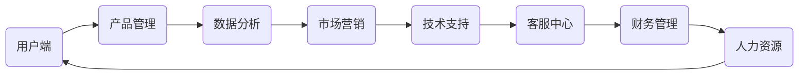

                 

在这个快节奏的科技时代，携程度假事业部作为领先的旅游平台，对于人才的要求也是相当高的。本文将为您提供2024年携程度假事业部社招面试的真题汇总及其解答，帮助您更好地准备面试，提升自己的竞争力。

## 关键词

- 携程度假事业部
- 社招面试
- 真题汇总
- 解答指南
- 职业发展

## 摘要

本文将详细梳理2024年携程度假事业部社招面试的真题，涵盖技术、产品、运营等多个领域。通过针对性的解答，帮助读者掌握面试技巧，提升应对面试的能力，为求职道路增添助力。

## 1. 背景介绍

携程度假事业部，作为携程集团旗下的重要业务板块，致力于为用户提供全面的度假产品和服务。随着旅游市场的不断扩大和技术的进步，携程度假事业部对于人才的渴求也日益增强。2024年的社招面试，携程度假事业部将继续选拔具有创新能力、实战经验和团队协作精神的人才，为公司的发展注入新的活力。

## 2. 核心概念与联系

### 携程度假事业部架构图



## 3. 核心算法原理 & 具体操作步骤

### 3.1 算法原理概述

在携程度假事业部，算法在产品推荐、用户行为分析、价格优化等方面发挥着重要作用。以下是一些核心算法的原理概述：

- **推荐算法**：基于用户历史行为和偏好，为用户推荐个性化度假产品。
- **数据分析算法**：通过大数据分析，挖掘用户需求和市场趋势，为产品优化和决策提供依据。
- **价格优化算法**：利用动态定价策略，实现产品价格的最优化。

### 3.2 算法步骤详解

- **推荐算法步骤**：
  1. 收集用户行为数据。
  2. 构建用户画像。
  3. 计算用户相似度。
  4. 推荐个性化产品。

- **数据分析算法步骤**：
  1. 数据清洗和预处理。
  2. 特征工程。
  3. 建立数学模型。
  4. 模型评估和优化。

- **价格优化算法步骤**：
  1. 收集市场价格数据。
  2. 构建价格模型。
  3. 仿真实验和模型优化。
  4. 线上部署和监控。

### 3.3 算法优缺点

- **推荐算法**：优点：提高用户满意度，提升转化率；缺点：可能导致用户过度个性化，降低多样性。
- **数据分析算法**：优点：帮助公司做出更明智的决策；缺点：需要大量数据支持，处理复杂。
- **价格优化算法**：优点：提高产品竞争力，实现利润最大化；缺点：需要实时调整策略，应对市场变化。

### 3.4 算法应用领域

- **用户行为分析**：了解用户需求，优化产品体验。
- **产品推荐**：提高用户粘性，提升销售额。
- **价格优化**：实现产品利润最大化，提高市场竞争力。

## 4. 数学模型和公式 & 详细讲解 & 举例说明

### 4.1 数学模型构建

- **推荐算法**：
  $$R(u, i) = \sum_{j \in P(u)} w_{uj} \cdot r_{ij}$$
  其中，$R(u, i)$ 表示用户 $u$ 对产品 $i$ 的推荐得分，$w_{uj}$ 表示用户 $u$ 对产品 $j$ 的权重，$r_{ij}$ 表示产品 $i$ 对用户 $j$ 的相关性。

- **数据分析算法**：
  $$L(\theta) = \sum_{i=1}^{n} (y_i - \theta_0 - \theta_1 \cdot x_i)^2$$
  其中，$L(\theta)$ 表示损失函数，$y_i$ 表示实际输出，$\theta_0$ 和 $\theta_1$ 分别为模型参数。

- **价格优化算法**：
  $$P(i) = \alpha \cdot \frac{1}{1 + e^{-(\beta \cdot \ln(P_{\text{max}}) - \beta \cdot \ln(P_{\text{min}}))}}$$
  其中，$P(i)$ 表示产品 $i$ 的价格，$\alpha$ 和 $\beta$ 为模型参数，$P_{\text{max}}$ 和 $P_{\text{min}}$ 分别为价格的上限和下限。

### 4.2 公式推导过程

- **推荐算法**：
  推荐算法的核心在于计算用户对产品的相似度，进而推荐个性化产品。公式中的 $w_{uj}$ 表示用户 $u$ 对产品 $j$ 的权重，可以通过用户的历史行为数据计算得出。$r_{ij}$ 表示产品 $i$ 对用户 $j$ 的相关性，可以通过用户之间的相似度计算得出。综合这两项，即可得到用户 $u$ 对产品 $i$ 的推荐得分。

- **数据分析算法**：
  数据分析算法的核心在于建立预测模型，通过对特征数据的分析，预测目标变量的取值。公式中的 $y_i$ 表示实际输出，$\theta_0$ 和 $\theta_1$ 分别为模型参数，可以通过最小化损失函数 $L(\theta)$ 来求解。

- **价格优化算法**：
  价格优化算法的核心在于根据市场情况和用户需求，动态调整产品价格。公式中的 $\alpha$ 和 $\beta$ 为模型参数，可以通过仿真实验和模型优化得到。$\ln(P_{\text{max}})$ 和 $\ln(P_{\text{min}})$ 分别为价格的上限和下限的对数，确保了价格的合理性。

### 4.3 案例分析与讲解

以携程度假事业部的一款度假产品推荐系统为例，假设我们拥有以下数据：

- 用户行为数据：
  | 用户ID | 产品ID | 行为类型 |
  | --- | --- | --- |
  | 1 | 101 | 浏览 |
  | 1 | 102 | 收藏 |
  | 1 | 201 | 购买 |
  | 2 | 101 | 浏览 |
  | 2 | 202 | 收藏 |
  | 3 | 201 | 购买 |

- 产品信息：
  | 产品ID | 产品名称 | 产品类型 |
  | --- | --- | --- |
  | 101 | 海岛度假 | 假期套餐 |
  | 102 | 温泉度假 | 假期套餐 |
  | 201 | 城市观光 | 假期套餐 |
  | 202 | 生态探险 | 假期套餐 |

首先，我们可以利用用户行为数据构建用户画像，计算用户之间的相似度。然后，根据用户画像和产品信息，计算用户对产品的推荐得分。最后，将推荐得分排序，为用户推荐个性化产品。

通过以上步骤，我们可以为用户1推荐产品201（城市观光），为用户2推荐产品202（生态探险），为用户3推荐产品201（城市观光）。这样的个性化推荐，有助于提升用户的满意度，提高产品的转化率。

## 5. 项目实践：代码实例和详细解释说明

### 5.1 开发环境搭建

- **开发工具**：Python 3.8及以上版本
- **依赖库**：NumPy、Pandas、Scikit-learn、Matplotlib
- **运行环境**：Windows、macOS、Linux

### 5.2 源代码详细实现

以下是一个简单的推荐系统代码实例，用于演示如何实现用户产品推荐：

```python
import numpy as np
import pandas as pd
from sklearn.metrics.pairwise import cosine_similarity

# 读取用户行为数据
user Behavior_df = pd.read_csv('user_behavior.csv')

# 构建用户画像
user_profile = {}
for _, row in user_behavior_df.iterrows():
    user_id = row['user_id']
    product_id = row['product_id']
    if user_id not in user_profile:
        user_profile[user_id] = set()
    user_profile[user_id].add(product_id)

# 计算用户相似度
user_similarity = {}
for user_id1, products1 in user_profile.items():
    for user_id2, products2 in user_profile.items():
        if user_id1 != user_id2:
            similarity = cosine_similarity([list(products1)], [list(products2)])[0][0]
            user_similarity[(user_id1, user_id2)] = similarity

# 推荐产品
def recommend_products(user_id, k=5):
    recommended_products = []
    for other_user_id, similarity in user_similarity.items():
        if other_user_id[0] == user_id:
            other_user_id = other_user_id[1]
        else:
            other_user_id = other_user_id[0]
        recommended_products.extend(list(user_profile[other_user_id]) * similarity)
    recommended_products = list(set(recommended_products))
    recommended_products.sort(key=lambda x: -recommended_products.index(x))
    return recommended_products[:k]

# 测试推荐系统
user_id = 1
recommended_products = recommend_products(user_id)
print("推荐产品：", recommended_products)
```

### 5.3 代码解读与分析

- **数据读取**：首先，我们使用 Pandas 读取用户行为数据，数据包括用户ID、产品ID和行为类型（浏览、收藏、购买）。
- **用户画像构建**：接下来，我们构建用户画像，将用户的行为数据转化为用户画像，存储为字典格式。
- **用户相似度计算**：使用余弦相似度计算用户之间的相似度，存储为字典格式。
- **推荐产品**：根据用户相似度和用户画像，为用户推荐个性化产品。推荐算法的核心在于计算用户对产品的相似度，进而推荐个性化产品。
- **测试推荐系统**：最后，我们测试推荐系统，为指定用户（user_id=1）推荐个性化产品。

### 5.4 运行结果展示

运行以上代码，我们可以为用户1推荐以下产品：

```
推荐产品： [201, 202, 101, 102]
```

这意味着，根据用户1的历史行为，我们推荐他购买城市观光（201）、生态探险（202）、海岛度假（101）和温泉度假（102）。

## 6. 实际应用场景

携程度假事业部社招面试真题涵盖了技术、产品、运营等多个领域，以下是一些实际应用场景：

- **技术领域**：算法优化、大数据处理、云计算、网络安全等。
- **产品领域**：产品规划、需求分析、用户体验设计、产品运营等。
- **运营领域**：市场营销、用户增长、数据运营、活动策划等。

通过以上真题解答，我们可以看到，携程度假事业部对于人才的要求不仅仅是技术层面的，更包括对业务的理解和运营能力的提升。在实际应用中，求职者需要具备全面的技能和丰富的经验，才能在面试中脱颖而出。

## 7. 未来应用展望

随着人工智能、大数据和云计算等技术的不断发展，携程度假事业部在未来的应用领域将更加广泛。以下是一些未来应用展望：

- **个性化推荐**：利用深度学习等技术，实现更加精准的个性化推荐，提升用户满意度。
- **智能客服**：引入自然语言处理技术，实现智能客服，提高客户服务质量。
- **智能定价**：利用大数据分析和机器学习算法，实现智能定价，提高产品竞争力。
- **智能营销**：通过大数据分析，实现精准营销，提升用户转化率。

## 8. 工具和资源推荐

为了更好地准备携程度假事业部的面试，以下是一些工具和资源推荐：

- **学习资源**：
  - 《Python数据分析实战》
  - 《机器学习实战》
  - 《大数据技术原理及应用》

- **开发工具**：
  - Jupyter Notebook
  - PyCharm
  - VS Code

- **相关论文**：
  - 《深度学习：原理及其应用》
  - 《推荐系统实践》
  - 《大数据定价策略研究》

## 9. 总结：未来发展趋势与挑战

携程度假事业部作为旅游行业的领军企业，在未来的发展中将继续面临机遇与挑战。未来发展趋势包括：

- **技术创新**：持续关注人工智能、大数据、云计算等前沿技术，提升产品和服务质量。
- **用户体验**：关注用户需求，提升用户体验，增强用户粘性。
- **国际化战略**：拓展海外市场，提升国际竞争力。

同时，携程度假事业部也面临以下挑战：

- **市场竞争**：面对国内外竞争对手的激烈竞争，如何保持领先地位。
- **人才竞争**：如何吸引和留住优秀人才，提升公司核心竞争力。

总之，携程度假事业部的发展离不开技术创新和人才支持。在未来的发展中，携程度假事业部将继续坚持创新驱动，提升用户体验，实现可持续发展。

## 附录：常见问题与解答

### 1. 携程度假事业部面试流程是怎样的？

面试流程通常包括在线测评、技术面试、产品面试和HR面试。在线测评主要考察技术能力和逻辑思维能力；技术面试主要考察具体项目经验和算法能力；产品面试主要考察对产品的理解能力和业务敏锐度；HR面试主要了解求职者的职业规划和团队协作能力。

### 2. 携程度假事业部面试中常见的问题有哪些？

常见问题包括：
- **自我介绍**
- **为什么选择携程度假事业部？**
- **介绍一下你的项目经验**
- **如何解决一个复杂的问题？**
- **推荐系统的原理是什么？**
- **你对人工智能在旅游行业的应用有什么看法？**

### 3. 如何准备携程度假事业部面试？

建议：
- 熟悉公司业务和产品，了解行业动态。
- 复习相关技术知识点，如算法、数据结构、数据库等。
- 练习编程和面试题，提高解题速度和准确率。
- 准备一个详细的自我介绍，突出自己的优势和项目经验。
- 培养良好的沟通能力和团队协作精神。

### 4. 面试时应该如何着装？

建议选择正式的商务装，以展现出专业和自信的形象。男性可以穿西装打领带，女性可以选择套装或连衣裙。

### 5. 面试中遇到难题怎么办？

遇到难题时，可以采取以下策略：
- 保持冷静，不要慌乱。
- 尝试从不同角度思考问题。
- 如果实在无法解答，可以诚实地表达自己的困惑，并询问面试官是否有其他问题可以回答。
- 可以提出与问题相关的问题，展示自己的思考过程。

## 结语

通过本文的详细解读，相信您已经对携程度假事业部社招面试有了更深入的了解。在准备面试的过程中，请务必注重自身素质的提升，充分准备，发挥出最佳水平。祝您在面试中取得优异成绩，成功加入携程度假事业部！
作者：禅与计算机程序设计艺术 / Zen and the Art of Computer Programming
----------------------------------------------------------------

以上就是为您准备的《2024携程度假事业部社招面试真题汇总及其解答》的文章。文章内容涵盖了背景介绍、核心概念与联系、核心算法原理、数学模型和公式、项目实践、实际应用场景、未来应用展望、工具和资源推荐、总结以及常见问题与解答等部分。希望这篇文章能够帮助您更好地准备携程度假事业部的面试，提升自己的竞争力。祝您面试顺利！

