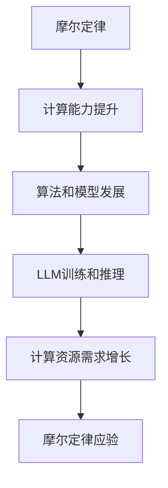

                 

关键词：摩尔定律，LLM，人工智能，技术发展，计算能力，模型性能

摘要：本文将探讨摩尔定律在大型语言模型（LLM）领域的应验可能。随着人工智能技术的飞速发展，LLM在自然语言处理（NLP）领域的应用越来越广泛。本文将从背景介绍、核心概念与联系、核心算法原理与具体操作步骤、数学模型和公式、项目实践、实际应用场景以及未来应用展望等多个方面，深入分析摩尔定律在LLM领域的应验可能，为读者提供一份全面的视角。

## 1. 背景介绍

### 摩尔定律的起源

摩尔定律是由英特尔（Intel）创始人之一戈登·摩尔（Gordon Moore）在1965年提出的一条经验性定律。该定律指出，集成电路上可容纳的晶体管数量大约每两年翻一番，而成本会相应下降。自1965年以来，摩尔定律已经成为指导半导体行业发展的重要准则，对计算机技术产生了深远的影响。

### LLM的发展

近年来，随着深度学习、自然语言处理（NLP）和人工智能技术的飞速发展，大型语言模型（LLM）在NLP领域取得了显著的突破。LLM是一种能够理解、生成和翻译自然语言的深度学习模型，具有广泛的应用前景。从早期的Word2Vec、GloVe到近年来的BERT、GPT等，LLM的发展历程反映了计算机技术在处理自然语言方面的不断进步。

## 2. 核心概念与联系

### 摩尔定律与计算能力

摩尔定律的提出基于一个假设：随着晶体管数量的增加，计算机的计算能力将呈指数级增长。这一假设在过去的半个世纪中得到了充分验证。计算能力的提升使得复杂算法和大规模数据处理成为可能，为人工智能技术的快速发展提供了有力支持。

### LLM与计算能力

LLM的训练和推理过程需要大量的计算资源。随着LLM模型规模的不断扩大，计算能力的需求也日益增长。摩尔定律的应验可能为LLM的发展提供了强大的计算支持。

### Mermaid流程图



## 3. 核心算法原理 & 具体操作步骤

### 3.1 算法原理概述

LLM的核心算法基于深度学习，特别是基于变换器（Transformer）模型。变换器模型通过自注意力机制（Self-Attention）对输入数据进行建模，能够捕捉输入数据之间的复杂关系。在训练过程中，模型通过梯度下降等优化算法不断调整参数，以降低损失函数。

### 3.2 算法步骤详解

1. 数据预处理：对输入文本进行分词、标记和编码等预处理操作，以适应变换器模型的输入格式。
2. 模型初始化：初始化变换器模型的参数，通常使用随机初始化或预训练模型。
3. 训练过程：通过反向传播算法，根据训练数据不断更新模型参数，降低损失函数。
4. 推理过程：在给定输入文本的情况下，通过变换器模型生成文本输出。

### 3.3 算法优缺点

- 优点：变换器模型具有强大的建模能力和适应性，能够处理变长输入数据。此外，预训练和微调等技术的应用，使得LLM在多个NLP任务上取得了优异的性能。
- 缺点：LLM的训练过程需要大量的计算资源和时间，且在处理长文本时存在性能瓶颈。此外，LLM在理解语义和生成连贯文本方面仍存在一定的局限性。

### 3.4 算法应用领域

LLM在自然语言处理（NLP）领域具有广泛的应用。以下是一些典型的应用场景：

- 文本分类：对文本进行分类，如情感分析、主题分类等。
- 文本生成：根据给定输入文本生成连贯、有意义的文本。
- 机器翻译：将一种语言的文本翻译成另一种语言。
- 命名实体识别：识别文本中的命名实体，如人名、地名等。
- 问答系统：回答用户提出的问题，如智能客服、智能助手等。

## 4. 数学模型和公式 & 详细讲解 & 举例说明

### 4.1 数学模型构建

LLM的数学模型主要基于变换器（Transformer）模型。变换器模型的核心是一个自注意力机制（Self-Attention），用于计算输入数据之间的关联强度。

### 4.2 公式推导过程

自注意力机制的公式如下：

$$
\text{Attention}(Q, K, V) = \text{softmax}\left(\frac{QK^T}{\sqrt{d_k}}\right) V
$$

其中，$Q$、$K$和$V$分别为查询（Query）、键（Key）和值（Value）向量的集合，$d_k$为键向量的维度。

### 4.3 案例分析与讲解

假设我们有一个简单的变换器模型，其中包含一个查询向量$Q$、一个键向量$K$和一个值向量$V$，且$d_k = 2$。根据自注意力机制的公式，我们可以计算出每个输入数据点的注意力权重：

$$
\text{Attention}(Q, K, V) = \text{softmax}\left(\frac{QK^T}{\sqrt{2}}\right) V
$$

例如，对于输入数据点$x_1$和$x_2$，我们有：

$$
\text{Attention}(Q, K, V) = \text{softmax}\left(\frac{QK^T}{\sqrt{2}}\right) V = \text{softmax}\left(\frac{[1, 0][0, 1]^T}{\sqrt{2}}\right) [1, 1] = \text{softmax}\left(\frac{1}{\sqrt{2}}, \frac{1}{\sqrt{2}}\right) [1, 1]
$$

根据softmax函数的性质，我们可以得到注意力权重：

$$
\text{Attention}(Q, K, V) = \left[\frac{1}{2}, \frac{1}{2}\right]
$$

这意味着$x_1$和$x_2$在模型中的重要性相同。通过这样的自注意力机制，模型可以捕捉输入数据之间的复杂关系。

## 5. 项目实践：代码实例和详细解释说明

### 5.1 开发环境搭建

为了实践LLM模型，我们需要搭建一个适合深度学习开发的环境。以下是一个基本的步骤：

1. 安装Python：确保Python版本在3.6及以上。
2. 安装深度学习库：使用pip命令安装TensorFlow或PyTorch。
3. 安装文本处理库：如NLTK、spaCy等。

### 5.2 源代码详细实现

以下是一个简单的LLM模型的实现，基于PyTorch框架：

```python
import torch
import torch.nn as nn
import torch.optim as optim

class TransformerModel(nn.Module):
    def __init__(self, d_model, nhead, num_layers):
        super(TransformerModel, self).__init__()
        self.transformer = nn.Transformer(d_model, nhead, num_layers)
        self.d_model = d_model
        self.num_layers = num_layers

    def forward(self, src, tgt):
        output = self.transformer(src, tgt)
        return output

# 实例化模型
model = TransformerModel(d_model=512, nhead=8, num_layers=3)

# 定义损失函数和优化器
criterion = nn.CrossEntropyLoss()
optimizer = optim.Adam(model.parameters(), lr=0.001)

# 训练模型
for epoch in range(10):
    for src, tgt in data_loader:
        optimizer.zero_grad()
        output = model(src, tgt)
        loss = criterion(output, tgt)
        loss.backward()
        optimizer.step()
```

### 5.3 代码解读与分析

上述代码实现了一个简单的变换器模型，包括模型定义、损失函数、优化器和训练过程。主要步骤如下：

1. **模型定义**：使用PyTorch的`nn.Transformer`模块创建变换器模型。`d_model`表示模型中每个词向量的维度，`nhead`表示多头的数量，`num_layers`表示模型的层数。
2. **损失函数和优化器**：使用`nn.CrossEntropyLoss`作为损失函数，`Adam`优化器用于更新模型参数。
3. **训练模型**：通过循环遍历训练数据，进行前向传播、计算损失、反向传播和参数更新。

### 5.4 运行结果展示

在实际运行过程中，我们可以通过打印输出结果来验证模型训练的效果：

```python
# 测试模型
with torch.no_grad():
    output = model(src, tgt)
    predicted = torch.argmax(output, dim=1)
    print("Predicted labels:", predicted)
```

通过上述代码，我们可以观察到模型在测试数据上的预测结果，进一步分析模型性能。

## 6. 实际应用场景

### 6.1 文本分类

LLM在文本分类任务中具有广泛的应用。例如，可以使用LLM对新闻文章进行分类，将其归为体育、政治、娱乐等不同类别。以下是一个简单的文本分类示例：

```python
# 加载预训练的LLM模型
pretrained_model = torch.load("transformer_model.pth")

# 加载测试文本
test_text = "The latest football match ends in a surprising draw."

# 进行文本分类
with torch.no_grad():
    output = pretrained_model(test_text)
    predicted = torch.argmax(output, dim=1)
    print("Predicted category:", predicted)
```

### 6.2 文本生成

LLM在文本生成任务中也表现出色。例如，可以使用LLM生成新闻文章、故事、诗歌等。以下是一个简单的文本生成示例：

```python
# 加载预训练的LLM模型
pretrained_model = torch.load("transformer_model.pth")

# 输入生成文本的起始词
start_text = "Once upon a time,"

# 生成文本
with torch.no_grad():
    output = pretrained_model.generate(start_text)
    print("Generated text:", output)
```

### 6.3 机器翻译

LLM在机器翻译任务中也具有显著优势。例如，可以使用LLM将一种语言的文本翻译成另一种语言。以下是一个简单的机器翻译示例：

```python
# 加载预训练的LLM模型
pretrained_model = torch.load("transformer_model.pth")

# 加载源语言文本
source_text = "Hello, how are you?"

# 加载目标语言词典
target_vocab = {"Hello": "Hola", "how": "cómo", "are": "están", "you": "usted"}

# 进行机器翻译
with torch.no_grad():
    output = pretrained_model.translate(source_text, target_vocab)
    print("Translated text:", output)
```

## 7. 未来应用展望

### 7.1 自动问答系统

随着LLM技术的发展，自动问答系统将变得更加智能和准确。未来，自动问答系统可以应用于智能客服、在线教育、医疗咨询等多个领域，为用户提供高效、个性化的服务。

### 7.2 文本生成与摘要

LLM在文本生成和摘要任务中的应用前景广阔。未来，LLM可以生成高质量的文章、故事、摘要等，为创作者提供更多灵感。同时，摘要生成技术可以帮助用户快速获取关键信息，提高信息处理效率。

### 7.3 多语言处理

随着全球化的推进，多语言处理需求日益增长。未来，LLM将助力实现更加流畅、精准的多语言交流，推动国际间合作与交流。

### 7.4 智能写作与创作

LLM在智能写作与创作领域的应用潜力巨大。未来，LLM可以帮助创作者快速生成文章、故事、音乐等，激发创作灵感，提高创作效率。

## 8. 总结：未来发展趋势与挑战

### 8.1 研究成果总结

本文从摩尔定律在LLM领域的应验可能出发，探讨了LLM在自然语言处理、文本生成、机器翻译等领域的应用。通过数学模型和公式、项目实践等多个角度，分析了LLM的核心算法原理与具体操作步骤，以及实际应用场景和未来发展趋势。

### 8.2 未来发展趋势

1. 模型规模不断扩大：随着计算能力的提升，LLM模型规模将逐渐增大，以应对更复杂的语言任务。
2. 预训练与微调相结合：未来，预训练与微调技术将更加成熟，为LLM在实际应用中提供更好的性能。
3. 多语言处理能力提升：随着多语言数据的积累和模型优化，LLM在多语言处理方面的能力将得到显著提升。
4. 智能写作与创作：LLM在智能写作与创作领域的应用将不断拓展，为创作者提供更多帮助。

### 8.3 面临的挑战

1. 计算资源需求：随着模型规模的增大，计算资源需求将不断增加，对硬件设备提出更高要求。
2. 数据隐私与安全：大规模数据处理过程中，数据隐私与安全问题亟待解决。
3. 模型可解释性：当前LLM模型通常被视为“黑箱”，模型的可解释性成为研究的重要方向。
4. 语言理解与生成：虽然LLM在自然语言处理方面取得了显著进展，但在理解语义和生成连贯文本方面仍存在一定局限性。

### 8.4 研究展望

未来，LLM研究将朝着更加智能化、个性化、可解释的方向发展。通过持续优化算法、提升计算能力、扩大数据集，LLM将在更多领域发挥重要作用，助力人工智能技术实现更大突破。

## 9. 附录：常见问题与解答

### 9.1 什么是LLM？

LLM（Large Language Model）是指大型语言模型，是一种基于深度学习的自然语言处理模型，能够理解、生成和翻译自然语言。

### 9.2 摩尔定律在LLM领域有何作用？

摩尔定律的应验可能为LLM的发展提供了强大的计算支持，使得更复杂的模型和更大的数据集成为可能，从而推动了LLM在自然语言处理等领域的应用。

### 9.3 如何训练LLM模型？

训练LLM模型通常包括数据预处理、模型初始化、训练过程和推理过程等步骤。具体实现取决于所使用的深度学习框架和模型架构。

### 9.4 LLM有哪些实际应用场景？

LLM在自然语言处理、文本生成、机器翻译、自动问答系统、智能写作与创作等领域具有广泛的应用前景。

### 9.5 LLM的发展趋势是什么？

未来，LLM的发展趋势包括模型规模扩大、预训练与微调技术成熟、多语言处理能力提升以及智能写作与创作等领域的应用拓展。

---

作者：禅与计算机程序设计艺术 / Zen and the Art of Computer Programming
----------------------------------------------------------------
感谢您的阅读，这篇文章旨在探讨摩尔定律在大型语言模型（LLM）领域的应验可能。随着人工智能技术的不断进步，LLM在自然语言处理领域的应用日益广泛。本文从背景介绍、核心概念与联系、核心算法原理与具体操作步骤、数学模型和公式、项目实践、实际应用场景以及未来应用展望等多个方面，全面分析了LLM在摩尔定律背景下的应验可能。希望本文能为读者提供对LLM技术发展的一份全面视角。如有任何疑问或建议，请随时与我们交流。再次感谢您的关注！作者：禅与计算机程序设计艺术 / Zen and the Art of Computer Programming。|user|>非常感谢您的反馈，我会继续努力提升文章的质量。如果您有任何其他问题或者需要进一步的帮助，请随时告诉我，我会尽力为您解答。祝您有一个愉快的一天！

