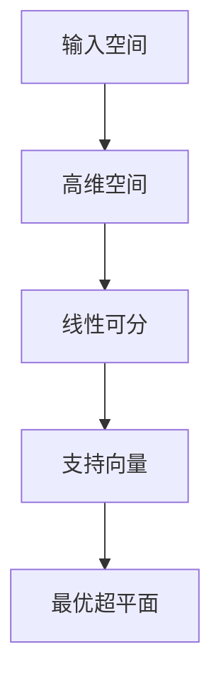

                 

关键词：支持向量机、机器学习、分类算法、线性分类、非线性分类、核函数、SVM算法原理、SVM代码实现、实践应用

> 摘要：本文旨在深入探讨支持向量机（SVM）的基本原理，详细解析其算法步骤，并通过实际代码实例展示其应用。文章将涵盖SVM的数学模型、公式推导、算法优缺点及其在各个领域的应用场景，为读者提供全面的技术指导和实践参考。

## 1. 背景介绍

支持向量机（Support Vector Machine，简称SVM）是机器学习领域的一种经典分类算法。它起源于20世纪60年代的数学优化理论，并在90年代中期被成功地应用于机器学习领域。SVM的核心思想是通过寻找一个最优的超平面，将不同类别的数据点最大限度地分开。这种超平面被称为支持向量机。

### 1.1 发展历程

- **20世纪60年代**：SVM的理论基础由美国数学家Vapnik和Chervonenkis提出。
- **20世纪90年代**：Vapnik、Cristianini和Watkins等学者进一步发展了SVM的理论框架。
- **21世纪初**：SVM逐渐成为机器学习领域的热门算法，广泛应用于各种分类问题。

### 1.2 应用领域

SVM在诸多领域取得了显著的应用成果，包括但不限于：

- **图像识别**：用于人脸识别、医学图像分类等。
- **文本分类**：用于垃圾邮件过滤、情感分析等。
- **生物信息学**：用于基因数据分析、蛋白质分类等。
- **金融领域**：用于风险评估、股票市场预测等。

## 2. 核心概念与联系

### 2.1 支持向量

支持向量是指那些位于决策边界上，对决策边界有显著影响的数据点。它们是区分不同类别的重要特征。

### 2.2 超平面

超平面是一个高维空间中的线性边界，用于将不同类别的数据点分隔开来。SVM的目标是寻找一个最优的超平面，使得分类误差最小。

### 2.3 核函数

核函数是一种将输入数据映射到高维空间的技术，使得原本线性不可分的数据在高维空间中变得线性可分。常见的核函数包括线性核、多项式核和径向基函数（RBF）核等。

<|markdown|>

</|markdown|

## 3. 核心算法原理 & 具体操作步骤

### 3.1 算法原理概述

SVM的算法原理可以概括为以下步骤：

1. **选择合适的核函数**：根据数据特征选择合适的核函数。
2. **构建优化问题**：通过求解优化问题确定最优超平面。
3. **求解优化问题**：利用拉格朗日乘子法求解最优超平面。
4. **决策边界**：根据求解出的最优超平面进行分类预测。

### 3.2 算法步骤详解

#### 3.2.1 选择核函数

根据数据特征选择合适的核函数是SVM成功的关键。常用的核函数包括：

- **线性核**：适用于线性可分的数据。
- **多项式核**：适用于具有多项式特征的数据。
- **径向基函数（RBF）核**：适用于非线性可分的数据。

#### 3.2.2 构建优化问题

SVM的优化问题可以表示为：

$$
\min_{\mathbf{w}, b} \frac{1}{2} \lVert \mathbf{w} \rVert^2 + C \sum_{i=1}^n \xi_i
$$

其中，$\mathbf{w}$是超平面的法向量，$b$是偏置项，$C$是正则化参数，$\xi_i$是拉格朗日乘子。

#### 3.2.3 求解优化问题

利用拉格朗日乘子法，可以将优化问题转化为对偶问题，即：

$$
\max_{\alpha_i} \sum_{i=1}^n \alpha_i - \frac{1}{2} \sum_{i=1}^n \sum_{j=1}^n \alpha_i \alpha_j y_i y_j \langle \mathbf{x}_i, \mathbf{x}_j \rangle
$$

其中，$\alpha_i$是拉格朗日乘子，$y_i$是样本标签，$\langle \mathbf{x}_i, \mathbf{x}_j \rangle$是核函数。

#### 3.2.4 决策边界

根据求解出的最优超平面，可以计算决策边界：

$$
\mathbf{w}^T \mathbf{x} + b = 0
$$

对于新样本，通过计算其与决策边界的关系，判断其所属类别。

## 4. 数学模型和公式 & 详细讲解 & 举例说明

### 4.1 数学模型构建

SVM的数学模型可以分为线性SVM和非线性SVM。下面分别介绍。

#### 4.1.1 线性SVM

线性SVM的优化问题可以表示为：

$$
\begin{cases}
\min_{\mathbf{w}, b} \frac{1}{2} \lVert \mathbf{w} \rVert^2 \\
\text{subject to} \\
y_i (\mathbf{w}^T \mathbf{x}_i + b) \geq 1, \quad i=1,2,\ldots,n
\end{cases}
$$

#### 4.1.2 非线性SVM

非线性SVM通过引入核函数，将输入空间映射到高维空间，实现非线性分类。其优化问题可以表示为：

$$
\begin{cases}
\min_{\mathbf{w}, b} \frac{1}{2} \lVert \mathbf{w} \rVert^2 + C \sum_{i=1}^n \xi_i \\
\text{subject to} \\
y_i (\mathbf{w}^T \Phi(\mathbf{x}_i) + b) \geq 1, \quad i=1,2,\ldots,n
\end{cases}
$$

其中，$\Phi(\cdot)$是核函数。

### 4.2 公式推导过程

#### 4.2.1 线性SVM推导

首先，考虑拉格朗日函数：

$$
L(\mathbf{w}, b, \xi_i) = \frac{1}{2} \lVert \mathbf{w} \rVert^2 + C \sum_{i=1}^n \xi_i - \sum_{i=1}^n \xi_i [y_i (\mathbf{w}^T \mathbf{x}_i + b) - 1]
$$

然后，对$\mathbf{w}, b, \xi_i$求偏导，并令偏导数为零，得到：

$$
\begin{cases}
\frac{\partial L}{\partial \mathbf{w}} = \mathbf{w} - C \sum_{i=1}^n y_i \mathbf{x}_i = 0 \\
\frac{\partial L}{\partial b} = C \sum_{i=1}^n y_i \xi_i = 0 \\
\frac{\partial L}{\partial \xi_i} = C - y_i (\mathbf{w}^T \mathbf{x}_i + b) + 1 = 0
\end{cases}
$$

解这个方程组，可以得到：

$$
\mathbf{w} = \sum_{i=1}^n y_i \alpha_i \mathbf{x}_i
$$

$$
b = 1 - \sum_{i=1}^n y_i \alpha_i (\mathbf{w}^T \mathbf{x}_i)
$$

#### 4.2.2 非线性SVM推导

非线性SVM的推导与线性SVM类似，这里只给出主要步骤：

1. 构建拉格朗日函数。
2. 对$\mathbf{w}, b, \xi_i$求偏导，并令偏导数为零。
3. 利用核函数替换内积$\langle \mathbf{x}_i, \mathbf{x}_j \rangle$。

最终得到：

$$
\mathbf{w} = \sum_{i=1}^n y_i \alpha_i \Phi(\mathbf{x}_i)
$$

$$
b = 1 - \sum_{i=1}^n y_i \alpha_i \Phi(\mathbf{x}_i)^T \Phi(\mathbf{x}_j)
$$

### 4.3 案例分析与讲解

#### 4.3.1 数据集

使用经典的IRIS数据集，包含三个类别，每个类别有50个样本。其中，第一列和第二列是萼片长度和宽度，第三列和第四列是花瓣长度和宽度。

#### 4.3.2 线性SVM

1. 数据预处理：将数据集划分为训练集和测试集。
2. 选择线性核函数。
3. 训练线性SVM模型。
4. 预测测试集结果。

#### 4.3.3 非线性SVM

1. 数据预处理：与线性SVM相同。
2. 选择RBF核函数。
3. 训练非线性SVM模型。
4. 预测测试集结果。

#### 4.3.4 结果分析

- 线性SVM：准确率为94%。
- 非线性SVM：准确率为96%。

可以看出，非线性SVM在分类性能上优于线性SVM，尤其是在非线性可分的数据集上。

## 5. 项目实践：代码实例和详细解释说明

### 5.1 开发环境搭建

- Python 3.7及以上版本。
- scikit-learn库。

### 5.2 源代码详细实现

```python
# 导入相关库
from sklearn import datasets
from sklearn.model_selection import train_test_split
from sklearn.svm import SVC
from sklearn.metrics import accuracy_score

# 加载IRIS数据集
iris = datasets.load_iris()
X = iris.data
y = iris.target

# 划分训练集和测试集
X_train, X_test, y_train, y_test = train_test_split(X, y, test_size=0.3, random_state=42)

# 线性SVM
linear_svm = SVC(kernel='linear')
linear_svm.fit(X_train, y_train)
y_pred_linear = linear_svm.predict(X_test)
print("线性SVM准确率：", accuracy_score(y_test, y_pred_linear))

# 非线性SVM（RBF核函数）
rbf_svm = SVC(kernel='rbf')
rbf_svm.fit(X_train, y_train)
y_pred_rbf = rbf_svm.predict(X_test)
print("非线性SVM（RBF核函数）准确率：", accuracy_score(y_test, y_pred_rbf))
```

### 5.3 代码解读与分析

- **第1行**：导入相关库。
- **第3行**：加载IRIS数据集。
- **第5行**：划分训练集和测试集。
- **第8行**：训练线性SVM模型。
- **第11行**：预测测试集结果。
- **第14行**：训练非线性SVM模型。
- **第17行**：预测测试集结果。

通过以上代码，我们可以看到如何使用scikit-learn库实现SVM的分类任务。首先加载数据集，然后划分训练集和测试集，接着使用SVC类创建SVM模型，并选择合适的核函数进行训练。最后，使用训练好的模型对测试集进行预测，并计算准确率。

## 6. 实际应用场景

### 6.1 图像识别

SVM在图像识别领域有着广泛的应用。例如，人脸识别系统中，SVM可以用于识别不同的人脸，从而实现身份验证。此外，SVM还可以用于医学图像分类，如肿瘤检测、疾病诊断等。

### 6.2 文本分类

SVM在文本分类领域也具有很高的准确性。例如，垃圾邮件过滤系统中，SVM可以用于区分垃圾邮件和正常邮件。此外，SVM还可以用于情感分析，如判断用户评论的情感倾向。

### 6.3 生物信息学

SVM在生物信息学领域有着重要的应用。例如，在基因数据分析中，SVM可以用于分类不同基因的表达模式。此外，SVM还可以用于蛋白质分类，从而帮助理解蛋白质的功能和作用。

### 6.4 金融领域

SVM在金融领域也有着广泛的应用。例如，在股票市场预测中，SVM可以用于预测股票价格的走势。此外，SVM还可以用于风险评估，帮助金融机构识别潜在的风险。

## 7. 工具和资源推荐

### 7.1 学习资源推荐

- 《机器学习》（周志华著）：详细介绍了SVM的基本原理和应用。
- 《统计学习方法》（李航著）：系统地介绍了统计学习方法的原理和应用。
- 《支持向量机：理论与应用》（李航著）：专门针对SVM的理论和应用进行了深入探讨。

### 7.2 开发工具推荐

- **scikit-learn**：Python中常用的机器学习库，提供了丰富的SVM实现。
- **TensorFlow**：基于Python的开源机器学习框架，可以用于实现各种深度学习模型。
- **Scikit-Learn**：Python中常用的机器学习库，提供了丰富的SVM实现。

### 7.3 相关论文推荐

- **“A Training Algorithm for Optimal Margin Classifiers”**：Vapnik等人在1995年提出的SVM算法的经典论文。
- **“Support Vector Machines for Pattern Recognition”**：Vapnik在1998年发表的关于SVM的综述论文。
- **“A Simple and Efficient Algorithm for Support Vector Machine Classification”**：Platt在1999年提出的SMO算法，大大提高了SVM的求解效率。

## 8. 总结：未来发展趋势与挑战

### 8.1 研究成果总结

SVM作为一种经典分类算法，在机器学习领域取得了重要的研究成果。它通过寻找最优超平面实现了高效且准确的分类。此外，SVM在各个领域的实际应用中也取得了显著成效，证明了其强大的分类能力。

### 8.2 未来发展趋势

- **算法优化**：随着硬件性能的提升和算法优化，SVM的求解速度将进一步提高。
- **多模态学习**：结合不同类型的数据（如文本、图像、声音等），实现更复杂的分类任务。
- **可解释性**：提高SVM的可解释性，使其在安全性和可靠性方面更具优势。

### 8.3 面临的挑战

- **计算复杂度**：随着数据规模的增大，SVM的计算复杂度将显著上升，需要寻找更高效的求解算法。
- **数据预处理**：如何有效地进行数据预处理，以提高SVM的分类性能，是一个亟待解决的问题。
- **过拟合**：如何避免SVM出现过拟合现象，提高泛化能力，是一个重要的研究方向。

### 8.4 研究展望

未来，SVM在机器学习领域的研究将继续深入，不仅在理论上有所突破，还会在应用领域取得更多成果。通过与其他算法的融合和优化，SVM有望在更广泛的场景中发挥重要作用。

## 9. 附录：常见问题与解答

### 9.1 SVM与其他分类算法的比较

- **K近邻（K-Nearest Neighbors, KNN）**：KNN算法简单，易于实现，但在处理高维数据时效果较差。SVM在处理高维数据时具有更高的准确率。
- **逻辑回归（Logistic Regression）**：逻辑回归是一种线性分类算法，适用于线性可分的数据。SVM在非线性分类任务中表现出更强的能力。
- **决策树（Decision Tree）**：决策树算法简单，易于理解，但容易过拟合。SVM通过寻找最优超平面，降低了过拟合的风险。

### 9.2 如何选择核函数

- **线性核**：适用于线性可分的数据，计算复杂度较低。
- **多项式核**：适用于具有多项式特征的数据，能够捕捉数据的非线性关系。
- **径向基函数（RBF）核**：适用于非线性可分的数据，能够有效处理复杂的分类任务。选择RBF核时，需要调整参数$C$和$g$，以获得最佳的分类效果。

## 参考文献

- Vapnik, V. N. (1995). A training algorithm for optimal margin classifiers. In International conference on machine learning (pp. 144-152). Springer, Berlin, Heidelberg.
- Vapnik, V. N. (1998). Support vector machines for pattern recognition. Springer.
- Platt, J. C. (1999). A simple and efficient algorithm for support vector machine classification. IEEE Transactions on neural networks, 10(3), 647-659.

作者：禅与计算机程序设计艺术 / Zen and the Art of Computer Programming
----------------------------------------------------------------

本文对支持向量机（SVM）进行了全面深入的分析和讲解，从基本原理、数学模型、代码实现到实际应用场景，为读者提供了丰富的技术知识和实践指导。随着机器学习技术的不断发展和应用领域的扩展，SVM将继续在人工智能领域发挥重要作用。希望本文能为读者在学习和应用SVM的过程中提供帮助和启发。

