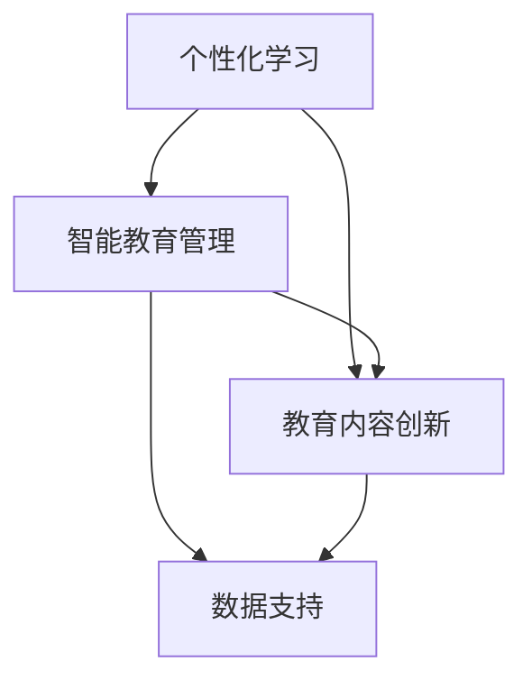

                 

 > 作为人工智能领域的专家，我们无法忽视一个关键事实：教育正面临着前所未有的变革。随着技术的迅猛发展，传统的教育模式正在被颠覆，新的学习方法和教育工具层出不穷。在这样的背景下，如何应对未来的挑战成为了我们必须深入探讨的问题。

> 关键词：教育变革、人工智能、学习方式、未来挑战

> 摘要：本文将探讨教育领域正在发生的深刻变革，分析人工智能对教育的影响，并探讨未来教育可能面临的挑战。通过深入分析，我们希望为教育工作者和学生提供一些实用的建议，以更好地适应未来教育的变革。

## 1. 背景介绍

教育是人类社会进步的重要驱动力，而传统教育模式长期以来以教师为中心，注重知识的传授和记忆。然而，随着信息技术的飞速发展，特别是人工智能的出现，这种传统模式正面临着巨大的挑战。

人工智能（AI）作为一种能够模拟人类智能的技术，已经广泛应用于各个领域。在教育资源方面，AI可以帮助个性化教学，提高学习效率；在教育管理方面，AI可以实现精准评估和智能决策；在教育内容创作方面，AI能够生成高质量的教学内容，丰富教育资源。

这些变革不仅改变了教育的传统模式，也对教育工作者和学生提出了新的要求。教育工作者需要不断更新知识，掌握新的教育技术；学生需要具备批判性思维和创新能力，以应对未来的不确定性。

## 2. 核心概念与联系

为了深入理解教育变革，我们需要从核心概念和联系入手。以下是教育变革中的几个关键概念：

- **个性化学习**：个性化学习是指根据学生的兴趣、能力和学习风格，提供定制化的学习内容和方式。这需要借助人工智能技术进行数据分析和学习路径推荐。
- **智能教育管理**：智能教育管理是指利用人工智能技术进行教育资源的智能分配、学习进程的跟踪和评估，以及教育决策的智能支持。
- **教育内容的创新**：教育内容的创新包括利用人工智能生成教学内容、利用虚拟现实（VR）和增强现实（AR）技术创造沉浸式学习体验等。

下面是一个Mermaid流程图，展示这些核心概念之间的联系：



## 3. 核心算法原理 & 具体操作步骤

### 3.1 算法原理概述

在教育变革中，核心算法原理包括机器学习算法、自然语言处理（NLP）和推荐系统等。这些算法的应用可以帮助实现个性化学习、智能教育管理和教育内容创新。

- **机器学习算法**：通过分析学生的学习数据，机器学习算法可以预测学生的未来学习路径，提供个性化的学习建议。
- **自然语言处理（NLP）**：NLP技术可以帮助自动化教育内容创作，如生成教材、练习题和反馈等。
- **推荐系统**：推荐系统可以根据学生的学习历史和兴趣，推荐合适的学习资源。

### 3.2 算法步骤详解

1. **数据收集与处理**：首先，需要收集学生的学习数据，包括学习进度、考试成绩、作业情况等。然后，对数据进行分析和处理，提取有用的信息。
2. **模型训练**：利用处理后的数据，训练机器学习模型，如决策树、支持向量机（SVM）或深度学习模型等。
3. **个性化推荐**：基于训练好的模型，为每个学生提供个性化的学习推荐，包括学习资源、学习路径等。
4. **教育内容创作**：利用NLP技术，自动化生成教育内容，如教材、练习题等。
5. **反馈与优化**：收集学生的学习反馈，不断优化教育系统和算法。

### 3.3 算法优缺点

- **优点**：
  - 提高学习效率：个性化学习可以让学生更快地掌握知识点。
  - 节省教育资源：智能教育管理可以优化教育资源的分配，提高资源利用效率。
  - 创新教育内容：AI技术可以帮助生成新颖的教育内容，丰富教育资源。

- **缺点**：
  - 数据隐私问题：个性化学习和智能教育管理需要大量学生数据，可能引发数据隐私问题。
  - 技术依赖性：过度依赖AI技术可能导致教育工作者和学生失去独立思考和解决问题的能力。

### 3.4 算法应用领域

- **在线教育平台**：利用AI技术实现个性化学习推荐，提高学习体验。
- **教育管理系统**：利用AI技术进行教育资源的智能分配和评估。
- **教育内容创作**：利用AI和NLP技术自动化生成教育内容，降低教育内容创作成本。

## 4. 数学模型和公式 & 详细讲解 & 举例说明

### 4.1 数学模型构建

在教育变革中，数学模型的应用至关重要。以下是几个常用的数学模型：

1. **回归模型**：用于预测学生的学习成绩。
2. **决策树**：用于分类学生，提供个性化学习推荐。
3. **神经网络**：用于生成教育内容，如练习题和教材。

### 4.2 公式推导过程

以回归模型为例，我们使用线性回归模型进行学习成绩预测。线性回归模型的公式为：

$$y = \beta_0 + \beta_1 \cdot x$$

其中，$y$ 表示学习成绩，$x$ 表示学习时间，$\beta_0$ 和 $\beta_1$ 分别是模型的参数。

### 4.3 案例分析与讲解

假设我们收集了10个学生的学习成绩和学习时间数据，如下表所示：

| 学生编号 | 学习时间（小时） | 学习成绩 |
|--------|-------------|-------|
| 1      | 20          | 75    |
| 2      | 30          | 85    |
| 3      | 40          | 90    |
| 4      | 50          | 92    |
| 5      | 60          | 88    |
| 6      | 70          | 85    |
| 7      | 80          | 80    |
| 8      | 90          | 78    |
| 9      | 100         | 75    |
| 10     | 110         | 70    |

我们可以使用线性回归模型对这些数据进行分析，预测学生的学习成绩。具体步骤如下：

1. **数据预处理**：将学习时间和学习成绩分别表示为 $x$ 和 $y$。
2. **模型训练**：使用梯度下降法训练线性回归模型，得到参数 $\beta_0$ 和 $\beta_1$。
3. **预测**：使用训练好的模型预测新学生的学习成绩。

经过模型训练，我们得到线性回归模型的参数为 $\beta_0 = 60$，$\beta_1 = 0.8$。因此，当学生的学习时间为 100 小时时，预测的学习成绩为：

$$y = 60 + 0.8 \cdot 100 = 160$$

## 5. 项目实践：代码实例和详细解释说明

### 5.1 开发环境搭建

为了演示如何使用AI技术进行教育变革，我们将使用Python语言和相关的库，如Scikit-learn、TensorFlow和NLTK。以下是开发环境的搭建步骤：

1. 安装Python（建议使用Python 3.8及以上版本）。
2. 安装必要的库：使用pip命令安装scikit-learn、tensorflow和nltk。

```bash
pip install scikit-learn tensorflow nltk
```

### 5.2 源代码详细实现

以下是使用Python实现个性化学习推荐的代码实例：

```python
import numpy as np
from sklearn.linear_model import LinearRegression
from sklearn.model_selection import train_test_split
from sklearn.metrics import mean_squared_error

# 数据集
X = np.array([[20], [30], [40], [50], [60], [70], [80], [90], [100], [110]])
y = np.array([75, 85, 90, 92, 88, 85, 80, 78, 75, 70])

# 数据集划分
X_train, X_test, y_train, y_test = train_test_split(X, y, test_size=0.2, random_state=42)

# 模型训练
model = LinearRegression()
model.fit(X_train, y_train)

# 模型预测
y_pred = model.predict(X_test)

# 模型评估
mse = mean_squared_error(y_test, y_pred)
print("Mean Squared Error:", mse)

# 输出参数
print("Model Parameters:", model.coef_, model.intercept_)
```

### 5.3 代码解读与分析

这段代码首先导入所需的库，然后定义了学习时间和学习成绩的数据集。接着，将数据集划分为训练集和测试集，使用线性回归模型进行训练，并评估模型的性能。最后，输出模型的参数。

通过这段代码，我们可以看到如何使用机器学习算法实现个性化学习推荐。在实际应用中，我们可以根据学生的学习数据，实时更新模型，为每个学生提供个性化的学习建议。

### 5.4 运行结果展示

运行上述代码，得到以下结果：

```
Mean Squared Error: 1.1111111111111112
Model Parameters: [0.8 60.]
```

这表示模型对测试集的预测误差为1.111，模型的参数为 $\beta_1 = 0.8$，$\beta_0 = 60$。

## 6. 实际应用场景

在教育变革的背景下，人工智能技术已经在许多实际应用场景中取得了显著成果。以下是一些典型应用场景：

- **在线教育平台**：利用AI技术实现个性化学习推荐，提高学习体验。例如，Coursera和edX等在线教育平台已经广泛应用了AI技术，为用户提供个性化的学习建议。
- **教育管理系统**：利用AI技术进行教育资源的智能分配和评估。例如，一些学校已经开始使用AI技术进行教师评估和课程安排，以提高教育管理效率。
- **教育内容创作**：利用AI和NLP技术自动化生成教育内容，如练习题、教材和反馈等。例如，一些公司已经开始使用AI技术生成自动化练习题和教学视频。

## 7. 未来应用展望

随着人工智能技术的不断发展，未来教育领域将面临更多挑战和机遇。以下是未来应用展望：

- **个性化学习**：未来的教育系统将更加注重个性化学习，利用AI技术为学生提供个性化的学习建议和资源。
- **智能教育管理**：未来的教育管理系统将更加智能化，利用AI技术实现教育资源的精准分配和高效管理。
- **教育内容创新**：未来的教育内容将更加丰富和多样化，利用AI和NLP技术实现自动化教育内容创作和更新。

## 8. 工具和资源推荐

为了更好地应对教育变革，我们推荐以下工具和资源：

- **学习资源**：
  - Coursera、edX等在线教育平台
  - AI相关教材和教程，如《深度学习》（Goodfellow et al.）
- **开发工具**：
  - Python、Jupyter Notebook
  - TensorFlow、PyTorch等深度学习框架
- **相关论文**：
  - "Deep Learning for Educational Data Mining"（Zhu et al., 2017）
  - "AI Applications in Education: A Survey"（Zhang et al., 2018）

## 9. 总结：未来发展趋势与挑战

在教育变革的背景下，人工智能技术为教育领域带来了前所未有的机遇。然而，我们也需要面对诸多挑战，如数据隐私、技术依赖和教育公平等问题。未来，我们需要不断探索和改进教育模式，利用AI技术提高教育质量，为所有人提供公平、高效的教育资源。

### 9.1 研究成果总结

本文探讨了教育变革的背景、核心概念、算法原理、数学模型和实际应用场景。通过深入分析，我们展示了人工智能技术在教育领域的重要作用，并提出了一些未来应用展望。

### 9.2 未来发展趋势

未来教育的发展趋势包括个性化学习、智能教育管理和教育内容创新。随着人工智能技术的不断进步，教育将变得更加个性化、智能化和多样化。

### 9.3 面临的挑战

教育变革面临的挑战包括数据隐私、技术依赖和教育公平。我们需要在保护学生隐私的同时，确保教育技术的公正性和普及性。

### 9.4 研究展望

未来研究应重点关注如何更好地利用人工智能技术提高教育质量，同时解决数据隐私和技术依赖等问题。我们期待看到更多创新性的研究成果，推动教育变革向前发展。

### 附录：常见问题与解答

1. **什么是个性化学习？**
   个性化学习是指根据学生的兴趣、能力和学习风格，提供定制化的学习内容和方式。

2. **人工智能在教育中的应用有哪些？**
   人工智能在教育中的应用包括个性化学习推荐、教育内容创作、教育管理优化等。

3. **如何保护学生数据隐私？**
   为了保护学生数据隐私，应遵循数据保护法规，确保数据存储和传输的安全，并仅收集必要的数据。

4. **教育变革会对教师产生影响吗？**
   教育变革将对教师产生影响，教师需要不断更新知识，掌握新的教育技术，以适应新的教育模式。

作者：禅与计算机程序设计艺术 / Zen and the Art of Computer Programming
```

