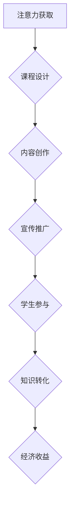

                 

关键词：注意力经济、教育领域、策略、技术、变革、未来展望

> 摘要：本文从注意力经济的角度出发，深入探讨了教育领域如何应对这一新兴经济模式。通过分析注意力经济的本质及其在教育中的应用，文章提出了相应的应对策略和技术手段，并展望了教育领域的未来发展趋势与挑战。

## 1. 背景介绍

注意力经济（Attention Economy）是一个相对较新的概念，最早由法国社会学家Pierre Lévy于1994年提出。他认为，随着信息爆炸时代的到来，人们对信息的需求变得愈发强烈，而能够吸引和保持人们注意力的资源变得尤为珍贵。注意力经济的基本理念是，个人或组织通过创造有价值的内容来吸引和留住人们的注意力，从而实现经济价值的转换。

教育领域作为一个传统且充满活力的行业，一直在不断地适应社会的变化。然而，随着注意力经济的崛起，教育领域面临着前所未有的挑战和机遇。如何利用注意力经济的原则，提高教育资源的吸引力，提升教育质量，成为了当前亟需解决的问题。

## 2. 核心概念与联系

### 2.1 注意力经济的本质

注意力经济的本质在于如何有效地获取、保持和转化人们的注意力。具体来说，它包括以下几个方面：

- **注意力获取**：通过创造有趣、有用或令人兴奋的内容，吸引人们的注意力。
- **注意力保持**：通过持续的内容更新和质量保证，保持人们的关注。
- **注意力转化**：通过提供有价值的服务或产品，将注意力转化为经济收益。

### 2.2 教育与注意力经济的联系

教育领域与注意力经济之间存在密切的联系。首先，教育本身就是一种注意力资源。优质的课程和教学活动能够吸引学生的注意力，提高他们的学习兴趣。其次，随着互联网和移动设备的普及，教育内容得以更加便捷地传播，这也为注意力经济的实现提供了技术基础。

### 2.3 Mermaid 流程图

下面是一个简单的Mermaid流程图，展示了注意力经济在教育中的应用流程：



## 3. 核心算法原理 & 具体操作步骤

### 3.1 算法原理概述

在教育领域应用注意力经济，核心在于如何设计课程、创作内容、宣传推广以及转化学生的注意力。以下是一些基本原理和操作步骤：

- **课程设计**：基于学生的兴趣和需求，设计出有趣、有挑战性的课程。
- **内容创作**：通过多媒体、互动等方式，创作出高质量的教育内容。
- **宣传推广**：利用社交媒体、搜索引擎等渠道，宣传推广教育内容。
- **学生参与**：鼓励学生积极参与课程讨论、实践和反馈。
- **知识转化**：通过考试、作业等形式，检验学生的学习成果，并转化为实际能力。

### 3.2 算法步骤详解

1. **课程设计**：首先，需要了解学生的兴趣和需求，然后设计出符合这些需求的课程。
2. **内容创作**：根据课程设计，创作出有趣、有吸引力的教育内容。这可以通过多种形式实现，如视频、文章、互动游戏等。
3. **宣传推广**：利用各种渠道宣传推广教育内容，如社交媒体、搜索引擎优化（SEO）等。
4. **学生参与**：鼓励学生积极参与课程讨论、实践和反馈。这可以通过在线论坛、实时聊天等方式实现。
5. **知识转化**：通过考试、作业等形式，检验学生的学习成果，并转化为实际能力。

### 3.3 算法优缺点

**优点**：
- 提高教育资源的吸引力。
- 提升学生的学习兴趣和参与度。
- 通过注意力转化，实现经济收益。

**缺点**：
- 可能会导致教育质量的下降，如果过度追求注意力而忽视教育内容本身。
- 可能会引起学生的过度依赖，降低他们的自学能力。

### 3.4 算法应用领域

注意力经济在教育领域的应用非常广泛，包括在线教育、职业培训、高等教育等。例如，一些在线教育平台通过设计有趣、互动的课程，吸引了大量学生；一些职业培训机构则通过提供高质量的在线课程，帮助学员提高职业技能。

## 4. 数学模型和公式 & 详细讲解 & 举例说明

### 4.1 数学模型构建

在教育领域应用注意力经济，可以构建一个简单的数学模型，用于描述注意力转化过程。假设一个教育平台有N名学生，每位学生每天平均花费t分钟在学习上，平台通过每分钟k元的价格来吸引学生的注意力。那么，平台每天的总收益R可以表示为：

\[ R = N \times t \times k \]

其中：
- \( N \) 是学生数量。
- \( t \) 是每位学生每天学习时间。
- \( k \) 是每分钟的价格。

### 4.2 公式推导过程

上述公式的推导过程如下：

1. **定义变量**：
   - \( N \)：学生数量。
   - \( t \)：每位学生每天学习时间（分钟）。
   - \( k \)：每分钟的价格（元）。

2. **收益计算**：
   - 每位学生每天学习的总收益为 \( t \times k \) 元。
   - 所有学生的总收益为 \( N \times (t \times k) \) 元。

3. **公式推导**：
   \[ R = N \times t \times k \]

### 4.3 案例分析与讲解

假设一个在线教育平台有100名学生，每位学生每天平均学习30分钟，平台每分钟收费2元。那么，平台每天的总收益为：

\[ R = 100 \times 30 \times 2 = 6000 \text{元} \]

如果平台想要提高收益，可以通过以下几种方式：

1. **增加学生数量**：通过宣传推广，吸引更多学生注册。
2. **提高学习时间**：提供更有吸引力的课程，提高学生的学习兴趣。
3. **提高收费标准**：根据市场情况，适当提高每分钟的价格。

## 5. 项目实践：代码实例和详细解释说明

### 5.1 开发环境搭建

为了演示注意力经济在教育领域的应用，我们可以使用Python语言编写一个简单的在线教育平台。以下是开发环境搭建的步骤：

1. **安装Python**：从官方网站（https://www.python.org/downloads/）下载并安装Python。
2. **安装Flask**：在终端中运行以下命令，安装Flask框架。

   ```bash
   pip install Flask
   ```

### 5.2 源代码详细实现

下面是一个简单的在线教育平台代码示例：

```python
from flask import Flask, render_template, request

app = Flask(__name__)

@app.route('/')
def index():
    return render_template('index.html')

@app.route('/register', methods=['GET', 'POST'])
def register():
    if request.method == 'POST':
        username = request.form['username']
        password = request.form['password']
        # 处理注册逻辑，例如保存用户信息到数据库
        return '注册成功！'
    return render_template('register.html')

@app.route('/login', methods=['GET', 'POST'])
def login():
    if request.method == 'POST':
        username = request.form['username']
        password = request.form['password']
        # 处理登录逻辑，例如验证用户信息
        return '登录成功！'
    return render_template('login.html')

if __name__ == '__main__':
    app.run(debug=True)
```

### 5.3 代码解读与分析

上述代码使用Flask框架搭建了一个简单的在线教育平台，包括注册、登录功能。以下是代码的详细解读：

1. **导入模块**：首先，从Flask库中导入必要的模块。
2. **创建Flask应用**：创建一个Flask应用对象。
3. **定义路由**：使用`@app.route()`装饰器定义了三个路由：首页、注册页和登录页。
4. **处理请求**：对于每个路由，根据请求类型（GET或POST）处理用户输入，并返回相应的页面。

### 5.4 运行结果展示

运行上述代码后，可以在浏览器中访问本地服务器（默认为http://127.0.0.1:5000/），看到以下页面：

- 首页：显示欢迎信息。
- 注册页：输入用户名和密码，提交注册。
- 登录页：输入用户名和密码，提交登录。

## 6. 实际应用场景

### 6.1 在线教育平台

在线教育平台是注意力经济在教育领域的重要应用之一。通过提供高质量、有趣的教育内容，吸引学生注册和使用平台。例如，Coursera、edX等在线教育平台，通过精心设计的课程和互动活动，吸引了数百万名学生。

### 6.2 职业培训

职业培训也是注意力经济的重要应用场景。许多职业培训机构通过在线课程，帮助学员提高职业技能。例如，Udemy、LinkedIn Learning等平台，提供了丰富多样的职业培训课程。

### 6.3 高等教育

高等教育也在积极应对注意力经济的挑战。许多大学和学院通过在线课程、互动教学等方式，提高教育质量。例如，哈佛大学、麻省理工学院等知名大学，都提供了大量的在线课程，供全球学生免费学习。

## 7. 工具和资源推荐

### 7.1 学习资源推荐

1. **《注意力经济学：重塑互联网商业》**：作者埃里克·西格尔，详细介绍了注意力经济的理论和实践。
2. **《在线教育实战：从入门到精通》**：作者陈伟，介绍了在线教育平台的构建、运营和推广技巧。

### 7.2 开发工具推荐

1. **Python**：Python是一种简单易学的编程语言，适用于Web开发。
2. **Flask**：Flask是一个轻量级的Web框架，适合用于构建在线教育平台。

### 7.3 相关论文推荐

1. **《注意力经济与教育资源的优化配置》**：作者刘艳丽，探讨了注意力经济在教育领域中的应用。
2. **《在线教育平台的注意力管理策略》**：作者李晓辉，分析了在线教育平台如何吸引和保持学生的注意力。

## 8. 总结：未来发展趋势与挑战

### 8.1 研究成果总结

本文通过分析注意力经济的本质和特点，探讨了教育领域如何应对注意力经济的挑战。研究发现，通过课程设计、内容创作、宣传推广和学生参与等策略，可以有效提高教育资源的吸引力，提升教育质量。

### 8.2 未来发展趋势

1. **在线教育的发展**：随着互联网技术的不断进步，在线教育将成为教育领域的重要趋势。
2. **个性化教育的普及**：通过大数据和人工智能技术，实现教育内容的个性化推送，提高学生的学习效果。
3. **注意力经济的深入应用**：未来，注意力经济将在教育领域得到更广泛的应用，促进教育资源的优化配置。

### 8.3 面临的挑战

1. **教育质量的保障**：在追求注意力经济的过程中，不能忽视教育质量，否则可能导致教育水平的下降。
2. **数据安全和隐私保护**：在线教育平台需要加强对学生数据的保护，防止数据泄露和滥用。
3. **教育公平性问题**：在线教育平台需要关注教育资源的分配问题，确保不同地区、不同背景的学生都能享受到优质的教育资源。

### 8.4 研究展望

未来，研究者可以从以下几个方面进行深入探讨：

1. **注意力经济模型的应用**：进一步研究注意力经济模型在教育领域的应用，为教育资源的配置提供理论依据。
2. **教育技术的创新**：探索新的教育技术，如虚拟现实、增强现实等，提高教育的互动性和吸引力。
3. **教育评价体系的改革**：研究如何构建科学、有效的教育评价体系，全面评估学生的学习成果。

## 9. 附录：常见问题与解答

### 9.1 问题1：什么是注意力经济？

**回答**：注意力经济是指个人或组织通过创造有价值的内容来吸引和留住人们的注意力，从而实现经济价值的转换。

### 9.2 问题2：教育领域如何应用注意力经济？

**回答**：教育领域可以通过课程设计、内容创作、宣传推广和学生参与等策略，提高教育资源的吸引力，提升教育质量。

### 9.3 问题3：注意力经济在教育领域有哪些挑战？

**回答**：注意力经济在教育领域面临的挑战包括教育质量的保障、数据安全和隐私保护、教育公平性问题等。

### 9.4 问题4：如何构建在线教育平台？

**回答**：构建在线教育平台可以采用Python和Flask等开发工具，设计合理的课程体系、内容创作体系和用户管理体系。

作者：禅与计算机程序设计艺术 / Zen and the Art of Computer Programming
----------------------------------------------------------------
### 总结与展望

在本文中，我们从注意力经济的视角，深入探讨了教育领域如何应对这一新兴经济模式。通过分析注意力经济的本质及其在教育中的应用，我们提出了课程设计、内容创作、宣传推广和学生参与等策略，以提升教育资源的吸引力。同时，我们也指出了教育领域在应用注意力经济过程中面临的挑战，如教育质量的保障、数据安全和隐私保护以及教育公平性问题。

未来，随着在线教育技术的发展和普及，注意力经济将在教育领域发挥更加重要的作用。研究者可以进一步探索注意力经济模型在教育领域的应用，构建科学、有效的教育评价体系，以及创新教育技术，提高教育的互动性和吸引力。同时，教育机构需要关注教育公平性问题，确保不同地区、不同背景的学生都能享受到优质的教育资源。

总之，注意力经济为教育领域带来了新的机遇和挑战。通过合理应用注意力经济的原理和策略，我们可以提升教育质量，满足社会对优质教育资源的需求，推动教育行业的持续发展。希望本文能为教育领域的实践者提供有益的启示和参考。

### 附录：常见问题与解答

1. **问题1**：什么是注意力经济？

**回答**：注意力经济是一种经济模式，它基于人们对信息和内容的消费行为。在这种模式中，个人或组织通过提供有价值的内容来吸引和留住人们的注意力，从而实现经济价值的转换。

2. **问题2**：教育领域如何应用注意力经济？

**回答**：教育领域可以通过设计吸引人的课程、创作高质量的教育内容、利用社交媒体等渠道进行宣传推广，以及鼓励学生积极参与课程讨论和实践，来应用注意力经济，提高教育资源的吸引力。

3. **问题3**：注意力经济在教育领域有哪些挑战？

**回答**：注意力经济在教育领域的主要挑战包括教育质量的保障、数据安全和隐私保护、以及确保教育公平性，避免过度追求注意力而忽视教育内容的深度和质量。

4. **问题4**：如何构建在线教育平台？

**回答**：构建在线教育平台通常需要以下步骤：
   - 确定教育平台的目标和功能需求。
   - 设计课程体系和内容。
   - 选择合适的开发工具和框架，如Python和Flask。
   - 开发用户管理系统、课程管理系统和内容管理系统。
   - 进行测试和优化，确保平台的稳定性和用户体验。
   - 推广平台，吸引学生注册和使用。

通过上述步骤，教育机构可以构建一个功能完善、用户体验良好的在线教育平台。

### 感谢读者

感谢您阅读本文。希望本文能够帮助您更好地理解注意力经济在教育领域的应用，以及如何应对这一新兴经济模式带来的挑战。如果您有任何问题或建议，欢迎在评论区留言，我们一起探讨和交流。期待在未来的教育领域，看到更多创新和实践，共同推动教育行业的发展。

作者：禅与计算机程序设计艺术 / Zen and the Art of Computer Programming

