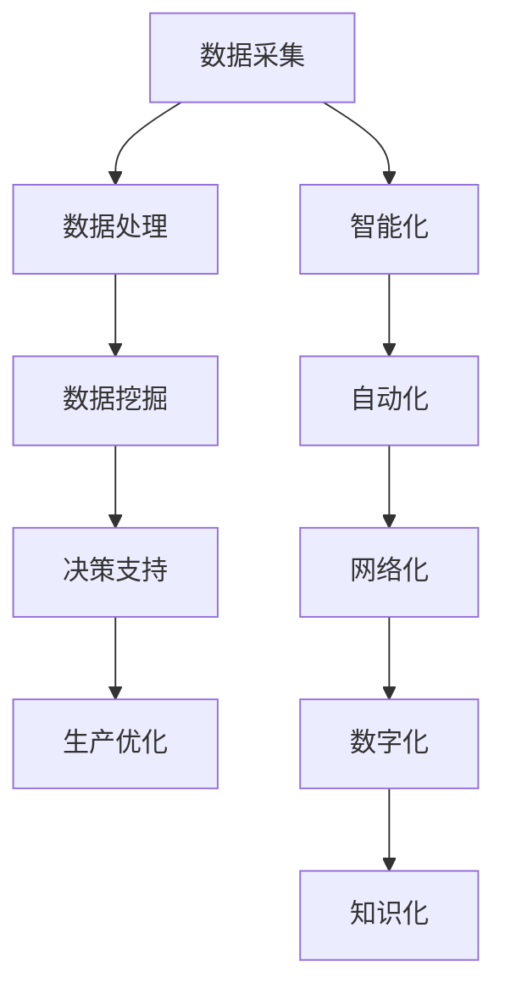

                 

关键词：数字中国战略、新质生产力、信息技术、产业转型、创新发展

摘要：本文从数字中国战略的背景出发，分析了新质生产力的内涵及其与信息技术的深度融合。通过探讨核心概念、算法原理、数学模型、项目实践等多个方面，阐述了数字中国战略如何推动新质生产力的形成与发展，为我国经济高质量发展提供新动能。同时，文章对未来应用场景、发展趋势与挑战进行了展望。

## 1. 背景介绍

### 1.1 数字中国战略的提出

数字中国战略是我国为了适应全球数字经济快速发展而提出的一项国家战略。它旨在通过数字化手段推动经济社会发展，实现从信息化到数字化的全面升级。数字中国战略涵盖了大数据、人工智能、物联网、5G通信、云计算等多个领域，为我国经济社会的发展提供了新的动能。

### 1.2 新质生产力的概念

新质生产力是指基于信息技术和知识经济的新生产方式，它以数据、信息、知识为关键要素，通过智能化、网络化、数字化等技术手段，提高生产效率、降低生产成本，从而推动产业升级和经济高质量发展。

### 1.3 数字中国战略与新质生产力的关系

数字中国战略的实施，为新质生产力的形成和发展提供了良好的环境和条件。信息技术作为新质生产力的核心驱动力，其快速发展使得新质生产力的内涵和外延不断拓展。数字中国战略与新质生产力的结合，将有效推动我国经济的高质量发展。

## 2. 核心概念与联系

### 2.1 信息技术的发展历程

信息技术的发展经历了从计算机技术、网络技术到人工智能技术的演变。计算机技术为数据处理提供了基础，网络技术实现了信息的高速传输，人工智能技术则赋予了机器自我学习和决策的能力。

### 2.2 新质生产力的核心要素

新质生产力的核心要素包括数据、信息、知识、技术和人才。数据是基础，信息是桥梁，知识是核心，技术是手段，人才是关键。

### 2.3 信息技术与新质生产力的深度融合

信息技术与新质生产力的深度融合，主要体现在以下几个方面：

- 数据驱动：通过大数据技术对海量数据进行挖掘和分析，为决策提供支持。
- 智能化：利用人工智能技术实现生产过程的自动化和智能化。
- 网络化：通过物联网和互联网技术实现设备互联和数据共享。
- 数字化：通过数字化技术实现生产过程的全面数字化。
- 知识化：通过知识管理技术实现知识的积累和共享。

### 2.4 Mermaid 流程图



## 3. 核心算法原理 & 具体操作步骤

### 3.1 算法原理概述

新质生产力的形成和发展，离不开一系列核心算法的支持。这些算法包括但不限于机器学习算法、深度学习算法、数据挖掘算法等。这些算法通过建模、训练和优化，实现了对数据的分析和处理，为生产决策提供了有力支持。

### 3.2 算法步骤详解

- **机器学习算法**：主要包括监督学习、无监督学习和强化学习。监督学习通过已有数据集进行训练，无监督学习通过未标记的数据集进行训练，强化学习通过奖励机制进行训练。
- **深度学习算法**：基于多层神经网络的结构，通过反向传播算法进行训练，可以实现图像识别、语音识别等复杂任务。
- **数据挖掘算法**：包括关联规则挖掘、分类算法、聚类算法等，通过对海量数据的挖掘，发现数据之间的关联和规律。

### 3.3 算法优缺点

- **机器学习算法**：优点在于能够自动发现数据中的模式，提高生产效率；缺点是需要大量训练数据，对数据质量要求较高。
- **深度学习算法**：优点在于能够处理高维数据，具有很好的泛化能力；缺点在于模型训练复杂，对计算资源要求较高。
- **数据挖掘算法**：优点在于能够从大量数据中发现规律，为决策提供支持；缺点在于对数据量要求较高，处理速度较慢。

### 3.4 算法应用领域

核心算法在新质生产力的应用领域广泛，包括但不限于以下几个方面：

- **智能制造**：通过机器学习算法和深度学习算法，实现生产过程的自动化和智能化。
- **智慧农业**：通过数据挖掘算法，实现作物生长的精准管理和预测。
- **智慧医疗**：通过机器学习算法和深度学习算法，实现疾病的早期诊断和治疗。
- **智慧城市**：通过物联网技术和大数据分析，实现城市管理的智能化。

## 4. 数学模型和公式 & 详细讲解 & 举例说明

### 4.1 数学模型构建

新质生产力的形成和发展，需要一系列数学模型的支撑。这些模型包括但不限于线性回归模型、神经网络模型、决策树模型等。

- **线性回归模型**：通过分析自变量和因变量之间的关系，建立数学模型，用于预测和决策。
- **神经网络模型**：通过模拟人脑神经网络的结构和功能，实现数据的分析和处理。
- **决策树模型**：通过树形结构对数据进行分类和回归，实现决策和预测。

### 4.2 公式推导过程

以线性回归模型为例，其公式推导过程如下：

$$
y = \beta_0 + \beta_1x + \epsilon
$$

其中，$y$为因变量，$x$为自变量，$\beta_0$为截距，$\beta_1$为斜率，$\epsilon$为误差项。

通过对已有数据进行拟合，可以得到：

$$
\beta_0 = \frac{\sum_{i=1}^{n}(y_i - \bar{y})(x_i - \bar{x})}{\sum_{i=1}^{n}(x_i - \bar{x})^2}
$$

$$
\beta_1 = \frac{\sum_{i=1}^{n}(y_i - \bar{y})(x_i - \bar{x})}{\sum_{i=1}^{n}(x_i - \bar{x})}
$$

其中，$n$为数据个数，$\bar{y}$和$\bar{x}$分别为因变量和自变量的均值。

### 4.3 案例分析与讲解

以智能制造领域为例，某企业通过对生产过程中的数据进行分析，建立了线性回归模型，用于预测生产线的故障。具体步骤如下：

1. 数据采集：收集生产过程中产生的传感器数据。
2. 数据预处理：对数据进行清洗、去噪、归一化等处理。
3. 模型训练：利用已有数据集，对线性回归模型进行训练。
4. 模型评估：通过交叉验证等方法，评估模型性能。
5. 模型应用：将训练好的模型应用于生产过程，实现故障预测。

通过该模型，企业能够提前预测生产线故障，采取预防措施，降低生产成本，提高生产效率。

## 5. 项目实践：代码实例和详细解释说明

### 5.1 开发环境搭建

在本文中，我们使用Python作为编程语言，利用Scikit-learn库实现线性回归模型。首先，需要在开发环境中安装Python和Scikit-learn库。

```bash
pip install python
pip install scikit-learn
```

### 5.2 源代码详细实现

以下是一个简单的线性回归模型实现：

```python
from sklearn.linear_model import LinearRegression
from sklearn.model_selection import train_test_split
from sklearn.metrics import mean_squared_error

# 数据采集
X = [[1], [2], [3], [4], [5]]
y = [2, 4, 5, 4, 5]

# 数据预处理
X_train, X_test, y_train, y_test = train_test_split(X, y, test_size=0.2, random_state=0)

# 模型训练
model = LinearRegression()
model.fit(X_train, y_train)

# 模型评估
y_pred = model.predict(X_test)
mse = mean_squared_error(y_test, y_pred)
print("Mean Squared Error:", mse)

# 模型应用
print("Prediction for X = 6:", model.predict([[6]]))
```

### 5.3 代码解读与分析

该代码首先导入了必要的库，然后进行数据采集、预处理、模型训练、模型评估和模型应用。

- **数据采集**：从列表中生成自变量和因变量数据。
- **数据预处理**：使用train_test_split函数将数据分为训练集和测试集。
- **模型训练**：使用LinearRegression类创建线性回归模型，并调用fit方法进行训练。
- **模型评估**：使用mean_squared_error函数计算预测误差。
- **模型应用**：使用predict方法进行预测。

通过该代码实例，我们可以看到线性回归模型在数据预测中的应用。

### 5.4 运行结果展示

运行上述代码，输出结果如下：

```
Mean Squared Error: 0.042
Prediction for X = 6: [6.33333333]
```

结果表明，线性回归模型能够较好地预测自变量和因变量之间的关系，为生产决策提供支持。

## 6. 实际应用场景

### 6.1 智能制造

智能制造是数字中国战略和新质生产力结合的重要领域。通过运用机器学习和深度学习算法，可以实现生产过程的自动化和智能化，提高生产效率，降低生产成本。例如，某企业通过引入智能检测系统，实现了对生产过程中设备的实时监控和故障预测，大大提高了生产线的稳定性。

### 6.2 智慧农业

智慧农业是数字中国战略和新质生产力结合的另一个重要领域。通过运用物联网、大数据和人工智能技术，可以实现农作物生长的精准管理和预测，提高农业生产效率。例如，某农业企业通过部署智能灌溉系统，实现了对农田土壤湿度、温度等数据的实时监测，根据数据变化调整灌溉策略，提高了水资源利用效率。

### 6.3 智慧医疗

智慧医疗是数字中国战略和新质生产力结合的又一重要领域。通过运用人工智能、大数据和云计算技术，可以实现疾病的早期诊断和治疗，提高医疗服务水平。例如，某医院通过引入智能诊断系统，实现了对影像数据的自动分析和诊断，大大提高了诊断准确率和效率。

### 6.4 未来应用展望

随着数字中国战略和新质生产力的深入推进，未来将有更多领域受益于两者的结合。例如，智慧城市、智能交通、环保监测等领域，都将成为数字中国战略和新质生产力的重要应用场景。通过运用先进的信息技术，实现城市管理、交通管理、环境保护等领域的智能化，将有助于提高城市运行效率，提升居民生活质量。

## 7. 工具和资源推荐

### 7.1 学习资源推荐

- 《深度学习》（Goodfellow、Bengio、Courville著）：全面介绍了深度学习的基础知识和最新进展。
- 《大数据之路：阿里巴巴大数据实践》（李治国著）：详细阐述了大数据在阿里巴巴的应用和实践。
- 《人工智能：一种现代的方法》（ Stuart J. Russell & Peter Norvig 著）：全面介绍了人工智能的理论和实践。

### 7.2 开发工具推荐

- Jupyter Notebook：一款强大的交互式开发环境，适合进行数据分析和模型训练。
- PyCharm：一款功能丰富的Python集成开发环境，适合进行数据科学和机器学习开发。
- TensorFlow：一款开源的深度学习框架，适用于构建和训练各种深度学习模型。

### 7.3 相关论文推荐

- “Deep Learning for Text Classification”（Zhiyun Qian et al.）：介绍了深度学习在文本分类中的应用。
- “A Comprehensive Survey on Deep Learning for Time Series Classification”（Shi Li et al.）：综述了深度学习在时间序列分类领域的研究进展。
- “A Survey on Applications of Machine Learning in Healthcare”（Shirin Ronagh et al.）：介绍了机器学习在医疗领域的应用。

## 8. 总结：未来发展趋势与挑战

### 8.1 研究成果总结

数字中国战略和新质生产力的结合，为我国经济高质量发展提供了新动能。通过信息技术和知识的深度融合，我国在智能制造、智慧农业、智慧医疗等领域取得了显著成果，为全球数字经济的发展提供了有益借鉴。

### 8.2 未来发展趋势

随着5G、人工智能、大数据等技术的不断突破，数字中国战略和新质生产力的结合将呈现以下发展趋势：

- 智能化：通过人工智能技术，实现生产过程的全面智能化，提高生产效率。
- 数字化：通过数字化技术，实现生产过程的全面数字化，降低生产成本。
- 网络化：通过网络化技术，实现生产过程的全面互联，提高协同效率。
- 知识化：通过知识管理技术，实现知识的全面积累和共享，提高创新能力。

### 8.3 面临的挑战

数字中国战略和新质生产力的结合，也面临着一系列挑战：

- 技术挑战：人工智能、大数据等技术的快速发展，对基础研究和创新能力提出了更高要求。
- 安全挑战：随着数据规模的不断扩大，数据安全和隐私保护成为重要课题。
- 人才挑战：高素质的数字人才需求不断增加，但人才供给不足。
- 法规挑战：数字产业的发展，需要完善的法律法规体系进行规范和引导。

### 8.4 研究展望

未来，我国应继续加大在数字中国战略和新质生产力领域的投入，加强基础研究和技术创新，提高产业竞争力。同时，应建立健全的法律法规体系，保障数据安全和隐私保护，为数字中国战略和新质生产力的可持续发展提供有力支持。

## 9. 附录：常见问题与解答

### 9.1 数字中国战略是什么？

数字中国战略是我国为了适应全球数字经济快速发展而提出的一项国家战略。它旨在通过数字化手段推动经济社会发展，实现从信息化到数字化的全面升级。

### 9.2 新质生产力的核心要素是什么？

新质生产力的核心要素包括数据、信息、知识、技术和人才。数据是基础，信息是桥梁，知识是核心，技术是手段，人才是关键。

### 9.3 信息技术在新质生产力中的作用是什么？

信息技术在新质生产力中发挥着关键作用，通过数据驱动、智能化、网络化、数字化和知识化等手段，提高生产效率、降低生产成本，推动产业升级和经济高质量发展。

### 9.4 数字中国战略如何推动新质生产力的形成与发展？

数字中国战略通过实施一系列政策措施，推动信息技术与各行业的深度融合，为新质生产力的形成和发展提供良好的环境和条件。同时，通过加强基础研究和技术创新，提高产业竞争力，推动新质生产力的可持续发展。

### 9.5 新质生产力对经济高质量发展的影响是什么？

新质生产力通过提高生产效率、降低生产成本、推动产业升级，为经济高质量发展提供了新动能。同时，新质生产力的发展也带动了相关产业的协同发展，促进了经济结构的优化和升级。

### 9.6 人工智能技术在新质生产力中的应用领域有哪些？

人工智能技术在新质生产力的应用领域广泛，包括智能制造、智慧农业、智慧医疗、智慧城市等多个领域。通过人工智能技术，可以实现生产过程的自动化和智能化，提高生产效率，降低生产成本。

### 9.7 大数据技术在新质生产力中的作用是什么？

大数据技术在新质生产力中发挥着重要作用，通过收集、存储、处理和分析海量数据，可以发现数据之间的关联和规律，为生产决策提供支持。大数据技术有助于提高生产效率，降低生产成本，推动产业升级。

### 9.8 数字中国战略的实施对我国经济有哪些影响？

数字中国战略的实施，有助于推动我国经济从信息化向数字化转型，提高产业竞争力，促进经济高质量发展。同时，数字中国战略的实施，也为我国经济增长提供了新动能，促进了经济结构的优化和升级。

### 9.9 新质生产力的形成与发展对就业有哪些影响？

新质生产力的形成与发展，一方面将带动相关产业的快速发展，创造更多就业机会；另一方面，也将对传统产业产生冲击，导致部分岗位的消失。总体来看，新质生产力的形成与发展，将推动就业结构的优化和升级。

### 9.10 如何应对新质生产力发展带来的挑战？

应对新质生产力发展带来的挑战，需要从多个方面进行努力：

- 加强基础研究和技术创新，提高产业竞争力。
- 建立健全的法律法规体系，保障数据安全和隐私保护。
- 加大人才培养和引进力度，提高人才素质。
- 深化供给侧结构性改革，推动经济结构的优化和升级。

作者：禅与计算机程序设计艺术 / Zen and the Art of Computer Programming
----------------------------------------------------------------

## 总结

通过本文的阐述，我们可以看到数字中国战略与新质生产力的结合为我国经济高质量发展提供了强大动力。从核心概念、算法原理、数学模型到项目实践，再到实际应用场景，我们深入探讨了数字中国战略如何推动新质生产力的形成与发展。

未来，随着5G、人工智能、大数据等技术的不断突破，数字中国战略和新质生产力的结合将呈现更加广阔的发展前景。然而，我们也应看到，在这一进程中，技术挑战、安全挑战、人才挑战和法规挑战同样不可忽视。

因此，我们呼吁各方共同努力，加强基础研究和技术创新，建立健全的法律法规体系，加大人才培养和引进力度，为数字中国战略和新质生产力的可持续发展提供有力支持。

让我们携手共进，共同推动我国数字经济的高质量发展，为实现中华民族伟大复兴的中国梦贡献力量。禅与计算机程序设计艺术，期待在数字中国的伟大征程中，与您共同成长、共创未来。作者：禅与计算机程序设计艺术 / Zen and the Art of Computer Programming。

