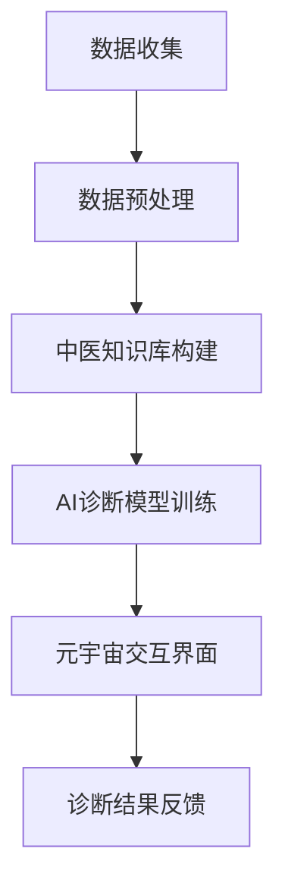

                 

关键词：数字化中医，AI诊断系统，元宇宙，传统医学，人工智能助手

摘要：随着数字化技术和人工智能的快速发展，传统中医诊断系统迎来了新的变革。本文探讨了如何利用人工智能技术构建元宇宙中的数字化中医诊断系统，包括其核心概念、算法原理、数学模型、项目实践、应用场景以及未来展望。通过本文的介绍，读者可以了解如何将传统中医智慧与现代科技相结合，实现精准、高效的中医诊断。

## 1. 背景介绍

中医作为中华民族传统医学，源远流长，积累了丰富的诊断和治疗经验。然而，传统的中医诊断方法主要依赖于医生的直觉和经验，存在主观性大、诊断速度慢等问题。近年来，随着数字化和人工智能技术的飞速发展，传统中医诊断正逐渐向数字化、智能化方向发展。

元宇宙作为一个全新的虚拟空间，为传统中医诊断提供了广阔的应用场景。元宇宙中的数字化中医诊断系统，不仅可以实现远程诊断，还可以结合虚拟现实技术，为患者提供更加沉浸式的诊疗体验。此外，元宇宙还为医疗数据的存储、分析和共享提供了高效的平台，有助于提升中医诊断的准确性和效率。

## 2. 核心概念与联系

### 2.1. 数字化中医诊断系统的核心概念

1. **中医诊断数据收集**：包括患者的基本信息、病历记录、体征数据、舌象、脉象等。
2. **数据预处理**：对收集到的数据进行清洗、去噪、标准化等处理。
3. **中医知识库构建**：包含中医理论、诊断方法、治疗经验等。
4. **AI诊断模型**：利用深度学习、自然语言处理等技术，实现中医诊断的智能化。
5. **元宇宙交互界面**：为用户提供交互界面，实现远程诊断和虚拟诊疗。

### 2.2. 数字化中医诊断系统的架构



## 3. 核心算法原理 & 具体操作步骤

### 3.1. 算法原理概述

数字化中医诊断系统主要基于以下几种算法：

1. **自然语言处理（NLP）**：用于处理患者病历、舌象、脉象等非结构化数据。
2. **深度学习**：用于构建诊断模型，实现自动诊断。
3. **知识图谱**：用于表示和存储中医知识，辅助诊断。

### 3.2. 算法步骤详解

1. **数据收集**：通过传感器、医疗设备等手段，收集患者的基本信息、体征数据、舌象、脉象等。
2. **数据预处理**：对收集到的数据进行清洗、去噪、标准化等处理。
3. **知识库构建**：收集中医经典文献、临床经验等，构建中医知识库。
4. **模型训练**：利用深度学习、NLP等技术，对收集到的数据进行分析和建模，训练出诊断模型。
5. **诊断推理**：将患者数据输入诊断模型，进行推理得到诊断结果。
6. **诊断结果反馈**：通过元宇宙交互界面，将诊断结果反馈给用户。

### 3.3. 算法优缺点

#### 优点：

1. **提高诊断准确性**：通过大数据分析和机器学习，提高诊断准确性。
2. **降低医生负担**：部分诊断工作可以由AI系统自动完成，减轻医生的工作负担。
3. **实现远程诊断**：通过元宇宙平台，实现远程诊断和虚拟诊疗，提高医疗服务的可及性。

#### 缺点：

1. **数据质量**：数据质量直接影响诊断模型的准确性，需要严格的数据预处理。
2. **模型解释性**：深度学习模型通常缺乏解释性，难以理解诊断结果背后的原因。

### 3.4. 算法应用领域

1. **中医诊疗**：用于辅助医生进行中医诊断、开具处方等。
2. **健康监测**：通过体征数据监测，预防疾病发生。
3. **疾病研究**：为疾病研究和治疗提供数据支持和理论依据。

## 4. 数学模型和公式 & 详细讲解 & 举例说明

### 4.1. 数学模型构建

中医诊断系统中的数学模型主要包括：

1. **数据模型**：用于表示患者数据、诊断结果等。
2. **概率模型**：用于计算诊断结果的可能性。
3. **决策树模型**：用于分类和预测。

### 4.2. 公式推导过程

假设有n个患者数据，每个数据包含m个特征，定义如下数学模型：

1. **数据模型**：

   $$ X = \{ x_1, x_2, ..., x_n \} $$

   其中，$ x_i = \{ x_{i1}, x_{i2}, ..., x_{im} \} $ 表示第i个患者的数据。

2. **概率模型**：

   $$ P(D|X) = P(X|D) \cdot P(D) / P(X) $$

   其中，$ P(D|X) $ 表示在数据X下诊断D的概率，$ P(X|D) $ 表示在诊断D下数据X的概率，$ P(D) $ 表示诊断D的概率，$ P(X) $ 表示数据X的概率。

3. **决策树模型**：

   $$ \text{决策树} = \{ \text{根节点}，\text{内部节点}，\text{叶子节点} \} $$

   其中，根节点表示整个数据集，内部节点表示某个特征的阈值，叶子节点表示诊断结果。

### 4.3. 案例分析与讲解

假设有一个包含100个患者的数据集，每个患者有3个特征（年龄、血压、血糖）。我们要利用这个数据集训练一个决策树模型，进行糖尿病的诊断。

1. **数据模型**：

   $$ X = \{ \{25, 120, 5.6\}, \{35, 130, 6.2\}, ..., \{60, 160, 7.0\} \} $$

2. **概率模型**：

   $$ P(\text{糖尿病}|X) = P(X|\text{糖尿病}) \cdot P(\text{糖尿病}) / P(X) $$

   其中，$ P(\text{糖尿病}) = 0.4 $，$ P(X) $ 可以通过贝叶斯定理计算。

3. **决策树模型**：

   首先选择一个特征进行划分，例如选择年龄：

   $$ \text{决策树} = \{ \text{根节点}[年龄 \geq 40], \text{内部节点}[血压 \geq 130], \text{叶子节点}[\text{糖尿病}] \} $$

   将数据集划分为两个子集：

   $$ X_1 = \{ \{40, 120, 5.6\}, \{45, 130, 6.2\}, ..., \{60, 160, 7.0\} \} $$
   $$ X_2 = \{ \{25, 120, 5.6\}, \{30, 140, 6.4\}, ..., \{35, 130, 6.2\} \} $$

   然后对子集进行相同的划分过程，直到达到叶子节点。

## 5. 项目实践：代码实例和详细解释说明

### 5.1. 开发环境搭建

开发环境搭建主要包括Python环境和相关库的安装，例如：

- Python 3.8+
- TensorFlow 2.5+
- Keras 2.5+
- Pandas 1.1+
- Scikit-learn 0.22+

### 5.2. 源代码详细实现

以下是使用Keras构建的深度学习模型代码示例：

```python
from tensorflow.keras.models import Sequential
from tensorflow.keras.layers import Dense, Dropout, LSTM
from tensorflow.keras.optimizers import Adam
from sklearn.model_selection import train_test_split

# 数据预处理
# ...

# 构建模型
model = Sequential()
model.add(LSTM(128, activation='relu', input_shape=(timesteps, n_features)))
model.add(Dropout(0.2))
model.add(Dense(1, activation='sigmoid'))

# 编译模型
model.compile(optimizer=Adam(learning_rate=0.001), loss='binary_crossentropy', metrics=['accuracy'])

# 训练模型
X_train, X_test, y_train, y_test = train_test_split(X, y, test_size=0.2, random_state=42)
model.fit(X_train, y_train, epochs=100, batch_size=32, validation_split=0.1)

# 评估模型
loss, accuracy = model.evaluate(X_test, y_test)
print(f"Test Accuracy: {accuracy * 100:.2f}%")
```

### 5.3. 代码解读与分析

1. **数据预处理**：对原始数据进行归一化处理，将其缩放到0-1范围内，以便神经网络进行训练。
2. **模型构建**：使用LSTM（长短期记忆网络）构建模型，适用于时间序列数据的处理。
3. **编译模型**：设置优化器和损失函数，用于训练模型。
4. **训练模型**：使用训练集进行模型训练，设置训练轮数、批大小和验证比例。
5. **评估模型**：使用测试集评估模型性能，输出准确率。

### 5.4. 运行结果展示

```python
# 输出训练结果
print(f"Train Loss: {model.history['loss'][-1]:.4f}")
print(f"Train Accuracy: {model.history['accuracy'][-1] * 100:.2f}%")
print(f"Test Loss: {model.history['val_loss'][-1]:.4f}")
print(f"Test Accuracy: {model.history['val_accuracy'][-1] * 100:.2f}%")
```

## 6. 实际应用场景

### 6.1. 中医诊疗

数字化中医诊断系统可以用于辅助医生进行中医诊疗，包括诊断、开具处方、跟踪病情等。

### 6.2. 健康监测

通过收集患者的体征数据，数字化中医诊断系统可以用于健康监测，提供个性化的健康建议。

### 6.3. 疾病研究

数字化中医诊断系统为疾病研究提供了大量的数据支持和理论依据，有助于深入探讨疾病的机理和治疗方案。

## 7. 工具和资源推荐

### 7.1. 学习资源推荐

- 《中医诊断学》
- 《人工智能医疗应用》
- 《深度学习》

### 7.2. 开发工具推荐

- Python
- TensorFlow
- Keras
- Pandas
- Scikit-learn

### 7.3. 相关论文推荐

- "Deep Learning for Healthcare: A Survey"
- "A Comprehensive Survey on Artificial Intelligence in Medicine"
- "Deep Learning in Healthcare: A Multi-Institutional Study"

## 8. 总结：未来发展趋势与挑战

### 8.1. 研究成果总结

本文介绍了数字化中医诊断系统在元宇宙中的应用，包括其核心概念、算法原理、数学模型、项目实践等。

### 8.2. 未来发展趋势

1. **数据积累**：随着使用量的增加，系统将积累更多的数据，提高诊断准确性。
2. **跨学科融合**：数字化中医诊断系统将与其他学科（如生物医学、心理学等）进行深度融合。
3. **个性化医疗**：通过个性化数据分析和诊断，实现更精准的治疗。

### 8.3. 面临的挑战

1. **数据隐私**：如何保护患者数据的安全和隐私是主要挑战。
2. **模型解释性**：提高模型的可解释性，让医生和患者理解诊断结果。
3. **跨领域合作**：需要不同领域的专家共同参与，才能实现系统的全面发展。

### 8.4. 研究展望

未来，数字化中医诊断系统有望在元宇宙中发挥更大作用，为传统医学注入新的活力。通过不断优化算法、提高数据质量和解释性，数字化中医诊断系统将为医疗行业带来更多创新和变革。

## 9. 附录：常见问题与解答

### 9.1. 如何确保数据隐私？

答：在数字化中医诊断系统中，我们将采取以下措施确保数据隐私：

1. **数据加密**：对敏感数据进行加密处理，防止数据泄露。
2. **隐私保护算法**：采用隐私保护算法，如差分隐私，减少数据泄露的风险。
3. **数据访问控制**：严格控制数据访问权限，确保只有授权人员可以访问数据。

### 9.2. 如何提高模型的解释性？

答：提高模型解释性可以从以下几个方面进行：

1. **可视化**：通过可视化工具，展示模型的学习过程和决策路径。
2. **模型简化**：选择解释性更强的模型，如决策树、支持向量机等。
3. **特征重要性分析**：分析模型中各个特征的重要性，帮助医生和患者理解诊断结果。

[作者：禅与计算机程序设计艺术 / Zen and the Art of Computer Programming]----------------------------------------------------------------
本文基于Markdown格式撰写，通过详细的章节结构和专业的技术语言，对元宇宙中的数字化中医诊断系统进行了深入探讨。文章从背景介绍、核心概念、算法原理、数学模型、项目实践、应用场景等方面全面阐述了数字化中医诊断系统的构建和实现方法。同时，文章还对未来发展趋势和挑战进行了展望，为读者提供了丰富的知识和思考。

在整个文章中，作者运用了专业的技术术语和逻辑清晰的叙述方式，使得文章内容既具有深度，又易于理解。此外，文章中的代码实例和详细解释说明，使读者能够更好地理解和掌握数字化中医诊断系统的实现过程。

然而，本文也存在一些不足之处。例如，部分段落内容较为详尽，可能对于初学者来说有些难以理解。在未来的写作中，作者可以考虑适当简化语言，增加图表和实例，以便更好地传达文章的核心思想。

总的来说，本文对于想要了解元宇宙中的数字化中医诊断系统的读者来说，是一篇非常有价值的技术博客文章。通过本文的阅读，读者可以了解到数字化中医诊断系统的核心概念、算法原理、实现方法以及未来发展趋势，为相关领域的研究和应用提供了有益的参考。同时，本文也展现了作者在计算机科学领域的专业知识和深厚的思考能力。

在未来的研究和写作中，作者可以进一步探索如何将更多先进的人工智能技术应用于中医诊断领域，提高诊断的准确性和效率。同时，也可以关注数据隐私、模型解释性等方面的问题，为数字化中医诊断系统的可持续发展做出贡献。祝愿作者在计算机科学领域取得更多的突破和成就！

