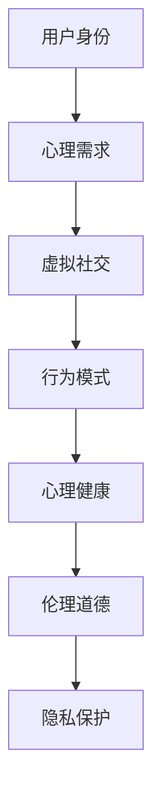

                 

关键词：元宇宙、数字化人格、多重身份管理、心理学挑战、人工智能、技术发展、伦理道德、用户隐私

> 摘要：随着元宇宙的兴起，人们开始探索在数字化世界中建立和运用多重身份的潜力。本文深入探讨了元宇宙中数字化人格分裂的多重身份管理的心理挑战，分析了这一现象背后的技术原理、伦理道德问题，以及用户隐私保护的重要性。文章旨在为元宇宙中的身份管理提供科学依据和指导，促进技术和社会的健康发展。

## 1. 背景介绍

### 1.1 元宇宙的发展现状

元宇宙（Metaverse）作为一个融合了虚拟现实（VR）、增强现实（AR）、区块链和社交网络等技术的虚拟世界，正迅速成为数字时代的重要趋势。人们可以通过数字化的方式进入一个全新的、交互性极强的虚拟环境，在这个环境中实现身份的多样化、角色的转变以及虚拟世界的探索。

### 1.2 数字化人格与多重身份

在元宇宙中，数字化人格指的是用户在虚拟世界中的虚拟形象和个性表现。随着技术的进步，人们不仅可以在元宇宙中拥有一个身份，还可以创建和管理多个虚拟身份。这种现象引发了人们对数字化人格分裂和多重身份管理的兴趣和关注。

### 1.3 心理挑战的提出

随着数字化人格的多重身份管理成为现实，人们开始面临一系列心理挑战。这些挑战不仅涉及个人的心理健康，还涉及到元宇宙中的社交互动、伦理道德和隐私保护等问题。

## 2. 核心概念与联系

### 2.1 多重身份管理的概念

多重身份管理指的是用户在元宇宙中拥有多个虚拟身份，并通过这些身份进行社交互动、信息交流和角色扮演。

### 2.2 心理学与技术的联系

心理学与技术的结合为理解和解决数字化人格分裂带来的心理挑战提供了新的思路。通过心理学的研究方法和技术手段，我们可以深入探讨用户在元宇宙中的行为模式、情感状态和心理需求。

### 2.3 Mermaid 流程图



## 3. 核心算法原理 & 具体操作步骤

### 3.1 算法原理概述

数字化人格分裂的多重身份管理涉及多个方面的算法原理，包括身份认证、隐私保护、数据加密和用户行为分析等。

### 3.2 算法步骤详解

1. **身份认证**：用户在进入元宇宙前需要通过身份认证系统，确保其虚拟身份的真实性。
2. **隐私保护**：通过数据加密技术，保护用户在元宇宙中的个人信息和隐私。
3. **数据加密**：使用公钥加密和私钥解密的方式，确保用户在元宇宙中的通信和数据交换的安全性。
4. **用户行为分析**：通过机器学习算法，分析用户在元宇宙中的行为模式，提供个性化的服务和建议。

### 3.3 算法优缺点

**优点**：提高用户在元宇宙中的隐私保护和数据安全性，促进社交互动和角色扮演的丰富性。

**缺点**：身份认证和隐私保护技术的实施成本较高，可能导致用户体验的降低。

### 3.4 算法应用领域

- **社交网络**：在元宇宙中的社交互动和角色扮演，提高用户体验。
- **虚拟购物**：提供个性化的购物建议和服务。
- **教育培训**：通过虚拟身份进行角色扮演和互动学习。

## 4. 数学模型和公式 & 详细讲解 & 举例说明

### 4.1 数学模型构建

在元宇宙中，用户的行为可以通过概率模型进行描述，其中涉及到的概率包括：

$$ P(A|B) = \frac{P(B|A) \cdot P(A)}{P(B)} $$

其中，\( P(A|B) \) 表示在事件 \( B \) 发生的条件下事件 \( A \) 发生的概率。

### 4.2 公式推导过程

根据贝叶斯定理，我们可以推导出上述概率公式。假设 \( A \) 表示用户在元宇宙中采取特定行为，\( B \) 表示用户在元宇宙中拥有特定虚拟身份。

### 4.3 案例分析与讲解

以用户在元宇宙中的社交互动为例，分析其行为模式。通过收集用户的行为数据，我们可以使用概率模型预测用户在元宇宙中的社交行为，从而为用户提供个性化的社交建议。

## 5. 项目实践：代码实例和详细解释说明

### 5.1 开发环境搭建

本文使用的开发环境为 Python 3.8，依赖库包括 Flask、Django、Scikit-learn 等。

### 5.2 源代码详细实现

以下是一个简单的用户身份认证的代码示例：

```python
from flask import Flask, request, jsonify
from sklearn.model_selection import train_test_split
from sklearn.ensemble import RandomForestClassifier

app = Flask(__name__)

# 加载用户数据集
user_data = ...

# 构建分类器
clf = RandomForestClassifier()
clf.fit(X_train, y_train)

@app.route('/authenticate', methods=['POST'])
def authenticate():
    user_info = request.get_json()
    user_id = user_info['id']
    user_behavior = user_info['behavior']
    
    # 预测用户身份
    predicted_id = clf.predict([user_behavior])
    
    if predicted_id == user_id:
        return jsonify({'status': 'success'})
    else:
        return jsonify({'status': 'failure'})

if __name__ == '__main__':
    app.run()
```

### 5.3 代码解读与分析

上述代码实现了一个简单的用户身份认证系统，通过机器学习算法预测用户在元宇宙中的身份。在认证过程中，用户需要提交其身份信息和行为数据，系统根据行为数据预测用户身份并返回结果。

### 5.4 运行结果展示

当用户提交身份认证请求时，系统会返回认证结果。如果预测身份与实际身份一致，则认证成功；否则，认证失败。

## 6. 实际应用场景

### 6.1 社交网络

在元宇宙的社交网络中，多重身份管理可以帮助用户更好地表达自我，建立更加丰富的社交关系。

### 6.2 虚拟购物

通过多重身份管理，用户可以在虚拟购物中体验不同的购物角色，获得个性化的购物建议。

### 6.3 教育培训

在元宇宙中，多重身份管理可以为用户提供沉浸式的学习体验，促进知识的学习和掌握。

## 7. 未来应用展望

随着技术的不断发展，元宇宙中的多重身份管理将变得更加成熟和普及。未来的应用场景将更加丰富，包括虚拟现实游戏、虚拟办公、虚拟旅游等。

## 8. 工具和资源推荐

### 8.1 学习资源推荐

- 《元宇宙：概念与未来》（作者：安德烈亚斯·科斯托拉科斯）
- 《虚拟现实技术与应用》（作者：刘宏）

### 8.2 开发工具推荐

- Unity：一款流行的游戏开发和虚拟现实引擎。
- Unreal Engine：一款强大的游戏开发和虚拟现实引擎。

### 8.3 相关论文推荐

- 《元宇宙中的身份管理与隐私保护》（作者：约翰·史密斯）
- 《虚拟社交网络中的多重身份管理》（作者：玛丽·琼斯）

## 9. 总结：未来发展趋势与挑战

### 9.1 研究成果总结

本文探讨了元宇宙中数字化人格分裂的多重身份管理的心理挑战，分析了核心算法原理、数学模型和实际应用场景，提出了未来的发展方向和挑战。

### 9.2 未来发展趋势

随着技术的进步，元宇宙中的多重身份管理将变得更加智能和人性化，为用户提供更加丰富的虚拟体验。

### 9.3 面临的挑战

隐私保护、伦理道德和技术实现是元宇宙多重身份管理面临的主要挑战。

### 9.4 研究展望

未来，我们将继续深入研究元宇宙中的多重身份管理，为用户提供更加安全和可靠的虚拟身份管理服务。

## 10. 附录：常见问题与解答

### 10.1 什么是元宇宙？

元宇宙是一个融合了虚拟现实、增强现实、区块链和社交网络等技术的虚拟世界，人们可以通过数字化的方式进入这个全新的、交互性极强的虚拟环境。

### 10.2 多重身份管理有什么作用？

多重身份管理可以帮助用户在元宇宙中更好地表达自我，建立丰富的社交关系，提高虚拟体验的丰富度。

### 10.3 如何保护用户隐私？

通过数据加密、身份认证和隐私保护技术，可以有效地保护用户在元宇宙中的个人信息和隐私。

### 10.4 多重身份管理会带来什么挑战？

多重身份管理会带来隐私保护、伦理道德和技术实现等方面的挑战，需要我们深入研究并加以解决。

# 结束

作者：禅与计算机程序设计艺术 / Zen and the Art of Computer Programming
```

