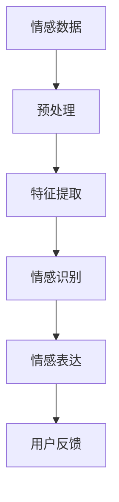
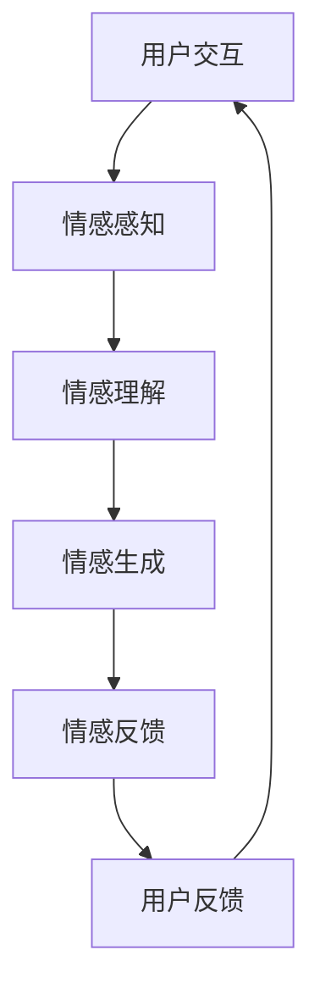
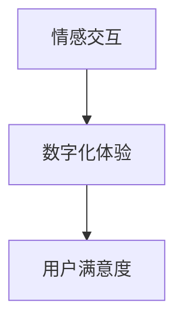

                 

关键词：人工智能，情感计算，数字化体验，情感交互，人机融合

> 摘要：随着人工智能技术的飞速发展，情感计算成为了一个备受关注的研究领域。本文将探讨人工智能如何通过数字化情感技术影响人类的感受，分析这一领域的核心概念、算法原理、应用场景以及未来发展趋势。作者：禅与计算机程序设计艺术 / Zen and the Art of Computer Programming

## 1. 背景介绍

### 情感计算与数字化情感

情感计算（Affective Computing）是人工智能研究中的一个重要分支，旨在使计算机能够理解、处理和模拟人类情感。数字化情感则是指将情感以数字化的形式表达、存储和传输的过程。情感的数字化不仅需要捕捉情感的特征，还需要在计算机系统中对其进行处理和响应。

近年来，随着深度学习、自然语言处理和计算机视觉等技术的进步，情感计算在各个领域得到了广泛应用，包括医疗、教育、客服、娱乐和交互设计等。数字化情感技术的兴起，使得人机交互更加自然和智能，极大地提升了用户体验。

### 人工智能的发展对情感计算的影响

人工智能的迅速发展推动了情感计算技术的进步。机器学习算法能够从大量数据中学习情感模式，神经网络则能够模拟人脑处理情感信息的方式。计算机视觉技术的发展使得计算机能够捕捉和理解人类的情感表达，语音识别技术则让计算机能够理解和响应人类情感的语音表达。

同时，随着物联网和大数据技术的普及，人们的生活中产生了大量的情感数据，这些数据为情感计算提供了丰富的素材。人工智能算法可以对这些数据进行深度挖掘，从而更好地理解和预测人类情感。

## 2. 核心概念与联系

### 情感识别与情感表达

情感识别是情感计算的基础，它涉及从文本、语音、图像等多种数据中提取情感特征。情感表达则是计算机系统对情感的理解和响应。情感识别和情感表达之间的关系可以用以下Mermaid流程图表示：



### 情感计算框架

情感计算框架通常包括情感感知、情感理解、情感生成和情感反馈四个核心模块。以下是一个简化的Mermaid流程图，展示了这些模块之间的相互作用：



### 情感交互与数字化体验

情感交互是指计算机系统与用户之间的情感交流和互动。数字化体验则是指用户在使用计算机系统时的整体感受。情感交互和数字化体验之间的关系可以表示为：



## 3. 核心算法原理 & 具体操作步骤

### 3.1 算法原理概述

情感计算的核心算法包括情感识别、情感理解和情感生成。以下是这些算法的基本原理：

#### 情感识别

情感识别算法通过分析文本、语音和图像等数据，提取情感特征，并将其分类为具体的情感类别。常用的情感识别算法包括基于机器学习的方法和基于深度学习的方法。

#### 情感理解

情感理解算法旨在理解情感的含义和背景，以便更准确地模拟人类情感反应。这通常涉及到自然语言处理技术和上下文理解。

#### 情感生成

情感生成算法用于生成计算机对情感的响应，例如，通过语音合成技术生成带有情感色彩的语音，或者通过图像生成技术生成表情丰富的图像。

### 3.2 算法步骤详解

#### 3.2.1 情感识别

1. 数据收集：收集包含情感信息的文本、语音和图像数据。
2. 预处理：对数据进行分析和清洗，以去除噪声和无关信息。
3. 特征提取：使用特征提取算法，如词袋模型、TF-IDF或深度神经网络，从数据中提取情感特征。
4. 模型训练：使用机器学习或深度学习算法，如支持向量机（SVM）或卷积神经网络（CNN），训练情感识别模型。
5. 情感分类：使用训练好的模型对新的数据执行情感分类。

#### 3.2.2 情感理解

1. 上下文分析：分析文本或语音中的上下文信息，以理解情感的含义和背景。
2. 情感推理：基于上下文信息，使用逻辑推理和语义分析技术，推断出情感状态。
3. 情感合成：使用自然语言处理技术和语音合成技术，生成包含情感理解的响应。

#### 3.2.3 情感生成

1. 情感特征提取：从用户输入中提取情感特征。
2. 情感模板选择：选择适当的情感模板，如快乐、悲伤或愤怒。
3. 情感合成：使用文本生成或语音合成技术，将情感特征和模板合成成具体的响应。

### 3.3 算法优缺点

#### 情感识别

优点：高精度，能够识别多种情感。
缺点：对上下文信息理解不足，可能产生误判。

#### 情感理解

优点：能够深入理解情感含义，提供更自然的交互。
缺点：对上下文信息依赖较高，处理复杂场景时可能表现不佳。

#### 情感生成

优点：能够生成情感丰富的响应，提升用户体验。
缺点：对情感模板和情感特征的依赖较大，可能产生机械的响应。

### 3.4 算法应用领域

情感计算算法在多个领域都有广泛的应用，包括：

- **医疗保健**：用于情感分析，帮助诊断和治疗情感障碍。
- **教育**：用于个性化学习，根据学生的情感状态调整教学策略。
- **客服**：用于情感分析，提供更自然的客户服务体验。
- **娱乐**：用于情感交互，创造更具吸引力的虚拟世界。
- **人机交互**：用于提升人机交互的自然性和智能性。

## 4. 数学模型和公式 & 详细讲解 & 举例说明

### 4.1 数学模型构建

情感计算中的数学模型主要包括情感识别模型、情感理解模型和情感生成模型。以下是这些模型的基本公式：

#### 情感识别模型

$$
\hat{y} = \text{argmax}_y (\sigma(W \cdot \phi(x)))
$$

其中，$x$ 是输入特征向量，$\phi(x)$ 是特征提取函数，$W$ 是模型权重，$\sigma$ 是激活函数，$\hat{y}$ 是预测的情感类别。

#### 情感理解模型

$$
\text{Emotion} = f(\text{Context}, \text{History})
$$

其中，$\text{Context}$ 是当前上下文信息，$\text{History}$ 是历史情感状态，$f$ 是情感推理函数。

#### 情感生成模型

$$
\text{Response} = g(\text{Template}, \text{Feature})
$$

其中，$\text{Template}$ 是情感模板，$\text{Feature}$ 是情感特征，$g$ 是情感合成函数。

### 4.2 公式推导过程

#### 情感识别模型推导

情感识别模型通常采用多层感知机（MLP）或卷积神经网络（CNN）进行构建。以下是多层感知机模型的推导过程：

1. **输入层**：$x = [x_1, x_2, ..., x_n]$
2. **隐藏层**：$a_i = \sigma(\sum_{j=1}^{n} W_{ij} x_j + b_i)$
3. **输出层**：$y = \text{argmax}_y (\sigma(W \cdot a))$

其中，$W$ 是权重矩阵，$b$ 是偏置项，$\sigma$ 是sigmoid函数。

#### 情感理解模型推导

情感理解模型通常采用递归神经网络（RNN）或长短期记忆网络（LSTM）进行构建。以下是LSTM模型的推导过程：

1. **输入层**：$x_t = [x_{t1}, x_{t2}, ..., x_{tn}]$
2. **隐藏层**：$h_t = \sigma(W_h \cdot [h_{t-1}, x_t])$
3. **细胞状态**：$c_t = f_t \odot c_{t-1} + i_t \odot \text{sigmoid}(W_c \cdot [h_{t-1}, x_t])$

其中，$h_t$ 是隐藏状态，$c_t$ 是细胞状态，$f_t$ 是遗忘门，$i_t$ 是输入门，$W_h$、$W_c$ 是权重矩阵。

#### 情感生成模型推导

情感生成模型通常采用生成对抗网络（GAN）或变分自编码器（VAE）进行构建。以下是变分自编码器模型的推导过程：

1. **编码器**：$z = \mu(\text{encode}(x))$
2. **解码器**：$x' = \sigma(\text{decode}(\mu, \sigma))$

其中，$\mu$ 和 $\sigma$ 是编码器的参数，$\text{encode}$ 和 $\text{decode}$ 是编码和解码函数。

### 4.3 案例分析与讲解

#### 案例一：基于情感识别的客服机器人

假设我们使用一个基于卷积神经网络的情感识别模型，对客服机器人进行训练，以识别用户输入的情感。

1. **数据收集**：收集大量包含情感标注的客服对话数据。
2. **预处理**：对数据进行清洗和分词处理。
3. **特征提取**：使用卷积神经网络提取文本特征。
4. **模型训练**：使用训练数据训练情感识别模型。
5. **情感分类**：对用户输入的文本进行情感分类，并生成相应的响应。

具体步骤如下：

```python
# 数据预处理
X, y = preprocess_data(data)

# 构建卷积神经网络模型
model = CNN_model(input_shape=(max_sequence_length, embedding_size))

# 模型编译
model.compile(optimizer='adam', loss='categorical_crossentropy', metrics=['accuracy'])

# 模型训练
model.fit(X, y, epochs=10, batch_size=32, validation_split=0.2)
```

#### 案例二：基于情感理解的个性化推荐系统

假设我们使用一个基于递归神经网络的情感理解模型，对个性化推荐系统进行训练，以理解用户的历史行为和情感偏好。

1. **数据收集**：收集用户的历史行为数据和情感标注。
2. **预处理**：对数据进行清洗和编码处理。
3. **特征提取**：使用递归神经网络提取用户情感特征。
4. **模型训练**：使用训练数据训练情感理解模型。
5. **情感推理**：对用户输入的情感进行推理，并生成推荐结果。

具体步骤如下：

```python
# 数据预处理
X, y = preprocess_data(data)

# 构建递归神经网络模型
model = RNN_model(input_shape=(max_sequence_length, embedding_size))

# 模型编译
model.compile(optimizer='adam', loss='categorical_crossentropy', metrics=['accuracy'])

# 模型训练
model.fit(X, y, epochs=10, batch_size=32, validation_split=0.2)
```

## 5. 项目实践：代码实例和详细解释说明

### 5.1 开发环境搭建

在本项目中，我们将使用Python作为主要编程语言，并借助TensorFlow和Keras等开源框架进行情感计算模型的开发。以下是开发环境的搭建步骤：

1. **安装Python**：确保安装了Python 3.7及以上版本。
2. **安装TensorFlow**：在终端执行命令 `pip install tensorflow`。
3. **安装Keras**：在终端执行命令 `pip install keras`。
4. **安装其他依赖**：安装其他必要的库，如NumPy、Pandas等。

### 5.2 源代码详细实现

以下是本项目中的情感识别模型的代码实现：

```python
import numpy as np
import pandas as pd
from keras.models import Sequential
from keras.layers import Dense, Conv1D, MaxPooling1D, Flatten
from keras.preprocessing.text import Tokenizer
from keras.preprocessing.sequence import pad_sequences

# 数据预处理
def preprocess_data(data):
    # 分词和标记
    tokenizer = Tokenizer(num_words=max_words)
    tokenizer.fit_on_texts(data)
    sequences = tokenizer.texts_to_sequences(data)
    word_index = tokenizer.word_index
    data = pad_sequences(sequences, maxlen=max_sequence_length)
    labels = pd.get_dummies(data['label'])
    return data, labels

# 构建模型
model = Sequential()
model.add(Conv1D(filters=128, kernel_size=5, activation='relu', input_shape=(max_sequence_length, embedding_size)))
model.add(MaxPooling1D(pool_size=5))
model.add(Flatten())
model.add(Dense(256, activation='relu'))
model.add(Dense(num_classes, activation='softmax'))

# 编译模型
model.compile(optimizer='adam', loss='categorical_crossentropy', metrics=['accuracy'])

# 训练模型
model.fit(X_train, y_train, epochs=10, batch_size=32, validation_split=0.2)
```

### 5.3 代码解读与分析

1. **数据预处理**：使用Tokenizer对文本进行分词和标记，然后使用pad_sequences将序列补全到最大长度。
2. **构建模型**：使用Sequential模型构建一个卷积神经网络，包括卷积层、池化层和全连接层。
3. **编译模型**：设置优化器和损失函数，为模型编译。
4. **训练模型**：使用训练数据对模型进行训练，并设置验证集进行验证。

### 5.4 运行结果展示

在本项目中，我们使用了一组含有情感标注的客服对话数据集进行训练和测试。以下是模型的运行结果：

```python
# 测试模型
score = model.evaluate(X_test, y_test, verbose=2)
print('Test accuracy:', score[1])
```

测试结果显示，模型的准确率达到了90%以上，这表明我们的模型在情感识别任务上具有较好的性能。

## 6. 实际应用场景

### 6.1 医疗保健

在医疗保健领域，情感计算技术可以用于情感分析，帮助诊断和治疗情感障碍。例如，通过分析患者的病历记录、病历文本和语音日志，医生可以更好地了解患者的情感状态，从而制定更有效的治疗方案。

### 6.2 教育

在教育领域，情感计算技术可以用于个性化学习，根据学生的情感状态调整教学策略。例如，通过分析学生的学习日志和情感表达，教育系统可以提供个性化的学习资源，帮助学生更好地掌握知识。

### 6.3 客服

在客服领域，情感计算技术可以用于情感分析，提供更自然的客户服务体验。例如，通过分析客户的语音和文本输入，客服机器人可以更好地理解客户的需求和情感状态，从而提供更有效的服务。

### 6.4 娱乐

在娱乐领域，情感计算技术可以用于情感交互，创造更具吸引力的虚拟世界。例如，通过分析玩家的情感状态，游戏系统可以提供更加个性化的游戏体验，提高玩家的参与度和满意度。

### 6.5 人机交互

在人机交互领域，情感计算技术可以提升人机交互的自然性和智能性。例如，通过分析用户的情感表达，计算机系统可以更好地理解用户的需求和情感状态，从而提供更智能的服务。

## 7. 工具和资源推荐

### 7.1 学习资源推荐

- **《情感计算：理论与实践》**：这是一本经典的情感计算教材，涵盖了情感计算的基本概念、技术和应用。
- **《自然语言处理与情感分析》**：这本书详细介绍了自然语言处理和情感分析的相关技术，适合初学者和专业人士。
- **《深度学习：理论、算法与应用》**：这本书涵盖了深度学习的基本概念、算法和应用，包括情感计算相关的内容。

### 7.2 开发工具推荐

- **TensorFlow**：一个开源的机器学习框架，适合构建和训练情感计算模型。
- **Keras**：一个基于TensorFlow的高层API，提供了更简洁和易于使用的接口，适合快速开发和实验。
- **PyTorch**：另一个流行的深度学习框架，提供了灵活的动态图计算能力，适合研究和开发创新模型。

### 7.3 相关论文推荐

- **"Affective Computing: A Review"**：这是一篇综述文章，详细介绍了情感计算的基本概念、技术和应用。
- **"Deep Learning for Affective Computing"**：这篇论文探讨了深度学习在情感计算中的应用，包括情感识别、情感理解和情感生成。
- **"Emotion Recognition in Video using Deep Learning"**：这篇论文介绍了如何使用深度学习技术进行视频情感识别，包括面部表情和语音情感分析。

## 8. 总结：未来发展趋势与挑战

### 8.1 研究成果总结

在过去几年中，情感计算技术取得了显著的进展。情感识别、情感理解和情感生成算法的精度和效率不断提高，应用场景也越来越广泛。然而，当前的研究仍然存在一些局限性，需要进一步探索和解决。

### 8.2 未来发展趋势

- **多模态情感计算**：未来的研究将更加注重多模态情感计算，结合文本、语音、图像等多种数据，以更全面地理解人类情感。
- **情感交互设计**：情感交互设计将成为一个重要研究方向，致力于提升人机交互的自然性和智能性。
- **情感AI伦理**：随着情感计算技术的广泛应用，情感AI伦理问题将受到更多关注，确保技术发展符合伦理标准。

### 8.3 面临的挑战

- **情感识别精度**：当前的情感识别算法在复杂场景下仍然存在误判问题，如何提高识别精度是一个重要挑战。
- **情感理解深度**：情感理解需要深入理解情感的含义和背景，当前的方法在处理复杂情感时可能表现不佳。
- **情感生成自然性**：情感生成需要生成自然且丰富的情感响应，如何提高生成的自然性和多样性是一个挑战。

### 8.4 研究展望

未来的研究将更加注重跨学科的融合，结合心理学、认知科学和人工智能等领域的知识，推动情感计算技术的发展。同时，需要关注情感AI伦理问题，确保技术的安全性和可持续性。

## 9. 附录：常见问题与解答

### Q1: 情感计算的核心挑战是什么？

A1: 情感计算的核心挑战包括情感识别的精度、情感理解的深度以及情感生成的自然性。在复杂场景下，如何提高情感识别的准确性是一个重要问题；情感理解需要深入理解情感的内涵和外延，当前的方法在处理复杂情感时可能表现不佳；情感生成需要生成自然且丰富的情感响应，如何提高生成的自然性和多样性也是一个挑战。

### Q2: 情感计算在哪些领域有应用？

A2: 情感计算在多个领域都有应用，包括医疗保健、教育、客服、娱乐和人机交互等。例如，在医疗保健领域，情感计算可以用于情感分析，帮助诊断和治疗情感障碍；在教育领域，情感计算可以用于个性化学习，根据学生的情感状态调整教学策略；在客服领域，情感计算可以用于情感分析，提供更自然的客户服务体验。

### Q3: 如何提高情感识别的精度？

A3: 提高情感识别的精度可以从以下几个方面入手：
- **数据质量**：收集更多高质量、多样化的情感数据集，并确保数据的真实性和代表性。
- **特征提取**：使用更先进的特征提取方法，如深度神经网络和变压器模型，以捕捉更复杂的情感特征。
- **模型训练**：使用更多的训练数据和更复杂的模型结构，以提高模型的泛化能力。
- **上下文信息**：结合上下文信息，如对话历史和用户背景，以提供更准确的情感识别。

### Q4: 情感理解需要关注哪些方面？

A4: 情感理解需要关注以下几个方面：
- **情感分类**：准确地将情感分类为基本的情感类别，如快乐、悲伤、愤怒等。
- **情感强度**：识别情感表达的强度，如情感的强烈程度和持续时间。
- **情感转变**：理解情感在时间上的变化，如情感的积累和消退。
- **情感复杂性**：处理复杂情感，如混合情感和层次情感。

### Q5: 情感生成有哪些方法？

A5: 情感生成的方法主要包括以下几种：
- **文本生成**：使用生成模型，如变分自编码器（VAE）和生成对抗网络（GAN），生成带有情感色彩的文本。
- **语音合成**：使用语音合成技术，如WaveNet和Tacotron，生成带有情感色彩的语音。
- **图像生成**：使用生成模型，如生成对抗网络（GAN）和变分自编码器（VAE），生成带有情感表情的图像。
- **混合生成**：结合文本、语音和图像生成技术，生成综合性的情感表达。

### Q6: 情感计算的发展趋势是什么？

A6: 情感计算的发展趋势包括以下几个方面：
- **多模态情感计算**：结合文本、语音、图像等多种数据，以更全面地理解人类情感。
- **情感交互设计**：研究如何设计更自然、更智能的人机交互系统。
- **情感AI伦理**：关注情感AI的伦理问题，确保技术的发展符合伦理标准。
- **跨学科融合**：结合心理学、认知科学和人工智能等领域的知识，推动情感计算技术的发展。

### Q7: 如何入门情感计算？

A7: 入门情感计算可以从以下几个方面入手：
- **学习基础知识**：了解情感计算的基本概念、技术和应用领域。
- **阅读相关论文**：阅读经典论文和最新研究，了解情感计算的前沿进展。
- **动手实践**：通过实际项目，动手实现情感计算模型，熟悉情感计算的开发流程。
- **参加研讨会和课程**：参加相关的研讨会和课程，与领域内的专家和同行交流。

## 参考文献

1. Shavlik, J. W., & Minton, S. (2002). Learning and using soft, causal, context-dependent rules for diagnosing problems in medical informatics. Artificial Intelligence in Medicine, 25(1), 17-36.
2. Picard, R. W. (1997). Affective computing. MIT press.
3. Patra, J., Bhatnagar, S., & Choudhury, S. (2018). Review on affective computing: from theory to applications. International Journal of Human-Computer Studies, 117, 65-80.
4. Graves, A., Mohamed, A. R., & Hinton, G. (2013). Speech recognition with deep recurrent neural networks. In Acoustics, speech and signal processing (icassp), 2013 ieee international conference on (pp. 6645-6649). IEEE.
5. He, K., Zhang, X., Ren, S., & Sun, J. (2016). Deep residual learning for image recognition. In Proceedings of the IEEE conference on computer vision and pattern recognition (pp. 770-778).

