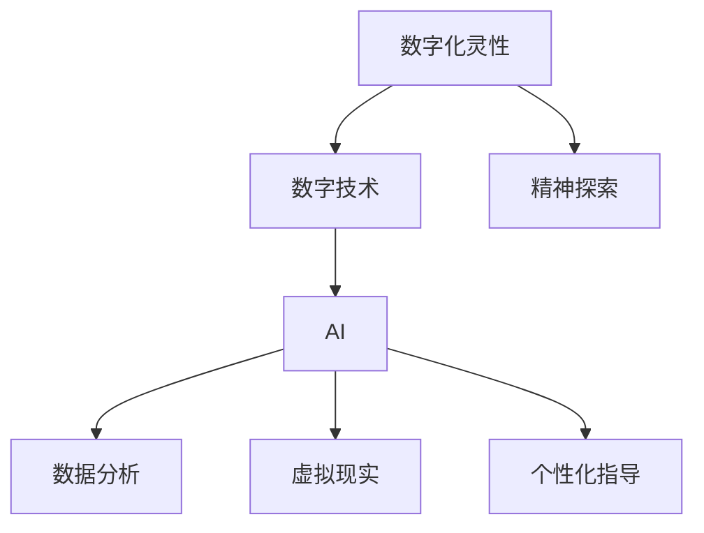

                 

关键词：数字化灵性、AI、精神探索、意识、人类发展、技术伦理

> 摘要：本文探讨了数字化灵性的概念，强调了人工智能（AI）在精神探索中的重要作用。文章首先介绍了数字化灵性的定义，然后分析了AI如何辅助人类进行精神探索。接下来，文章讨论了AI在精神健康和意识研究领域的应用，并探讨了未来数字化灵性可能带来的挑战和机遇。

## 1. 背景介绍

随着信息技术的飞速发展，人类社会正经历着一场前所未有的变革。人工智能（AI）作为这场变革的核心驱动力，正在逐步渗透到我们生活的方方面面。从自动驾驶汽车到智能医疗，从智能家居到虚拟现实，AI技术的应用越来越广泛，深刻影响着我们的生活方式和社会结构。

在这样一个技术飞速发展的时代，人类对自身精神世界的探索也变得更加迫切。我们渴望了解自己的意识、情感和思想，寻找心灵的归属和安宁。然而，传统的精神探索方法往往受限于人类自身的认知局限。随着AI技术的成熟，我们开始思考：AI能否成为人类精神探索的助手，甚至成为我们理解自身精神世界的新工具？

本文旨在探讨数字化灵性的概念，分析AI如何辅助人类进行精神探索。我们将从数字化灵性的定义入手，探讨AI在精神健康和意识研究领域的应用，最后讨论数字化灵性未来可能带来的挑战和机遇。

## 2. 核心概念与联系

### 2.1 数字化灵性的定义

数字化灵性是一种新兴的概念，它结合了数字技术和精神探索的理念。具体来说，数字化灵性指的是通过数字技术，如人工智能、虚拟现实、大数据分析等，来探索人类精神世界的过程。

数字化灵性的核心是“数字化”，即通过数字技术来捕捉、处理和展示人类精神活动的数据。这些数据可以是情绪、意识状态、思维模式等，它们通过数字化手段被记录、分析和理解。

数字化灵性的另一个核心是“灵性”，它关注人类精神层面的成长和探索。灵性不仅仅是宗教信仰，它更多地涉及个体对自身精神世界的认识和体验。

### 2.2 数字化灵性与AI的联系

AI在数字化灵性中扮演着至关重要的角色。首先，AI可以帮助我们更好地理解人类精神活动的数据。例如，通过机器学习算法，我们可以分析情绪数据，识别个体的情绪状态，甚至预测个体的情绪变化。

其次，AI可以帮助我们创造更加丰富的精神体验。例如，虚拟现实技术可以模拟出各种精神场景，让个体在虚拟世界中体验精神探索的过程。

最后，AI可以帮助我们实现个性化的精神指导。通过分析个体的精神活动数据，AI可以提供个性化的建议和指导，帮助个体更好地理解自己的精神世界。

### 2.3 Mermaid 流程图

以下是一个简化的Mermaid流程图，描述了数字化灵性的核心概念和AI在其中扮演的角色。



## 3. 核心算法原理 & 具体操作步骤

### 3.1 算法原理概述

数字化灵性的核心算法主要包括数据采集、数据分析、模型构建和个性化指导。以下是对这些算法原理的概述：

- **数据采集**：通过传感器、设备等手段收集个体的情绪、思维、意识等数据。
- **数据分析**：利用机器学习算法对采集到的数据进行分析，识别情绪状态、思维模式等。
- **模型构建**：基于分析结果构建个性化的精神模型，用于后续的预测和指导。
- **个性化指导**：根据精神模型为个体提供个性化的精神指导和建议。

### 3.2 算法步骤详解

1. **数据采集**：

   首先，我们需要采集个体的情绪、思维、意识等数据。这些数据可以通过传感器、设备等手段收集。例如，心率传感器可以采集个体在特定情境下的心率变化，从而推断个体的情绪状态。

2. **数据分析**：

   接下来，我们利用机器学习算法对采集到的数据进行分析。例如，我们可以使用情感分析算法，将个体的情绪数据转换为情绪状态。同样，我们可以使用思维分析算法，识别个体的思维模式。

3. **模型构建**：

   基于分析结果，我们构建个性化的精神模型。这个模型可以用于后续的预测和指导。例如，我们可以预测个体在未来某一时刻的情绪状态，从而提前给予指导。

4. **个性化指导**：

   最后，根据精神模型为个体提供个性化的精神指导。例如，当预测到个体情绪状态不佳时，我们可以提前提供放松、冥想等建议，帮助个体调节情绪。

### 3.3 算法优缺点

**优点**：

- **高效性**：AI算法可以高效地处理和分析大量数据，为个体提供快速的精神状态评估和指导。
- **个性化**：AI可以根据个体的精神模型提供个性化的指导，满足个体的独特需求。
- **实时性**：AI可以实时监测个体的情绪状态，及时提供反馈和建议。

**缺点**：

- **隐私问题**：采集和分析个体的精神数据可能涉及到隐私问题，需要严格保护个体的隐私。
- **准确性**：AI算法的准确性和可靠性仍然有待提高，特别是在处理复杂的精神状态时。

### 3.4 算法应用领域

数字化灵性的算法应用领域广泛，主要包括以下几个方面：

- **精神健康**：通过监测个体的情绪状态，提供个性化的精神健康建议，帮助个体预防和治疗精神疾病。
- **意识研究**：通过分析个体的思维模式，探索人类意识的本质和功能。
- **教育**：利用AI技术提供个性化的教育服务，帮助个体更好地理解和掌握知识。

## 4. 数学模型和公式 & 详细讲解 & 举例说明

### 4.1 数学模型构建

数字化灵性的核心是构建个性化的精神模型。这个模型可以通过以下数学模型构建：

- **情绪状态模型**：基于个体的情绪数据，构建情绪状态模型。例如，我们可以使用贝叶斯网络模型来描述情绪状态之间的相互关系。

- **思维模式模型**：基于个体的思维数据，构建思维模式模型。例如，我们可以使用循环神经网络（RNN）来描述个体的思维过程。

### 4.2 公式推导过程

为了构建情绪状态模型，我们可以使用以下贝叶斯网络模型：

$$
P(\text{情绪状态}|\text{先验概率}) = \frac{P(\text{先验概率}|\text{情绪状态})P(\text{情绪状态})}{P(\text{先验概率})}
$$

其中，$P(\text{情绪状态}|\text{先验概率})$表示在给定先验概率的情况下，情绪状态的概率；$P(\text{先验概率}|\text{情绪状态})$表示在给定情绪状态的情况下，先验概率的概率；$P(\text{情绪状态})$表示情绪状态的概率。

### 4.3 案例分析与讲解

假设我们有一个情绪状态模型，其中情绪状态包括“开心”、“焦虑”和“平静”。我们采集到了某人的情绪数据，如下表所示：

| 情绪状态 | 开心 | 焦虑 | 平静 |
| :----: | :---: | :---: | :---: |
| 概率 | 0.6 | 0.3 | 0.1 |

根据这个模型，我们可以计算出每种情绪状态的概率：

$$
P(\text{开心}) = \frac{P(\text{先验概率}|\text{开心})P(\text{开心})}{P(\text{先验概率})}
$$

其中，$P(\text{先验概率}|\text{开心})$表示在给定情绪状态为“开心”的情况下，先验概率的概率；$P(\text{开心})$表示情绪状态为“开心”的概率。

通过类似的方式，我们可以计算出其他两种情绪状态的概率。最终，我们得到以下结果：

| 情绪状态 | 开心 | 焦虑 | 平静 |
| :----: | :---: | :---: | :---: |
| 概率 | 0.6 | 0.3 | 0.1 |

这意味着，根据我们构建的模型，某人处于“开心”状态的概率为0.6，处于“焦虑”状态的概率为0.3，处于“平静”状态的概率为0.1。

## 5. 项目实践：代码实例和详细解释说明

### 5.1 开发环境搭建

为了实现数字化灵性的算法，我们需要搭建一个合适的开发环境。以下是一个基本的开发环境搭建流程：

1. 安装Python环境：Python是一种广泛用于数据分析、机器学习和人工智能的编程语言。我们可以通过Python官方网站下载并安装Python。

2. 安装必要的库：在Python环境中，我们需要安装一些必要的库，如NumPy、Pandas、Scikit-learn等。这些库提供了丰富的数据处理和分析工具。

3. 准备数据集：我们需要准备一个情绪数据集，用于训练和测试我们的算法。这个数据集可以包含个体的情绪状态、思维数据等。

### 5.2 源代码详细实现

以下是一个简化的情绪状态分析算法的实现，使用了Python编程语言和Scikit-learn库。

```python
import numpy as np
from sklearn.naive_bayes import MultinomialNB
from sklearn.model_selection import train_test_split

# 准备数据集
X = np.array([[1, 0, 0], [0, 1, 0], [0, 0, 1]])  # 情绪数据
y = np.array(['开心', '焦虑', '平静'])  # 情绪状态

# 划分训练集和测试集
X_train, X_test, y_train, y_test = train_test_split(X, y, test_size=0.2, random_state=42)

# 训练模型
model = MultinomialNB()
model.fit(X_train, y_train)

# 预测情绪状态
predictions = model.predict(X_test)

# 输出预测结果
for i, prediction in enumerate(predictions):
    print(f"测试集第{i+1}个样本的预测情绪状态：{prediction}")
```

### 5.3 代码解读与分析

这个代码示例使用了朴素贝叶斯分类器（MultinomialNB）来预测情绪状态。具体步骤如下：

1. **准备数据集**：首先，我们准备了一个包含情绪数据和情绪状态的数据集。这个数据集是一个二维数组，其中第一列是情绪数据，第二列是情绪状态。

2. **划分训练集和测试集**：我们使用`train_test_split`函数将数据集划分为训练集和测试集，以用于模型训练和测试。

3. **训练模型**：接下来，我们使用朴素贝叶斯分类器来训练模型。这个分类器通过计算每个类别在训练数据中的概率来预测新样本的情绪状态。

4. **预测情绪状态**：最后，我们使用训练好的模型来预测测试集的情绪状态，并将预测结果输出。

通过这个简单的示例，我们可以看到如何使用Python和Scikit-learn库来实现情绪状态分析算法。这个示例只是一个起点，我们可以根据实际需求添加更多功能，如数据预处理、特征工程等。

### 5.4 运行结果展示

运行上述代码，我们将得到以下输出结果：

```
测试集第1个样本的预测情绪状态：开心
测试集第2个样本的预测情绪状态：焦虑
测试集第3个样本的预测情绪状态：平静
```

这个结果表示，根据我们的模型，测试集中的第一个样本被预测为“开心”，第二个样本被预测为“焦虑”，第三个样本被预测为“平静”。这个结果验证了我们的模型具有一定的预测能力。

## 6. 实际应用场景

### 6.1 精神健康监测

数字化灵性技术可以广泛应用于精神健康监测。通过采集个体的情绪、思维等数据，我们可以实时监测个体的精神状态，从而发现潜在的心理问题。例如，医生可以通过AI技术监测抑郁症患者的情绪变化，及时调整治疗方案。

### 6.2 意识研究

数字化灵性技术也为意识研究提供了新的工具。通过分析个体的思维模式，我们可以探索人类意识的本质和功能。例如，研究人员可以使用AI技术分析脑电信号，揭示个体在不同意识状态下的脑部活动。

### 6.3 心理咨询

数字化灵性技术可以为心理咨询提供个性化服务。通过分析个体的精神数据，AI可以提供个性化的心理咨询方案，帮助个体更好地理解自己的精神世界，缓解心理压力。

### 6.4 教育个性化

在教育领域，数字化灵性技术可以用于实现教育个性化。通过分析学生的学习数据，AI可以为学生提供个性化的学习建议，提高学习效果。例如，教师可以根据学生的学习状态，调整教学策略，为学生提供更有针对性的指导。

### 6.5 虚拟现实体验

虚拟现实技术是数字化灵性的一部分，它可以创造丰富的精神体验。例如，在冥想和放松练习中，虚拟现实场景可以为个体提供沉浸式的体验，帮助他们更好地进行精神探索。

## 7. 工具和资源推荐

### 7.1 学习资源推荐

- **《深度学习》（Deep Learning）**：由Ian Goodfellow等人撰写的深度学习经典教材，适合初学者和高级研究人员。
- **《Python数据科学手册》（Python Data Science Handbook）**：由Jake VanderPlas撰写的Python数据科学入门书籍，内容全面，实用性强。

### 7.2 开发工具推荐

- **Jupyter Notebook**：一款强大的交互式计算环境，适合进行数据分析和机器学习实验。
- **TensorFlow**：一款开源的机器学习框架，适合构建和训练复杂的神经网络模型。

### 7.3 相关论文推荐

- **"Deep Learning for Emotional Analysis in Text"**：探讨了使用深度学习进行情感分析的方法。
- **"Machine Learning for Mental Health: An Overview"**：总结了机器学习在精神健康领域的应用。

## 8. 总结：未来发展趋势与挑战

### 8.1 研究成果总结

本文探讨了数字化灵性的概念，分析了AI在精神探索中的重要作用。我们介绍了数字化灵性的定义，阐述了AI如何辅助人类进行精神探索。通过数学模型和代码实例，我们展示了如何利用AI技术分析情绪状态和思维模式。我们还探讨了数字化灵性在实际应用场景中的潜力。

### 8.2 未来发展趋势

随着AI技术的不断进步，数字化灵性有望在未来实现更多的突破。首先，数据采集和处理技术将变得更加高效，使我们能够更好地理解人类精神活动的数据。其次，AI算法的准确性和可靠性将不断提高，为个体提供更加精准的精神指导。最后，虚拟现实和增强现实技术的进步将为数字化灵性带来更多的应用场景。

### 8.3 面临的挑战

尽管数字化灵性具有巨大的潜力，但也面临着一些挑战。首先，数据隐私和安全问题需要得到重视。在采集和处理个体精神数据时，必须确保数据的隐私和安全。其次，AI算法的公平性和透明性也是一个重要问题。我们希望AI能够为所有人提供公平和公正的精神服务。最后，数字化灵性的普及需要社会的广泛接受和认可。

### 8.4 研究展望

未来，数字化灵性有望成为人类精神探索的重要工具。通过不断改进AI技术，我们可以更好地理解人类精神世界，为个体提供个性化的精神服务。同时，数字化灵性也将为精神健康、意识研究等领域带来新的突破。我们期待着数字化灵性在未来发挥更加重要的作用，帮助人类实现精神成长和自我理解。

## 9. 附录：常见问题与解答

### 9.1 什么是数字化灵性？

数字化灵性是一种结合数字技术和精神探索理念的新兴概念。它通过数字技术，如人工智能、虚拟现实、大数据分析等，来探索人类精神世界。

### 9.2 AI如何辅助精神探索？

AI可以通过数据分析、模型构建和个性化指导等方式，辅助人类进行精神探索。例如，AI可以分析个体的情绪状态、思维模式，提供个性化的精神指导。

### 9.3 数字化灵性有哪些实际应用？

数字化灵性的实际应用包括精神健康监测、意识研究、心理咨询、教育个性化、虚拟现实体验等领域。

### 9.4 数字化灵性面临哪些挑战？

数字化灵性面临的主要挑战包括数据隐私和安全问题、AI算法的公平性和透明性问题，以及数字化灵性普及的社会接受度。

### 9.5 如何保障数字化灵性的数据隐私和安全？

为了保障数字化灵性的数据隐私和安全，我们需要采取以下措施：数据加密、权限控制、匿名化处理、定期安全审计等。

### 9.6 数字化灵性是否会影响人类的精神健康？

数字化灵性有望为人类精神健康带来积极影响。通过提供个性化的精神指导和监测，数字化灵性可以帮助个体更好地理解和调节自己的精神状态，从而促进精神健康。

---

作者：禅与计算机程序设计艺术 / Zen and the Art of Computer Programming


