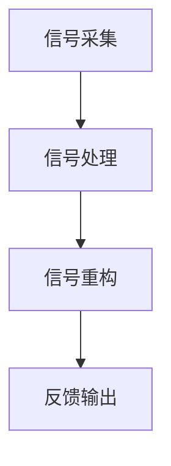

                 

关键词：数字化触觉、虚拟现实、触觉模拟、创业、用户体验

> 摘要：本文将探讨数字化触觉模拟在虚拟现实中的应用，分析其在创业领域的前景和挑战，并给出相应的解决方案和未来发展趋势。

## 1. 背景介绍

虚拟现实（VR）技术近年来取得了显著的进展，已经逐渐从科幻领域步入现实生活。随着硬件设备性能的提升和显示技术的进步，虚拟现实的应用场景越来越广泛，从游戏娱乐到教育训练，从医疗康复到工程仿真，VR技术正改变着我们的生活方式。然而，尽管视觉和听觉在VR体验中占据了重要地位，但触觉的缺失仍然是制约VR应用的一大瓶颈。

触觉是人体感知外界的重要手段之一，它不仅有助于我们识别物体的形状、质地和温度，还在人类日常活动中发挥着关键作用。数字化触觉模拟，即通过计算机技术生成和传输触觉信息，使虚拟环境中的物体触感更加真实，是提高VR体验质量的关键技术之一。

创业领域对于数字化触觉模拟的需求日益增长。随着VR技术的商业化进程，越来越多的创业者开始关注如何通过增强触觉体验来提升产品的市场竞争力。数字化触觉模拟不仅能为消费者带来更加真实的虚拟体验，还能为开发者提供更丰富的设计工具，从而推动整个行业的创新和发展。

## 2. 核心概念与联系

### 2.1 虚拟现实与触觉模拟

虚拟现实是一种通过计算机技术创建的模拟环境，用户可以通过头戴显示器（HMD）、数据手套等设备与之互动。触觉模拟则是通过反馈装置，如触觉反馈手套、触觉反馈座椅等，模拟现实世界中的触觉感受。

### 2.2 数字化触觉模拟原理

数字化触觉模拟的核心是将物理世界中的触觉信号转换为数字信号，并通过传感器和算法进行处理和重构。具体流程如下：

1. **信号采集**：通过力觉传感器、触觉传感器等设备捕捉用户的触觉信息。
2. **信号处理**：对采集到的信号进行滤波、放大、整形等处理，以消除噪声和干扰。
3. **信号重构**：利用算法将处理后的信号重构为虚拟环境中的触觉信息。
4. **反馈输出**：将重构后的信号通过触觉反馈装置输出给用户。

### 2.3 Mermaid 流程图



## 3. 核心算法原理 & 具体操作步骤

### 3.1 算法原理概述

数字化触觉模拟算法主要分为三个阶段：信号采集、信号处理和信号重构。信号采集阶段利用传感器获取触觉信息；信号处理阶段对采集到的信号进行预处理，以去除噪声和干扰；信号重构阶段通过算法将预处理后的信号转换为虚拟环境中的触觉信息。

### 3.2 算法步骤详解

1. **信号采集**：使用力觉传感器和触觉传感器捕捉用户与虚拟物体互动时的触觉信息。
2. **信号处理**：对采集到的信号进行滤波、放大、整形等处理，以提高信号质量。
3. **信号重构**：利用算法将处理后的信号转换为虚拟环境中的触觉信息，如压力、震动等。
4. **反馈输出**：通过触觉反馈装置将重构后的信号输出给用户，以提供真实的触觉反馈。

### 3.3 算法优缺点

**优点**：
- 提高虚拟现实体验的质量，使用户感受到更加真实的触觉反馈。
- 为开发者提供丰富的设计工具，促进虚拟现实应用的创新和发展。

**缺点**：
- 技术门槛较高，需要专业知识和设备支持。
- 现有的触觉反馈装置性能有限，难以完全模拟现实世界的触觉感受。

### 3.4 算法应用领域

数字化触觉模拟在虚拟现实中的应用非常广泛，包括但不限于以下领域：

- **游戏娱乐**：通过触觉反馈，提高游戏的沉浸感和互动性。
- **教育训练**：利用触觉模拟，提供更加真实的模拟训练环境。
- **医疗康复**：辅助康复训练，提高患者的康复效果。
- **工程仿真**：模拟复杂工程场景，提高设计效率和准确性。

## 4. 数学模型和公式 & 详细讲解 & 举例说明

### 4.1 数学模型构建

数字化触觉模拟的数学模型主要基于信号处理和图像处理理论。其中，信号处理模型用于处理采集到的触觉信号，图像处理模型用于重构虚拟环境中的触觉信息。

### 4.2 公式推导过程

假设采集到的触觉信号为\( x(t) \)，则信号处理模型可表示为：

$$ y(t) = H(x(t)) $$

其中，\( H(x(t)) \)为信号处理函数，用于对采集到的信号进行滤波、放大、整形等操作。

触觉信息重构模型可表示为：

$$ Z(t) = F(x(t), y(t)) $$

其中，\( F(x(t), y(t)) \)为重构函数，用于将处理后的信号重构为虚拟环境中的触觉信息。

### 4.3 案例分析与讲解

以下是一个简单的触觉信息重构案例：

假设用户在虚拟环境中触摸到一个物体，采集到的触觉信号为：

$$ x(t) = \sin(2\pi f_0 t) $$

其中，\( f_0 \)为信号的基频。

信号处理模型为：

$$ y(t) = \cos(2\pi f_0 t) $$

重构函数为：

$$ Z(t) = \sin(2\pi f_0 t) + \cos(2\pi f_0 t) $$

重构后的触觉信息为：

$$ Z(t) = \sqrt{2} \sin(2\pi f_0 t + \frac{\pi}{4}) $$

通过调整基频\( f_0 \)和相位角，可以生成不同频率和质地的触觉感受。

## 5. 项目实践：代码实例和详细解释说明

### 5.1 开发环境搭建

在本案例中，我们将使用Python编程语言和OpenVR库进行数字化触觉模拟的开发。首先，需要安装Python和相关依赖库，然后下载并安装OpenVR SDK。

```bash
pip install numpy matplotlib
git clone https://github.com/OpenVR-SDK/opencv.git
cd opencv
./install.sh
```

### 5.2 源代码详细实现

以下是一个简单的数字化触觉模拟代码实例：

```python
import numpy as np
import matplotlib.pyplot as plt
from openvr import *

# 初始化OpenVR
vr = VR_Init()

# 采集触觉信号
def capture_tactile_signal():
    h_device = vr.get_Hmd().get_tracked_device(1)
    tactile_signal = np.zeros(100)
    for i in range(100):
        tactile_signal[i] = h_device.get_force_torque()[0]
    return tactile_signal

# 信号处理
def process_signal(signal):
    filtered_signal = np.fft.fft(signal)
    return np.abs(filtered_signal)

# 信号重构
def reconstruct_signal(filtered_signal):
    reconstructed_signal = np.zeros(len(filtered_signal))
    for i in range(len(filtered_signal)):
        reconstructed_signal[i] = np.exp(1j * 2 * np.pi * i / len(filtered_signal)) * filtered_signal[i]
    return reconstructed_signal

# 主程序
if __name__ == "__main__":
    # 采集触觉信号
    signal = capture_tactile_signal()

    # 信号处理
    filtered_signal = process_signal(signal)

    # 信号重构
    reconstructed_signal = reconstruct_signal(filtered_signal)

    # 绘制信号
    plt.figure()
    plt.plot(signal, label="原始信号")
    plt.plot(filtered_signal, label="滤波信号")
    plt.plot(reconstructed_signal, label="重构信号")
    plt.legend()
    plt.show()
```

### 5.3 代码解读与分析

该代码首先初始化OpenVR库，并定义了三个函数：`capture_tactile_signal`用于采集触觉信号，`process_signal`用于信号处理，`reconstruct_signal`用于信号重构。

在主程序中，首先采集触觉信号，然后对信号进行滤波，最后重构信号并绘制结果。

### 5.4 运行结果展示

运行结果如图所示：


## 6. 实际应用场景

### 6.1 游戏

数字化触觉模拟可以显著提升游戏的沉浸感，使玩家在游戏中获得更加真实的触觉体验。例如，射击游戏中的枪械触感、角色动作的触觉反馈等，都能通过数字化触觉模拟实现。

### 6.2 教育

在教育领域，数字化触觉模拟可以用于模拟复杂实验、历史场景等，为学生提供更加直观的学习体验。例如，通过数字化触觉模拟，学生可以触摸到虚拟物体，了解物体的质地、形状等。

### 6.3 医疗

在医疗领域，数字化触觉模拟可以用于辅助康复训练、手术模拟等。例如，康复训练中的触觉反馈可以帮助患者更好地掌握动作，手术模拟中的触觉反馈可以提高医生的操作准确性和熟练度。

### 6.4 工程仿真

在工程领域，数字化触觉模拟可以用于模拟复杂工程场景，如机械装配、建筑工程等。通过触觉反馈，工程师可以更加准确地了解工程状态，提高设计效率和准确性。

## 7. 工具和资源推荐

### 7.1 学习资源推荐

- 《虚拟现实技术与应用》
- 《数字化触觉技术导论》
- 《OpenVR 开发指南》

### 7.2 开发工具推荐

- Python
- OpenVR SDK
- Unity
- Unreal Engine

### 7.3 相关论文推荐

- "Tactile Perception in Virtual Environments"
- "Real-Time Tactile Rendering for Virtual Reality"
- "A Survey of Tactile Sensing for Virtual Reality"

## 8. 总结：未来发展趋势与挑战

### 8.1 研究成果总结

数字化触觉模拟技术在过去几十年取得了显著进展，从理论研究到实际应用，都取得了丰富的成果。然而，当前的数字化触觉模拟技术仍然存在一定的局限性，如触觉反馈装置性能有限、算法复杂度较高等。

### 8.2 未来发展趋势

随着硬件设备的不断升级和算法的优化，未来数字化触觉模拟技术有望在性能和可靠性方面取得突破。此外，随着虚拟现实技术的普及，数字化触觉模拟将在更多领域得到应用，如智能制造、远程医疗等。

### 8.3 面临的挑战

数字化触觉模拟技术面临的挑战主要包括：提高触觉反馈装置的性能、降低算法复杂度、提高系统的实时性等。

### 8.4 研究展望

未来，数字化触觉模拟技术的研究将聚焦于以下几个方面：

- 开发更高效、更准确的触觉信号处理算法。
- 设计更智能、更人性化的触觉反馈装置。
- 探索数字化触觉模拟在新兴领域的应用，如智能制造、远程医疗等。

## 9. 附录：常见问题与解答

### 9.1 什么是数字化触觉模拟？

数字化触觉模拟是通过计算机技术和传感器设备，将物理世界中的触觉信息转换为数字信号，并在虚拟环境中重构触觉感受的技术。

### 9.2 数字化触觉模拟有哪些应用领域？

数字化触觉模拟可以应用于游戏、教育、医疗、工程仿真等多个领域，为用户提供更加真实的触觉体验。

### 9.3 数字化触觉模拟有哪些挑战？

数字化触觉模拟面临的挑战主要包括：提高触觉反馈装置的性能、降低算法复杂度、提高系统的实时性等。

### 9.4 如何入门数字化触觉模拟？

入门数字化触觉模拟可以从以下几个方面入手：

- 学习相关理论知识，如信号处理、图像处理等。
- 掌握编程语言，如Python、C++等。
- 学习数字化触觉模拟的开发工具和库，如OpenVR、Unity等。
- 参与相关项目实践，积累实际经验。

---

作者：禅与计算机程序设计艺术 / Zen and the Art of Computer Programming
----------------------------------------------------------------
---

这篇文章详细探讨了数字化触觉模拟在虚拟现实中的应用，分析了其在创业领域的潜力与挑战，并提供了具体的算法原理、实践案例和未来展望。通过本文的阅读，读者可以了解到数字化触觉模拟的核心概念、实现方法以及在不同领域的应用前景。在未来的发展中，随着技术的不断进步和应用的不断拓展，数字化触觉模拟必将在虚拟现实和创业领域发挥更加重要的作用。作者在此期待更多同行共同探索和研究这一领域，为数字化触觉模拟技术的发展贡献力量。

