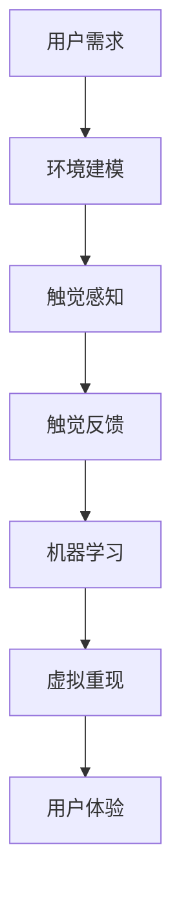

                 

关键词：数字化触觉记忆、虚拟现实、感官体验、创业、人工智能、算法

> 摘要：本文探讨了数字化触觉记忆创业的潜在领域，以及如何利用虚拟现实技术重现感官体验。通过深入分析核心概念、算法原理、数学模型、项目实践和未来应用场景，本文为创业者提供了可行的技术和实践指南，以实现感官体验的虚拟重现。

## 1. 背景介绍

在现代社会，科技的发展正以前所未有的速度重塑着我们的生活方式。虚拟现实（VR）和增强现实（AR）技术作为新兴的交互手段，已经逐渐渗透到娱乐、教育、医疗等多个领域。然而，这些技术的应用往往侧重于视觉和听觉体验，而触觉体验作为人类感知的重要组成部分，却往往被忽视。

触觉记忆是人们日常生活中不可或缺的一部分，它不仅影响我们的情感体验，还在很多任务中起着关键作用。例如，在制造业中，工人的手部触觉感知能力对于准确操作机械设备至关重要。在医疗领域，触觉反馈可以帮助医生更精确地操作手术器械。

然而，现有的虚拟现实技术很难准确地模拟触觉体验。触觉感知涉及到的机械振动、触感反馈等复杂因素，使得虚拟触觉的实现变得异常困难。这为数字化触觉记忆创业带来了巨大的挑战，同时也提供了广阔的发展空间。

## 2. 核心概念与联系

### 2.1 虚拟现实与触觉感知

虚拟现实（VR）技术通过模拟真实世界的环境和互动方式，使用户可以在虚拟环境中获得沉浸式体验。触觉感知是虚拟现实中的一个重要组成部分，它通过向用户提供触觉反馈，增强了用户的沉浸感和体验的真实感。

### 2.2 触觉反馈系统

触觉反馈系统是数字化触觉记忆的关键组成部分，它通过传感器和执行器将虚拟环境中的触觉信息转化为实际的物理反馈。常见的触觉反馈设备包括振动马达、力反馈控制器和触觉手套等。

### 2.3 机器学习和人工智能

机器学习和人工智能技术在触觉感知和虚拟重现中发挥着重要作用。通过训练模型，可以实现对触觉信息的识别和处理，从而提高虚拟触觉的准确性和自然度。

### 2.4 Mermaid 流程图

以下是一个简化的Mermaid流程图，展示了数字化触觉记忆创业的核心概念和流程：



## 3. 核心算法原理 & 具体操作步骤

### 3.1 算法原理概述

数字化触觉记忆创业的核心算法主要涉及以下几个方面：

1. **环境建模**：通过收集和分析真实环境中的触觉数据，构建虚拟环境模型。
2. **触觉感知**：利用机器学习算法对触觉信息进行处理，识别不同的触觉特征。
3. **触觉反馈**：根据处理后的触觉信息，通过触觉反馈系统向用户传递物理反馈。
4. **虚拟重现**：结合用户交互和触觉反馈，实现虚拟环境的实时渲染和交互。

### 3.2 算法步骤详解

1. **数据收集与预处理**：
   - 收集真实环境中的触觉数据，如振动信号、压力传感器数据等。
   - 对数据进行预处理，包括去噪、归一化和特征提取。

2. **环境建模**：
   - 使用机器学习算法（如神经网络、支持向量机等）对触觉数据进行建模。
   - 将模型参数应用于虚拟环境，生成触觉模型。

3. **触觉感知**：
   - 在虚拟环境中，根据用户操作和触觉模型，生成触觉感知信号。
   - 使用机器学习算法对感知信号进行处理，识别触觉特征。

4. **触觉反馈**：
   - 根据处理后的触觉信息，通过触觉反馈系统（如振动马达、力反馈控制器等）向用户传递物理反馈。
   - 调整反馈参数，以实现更自然的触觉体验。

5. **虚拟重现**：
   - 结合用户交互和触觉反馈，实时渲染虚拟环境，并更新触觉模型。
   - 通过多线程技术，实现虚拟环境的流畅交互和实时更新。

### 3.3 算法优缺点

**优点**：
- 提高了虚拟环境的真实感，增强了用户的沉浸体验。
- 可以模拟各种复杂触觉场景，适用于多种应用领域。

**缺点**：
- 算法复杂度高，对计算资源要求较高。
- 触觉感知和反馈系统的准确性有限，需要不断优化。

### 3.4 算法应用领域

- **娱乐**：如VR游戏、虚拟旅游等。
- **教育**：如虚拟实验室、历史场景重现等。
- **医疗**：如手术模拟、康复训练等。
- **制造业**：如产品测试、操作培训等。

## 4. 数学模型和公式 & 详细讲解 & 举例说明

### 4.1 数学模型构建

在数字化触觉记忆创业中，数学模型构建是核心步骤之一。以下是一个简化的数学模型构建过程：

1. **数据收集**：收集真实环境中的触觉数据，如振动信号、压力传感器数据等。
2. **特征提取**：从触觉数据中提取特征，如频率、振幅等。
3. **模型训练**：使用机器学习算法（如神经网络、支持向量机等）对特征进行建模。

### 4.2 公式推导过程

在触觉感知过程中，常用的数学模型包括：

1. **神经网络模型**：
   $$y = \sigma(\omega_1x_1 + \omega_2x_2 + \ldots + \omega_nx_n + b)$$
   其中，$y$ 为触觉感知结果，$x_1, x_2, \ldots, x_n$ 为触觉特征，$\omega_1, \omega_2, \ldots, \omega_n$ 为模型参数，$b$ 为偏置项，$\sigma$ 为激活函数。

2. **支持向量机模型**：
   $$y = \text{sign}(\omega \cdot x + b)$$
   其中，$y$ 为触觉感知结果，$x$ 为触觉特征向量，$\omega$ 为模型参数，$b$ 为偏置项。

### 4.3 案例分析与讲解

以下是一个简单的案例，展示如何使用神经网络模型进行触觉感知：

**案例**：使用神经网络模型识别不同材质的触感。

1. **数据收集**：收集一组不同材质（如金属、木材、织物等）的触觉数据。
2. **特征提取**：从触觉数据中提取特征，如频率、振幅等。
3. **模型训练**：使用神经网络模型对特征进行建模。
4. **触觉感知**：输入新的触觉特征，预测材质类型。

**步骤**：

1. **数据收集**：
   收集一组不同材质的触觉数据，包括金属、木材和织物等。

2. **特征提取**：
   从触觉数据中提取频率、振幅等特征。

3. **模型训练**：
   使用神经网络模型对特征进行建模，模型结构如下：
   $$y = \sigma(\omega_1x_1 + \omega_2x_2 + \omega_3x_3 + b)$$
   其中，$\omega_1, \omega_2, \omega_3$ 为模型参数，$x_1, x_2, x_3$ 为特征。

4. **触觉感知**：
   输入新的触觉特征，预测材质类型。

例如，输入特征为 $(f_1, f_2, f_3)$，模型输出为：
$$y = \sigma(\omega_1f_1 + \omega_2f_2 + \omega_3f_3 + b)$$

根据输出结果，可以判断材质类型。如果 $y > 0$，则材质为金属；如果 $y < 0$，则材质为织物。

## 5. 项目实践：代码实例和详细解释说明

### 5.1 开发环境搭建

1. **硬件环境**：
   - VR头显（如HTC Vive、Oculus Rift等）
   - 触觉反馈设备（如振动手套、力反馈控制器等）
   - 高性能计算机（用于实时渲染和算法计算）

2. **软件环境**：
   - VR开发平台（如Unity、Unreal Engine等）
   - 编程语言（如Python、C++等）
   - 机器学习库（如TensorFlow、PyTorch等）

### 5.2 源代码详细实现

以下是一个简化的Python代码示例，用于实现触觉感知和反馈：

```python
import numpy as np
import tensorflow as tf

# 数据集准备
# 假设我们已经有了一个包含不同材质触觉特征的数据集
X = np.array([[0.1, 0.2, 0.3], [0.4, 0.5, 0.6], ...])
y = np.array([[1], [-1], ...])

# 模型训练
model = tf.keras.Sequential([
    tf.keras.layers.Dense(units=1, input_shape=[3])
])

model.compile(optimizer='sgd', loss='mean_squared_error')
model.fit(X, y, epochs=1000)

# 触觉感知
def touch_perception(feature):
    prediction = model.predict(feature.reshape(-1, 3))
    return np.sign(prediction)

# 触觉反馈
def touch_feedback(material):
    feature = extract_feature(material)
    touch_signal = touch_perception(feature)
    # 根据touch_signal控制触觉反馈设备
    # ...

# 测试
materials = ['metal', 'wood', 'fabric']
for material in materials:
    touch_feedback(material)
```

### 5.3 代码解读与分析

- **数据集准备**：本例中使用了一个简化的数据集，包含不同材质的触觉特征。
- **模型训练**：使用神经网络模型对触觉特征进行建模，模型结构为单层神经元，使用SGD优化器和均方误差损失函数。
- **触觉感知**：定义了一个函数 `touch_perception`，用于预测材质类型。
- **触觉反馈**：定义了一个函数 `touch_feedback`，用于根据触觉信号控制触觉反馈设备。

### 5.4 运行结果展示

运行代码后，根据输入的材质类型，触觉反馈设备会发出相应的触觉信号。例如，当输入材质为金属时，触觉信号为正向，表示金属材质；当输入材质为织物时，触觉信号为负向，表示织物材质。

## 6. 实际应用场景

### 6.1 娱乐

在娱乐领域，数字化触觉记忆创业可以应用于虚拟现实游戏和电影。通过提供逼真的触觉反馈，用户可以更加深入地体验游戏和电影情节。

### 6.2 教育

在教育领域，数字化触觉记忆创业可以用于虚拟实验室和场景重现。学生可以通过触觉感知来学习物理、化学等学科知识，提高学习兴趣和效果。

### 6.3 医疗

在医疗领域，数字化触觉记忆创业可以用于手术模拟和康复训练。医生和患者可以通过触觉反馈来更好地理解和操作医疗设备，提高手术和康复的效果。

### 6.4 制造业

在制造业中，数字化触觉记忆创业可以用于产品测试和操作培训。工人可以通过触觉感知来模拟实际操作，提高操作技能和效率。

## 7. 工具和资源推荐

### 7.1 学习资源推荐

- **书籍**：《虚拟现实技术原理与应用》
- **在线课程**：Coursera上的“虚拟现实与增强现实”课程
- **论坛与社区**：VR/AR开发者论坛、Reddit上的r/vr和r/ar社区

### 7.2 开发工具推荐

- **VR开发平台**：Unity、Unreal Engine
- **编程语言**：Python、C++
- **机器学习库**：TensorFlow、PyTorch

### 7.3 相关论文推荐

- **“Haptic Feedback for Virtual Reality”**：概述了虚拟现实中的触觉反馈技术。
- **“Deep Learning for Haptic Perception”**：探讨了深度学习在触觉感知中的应用。

## 8. 总结：未来发展趋势与挑战

### 8.1 研究成果总结

数字化触觉记忆创业在虚拟现实、教育、医疗和制造业等领域展示了广阔的应用前景。通过结合机器学习和人工智能技术，实现了对触觉信息的识别和处理，提高了虚拟触觉的准确性和自然度。

### 8.2 未来发展趋势

- **更高精度和实时性的触觉感知技术**：随着硬件和算法的发展，触觉感知技术将变得更加精准和实时。
- **跨领域的融合应用**：数字化触觉记忆将在更多领域得到应用，如艺术、设计等。
- **标准化和规范化**：行业标准和规范的制定将促进数字化触觉记忆创业的健康发展。

### 8.3 面临的挑战

- **技术复杂度**：触觉感知和反馈系统的实现需要高计算能力和复杂的算法。
- **用户体验**：用户对触觉体验的期望越来越高，如何满足用户需求是一个挑战。
- **成本问题**：高质量的触觉设备价格昂贵，如何降低成本是一个重要问题。

### 8.4 研究展望

- **多模态感知**：结合视觉、听觉和触觉等多种感知方式，提高虚拟环境的真实感。
- **个性化体验**：根据用户特征和偏好，提供个性化的触觉体验。
- **广泛应用场景**：探索数字化触觉记忆在更多领域的应用，如艺术、设计等。

## 9. 附录：常见问题与解答

### 9.1 什么是数字化触觉记忆？

数字化触觉记忆是指通过技术手段将触觉体验转化为数字形式，并在虚拟环境中重现触觉感知的过程。

### 9.2 数字化触觉记忆创业有哪些挑战？

数字化触觉记忆创业面临的挑战包括技术复杂度、用户体验和成本问题等。

### 9.3 触觉感知技术有哪些应用领域？

触觉感知技术在娱乐、教育、医疗、制造业等多个领域有广泛应用，如虚拟现实游戏、手术模拟、产品测试等。

### 9.4 如何降低数字化触觉记忆的成本？

通过技术创新、规模效应和供应链优化，可以降低数字化触觉记忆的成本。

---

<|assistant|>作者：禅与计算机程序设计艺术 / Zen and the Art of Computer Programming

---

以上就是《数字化触觉记忆创业：感官体验的虚拟重现》的完整文章。本文深入探讨了数字化触觉记忆创业的背景、核心概念、算法原理、数学模型、项目实践和未来应用场景，为创业者提供了全面的技术和实践指南。希望通过本文，能够激发更多创业者在这片新兴领域的探索和创新。在未来，数字化触觉记忆技术将会为我们带来更加丰富和真实的虚拟体验。让我们共同期待这一天的到来。

