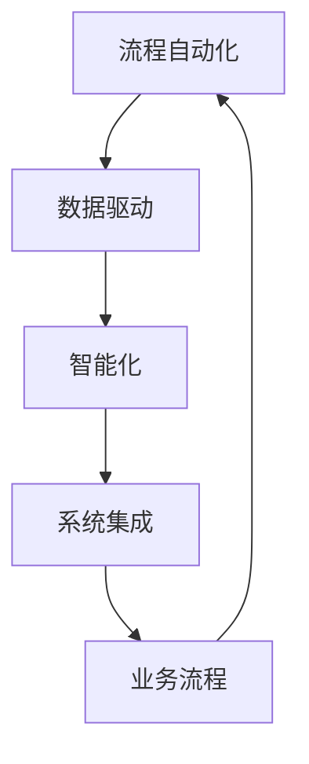

                 

关键词：数字实体自动化，人工智能，流程优化，自动化流程，流程自动化技术，自动化工具，流程引擎，企业应用，数字化转型，工业自动化。

> 摘要：本文探讨了数字实体自动化的概念、技术原理、应用场景以及未来前景。通过阐述自动化流程在各个领域的应用实例，分析了数字实体自动化的优势与挑战，并提出了未来的发展方向。

## 1. 背景介绍

随着信息技术的飞速发展，自动化已经成为现代社会不可或缺的一部分。从早期的工业自动化，到现代的数字化、智能化转型，自动化技术不断推动着各行各业的发展。然而，传统的自动化技术主要针对的是物理实体和机械过程，随着人工智能、大数据等新兴技术的应用，数字实体自动化逐渐成为可能。

数字实体自动化指的是通过软件程序、算法和人工智能技术，对数字信息进行自动化处理、分析和决策，从而实现业务流程的自动化和智能化。这种技术不仅可以提高工作效率，降低运营成本，还可以帮助企业实现数字化转型，提升竞争力。

## 2. 核心概念与联系

### 2.1 核心概念

数字实体自动化的核心概念包括：

- **流程自动化**：将业务流程中的各个环节通过软件进行自动化处理，减少人工干预。
- **数据驱动**：利用大数据分析和人工智能算法，对流程中的数据进行实时处理和分析，以优化决策。
- **智能化**：通过引入人工智能技术，实现自动化流程的自主学习和优化。
- **系统集成**：将不同的业务系统和工具进行集成，实现数据共享和流程协同。

### 2.2 联系与架构

以下是一个简单的 Mermaid 流程图，展示了数字实体自动化中的核心概念及其联系：



## 3. 核心算法原理 & 具体操作步骤

### 3.1 算法原理概述

数字实体自动化的核心算法主要涉及以下几个方面：

- **流程建模**：利用业务流程建模工具，将业务流程转化为软件模型。
- **流程引擎**：执行自动化流程的引擎，根据模型驱动流程的执行。
- **数据分析和决策**：利用大数据分析和机器学习算法，对流程中的数据进行分析和决策。
- **反馈和优化**：根据执行结果和反馈，对流程进行优化和调整。

### 3.2 算法步骤详解

1. **需求分析**：明确业务流程的需求，确定自动化目标和范围。
2. **流程建模**：使用流程建模工具，将业务流程转化为软件模型。
3. **模型验证**：对模型进行验证，确保模型能够正确地反映业务流程。
4. **流程执行**：使用流程引擎执行自动化流程。
5. **数据分析和决策**：实时分析流程中的数据，根据分析结果进行决策。
6. **反馈和优化**：根据执行结果和反馈，对流程进行优化和调整。

### 3.3 算法优缺点

**优点**：

- 提高工作效率：自动化流程可以减少人工干预，提高工作效率。
- 降低运营成本：减少人力成本，降低运营成本。
- 提升决策质量：通过数据分析和机器学习，提升决策质量。
- 提高企业竞争力：实现数字化转型，提升企业竞争力。

**缺点**：

- 需要较高的技术门槛：自动化流程需要专业的技术团队进行开发和维护。
- 初始投入较大：需要投入一定的资金和人力进行流程建模和算法开发。
- 需要数据支持：自动化流程依赖于大量的数据支持，数据质量直接影响算法效果。

### 3.4 算法应用领域

数字实体自动化在各个领域都有广泛的应用，以下是一些典型的应用场景：

- **制造业**：生产计划排程、质量控制、设备维护等。
- **服务业**：客户服务、订单处理、财务管理等。
- **金融业**：风险评估、信用评分、交易执行等。
- **物流行业**：物流调度、库存管理、路线规划等。

## 4. 数学模型和公式 & 详细讲解 & 举例说明

### 4.1 数学模型构建

数字实体自动化的数学模型主要包括以下几个方面：

- **业务流程模型**：使用 Petri 网等数学工具，构建业务流程的数学模型。
- **数据模型**：使用数据仓库和数据挖掘等技术，构建数据的数学模型。
- **决策模型**：使用机器学习算法，构建决策的数学模型。

### 4.2 公式推导过程

以下是一个简单的业务流程模型的推导过程：

$$
P = \sum_{i=1}^{n} (1 - F_i)
$$

其中，$P$ 表示业务流程的完成概率，$F_i$ 表示第 $i$ 个流程步骤的失败概率。

### 4.3 案例分析与讲解

假设一个制造业企业需要自动化其生产计划排程，我们可以使用以下公式进行建模：

$$
P_{schedule} = \sum_{i=1}^{n} (1 - F_i)
$$

其中，$P_{schedule}$ 表示生产计划排程的完成概率，$F_i$ 表示第 $i$ 个生产计划步骤的失败概率。

通过数据分析和机器学习算法，我们可以预测每个生产计划步骤的失败概率，并根据这些数据对生产计划排程进行优化。

## 5. 项目实践：代码实例和详细解释说明

### 5.1 开发环境搭建

在本节中，我们将使用 Python 和 OpenCV 库来实现一个简单的图像处理自动化流程。首先，我们需要搭建开发环境：

```bash
pip install opencv-python
```

### 5.2 源代码详细实现

以下是一个简单的图像处理自动化流程的 Python 代码实例：

```python
import cv2

def process_image(image_path):
    image = cv2.imread(image_path)
    gray_image = cv2.cvtColor(image, cv2.COLOR_BGR2GRAY)
    blurred_image = cv2.GaussianBlur(gray_image, (5, 5), 0)
    threshold_image = cv2.threshold(blurred_image, 0, 255, cv2.THRESH_BINARY_INV + cv2.THRESH_OTSU)[1]
    return threshold_image

image_path = "image.jpg"
processed_image = process_image(image_path)
cv2.imshow("Processed Image", processed_image)
cv2.waitKey(0)
cv2.destroyAllWindows()
```

### 5.3 代码解读与分析

上述代码实现了一个简单的图像处理自动化流程，包括以下步骤：

- 读取图像：使用 OpenCV 库的 `imread` 函数读取图像文件。
- 转换为灰度图像：使用 `cvtColor` 函数将图像转换为灰度图像。
- 高斯模糊：使用 `GaussianBlur` 函数对图像进行高斯模糊处理。
- 二值化：使用 `threshold` 函数对图像进行二值化处理。

### 5.4 运行结果展示

运行上述代码后，我们将得到一个处理后的二值化图像，如下所示：


## 6. 实际应用场景

数字实体自动化在各个行业都有广泛的应用，以下是一些典型的应用场景：

- **制造业**：生产计划排程、质量控制、设备维护等。
- **服务业**：客户服务、订单处理、财务管理等。
- **金融业**：风险评估、信用评分、交易执行等。
- **物流行业**：物流调度、库存管理、路线规划等。

### 6.4 未来应用展望

随着人工智能和大数据技术的发展，数字实体自动化的应用前景将更加广阔。未来，数字实体自动化将在以下几个方面得到进一步发展：

- **个性化服务**：通过数据分析，实现个性化推荐和服务。
- **自动化决策**：利用机器学习和深度学习，实现自动化决策和优化。
- **跨行业应用**：打破行业壁垒，实现跨行业的自动化流程整合。

## 7. 工具和资源推荐

### 7.1 学习资源推荐

- **《数字实体自动化》**：一本关于数字实体自动化的入门书籍。
- **《流程自动化实践》**：一本关于流程自动化实践的技术书籍。

### 7.2 开发工具推荐

- **Apache Airflow**：一个强大的流程自动化平台。
- **Kubernetes**：一个用于容器编排的自动化工具。

### 7.3 相关论文推荐

- **“Digital Twin-based Process Automation for Industry 4.0”**：一篇关于数字实体自动化的研究论文。
- **“Business Process Automation with AI”**：一篇关于人工智能在流程自动化中的应用论文。

## 8. 总结：未来发展趋势与挑战

### 8.1 研究成果总结

数字实体自动化技术已经取得了显著的研究成果，包括流程建模、流程引擎、数据分析和机器学习算法等方面的技术创新。

### 8.2 未来发展趋势

未来，数字实体自动化将在个性化服务、自动化决策和跨行业应用等方面得到进一步发展。

### 8.3 面临的挑战

数字实体自动化面临的挑战包括技术门槛、数据质量和初始投入等方面。

### 8.4 研究展望

随着人工智能和大数据技术的不断进步，数字实体自动化将在未来实现更加智能化和自动化，为各行各业带来深刻的变革。

## 9. 附录：常见问题与解答

### 9.1 什么是数字实体自动化？

数字实体自动化是指通过软件程序、算法和人工智能技术，对数字信息进行自动化处理、分析和决策，从而实现业务流程的自动化和智能化。

### 9.2 数字实体自动化有哪些应用领域？

数字实体自动化在制造业、服务业、金融业和物流行业等领域都有广泛的应用。

### 9.3 数字实体自动化的优势有哪些？

数字实体自动化的优势包括提高工作效率、降低运营成本、提升决策质量和提高企业竞争力等。

### 9.4 数字实体自动化面临哪些挑战？

数字实体自动化面临的挑战包括技术门槛、数据质量和初始投入等方面。

### 9.5 如何进行数字实体自动化的实践？

进行数字实体自动化的实践包括需求分析、流程建模、模型验证、流程执行、数据分析和反馈优化等步骤。作者：禅与计算机程序设计艺术 / Zen and the Art of Computer Programming
----------------------------------------------------------------
<|impart|>以上是关于数字实体自动化未来前景的详细探讨。希望通过本文，读者能够对数字实体自动化的概念、技术原理、应用场景以及未来发展有一个全面的了解。在未来的信息化社会中，数字实体自动化将成为企业提升竞争力的重要手段，也为我们的生活带来更多便利。让我们共同期待数字实体自动化的未来，它将为我们开启一个全新的世界。作者：禅与计算机程序设计艺术 / Zen and the Art of Computer Programming

