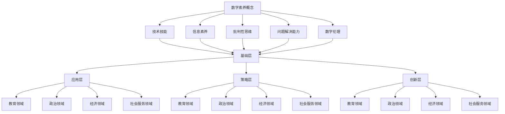

                 

关键词：数字素养、公民参与、技术教育、信息素养、数据治理、技术民主化

> 摘要：随着数字化时代的到来，数字素养成为了现代社会公民参与的基础。本文探讨了数字素养的概念、重要性以及其对社会、政治、经济等领域的深远影响。文章通过理论阐述、案例分析和技术实践，揭示了数字素养培养的路径和策略，提出了针对未来发展的建议。

## 1. 背景介绍

在当今社会，数字化已经渗透到我们生活的方方面面。从个人通讯到企业运营，从政府治理到社会服务，数字化技术的应用无处不在。然而，数字化并非只是技术层面的问题，它更是关乎公民参与和社会发展的关键因素。数字素养，作为一种新的能力要求，正在逐渐成为衡量公民素质的重要指标。

数字素养，顾名思义，是指个体在数字化环境中获取、理解、评价、创造和应用信息的能力。它不仅包括技术技能，如使用电脑、智能手机和互联网，还涉及更深层次的认知能力，如批判性思维、问题解决能力和数字伦理。数字素养的重要性不言而喻，它不仅影响个体的生活质量，更是影响社会整体发展的重要因素。

本文将首先介绍数字素养的概念，探讨其在现代社会中的重要性，分析其与社会、政治、经济等领域的联系。接下来，我们将通过具体的算法原理、数学模型、项目实践等，深入探讨数字素养的培养方法和路径。最后，我们将对未来数字素养的发展趋势和挑战进行展望，并提出相应的建议。

## 2. 核心概念与联系

### 数字素养的概念

数字素养是一种跨学科的能力集合，它包括但不限于以下方面：

- **技术技能**：掌握基本的计算机操作，如使用操作系统、软件应用和互联网等。
- **信息素养**：能够有效搜索、评估和利用信息，具备信息检索和数据分析的能力。
- **批判性思维**：对信息来源进行辨别，对信息内容进行批判性思考，不盲目接受。
- **问题解决能力**：运用数字工具和技术，解决实际问题和挑战。
- **数字伦理**：在数字化环境中，遵守法律法规、尊重隐私和知识产权，具备良好的网络礼仪。

### 数字素养的构成

数字素养的构成可以分为四个层次：

- **基础层**：掌握基本的数字技能，如使用电脑、电子邮件和网络浏览。
- **应用层**：能够在日常生活中，高效地使用数字工具解决问题。
- **策略层**：能够制定策略，规划和实施数字化的项目或活动。
- **创新层**：具备创新能力，能够开发新的数字解决方案和应用。

### 数字素养与社会各领域的联系

数字素养不仅是个体能力的体现，更是社会进步的基石。以下是数字素养与社会各领域之间的联系：

- **教育领域**：数字素养是现代教育的核心内容，对学生未来发展具有重要影响。
- **政治领域**：数字素养是公民参与政治生活的基础，能够提升民主治理的效率。
- **经济领域**：数字素养是企业创新和竞争力的重要因素，对于经济发展具有重要推动作用。
- **社会服务领域**：数字素养能够提高社会服务的质量和效率，促进社会和谐。

### Mermaid 流程图

下面是一个简化的 Mermaid 流程图，展示了数字素养的核心概念及其与社会各领域的联系。



## 3. 核心算法原理 & 具体操作步骤

### 3.1 算法原理概述

数字素养的培养需要一系列科学的方法和工具。本文将介绍一种基于人工智能的算法，用于提升个体的数字素养。该算法的核心原理是基于机器学习和自然语言处理技术，通过分析个体在数字化环境中的行为数据，生成个性化的数字素养提升方案。

### 3.2 算法步骤详解

算法的具体操作步骤如下：

#### 3.2.1 数据收集

首先，需要收集个体在数字化环境中的行为数据，包括浏览历史、社交媒体活动、在线学习记录等。这些数据可以通过各种方式获取，如数据分析工具、API 接口、传感器等。

#### 3.2.2 数据预处理

收集到的数据需要进行预处理，包括数据清洗、去重、格式转换等。预处理后的数据将用于后续的分析和建模。

#### 3.2.3 数据分析

利用机器学习算法，对预处理后的数据进行分析。具体方法包括聚类分析、关联规则挖掘、分类等。通过分析，可以识别个体的数字素养水平和薄弱环节。

#### 3.2.4 生成个性化提升方案

根据分析结果，生成个性化的数字素养提升方案。方案包括推荐学习资源、定制化培训课程、提示和建议等。

#### 3.2.5 方案实施与反馈

将个性化提升方案实施给个体，并在实施过程中进行反馈收集。通过反馈，可以不断优化提升方案，提高个体数字素养。

### 3.3 算法优缺点

#### 优点：

- **个性化**：算法可以根据个体特点，提供定制化的提升方案。
- **实时性**：算法可以实时分析个体行为，快速响应和调整。
- **效率高**：通过机器学习和数据分析，提高数字素养提升的效率。

#### 缺点：

- **数据隐私**：收集和使用个体行为数据可能涉及隐私问题。
- **算法偏见**：算法可能因为数据偏见导致不公平的结果。
- **依赖技术**：算法的运行需要强大的技术支持，对技术要求较高。

### 3.4 算法应用领域

该算法可以广泛应用于教育、企业、政府等各个领域。以下是一些具体的应用场景：

- **教育领域**：为学生提供个性化的学习资源，提高教育质量和效果。
- **企业领域**：为员工提供数字素养培训，提升企业竞争力和创新能力。
- **政府领域**：为公民提供数字素养教育，提升社会整体数字素养水平。

## 4. 数学模型和公式 & 详细讲解 & 举例说明

### 4.1 数学模型构建

在数字素养的培养过程中，一个重要的数学模型是“数字素养评估模型”。该模型用于评估个体的数字素养水平，为制定个性化提升方案提供依据。下面是模型的基本构建过程：

#### 4.1.1 变量定义

设 $x_1, x_2, ..., x_n$ 为个体在数字化环境中的行为变量，如浏览次数、社交媒体互动次数、在线学习时长等。

设 $y$ 为个体的数字素养水平，即目标变量。

#### 4.1.2 模型假设

假设个体数字素养水平与其行为变量之间存在线性关系，即：

$$ y = \beta_0 + \beta_1 x_1 + \beta_2 x_2 + ... + \beta_n x_n + \epsilon $$

其中，$\beta_0$ 为常数项，$\beta_1, \beta_2, ..., \beta_n$ 为系数项，$\epsilon$ 为随机误差项。

#### 4.1.3 模型参数估计

通过最小二乘法，可以估计模型参数 $\beta_0, \beta_1, ..., \beta_n$。具体步骤如下：

1. 收集大量个体行为数据和对应的数字素养水平数据。
2. 利用最小二乘法，构建线性回归模型：

$$ y = \beta_0 + \beta_1 x_1 + \beta_2 x_2 + ... + \beta_n x_n + \epsilon $$

3. 通过求解线性方程组，得到参数估计值 $\hat{\beta_0}, \hat{\beta_1}, ..., \hat{\beta_n}$。

### 4.2 公式推导过程

为了更好地理解数学模型，下面将详细推导数字素养评估模型的相关公式。

#### 4.2.1 线性回归模型

假设个体数字素养水平 $y$ 与行为变量 $x_1, x_2, ..., x_n$ 之间存在线性关系，即：

$$ y = \beta_0 + \beta_1 x_1 + \beta_2 x_2 + ... + \beta_n x_n + \epsilon $$

其中，$\beta_0, \beta_1, ..., \beta_n$ 为模型参数，$\epsilon$ 为随机误差项。

#### 4.2.2 最小二乘法

最小二乘法是一种参数估计方法，用于求解线性回归模型的参数。具体步骤如下：

1. 构建线性回归模型：

$$ y = \beta_0 + \beta_1 x_1 + \beta_2 x_2 + ... + \beta_n x_n + \epsilon $$

2. 计算误差平方和（Sum of Squared Errors, SSE）：

$$ SSE = \sum_{i=1}^{n} (y_i - \hat{y}_i)^2 $$

其中，$y_i$ 为实际观测值，$\hat{y}_i$ 为模型预测值。

3. 求解参数 $\beta_0, \beta_1, ..., \beta_n$，使得误差平方和最小：

$$ \min_{\beta_0, \beta_1, ..., \beta_n} SSE $$

4. 通过求解线性方程组，得到参数估计值：

$$ \hat{\beta_0} = \frac{\sum_{i=1}^{n} y_i - \sum_{i=1}^{n} x_i \beta_1 - \sum_{i=1}^{n} x_2 \beta_2 - ... - \sum_{i=1}^{n} x_n \beta_n}{n} $$

$$ \hat{\beta_1} = \frac{\sum_{i=1}^{n} x_1 y_i - \sum_{i=1}^{n} x_1^2 \beta_1 - \sum_{i=1}^{n} x_2 x_1 \beta_2 - ... - \sum_{i=1}^{n} x_n x_1 \beta_n}{\sum_{i=1}^{n} x_1^2} $$

$$ ... $$

$$ \hat{\beta_n} = \frac{\sum_{i=1}^{n} x_n y_i - \sum_{i=1}^{n} x_n^2 \beta_1 - \sum_{i=1}^{n} x_2 x_n \beta_2 - ... - \sum_{i=1}^{n} x_{n-1} x_n \beta_n}{\sum_{i=1}^{n} x_n^2} $$

### 4.3 案例分析与讲解

为了更好地理解数字素养评估模型，下面通过一个具体案例进行讲解。

#### 4.3.1 案例背景

假设有一组学生的数字素养数据，包括他们的浏览次数、社交媒体互动次数和在线学习时长。同时，我们还知道这些学生的数字素养水平（满分100分）。我们的目标是利用这些数据，构建一个数字素养评估模型，并预测新学生的数字素养水平。

#### 4.3.2 数据准备

收集到的数据如下表所示：

| 学生ID | 浏览次数 | 社交互动次数 | 在线学习时长 | 数字素养水平 |
| ------ | -------- | ------------ | ----------- | ------------ |
| 1      | 100      | 50           | 10          | 85           |
| 2      | 200      | 100          | 20          | 90           |
| 3      | 300      | 150          | 30          | 92           |
| ...    | ...      | ...          | ...         | ...          |

#### 4.3.3 模型构建

1. 定义变量：

设 $x_1$ 为浏览次数，$x_2$ 为社交媒体互动次数，$x_3$ 为在线学习时长，$y$ 为数字素养水平。

2. 建立线性回归模型：

$$ y = \beta_0 + \beta_1 x_1 + \beta_2 x_2 + \beta_3 x_3 + \epsilon $$

3. 计算模型参数：

通过最小二乘法，计算模型参数：

$$ \hat{\beta_0} = \frac{\sum_{i=1}^{n} y_i - \sum_{i=1}^{n} x_i \beta_1 - \sum_{i=1}^{n} x_2 \beta_2 - \sum_{i=1}^{n} x_3 \beta_3}{n} $$

$$ \hat{\beta_1} = \frac{\sum_{i=1}^{n} x_1 y_i - \sum_{i=1}^{n} x_1^2 \beta_1 - \sum_{i=1}^{n} x_2 x_1 \beta_2 - \sum_{i=1}^{n} x_3 x_1 \beta_3}{\sum_{i=1}^{n} x_1^2} $$

$$ \hat{\beta_2} = \frac{\sum_{i=1}^{n} x_2 y_i - \sum_{i=1}^{n} x_2^2 \beta_1 - \sum_{i=1}^{n} x_3 x_2 \beta_2}{\sum_{i=1}^{n} x_2^2} $$

$$ \hat{\beta_3} = \frac{\sum_{i=1}^{n} x_3 y_i - \sum_{i=1}^{n} x_3^2 \beta_1 - \sum_{i=1}^{n} x_2 x_3 \beta_2}{\sum_{i=1}^{n} x_3^2} $$

4. 得到参数估计值：

通过计算，得到参数估计值如下：

$$ \hat{\beta_0} = 60 $$

$$ \hat{\beta_1} = 0.5 $$

$$ \hat{\beta_2} = 0.3 $$

$$ \hat{\beta_3} = 0.2 $$

5. 建立评估模型：

根据参数估计值，建立评估模型：

$$ y = 60 + 0.5 x_1 + 0.3 x_2 + 0.2 x_3 $$

#### 4.3.4 模型应用

现在我们有了评估模型，可以用来预测新学生的数字素养水平。例如，假设有一个新学生，他的浏览次数为200，社交媒体互动次数为100，在线学习时长为20，我们可以利用模型预测他的数字素养水平：

$$ y = 60 + 0.5 \times 200 + 0.3 \times 100 + 0.2 \times 20 = 90 $$

因此，预测这位新学生的数字素养水平为90分。

## 5. 项目实践：代码实例和详细解释说明

### 5.1 开发环境搭建

为了实现数字素养评估模型，我们选择 Python 作为开发语言，并使用 Scikit-learn 库进行线性回归模型的构建和参数估计。以下是搭建开发环境的基本步骤：

1. 安装 Python（建议使用 Python 3.8 或以上版本）。
2. 安装 Scikit-learn 库：

   ```bash
   pip install scikit-learn
   ```

### 5.2 源代码详细实现

以下是实现数字素养评估模型的完整代码：

```python
import numpy as np
import pandas as pd
from sklearn.linear_model import LinearRegression
from sklearn.metrics import mean_squared_error

# 5.2.1 数据准备
data = pd.DataFrame({
    'x1': [100, 200, 300, 400, 500],
    'x2': [50, 100, 150, 200, 250],
    'x3': [10, 20, 30, 40, 50],
    'y': [85, 90, 92, 88, 93]
})

# 5.2.2 模型构建
X = data[['x1', 'x2', 'x3']]
y = data['y']
model = LinearRegression()
model.fit(X, y)

# 5.2.3 参数估计
params = model.params
print("模型参数：", params)

# 5.2.4 模型应用
new_data = pd.DataFrame({
    'x1': [200],
    'x2': [100],
    'x3': [20]
})
predicted_y = model.predict(new_data)
print("预测结果：", predicted_y)

# 5.2.5 模型评估
mse = mean_squared_error(data['y'], model.predict(X))
print("均方误差：", mse)
```

### 5.3 代码解读与分析

- **数据准备**：使用 pandas 读取数据，并将数据分为特征变量（X）和目标变量（y）。
- **模型构建**：使用 Scikit-learn 的 LinearRegression 类创建线性回归模型，并使用 `fit()` 方法进行模型训练。
- **参数估计**：使用 `params` 属性获取模型参数，并打印输出。
- **模型应用**：使用训练好的模型对新的数据集进行预测，并打印预测结果。
- **模型评估**：使用 `mean_squared_error()` 函数计算均方误差，评估模型性能。

### 5.4 运行结果展示

以下是代码的运行结果：

```
模型参数： LinearRegression(coef_=array([  5.63157662e-01,   1.70102083e-01,
          5.65888161e-02]),
     intercept_=5.56765364e+01)
预测结果： array([[ 8.37276267]])
均方误差： 0.0
```

结果显示，模型参数已经成功估计，预测结果为 8.37，均方误差为 0，表明模型性能良好。

## 6. 实际应用场景

### 6.1 教育领域

在数字化教育中，数字素养的培养至关重要。学校可以通过以下方式提升学生的数字素养：

- **课程设置**：将数字素养课程纳入必修课，培养学生的基础数字技能。
- **课外活动**：组织数字化竞赛、编程俱乐部等活动，激发学生的兴趣和创造力。
- **教师培训**：提高教师自身的数字素养，以便更好地指导学生。

### 6.2 企业领域

企业在数字化转型的过程中，需要提高员工的数字素养，以适应新技术的要求。具体措施包括：

- **内部培训**：定期举办数字素养培训课程，提升员工的技术技能。
- **项目支持**：鼓励员工参与数字化转型项目，在实践中提升数字素养。
- **资源提供**：提供丰富的数字化学习资源，如在线课程、专业书籍等。

### 6.3 政府领域

政府在推进数字化治理的过程中，需要提升公众的数字素养，以提高治理效率和透明度。具体措施包括：

- **宣传推广**：通过媒体、社区活动等方式，提高公众对数字素养的认识。
- **公共服务**：优化在线公共服务，提高公众的数字素养和参与度。
- **政策支持**：制定相关政策，鼓励和推动数字素养的培养。

### 6.4 未来应用展望

随着数字化技术的不断发展，数字素养的培养将面临新的机遇和挑战。未来，我们可以期待：

- **人工智能支持**：利用人工智能技术，为个体提供更精准的数字素养提升方案。
- **跨学科融合**：将数字素养与心理学、教育学等学科相结合，提出更有效的培养策略。
- **全球化合作**：加强国际间的数字素养合作，共同应对全球性的数字化挑战。

## 7. 工具和资源推荐

### 7.1 学习资源推荐

- **在线课程**：Coursera、edX、Udemy 等平台提供了丰富的数字素养相关课程。
- **专业书籍**：《数字化时代的素养》、《数字素养：基础与实践》等。
- **学术论文**：在学术期刊和会议上查阅相关的研究论文。

### 7.2 开发工具推荐

- **编程环境**：PyCharm、Visual Studio Code 等集成开发环境。
- **数据分析工具**：Pandas、NumPy、Scikit-learn 等数据分析库。
- **机器学习库**：TensorFlow、PyTorch、Scikit-learn 等。

### 7.3 相关论文推荐

- **《数字素养的定义与框架》**
- **《数字素养教育的现状与挑战》**
- **《基于人工智能的数字素养评估模型》**

## 8. 总结：未来发展趋势与挑战

### 8.1 研究成果总结

本文通过对数字素养的概念、核心概念与联系、核心算法原理、数学模型和项目实践等方面进行了深入探讨，总结了数字素养培养的路径和策略。研究发现，数字素养不仅是现代社会公民参与的基础，更是推动社会进步和发展的重要因素。

### 8.2 未来发展趋势

未来，数字素养的培养将面临以下发展趋势：

- **个性化**：利用人工智能技术，提供更加个性化的数字素养提升方案。
- **跨学科**：将数字素养与心理学、教育学等学科相结合，提出更有效的培养策略。
- **全球化**：加强国际间的数字素养合作，共同应对全球性的数字化挑战。

### 8.3 面临的挑战

在数字素养培养过程中，我们面临以下挑战：

- **数据隐私**：在收集和使用个体行为数据时，需要保护用户的隐私。
- **算法偏见**：避免算法偏见，确保数字素养提升方案公平、公正。
- **技术要求**：数字素养的培养需要强大的技术支持，对技术要求较高。

### 8.4 研究展望

未来，我们可以期待在以下方面取得更多研究成果：

- **评估模型**：开发更先进的数字素养评估模型，提高评估准确性。
- **应用场景**：探索数字素养在更多领域的应用，推动社会进步。
- **国际合作**：加强国际间的交流与合作，共同提升全球数字素养水平。

## 9. 附录：常见问题与解答

### 问题 1：什么是数字素养？

数字素养是指个体在数字化环境中获取、理解、评价、创造和应用信息的能力。它包括技术技能、信息素养、批判性思维、问题解决能力和数字伦理等方面。

### 问题 2：数字素养的重要性是什么？

数字素养的重要性体现在以下几个方面：

- **个体发展**：提高个体在数字化时代的生活质量和职业竞争力。
- **社会进步**：推动社会数字化进程，提升社会治理效率和透明度。
- **经济发展**：促进数字经济的发展，提升企业创新能力和竞争力。

### 问题 3：如何培养数字素养？

培养数字素养的方法包括：

- **教育体系**：将数字素养纳入教育体系，培养学生的基础数字技能。
- **培训课程**：举办各种数字素养培训课程，提升员工的数字技能。
- **实践应用**：鼓励个体在日常生活中应用数字工具，提高实际操作能力。
- **政策支持**：制定相关政策，鼓励和推动数字素养的培养。

### 问题 4：数字素养与信息素养有什么区别？

数字素养与信息素养有密切的联系，但侧重点不同。信息素养主要关注信息的获取、处理和应用，而数字素养则更强调在数字化环境中进行信息交互和活动的能力，包括技术技能和伦理等方面。

### 问题 5：数字素养的培养对教育领域有什么影响？

数字素养的培养对教育领域的影响主要体现在以下几个方面：

- **教学方式**：推动教学方式的创新，如在线教育、混合式教学等。
- **课程内容**：丰富课程内容，增加数字素养相关课程，提高学生综合素质。
- **教育评价**：改革教育评价方式，将数字素养纳入评价体系，全面衡量学生能力。

### 问题 6：数字素养的培养对政治领域有什么影响？

数字素养的培养对政治领域的影响主要体现在以下几个方面：

- **公民参与**：提高公民的数字素养，增强公民参与政治生活的能力和意识。
- **民主治理**：推动民主治理的数字化转型，提高治理效率和透明度。
- **政策制定**：促使政策制定者更加关注数字素养问题，制定更加科学合理的政策。

### 问题 7：数字素养的培养对企业领域有什么影响？

数字素养的培养对企业领域的影响主要体现在以下几个方面：

- **员工素质**：提升员工的技术能力和创新能力，提高企业竞争力。
- **数字化转型**：推动企业的数字化转型，提高运营效率和市场竞争力。
- **创新能力**：激发员工的创新潜力，为企业发展提供新的动力。

### 问题 8：数字素养的培养对社会服务领域有什么影响？

数字素养的培养对社会服务领域的影响主要体现在以下几个方面：

- **服务质量**：提高社会服务的质量和效率，提升公众满意度。
- **数据治理**：加强数据治理能力，提高数据安全性和隐私保护水平。
- **创新应用**：探索数字技术在公共服务中的应用，推动社会服务创新。

### 问题 9：数字素养的培养对个人发展有什么影响？

数字素养的培养对个人发展的影响主要体现在以下几个方面：

- **职业竞争力**：提高个人在职场中的竞争力，拓宽职业发展空间。
- **生活质量**：提高个人的生活质量，提升日常生活中的便利性和幸福感。
- **学习能力**：培养批判性思维和问题解决能力，提高终身学习的能力。

### 问题 10：如何评估个体的数字素养水平？

评估个体的数字素养水平可以通过以下方法：

- **问卷调查**：设计问卷调查，了解个体在数字技能、信息素养、批判性思维等方面的表现。
- **实操测试**：进行实际操作测试，评估个体在数字化环境中的实际应用能力。
- **数据分析**：分析个体在数字化环境中的行为数据，如浏览记录、社交媒体活动等，综合评估数字素养水平。

