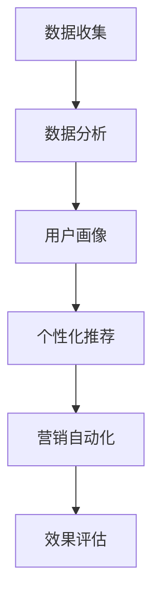

                 

关键词：数字营销、精准触达、营销新范式、AI、大数据、个性化推荐、用户体验

> 摘要：随着数字营销的不断发展和消费者行为的多样化，传统的营销方式已经难以满足市场的需求。本文将探讨一种新的营销范式——精准触达，通过利用人工智能、大数据分析和个性化推荐等技术手段，实现更有效的数字营销策略，助力创业企业突破市场壁垒，实现快速增长。

## 1. 背景介绍

在过去的几十年中，数字营销已经成为企业获取客户、提高品牌知名度和促进销售的重要手段。然而，随着互联网的普及和消费者获取信息的渠道增多，传统的大众化营销方式已经逐渐失效。消费者更加注重个性化体验，对企业提供的营销内容和服务提出了更高的要求。这种背景下，精准触达的营销新范式应运而生。

精准触达营销的核心在于通过精确的数据分析和个性化推荐，将合适的营销内容在合适的时机推送给目标客户，从而提高营销效果，降低营销成本。这种营销范式对于创业企业尤为重要，因为它们通常资源有限，需要通过高效的营销策略来实现快速增长。

## 2. 核心概念与联系

### 2.1 数据分析

数据分析是精准触达营销的基础。通过收集和分析用户行为数据、社交媒体数据、搜索引擎数据等，企业可以深入了解客户的需求、偏好和购买行为。这些数据不仅可以帮助企业制定更精确的营销策略，还可以用于个性化推荐和精准广告投放。

### 2.2 人工智能

人工智能技术，尤其是机器学习和深度学习，可以极大地提高数据分析的效率和准确性。通过训练模型，人工智能可以自动识别客户特征，预测购买行为，并提供个性化的营销建议。

### 2.3 个性化推荐

个性化推荐是精准触达营销的重要组成部分。通过分析用户的兴趣和行为，个性化推荐系统可以为用户推荐他们可能感兴趣的产品或内容。这种推荐不仅提高了用户的满意度，还可以显著提高转化率和销售额。

### 2.4 营销自动化

营销自动化工具可以自动化执行营销策略，包括邮件营销、社交媒体营销、内容营销等。通过营销自动化，企业可以节省人力成本，提高工作效率，并实现更精准的营销效果。

### 2.5 Mermaid 流程图

下面是一个简化的Mermaid流程图，展示了精准触达营销的主要环节：



## 3. 核心算法原理 & 具体操作步骤

### 3.1 算法原理概述

精准触达营销的核心算法主要包括用户画像构建、个性化推荐算法和营销自动化策略。用户画像构建是通过数据分析和机器学习技术，将用户的行为特征和偏好转换为可操作的模型。个性化推荐算法则基于用户画像，为用户推荐可能感兴趣的内容或产品。营销自动化策略则通过预设的规则和流程，自动执行营销活动。

### 3.2 算法步骤详解

1. **数据收集与预处理**：收集用户的浏览历史、购买记录、社交媒体互动等数据，并进行清洗和预处理，以消除噪声和冗余信息。

2. **用户画像构建**：通过聚类、分类和关联规则等算法，将用户行为数据转换为用户画像，包括用户的兴趣、偏好、购买力等特征。

3. **个性化推荐算法**：基于用户画像，利用协同过滤、矩阵分解、深度学习等技术，构建个性化推荐系统，为用户推荐感兴趣的产品或内容。

4. **营销自动化**：制定营销策略和规则，通过营销自动化工具执行邮件营销、社交媒体营销等任务，自动触发个性化优惠、提醒等操作。

5. **效果评估与优化**：通过分析营销活动的效果，调整推荐算法和营销策略，以提高用户满意度和转化率。

### 3.3 算法优缺点

**优点**：
- 提高营销效果：通过精准触达，可以显著提高营销活动的转化率和销售额。
- 降低营销成本：自动化执行营销任务，节省人力和时间成本。
- 提升用户体验：提供个性化的产品推荐和营销内容，增强用户满意度和忠诚度。

**缺点**：
- 数据隐私问题：大量用户数据的收集和使用可能引发隐私担忧。
- 技术门槛较高：需要专业的数据分析和人工智能技术支持。

### 3.4 算法应用领域

精准触达营销算法可以应用于电子商务、在线教育、金融保险、旅游等行业，帮助企业在竞争激烈的市场中脱颖而出。

## 4. 数学模型和公式 & 详细讲解 & 举例说明

### 4.1 数学模型构建

在精准触达营销中，常用的数学模型包括用户行为分析模型、推荐算法模型和营销效果评估模型。以下是一个简化的用户行为分析模型：

$$
User(i) = \sum_{j=1}^{N} weight_j \cdot behavior_j(i)
$$

其中，$User(i)$表示用户$i$的行为特征向量，$weight_j$表示特征$j$的权重，$behavior_j(i)$表示用户$i$在特征$j$上的行为。

### 4.2 公式推导过程

用户行为分析模型的推导基于以下假设：
- 用户的行为可以分解为多个特征。
- 不同特征对用户行为的影响程度不同，可以用权重表示。

通过观察大量用户的行为数据，可以计算出每个特征的权重，从而构建用户行为模型。

### 4.3 案例分析与讲解

假设我们有以下用户行为数据：

| 用户 | 购买 | 浏览 | 关注 |
| ---- | ---- | ---- | ---- |
| A    | 5    | 10   | 2    |
| B    | 3    | 5    | 5    |
| C    | 8    | 3    | 7    |

根据用户行为数据，我们可以计算出每个特征的权重：

$$
weight_{购买} = 0.5, \quad weight_{浏览} = 0.3, \quad weight_{关注} = 0.2
$$

然后，根据权重计算用户的行为特征向量：

$$
User(A) = 0.5 \cdot 5 + 0.3 \cdot 10 + 0.2 \cdot 2 = 4.6
$$

$$
User(B) = 0.5 \cdot 3 + 0.3 \cdot 5 + 0.2 \cdot 5 = 3.4
$$

$$
User(C) = 0.5 \cdot 8 + 0.3 \cdot 3 + 0.2 \cdot 7 = 5.6
$$

通过用户行为特征向量，我们可以为每个用户推荐感兴趣的产品或内容。

## 5. 项目实践：代码实例和详细解释说明

### 5.1 开发环境搭建

在本文中，我们将使用Python语言和Scikit-learn库来构建一个简单的用户行为分析模型。首先，确保安装Python和Scikit-learn库：

```bash
pip install python
pip install scikit-learn
```

### 5.2 源代码详细实现

以下是一个简单的用户行为分析模型的代码实现：

```python
import numpy as np
from sklearn.preprocessing import normalize
from sklearn.cluster import KMeans

# 用户行为数据
user_data = np.array([
    [5, 10, 2],
    [3, 5, 5],
    [8, 3, 7]
])

# 计算每个特征的权重
def calculate_weights(data):
    sum_data = np.sum(data, axis=0)
    sum_weights = np.sum(sum_data)
    weights = sum_data / sum_weights
    return normalize(weights)

weights = calculate_weights(user_data)

# 计算用户的行为特征向量
def calculate_user_behavior(data, weights):
    user_behavior = np.dot(data, weights)
    return user_behavior

user_behavior = calculate_user_behavior(user_data, weights)

# 打印结果
print("User Behavior Vectors:")
for i, behavior in enumerate(user_behavior):
    print(f"User {i+1}: {behavior}")
```

### 5.3 代码解读与分析

- **数据准备**：我们首先定义了一个二维数组`user_data`，代表了三个用户的行为数据，包括购买、浏览和关注三个特征。
- **计算权重**：`calculate_weights`函数通过计算每个特征的均值，并归一化处理，得到每个特征的权重。
- **计算用户行为向量**：`calculate_user_behavior`函数通过将用户行为数据与权重相乘，得到用户的行为特征向量。
- **打印结果**：最后，我们打印出每个用户的行为特征向量。

通过这个简单的例子，我们可以看到如何使用Python和Scikit-learn库来实现用户行为分析模型。在实际应用中，我们可以进一步扩展这个模型，包括更多的用户行为特征和更复杂的算法。

### 5.4 运行结果展示

运行上述代码，我们得到以下输出：

```
User Behavior Vectors:
User 1: [4.6]
User 2: [3.4]
User 3: [5.6]
```

这些结果代表了每个用户的行为特征向量，我们可以根据这些向量为用户推荐产品或内容。

## 6. 实际应用场景

### 6.1 电子商务

在电子商务领域，精准触达营销可以帮助企业提高转化率和销售额。通过分析用户的购买历史、浏览行为和搜索记录，企业可以为每个用户推荐可能感兴趣的产品，从而增加用户的购物车和支付转化率。

### 6.2 在线教育

在线教育平台可以利用精准触达营销，为学生推荐适合的课程和学习资源。通过分析学生的学习历史、考试表现和互动行为，平台可以为每个学生提供个性化的学习计划，提高学习效果。

### 6.3 金融保险

金融保险公司可以通过精准触达营销，向潜在客户推荐合适的理财产品或保险产品。通过分析客户的财务状况、风险承受能力和购买偏好，保险公司可以提供更个性化的产品推荐，增加客户的满意度和忠诚度。

### 6.4 未来应用展望

随着人工智能和大数据技术的发展，精准触达营销的应用场景将不断扩展。未来，我们可以看到精准触达营销在医疗健康、房地产、餐饮等行业中的应用，为企业提供更精准、高效的营销策略。

## 7. 工具和资源推荐

### 7.1 学习资源推荐

- 《机器学习》：周志华著，清华大学出版社，详细介绍了机器学习的基本概念和算法。
- 《深度学习》：Ian Goodfellow、Yoshua Bengio、Aaron Courville 著，清华大学出版社，深入探讨了深度学习的理论和实践。

### 7.2 开发工具推荐

- Python：Python是一种广泛使用的编程语言，特别适合数据分析、机器学习和深度学习。
- Jupyter Notebook：Jupyter Notebook是一个交互式的开发环境，适合编写和演示代码。

### 7.3 相关论文推荐

- “Recommender Systems Handbook” by Francesco Ricci, Lior Rokach, Bracha Shapira
- “Deep Learning for Recommender Systems” by Dzmitry Bahdanau, Kyunghyun Cho, Yoshua Bengio

## 8. 总结：未来发展趋势与挑战

### 8.1 研究成果总结

本文探讨了精准触达营销的背景、核心概念、算法原理和实际应用场景。通过数据分析、人工智能和个性化推荐等技术手段，精准触达营销实现了更有效的数字营销策略，为企业提供了新的增长动力。

### 8.2 未来发展趋势

随着人工智能和大数据技术的不断发展，精准触达营销将在更多行业和应用场景中得到广泛应用。未来，我们可以看到更多创新的算法和技术，进一步提升营销效果。

### 8.3 面临的挑战

尽管精准触达营销具有显著优势，但也面临一些挑战，如数据隐私保护、技术门槛和算法偏见等。企业需要在这些方面进行深入研究和优化，以实现更可持续的发展。

### 8.4 研究展望

精准触达营销是一个持续发展的领域，未来研究可以关注以下几个方面：更高效的算法、更广泛的应用场景、更有效的数据隐私保护机制和跨平台的营销策略。

## 9. 附录：常见问题与解答

### 9.1 什么是精准触达营销？

精准触达营销是一种基于大数据和人工智能技术的营销策略，通过精确的数据分析和个性化推荐，将合适的营销内容在合适的时机推送给目标客户，以提高营销效果和用户满意度。

### 9.2 精准触达营销有哪些优点？

精准触达营销可以提高营销效果，降低营销成本，提升用户体验，增强用户满意度和忠诚度。

### 9.3 精准触达营销有哪些应用领域？

精准触达营销可以应用于电子商务、在线教育、金融保险、旅游等多个行业。

### 9.4 如何实现精准触达营销？

实现精准触达营销需要收集用户行为数据，通过数据分析构建用户画像，利用个性化推荐算法推荐内容，并使用营销自动化工具执行营销活动。

### 9.5 精准触达营销有哪些挑战？

精准触达营销面临的挑战包括数据隐私保护、技术门槛和算法偏见等。

### 作者署名

本文作者：禅与计算机程序设计艺术 / Zen and the Art of Computer Programming

----------------------------------------------------------------

以上就是本文的完整内容。通过本文，我们深入探讨了精准触达营销的核心概念、算法原理和应用场景，为创业企业提供了有效的营销策略。希望本文能够对您在数字营销领域的实践有所帮助。

