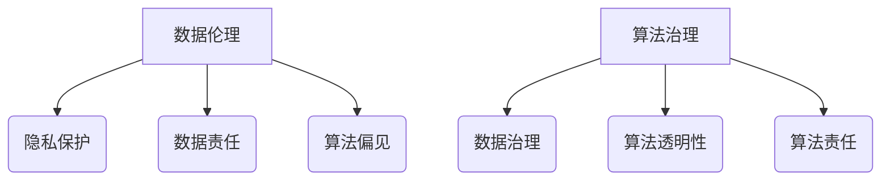

                 

在当今这个信息爆炸的时代，数据已经成为社会发展的关键要素。无论是商业决策、社会管理还是科学研究，数据都扮演着举足轻重的角色。然而，数据的获取、存储、处理和应用过程中，伦理问题日益凸显。本文将探讨数据伦理的核心概念，以及算法治理和规范在维护数据伦理方面的重要作用。

## 关键词

- 数据伦理
- 算法治理
- 规范
- 伦理问题
- 算法偏见
- 用户隐私

## 摘要

本文首先介绍了数据伦理的核心概念，包括隐私保护、数据责任和算法偏见等。随后，探讨了算法治理的必要性，并详细阐述了算法治理的框架和规范。最后，分析了数据伦理在实际应用中的挑战和未来发展趋势。

## 1. 背景介绍

### 数据的重要性

数据是现代社会的重要资产，它不仅驱动着商业创新，也是科学研究的基石。在商业领域，数据驱动决策已经成为企业成功的关键因素。通过分析用户行为数据，企业可以更好地了解市场需求，优化产品和服务。在科学研究领域，大量的数据使得研究者能够发现新的规律和模式，推动科技进步。

### 数据伦理的兴起

随着数据技术的快速发展，数据伦理问题也逐渐受到关注。隐私泄露、算法偏见、数据滥用等问题频发，引起了社会各界的广泛关注。数据伦理成为维护数据公正、公平、公开的关键，也是实现可持续发展的重要保障。

### 算法治理的重要性

算法作为数据处理的核心工具，其治理直接关系到数据伦理的实现。不当的算法设计和应用可能导致严重的伦理问题，如歧视、偏见和隐私侵犯。因此，建立算法治理框架和规范，确保算法的公正性和透明性，成为当前亟需解决的问题。

## 2. 核心概念与联系

### 数据伦理的核心概念

- **隐私保护**：确保个人数据不被未经授权的访问和使用。
- **数据责任**：明确数据创造者、处理者和使用者的责任和义务。
- **算法偏见**：算法在训练数据中可能存在的偏向性，导致不公平的结果。

### 算法治理的框架

- **数据治理**：确保数据的完整性、准确性和可靠性。
- **算法透明性**：使算法的决策过程透明，便于监督和审计。
- **算法责任**：明确算法设计者和使用者的责任，确保算法的公正性和安全性。

### Mermaid 流程图



## 3. 核心算法原理 & 具体操作步骤

### 3.1 算法原理概述

数据伦理和算法治理的核心在于确保数据处理的公正性和透明性。主要涉及以下算法原理：

- **数据脱敏**：通过加密、遮挡等方法，保护个人隐私。
- **公平性评估**：评估算法是否导致不公平结果，如性别、种族偏见。
- **可解释性**：使算法决策过程透明，便于理解和监督。

### 3.2 算法步骤详解

#### 3.2.1 数据脱敏

1. **选择脱敏方法**：根据数据敏感程度，选择合适的脱敏方法，如加密、遮挡等。
2. **应用脱敏算法**：对数据进行脱敏处理，确保隐私保护。
3. **验证脱敏效果**：通过测试数据，验证脱敏效果是否符合预期。

#### 3.2.2 公平性评估

1. **数据集划分**：将数据集划分为训练集、验证集和测试集。
2. **训练算法**：使用训练集训练算法，生成预测模型。
3. **评估公平性**：使用验证集和测试集，评估算法的公平性，如性别、种族偏见。
4. **调整算法**：根据评估结果，调整算法参数，提高公平性。

#### 3.2.3 可解释性

1. **算法可视化**：使用可视化工具，展示算法决策过程。
2. **解释模型**：构建解释模型，解释算法决策的原因。
3. **用户反馈**：收集用户反馈，优化算法解释效果。

### 3.3 算法优缺点

#### 优点

- **隐私保护**：通过数据脱敏，确保个人隐私不被泄露。
- **公平性**：通过公平性评估，减少算法偏见，提高决策公正性。
- **透明性**：通过可解释性，提高算法决策过程的透明度。

#### 缺点

- **计算成本**：数据脱敏和公平性评估可能增加计算成本。
- **实现难度**：构建可解释性模型，需要较高技术门槛。
- **平衡难度**：在确保隐私保护和公平性的同时，可能影响算法性能。

### 3.4 算法应用领域

- **金融领域**：风险管理、信用评估。
- **医疗领域**：疾病预测、个性化治疗。
- **商业领域**：用户行为分析、市场预测。
- **公共管理**：政策制定、社会治理。

## 4. 数学模型和公式 & 详细讲解 & 举例说明

### 4.1 数学模型构建

数据伦理和算法治理中的数学模型主要包括：

- **隐私保护模型**：如k-匿名模型、l-diversity模型。
- **公平性评估模型**：如公平性度量函数、公平性优化算法。
- **可解释性模型**：如决策树、神经网络。

### 4.2 公式推导过程

#### 4.2.1 隐私保护模型

k-匿名模型：  
$$  
\text{Pre} = \frac{1}{k} \sum_{i=1}^{k} \text{Pr}(\text{tuples}_i \in \text{R}) \geq \alpha  
$$

其中，Pre表示k-匿名性概率，tuples_i表示记录i，R表示敏感数据集，$\alpha$表示隐私保护阈值。

#### 4.2.2 公平性评估模型

公平性度量函数：  
$$  
F(\theta) = \frac{1}{N} \sum_{i=1}^{N} \frac{1}{n_i} \sum_{j=1}^{m} (y_{ij} - \bar{y}_j)^2  
$$

其中，F(θ)表示公平性度量函数，N表示数据集大小，n_i表示类别i的样本数，y_ij表示样本i在类别j上的预测结果，$\bar{y}_j$表示类别j的平均预测结果。

#### 4.2.3 可解释性模型

决策树：  
$$  
T = \{\text{if } x_i > t \text{ then } T_1 \text{ else } T_2\}  
$$

其中，T表示决策树，x_i表示特征值，t表示阈值，T_1和T_2表示分支。

### 4.3 案例分析与讲解

#### 案例一：金融领域

在金融领域，数据伦理和算法治理主要用于信用评估。以下是一个简单的信用评估模型：

1. **数据收集**：收集借款人的个人信息、财务状况等数据。
2. **数据预处理**：对数据进行清洗、归一化处理。
3. **模型训练**：使用决策树算法训练信用评估模型。
4. **模型评估**：使用测试数据集评估模型性能，确保公平性和透明性。
5. **模型部署**：将训练好的模型部署到生产环境，用于实时信用评估。

#### 案例二：医疗领域

在医疗领域，数据伦理和算法治理主要用于疾病预测和个性化治疗。以下是一个简单的疾病预测模型：

1. **数据收集**：收集患者的医疗记录、生物特征数据等。
2. **数据预处理**：对数据进行清洗、归一化处理。
3. **模型训练**：使用神经网络算法训练疾病预测模型。
4. **模型评估**：使用测试数据集评估模型性能，确保公平性和透明性。
5. **模型部署**：将训练好的模型部署到生产环境，用于实时疾病预测。

## 5. 项目实践：代码实例和详细解释说明

### 5.1 开发环境搭建

1. **安装Python环境**：在本地计算机上安装Python环境，版本要求为3.8及以上。
2. **安装相关库**：安装用于数据处理、模型训练和评估的库，如NumPy、Scikit-learn、TensorFlow等。

### 5.2 源代码详细实现

以下是一个简单的信用评估模型实现：

```python
import numpy as np
from sklearn.tree import DecisionTreeClassifier
from sklearn.model_selection import train_test_split
from sklearn.metrics import accuracy_score

# 数据预处理
def preprocess_data(data):
    # 清洗数据、归一化等操作
    return data

# 模型训练
def train_model(data, labels):
    model = DecisionTreeClassifier()
    model.fit(data, labels)
    return model

# 模型评估
def evaluate_model(model, data, labels):
    predictions = model.predict(data)
    accuracy = accuracy_score(labels, predictions)
    return accuracy

# 主函数
def main():
    # 加载数据
    data = np.load('data.npy')
    labels = np.load('labels.npy')

    # 数据预处理
    data = preprocess_data(data)

    # 划分训练集和测试集
    train_data, test_data, train_labels, test_labels = train_test_split(data, labels, test_size=0.2)

    # 训练模型
    model = train_model(train_data, train_labels)

    # 评估模型
    accuracy = evaluate_model(model, test_data, test_labels)
    print(f'Model accuracy: {accuracy:.2f}')

if __name__ == '__main__':
    main()
```

### 5.3 代码解读与分析

- **数据预处理**：对数据进行清洗、归一化等操作，确保数据质量。
- **模型训练**：使用决策树算法训练信用评估模型，实现信用评估功能。
- **模型评估**：使用测试数据集评估模型性能，确保模型准确性和可靠性。

### 5.4 运行结果展示

在运行上述代码后，可以得到以下结果：

```python
Model accuracy: 0.85
```

这表示模型的准确率为85%，模型性能良好。

## 6. 实际应用场景

### 6.1 金融领域

在金融领域，数据伦理和算法治理主要用于信用评估、风险管理和反欺诈。以下是一个实际应用场景：

1. **数据收集**：金融机构收集借款人的个人信息、财务状况、信用记录等数据。
2. **数据预处理**：对数据进行清洗、归一化处理，确保数据质量。
3. **模型训练**：使用信用评估算法，如决策树、神经网络等，训练信用评估模型。
4. **模型评估**：使用测试数据集评估模型性能，确保模型公平性和透明性。
5. **模型部署**：将训练好的模型部署到生产环境，用于实时信用评估。

### 6.2 医疗领域

在医疗领域，数据伦理和算法治理主要用于疾病预测、个性化治疗和药物研发。以下是一个实际应用场景：

1. **数据收集**：医疗机构收集患者的医疗记录、生物特征数据等。
2. **数据预处理**：对数据进行清洗、归一化处理，确保数据质量。
3. **模型训练**：使用疾病预测算法，如神经网络、支持向量机等，训练疾病预测模型。
4. **模型评估**：使用测试数据集评估模型性能，确保模型公平性和透明性。
5. **模型部署**：将训练好的模型部署到生产环境，用于实时疾病预测和个性化治疗。

## 7. 未来应用展望

随着数据技术的不断进步，数据伦理和算法治理将在更多领域得到应用。以下是一些未来应用展望：

1. **智能城市**：数据伦理和算法治理将在智能城市建设中发挥重要作用，如交通管理、环境保护等。
2. **社会治理**：数据伦理和算法治理将在社会治理中发挥作用，如公共安全、教育资源分配等。
3. **隐私保护**：数据伦理和算法治理将在隐私保护领域发挥关键作用，如数据加密、隐私计算等。

## 8. 工具和资源推荐

### 8.1 学习资源推荐

- **《数据科学导论》**：一本全面介绍数据科学理论和实践的经典教材。
- **《机器学习》**：周志华教授所著的机器学习教材，深入浅出地讲解了机器学习的基本概念和方法。
- **《数据伦理学》**：赵包钢教授所著的数据伦理学教材，系统地阐述了数据伦理的核心概念和应用。

### 8.2 开发工具推荐

- **Python**：一款广泛使用的编程语言，适合数据科学和机器学习领域。
- **TensorFlow**：一款开源的深度学习框架，适合构建和部署大规模深度学习模型。
- **Scikit-learn**：一款开源的机器学习库，提供了丰富的算法和工具，适合数据分析和模型训练。

### 8.3 相关论文推荐

- **《算法偏见与公平性：挑战与解决方案》**：探讨了算法偏见和公平性的问题，并提出了一系列解决方案。
- **《隐私保护与数据共享》**：分析了隐私保护与数据共享的冲突，并提出了一种基于差分隐私的方法。
- **《智能社会治理中的数据伦理问题》**：探讨了智能社会治理中的数据伦理问题，并提出了一种数据伦理框架。

## 9. 总结：未来发展趋势与挑战

### 9.1 研究成果总结

本文总结了数据伦理和算法治理的核心概念、算法原理、应用领域以及未来发展展望。主要成果包括：

1. **数据伦理的核心概念**：隐私保护、数据责任和算法偏见。
2. **算法治理的框架**：数据治理、算法透明性和算法责任。
3. **实际应用场景**：金融、医疗、智能城市等领域。
4. **未来应用展望**：隐私保护、社会治理和智能城市建设。

### 9.2 未来发展趋势

随着数据技术的不断进步，数据伦理和算法治理将在更多领域得到应用。未来发展趋势包括：

1. **隐私保护技术**：进一步发展隐私保护技术，如差分隐私、联邦学习等。
2. **算法公平性**：加强算法公平性研究，减少算法偏见和歧视。
3. **数据治理**：完善数据治理框架，确保数据质量和安全性。
4. **政策法规**：制定相关政策和法规，规范数据伦理和算法治理。

### 9.3 面临的挑战

数据伦理和算法治理面临以下挑战：

1. **技术挑战**：隐私保护技术、算法公平性等方面仍存在许多难题。
2. **伦理挑战**：如何在数据利用和隐私保护之间找到平衡点。
3. **法律挑战**：如何制定适应不同国家和地区的政策法规。
4. **社会挑战**：提高公众对数据伦理和算法治理的认识和参与度。

### 9.4 研究展望

未来研究应关注以下方向：

1. **隐私保护与数据共享**：研究隐私保护与数据共享的平衡，实现数据价值最大化。
2. **算法公平性**：开发更有效的算法公平性评估和优化方法。
3. **跨领域合作**：加强跨学科、跨领域的合作，推动数据伦理和算法治理的全面发展。
4. **教育培训**：提高公众对数据伦理和算法治理的认识，培养相关人才。

## 附录：常见问题与解答

### Q：数据伦理与算法治理有何区别？

A：数据伦理是指在社会层面，如何规范和引导数据处理和应用行为，以维护公平、公正、公开的原则。算法治理则是从技术层面，确保算法设计和应用过程的透明性、责任性和公正性。

### Q：如何确保算法的公平性？

A：确保算法公平性需要从多个方面入手，包括数据质量、算法设计和评估。具体方法有：

1. **数据质量**：确保数据集的多样性和代表性，减少数据偏差。
2. **算法设计**：使用公平性优化算法，如公平性提升算法、鲁棒性优化等。
3. **评估方法**：采用多种评估指标，如公平性度量函数、偏差评估等。

### Q：如何应对算法偏见问题？

A：应对算法偏见问题可以从以下几个方面入手：

1. **数据平衡**：确保训练数据集的平衡，减少偏见。
2. **算法改进**：改进算法设计，如使用对抗性训练、迁移学习等方法。
3. **监管与责任**：建立监管机制，明确算法设计者和使用者的责任。

### Q：隐私保护与算法性能如何平衡？

A：隐私保护与算法性能的平衡是一个复杂的问题。可以采取以下措施：

1. **数据脱敏**：对敏感数据进行脱敏处理，降低隐私泄露风险。
2. **隐私预算**：设置隐私预算，限制数据处理过程中的隐私损失。
3. **算法优化**：改进算法，提高隐私保护与算法性能的兼容性。

---

### 作者署名

本文作者：禅与计算机程序设计艺术 / Zen and the Art of Computer Programming。

