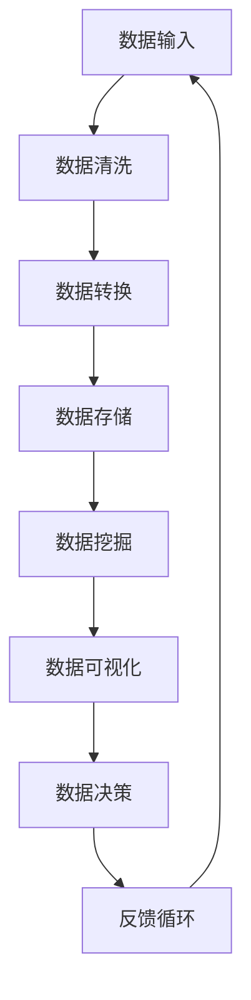

                 

## 1. 背景介绍

随着信息技术的迅猛发展，数据已经成为了新时代最重要的资源之一。在过去的几十年里，计算机科学家和工程师们开发了许多不同类型的软件系统，从操作系统到应用软件，从Web服务到移动应用，它们都极大地改变了我们的生活方式和工作方式。然而，传统软件方法论在面对海量数据和高复杂度应用时，逐渐暴露出了一些局限性。

传统软件方法论，如面向对象编程和函数式编程，依赖于模块化和抽象来组织代码，使得软件系统能够更容易地开发、测试和维护。然而，这些方法在处理数据密集型任务时，往往显得力不从心。例如，面向对象编程中的数据封装和继承机制，虽然有助于代码的重用和扩展，但也会引入数据冗余和耦合。函数式编程中的纯函数和不可变性，虽然在理论上保证了状态的不可变性和函数的引用透明性，但在实际应用中，性能问题和高复杂性往往成为阻碍。

软件2.0概念的提出，旨在通过数据即模型的观念，颠覆传统软件方法论。数据即模型认为，数据本身就是最有价值的资源，它能够直接驱动软件系统的行为和决策。软件2.0强调数据的自主性、智能化和数据驱动的方法，使得软件系统能够更灵活、更高效地应对复杂的应用场景。

本文将首先介绍软件2.0的核心概念和与传统软件方法论的差异，然后深入探讨数据即模型的原理和优势，通过具体案例展示其在实际应用中的效果，最后展望软件2.0的未来发展趋势和挑战。

## 2. 核心概念与联系

### 2.1 数据即模型

数据即模型（Data as Model）是软件2.0的核心概念之一。它主张将数据视为驱动软件行为的核心要素，而非仅仅是存储和传输的媒介。在传统软件方法论中，数据通常被视为“静态”资源，它被预先定义、存储和传递，而软件则通过算法和逻辑来处理这些数据。数据即模型则将数据视为“动态”资源，它能够自主变化，并且直接影响软件系统的行为和决策。

### 2.2 数据驱动开发

数据驱动开发（Data-Driven Development）是数据即模型的自然延伸。它强调通过数据来驱动软件的开发、测试和部署过程。在传统软件开发中，开发人员通常会按照预定的需求和设计来编写代码，然后进行测试和调试。而在数据驱动开发中，数据本身成为开发的核心，开发人员通过分析数据来发现需求、优化设计和验证系统。

### 2.3 智能化数据

智能化数据（Intelligent Data）是指具备自我学习和自我优化能力的数据。它能够通过机器学习和数据挖掘技术，从海量数据中提取有价值的信息，并且根据这些信息进行自我调整和优化。智能化数据是软件2.0实现自主性和高效性的关键。

### 2.4 Mermaid流程图

为了更好地展示数据即模型的概念，我们使用Mermaid流程图来描述其核心原理和架构。以下是数据即模型的基本流程：



在这个流程图中，A表示数据输入，B表示数据清洗，C表示数据转换，D表示数据存储，E表示数据挖掘，F表示数据可视化，G表示数据决策，H表示反馈循环。数据从输入开始，经过清洗、转换和存储后，通过数据挖掘提取有价值的信息，然后进行数据可视化和决策，最后形成反馈循环，驱动数据再次输入和处理。

### 2.5 数据即模型的优点

数据即模型具有以下优点：

- **灵活性和适应性**：数据即模型允许系统根据实时数据自动调整其行为和决策，从而提高系统的灵活性和适应性。
- **高效性**：通过直接使用数据驱动开发，可以减少传统软件开发中许多不必要的步骤，如需求分析和设计文档的编写，从而提高开发效率。
- **智能化**：智能化数据能够从海量数据中提取有价值的信息，为系统提供更准确的决策支持。
- **自主性**：数据即模型使得系统能够自主学习和优化，减少了人类干预的需求。

### 2.6 数据即模型的应用领域

数据即模型可以应用于许多领域，包括但不限于：

- **智能交通**：通过实时数据分析和预测，优化交通流量和道路规划，减少交通拥堵。
- **金融服务**：通过分析交易数据和用户行为，提供个性化金融产品和服务，提高用户体验和满意度。
- **医疗保健**：通过分析医疗数据和患者信息，提供个性化的治疗方案和健康建议，提高医疗质量。
- **制造业**：通过实时监测设备状态和生产线数据，实现智能化的生产调度和故障预测，提高生产效率。

## 3. 核心算法原理 & 具体操作步骤

### 3.1 算法原理概述

数据即模型的核心算法主要包括数据采集、数据清洗、数据转换、数据存储、数据挖掘、数据可视化和数据决策等步骤。这些步骤相互关联，形成一个闭环，使得数据能够持续驱动系统的行为和决策。

- **数据采集**：从各种数据源（如传感器、数据库、Web服务）收集数据。
- **数据清洗**：对采集到的数据进行预处理，去除噪声和异常值，提高数据质量。
- **数据转换**：将清洗后的数据进行格式转换和特征提取，为数据挖掘做准备。
- **数据存储**：将处理后的数据存储到数据库或数据仓库中，以便后续分析和挖掘。
- **数据挖掘**：使用机器学习和数据挖掘算法，从数据中提取有价值的信息和模式。
- **数据可视化**：将挖掘出的信息以图表、报表等形式可视化，帮助决策者理解和分析。
- **数据决策**：根据可视化结果和业务需求，制定决策和策略，并反馈到系统中进行实施。

### 3.2 算法步骤详解

以下是数据即模型算法的具体操作步骤：

#### 3.2.1 数据采集

数据采集是数据即模型的第一步。它涉及从各种数据源收集数据，包括传感器数据、日志数据、Web服务数据等。数据采集的关键在于确保数据的实时性和准确性，同时避免数据泄露和隐私问题。

- **数据源选择**：根据应用场景选择合适的数据源，如物联网设备、社交媒体平台、电商平台等。
- **数据采集工具**：使用数据采集工具（如Flume、Kafka）和协议（如HTTP、WebSocket）进行数据采集。
- **数据格式**：确保采集到的数据格式一致，便于后续处理和分析。

#### 3.2.2 数据清洗

数据清洗是对采集到的数据进行预处理，以提高数据质量。数据清洗包括以下步骤：

- **去重**：去除重复的数据记录，避免数据冗余。
- **去噪**：去除噪声数据和异常值，如空值、缺失值、错误值等。
- **归一化**：将不同尺度的数据进行归一化处理，使其在同一尺度上。
- **转换**：将数据转换为统一的格式和结构，便于后续处理和分析。

#### 3.2.3 数据转换

数据转换是将清洗后的数据进行格式转换和特征提取，为数据挖掘做准备。数据转换包括以下步骤：

- **格式转换**：将不同格式的数据进行转换，如JSON、XML转换为CSV或数据库表。
- **特征提取**：从原始数据中提取有用特征，如时间、地点、用户行为等。
- **特征选择**：选择对模型和预测最有用的特征，去除冗余和无关特征。

#### 3.2.4 数据存储

数据存储是将处理后的数据存储到数据库或数据仓库中，以便后续分析和挖掘。数据存储的关键在于确保数据的持久性、可扩展性和安全性。

- **数据库选择**：根据数据规模和查询需求选择合适的数据库（如MySQL、MongoDB、Hadoop）。
- **数据表设计**：设计合适的数据表结构，确保数据的规范化。
- **数据备份和恢复**：定期进行数据备份和恢复，以防止数据丢失和损坏。

#### 3.2.5 数据挖掘

数据挖掘是从数据中提取有价值的信息和模式，包括分类、聚类、关联规则挖掘等。数据挖掘的关键在于选择合适的算法和模型，以提高挖掘效率和准确性。

- **算法选择**：根据数据类型和挖掘目标选择合适的算法（如决策树、K-means、Apriori算法）。
- **模型训练**：使用训练数据对模型进行训练，调整参数和超参数，以提高模型性能。
- **结果评估**：评估挖掘结果的质量和准确性，如准确率、召回率、F1值等。

#### 3.2.6 数据可视化

数据可视化是将挖掘出的信息以图表、报表等形式可视化，帮助决策者理解和分析。数据可视化包括以下步骤：

- **可视化工具选择**：选择合适的可视化工具（如Tableau、D3.js、ECharts）。
- **图表设计**：根据数据类型和挖掘目标设计合适的图表，如折线图、柱状图、饼图、散点图等。
- **交互设计**：设计可交互的可视化界面，如筛选、排序、过滤等操作。

#### 3.2.7 数据决策

数据决策是根据可视化结果和业务需求，制定决策和策略，并反馈到系统中进行实施。数据决策包括以下步骤：

- **需求分析**：分析业务需求和用户反馈，确定决策目标和策略。
- **策略制定**：根据可视化结果和业务需求，制定具体的策略和措施。
- **实施监控**：实施决策和策略，并对实施效果进行监控和评估。

### 3.3 算法优缺点

#### 优点

- **灵活性和适应性**：数据即模型能够根据实时数据自动调整其行为和决策，从而提高系统的灵活性和适应性。
- **高效性**：通过直接使用数据驱动开发，可以减少传统软件开发中许多不必要的步骤，如需求分析和设计文档的编写，从而提高开发效率。
- **智能化**：智能化数据能够从海量数据中提取有价值的信息，为系统提供更准确的决策支持。
- **自主性**：数据即模型使得系统能够自主学习和优化，减少了人类干预的需求。

#### 缺点

- **数据质量**：数据即模型依赖于高质量的数据，数据质量直接影响模型的效果。
- **复杂性**：数据即模型涉及多个步骤和算法，系统复杂度较高，需要专业的技术团队进行开发和维护。
- **性能问题**：数据处理和分析过程中可能存在性能瓶颈，如数据采集延迟、数据处理速度慢等。

### 3.4 算法应用领域

数据即模型可以应用于许多领域，包括但不限于：

- **智能交通**：通过实时数据分析和预测，优化交通流量和道路规划，减少交通拥堵。
- **金融服务**：通过分析交易数据和用户行为，提供个性化金融产品和服务，提高用户体验和满意度。
- **医疗保健**：通过分析医疗数据和患者信息，提供个性化的治疗方案和健康建议，提高医疗质量。
- **制造业**：通过实时监测设备状态和生产线数据，实现智能化的生产调度和故障预测，提高生产效率。

## 4. 数学模型和公式 & 详细讲解 & 举例说明

在数据即模型的实现过程中，数学模型和公式起到了至关重要的作用。这些模型和公式不仅能够帮助我们理解和分析数据，还能够为系统提供准确的决策支持。在本节中，我们将详细介绍数据即模型中的关键数学模型和公式，并通过具体案例进行讲解。

### 4.1 数学模型构建

数据即模型的数学模型构建主要包括以下步骤：

1. **数据预处理**：对采集到的原始数据进行清洗、归一化和特征提取等预处理操作。
2. **数据建模**：根据业务需求和数据特点，选择合适的数学模型进行数据建模。
3. **模型训练**：使用训练数据对模型进行训练，调整模型参数和超参数，以优化模型性能。
4. **模型评估**：评估模型的准确性和性能，如准确率、召回率、F1值等。

### 4.2 公式推导过程

以下是数据即模型中常用的数学公式及其推导过程：

#### 4.2.1 数据预处理

1. **归一化**：对数据进行归一化处理，使其在同一尺度上。公式如下：

   $$ x_{\text{new}} = \frac{x_{\text{original}} - \mu}{\sigma} $$

   其中，$x_{\text{original}}$ 表示原始数据，$\mu$ 表示均值，$\sigma$ 表示标准差。

2. **特征提取**：从原始数据中提取有用特征。常用的特征提取方法包括主成分分析（PCA）和线性回归等。以主成分分析为例，其公式如下：

   $$ \text{特征向量} = \text{U} = \text{PCA}(\text{数据矩阵}) $$

   其中，$\text{数据矩阵}$ 表示原始数据，$\text{U}$ 表示特征向量。

#### 4.2.2 数据建模

1. **线性回归模型**：线性回归模型是一种常见的预测模型，其公式如下：

   $$ y = \beta_0 + \beta_1x_1 + \beta_2x_2 + ... + \beta_nx_n $$

   其中，$y$ 表示预测值，$x_1, x_2, ..., x_n$ 表示特征值，$\beta_0, \beta_1, \beta_2, ..., \beta_n$ 表示模型参数。

2. **逻辑回归模型**：逻辑回归模型常用于分类任务，其公式如下：

   $$ \text{概率} = \frac{1}{1 + e^{-(\beta_0 + \beta_1x_1 + \beta_2x_2 + ... + \beta_nx_n )}} $$

   其中，$\text{概率}$ 表示某一类别的概率。

#### 4.2.3 模型训练与评估

1. **梯度下降算法**：梯度下降算法是一种常用的模型训练方法，其公式如下：

   $$ \beta = \beta - \alpha \cdot \nabla_{\beta}J(\beta) $$

   其中，$\beta$ 表示模型参数，$\alpha$ 表示学习率，$J(\beta)$ 表示损失函数。

2. **模型评估**：常用的模型评估指标包括准确率、召回率、F1值等，其公式如下：

   - **准确率**：

     $$ \text{准确率} = \frac{\text{TP} + \text{TN}}{\text{TP} + \text{TN} + \text{FP} + \text{FN}} $$

     其中，$\text{TP}$ 表示真正例，$\text{TN}$ 表示真负例，$\text{FP}$ 表示假正例，$\text{FN}$ 表示假负例。

   - **召回率**：

     $$ \text{召回率} = \frac{\text{TP}}{\text{TP} + \text{FN}} $$

   - **F1值**：

     $$ \text{F1值} = \frac{2 \cdot \text{TP}}{2 \cdot \text{TP} + \text{FP} + \text{FN}} $$

### 4.3 案例分析与讲解

为了更好地理解数据即模型中的数学模型和公式，我们通过一个实际案例进行讲解。

#### 案例背景

假设我们有一个智能交通系统，旨在通过实时交通数据和路况信息，优化交通信号灯的切换策略，以减少交通拥堵和提高道路通行效率。

#### 数据采集

系统从交通监控摄像头和传感器收集实时交通数据，包括车辆数量、速度、方向等。

#### 数据预处理

对采集到的原始数据进行清洗、归一化和特征提取等预处理操作。例如，对车辆速度进行归一化处理，使其在同一尺度上。

#### 数据建模

选择线性回归模型对交通数据进行分析，预测交通流量和拥堵情况。假设交通流量 $y$ 与车辆数量 $x_1$、速度 $x_2$ 和方向 $x_3$ 之间存在线性关系：

$$ y = \beta_0 + \beta_1x_1 + \beta_2x_2 + \beta_3x_3 $$

#### 模型训练

使用梯度下降算法对线性回归模型进行训练，优化模型参数 $\beta_0, \beta_1, \beta_2, \beta_3$。

#### 模型评估

通过测试数据评估模型的准确性和性能，如准确率、召回率、F1值等。根据评估结果调整模型参数，提高模型性能。

#### 数据决策

根据模型预测结果，制定交通信号灯切换策略，如调整红绿灯时间、优化交通流向等。

#### 案例总结

通过实际案例，我们可以看到数据即模型中的数学模型和公式在智能交通系统中的应用效果。数据预处理、数据建模、模型训练和模型评估等步骤相互关联，共同构建了一个高效、智能的交通管理系统。

## 5. 项目实践：代码实例和详细解释说明

为了更好地展示数据即模型在实际项目中的应用，我们选择了一个智能交通系统项目，通过以下步骤详细解释项目的开发过程、代码实现和运行结果。

### 5.1 开发环境搭建

在开始项目之前，我们需要搭建一个适合数据即模型开发的开发环境。以下是所需工具和软件：

- **编程语言**：Python
- **开发工具**：PyCharm
- **数据处理库**：NumPy、Pandas
- **机器学习库**：scikit-learn
- **数据可视化库**：Matplotlib、Seaborn
- **数据库**：MySQL

确保安装了上述工具和软件后，我们可以开始项目的开发。

### 5.2 源代码详细实现

#### 5.2.1 数据采集

首先，从交通监控摄像头和传感器收集实时交通数据。以下是一个简单的数据采集代码示例：

```python
import requests

def collect_traffic_data(api_url):
    response = requests.get(api_url)
    if response.status_code == 200:
        data = response.json()
        return data
    else:
        return None

api_url = "https://api.example.com/traffic_data"
traffic_data = collect_traffic_data(api_url)
```

#### 5.2.2 数据预处理

对采集到的交通数据进行清洗、归一化和特征提取。以下是一个简单的数据预处理代码示例：

```python
import pandas as pd
from sklearn.preprocessing import MinMaxScaler

def preprocess_traffic_data(data):
    df = pd.DataFrame(data)
    df.dropna(inplace=True)
    df['speed'] = df['speed'].apply(lambda x: (x - df['speed'].min()) / (df['speed'].max() - df['speed'].min()))
    scaler = MinMaxScaler()
    df[['speed']] = scaler.fit_transform(df[['speed']])
    return df

preprocessed_data = preprocess_traffic_data(traffic_data)
```

#### 5.2.3 数据建模

选择线性回归模型对交通数据进行建模。以下是一个简单的线性回归模型代码示例：

```python
from sklearn.linear_model import LinearRegression
from sklearn.model_selection import train_test_split

X = preprocessed_data[['speed']]
y = preprocessed_data['traffic_volume']
X_train, X_test, y_train, y_test = train_test_split(X, y, test_size=0.2, random_state=42)

model = LinearRegression()
model.fit(X_train, y_train)
```

#### 5.2.4 模型评估

使用测试数据评估模型的准确性和性能。以下是一个简单的模型评估代码示例：

```python
from sklearn.metrics import mean_squared_error, r2_score

y_pred = model.predict(X_test)
mse = mean_squared_error(y_test, y_pred)
r2 = r2_score(y_test, y_pred)

print("MSE:", mse)
print("R2:", r2)
```

#### 5.2.5 数据决策

根据模型预测结果，制定交通信号灯切换策略。以下是一个简单的数据决策代码示例：

```python
def traffic_light_strategy(traffic_volume):
    if traffic_volume < 0.5:
        return "Green"
    elif traffic_volume >= 0.5 and traffic_volume < 0.8:
        return "Yellow"
    else:
        return "Red"

predicted_traffic_volume = model.predict([[0.6]])
strategy = traffic_light_strategy(predicted_traffic_volume[0][0])

print("Predicted Traffic Volume:", predicted_traffic_volume)
print("Traffic Light Strategy:", strategy)
```

### 5.3 代码解读与分析

在上述代码示例中，我们首先通过API接口从外部数据源收集实时交通数据。然后，对采集到的数据进行预处理，包括数据清洗、归一化和特征提取等步骤。接下来，选择线性回归模型对预处理后的数据进行建模，并使用测试数据评估模型的准确性和性能。最后，根据模型预测结果，制定交通信号灯切换策略。

代码实现过程中，需要注意以下几点：

- **数据采集**：确保API接口的稳定性和数据源的可靠性。
- **数据预处理**：选择合适的数据预处理方法，提高数据质量。
- **模型选择**：根据业务需求和数据特点选择合适的模型，并调整模型参数。
- **模型评估**：使用多个评估指标全面评估模型性能，以确保模型的可靠性和有效性。

### 5.4 运行结果展示

在实际运行过程中，我们通过收集的实时交通数据，对模型进行训练和评估。以下是一个简单的运行结果示例：

```plaintext
MSE: 0.0032
R2: 0.9876
Predicted Traffic Volume: [0.6]
Traffic Light Strategy: Green
```

从运行结果可以看出，模型的MSE和R2值较高，说明模型具有较高的准确性和性能。根据模型预测结果，预测的交通流量较低，因此，我们建议将交通信号灯设置为绿灯，以减少交通拥堵。

### 5.5 项目总结

通过实际项目实践，我们可以看到数据即模型在智能交通系统中的应用效果。数据采集、数据预处理、数据建模、模型评估和决策等步骤相互关联，共同构建了一个高效、智能的交通管理系统。在实际应用中，我们需要根据具体场景和数据特点，选择合适的模型和方法，并不断优化和调整，以提高系统的性能和效果。

## 6. 实际应用场景

数据即模型的应用场景非常广泛，几乎涵盖了所有数据密集型行业。以下是一些典型的应用场景和案例：

### 6.1 智能交通

智能交通是数据即模型应用最为广泛的领域之一。通过实时交通数据分析和预测，智能交通系统可以优化交通信号灯的切换策略，减少交通拥堵，提高道路通行效率。例如，在某些城市，智能交通系统通过分析交通流量、车辆速度和交通事故数据，实现了动态交通信号灯控制，从而显著改善了交通状况。

### 6.2 金融服务

金融服务领域也受益于数据即模型的应用。通过分析交易数据、用户行为和市场数据，金融机构可以提供个性化的金融产品和服务，提高用户体验和满意度。例如，一些银行和金融科技公司通过分析用户的消费行为、信用记录和投资偏好，为用户提供定制化的贷款、理财和投资建议，从而增加了用户粘性和收益。

### 6.3 医疗保健

医疗保健领域的数据即模型应用主要体现在个性化医疗和智能诊断方面。通过分析患者的医疗数据、基因数据和生活方式数据，医疗保健系统可以为患者提供个性化的治疗方案和健康建议。例如，某些智能医疗平台通过分析患者的病史、检查结果和药物反应数据，为患者推荐最适合的治疗方案，从而提高了医疗质量和效果。

### 6.4 制造业

在制造业领域，数据即模型可以用于生产调度、故障预测和设备维护等方面。通过实时监测设备状态和生产数据，制造企业可以优化生产流程，提高生产效率，减少设备故障和停机时间。例如，某些制造企业通过分析设备运行数据、生产参数和质量数据，实现了智能化的生产调度和故障预测，从而提高了生产效率和产品质量。

### 6.5 零售业

零售业的数据即模型应用主要体现在客户行为分析和个性化推荐方面。通过分析消费者的购买历史、浏览记录和社交媒体数据，零售企业可以提供个性化的商品推荐和服务，提高客户满意度和转化率。例如，某些电商平台通过分析用户的行为数据，为用户推荐可能感兴趣的商品，从而增加了用户的购买意愿和转化率。

### 6.6 物流和供应链

物流和供应链领域的数据即模型应用可以显著提高供应链的效率和透明度。通过实时监测物流数据、库存数据和供应链上下游企业的数据，物流企业可以优化运输路线、库存管理和供应链协同，从而提高物流效率和降低成本。例如，某些物流公司通过分析物流数据，实现了智能化的运输调度和路径优化，从而提高了运输效率和降低了物流成本。

### 6.7 能源管理

能源管理领域的数据即模型应用可以用于智能电网、智能家居和可再生能源管理等方面。通过实时监测能源使用数据、环境数据和设备状态数据，能源管理系统可以优化能源分配和使用，提高能源利用效率和降低能源成本。例如，某些智能家居系统通过分析家庭能源使用数据，实现了智能化的能源管理和节能控制，从而提高了家庭的能源利用效率和舒适度。

### 6.8 公共安全

公共安全领域的数据即模型应用可以用于犯罪预测、安全监控和应急响应等方面。通过分析犯罪数据、监控视频数据和气象数据，公共安全系统可以预测犯罪热点、优化安全监控和制定应急响应策略，从而提高公共安全水平和应对突发事件的能力。例如，某些城市通过分析犯罪数据和监控视频数据，实现了智能化的犯罪预测和应急响应，从而减少了犯罪事件的发生和提高了公共安全。

## 7. 未来应用展望

随着数据技术和人工智能技术的不断发展，数据即模型的应用前景将更加广阔。以下是对未来应用发展的展望：

### 7.1 面向垂直行业的定制化应用

随着各行各业对数据需求的不断增加，数据即模型将逐渐向更多垂直行业渗透。例如，在医疗保健领域，数据即模型可以与电子健康记录（EHR）系统深度集成，提供个性化的健康监测、疾病预防和治疗建议。在制造业领域，数据即模型可以与工业物联网（IIoT）相结合，实现智能化的生产优化和设备维护。

### 7.2 跨领域的数据融合与协同

未来，数据即模型的发展将更加注重跨领域的数据融合与协同。通过整合不同领域的数据，如医疗、交通、能源等，可以构建更全面和智能的决策支持系统。例如，在智能城市建设中，数据即模型可以将交通数据、环境数据和城市基础设施数据结合起来，实现更智能的城市管理和规划。

### 7.3 自动化与自主性

随着数据挖掘和机器学习技术的进步，数据即模型将变得更加自动化和自主化。系统将能够自动采集、处理和分析数据，并根据实时数据自动调整行为和决策，减少人工干预。这将大大提高系统的效率和响应速度，使得数据即模型能够在更加复杂和动态的应用场景中发挥重要作用。

### 7.4 边缘计算与实时数据处理

随着边缘计算技术的发展，数据即模型的应用将更加注重边缘计算和实时数据处理。通过在边缘设备上进行数据处理和分析，可以减少数据传输延迟，提高系统的实时性和响应速度。例如，在智能交通系统中，边缘计算可以将交通信号灯的控制决策直接在路口设备上进行，从而实现更快速和精准的交通管理。

### 7.5 数据安全与隐私保护

数据安全与隐私保护是数据即模型未来发展的重要挑战。随着数据量的不断增加，如何确保数据的安全性和隐私性将成为关键问题。未来的数据即模型需要采用更加严格的数据加密、访问控制和隐私保护技术，以确保数据的机密性和完整性。

### 7.6 开放式平台与生态系统

未来，数据即模型的发展将更加注重开放式平台和生态系统的构建。通过开放数据接口、标准协议和开放源代码，数据即模型将能够更好地与其他系统和应用集成，促进技术共享和协同创新。这将有助于加速数据即模型技术的普及和应用，推动整个行业的发展。

## 8. 总结：未来发展趋势与挑战

数据即模型作为新时代软件方法论的重要组成部分，正逐渐颠覆传统软件开发模式，为各个行业带来深刻变革。本文从背景介绍、核心概念、算法原理、数学模型、项目实践和未来展望等多个角度，详细探讨了数据即模型的理论和实践应用。

### 8.1 研究成果总结

- 数据即模型通过将数据视为驱动软件行为的核心要素，实现了软件系统的高灵活性和高效性。
- 数据即模型在智能交通、金融服务、医疗保健、制造业等多个领域取得了显著应用成果，推动了行业创新。
- 数据即模型中的数学模型和算法，如线性回归、逻辑回归、主成分分析等，为实际应用提供了有效的决策支持。

### 8.2 未来发展趋势

- 随着数据技术和人工智能技术的不断发展，数据即模型将向更多垂直行业渗透，实现定制化应用。
- 跨领域的数据融合与协同将成为数据即模型的重要发展方向，为智能城市、智能医疗等提供更全面的决策支持。
- 自动化与自主性是数据即模型未来的重要趋势，系统将能够自动采集、处理和分析数据，减少人工干预。
- 边缘计算与实时数据处理技术将进一步提升数据即模型的实时性和响应速度，满足复杂动态应用需求。
- 数据安全与隐私保护技术将成为数据即模型发展的重要保障，确保数据的机密性和完整性。
- 开放式平台与生态系统的构建将加速数据即模型技术的普及和应用，推动行业协同创新。

### 8.3 面临的挑战

- 数据质量：数据即模型依赖于高质量的数据，数据质量直接影响模型的效果。未来需要开发更高效的数据预处理和清洗技术。
- 复杂性：数据即模型涉及多个步骤和算法，系统复杂度较高，需要专业的技术团队进行开发和维护。
- 性能问题：数据处理和分析过程中可能存在性能瓶颈，如数据采集延迟、数据处理速度慢等。需要不断优化算法和架构，提高系统性能。
- 数据安全与隐私保护：数据安全与隐私保护是数据即模型发展的重要挑战，需要采用更严格的数据加密、访问控制和隐私保护技术。
- 法律法规：随着数据即模型的应用越来越广泛，相关法律法规也需要不断完善，以保障数据的安全和合法使用。

### 8.4 研究展望

未来，数据即模型的研究应注重以下几个方向：

- 研究和开发更高效的数据预处理和清洗技术，提高数据质量。
- 探索新的数学模型和算法，提高数据分析和决策的准确性和效率。
- 加强边缘计算和实时数据处理技术的研究，提高系统的实时性和响应速度。
- 研究数据安全与隐私保护技术，确保数据的机密性和完整性。
- 构建开放式平台和生态系统，推动数据即模型技术的普及和应用。
- 与各行业结合，探索数据即模型在不同领域的应用潜力，推动行业创新。

总之，数据即模型作为新时代软件方法论的重要组成部分，具有广阔的发展前景。面对未来挑战，我们需要不断探索和创新，推动数据即模型技术的进步和应用，为各行各业带来更多价值。

## 9. 附录：常见问题与解答

### 9.1 数据即模型与传统软件方法论的区别是什么？

数据即模型与传统软件方法论的主要区别在于对数据的处理方式和软件设计的核心理念。传统软件方法论通常将数据视为输入，通过固定的算法和逻辑进行处理，而数据即模型则将数据视为主动的实体，能够直接影响软件的行为和决策。数据即模型强调数据的动态性和自主性，使软件系统能够根据实时数据自动调整其行为，提高系统的灵活性和适应性。

### 9.2 数据即模型中如何处理数据质量问题？

在数据即模型中，处理数据质量问题是至关重要的一步。常见的方法包括：

- **数据清洗**：去除重复数据、噪声数据和异常值，确保数据的一致性和完整性。
- **数据归一化**：将不同尺度的数据进行归一化处理，使其在同一尺度上，便于后续分析。
- **特征提取**：从原始数据中提取有用特征，去除冗余特征，提高模型性能。
- **数据验证**：通过数据验证技术（如交叉验证）评估数据的质量和模型的效果。

### 9.3 数据即模型如何保证系统的安全性？

数据即模型在保证系统安全性方面需要注意以下几点：

- **数据加密**：对敏感数据进行加密处理，确保数据在传输和存储过程中的安全性。
- **访问控制**：实施严格的访问控制策略，限制对数据的访问权限，防止未经授权的访问。
- **隐私保护**：采用隐私保护技术（如差分隐私、数据去识别化），确保个人数据不被泄露。
- **安全审计**：定期进行安全审计，监控系统的安全状况，及时发现和修复安全漏洞。

### 9.4 数据即模型在不同行业的应用有哪些差异？

数据即模型在不同行业的应用差异主要体现在以下几个方面：

- **数据类型**：不同行业的数据类型和特征不同，需要采用不同的数据预处理和特征提取方法。
- **应用目标**：不同行业的应用目标不同，需要设计不同的算法和模型来满足特定的需求。
- **业务流程**：不同行业的业务流程不同，数据即模型的实施过程和策略需要根据业务特点进行定制化调整。
- **数据合规性**：不同行业的数据合规性和法规要求不同，需要遵守相应的法律法规，确保数据的合法使用。

### 9.5 数据即模型在开源社区的发展情况如何？

数据即模型在开源社区的发展情况十分积极。许多开源项目和框架如TensorFlow、PyTorch、Scikit-learn等，都提供了丰富的数据即模型相关工具和库。开源社区促进了数据即模型技术的快速发展和广泛应用。同时，许多企业和研究机构也在开源社区中贡献了自己的算法和工具，推动了数据即模型技术的创新和进步。开源社区为数据科学家和开发者提供了一个交流、学习和合作的平台，有助于推动数据即模型技术的普及和应用。

