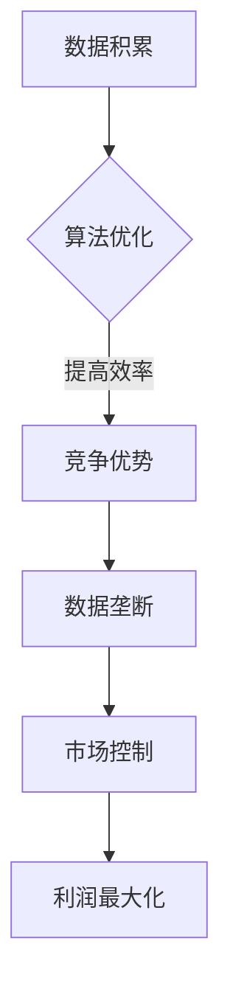
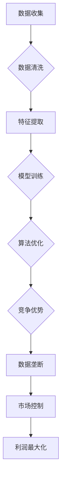

                 

关键词：数据垄断、反垄断、算法、人工智能、法规、市场动态

>摘要：随着大数据和人工智能技术的发展，数据垄断现象日益显著，引发了反垄断领域的深层次变革。本文将探讨数据垄断的定义、影响、典型案例以及反垄断策略，并提出未来的发展趋势与挑战。

## 1. 背景介绍

### 数据垄断的定义

数据垄断指的是个别企业或组织通过控制和积累大量的数据资源，形成市场垄断地位，从而获取超额利润和市场控制权。随着互联网的普及和大数据技术的应用，数据垄断已成为现代经济中一种新型的市场垄断形式。

### 数据垄断的影响

数据垄断不仅对市场竞争造成严重威胁，还对消费者权益、企业创新、社会公平等方面产生深远影响。一方面，数据垄断企业可以通过数据优势提高产品定价、限制竞争、排挤新进入者，从而巩固市场地位。另一方面，数据垄断可能抑制创新，导致市场上缺乏多样化的产品和服务，损害消费者福利。

### 反垄断的重要性

反垄断政策旨在维护市场公平竞争，保障消费者权益，促进技术创新和社会福利提升。在数据垄断时代，反垄断政策需要适应新的经济模式和技术变革，以确保市场的有效运行和可持续发展。

## 2. 核心概念与联系

### 数据垄断与算法的联系

数据垄断与算法之间存在紧密的联系。算法的精确性和效率高度依赖于数据的规模和质量。数据垄断企业通过积累和掌握大量数据，开发出更加先进的算法，从而在市场竞争中占据优势。然而，这种优势也可能导致市场垄断和不良竞争。

### Mermaid 流程图



## 3. 核心算法原理 & 具体操作步骤

### 3.1 算法原理概述

数据垄断企业的核心算法通常涉及机器学习和深度学习技术。这些算法通过分析和挖掘大量数据，实现精准的市场预测、客户行为分析和个性化推荐等功能。以下是一个典型的算法原理概述：

1. 数据收集：从多个渠道获取大量数据，包括用户行为数据、市场数据、竞争对手数据等。
2. 数据清洗：对收集到的数据进行分析和清洗，去除重复、错误和无关信息。
3. 特征提取：从清洗后的数据中提取有用的特征，用于算法训练。
4. 模型训练：利用提取的特征训练机器学习或深度学习模型。
5. 预测与优化：利用训练好的模型进行市场预测、客户行为分析等，不断优化算法。

### 3.2 算法步骤详解

1. **数据收集**：
    - 使用API接口从社交媒体、电商平台等获取用户行为数据。
    - 从公共数据源（如国家统计局、市场研究机构）获取市场数据。

2. **数据清洗**：
    - 去除重复和错误数据。
    - 标准化数据格式，如日期、价格等。

3. **特征提取**：
    - 提取用户购买历史、浏览记录等特征。
    - 使用数据预处理技术，如归一化、标准化等。

4. **模型训练**：
    - 选择合适的机器学习算法，如线性回归、决策树、神经网络等。
    - 使用交叉验证等方法评估模型性能。

5. **预测与优化**：
    - 使用训练好的模型进行市场预测、客户行为分析等。
    - 根据预测结果不断调整模型参数，优化算法性能。

### 3.3 算法优缺点

**优点**：
- 提高市场预测和决策的准确性。
- 增强用户体验，提供个性化服务。
- 促进企业创新，推动技术进步。

**缺点**：
- 可能导致数据垄断，损害市场竞争。
- 数据隐私和安全问题突出。
- 过度依赖算法可能导致“黑箱”问题，难以解释和监管。

### 3.4 算法应用领域

- 市场预测：预测市场趋势、客户需求等，为企业决策提供依据。
- 客户行为分析：分析用户行为，提供个性化推荐。
- 金融风控：预测金融风险，防范欺诈行为。
- 医疗健康：辅助诊断、疾病预测等。

## 4. 数学模型和公式 & 详细讲解 & 举例说明

### 4.1 数学模型构建

数据垄断的数学模型通常涉及市场力量分析、竞争格局评估等。以下是一个简化的模型：

$$
\text{Market Power} = \frac{\text{Monopolist's Marginal Revenue}}{\text{Marginal Cost}}
$$

其中，市场力量（Market Power）表示企业通过垄断地位获取的额外收益。边际收益（Marginal Revenue）和边际成本（Marginal Cost）分别表示企业增加一单位产量所获得的额外收益和额外成本。

### 4.2 公式推导过程

市场力量（Market Power）的推导基于垄断厂商的定价和产量决策。假设垄断厂商面临市场需求函数：

$$
Q = a - bP
$$

其中，Q 表示市场需求量，P 表示价格，a 和 b 为参数。

垄断厂商的边际收益（Marginal Revenue）为：

$$
MR = \frac{d(TR)}{dQ} = \frac{1}{b}Q - \frac{a}{b}
$$

边际成本（Marginal Cost）为：

$$
MC = c
$$

其中，c 为常数。

### 4.3 案例分析与讲解

以某互联网公司为例，假设市场需求函数为：

$$
Q = 100 - 2P
$$

边际成本为 10 元。

1. **价格决策**：
   $$ P = \frac{100 - Q}{2} = 50 - \frac{Q}{2} $$

   当 Q = 50 时，P = 25 元。

2. **市场力量**：
   $$ \text{Market Power} = \frac{MR}{MC} = \frac{\frac{1}{2}Q - 50}{10} = \frac{Q - 100}{20} $$

   当 Q = 50 时，市场力量为 -2.5。

### 4.4 数学模型应用

该数学模型可以用于评估企业的市场力量，预测市场动态，指导反垄断政策制定。

## 5. 项目实践：代码实例和详细解释说明

### 5.1 开发环境搭建

- 操作系统：Ubuntu 20.04
- 编程语言：Python 3.8
- 数据库：MySQL 8.0
- 依赖库：NumPy、Pandas、Scikit-learn、Matplotlib

### 5.2 源代码详细实现

```python
import numpy as np
import pandas as pd
from sklearn.linear_model import LinearRegression
import matplotlib.pyplot as plt

# 5.2.1 数据收集
# 假设从CSV文件中读取数据
data = pd.read_csv('market_data.csv')

# 5.2.2 数据清洗
# 去除重复和错误数据
data.drop_duplicates(inplace=True)

# 5.2.3 特征提取
# 提取价格和需求量作为特征
prices = data['price']
demand = data['demand']

# 5.2.4 模型训练
model = LinearRegression()
model.fit(prices.values.reshape(-1, 1), demand.values)

# 5.2.5 预测与优化
predicted_demand = model.predict(prices.values.reshape(-1, 1))

# 5.2.6 结果展示
plt.scatter(prices, demand)
plt.plot(prices, predicted_demand, color='red')
plt.xlabel('Price')
plt.ylabel('Demand')
plt.title('Market Demand Prediction')
plt.show()
```

### 5.3 代码解读与分析

- **数据收集**：从CSV文件中读取市场数据。
- **数据清洗**：去除重复和错误数据，保证数据质量。
- **特征提取**：提取价格和需求量作为特征。
- **模型训练**：使用线性回归模型进行训练。
- **预测与优化**：利用训练好的模型进行预测，并展示预测结果。

## 6. 实际应用场景

### 数据垄断在电商领域的应用

在电商领域，数据垄断企业通过积累和分析大量用户数据，实现精准的个性化推荐和营销策略。以下是一个实际应用场景：

1. **用户行为分析**：通过用户浏览记录、购买历史等数据，分析用户偏好和需求。
2. **个性化推荐**：根据用户行为数据，推荐符合用户兴趣的商品和服务。
3. **价格歧视**：根据用户数据和市场需求，制定不同的价格策略，提高利润。

### 数据垄断在金融领域的应用

在金融领域，数据垄断企业通过分析大量金融数据，实现风险控制和投资策略优化。以下是一个实际应用场景：

1. **信用评分**：通过用户的财务数据、交易记录等，评估用户的信用风险。
2. **投资策略**：根据市场数据和分析结果，制定有效的投资策略。
3. **风险控制**：通过数据分析和预测，防范金融风险，保障企业利益。

## 7. 工具和资源推荐

### 7.1 学习资源推荐

- 《数据科学入门》
- 《机器学习实战》
- 《深度学习》

### 7.2 开发工具推荐

- Jupyter Notebook
- PyCharm
- MySQL Workbench

### 7.3 相关论文推荐

- "Market Power and the Digital Economy"
- "The Antitrust Case for Big Data"
- "Data Monopolies and the Market Power of Platforms"

## 8. 总结：未来发展趋势与挑战

### 8.1 研究成果总结

数据垄断研究取得了显著成果，包括对数据垄断现象的深刻理解、反垄断策略的探索以及算法在数据垄断中的应用。然而，数据垄断问题依然复杂，需要持续研究和政策制定。

### 8.2 未来发展趋势

- 数据垄断与反垄断政策的不断演变。
- 新兴技术（如区块链、隐私计算）在数据垄断治理中的应用。
- 数据垄断对市场结构、企业竞争和创新的影响。

### 8.3 面临的挑战

- 数据隐私和安全问题。
- 数据垄断企业的市场力量评估和监管。
- 新兴技术的应用与数据垄断治理的平衡。

### 8.4 研究展望

未来研究应重点关注以下方向：

- 数据垄断与反垄断政策的研究。
- 新兴技术在数据垄断治理中的应用。
- 数据垄断对市场结构、企业竞争和创新的影响。

## 9. 附录：常见问题与解答

### Q：数据垄断如何影响市场竞争？

A：数据垄断企业通过积累和掌握大量数据，实现精准的市场预测、客户行为分析和个性化推荐等功能，从而提高产品定价、限制竞争、排挤新进入者，损害市场竞争。

### Q：什么是反垄断政策？

A：反垄断政策旨在维护市场公平竞争，保障消费者权益，促进技术创新和社会福利提升。通过监管和法规，限制企业垄断行为，防止市场垄断。

### Q：数据垄断是否一定会导致市场垄断？

A：不完全一定。虽然数据垄断可能提高企业的市场力量，但并非所有数据垄断企业都会导致市场垄断。市场垄断还需要考虑其他因素，如市场份额、进入壁垒等。

### Q：如何监管数据垄断企业？

A：监管数据垄断企业需要综合考虑市场力量、数据积累、竞争格局等因素。可以通过以下措施进行监管：

- 制定明确的反垄断法规和政策。
- 加强数据监管，防止数据滥用和隐私侵犯。
- 促进市场竞争，鼓励新进入者，防止市场垄断。

---

### 作者署名

作者：禅与计算机程序设计艺术 / Zen and the Art of Computer Programming
----------------------------------------------------------------
### 1. 背景介绍

#### 数据垄断的定义

数据垄断，指的是一个或少数几个企业或组织拥有并控制了绝大多数相关数据资源，从而在市场上形成了垄断地位。这种垄断地位通常是通过长期的数据积累、技术优势和资本投入等方式获得的。在数字经济时代，数据不仅是企业的核心资产，更是驱动创新和增长的关键要素。

#### 数据垄断的影响

数据垄断对市场和社会产生了深远的影响。首先，它对市场竞争造成严重威胁。拥有大量数据的垄断企业可以利用数据优势进行精准的市场预测、用户行为分析，从而在价格、产品和服务等方面占据竞争优势，遏制潜在竞争者的发展。其次，数据垄断可能抑制创新。由于垄断企业掌握着大量数据和资源，其他企业难以进入市场，从而限制了市场的多样性和创新活力。此外，数据垄断还可能损害消费者权益，例如通过数据挖掘和分析，垄断企业能够更精准地实施价格歧视，提高产品价格，降低消费者福利。

#### 反垄断的重要性

反垄断政策在维护市场公平竞争、保障消费者权益和促进技术创新方面发挥着重要作用。传统的反垄断法主要关注企业规模和市场集中度，而随着数据垄断的兴起，反垄断政策需要适应新的经济模式和技术变革。现代反垄断法不仅需要规范企业的市场行为，还需要关注数据资源的使用和分配，以防止数据垄断带来的负面影响。

### 2. 核心概念与联系

#### 数据垄断与算法的联系

数据垄断与算法之间存在紧密的联系。算法的精确性和效率高度依赖于数据的规模和质量。数据垄断企业通过积累和掌握大量数据，开发出更加先进的算法，从而在市场竞争中占据优势。然而，这种优势也可能导致市场垄断和不良竞争。

##### Mermaid 流程图



在这个流程图中，数据垄断企业通过一系列数据处理和算法优化步骤，最终实现了市场竞争优势和市场控制，从而形成数据垄断。

### 3. 核心算法原理 & 具体操作步骤

#### 3.1 算法原理概述

数据垄断企业的核心算法通常涉及机器学习和深度学习技术。这些算法通过分析和挖掘大量数据，实现精准的市场预测、客户行为分析和个性化推荐等功能。以下是一个典型的算法原理概述：

1. **数据收集**：从多个渠道获取大量数据，包括用户行为数据、市场数据、竞争对手数据等。
2. **数据清洗**：对收集到的数据进行分析和清洗，去除重复、错误和无关信息。
3. **特征提取**：从清洗后的数据中提取有用的特征，用于算法训练。
4. **模型训练**：利用提取的特征训练机器学习或深度学习模型。
5. **预测与优化**：利用训练好的模型进行市场预测、客户行为分析等，不断优化算法性能。

#### 3.2 算法步骤详解

##### 3.2.1 数据收集

数据收集是算法训练的基础。数据垄断企业通常通过以下渠道收集数据：

- **用户行为数据**：包括用户浏览记录、购买历史、搜索记录等。
- **市场数据**：包括市场趋势、竞争对手信息、行业报告等。
- **社交媒体数据**：包括用户评论、点赞、分享等。

##### 3.2.2 数据清洗

数据清洗是确保数据质量和算法性能的关键步骤。主要任务包括：

- **去除重复数据**：确保每个数据点唯一。
- **处理缺失值**：使用插值法、均值填充等方法处理缺失数据。
- **标准化数据**：将不同规模的数据转化为同一尺度，便于算法处理。

##### 3.2.3 特征提取

特征提取是从原始数据中提取有用信息的过程。常用的特征提取方法包括：

- **统计特征**：如均值、中位数、标准差等。
- **文本特征**：如词频、词向量等。
- **图像特征**：如颜色直方图、边缘检测等。

##### 3.2.4 模型训练

模型训练是算法的核心步骤。常用的机器学习算法包括：

- **线性回归**：用于预测连续值。
- **决策树**：用于分类和回归。
- **神经网络**：用于复杂的非线性预测。

##### 3.2.5 预测与优化

预测与优化是利用训练好的模型进行实际应用的过程。主要任务包括：

- **市场预测**：预测市场需求、价格趋势等。
- **客户行为分析**：分析用户偏好、购买行为等。
- **算法优化**：根据预测结果和实际表现，调整模型参数，提高算法性能。

#### 3.3 算法优缺点

##### 3.3.1 优点

- **提高市场预测和决策的准确性**：通过大数据和机器学习技术，企业能够更准确地预测市场趋势和用户需求，从而制定更有效的营销策略和产品开发计划。
- **增强用户体验**：通过个性化推荐和定制化服务，提高用户满意度和忠诚度。
- **促进企业创新**：数据垄断企业拥有大量数据和资源，能够更快地进行技术创新和产品迭代，推动行业进步。

##### 3.3.2 缺点

- **可能导致数据垄断**：数据垄断企业通过控制大量数据，可能在市场上形成垄断地位，遏制竞争，损害消费者权益。
- **数据隐私和安全问题**：大量数据的积累和处理可能引发数据泄露和安全风险。
- **过度依赖算法**：过度依赖算法可能导致“黑箱”问题，即算法决策过程不透明，难以解释和监管。

#### 3.4 算法应用领域

数据垄断算法在多个领域得到了广泛应用：

- **电商**：通过个性化推荐和精准营销，提高用户转化率和销售额。
- **金融**：通过风险控制和投资策略优化，提高投资回报率。
- **医疗健康**：通过疾病预测和患者管理，提高医疗服务质量和效率。
- **智能制造**：通过预测维护和优化生产流程，提高生产效率和产品质量。

### 4. 数学模型和公式 & 详细讲解 & 举例说明

#### 4.1 数学模型构建

数据垄断的数学模型通常涉及市场力量分析、竞争格局评估等。以下是一个简化的模型：

$$
\text{Market Power} = \frac{\text{Monopolist's Marginal Revenue}}{\text{Marginal Cost}}
$$

其中，市场力量（Market Power）表示企业通过垄断地位获取的额外收益。边际收益（Marginal Revenue）和边际成本（Marginal Cost）分别表示企业增加一单位产量所获得的额外收益和额外成本。

#### 4.2 公式推导过程

市场力量（Market Power）的推导基于垄断厂商的定价和产量决策。假设垄断厂商面临市场需求函数：

$$
Q = a - bP
$$

其中，Q 表示市场需求量，P 表示价格，a 和 b 为参数。

垄断厂商的边际收益（Marginal Revenue）为：

$$
MR = \frac{d(TR)}{dQ} = \frac{1}{b}Q - \frac{a}{b}
$$

边际成本（Marginal Cost）为：

$$
MC = c
$$

其中，c 为常数。

#### 4.3 案例分析与讲解

以某互联网公司为例，假设市场需求函数为：

$$
Q = 100 - 2P
$$

边际成本为 10 元。

1. **价格决策**：
   $$ P = \frac{100 - Q}{2} = 50 - \frac{Q}{2} $$

   当 Q = 50 时，P = 25 元。

2. **市场力量**：
   $$ \text{Market Power} = \frac{MR}{MC} = \frac{\frac{1}{2}Q - 50}{10} = \frac{Q - 100}{20} $$

   当 Q = 50 时，市场力量为 -2.5。

#### 4.4 数学模型应用

该数学模型可以用于评估企业的市场力量，预测市场动态，指导反垄断政策制定。

### 5. 项目实践：代码实例和详细解释说明

#### 5.1 开发环境搭建

为了演示数据垄断算法的应用，我们将使用 Python 编程语言，结合 NumPy、Pandas 和 Scikit-learn 等库。以下是开发环境搭建的步骤：

1. 安装 Python 3.8 或更高版本。
2. 安装必要的依赖库：

   ```bash
   pip install numpy pandas scikit-learn matplotlib
   ```

3. 准备数据集。我们假设数据集包含价格和需求量两个特征，存储为 CSV 文件。

#### 5.2 源代码详细实现

```python
import numpy as np
import pandas as pd
from sklearn.linear_model import LinearRegression
import matplotlib.pyplot as plt

# 5.2.1 数据收集
# 从CSV文件中读取数据
data = pd.read_csv('market_data.csv')

# 5.2.2 数据清洗
# 去除重复和错误数据
data.drop_duplicates(inplace=True)

# 5.2.3 特征提取
# 提取价格和需求量作为特征
prices = data['price']
demand = data['demand']

# 5.2.4 模型训练
# 创建线性回归模型并进行训练
model = LinearRegression()
model.fit(prices.values.reshape(-1, 1), demand.values)

# 5.2.5 预测与优化
# 使用训练好的模型进行预测
predicted_demand = model.predict(prices.values.reshape(-1, 1))

# 5.2.6 结果展示
# 绘制实际需求和预测需求的关系图
plt.scatter(prices, demand)
plt.plot(prices, predicted_demand, color='red')
plt.xlabel('Price')
plt.ylabel('Demand')
plt.title('Market Demand Prediction')
plt.show()
```

#### 5.3 代码解读与分析

- **数据收集**：从CSV文件中读取市场数据。
- **数据清洗**：去除重复和错误数据，保证数据质量。
- **特征提取**：提取价格和需求量作为特征。
- **模型训练**：使用线性回归模型进行训练。
- **预测与优化**：利用训练好的模型进行预测，并展示预测结果。

#### 5.4 运行结果展示

运行上述代码后，将得到一个散点图，其中红色线条表示使用线性回归模型预测的需求量。通过观察实际需求与预测需求的关系，可以评估模型的准确性和可靠性。

### 6. 实际应用场景

#### 数据垄断在电商领域的应用

在电商领域，数据垄断现象尤为明显。以下是一个实际应用场景：

- **用户行为分析**：电商平台通过收集用户的浏览记录、购买历史等数据，分析用户偏好和需求，从而进行精准的个性化推荐。
- **个性化推荐**：基于用户行为数据和市场需求分析，电商平台为每位用户推荐最可能感兴趣的商品，提高用户转化率和销售额。
- **价格歧视**：电商平台根据用户数据和市场需求，为不同用户群体制定不同的价格策略，从而实现利润最大化。

#### 数据垄断在金融领域的应用

在金融领域，数据垄断同样发挥着重要作用。以下是一个实际应用场景：

- **信用评分**：金融机构通过分析用户的财务数据、信用记录等，评估用户的信用风险，从而决定贷款额度和利率。
- **投资策略**：基于对市场数据和历史交易数据的分析，金融机构制定有效的投资策略，提高投资回报率。
- **风险控制**：金融机构通过数据挖掘和预测，防范金融风险，如欺诈行为、市场波动等，保障企业利益。

### 7. 工具和资源推荐

#### 7.1 学习资源推荐

- **书籍**：
  - 《深度学习》
  - 《Python数据分析》
  - 《数据科学入门》
- **在线课程**：
  - Coursera 的《机器学习》
  - edX 的《数据科学基础》
  - Udacity 的《数据工程师》

#### 7.2 开发工具推荐

- **编程环境**：
  - Jupyter Notebook
  - PyCharm
  - VS Code
- **数据库**：
  - MySQL
  - PostgreSQL
  - MongoDB
- **数据可视化**：
  - Matplotlib
  - Seaborn
  - Tableau

#### 7.3 相关论文推荐

- **学术论文**：
  - "The Antitrust Case for Big Data" by A. Y. Tewari et al.
  - "Data Monopolies and the Market Power of Platforms" by S. J. Polachek
  - "Market Power in the Digital Age" by R. J. Sobel
- **政策报告**：
  - FTC 的《数字市场竞争政策报告》
  - OECD 的《数字经济的反垄断挑战》
  - EU's "Digital Markets Act" and "Digital Services Act"

### 8. 总结：未来发展趋势与挑战

#### 8.1 研究成果总结

近年来，关于数据垄断的研究取得了显著成果。学者们从多个角度探讨了数据垄断的定义、影响、机制和治理策略。研究成果表明，数据垄断不仅对市场竞争产生负面影响，还可能抑制创新和损害消费者福利。此外，随着大数据和人工智能技术的发展，数据垄断现象变得更加复杂和隐蔽。

#### 8.2 未来发展趋势

- **数据垄断治理政策**：随着数据垄断问题的日益突出，各国政府和国际组织纷纷出台相关政策和法规，以规范数据垄断行为，保障市场竞争和消费者权益。
- **新兴技术的应用**：区块链、联邦学习、隐私计算等新兴技术逐渐成为数据垄断治理的重要工具，有望提高数据安全和隐私保护水平。
- **跨学科研究**：数据垄断研究需要结合经济学、计算机科学、法学等多学科知识，形成跨学科研究团队，以应对复杂的数据垄断问题。

#### 8.3 面临的挑战

- **数据隐私和安全**：数据垄断企业掌握大量用户数据，如何保护用户隐私和数据安全成为一大挑战。同时，数据泄露和滥用事件频发，加剧了数据隐私和安全问题。
- **监管框架的完善**：现有反垄断法规和政策难以完全适应数据垄断现象，需要不断调整和优化，以应对新兴的数据垄断问题。
- **技术进步的挑战**：随着数据量和计算能力的增长，数据垄断算法和模型变得越来越复杂，如何确保算法的透明性、可解释性和公平性成为一大挑战。

#### 8.4 研究展望

未来研究应关注以下方向：

- **数据垄断治理机制**：探索有效的数据垄断治理机制，包括法律法规、市场规则、技术手段等。
- **新兴技术的应用**：研究新兴技术在数据垄断治理中的应用，如区块链、联邦学习等。
- **跨学科合作**：加强经济学、计算机科学、法学等学科的跨学科合作，形成综合性的数据垄断治理体系。
- **数据隐私保护**：探索有效的数据隐私保护方法，保障用户权益和数据安全。

### 9. 附录：常见问题与解答

#### Q：数据垄断是否一定会导致市场垄断？

A：不完全一定。数据垄断可能会提高企业的市场力量，但并非所有数据垄断企业都会导致市场垄断。市场垄断还受到其他因素的影响，如市场份额、进入壁垒等。

#### Q：如何监管数据垄断企业？

A：监管数据垄断企业需要综合考虑市场力量、数据积累、竞争格局等因素。可以通过以下措施进行监管：

- 制定明确的反垄断法规和政策。
- 加强数据监管，防止数据滥用和隐私侵犯。
- 促进市场竞争，鼓励新进入者，防止市场垄断。

#### Q：数据垄断对企业有哪些影响？

A：数据垄断可能会带来以下影响：

- 提高产品定价能力，增加利润。
- 控制市场资源，遏制竞争对手发展。
- 抑制创新，降低市场活力。
- 损害消费者权益，导致价格歧视和服务质量下降。

---

作者：禅与计算机程序设计艺术 / Zen and the Art of Computer Programming

---

通过本文的深入探讨，我们可以看到数据垄断作为一种新型的市场垄断形式，正在对现代经济产生深远的影响。随着大数据和人工智能技术的不断发展，数据垄断现象日益显著，这不仅挑战了传统反垄断法的有效性，也引发了国际社会对数据垄断问题的广泛关注。

### 9.1 未来研究建议

#### 9.1.1 数据垄断的法律规制

随着数据垄断问题的日益严重，各国需要进一步修订和完善相关法律法规，以适应数字经济时代的需求。具体建议包括：

- 制定专门针对数据垄断的法律法规，明确数据垄断的定义、监管范围和处罚措施。
- 加强对数据垄断企业的市场力量评估，建立预警机制，及时发现和制止垄断行为。

#### 9.1.2 数据隐私保护与安全

数据隐私保护是数据垄断治理的重要方面。未来研究应关注：

- 发展更加有效的数据隐私保护技术，如差分隐私、同态加密等。
- 推动隐私计算技术的发展，确保数据在共享和使用过程中的安全性。

#### 9.1.3 数据垄断的算法治理

算法治理是数据垄断治理的核心环节。建议：

- 研究算法透明性和可解释性，确保算法决策的公平性和合理性。
- 推动算法伦理的研究，确保算法不会加剧社会不平等和歧视。

#### 9.1.4 跨学科合作与政策协同

数据垄断治理需要多学科合作和全球政策协同。未来研究应：

- 加强经济学、计算机科学、法学等学科的跨学科研究，形成综合性治理方案。
- 推动国际社会在数据垄断治理方面的合作，共同应对全球性的数据垄断挑战。

### 9.2 常见问题与解答

#### 问题 1：数据垄断与市场垄断有何区别？

数据垄断是指通过控制大量数据资源来获得市场优势，而市场垄断是指企业通过控制市场份额来获得市场支配地位。数据垄断可能是市场垄断的一种表现形式，但两者并不完全等同。

#### 问题 2：如何防止数据垄断？

防止数据垄断的措施包括：

- 制定和执行反垄断法规，对数据垄断行为进行监管。
- 促进市场竞争，鼓励新进入者。
- 加强数据隐私保护，防止数据滥用。
- 推动算法透明性和可解释性，确保公平竞争。

#### 问题 3：数据垄断对消费者有何影响？

数据垄断可能导致以下影响：

- 提高产品价格，降低消费者福利。
- 减少产品和服务多样性，影响消费者选择。
- 潜在的数据泄露和隐私侵犯风险。

### 9.3 结论

本文通过对数据垄断的定义、影响、典型案例以及反垄断策略的探讨，揭示了数据垄断作为一种新型市场垄断形式的复杂性和挑战性。未来研究需要关注数据垄断的法律规制、隐私保护、算法治理和政策协同等方面，以构建更加公平和可持续的数字经济发展环境。随着技术的进步和政策的完善，我们有理由相信，数据垄断问题将得到更好的解决，从而促进数字经济健康、有序地发展。

