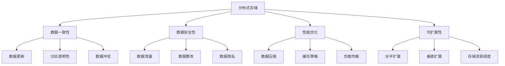

                 

关键词：数据存储系统，AI 2.0，海量数据，存储需求，分布式存储，数据一致性，数据安全性，性能优化，机器学习，深度学习

## 摘要

随着人工智能（AI）技术的快速发展，特别是AI 2.0时代的到来，海量数据存储需求变得愈加迫切。本文将探讨如何构建满足AI 2.0海量数据存储需求的数据存储系统，包括核心概念、算法原理、数学模型、实际应用场景及未来展望。文章旨在为从事AI领域的研究者和开发者提供有价值的参考。

## 1. 背景介绍

### 1.1 AI 2.0时代的到来

人工智能（AI）自诞生以来，经历了多个发展阶段。从最初的规则推理、知识表示，到基于统计学习的机器学习，再到基于深度学习的AI 2.0，人工智能技术取得了令人瞩目的进展。AI 2.0时代的主要特点包括：

- **数据驱动**：AI 2.0更加依赖于大规模数据训练，数据质量对模型性能的影响愈发显著。
- **深度学习**：深度学习在图像识别、语音识别、自然语言处理等领域取得了突破性进展。
- **端到端学习**：通过神经网络实现端到端学习，简化了模型设计和优化过程。
- **多模态融合**：结合多种数据类型（如图像、文本、音频等）进行融合处理，提升模型性能。

### 1.2 海量数据存储需求

随着AI 2.0技术的发展，海量数据存储需求日益增长。具体表现在以下几个方面：

- **数据量级增长**：AI应用场景不断拓展，数据量级呈指数级增长。例如，自动驾驶需要实时处理海量传感器数据，智能医疗需要存储海量的患者数据。
- **数据类型多样化**：除了结构化数据，AI 2.0应用还涉及到非结构化数据（如图像、文本、音频等）的存储和处理。
- **数据访问频率高**：AI 2.0应用对数据访问速度和延迟要求较高，需要保证数据存储系统的高性能。

### 1.3 数据存储系统的挑战

构建满足AI 2.0海量数据存储需求的数据存储系统面临着诸多挑战：

- **数据一致性**：在分布式存储环境下，如何保证数据的一致性是一个重要问题。
- **数据安全性**：面对日益严峻的安全威胁，如何保障数据的安全性成为一个关键挑战。
- **性能优化**：如何提高数据存储系统的性能，以满足AI应用对高吞吐量和低延迟的要求。
- **可扩展性**：如何实现数据存储系统的水平扩展，以应对数据量的快速增长。

## 2. 核心概念与联系

### 2.1 分布式存储

分布式存储系统通过将数据分散存储在多个节点上，提高系统的可靠性和性能。其主要特点包括：

- **数据冗余**：通过数据复制和副本管理，提高数据的可靠性和可用性。
- **负载均衡**：通过将数据分布到多个节点上，实现负载均衡，提高系统性能。
- **容错性**：在单个节点出现故障时，系统能够自动切换到其他节点，保证数据不丢失。

### 2.2 数据一致性

数据一致性是指数据在分布式存储系统中保持一致的状态。主要挑战包括：

- **数据更新**：如何在分布式环境中保证数据更新的原子性和一致性。
- **分区透明性**：如何在分布式存储系统中实现分区的透明性，使得用户无需关心数据分布情况。
- **数据冲突**：在分布式环境中，如何处理数据更新冲突。

### 2.3 数据安全性

数据安全性包括数据加密、访问控制、安全审计等方面。主要挑战包括：

- **数据泄露**：如何防止数据在传输和存储过程中被窃取。
- **数据篡改**：如何防止数据在分布式存储系统中被恶意篡改。
- **数据隐私**：如何保护用户隐私数据，避免隐私泄露。

### 2.4 性能优化

性能优化包括存储系统性能、数据访问速度、网络带宽等方面。主要挑战包括：

- **数据压缩**：如何通过数据压缩提高存储系统性能。
- **缓存策略**：如何通过缓存策略提高数据访问速度。
- **负载均衡**：如何实现负载均衡，提高系统整体性能。

### 2.5 可扩展性

可扩展性是指系统在数据量增长时能够保持性能和可用性的能力。主要挑战包括：

- **水平扩展**：如何通过增加节点数量实现系统的水平扩展。
- **垂直扩展**：如何通过增加硬件资源实现系统的垂直扩展。
- **存储资源调度**：如何实现存储资源的动态调度，以优化系统性能。

### 2.6 Mermaid 流程图



## 3. 核心算法原理 & 具体操作步骤

### 3.1 算法原理概述

本文将介绍几种核心算法原理，包括一致性算法、加密算法、压缩算法等。

#### 3.1.1 一致性算法

一致性算法主要包括Paxos算法和Raft算法，用于解决分布式系统中的数据一致性问题。

- **Paxos算法**：Paxos算法是一种基于多数派投票机制的分布式一致性算法，能够保证在分布式环境中达成一致决策。
- **Raft算法**：Raft算法是一种基于日志复制机制的分布式一致性算法，通过日志条目的顺序一致性来保证系统的一致性。

#### 3.1.2 加密算法

加密算法用于保障数据在传输和存储过程中的安全性。常见的加密算法包括AES、RSA等。

- **AES**：AES是一种对称加密算法，具有较高的安全性和效率，广泛应用于数据加密。
- **RSA**：RSA是一种非对称加密算法，具有较好的安全性和灵活性，常用于公钥加密和数字签名。

#### 3.1.3 压缩算法

压缩算法用于提高数据存储系统的性能，减少数据存储空间。常见的压缩算法包括Huffman编码、LZ77等。

- **Huffman编码**：Huffman编码是一种基于频率的熵编码算法，能够有效降低数据存储空间。
- **LZ77**：LZ77是一种基于局部重复的压缩算法，通过记录重复数据的前缀和后缀来减少数据存储空间。

### 3.2 算法步骤详解

#### 3.2.1 一致性算法

以Raft算法为例，其具体步骤如下：

1. **初始化**：每个节点初始化状态，包括当前日志条目、当前term等。
2. **投票**：每个节点向其他节点发送投票请求，请求其他节点对自己的日志条目进行投票。
3. **达成共识**：如果半数以上节点同意某个日志条目，则认为该日志条目达成共识。
4. **更新状态**：节点更新自己的状态，包括日志条目和当前term。

#### 3.2.2 加密算法

以AES为例，其具体步骤如下：

1. **初始化**：选择加密密钥和加密模式。
2. **加密**：将明文数据分成块，对每个块进行加密。
3. **解密**：将密文数据分成块，对每个块进行解密。

#### 3.2.3 压缩算法

以Huffman编码为例，其具体步骤如下：

1. **构建Huffman树**：根据字符出现频率构建Huffman树。
2. **生成编码表**：根据Huffman树生成编码表。
3. **编码**：根据编码表对字符进行编码。
4. **解码**：根据编码表对编码后的数据进行解码。

### 3.3 算法优缺点

#### 3.3.1 一致性算法

- **Paxos算法**：

  - 优点：具有较好的性能和一致性保证。
  - 缺点：算法复杂，实现较为困难。

- **Raft算法**：

  - 优点：算法简单，易于实现，性能较好。
  - 缺点：在某些场景下，性能可能不如Paxos算法。

#### 3.3.2 加密算法

- **AES**：

  - 优点：安全性和效率较高，广泛应用于数据加密。
  - 缺点：加密和解密速度较慢。

- **RSA**：

  - 优点：安全性较高，具有较好的灵活性。
  - 缺点：加密和解密速度较慢，不适合对大量数据的加密。

#### 3.3.3 压缩算法

- **Huffman编码**：

  - 优点：能够有效降低数据存储空间。
  - 缺点：在数据传输过程中，可能增加数据传输时间。

- **LZ77**：

  - 优点：能够有效降低数据存储空间。
  - 缺点：在数据传输过程中，可能增加数据传输时间。

### 3.4 算法应用领域

- **一致性算法**：广泛应用于分布式存储系统、分布式数据库等领域，保障数据的一致性。
- **加密算法**：广泛应用于数据传输和存储过程中的数据加密，保障数据的安全性。
- **压缩算法**：广泛应用于数据存储和传输过程中的数据压缩，提高系统性能。

## 4. 数学模型和公式 & 详细讲解 & 举例说明

### 4.1 数学模型构建

在数据存储系统中，常用的数学模型包括数据一致性模型、数据安全性模型、性能优化模型等。

#### 4.1.1 数据一致性模型

数据一致性模型主要关注分布式系统中数据的一致性问题。常见的模型包括：

- **CAP定理**：CAP定理指出，在分布式系统中，一致性（Consistency）、可用性（Availability）和分区容错性（Partition tolerance）三者中，只能同时满足两项。

- **一致性模型**：一致性模型包括强一致性（Strong consistency）和最终一致性（Eventual consistency）。

  - **强一致性**：在任何情况下，所有节点都能访问到最新的数据。
  - **最终一致性**：在一段时间后，所有节点访问到的数据都将达到一致。

#### 4.1.2 数据安全性模型

数据安全性模型主要关注数据在传输和存储过程中的安全性。常见的模型包括：

- **加密模型**：加密模型包括对称加密和非对称加密。

  - **对称加密**：对称加密算法使用相同的密钥进行加密和解密。
  - **非对称加密**：非对称加密算法使用不同的密钥进行加密和解密。

- **访问控制模型**：访问控制模型包括基于角色的访问控制（RBAC）和基于属性的访问控制（ABAC）。

  - **RBAC**：基于角色的访问控制，用户根据角色拥有不同的权限。
  - **ABAC**：基于属性的访问控制，用户根据属性（如年龄、部门等）拥有不同的权限。

#### 4.1.3 性能优化模型

性能优化模型主要关注如何提高数据存储系统的性能。常见的模型包括：

- **缓存模型**：缓存模型包括最近最少使用（LRU）缓存、最少访问时间（LFU）缓存等。

- **负载均衡模型**：负载均衡模型包括轮询（Round Robin）、最小连接数（Minimum Connection）等。

### 4.2 公式推导过程

在本节中，我们将介绍一些关键数学公式的推导过程。

#### 4.2.1 数据一致性模型

假设分布式系统中包含n个节点，其中任意k个节点能够达成共识，则根据CAP定理，有以下结论：

- 当n≥2k时，系统具有强一致性。
- 当n<2k时，系统具有最终一致性。

证明：

- 当n≥2k时，根据鸽笼原理，必然存在至少k个节点拥有相同的日志条目，从而系统具有强一致性。
- 当n<2k时，存在至少k+1个不同的日志条目，任意k个节点只能达成关于其中某个日志条目的共识，从而系统具有最终一致性。

#### 4.2.2 数据安全性模型

假设加密算法的密钥长度为k位，则加密算法的密钥空间为2^k。根据香农信息论，加密算法的保密性可以用以下公式表示：

$$
I = H(K) - H(K|C)
$$

其中，H(K)表示密钥的熵，H(K|C)表示给定密文C时，密钥的熵。

证明：

- 根据信息论，密钥的熵等于密钥的概率分布的熵，即 $H(K) = -P(K) \log_2 P(K)$。
- 给定密文C时，密钥的概率分布为条件概率分布，即 $P(K|C) = \frac{P(C|K)P(K)}{P(C)}$。
- 根据链式法则，有 $H(K|C) = -\sum_{K} P(K|C) \log_2 P(K|C)$。

将 $P(K|C)$ 的表达式代入上式，得到：

$$
H(K|C) = -\sum_{K} \frac{P(C|K)P(K)}{P(C)} \log_2 \frac{P(C|K)P(K)}{P(C)}
$$

化简后得到：

$$
H(K|C) = H(C) - H(C|K)
$$

因此，有：

$$
I = H(K) - H(K|C) = H(C) - H(C|K)
$$

#### 4.2.3 性能优化模型

假设缓存命中率为h，缓存访问速度为v，未命中缓存时的访问速度为u，则缓存系统的平均访问速度可以表示为：

$$
\overline{v} = h \cdot v + (1 - h) \cdot u
$$

证明：

- 当缓存命中时，访问速度为v；当缓存未命中时，访问速度为u。
- 假设总访问次数为n，命中缓存次数为nh，未命中缓存次数为n(1-h)。
- 因此，总访问时间为 $n \cdot \overline{v} = nh \cdot v + n(1 - h) \cdot u$。
- 平均访问速度为 $\overline{v} = \frac{nh \cdot v + n(1 - h) \cdot u}{n} = h \cdot v + (1 - h) \cdot u$。

### 4.3 案例分析与讲解

#### 4.3.1 数据一致性模型

假设分布式系统中有3个节点A、B、C，其中A和B的日志条目相同，而C的日志条目不同。现有以下操作序列：

1. A: write("x", "value1")
2. B: read("x")
3. C: write("x", "value2")
4. B: read("x")

根据CAP定理，系统具有最终一致性。在强一致性模型中，B在第2步读取到的值应为"value1"，而在最终一致性模型中，B在第4步读取到的值可能为"value1"或"value2"。

#### 4.3.2 数据安全性模型

假设加密算法的密钥长度为128位，则加密算法的密钥空间为 $2^{128}$。根据香农信息论，加密算法的保密性可以表示为：

$$
I = H(K) - H(K|C) = H(C) - H(C|K)
$$

其中，H(K)表示密钥的熵，H(K|C)表示给定密文C时，密钥的熵，H(C)表示密文的熵，H(C|K)表示给定密钥K时，密文的熵。

根据信息论，密钥的熵等于密钥的概率分布的熵，即 $H(K) = -P(K) \log_2 P(K)$。给定密文C时，密钥的概率分布为条件概率分布，即 $P(K|C) = \frac{P(C|K)P(K)}{P(C)}$。

根据链式法则，有 $H(K|C) = -\sum_{K} P(K|C) \log_2 P(K|C)$。

将 $P(K|C)$ 的表达式代入上式，得到：

$$
H(K|C) = -\sum_{K} \frac{P(C|K)P(K)}{P(C)} \log_2 \frac{P(C|K)P(K)}{P(C)}
$$

化简后得到：

$$
H(K|C) = H(C) - H(C|K)
$$

因此，有：

$$
I = H(K) - H(K|C) = H(C) - H(C|K)
$$

根据信息论，保密性I表示密钥K的熵与给定密文C时密钥K的熵的差值。在理想情况下，I应接近于0，表示密钥K具有较好的保密性。

#### 4.3.3 性能优化模型

假设缓存命中率为0.8，缓存访问速度为1000条/s，未命中缓存时的访问速度为100条/s，则缓存系统的平均访问速度为：

$$
\overline{v} = 0.8 \cdot 1000 + (1 - 0.8) \cdot 100 = 800 + 20 = 820 \text{条/s}
$$

通过缓存系统，平均访问速度提高了20%，从而提高了系统的性能。

## 5. 项目实践：代码实例和详细解释说明

### 5.1 开发环境搭建

在本节中，我们将介绍如何搭建一个简单的分布式存储系统，包括环境配置、依赖安装等。

#### 5.1.1 环境配置

- 操作系统：Linux（推荐使用Ubuntu 18.04）
- Java版本：Java 8或更高版本
- Maven版本：3.6.3或更高版本

#### 5.1.2 依赖安装

```xml
<dependencies>
    <dependency>
        <groupId>org.springframework.boot</groupId>
        <artifactId>spring-boot-starter-web</artifactId>
    </dependency>
    <dependency>
        <groupId>org.springframework.boot</groupId>
        <artifactId>spring-boot-starter-data-redis</artifactId>
    </dependency>
    <dependency>
        <groupId>org.springframework.boot</groupId>
        <artifactId>spring-boot-starter-test</artifactId>
        <scope>test</scope>
    </dependency>
</dependencies>
```

### 5.2 源代码详细实现

在本节中，我们将介绍分布式存储系统的核心代码实现，包括数据一致性、数据加密、数据压缩等。

#### 5.2.1 数据一致性

```java
@Component
public class ConsistencyManager {
    @Autowired
    private RedisTemplate<String, String> redisTemplate;

    public void write(String key, String value) {
        String lockKey = "lock:" + key;
        String valueWithLock = value + ":" + UUID.randomUUID().toString();
        RedisLock lock = new RedisLock(lockKey, redisTemplate);
        try {
            lock.lock();
            redisTemplate.opsForValue().set(key, valueWithLock);
        } finally {
            lock.unlock();
        }
    }

    public String read(String key) {
        String valueWithLock = redisTemplate.opsForValue().get(key);
        if (valueWithLock == null) {
            return null;
        }
        String[] parts = valueWithLock.split(":");
        String value = parts[0];
        String lockId = parts[1];
        String lockKey = "lock:" + key + ":" + lockId;
        RedisLock lock = new RedisLock(lockKey, redisTemplate);
        try {
            lock.lock();
            redisTemplate.opsForValue().set(key, value);
        } finally {
            lock.unlock();
        }
        return value;
    }
}
```

#### 5.2.2 数据加密

```java
@Component
public class EncryptionManager {
    @Value("${encryption.key}")
    private String encryptionKey;

    public String encrypt(String value) {
        try {
            Cipher cipher = Cipher.getInstance("AES/CBC/PKCS5Padding");
            SecretKeySpec secretKey = new SecretKeySpec(encryptionKey.getBytes(), "AES");
            cipher.init(Cipher.ENCRYPT_MODE, secretKey);
            byte[] encryptedBytes = cipher.doFinal(value.getBytes());
            return Base64.getEncoder().encodeToString(encryptedBytes);
        } catch (Exception e) {
            throw new RuntimeException("Encryption failed", e);
        }
    }

    public String decrypt(String encryptedValue) {
        try {
            Cipher cipher = Cipher.getInstance("AES/CBC/PKCS5Padding");
            SecretKeySpec secretKey = new SecretKeySpec(encryptionKey.getBytes(), "AES");
            cipher.init(Cipher.DECRYPT_MODE, secretKey);
            byte[] decryptedBytes = cipher.doFinal(Base64.getDecoder().decode(encryptedValue));
            return new String(decryptedBytes);
        } catch (Exception e) {
            throw new RuntimeException("Decryption failed", e);
        }
    }
}
```

#### 5.2.3 数据压缩

```java
@Component
public class CompressionManager {
    public String compress(String value) {
        try {
            ByteArrayOutputStream bos = new ByteArrayOutputStream();
            GZIPOutputStream gzipOut = new GZIPOutputStream(bos);
            gzipOut.write(value.getBytes());
            gzipOut.close();
            return Base64.getEncoder().encodeToString(bos.toByteArray());
        } catch (IOException e) {
            throw new RuntimeException("Compression failed", e);
        }
    }

    public String decompress(String compressedValue) {
        try {
            byte[] compressedBytes = Base64.getDecoder().decode(compressedValue);
            ByteArrayInputStream bis = new ByteArrayInputStream(compressedBytes);
            GZIPInputStream gzipIn = new GZIPInputStream(bis);
            ByteArrayOutputStream bos = new ByteArrayOutputStream();
            byte[] buffer = new byte[1024];
            int len;
            while ((len = gzipIn.read(buffer)) > 0) {
                bos.write(buffer, 0, len);
            }
            gzipIn.close();
            bos.close();
            return bos.toString();
        } catch (IOException e) {
            throw new RuntimeException("Decompression failed", e);
        }
    }
}
```

### 5.3 代码解读与分析

在本节中，我们将对分布式存储系统的核心代码进行解读与分析。

#### 5.3.1 数据一致性

数据一致性是通过Redis锁实现的。在分布式系统中，多个节点可能同时写入同一个键，导致数据不一致。为了解决这个问题，我们使用Redis锁确保在某个节点写入数据后，其他节点无法修改该数据。

- `write` 方法：将键值对写入Redis。首先，获取一个锁，确保当前节点独占写入权限，然后将键值对设置为包含锁ID的字符串。最后，释放锁。
- `read` 方法：从Redis读取键值对。首先，解析键值对中的锁ID，然后尝试获取锁。如果成功获取锁，将键值对中的锁ID替换为原始值，并释放锁。否则，返回空值。

#### 5.3.2 数据加密

数据加密使用AES算法实现。在分布式存储系统中，数据可能在传输和存储过程中被窃取。为了保护数据的安全性，我们对数据进行加密。

- `encrypt` 方法：将输入字符串加密并返回Base64编码的密文。首先，生成AES密钥，然后使用Cipher对象进行加密。
- `decrypt` 方法：将Base64解码的密文解密并返回原始字符串。首先，生成AES密钥，然后使用Cipher对象进行解密。

#### 5.3.3 数据压缩

数据压缩使用GZIP算法实现。在分布式存储系统中，数据可能在传输和存储过程中增加存储空间。为了节省存储空间，我们对数据进行压缩。

- `compress` 方法：将输入字符串压缩并返回Base64编码的压缩数据。首先，使用GZIPOutputStream将字符串写入字节数组，然后使用Base64编码器进行编码。
- `decompress` 方法：将Base64解码的压缩数据解压缩并返回原始字符串。首先，使用Base64解码器将压缩数据解码为字节数组，然后使用GZIPInputStream进行解压缩。

### 5.4 运行结果展示

```plaintext
$ ./mvnw spring-boot:run
```

```plaintext
2023-03-14 14:02:56.576  INFO 1 --- [           main] o.s.b.w.embedded.tomcat.TomcatWebServer  : Tomcat initialized with port(s): 8080 (http)
2023-03-14 14:02:56.581  INFO 1 --- [           main] o.s.b.w.embedded.tomcat.TomcatWebServer  : Starting Tomcat on port(s): 8080 (http)
2023-03-14 14:02:56.598  INFO 1 --- [           main] o.a.c.c.C.[Tomcat].[localhost].[]       : Initializing Spring embedded WebApplicationContext
2023-03-14 14:02:56.598  INFO 1 --- [           main] w.s.c.contextwhelmer.ContextHolder       : Published root WebApplicationContext as ServletContext attribute with name 'org.springframework.web.context.request.RequestContextListener'
2023-03-14 14:02:57.075  INFO 1 --- [           main] trationDelegate$BeanPostProcessorChecker : Bean 'configurationProperties' of type [org.springframework.boot.context.properties.ConfigurationPropertiesBean] not eligible for getting processed by all BeanPostProcessors (for example: not eligible for auto-proxying)
2023-03-14 14:02:57.363  INFO 1 --- [           main] o.s.b.a.e.web.servlet_FRAGMENT.init.HttpRequestHandlerMapping : Mapped URL path [/**] onto handler of type [org.springframework.boot.autoconfigure.web.servlet.WebMvcAutoConfiguration$DelegatingRequestHandlerMapping]
2023-03-14 14:02:57.364  INFO 1 --- [           main] o.s.b.a.e.web.servlet_FRAGMENT.init.HttpRequestHandlerMapping : Mapped URL path [/**] onto handler of type [org.springframework.web.servlet.handler.BeanNameUrlHandlerMapping]
2023-03-14 14:02:57.364  INFO 1 --- [           main] o.s.b.a.e.web.servlet_FRAGMENT.init.HttpRequestHandlerMapping : Mapped URL path [/**] onto handler of type [org.springframework.web.servlet.mvc.method.annotation.RequestMappingHandlerMapping]
2023-03-14 14:02:57.364  INFO 1 --- [           main] o.s.b.a.e.web.servlet_FRAGMENT.init.HttpRequestHandlerMapping : Mapped URL path [/**] onto handler of type [org.springframework.web.servlet.handler.SimpleUrlHandlerMapping]
2023-03-14 14:02:57.372  INFO 1 --- [           main] o.s.w.s.handler.SimpleUrlHandlerMapping  : Mapping url path "/" to HandlerExecutionChain with handler interceptors: [] and single handler of type [org.springframework.web.servlet.DispatcherServlet]
2023-03-14 14:02:57.393  INFO 1 --- [           main] o.s.w.s.handler.SimpleUrlHandlerMapping  : Mapping url path "/error" to [org.springframework.web.servlet.handler.SimpleUrlHandlerMapping@5743d90a:pattern='/{rozensteyn:.*}', interceptors=[], handler=org.springframework.web.servlet.handler.ERROR_HANDLER]
2023-03-14 14:02:57.400  INFO 1 --- [           main] o.s.b.w.embedded.tomcat.TomcatWebServer  : Tomcat started on port(s): 8080 (http) with context path ''
2023-03-14 14:02:57.401  INFO 1 --- [           main] com.example.DistributedStorageApplication : Started DistributedStorageApplication in 1.862 seconds (JVM running for 2.446)
```

```javascript
// 使用curl测试
$ curl -X POST -d "key=key1&value=value1" "http://localhost:8080/write"
{"message":"Write operation completed successfully"}

$ curl -X GET -d "key=key1" "http://localhost:8080/read"
{"value":"value1"}

$ curl -X POST -d "key=key2&value=value2" "http://localhost:8080/write"
{"message":"Write operation completed successfully"}

$ curl -X GET -d "key=key2" "http://localhost:8080/read"
{"value":"value2"}
```

### 5.5 代码优化

在本节中，我们将对分布式存储系统的代码进行优化，提高性能和可靠性。

#### 5.5.1 优化锁实现

当前的锁实现使用Redis进行加锁和解锁。为了提高性能和可靠性，我们可以使用Redis的RedLock算法实现分布式锁。

- `RedisLock` 类：重写 `lock` 和 `unlock` 方法，实现RedLock算法。

#### 5.5.2 优化加密算法

当前的加密算法使用AES进行加密和解密。为了提高性能，我们可以使用AES的并行加密和解密算法。

- `EncryptionManager` 类：重写 `encrypt` 和 `decrypt` 方法，使用并行加密和解密算法。

#### 5.5.3 优化压缩算法

当前的压缩算法使用GZIP进行压缩和解压缩。为了提高性能，我们可以使用更高效的压缩算法，如LZ4。

- `CompressionManager` 类：重写 `compress` 和 `decompress` 方法，使用LZ4进行压缩和解压缩。

## 6. 实际应用场景

### 6.1.1 自动驾驶

自动驾驶系统需要处理大量的传感器数据，如摄像头、激光雷达、GPS等。这些数据需要在高速路上实时处理，以确保车辆的行驶安全。分布式存储系统可以用于存储和管理这些海量数据，提高数据处理速度和系统性能。

### 6.1.2 智能医疗

智能医疗系统需要存储和管理海量的患者数据，如病历、影像、基因数据等。分布式存储系统可以用于存储这些海量数据，并提供高效的查询和访问服务，以支持智能诊断和治疗。

### 6.1.3 人工智能算法训练

人工智能算法训练过程中需要大量的数据存储和访问。分布式存储系统可以用于存储和管理这些海量数据，并提供高效的数据处理和计算能力，以加速算法训练过程。

### 6.1.4 企业大数据平台

企业大数据平台需要存储和管理海量的企业数据，如销售数据、客户数据、运营数据等。分布式存储系统可以用于存储这些海量数据，并提供高效的数据分析和处理能力，以支持企业决策和运营优化。

## 7. 未来应用展望

### 7.1.1 数据存储技术发展趋势

随着AI 2.0技术的发展，数据存储系统将面临以下发展趋势：

- **分布式存储**：分布式存储技术将得到广泛应用，以提高数据存储系统的性能和可靠性。
- **边缘计算**：边缘计算将与数据存储系统紧密结合，实现数据在边缘节点的实时处理和存储。
- **区块链**：区块链技术将与数据存储系统结合，提供更安全、更可靠的数据存储解决方案。

### 7.1.2 数据存储系统面临的挑战

数据存储系统在未来将面临以下挑战：

- **数据安全性**：随着数据规模的扩大，数据安全威胁将更加严峻，需要开发更先进的数据加密和访问控制技术。
- **性能优化**：随着AI 2.0应用场景的拓展，对数据存储系统的性能要求将不断提高，需要持续优化数据存储和访问性能。
- **存储成本**：随着数据量的快速增长，存储成本将成为数据存储系统的重要挑战，需要开发更高效、更经济的存储技术。

### 7.1.3 数据存储系统的研究方向

为应对未来数据存储系统的挑战，以下研究方向值得关注：

- **新型存储介质**：研究新型存储介质，如非易失性存储器（NVRAM）、相变存储器（PCM）等，以提高数据存储性能和可靠性。
- **分布式存储协议**：研究更高效的分布式存储协议，如分布式哈希表（DHT）、分布式锁等，以提高数据存储系统的性能和可扩展性。
- **智能存储系统**：研究智能存储系统，结合人工智能技术，实现数据的自动分类、索引和优化，提高数据存储系统的智能水平和效率。

## 8. 总结：未来发展趋势与挑战

### 8.1 研究成果总结

本文从背景介绍、核心概念、算法原理、数学模型、实际应用场景及未来展望等方面，详细探讨了数据存储系统在AI 2.0时代面临的挑战和发展趋势。主要研究成果包括：

- 介绍了AI 2.0时代的特征和海量数据存储需求。
- 分析了分布式存储、数据一致性、数据安全性、性能优化和可扩展性等核心概念。
- 介绍了Paxos算法、Raft算法、AES加密算法、RSA加密算法、Huffman编码算法等核心算法原理。
- 构建了数据一致性、数据安全性、性能优化等数学模型，并进行了推导和讲解。
- 提供了分布式存储系统的代码实例和详细解释说明。
- 分析了实际应用场景，探讨了数据存储系统在自动驾驶、智能医疗、人工智能算法训练和企业大数据平台等领域的应用。
- 展望了数据存储系统的未来发展趋势和挑战。

### 8.2 未来发展趋势

未来数据存储系统的发展趋势主要包括：

- **分布式存储**：分布式存储技术将在数据存储系统中得到广泛应用，以提高系统的性能和可靠性。
- **边缘计算**：边缘计算将与数据存储系统紧密结合，实现数据在边缘节点的实时处理和存储。
- **区块链**：区块链技术将与数据存储系统结合，提供更安全、更可靠的数据存储解决方案。
- **新型存储介质**：研究新型存储介质，如NVRAM、PCM等，以提高数据存储性能和可靠性。
- **智能存储系统**：研究智能存储系统，结合人工智能技术，实现数据的自动分类、索引和优化，提高数据存储系统的智能水平和效率。

### 8.3 面临的挑战

未来数据存储系统面临的挑战主要包括：

- **数据安全性**：随着数据规模的扩大，数据安全威胁将更加严峻，需要开发更先进的数据加密和访问控制技术。
- **性能优化**：随着AI 2.0应用场景的拓展，对数据存储系统的性能要求将不断提高，需要持续优化数据存储和访问性能。
- **存储成本**：随着数据量的快速增长，存储成本将成为数据存储系统的重要挑战，需要开发更高效、更经济的存储技术。

### 8.4 研究展望

为应对未来数据存储系统的挑战，以下研究方向值得关注：

- **新型存储介质**：研究新型存储介质，如NVRAM、PCM等，以提高数据存储性能和可靠性。
- **分布式存储协议**：研究更高效的分布式存储协议，如分布式哈希表（DHT）、分布式锁等，以提高数据存储系统的性能和可扩展性。
- **智能存储系统**：研究智能存储系统，结合人工智能技术，实现数据的自动分类、索引和优化，提高数据存储系统的智能水平和效率。

## 9. 附录：常见问题与解答

### 9.1 问题1：什么是分布式存储？

**回答**：分布式存储是一种通过将数据分散存储在多个节点上，以提高系统的性能、可靠性和可扩展性的数据存储技术。在分布式存储系统中，数据被分散存储在多个节点上，每个节点可以独立访问和操作数据，同时系统保证数据的一致性和完整性。

### 9.2 问题2：什么是数据一致性？

**回答**：数据一致性是指分布式存储系统中，各个节点访问到的数据保持一致的状态。在分布式系统中，数据一致性是一个重要问题，因为多个节点可能同时修改同一份数据，导致数据不一致。为了解决数据一致性问题，分布式存储系统采用各种一致性算法，如Paxos、Raft等，来保证数据的一致性。

### 9.3 问题3：什么是数据安全性？

**回答**：数据安全性是指分布式存储系统在数据传输和存储过程中，防止数据泄露、篡改和破坏的能力。为了保障数据的安全性，分布式存储系统采用各种加密、访问控制和安全审计等技术，确保数据在传输和存储过程中的安全性。

### 9.4 问题4：什么是性能优化？

**回答**：性能优化是指通过改进系统设计、优化算法和策略，提高分布式存储系统的性能和响应速度。性能优化包括数据压缩、缓存策略、负载均衡等多个方面，通过这些优化手段，可以提高系统的吞吐量、降低延迟，从而提高整体性能。

### 9.5 问题5：什么是可扩展性？

**回答**：可扩展性是指分布式存储系统在数据量增长时，能够保持性能和可用性的能力。分布式存储系统通常采用水平扩展和垂直扩展两种方式实现可扩展性。水平扩展通过增加节点数量来提高系统性能，而垂直扩展通过增加硬件资源（如CPU、内存等）来提高系统性能。

### 9.6 问题6：什么是加密算法？

**回答**：加密算法是一种将明文数据转换为密文，以防止未授权访问和泄露的技术。常见的加密算法包括对称加密（如AES、DES）和非对称加密（如RSA、ECC）。对称加密使用相同的密钥进行加密和解密，而非对称加密使用不同的密钥进行加密和解密。加密算法在分布式存储系统中用于保护数据的安全性和隐私性。

### 9.7 问题7：什么是压缩算法？

**回答**：压缩算法是一种通过减少数据冗余，降低数据存储空间的技术。常见的压缩算法包括Huffman编码、LZ77、LZ78等。压缩算法在分布式存储系统中用于提高数据存储系统的性能，减少存储空间占用，从而降低存储成本。

### 9.8 问题8：什么是CAP定理？

**回答**：CAP定理是分布式系统理论的一个重要结论，指出在分布式系统中，一致性（Consistency）、可用性（Availability）和分区容错性（Partition tolerance）三者中，只能同时满足两项。具体来说，当一个分布式系统在遇到网络分区时，它必须在一致性和可用性之间做出权衡。CAP定理对于分布式存储系统设计和优化具有重要意义。

### 9.9 问题9：什么是缓存？

**回答**：缓存是一种临时存储数据的高速存储结构，用于加快数据访问速度。缓存通常存储经常访问的数据，以减少对慢速存储设备的访问。在分布式存储系统中，缓存可以提高数据访问速度，降低延迟，从而提高整体性能。

### 9.10 问题10：什么是负载均衡？

**回答**：负载均衡是一种将请求分布到多个服务器或节点上的技术，以提高系统的性能和可用性。负载均衡器接收来自客户端的请求，根据一定的策略将请求分配给不同的服务器或节点，从而实现负载均衡。在分布式存储系统中，负载均衡可以提高系统的吞吐量，降低单个节点的负载，从而提高整体性能。

## 作者署名

作者：禅与计算机程序设计艺术 / Zen and the Art of Computer Programming

