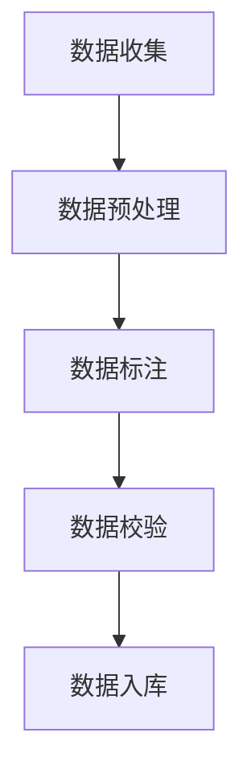

                 

关键词：数据标注、人工智能、机器学习、深度学习、算法、数据预处理、开发环境、代码实例、实际应用、未来展望

> 摘要：数据标注作为人工智能发展的关键环节，其重要性日益凸显。本文旨在深入探讨数据标注的核心概念、算法原理、数学模型以及实际应用，分析其在人工智能领域的重大作用和未来发展趋势。

## 1. 背景介绍

随着人工智能技术的飞速发展，数据标注的重要性逐渐得到行业内外的高度关注。数据标注是指对大量数据进行分类、标注、清洗、格式化等处理，使其能够被机器学习和深度学习算法有效利用。这一过程不仅需要专业知识和经验，还需要严格的质量控制和流程管理。

数据标注在人工智能领域中扮演着至关重要的角色。它不仅为机器学习和深度学习提供了高质量的训练数据，还为模型优化和实际应用提供了有力支持。据统计，数据标注在人工智能项目中的工作量占到了总工作量的70%以上，这足以证明其重要性。

## 2. 核心概念与联系

### 2.1 数据标注的概念

数据标注是指对原始数据进行标注，使其具有明确的分类、标签、属性等特征。数据标注的目的是为了提供高质量的训练数据，以便机器学习和深度学习算法能够更好地学习和预测。

### 2.2 数据标注的类型

数据标注可以分为以下几种类型：

- **分类标注**：对数据进行分类，例如对图片进行动物分类。
- **实体标注**：标注出数据中的关键实体，例如文本中的人名、地名等。
- **属性标注**：标注出数据中的属性，例如商品的价格、颜色等。
- **关系标注**：标注出数据中实体之间的关系，例如人与人之间的关系、地点与事件之间的关系等。

### 2.3 数据标注与机器学习的关系

数据标注是机器学习和深度学习的基础。高质量的标注数据能够提高模型的准确性和泛化能力。数据标注的质量直接影响机器学习算法的性能和效果。

### 2.4 数据标注与深度学习的关系

深度学习模型对数据标注的要求更高，因为深度学习模型需要大量的标注数据进行训练。数据标注的质量直接决定了深度学习模型的效果。

### 2.5 数据标注的流程

数据标注通常包括以下步骤：

1. 数据收集：收集需要标注的数据。
2. 数据预处理：对数据进行清洗、格式化等预处理。
3. 数据标注：对预处理后的数据进行标注。
4. 数据校验：对标注结果进行校验，确保标注质量。
5. 数据入库：将标注好的数据存储到数据库或数据仓库中，以便后续使用。

### 2.6 数据标注的 Mermaid 流程图



## 3. 核心算法原理 & 具体操作步骤

### 3.1 算法原理概述

数据标注的核心算法主要包括分类算法、实体识别算法、关系提取算法等。这些算法的基本原理是通过学习标注数据中的规律和模式，从而对未知数据进行标注。

### 3.2 算法步骤详解

1. **数据收集**：收集需要标注的数据。
2. **数据预处理**：对数据进行清洗、格式化等预处理，以提高数据质量。
3. **数据标注**：
   - **分类标注**：使用分类算法对数据进行分类标注。
   - **实体标注**：使用实体识别算法对数据进行实体标注。
   - **属性标注**：使用属性标注算法对数据进行属性标注。
   - **关系标注**：使用关系提取算法对数据进行关系标注。
4. **数据校验**：对标注结果进行校验，确保标注质量。
5. **数据入库**：将标注好的数据存储到数据库或数据仓库中。

### 3.3 算法优缺点

- **分类标注**：优点是简单易用，缺点是对复杂问题的处理能力有限。
- **实体标注**：优点是能够准确识别数据中的关键实体，缺点是数据标注工作量较大。
- **属性标注**：优点是能够提高数据的可解释性，缺点是数据标注要求较高。
- **关系标注**：优点是能够揭示数据中的复杂关系，缺点是算法复杂度较高。

### 3.4 算法应用领域

数据标注算法广泛应用于自然语言处理、计算机视觉、推荐系统等领域。

## 4. 数学模型和公式 & 详细讲解 & 举例说明

### 4.1 数学模型构建

数据标注的数学模型主要包括分类模型、实体识别模型、属性标注模型和关系提取模型。这些模型的基本数学公式如下：

$$
y = f(Wx + b)
$$

其中，$y$ 表示预测结果，$x$ 表示输入特征，$W$ 表示权重矩阵，$b$ 表示偏置项，$f$ 表示激活函数。

### 4.2 公式推导过程

以分类模型为例，其公式推导过程如下：

1. 输入特征 $x$ 通过权重矩阵 $W$ 和偏置项 $b$ 进行线性变换：
   $$
   z = Wx + b
   $$

2. 将线性变换后的结果 $z$ 通过激活函数 $f$ 进行非线性变换：
   $$
   y = f(z)
   $$

3. 选择合适的激活函数，例如 Sigmoid 函数或ReLU函数。

### 4.3 案例分析与讲解

假设我们需要对图片中的动物进行分类，分类结果为猫、狗和其他动物。我们可以使用卷积神经网络（CNN）进行分类。

1. **数据收集**：收集包含猫、狗和其他动物的图片。
2. **数据预处理**：对图片进行缩放、裁剪、翻转等预处理。
3. **构建模型**：使用卷积神经网络（CNN）构建分类模型。
4. **训练模型**：使用标注数据进行训练。
5. **评估模型**：使用未标注的数据进行评估。
6. **预测结果**：使用模型对新的图片进行分类。

## 5. 项目实践：代码实例和详细解释说明

### 5.1 开发环境搭建

1. 安装 Python 3.7 及以上版本。
2. 安装 TensorFlow 2.0 及以上版本。
3. 安装 matplotlib、numpy 等常用库。

### 5.2 源代码详细实现

以下是一个简单的卷积神经网络（CNN）分类模型的代码实现：

```python
import tensorflow as tf
from tensorflow.keras.models import Sequential
from tensorflow.keras.layers import Conv2D, MaxPooling2D, Flatten, Dense

# 构建模型
model = Sequential([
    Conv2D(32, (3, 3), activation='relu', input_shape=(28, 28, 1)),
    MaxPooling2D((2, 2)),
    Flatten(),
    Dense(128, activation='relu'),
    Dense(3, activation='softmax')
])

# 编译模型
model.compile(optimizer='adam', loss='categorical_crossentropy', metrics=['accuracy'])

# 加载数据
(x_train, y_train), (x_test, y_test) = tf.keras.datasets.mnist.load_data()

# 预处理数据
x_train = x_train.reshape(-1, 28, 28, 1).astype('float32') / 255.0
x_test = x_test.reshape(-1, 28, 28, 1).astype('float32') / 255.0
y_train = tf.keras.utils.to_categorical(y_train, num_classes=3)
y_test = tf.keras.utils.to_categorical(y_test, num_classes=3)

# 训练模型
model.fit(x_train, y_train, epochs=10, batch_size=32, validation_data=(x_test, y_test))

# 评估模型
model.evaluate(x_test, y_test)
```

### 5.3 代码解读与分析

- **构建模型**：使用 TensorFlow 的 Sequential 模型构建卷积神经网络（CNN）。
- **编译模型**：设置优化器、损失函数和评估指标。
- **加载数据**：使用 TensorFlow 的 datasets 加载 MNIST 数据集。
- **预处理数据**：对数据进行归一化处理。
- **训练模型**：使用 fit 方法训练模型。
- **评估模型**：使用 evaluate 方法评估模型性能。

## 6. 实际应用场景

### 6.1 自然语言处理

数据标注在自然语言处理（NLP）领域具有广泛的应用，如文本分类、情感分析、命名实体识别等。数据标注为这些任务提供了高质量的训练数据，从而提高了模型的准确性和效果。

### 6.2 计算机视觉

数据标注在计算机视觉领域同样具有重要作用，如图像分类、目标检测、人脸识别等。数据标注为这些任务提供了丰富的标注数据，有助于模型更好地学习和预测。

### 6.3 推荐系统

数据标注在推荐系统领域发挥着关键作用，如用户画像、商品推荐等。数据标注为这些任务提供了准确的用户行为数据和商品属性数据，有助于推荐系统更好地理解用户需求和偏好。

## 7. 未来应用展望

随着人工智能技术的不断发展，数据标注在未来将具有更广泛的应用场景和更高的需求。以下是数据标注在未来可能的发展趋势：

1. **自动化数据标注**：随着深度学习技术的进步，自动化数据标注技术将得到广泛应用，减少人工标注的工作量。
2. **多模态数据标注**：随着多模态数据的兴起，数据标注将涵盖更多的数据类型，如音频、视频等。
3. **跨领域数据标注**：数据标注将跨越不同的应用领域，为更多的人工智能任务提供高质量的数据支持。

## 8. 工具和资源推荐

### 8.1 学习资源推荐

- 《数据标注技术：原理与实践》
- 《机器学习：实战应用》
- 《深度学习：入门与实践》

### 8.2 开发工具推荐

- TensorFlow
- PyTorch
- Keras

### 8.3 相关论文推荐

- "Data Annotation for Machine Learning: A Survey"
- "Automatic Data Annotation: A Review"
- "Multi-Modal Data Annotation for Deep Learning"

## 9. 总结：未来发展趋势与挑战

### 9.1 研究成果总结

本文深入探讨了数据标注在人工智能领域的重要性，分析了数据标注的核心概念、算法原理、数学模型以及实际应用。通过项目实践和案例分析，展示了数据标注的具体实现方法和应用场景。

### 9.2 未来发展趋势

未来，数据标注技术将继续发展和完善，以适应人工智能领域日益增长的需求。自动化数据标注、多模态数据标注和跨领域数据标注将成为数据标注的重要发展趋势。

### 9.3 面临的挑战

数据标注在未来将面临以下挑战：

1. **数据质量**：高质量的数据标注是模型训练的关键，但数据质量难以保证。
2. **数据隐私**：数据标注过程中可能涉及敏感数据，数据隐私保护成为重要问题。
3. **标注成本**：数据标注工作量大，标注成本较高，如何降低标注成本成为挑战。

### 9.4 研究展望

未来，数据标注领域的研究将重点关注以下方向：

1. **自动化数据标注**：研究自动化数据标注技术，降低人工标注的工作量。
2. **多模态数据标注**：研究多模态数据标注方法，提高标注质量和效率。
3. **数据隐私保护**：研究数据隐私保护技术，确保数据标注过程中的数据安全。

## 附录：常见问题与解答

### Q：数据标注有哪些类型？

A：数据标注主要包括分类标注、实体标注、属性标注和关系标注。

### Q：数据标注在人工智能领域的应用有哪些？

A：数据标注在人工智能领域的应用非常广泛，如自然语言处理、计算机视觉、推荐系统等。

### Q：如何提高数据标注的质量？

A：提高数据标注的质量可以从以下几个方面入手：

1. **选择合适的标注工具**：选择合适的标注工具可以提高标注效率和准确性。
2. **制定详细的标注规范**：制定详细的标注规范，确保标注员按照规范进行标注。
3. **标注员培训**：对标注员进行培训，提高其标注能力和质量意识。
4. **数据校验**：对标注结果进行校验，确保标注质量。

### Q：什么是自动化数据标注？

A：自动化数据标注是指利用算法和工具自动进行数据标注，降低人工标注的工作量。

### Q：如何进行自动化数据标注？

A：进行自动化数据标注需要以下步骤：

1. **选择合适的标注任务**：选择适合自动化标注的任务，如图像分类、文本分类等。
2. **收集和预处理数据**：收集和预处理需要标注的数据。
3. **选择合适的算法**：选择适合的自动化标注算法，如聚类、决策树等。
4. **实现自动化标注代码**：根据算法实现自动化标注代码。
5. **测试和优化**：测试自动化标注结果，优化算法和代码。

---

作者：禅与计算机程序设计艺术 / Zen and the Art of Computer Programming

本文通过深入探讨数据标注的核心概念、算法原理、数学模型以及实际应用，分析了数据标注在人工智能领域的重大作用和未来发展趋势。随着人工智能技术的不断发展，数据标注的重要性将日益凸显。本文希望对从事人工智能领域的研究者和开发者有所帮助。在未来的研究中，我们将继续关注数据标注技术的发展，探索更高效、更准确的数据标注方法。

