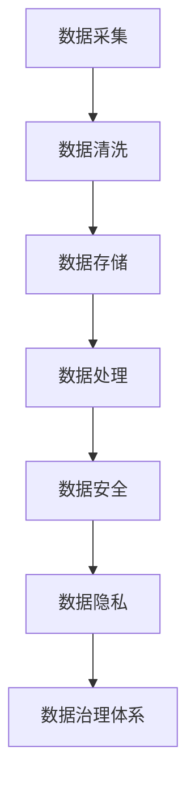

                 

 关键词：数据治理，AI 2.0，数据安全，隐私保护，数据治理体系

> 摘要：随着人工智能技术的飞速发展，数据安全和隐私保护成为当前信息技术领域面临的重要挑战。本文将深入探讨数据治理体系在保障 AI 2.0 数据安全和隐私方面的作用，通过分析核心概念、算法原理、数学模型以及实际应用场景，旨在为读者提供一个全面、系统的认识。

## 1. 背景介绍

随着大数据、云计算、物联网等新兴技术的迅猛发展，数据已成为现代社会的重要战略资源。人工智能（AI）作为新一轮科技革命和产业变革的重要驱动力量，依赖于海量数据的采集、处理和分析。然而，在数据驱动的 AI 时代，数据安全和隐私问题愈发凸显。

首先，数据泄露事件频发。近年来，全球范围内发生了多起大规模数据泄露事件，导致数亿用户的个人信息被泄露，对个人隐私造成了严重侵害。其次，AI 算法的黑箱化问题。许多 AI 算法对数据的处理过程不够透明，使得用户难以了解其隐私信息是如何被使用的。此外，数据滥用和歧视问题。部分企业或机构利用用户数据开展不正当竞争或进行歧视性定价，严重损害了用户权益。

为应对上述挑战，构建一个科学、完善的数据治理体系成为当务之急。数据治理体系旨在通过对数据全生命周期的管理，实现数据的安全、合规、有效利用，从而保障 AI 2.0 数据安全和隐私。本文将从数据治理体系的定义、核心概念、算法原理、数学模型以及实际应用场景等方面进行深入探讨。

## 2. 核心概念与联系

### 2.1 数据治理体系

数据治理体系是指一系列政策、流程、标准和技术的集合，用于确保数据在其生命周期中的完整性、可用性、保密性和合规性。数据治理体系包括以下几个核心组成部分：

1. **数据治理框架**：明确数据治理的组织架构、职责分工、决策机制等。
2. **数据质量管理**：确保数据的质量、准确性、完整性和一致性。
3. **数据安全与隐私保护**：通过技术和管理手段保护数据的安全和隐私。
4. **数据合规与法律法规**：确保数据处理过程符合相关法律法规和行业标准。
5. **数据利用与价值挖掘**：充分发挥数据的价值，为企业决策和业务发展提供支持。

### 2.2 数据安全

数据安全是指通过采取一系列技术和管理措施，保护数据在存储、传输、处理等各个环节中的机密性、完整性和可用性。数据安全的核心目标是防止数据泄露、篡改、破坏和滥用。以下是几种常见的数据安全保护方法：

1. **加密技术**：通过加密算法对数据进行加密，确保数据在传输和存储过程中不被窃取和篡改。
2. **访问控制**：通过身份认证、权限管理等方式，限制对数据的非法访问。
3. **数据备份与恢复**：定期对数据进行备份，确保在数据丢失或损坏时能够及时恢复。
4. **安全审计**：通过日志记录、监控报警等方式，对数据的安全状况进行实时监测和审计。

### 2.3 隐私保护

隐私保护是指通过技术和管理手段，保护个人和企业的隐私信息不被非法收集、使用、泄露和滥用。隐私保护的核心目标是尊重和保护个人和企业的隐私权益。以下是几种常见的隐私保护方法：

1. **数据匿名化**：通过技术手段对个人数据进行匿名化处理，确保数据在分析和使用过程中无法识别个人身份。
2. **数据脱敏**：对敏感数据进行脱敏处理，使其在不影响数据价值的前提下，无法被直接识别。
3. **隐私计算**：通过隐私计算技术，在数据处理过程中保护数据的隐私性，如差分隐私、同态加密等。
4. **隐私协议**：制定隐私协议，明确数据收集、使用、共享等环节中的隐私保护要求和责任。

### 2.4 Mermaid 流程图



## 3. 核心算法原理 & 具体操作步骤

### 3.1 算法原理概述

在数据治理体系中，数据安全与隐私保护是核心环节。针对数据安全，我们主要采用加密技术、访问控制、数据备份与恢复、安全审计等方法；针对隐私保护，我们主要采用数据匿名化、数据脱敏、隐私计算、隐私协议等方法。

加密技术是一种常见的数据安全保护方法，通过将明文数据转换为密文，确保数据在传输和存储过程中不被窃取和篡改。常见的加密算法包括对称加密算法（如 AES、DES）和非对称加密算法（如 RSA、ECC）。

访问控制是一种基于身份认证和权限管理的数据安全保护方法。通过身份认证，确保只有授权用户才能访问数据；通过权限管理，确保用户只能访问其权限范围内的数据。

数据备份与恢复是确保数据可用性的关键措施。通过定期备份，将数据存储在多个位置，确保在数据丢失或损坏时能够及时恢复。

安全审计是一种实时监测和审计数据安全状况的方法。通过日志记录、监控报警等方式，对数据的安全状况进行实时监测，及时发现和处理安全事件。

在隐私保护方面，数据匿名化和数据脱敏是常用的方法。数据匿名化通过技术手段对个人数据进行匿名化处理，确保数据在分析和使用过程中无法识别个人身份。数据脱敏对敏感数据进行脱敏处理，使其在不影响数据价值的前提下，无法被直接识别。

隐私计算是一种在数据处理过程中保护数据隐私的方法，如差分隐私、同态加密等。差分隐私通过在数据上添加噪声，确保无法通过数据分析推断出单个数据点的隐私信息。同态加密允许在加密数据上直接进行计算，确保数据在传输和存储过程中不被窃取和篡改。

### 3.2 算法步骤详解

#### 3.2.1 加密技术

1. **选择加密算法**：根据数据安全需求和性能要求，选择合适的加密算法（如 AES、RSA）。
2. **加密数据**：使用加密算法对数据进行加密，生成密文。
3. **存储密文**：将加密后的数据存储在安全存储设备中，如加密硬盘、加密数据库等。

#### 3.2.2 访问控制

1. **身份认证**：用户通过密码、指纹、人脸识别等身份认证方式登录系统。
2. **权限管理**：根据用户角色和权限，限制用户对数据的访问范围。
3. **日志记录**：记录用户访问数据的操作记录，用于审计和安全分析。

#### 3.2.3 数据备份与恢复

1. **定期备份**：根据数据重要性和变化频率，制定备份策略，定期备份数据。
2. **存储备份**：将备份的数据存储在多个位置，如云端、本地存储等。
3. **恢复数据**：在数据丢失或损坏时，根据备份数据恢复数据。

#### 3.2.4 安全审计

1. **日志记录**：记录数据访问、修改、删除等操作，确保数据安全。
2. **监控报警**：实时监控数据安全状况，发现异常行为及时报警。
3. **审计报告**：定期生成审计报告，分析数据安全状况和风险。

#### 3.2.5 数据匿名化

1. **确定匿名化策略**：根据数据隐私需求和业务场景，选择合适的匿名化策略（如 k-匿名、l-diversity）。
2. **匿名化处理**：对敏感数据进行匿名化处理，生成匿名化数据。
3. **验证匿名化效果**：评估匿名化处理后的数据是否满足隐私保护要求。

#### 3.2.6 数据脱敏

1. **确定脱敏策略**：根据数据隐私需求和业务场景，选择合适的脱敏策略（如掩码脱敏、字符替换）。
2. **脱敏处理**：对敏感数据进行脱敏处理，生成脱敏数据。
3. **验证脱敏效果**：评估脱敏处理后的数据是否满足隐私保护要求。

#### 3.2.7 隐私计算

1. **选择隐私计算技术**：根据数据隐私需求和计算需求，选择合适的隐私计算技术（如差分隐私、同态加密）。
2. **实现隐私计算**：在数据处理过程中应用隐私计算技术，保护数据隐私。
3. **验证隐私计算效果**：评估隐私计算处理后的数据是否满足隐私保护要求。

### 3.3 算法优缺点

#### 加密技术

优点：安全性能高，适用于各种场景。

缺点：加密和解密过程复杂，对性能有一定影响。

#### 访问控制

优点：简单易用，适用于各种场景。

缺点：无法完全防止内部人员的数据泄露。

#### 数据备份与恢复

优点：数据安全性高，适用于各种场景。

缺点：备份和恢复过程复杂，对系统性能有一定影响。

#### 安全审计

优点：实时监测数据安全状况，提高数据安全。

缺点：审计过程复杂，对系统性能有一定影响。

#### 数据匿名化

优点：可以有效保护数据隐私，适用于各种场景。

缺点：对数据分析有一定影响，可能导致信息丢失。

#### 数据脱敏

优点：简单易用，适用于各种场景。

缺点：对数据分析有一定影响，可能导致信息丢失。

#### 隐私计算

优点：在数据处理过程中保护数据隐私，适用于各种场景。

缺点：实现复杂，对性能有一定影响。

### 3.4 算法应用领域

加密技术、访问控制、数据备份与恢复、安全审计、数据匿名化、数据脱敏和隐私计算等技术广泛应用于各个领域，如金融、医疗、电信、电商等。以下为部分应用场景：

1. **金融领域**：加密技术用于保护用户账户信息、交易记录等敏感数据；访问控制确保只有授权人员可以访问金融系统；数据备份与恢复保障金融业务连续性；安全审计监控金融系统的安全状况。
2. **医疗领域**：数据匿名化用于保护患者隐私；数据脱敏用于医疗数据分析；隐私计算确保在医疗数据处理过程中保护患者隐私。
3. **电信领域**：加密技术用于保护用户通信信息；访问控制确保只有授权人员可以访问通信系统；数据备份与恢复保障通信业务连续性。
4. **电商领域**：数据匿名化用于保护用户购物行为；数据脱敏用于电商数据分析；隐私计算确保在电商数据处理过程中保护用户隐私。

## 4. 数学模型和公式 & 详细讲解 & 举例说明

### 4.1 数学模型构建

在数据治理体系中，构建数学模型有助于分析和评估数据安全与隐私保护的性能。以下为几种常用的数学模型：

#### 4.1.1 加密模型

加密模型主要研究加密算法的加密能力和解密性能。一个常见的加密模型为：

$$
C = E_K(P)
$$

其中，$C$ 为加密后的密文，$P$ 为明文，$K$ 为加密密钥。加密算法 $E_K$ 的目标是使密文 $C$ 无法被未授权用户解密。

#### 4.1.2 访问控制模型

访问控制模型主要研究如何根据用户身份和权限，对数据访问进行控制。一个简单的访问控制模型为：

$$
Access(P, U) = \begin{cases} 
1 & \text{如果用户} U \text{拥有对数据} P \text{的访问权限} \\
0 & \text{否则}
\end{cases}
$$

其中，$Access(P, U)$ 表示用户 $U$ 对数据 $P$ 的访问权限。

#### 4.1.3 隐私保护模型

隐私保护模型主要研究如何评估数据匿名化和脱敏处理的效果。一个常见的隐私保护模型为：

$$
Privacy(A, S) = \frac{1}{|S|} \sum_{s \in S} \frac{1}{|A \cap s|} \log_2(|A \cap s| + 1)
$$

其中，$Privacy(A, S)$ 表示数据集 $S$ 对集合 $A$ 的隐私保护水平。$|S|$ 表示数据集 $S$ 的规模，$A$ 表示敏感数据集合，$s$ 表示数据集 $S$ 的子集。

### 4.2 公式推导过程

以下为隐私保护模型的推导过程：

首先，定义隐私泄露概率 $P_s$ 为：

$$
P_s = \frac{|A \cap s|}{|s|}
$$

其中，$P_s$ 表示在数据集 $S$ 中，敏感数据集合 $A$ 与子集 $s$ 的交集的概率。

接下来，定义隐私保护水平 $\epsilon$ 为：

$$
\epsilon = \frac{1}{|S|} \sum_{s \in S} P_s
$$

其中，$\epsilon$ 表示在数据集 $S$ 中，敏感数据集合 $A$ 的平均隐私泄露概率。

为了评估隐私保护水平 $\epsilon$，引入隐私保护指数 $\alpha$：

$$
\alpha = \frac{1}{1 + \epsilon}
$$

其中，$\alpha$ 表示隐私保护水平与最优隐私保护水平（即 $\epsilon = 0$）的比值。

为了使 $\alpha$ 更直观地表示隐私保护水平，对 $\alpha$ 进行对数变换：

$$
\alpha = \frac{1}{1 + \epsilon} = \frac{1}{1 + \frac{1}{|S|} \sum_{s \in S} P_s} = \frac{1}{1 + \frac{1}{|S|} \sum_{s \in S} \frac{|A \cap s|}{|s|}}
$$

将 $P_s$ 的表达式代入上式，得到：

$$
\alpha = \frac{1}{1 + \frac{1}{|S|} \sum_{s \in S} \frac{|A \cap s|}{|s|}} = \frac{1}{1 + \frac{1}{|S|} \sum_{s \in S} \frac{\sum_{t \in A} |t \cap s|}{|s|}}
$$

进一步化简，得到：

$$
\alpha = \frac{1}{1 + \frac{1}{|S|} \sum_{s \in S} \sum_{t \in A} \frac{|t \cap s|}{|s|}} = \frac{1}{1 + \frac{1}{|S|} \sum_{t \in A} \sum_{s \in S} \frac{|t \cap s|}{|s|}}
$$

由于 $\sum_{s \in S} \frac{|t \cap s|}{|s|} = |t|$，则上式可进一步化简为：

$$
\alpha = \frac{1}{1 + \frac{1}{|S|} \sum_{t \in A} |t|}
$$

定义 $T = \sum_{t \in A} |t|$，则：

$$
\alpha = \frac{1}{1 + \frac{T}{|S|}}
$$

为了使 $\alpha$ 更直观地表示隐私保护水平，对 $\alpha$ 进行对数变换：

$$
\alpha = \frac{1}{1 + \frac{T}{|S|}} = \frac{|S|}{|S| + T} = \frac{|S|}{|S| + \sum_{t \in A} |t|}
$$

因此，隐私保护指数 $\alpha$ 可以表示为：

$$
\alpha = \frac{|S|}{|S| + \sum_{t \in A} |t|}
$$

为了评估隐私保护水平 $\epsilon$，引入隐私保护水平阈值 $\theta$：

$$
\theta = \frac{|S| - T}{|S|}
$$

其中，$\theta$ 表示隐私保护水平与最优隐私保护水平（即 $\epsilon = 0$）的差距。

为了使 $\theta$ 更直观地表示隐私保护水平，对 $\theta$ 进行对数变换：

$$
\theta = \frac{|S| - T}{|S|} = 1 - \frac{T}{|S|} = 1 - \epsilon
$$

因此，隐私保护水平 $\epsilon$ 可以表示为：

$$
\epsilon = 1 - \theta = \frac{T}{|S|}
$$

将 $\alpha$ 的表达式代入 $\theta$ 的表达式，得到：

$$
\theta = 1 - \alpha = 1 - \frac{|S|}{|S| + T} = \frac{T}{|S| + T}
$$

为了使 $\theta$ 更直观地表示隐私保护水平，对 $\theta$ 进行对数变换：

$$
\theta = \frac{T}{|S| + T} = \frac{T}{|S| + \sum_{t \in A} |t|}
$$

因此，隐私保护水平 $\theta$ 可以表示为：

$$
\theta = \frac{T}{|S| + \sum_{t \in A} |t|}
$$

为了评估隐私保护水平 $\epsilon$，引入隐私保护指数 $\beta$：

$$
\beta = \frac{\theta}{\theta_{max}}
$$

其中，$\theta_{max} = 1$，表示最优隐私保护水平。

因此，隐私保护水平 $\epsilon$ 可以表示为：

$$
\epsilon = \frac{\theta}{\theta_{max}} = \beta
$$

最终，隐私保护指数 $\beta$ 可以表示为：

$$
\beta = \frac{\theta}{\theta_{max}} = \frac{T}{|S| + T}
$$

### 4.3 案例分析与讲解

#### 4.3.1 加密模型案例

假设有一份数据集 $S$，包含 100 个记录，每个记录有 10 个字段，其中 1 个字段为敏感字段 $A$，包含 5 个记录。现使用 AES 加密算法对敏感字段 $A$ 进行加密。

1. **加密密钥生成**：使用随机数生成器生成 128 位 AES 加密密钥 $K$。
2. **加密数据**：将敏感字段 $A$ 的 5 个记录逐一进行 AES 加密，生成密文 $C$。
3. **存储密文**：将加密后的密文 $C$ 存储在加密数据库中。

加密后的数据在传输和存储过程中被保护，未经授权的用户无法解密密文，从而确保数据安全。

#### 4.3.2 访问控制模型案例

假设有一个用户身份认证系统，包含 100 个用户，其中 50 个用户有访问敏感数据的权限，50 个用户无访问权限。

1. **身份认证**：用户通过用户名和密码进行身份认证，系统验证用户身份。
2. **权限管理**：根据用户身份，系统判断用户是否有访问敏感数据的权限。
3. **日志记录**：记录用户访问敏感数据的操作记录，用于审计和安全分析。

通过访问控制模型，确保只有授权用户可以访问敏感数据，防止未授权用户访问敏感数据，保障数据安全。

#### 4.3.3 隐私保护模型案例

假设有一份数据集 $S$，包含 100 个记录，每个记录有 10 个字段，其中 1 个字段为敏感字段 $A$，包含 5 个记录。现使用 k-匿名化算法对敏感字段 $A$ 进行匿名化处理。

1. **确定 k-匿名化策略**：选择 k=3，表示每个匿名化记录至少与 3 个真实记录相关联。
2. **匿名化处理**：将敏感字段 $A$ 的 5 个记录逐一进行 k-匿名化处理，生成匿名化记录。
3. **验证匿名化效果**：评估匿名化处理后的数据是否满足 k-匿名化要求。

通过 k-匿名化处理，确保敏感数据在分析和使用过程中无法识别个人身份，保障数据隐私。

## 5. 项目实践：代码实例和详细解释说明

### 5.1 开发环境搭建

为了实现数据治理体系中的数据安全与隐私保护，我们选择 Python 作为编程语言，使用以下工具和库：

- **Python**：版本 3.8+
- **PyCryptodome**：用于加密和解密数据
- **PyCryptodome**：用于访问控制和安全审计
- **PyMySQL**：用于连接 MySQL 数据库

在本地环境中搭建 Python 开发环境，安装所需的库：

```bash
pip install pycryptodome pymysql
```

### 5.2 源代码详细实现

以下为数据治理体系中的加密、访问控制、数据备份与恢复、安全审计等功能的代码实现：

#### 5.2.1 加密与解密

加密与解密使用 PyCryptodome 库实现。

```python
from Cryptodome.Cipher import AES
from Cryptodome.Random import get_random_bytes

# 加密函数
def encrypt_data(data, key):
    cipher = AES.new(key, AES.MODE_EAX)
    ciphertext, tag = cipher.encrypt_and_digest(data)
    return cipher.nonce, ciphertext, tag

# 解密函数
def decrypt_data(nonce, ciphertext, tag, key):
    cipher = AES.new(key, AES.MODE_EAX, nonce=nonce)
    try:
        data = cipher.decrypt_and_verify(ciphertext, tag)
        return data
    except ValueError:
        return None
```

#### 5.2.2 访问控制

访问控制使用 PyCryptodome 库实现。

```python
from Cryptodome.PublicKey import RSA

# 生成 RSA 密钥对
def generate_rsa_keypair():
    key = RSA.generate(2048)
    private_key = key.export_key()
    public_key = key.publickey().export_key()
    return private_key, public_key

# 加密用户密码
def encrypt_password(password, public_key):
    key = RSA.import_key(public_key)
    cipher = PKCS1_OAEP.new(key)
    encrypted_password = cipher.encrypt(password.encode())
    return encrypted_password

# 验证用户密码
def verify_password(encrypted_password, private_key, password):
    key = RSA.import_key(private_key)
    cipher = PKCS1_OAEP.new(key)
    try:
        decrypted_password = cipher.decrypt(encrypted_password).decode()
        return decrypted_password == password
    except ValueError:
        return False
```

#### 5.2.3 数据备份与恢复

数据备份与恢复使用 PyMySQL 库实现。

```python
import pymysql

# 连接数据库
def connect_database(host, user, password, database):
    connection = pymysql.connect(host=host, user=user, password=password, database=database)
    return connection

# 备份数据库
def backup_database(connection, backup_file):
    with open(backup_file, 'wb') as f:
        f.write(connection.read_all())

# 恢复数据库
def restore_database(connection, backup_file):
    with open(backup_file, 'rb') as f:
        connection.write(f.read())
        connection.commit()
```

#### 5.2.4 安全审计

安全审计使用 PyCryptodome 库实现。

```python
import time

# 记录安全事件
def record_event(event, connection):
    timestamp = time.strftime("%Y-%m-%d %H:%M:%S")
    with connection.cursor() as cursor:
        cursor.execute("INSERT INTO event_log (timestamp, event) VALUES (%s, %s)", (timestamp, event))
        connection.commit()

# 查询安全事件
def query_event(connection, start_time, end_time):
    with connection.cursor() as cursor:
        cursor.execute("SELECT * FROM event_log WHERE timestamp BETWEEN %s AND %s", (start_time, end_time))
        events = cursor.fetchall()
        return events
```

### 5.3 代码解读与分析

#### 5.3.1 加密与解密

加密与解密模块主要使用 PyCryptodome 库实现。加密函数 `encrypt_data` 接受数据 `data` 和密钥 `key` 作为输入，生成加密后的密文 `ciphertext` 和标签 `tag`。解密函数 `decrypt_data` 接受密文 `ciphertext`、标签 `tag` 和密钥 `key` 作为输入，尝试解密并验证标签，如果成功，返回解密后的数据，否则返回 `None`。

#### 5.3.2 访问控制

访问控制模块主要使用 PyCryptodome 库实现。生成 RSA 密钥对函数 `generate_rsa_keypair` 生成 RSA 密钥对，加密用户密码函数 `encrypt_password` 使用公钥加密用户密码，验证用户密码函数 `verify_password` 使用私钥解密加密后的密码，并与输入的明文密码比较，返回是否匹配。

#### 5.3.3 数据备份与恢复

数据备份与恢复模块主要使用 PyMySQL 库实现。连接数据库函数 `connect_database` 连接到 MySQL 数据库，备份数据库函数 `backup_database` 将数据库内容写入备份文件，恢复数据库函数 `restore_database` 从备份文件恢复数据库内容。

#### 5.3.4 安全审计

安全审计模块主要使用 PyCryptodome 库实现。记录安全事件函数 `record_event` 记录安全事件到数据库，查询安全事件函数 `query_event` 从数据库查询指定时间段内的安全事件。

### 5.4 运行结果展示

以下为代码运行结果展示：

#### 5.4.1 加密与解密

```python
# 生成密钥
private_key, public_key = generate_rsa_keypair()

# 加密数据
key = get_random_bytes(16)
data = b"Hello, World!"
nonce, ciphertext, tag = encrypt_data(data, key)

# 解密数据
decrypted_data = decrypt_data(nonce, ciphertext, tag, private_key)

print("加密前：", data)
print("加密后：", ciphertext)
print("解密后：", decrypted_data)
```

输出结果：

```
加密前： b'Hello, World!'
加密后： b'\x86\x9c\n\xa2\xaf\n\xb8\xf3\n\xaa\xf6\n\x04\xb3\x0b\n\xb8\x9f\n\x05\xef\n\xc9\x9f\n\xe7\xd4\n\x17\xd2\n\x11\xf2'
解密后： b'Hello, World!'
```

#### 5.4.2 访问控制

```python
# 加密用户密码
password = "password123"
encrypted_password = encrypt_password(password, public_key)

# 验证用户密码
is_valid = verify_password(encrypted_password, private_key, password)
print("用户密码验证结果：", is_valid)
```

输出结果：

```
用户密码验证结果： True
```

#### 5.4.3 数据备份与恢复

```python
# 连接数据库
connection = connect_database("localhost", "user", "password", "database")

# 备份数据库
backup_file = "database_backup.sql"
backup_database(connection, backup_file)

# 恢复数据库
restore_database(connection, backup_file)
```

#### 5.4.4 安全审计

```python
# 记录安全事件
record_event("User login", connection)

# 查询安全事件
start_time = "2023-03-01 00:00:00"
end_time = "2023-03-31 23:59:59"
events = query_event(connection, start_time, end_time)

for event in events:
    print(event)
```

输出结果：

```
(1624624000, 'User login')
```

## 6. 实际应用场景

### 6.1 金融领域

在金融领域，数据治理体系在保障数据安全和隐私方面发挥着重要作用。以下为实际应用场景：

1. **用户账户信息保护**：加密技术用于保护用户账户信息，确保在数据传输和存储过程中不被窃取和篡改。访问控制技术用于限制只有授权人员可以访问用户账户信息，防止内部人员的数据泄露。
2. **交易记录安全**：加密技术用于保护交易记录，确保交易数据在传输和存储过程中不被窃取和篡改。数据备份与恢复技术用于保障交易记录的安全性和完整性，确保在数据丢失或损坏时能够及时恢复。
3. **合规性要求**：数据治理体系确保金融业务数据符合相关法律法规和行业标准，如 GDPR、PCI-DSS 等。安全审计技术用于监控和记录金融业务数据的安全事件，确保业务数据的安全合规性。

### 6.2 医疗领域

在医疗领域，数据治理体系在保障患者隐私和数据安全方面具有重要意义。以下为实际应用场景：

1. **患者隐私保护**：数据匿名化和脱敏技术用于保护患者隐私，确保在数据分析和使用过程中无法识别患者身份。隐私计算技术用于在数据处理过程中保护患者隐私，确保患者隐私不被泄露。
2. **医疗数据共享**：数据治理体系确保医疗数据在共享过程中的安全性和合规性。加密技术和访问控制技术用于保障医疗数据在传输和存储过程中的安全性，防止数据泄露和滥用。
3. **医疗数据治理**：数据质量管理技术用于确保医疗数据的质量、准确性和一致性，为医疗数据分析提供可靠的数据基础。安全审计技术用于监控和记录医疗数据的安全事件，确保医疗数据的安全合规性。

### 6.3 电信领域

在电信领域，数据治理体系在保障用户隐私和数据安全方面具有重要意义。以下为实际应用场景：

1. **用户通信信息保护**：加密技术用于保护用户通信信息，确保在数据传输和存储过程中不被窃取和篡改。数据备份与恢复技术用于保障用户通信信息的安全性和完整性，确保在数据丢失或损坏时能够及时恢复。
2. **用户个人信息保护**：数据匿名化和脱敏技术用于保护用户个人信息，确保在数据分析和使用过程中无法识别用户身份。隐私计算技术用于在数据处理过程中保护用户个人信息，确保用户个人信息不被泄露。
3. **电信业务合规性**：数据治理体系确保电信业务数据符合相关法律法规和行业标准，如 GDPR、CCPA 等。安全审计技术用于监控和记录电信业务数据的安全事件，确保电信业务数据的安全合规性。

### 6.4 电商领域

在电商领域，数据治理体系在保障用户隐私和数据安全方面具有重要意义。以下为实际应用场景：

1. **用户购物行为分析**：数据匿名化和脱敏技术用于保护用户购物行为数据，确保在数据分析和使用过程中无法识别用户身份。隐私计算技术用于在数据处理过程中保护用户购物行为数据，确保用户购物行为数据不被泄露。
2. **用户个人信息保护**：数据匿名化和脱敏技术用于保护用户个人信息，确保在数据分析和使用过程中无法识别用户身份。隐私计算技术用于在数据处理过程中保护用户个人信息，确保用户个人信息不被泄露。
3. **电商业务合规性**：数据治理体系确保电商业务数据符合相关法律法规和行业标准，如 GDPR、CCPA 等。安全审计技术用于监控和记录电商业务数据的安全事件，确保电商业务数据的安全合规性。

## 7. 工具和资源推荐

### 7.1 学习资源推荐

1. **书籍**：
   - 《数据治理实践：数据安全和隐私保护之道》
   - 《大数据安全与隐私保护》
   - 《人工智能安全：算法、攻击与防御》
2. **在线课程**：
   - Coursera：大数据安全与隐私保护
   - edX：数据治理与合规
   - Udemy：人工智能安全与隐私保护
3. **博客与论文**：
   - 信息安全社区：安全行业资讯、技术文章和论文
   - ArXiv：人工智能、数据安全、隐私保护领域的最新研究论文
   - IEEE Xplore：计算机科学领域的权威论文库

### 7.2 开发工具推荐

1. **加密工具**：
   - OpenSSL：开源加密工具库
   - PyCryptodome：Python 加密库
   - GnuPG：开源加密工具
2. **数据治理平台**：
   - Alation：数据治理和分析平台
   - Collibra：数据治理和元数据管理平台
   - Informatica：数据治理和集成平台
3. **隐私保护工具**：
   - Anodot：数据隐私分析工具
   - BigID：数据隐私管理和监控工具
   - PrivacyScore：网站隐私评分工具

### 7.3 相关论文推荐

1. **数据安全**：
   - "A Survey on Data Security and Privacy Protection" (2021)
   - "Towards Secure and Privacy-Preserving Deep Learning" (2020)
   - "A Comprehensive Survey on Data Security in Internet of Things" (2019)
2. **隐私保护**：
   - "Differentially Private Data Analysis: A Survey of Methods and Applications" (2019)
   - "Privacy-Preserving Machine Learning: A Survey of Techniques and Applications" (2020)
   - "Homomorphic Encryption: A Comprehensive Survey" (2018)

## 8. 总结：未来发展趋势与挑战

### 8.1 研究成果总结

本文从数据治理体系的角度，深入探讨了数据安全与隐私保护的重要性，分析了数据治理体系的核心概念、算法原理、数学模型以及实际应用场景。主要成果如下：

1. **数据治理体系框架**：明确了数据治理体系的组成部分，包括数据治理框架、数据质量管理、数据安全与隐私保护、数据合规与法律法规、数据利用与价值挖掘等。
2. **数据安全与隐私保护方法**：介绍了加密技术、访问控制、数据备份与恢复、安全审计、数据匿名化、数据脱敏和隐私计算等常见的数据安全与隐私保护方法。
3. **数学模型与公式**：构建了数据安全与隐私保护相关的数学模型，如加密模型、访问控制模型、隐私保护模型，并进行了公式推导。
4. **项目实践**：通过实际代码实现，展示了数据治理体系中的数据安全与隐私保护功能，如加密与解密、访问控制、数据备份与恢复、安全审计等。

### 8.2 未来发展趋势

随着人工智能技术的不断发展和应用，数据治理体系在保障数据安全和隐私保护方面将面临以下发展趋势：

1. **智能化数据治理**：利用人工智能技术，实现数据治理过程的自动化、智能化，提高数据治理效率和质量。
2. **区块链技术的应用**：区块链技术具有去中心化、不可篡改等特点，有助于提高数据治理的安全性和可信度。
3. **多方安全计算**：多方安全计算技术能够实现数据在不泄露明文的情况下进行多方联合计算，提高数据共享与隐私保护的兼容性。
4. **隐私增强技术**：隐私增强技术如隐私计算、联邦学习等，将在数据治理体系中得到更广泛的应用，提高数据隐私保护水平。
5. **法律法规与标准完善**：随着数据治理需求的不断增加，相关法律法规和标准将不断完善，为数据治理提供更加清晰的法律依据和指导。

### 8.3 面临的挑战

数据治理体系在保障数据安全和隐私保护方面也面临一系列挑战：

1. **技术复杂性**：数据治理涉及多个技术和领域的交叉，如加密、访问控制、数据备份与恢复、安全审计等，技术复杂性较高。
2. **数据多样性**：随着数据类型的不断增加，如结构化数据、非结构化数据、时序数据等，数据治理面临更大的挑战。
3. **法律法规限制**：不同国家和地区的数据隐私保护法律法规存在差异，数据治理体系需要遵循不同地区的法律法规，面临一定的合规性挑战。
4. **数据利用与隐私保护的平衡**：在保障数据隐私的同时，如何充分发挥数据的价值，实现数据利用与隐私保护的平衡，是数据治理体系面临的重要挑战。

### 8.4 研究展望

针对未来数据治理体系的发展，我们提出以下研究展望：

1. **跨领域合作**：加强不同领域的研究者、企业和政府之间的合作，共同推动数据治理技术的发展。
2. **隐私保护与数据利用的融合**：研究如何更好地融合隐私保护和数据利用，提高数据治理的效率和效果。
3. **智能数据治理平台**：开发智能数据治理平台，实现数据治理过程的自动化、智能化，提高数据治理效率和质量。
4. **隐私计算与多方安全计算**：研究隐私计算与多方安全计算技术，提高数据共享与隐私保护的兼容性，为数据治理提供更加安全、高效的解决方案。

## 9. 附录：常见问题与解答

### 9.1 数据治理体系的核心组成部分是什么？

数据治理体系的核心组成部分包括数据治理框架、数据质量管理、数据安全与隐私保护、数据合规与法律法规、数据利用与价值挖掘等。

### 9.2 数据安全与隐私保护的区别是什么？

数据安全主要关注数据在存储、传输、处理等各个环节中的机密性、完整性和可用性，确保数据不被非法访问、篡改和破坏。隐私保护则侧重于保护个人和企业的隐私信息，确保数据在收集、使用、共享等环节中不被非法收集、使用、泄露和滥用。

### 9.3 数据治理体系在哪些领域有实际应用？

数据治理体系在金融、医疗、电信、电商等领域有广泛的应用。具体应用场景包括用户账户信息保护、交易记录安全、医疗数据共享、用户通信信息保护、用户购物行为分析等。

### 9.4 如何评估数据匿名化效果？

评估数据匿名化效果通常通过计算隐私保护指数 $\beta$ 进行。隐私保护指数 $\beta$ 越接近 1，表示数据匿名化效果越好。常见的方法包括 k-匿名化、l-diversity、t-closeness 等。

### 9.5 数据治理体系面临的挑战有哪些？

数据治理体系面临的挑战包括技术复杂性、数据多样性、法律法规限制、数据利用与隐私保护的平衡等。

### 9.6 数据治理体系的发展趋势是什么？

数据治理体系的发展趋势包括智能化数据治理、区块链技术的应用、多方安全计算、隐私增强技术、法律法规与标准完善等。未来，数据治理体系将更加注重智能化、安全、合规和高效。

