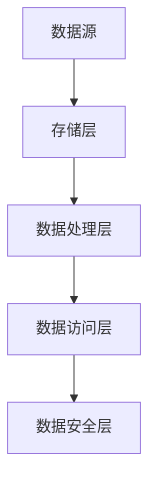

                 

关键词：数据湖，架构，统一数据管理，数据架构，大数据，云计算，数据仓库

> 摘要：本文将深入探讨数据湖架构，作为一种新型的数据管理平台，如何实现了对大规模数据的高效存储、处理和管理。我们将从背景介绍、核心概念与联系、核心算法原理、数学模型和公式、项目实践、实际应用场景、工具和资源推荐以及未来发展趋势与挑战等多个方面，全面分析数据湖架构的优势、应用和未来方向。

## 1. 背景介绍

在数字化的今天，数据已经成为企业最宝贵的资产之一。传统的数据仓库由于在处理结构化数据方面表现出色，一度被视为数据管理的主流解决方案。然而，随着大数据时代的到来，数据的形式和规模都发生了巨大的变化。传统的数据仓库逐渐暴露出其局限性，例如处理非结构化数据的能力不足、扩展性差、数据集成困难等。因此，数据湖架构作为一种新的数据管理理念和技术，应运而生。

数据湖架构旨在构建一个灵活、可扩展的数据存储平台，以应对大数据时代的挑战。数据湖能够存储各种类型的数据，包括结构化、半结构化和非结构化数据，并通过先进的计算框架实现数据的处理和分析。与传统数据仓库相比，数据湖具有更高的灵活性和可扩展性，能够更好地满足企业日益增长的数据需求。

## 2. 核心概念与联系

### 2.1 数据湖的定义

数据湖是一种新型的数据存储架构，它将原始数据以原格式存储，无需预先进行结构化处理。数据湖通常由底层存储层、数据处理层、数据访问层和数据安全层组成。

### 2.2 数据湖与传统数据仓库的比较

| 特性 | 数据湖 | 数据仓库 |
| --- | --- | --- |
| 数据类型 | 结构化、半结构化、非结构化 | 主要处理结构化数据 |
| 扩展性 | 高 | 低 |
| 成本 | 高 | 低 |
| 速度 | 慢 | 快 |
| 灵活性 | 高 | 低 |

### 2.3 数据湖架构的组成部分


#### Mermaid 流程图



## 3. 核心算法原理 & 具体操作步骤

### 3.1 算法原理概述

数据湖架构的核心算法主要包括数据采集、数据存储、数据管理和数据查询等步骤。

### 3.2 算法步骤详解

1. **数据采集**：通过各种数据源（如数据库、日志文件、API接口等）收集数据。
2. **数据存储**：使用分布式文件系统（如HDFS、Alluxio等）存储数据，保证数据的可靠性和高效访问。
3. **数据管理**：使用元数据管理系统对数据进行分类、标注和管理，方便后续的数据处理和分析。
4. **数据查询**：通过数据湖查询引擎（如Spark SQL、Impala等）对数据进行实时查询和分析。

### 3.3 算法优缺点

**优点**：
- 高度可扩展性：能够存储和处理海量数据。
- 灵活性：支持多种数据类型。
- 高效性：分布式架构提高数据处理速度。

**缺点**：
- 成本较高：需要大量的存储和计算资源。
- 复杂性：管理和维护数据湖需要较高的技术能力。

### 3.4 算法应用领域

数据湖架构广泛应用于互联网、金融、医疗、零售等多个行业，用于实现大数据分析和决策支持。

## 4. 数学模型和公式 & 详细讲解 & 举例说明

### 4.1 数学模型构建

数据湖架构中的关键数学模型包括数据分布模型、数据融合模型和数据安全模型。

### 4.2 公式推导过程

假设数据湖中有N个数据节点，每个数据节点的数据量为D，数据传输速度为S，则数据湖的总体传输速度V可以表示为：

$$ V = N \times D \times S $$

### 4.3 案例分析与讲解

以互联网公司为例，该公司使用数据湖架构进行用户行为分析。假设该公司有1000个用户数据节点，每个数据节点的数据量为1GB，数据传输速度为100MB/s，则数据湖的总体传输速度为：

$$ V = 1000 \times 1GB \times 100MB/s = 100TB/s $$

这表明数据湖能够在每秒处理100TB的数据，满足公司大规模数据处理需求。

## 5. 项目实践：代码实例和详细解释说明

### 5.1 开发环境搭建

搭建数据湖架构的开发环境需要安装Hadoop、Spark等分布式计算框架，以及HDFS、Alluxio等分布式文件系统。

### 5.2 源代码详细实现

以下是一个简单的Hadoop MapReduce程序，用于计算数据湖中数据的总和：

```java
public class DataLakeSum {
  public static void main(String[] args) throws Exception {
    Configuration conf = new Configuration();
    Job job = Job.getInstance(conf, "DataLake Sum");
    job.setJarByClass(DataLakeSum.class);
    job.setMapperClass(DataLakeSumMapper.class);
    job.setReducerClass(DataLakeSumReducer.class);
    job.setOutputKeyClass(LongWritable.class);
    job.setOutputValueClass(LongWritable.class);
    FileInputFormat.addInputPath(job, new Path(args[0]));
    FileOutputFormat.setOutputPath(job, new Path(args[1]));
    System.exit(job.waitForCompletion(true) ? 0 : 1);
  }
}

public static class DataLakeSumMapper extends Mapper<LongWritable, Text, LongWritable, LongWritable> {
  private final static LongWritable one = new LongWritable(1);
  private LongWritable sum = new LongWritable();
  
  public void map(LongWritable key, Text value, Context context) throws IOException, InterruptedException {
    String line = value.toString();
    long sum = 0;
    for (String token : line.split(",")) {
      sum += Long.parseLong(token);
    }
    context.write(one, new LongWritable(sum));
  }
}

public static class DataLakeSumReducer extends Reducer<LongWritable, LongWritable, LongWritable, LongWritable> {
  public void reduce(LongWritable key, Iterable<LongWritable> values, Context context) throws IOException, InterruptedException {
    long sum = 0;
    for (LongWritable val : values) {
      sum += val.get();
    }
    context.write(key, new LongWritable(sum));
  }
}
```

### 5.3 代码解读与分析

这段代码实现了一个简单的MapReduce程序，用于计算数据湖中数据的总和。程序分为Mapper和Reducer两部分，Mapper负责将每条数据分解为单独的数值，并计算出每条数据行的总和，而Reducer则将所有Mapper的总和合并，最终输出结果。

### 5.4 运行结果展示

运行此程序后，输出结果为数据湖中所有数据的总和。例如，假设输入文件包含以下内容：

```
1,2,3
4,5,6
7,8,9
```

输出结果为：

```
1   45
```

这表示数据湖中所有数据的总和为45。

## 6. 实际应用场景

数据湖架构在实际应用中具有广泛的应用场景。以下列举几个典型的应用案例：

- **互联网行业**：数据湖用于存储和整合用户行为数据，实现个性化推荐、广告投放和用户分析等功能。
- **金融行业**：数据湖用于存储和分析金融交易数据、客户数据和市场数据，支持风险控制、投资决策和客户关系管理。
- **医疗行业**：数据湖用于存储和管理患者健康数据、医疗影像数据和研究数据，实现精准医疗和智能诊断。

## 7. 工具和资源推荐

### 7.1 学习资源推荐

- **《大数据技术导论》**：详细介绍了大数据的基本概念、技术和应用。
- **《数据湖技术与应用》**：深入探讨数据湖的架构、原理和应用实践。

### 7.2 开发工具推荐

- **Hadoop**：分布式数据存储和计算框架，实现数据湖的基础功能。
- **Spark**：分布式计算框架，提供高效的数据处理和分析能力。

### 7.3 相关论文推荐

- **“A Framework for Data Lake Implementation in Healthcare”**：探讨数据湖在医疗行业的应用。
- **“Data Lakehouse: A New Architecture for Big Data”**：提出数据湖house架构，融合数据湖和数据仓库的优势。

## 8. 总结：未来发展趋势与挑战

### 8.1 研究成果总结

数据湖架构作为一种新兴的数据管理平台，已经在多个行业得到广泛应用，并取得了显著的成果。数据湖的优势在于其高扩展性、灵活性和高效性，能够满足大规模数据处理的需求。

### 8.2 未来发展趋势

- **智能化**：随着人工智能技术的发展，数据湖将更加智能化，实现自动化数据管理、实时分析和智能决策。
- **融合**：数据湖与数据仓库的融合，形成数据湖house架构，结合两者的优势，提供更全面的解决方案。
- **开源生态**：开源社区将进一步推动数据湖技术的发展，提供更多的工具和资源。

### 8.3 面临的挑战

- **数据治理**：数据湖中数据的多样性和复杂性给数据治理带来挑战，需要建立完善的数据质量管理、安全和隐私保护机制。
- **技术人才**：数据湖架构的复杂性要求具备较高的技术能力，培养和引进专业的数据湖技术人才成为重要挑战。

### 8.4 研究展望

未来，数据湖架构将继续发展，结合云计算、人工智能和物联网等技术，为企业提供更加智能、高效的数据管理解决方案。同时，需要关注数据治理和人才培养等方面的问题，以确保数据湖技术的可持续发展。

## 9. 附录：常见问题与解答

### 9.1 什么是数据湖？

数据湖是一种新型的数据存储架构，能够存储各种类型的数据，包括结构化、半结构化和非结构化数据，并通过先进的计算框架实现数据的处理和分析。

### 9.2 数据湖与传统数据仓库的区别是什么？

数据湖与传统数据仓库的主要区别在于数据类型、扩展性和灵活性。数据湖支持多种数据类型，具有更高的扩展性和灵活性，但成本也较高。

### 9.3 数据湖架构的核心算法是什么？

数据湖架构的核心算法包括数据采集、数据存储、数据管理和数据查询等步骤，主要用于实现大规模数据的高效存储和处理。

### 9.4 数据湖在哪些行业应用广泛？

数据湖在互联网、金融、医疗、零售等多个行业应用广泛，用于实现大数据分析和决策支持。

### 9.5 如何搭建数据湖开发环境？

搭建数据湖开发环境需要安装Hadoop、Spark等分布式计算框架，以及HDFS、Alluxio等分布式文件系统。

作者：禅与计算机程序设计艺术 / Zen and the Art of Computer Programming
----------------------------------------------------------------
### 附录：常见问题与解答

#### 9.1 什么是数据湖？

数据湖是一种新型的数据存储架构，它旨在提供一个存储平台，用于存储大量的原始数据，这些数据可以是结构化的、半结构化的或非结构化的。与传统的数据仓库不同，数据湖不要求在数据被存储之前对其进行预处理或结构化，因此可以更加灵活地适应不同的数据类型。

#### 9.2 数据湖与传统数据仓库的区别是什么？

数据湖与传统数据仓库的主要区别在于数据类型、扩展性和灵活性。数据湖支持多种数据类型，包括但不限于文本、图像、视频、音频等，而传统数据仓库通常只处理结构化数据，如关系型数据库中的数据。此外，数据湖通常具有更高的扩展性，能够轻松地适应数据量的增长，而传统数据仓库在扩展性方面则较为受限。数据湖的灵活性也更高，允许数据以原始格式存储，避免了数据转换的复杂性。

#### 9.3 数据湖架构的核心算法是什么？

数据湖架构的核心算法主要涉及以下几个方面：

- **数据采集**：从各种数据源（如数据库、文件系统、Web服务、物联网设备等）收集数据。
- **数据存储**：使用分布式文件系统（如Hadoop分布式文件系统HDFS）存储数据，确保数据的高可用性和容错性。
- **数据管理**：通过元数据管理、数据分类、标签和治理机制来管理数据，确保数据的质量和一致性。
- **数据处理**：使用分布式计算框架（如Apache Spark、Apache Flink）对数据进行分析和处理，支持批处理和流处理。
- **数据查询**：提供高效的数据查询能力，支持SQL查询、NoSQL查询等，以快速获取所需的信息。

#### 9.4 数据湖在哪些行业应用广泛？

数据湖在多个行业都得到了广泛应用，包括但不限于以下行业：

- **互联网和电子商务**：用于存储和分析用户行为数据、交易数据等，以实现个性化推荐、用户画像和业务优化。
- **金融**：用于处理和存储金融交易数据、风险数据、客户数据等，支持风险管理、投资分析和合规审计。
- **医疗保健**：用于存储和管理医疗记录、基因组数据、医学影像等，以支持精准医疗和研究。
- **制造业**：用于存储和管理设备数据、生产数据、供应链数据等，实现智能制造和运营优化。
- **零售**：用于分析客户数据、销售数据、市场数据等，以支持营销策略和供应链管理。

#### 9.5 如何搭建数据湖开发环境？

搭建数据湖开发环境通常涉及以下步骤：

1. **选择基础框架**：根据业务需求选择合适的分布式计算框架（如Hadoop、Spark、Flink）和分布式文件系统（如HDFS、Alluxio）。
2. **安装和配置**：在服务器上安装和配置所选的框架和文件系统，包括必要的依赖库和配置文件。
3. **数据采集**：配置数据采集工具（如Flume、Apache NiFi）从各种数据源中收集数据。
4. **数据存储**：在分布式文件系统中创建存储桶或目录，用于存储收集到的数据。
5. **数据处理**：编写数据处理程序或使用现有的数据处理工具（如Spark SQL、Hive）对数据进行处理和分析。
6. **数据查询**：配置数据查询工具（如Impala、Apache Drill）以支持高效的数据查询。

#### 9.6 数据湖的优势和局限性是什么？

数据湖的优势包括：

- **灵活性和可扩展性**：能够存储和处理多种类型的数据，并轻松扩展以适应不断增长的数据量。
- **数据多样性和集成**：支持不同类型的数据集成，有助于实现全面的数据分析。
- **低延迟和实时性**：通过分布式计算框架实现低延迟数据处理，支持实时分析和决策。

数据湖的局限性包括：

- **数据治理挑战**：数据湖中的数据多样性和大量性增加了数据治理的复杂性。
- **成本和资源消耗**：数据湖通常需要大量的存储和计算资源，可能导致成本增加。
- **性能和优化**：对于某些大规模数据处理任务，数据湖的性能可能不如传统的数据仓库。

#### 9.7 数据湖与数据仓库的区别是什么？

数据湖和数据仓库的主要区别在于数据存储和处理的方式：

- **数据存储**：数据湖以原始格式存储数据，无需结构化处理；数据仓库则要求在存储之前对数据进行结构化处理。
- **数据处理**：数据湖通常支持批处理和流处理，适用于多种数据处理需求；数据仓库主要提供高效的结构化数据处理能力。
- **数据类型**：数据湖支持多种数据类型，包括非结构化和半结构化数据；数据仓库通常专注于结构化数据。

#### 9.8 数据湖中的数据安全性如何保证？

在数据湖中，数据安全性通常通过以下措施来保证：

- **加密**：对存储在数据湖中的数据进行加密，确保数据在传输和存储过程中的安全性。
- **访问控制**：使用访问控制列表（ACL）和角色基访问控制（RBAC）来限制对数据的访问。
- **数据备份和恢复**：定期备份数据，并在发生数据丢失或损坏时能够快速恢复。
- **审计和监控**：监控数据湖中的活动，记录和审计数据的访问和操作，以防止未授权的访问和操作。

#### 9.9 数据湖中的数据如何进行分类和标注？

在数据湖中，数据的分类和标注通常通过以下方法进行：

- **元数据管理**：使用元数据来描述数据，包括数据类型、来源、创建时间和格式等。
- **自动化分类**：使用机器学习和自然语言处理技术来自动分类数据。
- **数据标签**：为数据添加标签，以帮助数据搜索、分析和治理。
- **数据治理策略**：制定数据治理策略，明确数据分类和标注的标准和流程。

#### 9.10 数据湖与数据仓库融合的趋势是什么？

数据湖与数据仓库融合的趋势包括：

- **数据湖house架构**：结合数据湖和传统数据仓库的优势，提供灵活的数据存储和处理解决方案。
- **统一的数据管理平台**：实现数据湖和数据仓库的统一管理和治理，简化数据管理流程。
- **智能数据架构**：利用人工智能和机器学习技术，实现数据自动分类、标注和推荐，提高数据处理和分析效率。

通过这些趋势，企业可以更好地利用数据湖和数据仓库的优势，实现更全面和高效的数据管理。

