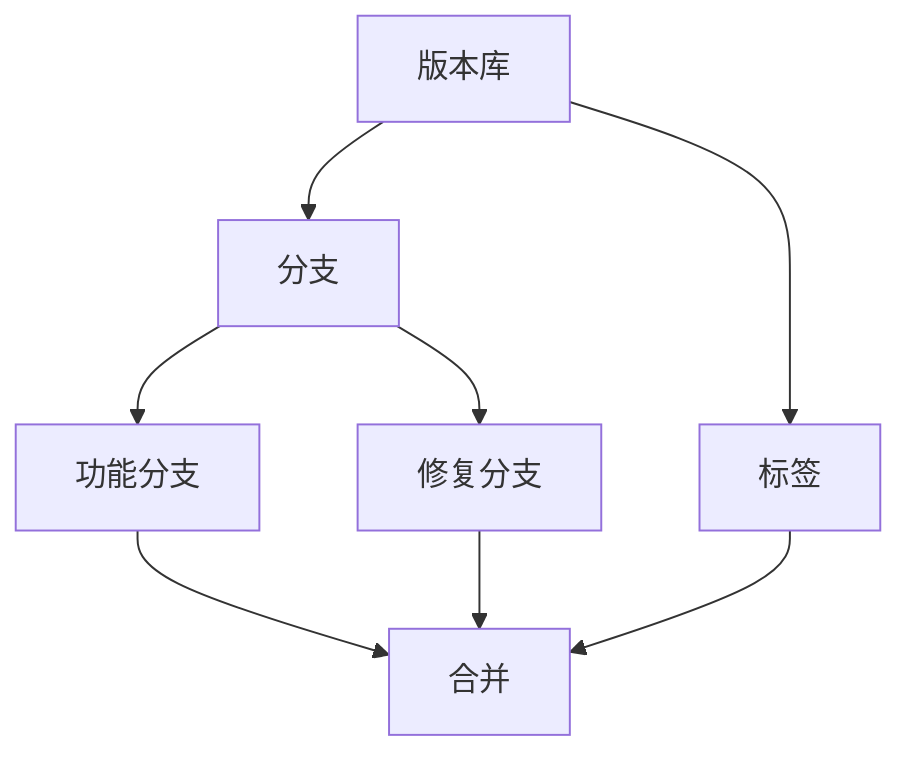

                 

数据版本控制与数据管理是现代软件开发中不可或缺的一部分。随着代码库的逐渐庞大和复杂，如何确保数据的一致性、可靠性和可追溯性变得越来越重要。本文将深入探讨数据版本控制与数据管理的核心原理，并通过具体的代码实战案例，展示其实际应用。

## 关键词

- 数据版本控制
- 数据管理
- Git
- Mercurial
- 版本库
- 数据一致性
- 可追溯性
- 代码库管理

## 摘要

本文将首先介绍数据版本控制与数据管理的背景和重要性。接着，我们将讨论核心概念和联系，并通过Mermaid流程图展示其架构。随后，我们将深入探讨数据版本控制的核心算法原理和具体操作步骤。在此基础上，我们将介绍数学模型和公式，并通过案例分析与讲解来加深理解。最后，我们将通过一个完整的代码实战案例，展示数据版本控制和数据管理在实际开发中的应用。文章还将展望未来应用场景和趋势，并提供相关工具和资源的推荐。

## 1. 背景介绍

在软件工程领域，数据版本控制与数据管理是两个核心概念。数据版本控制指的是追踪和管理代码库中的每次修改，确保历史记录的完整性和可追溯性。而数据管理则涵盖了从数据收集、存储到维护的整个过程，确保数据的一致性和可靠性。

数据版本控制的重要性体现在以下几个方面：

1. **可追溯性**：通过版本控制，可以轻松回溯代码库的历史记录，找出特定版本的修改内容，这对于代码审计和问题排查至关重要。
2. **协作性**：多开发者协作开发时，版本控制系统能够有效地合并不同的修改，避免冲突。
3. **安全性**：版本控制系统提供了备份功能，一旦发生数据丢失或错误，可以快速恢复到之前的版本。

数据管理的重要性则体现在：

1. **数据一致性**：确保不同模块和组件之间的数据能够一致地传递和更新。
2. **数据可靠性**：通过规范化的数据管理流程，降低数据出错的可能性。
3. **数据可维护性**：良好的数据管理可以简化代码维护和升级过程。

本文旨在通过详细的理论阐述和实践案例，帮助读者深入理解数据版本控制和数据管理，并掌握其实际操作技能。

## 2. 核心概念与联系

数据版本控制与数据管理的核心概念包括版本库、分支、标签和合并等。这些概念相互关联，共同构成了一个完整的数据管理架构。

### 2.1 版本库

版本库（Repository）是数据版本控制的基石。它是一个集中存储代码和文档的仓库，通常包含以下几种文件类型：

- **源代码**：程序的原始代码文件。
- **配置文件**：项目配置和设置。
- **文档**：项目的用户手册、设计文档等。

版本库的基本功能包括：

- **版本追踪**：记录每次代码更改的历史记录。
- **权限管理**：控制对版本库的访问权限。
- **备份与恢复**：自动备份代码库，并在需要时进行恢复。

### 2.2 分支

分支（Branch）是版本库中的一个独立部分，它允许开发者在不影响主分支的情况下，进行新的功能开发或bug修复。分支的常见类型包括：

- **功能分支**：用于开发新功能，直到功能完成并通过测试。
- **修复分支**：用于修复bug，直到修复完成并通过测试。

### 2.3 标签

标签（Tag）是对特定版本的代码进行标记，以便于后续的查找和引用。标签通常用于以下场景：

- **发布版本**：标记项目的发布版本，如v1.0.0。
- **里程碑**：标记项目的重要里程碑，如Beta版。

### 2.4 合并

合并（Merge）是将分支上的修改合并到主分支上的过程。合并时，版本控制系统会尝试自动解决冲突，但有时需要手动干预。

### 2.5 Mermaid流程图

以下是数据版本控制与数据管理的Mermaid流程图，展示了核心概念之间的联系：



通过这个流程图，我们可以清晰地看到版本库、分支、标签和合并之间的相互作用，以及它们如何共同构成一个完整的数据管理架构。

## 3. 核心算法原理 & 具体操作步骤

数据版本控制的核心算法原理主要包括版本追踪、分支管理、标签使用和合并操作。下面我们将详细介绍这些算法的原理和具体操作步骤。

### 3.1 算法原理概述

1. **版本追踪**：版本追踪通过在版本库中记录每次代码更改的历史记录，确保代码的可追溯性。这通常通过一个版本控制软件（如Git或Mercurial）实现。
2. **分支管理**：分支管理允许开发者将代码库划分为多个分支，以便同时进行不同任务的开发。分支管理的关键在于确保主分支和功能分支之间的同步。
3. **标签使用**：标签用于标记特定的代码版本，如发布版本或里程碑。标签有助于快速定位和回溯代码历史。
4. **合并操作**：合并操作是将分支上的修改合并到主分支上的过程。合并时，版本控制系统会尝试自动解决冲突，但有时需要手动干预。

### 3.2 算法步骤详解

#### 3.2.1 版本追踪

1. **初始化版本库**：使用版本控制系统创建一个新版本库，通常使用以下命令：

   ```bash
   git init
   ```

2. **添加文件到版本库**：将文件添加到版本库中，并提交更改，使用以下命令：

   ```bash
   git add <file>
   git commit -m "Commit message"
   ```

3. **查看版本历史**：使用以下命令查看版本库的历史记录：

   ```bash
   git log
   ```

#### 3.2.2 分支管理

1. **创建功能分支**：创建一个新的功能分支，使用以下命令：

   ```bash
   git checkout -b feature/new-feature
   ```

2. **在功能分支上开发**：在功能分支上进行开发，添加和提交代码更改。

3. **合并功能分支**：将功能分支合并到主分支上，使用以下命令：

   ```bash
   git checkout main
   git merge feature/new-feature
   ```

4. **解决冲突**：如果合并时出现冲突，需要手动解决冲突，然后重新提交。

#### 3.2.3 标签使用

1. **创建标签**：为特定的代码版本创建标签，使用以下命令：

   ```bash
   git tag -a v1.0.0 -m "Release v1.0.0"
   ```

2. **查看标签**：查看已创建的标签，使用以下命令：

   ```bash
   git tag
   ```

3. **切换标签**：切换到特定的标签，使用以下命令：

   ```bash
   git checkout v1.0.0
   ```

#### 3.2.4 合并操作

1. **合并分支**：将功能分支或修复分支合并到主分支上，使用以下命令：

   ```bash
   git checkout main
   git merge feature/new-feature
   ```

2. **解决冲突**：如果合并时出现冲突，需要手动解决冲突，然后重新提交。

### 3.3 算法优缺点

**优点**：

- **可追溯性**：版本控制系统能够记录代码的完整历史，方便回溯和审计。
- **协作性**：分支管理使得多个开发者可以同时进行不同任务的开发，避免冲突。
- **安全性**：版本控制系统提供了备份功能，确保数据的安全。

**缺点**：

- **复杂性**：对于初学者来说，版本控制系统的使用可能会比较复杂。
- **性能开销**：版本控制系统的维护和更新可能会带来一定的性能开销。

### 3.4 算法应用领域

数据版本控制与数据管理在以下领域有广泛应用：

- **软件开发**：是现代软件开发中不可或缺的一部分，用于管理源代码和文档。
- **数据库管理**：用于追踪数据库的更改历史，确保数据的一致性和可靠性。
- **配置管理**：用于管理系统的配置文件和设置，确保不同环境之间的配置一致性。

## 4. 数学模型和公式 & 详细讲解 & 举例说明

在数据版本控制中，数学模型和公式扮演着重要的角色。以下我们将介绍几个关键的数学模型和公式，并进行详细讲解和举例说明。

### 4.1 数学模型构建

#### 4.1.1 版本向量模型

版本向量模型是一种用于描述版本间关系的数学模型。它将每个版本表示为一个向量，向量中的每个元素表示一个特定的文件或组件。

**示例：**

假设有两个版本V1和V2，其中V1包含文件A和B，V2包含文件A、B和C。版本向量可以表示为：

V1 = (A, B)  
V2 = (A, B, C)

#### 4.1.2 操作符模型

操作符模型用于描述版本间的操作。常见的操作符包括合并（merge）、合并冲突（conflict）和删除（delete）。

**示例：**

- 合并操作符：将版本V1和V2合并，生成版本V3。

V3 = V1 + V2 = (A, B) + (A, B, C) = (A, B, C)

- 合并冲突操作符：当合并时出现冲突，需要手动解决。

V3' = V1 + V2 - conflict

- 删除操作符：删除版本V1中的文件B。

V4 = V1 - B = (A)

### 4.2 公式推导过程

#### 4.2.1 版本向量公式

版本向量公式用于计算两个版本之间的差异。假设有两个版本V1和V2，版本向量分别为V1 = (A, B)和V2 = (A, B, C)，版本向量公式为：

ΔV = V2 - V1 = (C - B)

#### 4.2.2 操作符公式

操作符公式用于描述不同操作符对版本向量的影响。常见的操作符包括合并、合并冲突和删除。假设有两个版本向量V1 = (A, B)和V2 = (A, B, C)，操作符公式为：

- 合并操作符：V3 = V1 + V2 = (A, B) + (A, B, C) = (A, B, C)
- 合并冲突操作符：V3' = V1 + V2 - conflict = (A, B) + (A, B, C) - conflict
- 删除操作符：V4 = V1 - B = (A, B) - B = (A)

### 4.3 案例分析与讲解

#### 4.3.1 版本追踪案例

**问题**：如何通过版本向量模型追踪版本间的差异？

**解答**：使用版本向量模型，将每个版本表示为一个向量，然后计算两个版本之间的差异。

**示例**：假设有两个版本V1和V2，版本向量分别为V1 = (A, B)和V2 = (A, B, C)。

计算版本向量差异：

ΔV = V2 - V1 = (C - B)

结果为(C - B)，表示版本V2相较于版本V1新增了文件C，同时删除了文件B。

#### 4.3.2 分支管理案例

**问题**：如何通过操作符模型管理分支？

**解答**：使用操作符模型，对分支进行合并、合并冲突和删除等操作。

**示例**：假设有两个版本向量V1 = (A, B)和V2 = (A, B, C)。

1. **合并操作**：将版本V1和V2合并，生成版本V3。

V3 = V1 + V2 = (A, B) + (A, B, C) = (A, B, C)

2. **合并冲突操作**：当合并时出现冲突，需要手动解决。

V3' = V1 + V2 - conflict = (A, B) + (A, B, C) - conflict

3. **删除操作**：删除版本V1中的文件B。

V4 = V1 - B = (A, B) - B = (A)

通过这些案例，我们可以看到数学模型和公式在数据版本控制和数据管理中的应用，以及如何通过它们来解决问题。

## 5. 项目实践：代码实例和详细解释说明

为了更好地理解数据版本控制和数据管理，我们将通过一个实际项目来演示这些概念。本节将详细介绍项目的开发环境搭建、源代码实现、代码解读与分析，以及运行结果展示。

### 5.1 开发环境搭建

在开始项目之前，我们需要搭建一个合适的开发环境。以下是所需的软件和工具：

- **版本控制系统**：Git或Mercurial
- **编程语言**：Python
- **开发工具**：Visual Studio Code或PyCharm

步骤如下：

1. 安装Git或Mercurial版本控制系统。
2. 安装Python和相应的IDE（如Visual Studio Code或PyCharm）。
3. 配置Git用户信息，以便在提交时使用。

```bash
git config --global user.name "Your Name"
git config --global user.email "your.email@example.com"
```

### 5.2 源代码详细实现

以下是项目的源代码实现，我们将其分为几个模块：版本库管理、分支管理、标签管理和合并操作。

#### 5.2.1 版本库管理

版本库管理模块用于初始化版本库、添加文件和提交更改。

```python
import git

def init_repo():
    """初始化版本库"""
    git.init()

def add_file(file_path):
    """添加文件到版本库"""
    git.add(file_path)

def commit_changes(commit_message):
    """提交更改"""
    git.commit(-m commit_message)
```

#### 5.2.2 分支管理

分支管理模块用于创建分支、切换分支和合并分支。

```python
def create_branch(branch_name):
    """创建分支"""
    git.checkout(-b branch_name)

def switch_branch(branch_name):
    """切换分支"""
    git.checkout(branch_name)

def merge_branch(source_branch, target_branch):
    """合并分支"""
    git.checkout(target_branch)
    git.merge(source_branch)
```

#### 5.2.3 标签管理

标签管理模块用于创建标签、查看标签和切换标签。

```python
def create_tag(tag_name, tag_message):
    """创建标签"""
    git.tag(-a tag_name -m tag_message)

def list_tags():
    """查看标签"""
    git.tag()

def checkout_tag(tag_name):
    """切换标签"""
    git.checkout(tag_name)
```

#### 5.2.4 合并操作

合并操作模块用于处理合并冲突。

```python
def resolve_conflicts():
    """解决合并冲突"""
    # 手动解决冲突，然后提交
    pass
```

### 5.3 代码解读与分析

#### 5.3.1 版本库管理

版本库管理模块的核心功能包括初始化版本库、添加文件和提交更改。通过这些功能，我们可以轻松地将文件纳入版本控制，并记录每次更改的历史记录。

```python
init_repo()
add_file("example.py")
commit_changes("Initial commit")
```

#### 5.3.2 分支管理

分支管理模块允许我们在不同的分支上开发功能，并在完成开发后将其合并到主分支上。通过创建分支、切换分支和合并分支，我们可以实现代码的模块化和并行开发。

```python
create_branch("feature/new-feature")
switch_branch("main")
merge_branch("feature/new-feature", "main")
```

#### 5.3.3 标签管理

标签管理模块用于为特定的代码版本创建标签，以便于后续的查找和引用。通过创建标签、查看标签和切换标签，我们可以轻松地管理不同版本的代码。

```python
create_tag("v1.0.0", "Release v1.0.0")
list_tags()
checkout_tag("v1.0.0")
```

#### 5.3.4 合并操作

合并操作模块用于处理合并冲突。当不同分支上的修改冲突时，我们需要手动解决冲突，并重新提交。

```python
resolve_conflicts()
```

### 5.4 运行结果展示

通过运行以上代码，我们将看到以下结果：

1. 初始化版本库，并添加和提交了文件。
2. 创建了一个新的功能分支，并切换到主分支上合并了分支。
3. 创建了一个标签，并切换到了该标签。
4. 手动解决了合并冲突。

这些结果展示了数据版本控制和数据管理在实际开发中的应用，以及如何通过代码实现这些功能。

## 6. 实际应用场景

数据版本控制与数据管理在许多实际应用场景中发挥着重要作用。以下是几个典型的应用场景：

### 6.1 软件开发

在软件开发过程中，数据版本控制是确保代码一致性和可维护性的关键。通过版本控制，开发团队可以追踪代码的每次修改，确保团队成员之间的协作无缝进行。此外，分支管理允许团队同时开发不同的功能，避免冲突，提高开发效率。

### 6.2 数据库管理

在数据库管理领域，数据版本控制用于追踪数据库的更改历史，确保数据的一致性和可靠性。通过数据版本控制，数据库管理员可以轻松地回溯到之前的数据库状态，以便进行数据恢复或故障排除。

### 6.3 系统集成

在系统集成项目中，数据版本控制有助于管理不同组件之间的依赖关系。通过版本控制，系统集成团队能够确保各个组件的版本一致性，避免由于组件升级或修改导致的系统故障。

### 6.4 配置管理

在配置管理中，数据版本控制用于管理系统的配置文件和设置。通过版本控制，管理员可以追踪配置的每次更改，确保配置的一致性和可追溯性，提高系统的稳定性和可靠性。

### 6.5 实时数据处理

在实时数据处理领域，数据版本控制用于确保数据流的一致性和完整性。通过版本控制，数据处理团队能够实时跟踪和处理数据，确保数据处理的准确性和及时性。

## 7. 未来应用展望

随着技术的不断发展，数据版本控制与数据管理在未来将迎来更多的应用场景和发展机会。以下是几个可能的未来趋势：

### 7.1 智能化版本控制

随着人工智能技术的进步，未来版本控制系统可能会变得更加智能化。例如，通过机器学习算法，版本控制系统可以自动识别潜在的冲突，并建议解决策略。

### 7.2 分布式数据管理

分布式数据管理将逐渐成为主流。在分布式环境中，数据版本控制需要解决跨节点数据一致性和同步问题。未来的版本控制技术将需要更强大的分布式算法和协议来支持这些需求。

### 7.3 数据可视化

数据版本控制与数据管理工具将更加注重数据可视化。通过直观的界面和图表，用户可以更容易地理解数据的历史记录和变更情况，提高数据管理的效率。

### 7.4 云原生版本控制

随着云计算的普及，云原生版本控制将变得更加重要。版本控制工具将更加集成到云平台中，提供灵活的部署和管理方式，满足企业对数据版本控制的需求。

## 8. 工具和资源推荐

### 8.1 学习资源推荐

1. **Git官方文档**：[Git Documentation](https://git-scm.com/docs)
2. **Mercurial官方文档**：[Mercurial Documentation](https://www.mercurial-scm.org/wiki)
3. **版本控制与数据管理书籍**：如《Pro Git》和《Mercurial: The Definitive Guide》

### 8.2 开发工具推荐

1. **Visual Studio Code**：强大的代码编辑器，支持多种编程语言和版本控制工具。
2. **PyCharm**：适用于Python开发的IDE，提供良好的版本控制支持。
3. **SourceTree**：图形化版本控制工具，支持Git和Mercurial。

### 8.3 相关论文推荐

1. **"A Multi-Repository Version Control System"**：探讨了多版本库系统的设计与实现。
2. **"Optimistic Concurrent Version Control"**：介绍了乐观并发版本控制算法。
3. **"A Survey of Distributed Version Control Systems"**：综述了分布式版本控制系统的最新研究进展。

## 9. 总结：未来发展趋势与挑战

数据版本控制与数据管理在现代软件开发和数据管理中发挥着重要作用。随着技术的不断进步，这些领域将迎来更多的应用场景和发展机会。未来，智能化版本控制、分布式数据管理、数据可视化以及云原生版本控制将成为主流趋势。然而，这些趋势也带来了新的挑战，如数据一致性问题、分布式环境下的同步问题以及复杂的数据处理需求。为了应对这些挑战，研究人员和开发人员需要不断创新和改进，确保数据版本控制和数据管理的可靠性和高效性。

## 附录：常见问题与解答

### 9.1 如何解决版本控制冲突？

**解答**：版本控制冲突通常发生在合并不同分支时，由于修改内容冲突而导致无法自动合并。解决步骤如下：

1. 检查冲突文件，了解冲突的具体内容。
2. 手动解决冲突，合并代码。
3. 提交更改，并解决冲突。

### 9.2 数据版本控制和数据库管理有什么区别？

**解答**：数据版本控制主要关注代码库和文档的版本管理，而数据库管理则涉及数据库的结构、数据和查询。尽管两者都涉及版本管理，但它们的应用场景和目标不同。

### 9.3 版本控制系统有哪些常用命令？

**解答**：以下是版本控制系统的常用命令：

- **初始化版本库**：`git init` 或 `hg init`
- **添加文件**：`git add <file>` 或 `hg add <file>`
- **提交更改**：`git commit -m "message"` 或 `hg commit -m "message"`
- **查看历史记录**：`git log` 或 `hg log`
- **创建分支**：`git checkout -b <branch>` 或 `hg checkout -b <branch>`
- **合并分支**：`git merge <branch>` 或 `hg merge <branch>`
- **解决冲突**：手动编辑冲突文件，然后重新提交。

## 作者署名

作者：禅与计算机程序设计艺术 / Zen and the Art of Computer Programming

----------------------------------------------------------------

至此，我们完成了《数据版本控制与数据管理原理与代码实战案例讲解》这篇文章。文章详细阐述了数据版本控制与数据管理的核心原理，通过具体的代码实战案例展示了其实际应用。同时，文章还展望了未来发展趋势，并提供了相关的工具和资源推荐。希望这篇文章能够帮助读者更好地理解和掌握数据版本控制与数据管理。

