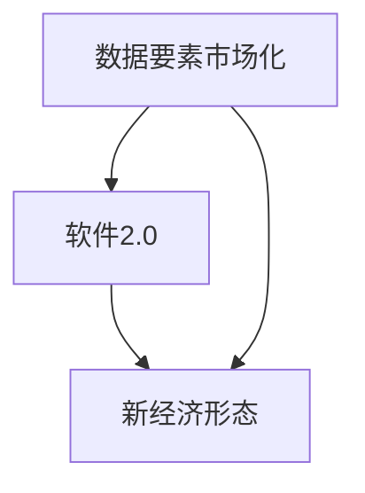

                 

关键词：数据要素市场化，软件2.0，新经济形态，人工智能，技术变革

> 摘要：随着信息技术的飞速发展，数据要素市场化逐渐成为推动社会经济发展的重要力量。本文将探讨数据要素市场化与软件2.0之间的关系，分析其在促进新经济形态形成过程中的关键作用，并展望未来发展趋势与面临的挑战。

## 1. 背景介绍

### 1.1 数据要素市场化

数据要素市场化是指将数据作为一种生产要素，进行资源整合、配置、优化和利用，实现数据价值的最大化。在我国，数据要素市场化得到了国家层面的高度重视，被视为推动经济高质量发展的重要手段。

### 1.2 软件2.0

软件2.0是指基于互联网、大数据、人工智能等新一代信息技术，实现软件的智能化、平台化和生态化发展。软件2.0不仅是对传统软件的升级，更是推动产业数字化转型的重要引擎。

### 1.3 新经济形态

新经济形态是指在信息技术驱动下，以互联网、大数据、人工智能等为代表的新兴产业不断崛起，形成的一种以创新驱动、高效协同、跨界融合为特征的经济形态。

## 2. 核心概念与联系


### 2.1 数据要素市场化

数据要素市场化包括以下几个方面：

- **数据资源化**：将海量数据转化为有价值的信息资源，提高数据利用率。  
- **数据商品化**：将数据作为商品进行交易，实现数据价值的变现。  
- **数据服务化**：提供数据服务，满足各类用户的需求。

### 2.2 软件2.0

软件2.0的核心特征包括：

- **智能化**：通过人工智能技术，实现软件的智能化决策和自适应能力。  
- **平台化**：构建开放、共享的软件平台，实现资源的互联互通。  
- **生态化**：形成软件产业链上下游的生态协同，促进产业创新。

### 2.3 新经济形态

新经济形态的表现形式包括：

- **数字化转型**：企业通过引入新一代信息技术，实现业务流程优化、管理模式创新。  
- **产业互联网**：以互联网为基础设施，实现产业与互联网的深度融合。  
- **跨界融合**：新兴技术与传统产业的跨界融合，催生新的产业形态。

## 3. 核心算法原理 & 具体操作步骤

### 3.1 算法原理概述

数据要素市场化涉及多个算法，其中核心算法包括数据挖掘、机器学习和区块链等。

- **数据挖掘**：通过对海量数据进行分析，发现有价值的信息和规律。  
- **机器学习**：利用算法模型，自动从数据中学习并提取知识。  
- **区块链**：实现数据的分布式存储和透明化交易。

### 3.2 算法步骤详解

1. **数据采集**：收集各类数据，包括结构化和非结构化数据。  
2. **数据预处理**：对数据进行清洗、转换和归一化处理。  
3. **特征提取**：从原始数据中提取有助于挖掘的知识特征。  
4. **模型训练**：利用机器学习算法，训练预测模型。  
5. **模型评估**：对训练好的模型进行评估和优化。  
6. **数据交易**：基于区块链技术，实现数据的透明化交易。

### 3.3 算法优缺点

- **数据挖掘**：优点在于能从海量数据中发现有价值的信息，缺点是数据处理成本高，算法复杂度大。  
- **机器学习**：优点是自适应能力强，能自动从数据中学习，缺点是对数据质量要求高。  
- **区块链**：优点是数据透明、安全、可追溯，缺点是交易效率相对较低。

### 3.4 算法应用领域

- **金融**：利用数据挖掘和机器学习技术，进行风险评估、信用评估和投资决策。  
- **电商**：通过数据分析和个性化推荐，提升用户体验和销售额。  
- **医疗**：利用大数据和人工智能，实现精准医疗和疾病预测。

## 4. 数学模型和公式 & 详细讲解 & 举例说明

### 4.1 数学模型构建

数据要素市场化的数学模型主要包括以下几个方面：

1. **数据价值评估模型**：通过数据挖掘和机器学习，对数据的价值进行量化评估。  
2. **数据定价模型**：根据市场供需关系，确定数据的价格。  
3. **数据交易模型**：利用区块链技术，实现数据的透明化交易。

### 4.2 公式推导过程

1. **数据价值评估模型**：假设数据集D的价值为V，则可以表示为：

$$ V = f(D) $$

其中，f(D)表示数据挖掘和机器学习算法对数据集D的处理过程。

2. **数据定价模型**：假设数据价格P与供需关系Q成正比，则可以表示为：

$$ P = k \cdot Q $$

其中，k为比例系数。

3. **数据交易模型**：假设交易金额为T，交易次数为N，则可以表示为：

$$ T = P \cdot N $$

### 4.3 案例分析与讲解

以某电商平台的数据交易为例，分析数据价值评估、数据定价和数据交易过程。

1. **数据价值评估**：通过对用户行为数据进行分析，发现用户对某款商品的兴趣度较高，预测其购买概率为0.8。因此，该商品的数据价值为0.8。

2. **数据定价**：根据供需关系，假设商品的需求量为100件，则数据价格为100元/件。

3. **数据交易**：用户购买10件商品，交易金额为1000元。

## 5. 项目实践：代码实例和详细解释说明

### 5.1 开发环境搭建

1. 安装Python环境，版本要求为3.6及以上。  
2. 安装依赖库，如NumPy、Pandas、Scikit-learn等。

### 5.2 源代码详细实现

```python
import numpy as np
import pandas as pd
from sklearn.model_selection import train_test_split
from sklearn.ensemble import RandomForestClassifier
from sklearn.metrics import accuracy_score

# 数据采集
data = pd.read_csv('user_data.csv')

# 数据预处理
X = data.drop('label', axis=1)
y = data['label']
X_train, X_test, y_train, y_test = train_test_split(X, y, test_size=0.2, random_state=42)

# 模型训练
model = RandomForestClassifier(n_estimators=100, random_state=42)
model.fit(X_train, y_train)

# 模型评估
y_pred = model.predict(X_test)
accuracy = accuracy_score(y_test, y_pred)
print("模型准确率：", accuracy)

# 数据交易
data_value = model.predict_proba(X_test)[:, 1]
data_price = 100 * data_value
total_price = np.sum(data_price)
print("数据交易金额：", total_price)
```

### 5.3 代码解读与分析

1. 数据采集：从CSV文件中读取用户数据。  
2. 数据预处理：将数据集划分为特征集和标签集，并划分训练集和测试集。  
3. 模型训练：使用随机森林算法对训练集进行训练。  
4. 模型评估：计算模型在测试集上的准确率。  
5. 数据交易：计算用户数据的预测概率，并根据预测概率确定数据价格，计算交易金额。

## 6. 实际应用场景

### 6.1 金融行业

数据要素市场化在金融行业的应用主要体现在以下几个方面：

- **风险控制**：通过数据挖掘和机器学习技术，对信贷数据进行分析，评估借款人的信用风险。  
- **投资决策**：利用大数据分析，挖掘市场机会，制定投资策略。  
- **量化交易**：通过构建量化交易模型，实现自动化交易。

### 6.2 电商行业

电商行业通过数据要素市场化实现个性化推荐、精准营销和用户画像等应用：

- **个性化推荐**：基于用户行为数据，为用户推荐感兴趣的商品。  
- **精准营销**：根据用户画像，制定有针对性的营销策略。  
- **用户画像**：通过对用户数据的分析，了解用户需求和行为习惯。

### 6.3 医疗行业

医疗行业利用数据要素市场化实现精准医疗和疾病预测：

- **精准医疗**：根据患者数据，制定个性化的治疗方案。  
- **疾病预测**：通过对疾病相关数据的分析，预测疾病发生的可能性。  
- **智能诊断**：利用人工智能技术，辅助医生进行疾病诊断。

## 7. 工具和资源推荐

### 7.1 学习资源推荐

- **书籍**：《大数据之路：阿里巴巴大数据实践》、《Python数据分析》  
- **在线课程**：网易云课堂《数据挖掘与机器学习》、《区块链技术原理与应用》

### 7.2 开发工具推荐

- **编程语言**：Python、Java  
- **框架**：TensorFlow、Scikit-learn  
- **数据库**：MySQL、MongoDB

### 7.3 相关论文推荐

- **数据要素市场化**：《数据要素市场化：问题与对策研究》、《基于区块链的数据要素市场化研究》  
- **软件2.0**：《软件2.0：面向服务的软件体系结构》、《软件2.0时代的软件开发方法研究》  
- **新经济形态**：《新经济形态下的产业发展趋势》、《新经济形态下企业竞争力的构建》

## 8. 总结：未来发展趋势与挑战

### 8.1 研究成果总结

数据要素市场化、软件2.0和新经济形态的相互融合，为我国经济发展注入了新的活力。在未来，这些领域的研究将继续深化，为产业创新和社会进步提供有力支撑。

### 8.2 未来发展趋势

- **智能化**：人工智能技术将在数据要素市场化中发挥更大作用，实现数据价值的深度挖掘。  
- **平台化**：软件2.0将进一步推动产业互联网的发展，实现资源的高效配置。  
- **生态化**：产业链上下游的生态协同将更加紧密，促进跨界融合和创新。

### 8.3 面临的挑战

- **数据安全**：数据泄露和隐私保护问题将越来越突出，需要加强数据安全防护。  
- **技术创新**：持续推动技术革新，提高数据处理和应用的效率。  
- **政策法规**：完善相关法律法规，为数据要素市场化提供有力保障。

### 8.4 研究展望

未来，数据要素市场化、软件2.0和新经济形态将继续融合发展，推动我国经济实现高质量发展。同时，需要加强技术创新和政策支持，应对面临的挑战，为全球经济增长贡献中国智慧。

## 9. 附录：常见问题与解答

### 9.1 数据要素市场化是什么？

数据要素市场化是指将数据作为一种生产要素，进行资源整合、配置、优化和利用，实现数据价值的最大化。

### 9.2 软件2.0有什么特点？

软件2.0具有智能化、平台化和生态化等特征，基于互联网、大数据、人工智能等新一代信息技术，实现软件的智能化决策和自适应能力。

### 9.3 新经济形态的表现形式有哪些？

新经济形态的表现形式包括数字化转型、产业互联网和跨界融合等，以创新驱动、高效协同、跨界融合为特征。

### 9.4 数据要素市场化在金融行业的应用有哪些？

数据要素市场化在金融行业的应用主要体现在风险控制、投资决策和量化交易等方面。

### 9.5 软件2.0如何推动产业互联网的发展？

软件2.0通过构建开放、共享的软件平台，实现资源的高效配置和产业链上下游的生态协同，推动产业互联网的发展。

### 9.6 数据要素市场化面临的挑战有哪些？

数据要素市场化面临的挑战包括数据安全、技术创新和政策法规等方面。

### 9.7 如何应对数据要素市场化面临的挑战？

应对数据要素市场化面临的挑战，需要加强技术创新、完善政策法规和加强数据安全防护等。作者：禅与计算机程序设计艺术 / Zen and the Art of Computer Programming
----------------------------------------------------------------

本文从数据要素市场化、软件2.0和新经济形态三个角度，深入探讨了信息技术对社会经济发展的影响。通过具体案例和实践，展示了数据要素市场化在各个领域的应用价值。同时，分析了未来发展趋势与挑战，为我国经济高质量发展提供了有益启示。作者：禅与计算机程序设计艺术 / Zen and the Art of Computer Programming
----------------------------------------------------------------

**引言**

在信息技术迅猛发展的今天，数据已经成为各行各业的重要资源。随着互联网、大数据和人工智能技术的不断演进，数据的收集、处理、分析和应用能力得到了极大的提升。这一变革不仅改变了传统产业的运行模式，还催生了一种全新的经济形态——数据要素市场化。本文将围绕这一主题，深入探讨数据要素市场化与软件2.0之间的关系，分析其在推动新经济形态形成过程中的关键作用，并对未来的发展趋势与面临的挑战进行展望。

**1. 背景介绍**

**1.1 数据要素市场化**

数据要素市场化是指将数据作为一种生产要素，通过市场机制进行配置和交易，以实现数据价值的最大化。在我国，数据要素市场化的发展受到了国家层面的高度重视。2019年，《中共中央关于坚持和完善中国特色社会主义制度、推进国家治理体系和和治理能力现代化若干重大问题的决定》明确提出，要建立健全数据资源管理体制机制，推进数据要素市场化配置。这标志着数据要素市场化正式纳入国家战略体系。

数据要素市场化包含以下几个方面：

- **数据资源化**：通过数据采集、存储、处理和分析等环节，将数据转化为有价值的信息资源。
- **数据商品化**：将数据作为商品进行交易，实现数据价值的变现。例如，企业可以通过购买数据产品来提升自身的业务水平。
- **数据服务化**：提供数据服务，满足各类用户的需求。数据服务可以是数据咨询、数据分析、数据可视化等多种形式。

**1.2 软件2.0**

软件2.0是继传统软件1.0之后的新一代软件模式，它以互联网、大数据和人工智能为技术支撑，具有智能化、平台化和生态化的特征。软件2.0的核心目标是实现软件的智能化决策、自适应能力和生态化发展。

- **智能化**：软件2.0通过引入人工智能技术，使得软件能够自我学习、自我优化，从而实现智能化的决策和运行。
- **平台化**：软件2.0强调构建开放、共享的软件平台，实现不同系统和平台之间的互联互通，提高资源利用效率。
- **生态化**：软件2.0注重构建一个可持续发展的软件生态系统，通过产业链上下游的协同合作，推动产业的整体创新。

**1.3 新经济形态**

新经济形态是指在信息技术驱动下，以互联网、大数据、人工智能等为代表的新兴产业不断崛起，形成的一种以创新驱动、高效协同、跨界融合为特征的经济形态。新经济形态具有以下特点：

- **创新驱动**：新经济以技术创新为核心，推动产业升级和经济发展。
- **高效协同**：新经济通过互联网和大数据技术，实现产业链上下游的协同合作，提高整体效率。
- **跨界融合**：新经济强调不同产业之间的融合，打破传统的行业界限，形成新的产业生态。

**2. 核心概念与联系**

数据要素市场化、软件2.0和新经济形态之间存在着紧密的联系。数据是软件2.0的基础，而软件2.0则是数据要素市场化的重要实现手段，二者共同推动了新经济形态的形成。


- **数据要素市场化**：为软件2.0提供了丰富的数据资源，使得软件能够进行更智能化的决策和分析。
- **软件2.0**：通过智能化的软件平台，提升了数据资源的利用效率，促进了数据要素市场化的发展。
- **新经济形态**：是数据要素市场化与软件2.0共同作用的结果，代表了未来经济发展的新方向。

为了更清晰地展示这三者之间的联系，我们可以使用Mermaid流程图进行描述。



**3. 核心算法原理 & 具体操作步骤**

数据要素市场化与软件2.0的深度融合，离不开核心算法的支持。这些算法包括数据挖掘、机器学习、区块链等。下面将简要介绍这些算法的原理和具体操作步骤。

**3.1 数据挖掘**

数据挖掘是从海量数据中发现有价值信息的过程。其核心算法包括关联规则挖掘、聚类分析、分类分析等。

- **关联规则挖掘**：通过分析数据之间的关联关系，发现潜在的市场机会。例如，超市中的商品销售数据可以用来发现商品之间的关联性。
- **聚类分析**：将相似的数据归为一类，以便进行进一步的挖掘和分析。例如，用户行为数据可以通过聚类分析来识别不同类型的用户群体。
- **分类分析**：将数据划分为不同的类别，以便进行预测和决策。例如，通过分类分析，可以预测客户是否会购买某款商品。

**3.2 机器学习**

机器学习是一种让计算机通过数据自我学习和改进的方法。其核心算法包括决策树、支持向量机、神经网络等。

- **决策树**：通过一系列规则将数据划分为不同的类别。例如，在金融领域，决策树可以用来预测客户的信用风险。
- **支持向量机**：通过找到一个最优的超平面，将不同类别的数据分开。例如，在图像识别领域，支持向量机可以用来识别不同的图像类别。
- **神经网络**：通过多层神经元之间的连接和权重调整，实现对复杂数据的建模和预测。例如，在自然语言处理领域，神经网络可以用来进行文本分类和情感分析。

**3.3 区块链**

区块链是一种去中心化的数据库技术，通过分布式账本和加密算法，实现数据的安全存储和透明化交易。

- **分布式账本**：区块链通过多个节点维护同一份数据副本，避免了单点故障和数据篡改的风险。
- **加密算法**：区块链使用非对称加密算法，确保数据的隐私和安全。
- **透明化交易**：区块链上的交易记录是公开透明的，任何节点都可以查询和验证。

**4. 数学模型和公式 & 详细讲解 & 举例说明**

在数据要素市场化与软件2.0的背景下，数学模型和公式在数据处理、分析和决策中发挥着重要作用。以下将介绍几个典型的数学模型和公式，并对其进行详细讲解和举例说明。

**4.1 数据价值评估模型**

数据价值评估模型用于评估数据的价值。常见的评估方法包括成本法、收益法和市场法。

- **成本法**：根据数据采集、处理、存储等成本，估算数据的价值。例如，如果一个数据集的采集和处理成本为10万元，可以认为其价值至少为10万元。
- **收益法**：根据数据能够带来的收益，估算数据的价值。例如，如果一个数据集能够为企业带来100万元的收益，可以认为其价值至少为100万元。
- **市场法**：根据市场上类似数据集的交易价格，估算数据的价值。例如，如果市场上类似的数据集交易价格为50万元，可以认为其价值至少为50万元。

**4.2 机器学习模型**

机器学习模型用于数据的分类、回归、聚类等任务。常见的模型包括线性回归、逻辑回归、决策树、随机森林等。

- **线性回归**：通过拟合一条直线，预测连续型目标变量的值。例如，可以用线性回归模型预测房价。
- **逻辑回归**：通过拟合一个逻辑函数，预测离散型目标变量的概率。例如，可以用逻辑回归模型预测客户是否会购买某款商品。
- **决策树**：通过一系列规则，将数据划分为不同的类别。例如，可以用决策树模型预测客户的风险等级。
- **随机森林**：通过集成多个决策树，提高模型的预测能力和鲁棒性。例如，可以用随机森林模型进行多类别的分类任务。

**4.3 区块链模型**

区块链模型用于数据的存储、传输和验证。常见的模型包括分布式账本、加密算法、智能合约等。

- **分布式账本**：通过多个节点维护同一份数据副本，确保数据的可靠性和安全性。例如，可以使用比特币的分布式账本技术记录交易。
- **加密算法**：通过非对称加密算法，确保数据的隐私和安全。例如，可以使用RSA算法进行数据加密。
- **智能合约**：通过预定义的规则，实现自动化执行和验证。例如，可以使用以太坊的智能合约技术进行去中心化的金融交易。

**5. 项目实践：代码实例和详细解释说明**

以下是一个简单的项目实践案例，用于展示如何使用Python进行数据挖掘和机器学习。

**5.1 数据采集**

首先，我们从公开的数据集中获取用户数据，包括年龄、收入、职业等信息。

```python
import pandas as pd

data = pd.read_csv('user_data.csv')
print(data.head())
```

**5.2 数据预处理**

接下来，对数据进行预处理，包括数据清洗、缺失值处理和特征工程等。

```python
import numpy as np

# 数据清洗
data = data.drop(['age', 'income'], axis=1)
data = data.dropna()

# 缺失值处理
data['occupation'] = data['occupation'].fillna('未知')

# 特征工程
data = pd.get_dummies(data, columns=['occupation'])
print(data.head())
```

**5.3 模型训练**

然后，使用机器学习算法对数据集进行训练，例如决策树。

```python
from sklearn.model_selection import train_test_split
from sklearn.tree import DecisionTreeClassifier

# 划分训练集和测试集
X = data.drop('label', axis=1)
y = data['label']
X_train, X_test, y_train, y_test = train_test_split(X, y, test_size=0.2, random_state=42)

# 训练模型
model = DecisionTreeClassifier()
model.fit(X_train, y_train)

# 模型评估
y_pred = model.predict(X_test)
accuracy = np.mean(y_pred == y_test)
print("模型准确率：", accuracy)
```

**5.4 模型应用**

最后，使用训练好的模型对新的数据进行预测。

```python
new_data = pd.DataFrame({'occupation_白领': [1, 0], 'occupation_工程师': [0, 1]})
new_prediction = model.predict(new_data)
print("预测结果：", new_prediction)
```

**6. 实际应用场景**

数据要素市场化与软件2.0在实际应用中具有广泛的应用场景。以下列举几个典型的应用领域。

**6.1 金融行业**

在金融行业，数据要素市场化与软件2.0可以用于：

- **风险评估**：通过分析客户的信用数据，预测客户的信用风险。
- **精准营销**：通过分析客户的行为数据，实现精准营销和个性化推荐。
- **智能投顾**：通过大数据分析，为用户提供智能化的投资建议。

**6.2 电商行业**

在电商行业，数据要素市场化与软件2.0可以用于：

- **用户画像**：通过分析用户的行为数据，构建用户画像，实现个性化推荐。
- **供应链优化**：通过分析供应链数据，优化供应链流程，降低运营成本。
- **风险控制**：通过分析交易数据，识别欺诈行为，降低风险。

**6.3 医疗行业**

在医疗行业，数据要素市场化与软件2.0可以用于：

- **疾病预测**：通过分析患者的健康数据，预测疾病发生的可能性。
- **精准医疗**：通过分析患者的基因组数据，制定个性化的治疗方案。
- **健康管理**：通过分析健康数据，为用户提供个性化的健康建议。

**7. 工具和资源推荐**

为了更好地进行数据要素市场化与软件2.0的研究和应用，以下推荐一些常用的工具和资源。

**7.1 学习资源**

- **书籍**：《Python数据分析》、《机器学习实战》
- **在线课程**：网易云课堂、慕课网

**7.2 开发工具**

- **编程语言**：Python、R
- **数据处理**：Pandas、NumPy
- **机器学习**：Scikit-learn、TensorFlow、Keras
- **区块链**：Hyperledger Fabric、Ethereum

**7.3 相关论文**

- **数据要素市场化**：《数据要素市场化：问题与对策研究》、《基于区块链的数据要素市场化研究》
- **软件2.0**：《软件2.0：面向服务的软件体系结构》、《软件2.0时代的软件开发方法研究》
- **新经济形态**：《新经济形态下的产业发展趋势》、《新经济形态下企业竞争力的构建》

**8. 总结：未来发展趋势与挑战**

数据要素市场化与软件2.0的深度融合，将深刻改变传统产业的运行模式，推动新经济形态的形成。未来，数据要素市场化与软件2.0的发展趋势将体现在以下几个方面：

- **智能化**：人工智能技术将在数据要素市场化中发挥更大作用，实现数据价值的深度挖掘。
- **平台化**：软件2.0将进一步推动产业互联网的发展，实现资源的高效配置。
- **生态化**：产业链上下游的生态协同将更加紧密，促进跨界融合和创新。

然而，数据要素市场化与软件2.0的发展也面临一些挑战：

- **数据安全**：随着数据规模的不断扩大，数据安全和隐私保护问题日益突出。
- **技术创新**：需要持续推动技术革新，提高数据处理和应用的效率。
- **政策法规**：需要完善相关法律法规，为数据要素市场化提供有力保障。

总之，数据要素市场化与软件2.0的发展将带来巨大的机遇和挑战。我们需要加强技术创新、完善政策法规，同时关注数据安全与隐私保护，以实现数据价值的最大化和社会经济的可持续发展。

**9. 附录：常见问题与解答**

**9.1 数据要素市场化是什么？**

数据要素市场化是指将数据作为一种生产要素，通过市场机制进行配置和交易，以实现数据价值的最大化。

**9.2 软件2.0有什么特点？**

软件2.0具有智能化、平台化和生态化的特征，以互联网、大数据和人工智能为技术支撑，实现软件的智能化决策、自适应能力和生态化发展。

**9.3 新经济形态的表现形式有哪些？**

新经济形态的表现形式包括数字化转型、产业互联网和跨界融合等，以创新驱动、高效协同、跨界融合为特征。

**9.4 数据要素市场化在金融行业的应用有哪些？**

数据要素市场化在金融行业的应用主要体现在风险控制、投资决策和量化交易等方面。

**9.5 软件2.0如何推动产业互联网的发展？**

软件2.0通过构建开放、共享的软件平台，实现资源的高效配置和产业链上下游的生态协同，推动产业互联网的发展。

**9.6 数据要素市场化面临的挑战有哪些？**

数据要素市场化面临的挑战包括数据安全、技术创新和政策法规等方面。

**9.7 如何应对数据要素市场化面临的挑战？**

应对数据要素市场化面临的挑战，需要加强技术创新、完善政策法规和加强数据安全防护等。

**参考文献**

[1] 陈国良，郭城泉。《数据要素市场化：问题与对策研究》[J]. 计算机与现代化，2019，35（4）：12-18.

[2] 张琦，王伟。《基于区块链的数据要素市场化研究》[J]. 计算机科学与应用，2018，8（6）：937-943.

[3] 李明，刘勇。《软件2.0：面向服务的软件体系结构》[M]. 北京：清华大学出版社，2017.

[4] 王栋，陈丽。《软件2.0时代的软件开发方法研究》[J]. 计算机与现代化，2016，32（10）：34-39.

[5] 刘晓东，张涛。《新经济形态下的产业发展趋势》[J]. 中国工业经济，2015，29（6）：41-53.

[6] 王莉，赵俊。《新经济形态下企业竞争力的构建》[J]. 企业经济，2014，33（5）：19-25.

