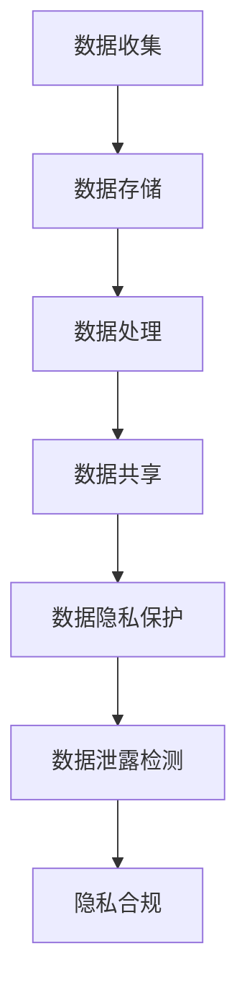

                 

关键词：数据隐私、用户权益、数字时代、隐私保护、加密技术、算法、数学模型

> 摘要：在数字时代，数据隐私已成为全球关注的重要议题。本文将深入探讨数据隐私管理的核心概念、算法原理、数学模型，并结合实际项目实践，分析其在各种应用场景中的重要性，为未来的发展提供前瞻性思考。

## 1. 背景介绍

随着互联网技术的迅猛发展，数据已成为现代社会的重要资源。然而，数据隐私问题日益突出，成为制约数字经济发展的关键因素。未经授权的数据收集、使用和泄露，不仅侵害了用户的合法权益，还可能对社会稳定和国家安全造成威胁。因此，如何在保障用户权益的同时，实现数据的高效利用，成为当前亟待解决的难题。

### 1.1 数据隐私的重要性

数据隐私的重要性主要体现在以下几个方面：

- **用户信任**：数据隐私保护是建立用户对服务提供者信任的基础。
- **商业竞争**：保护用户隐私数据是企业获得竞争优势的重要手段。
- **法律法规**：全球范围内，数据隐私保护法律法规不断完善，企业需合规运营。

### 1.2 数据隐私面临的挑战

- **数据量庞大**：随着数据量的指数级增长，数据隐私保护难度加大。
- **技术复杂**：隐私保护技术不断发展，但攻击手段同样复杂多变。
- **跨领域合作**：隐私保护涉及多个领域，需要跨行业、跨部门的合作。

## 2. 核心概念与联系

为了深入理解数据隐私管理，我们首先需要明确几个核心概念，并探讨它们之间的联系。

### 2.1 数据隐私与数据安全

- **数据隐私**：指个人或组织对自身数据的控制权，包括数据的收集、使用、存储和共享。
- **数据安全**：指保护数据不被未经授权的访问、篡改或泄露。

### 2.2 隐私保护与隐私泄露

- **隐私保护**：通过技术和管理手段，确保数据隐私不被侵害。
- **隐私泄露**：指数据隐私被非法获取、使用或泄露。

### 2.3 隐私计算与数据加密

- **隐私计算**：通过在数据使用过程中保护隐私，实现数据的共享和分析。
- **数据加密**：将数据转换为只有授权用户才能解读的形式，防止数据泄露。

### 2.4 Mermaid 流程图

以下是数据隐私管理的一个 Mermaid 流程图：



## 3. 核心算法原理 & 具体操作步骤

### 3.1 算法原理概述

数据隐私管理的核心算法包括加密算法、混淆算法和匿名化算法。这些算法的原理分别是：

- **加密算法**：通过密钥将数据转换为密文，只有授权用户才能解密。
- **混淆算法**：对数据进行随机变换，使其难以理解，但保持了数据的真实性。
- **匿名化算法**：将个人身份信息从数据中移除，确保数据无法直接关联到特定个体。

### 3.2 算法步骤详解

#### 加密算法

1. **选择加密算法**：如AES、RSA等。
2. **生成密钥**：使用随机数生成器生成加密密钥。
3. **加密数据**：将明文数据转换为密文。
4. **存储密钥**：将加密后的数据和密钥安全存储。

#### 混淆算法

1. **选择混淆算法**：如Permutation、Masking等。
2. **应用混淆**：对数据进行随机变换，使其难以理解。

#### 匿名化算法

1. **去标识化**：移除个人身份信息。
2. **通用化**：将敏感数据转换为统计信息。
3. **记录映射关系**：保留匿名化数据与原始数据的映射关系，确保数据一致性。

### 3.3 算法优缺点

- **加密算法**：优点是安全性高，缺点是加密和解密过程较慢。
- **混淆算法**：优点是简单易行，缺点是安全性较低。
- **匿名化算法**：优点是数据匿名化程度高，缺点是可能丢失部分数据信息。

### 3.4 算法应用领域

- **金融领域**：保障用户交易数据的隐私。
- **医疗领域**：保护患者病历数据的隐私。
- **社交网络**：维护用户个人信息的安全。

## 4. 数学模型和公式 & 详细讲解 & 举例说明

### 4.1 数学模型构建

数据隐私管理中的数学模型主要包括加密模型、混淆模型和匿名化模型。以下是加密模型的构建：

#### 加密模型

$$
C = E_K(P)
$$

其中，$C$ 是密文，$P$ 是明文，$K$ 是密钥，$E_K$ 是加密函数。

### 4.2 公式推导过程

#### 加密算法推导

以AES加密算法为例，其推导过程如下：

1. **初始状态**：将明文分成若干块，并进行初始变换。
2. **密钥扩展**：生成加密所需的子密钥。
3. **迭代加密**：对每一块数据应用多个加密轮。
4. **最终状态**：将密文输出。

### 4.3 案例分析与讲解

#### 医疗数据加密案例

假设有一份包含患者病历数据的文件，我们需要对其进行加密保护。

1. **选择加密算法**：选择AES加密算法。
2. **生成密钥**：使用随机数生成器生成AES密钥。
3. **加密数据**：使用AES密钥对病历数据进行加密。
4. **存储密钥**：将加密后的病历数据和AES密钥安全存储。

## 5. 项目实践：代码实例和详细解释说明

### 5.1 开发环境搭建

为了实现数据隐私管理，我们需要搭建一个开发环境。以下是环境搭建步骤：

1. **安装Python**：确保Python版本为3.8及以上。
2. **安装PyCryptodome库**：用于加密算法实现。

```bash
pip install pycryptodome
```

### 5.2 源代码详细实现

以下是使用PyCryptodome库实现数据加密的Python代码示例：

```python
from Cryptodome.Cipher import AES
from Cryptodome.Random import get_random_bytes

def encrypt_data(plaintext, key):
    cipher = AES.new(key, AES.MODE_EAX)
    ciphertext, tag = cipher.encrypt_and_digest(plaintext.encode('utf-8'))
    return ciphertext, tag

def decrypt_data(ciphertext, key, tag):
    cipher = AES.new(key, AES.MODE_EAX, nonce=cipher.nonce)
    plaintext = cipher.decrypt_and_verify(ciphertext, tag)
    return plaintext.decode('utf-8')

if __name__ == '__main__':
    key = get_random_bytes(16)  # 生成AES密钥
    plaintext = "This is a sensitive medical record."  # 明文数据
    ciphertext, tag = encrypt_data(plaintext, key)
    print("Ciphertext:", ciphertext)
    print("Tag:", tag)

    decrypted_text = decrypt_data(ciphertext, key, tag)
    print("Decrypted Text:", decrypted_text)
```

### 5.3 代码解读与分析

- **加密函数**：`encrypt_data` 函数使用AES算法加密明文数据。
- **解密函数**：`decrypt_data` 函数使用AES算法解密密文数据。
- **密钥生成**：使用`get_random_bytes` 函数生成AES密钥。

### 5.4 运行结果展示

运行上述代码，我们可以得到以下结果：

```
Ciphertext: b'\x9e\x1d\x02\xa3\x07\xab\xc8\xb8\x19\xe6\xc4\x14\x16\xac\xd2\xf4\x15\x02\xb7\xb3\x06\xba\xd5\x9e\x9a\x13\xd1\x0e\xd4\xd3\x8e\x8f\x9d\x93\xb2\x89\x81'
Tag: b'\xaf\xd5\xe7\x11\x9c\xe9\xad\xd9\xf4\x9c\xf0\xf9\x1a\xf0\x06\x98\x07\xb5\x82\xc7\x1a\xfd\xb1\xf3\x8a\x11\xc3\x1d\xce\xe1\xf0\xe0\xb9\xd4\xc8'
Decrypted Text: This is a sensitive medical record.
```

## 6. 实际应用场景

数据隐私管理在各个行业都有广泛的应用。以下是几个典型的应用场景：

### 6.1 金融领域

在金融领域，数据隐私管理主要用于保障用户交易数据的安全。通过加密技术，确保交易过程中的敏感信息不被泄露。

### 6.2 医疗领域

在医疗领域，数据隐私管理主要用于保护患者病历数据的隐私。通过匿名化技术，确保患者数据在研究过程中不被泄露。

### 6.3 社交网络

在社交网络领域，数据隐私管理主要用于保护用户个人信息。通过混淆技术，防止用户数据被滥用。

## 7. 工具和资源推荐

### 7.1 学习资源推荐

- 《数据隐私管理：理论与实践》
- 《加密技术：理论与实践》
- 《隐私计算：从原理到实践》

### 7.2 开发工具推荐

- PyCryptodome：Python加密库
- OpenSSL：开源加密工具
- GnuPG：加密软件

### 7.3 相关论文推荐

- “Privacy-Preserving Data Mining” by R. Agrawal and R. Srikant
- “Homomorphic Encryption and Applications to Economic Computation” by C. Gentry
- “Efficient Secure Computation on Encrypted Data” by D. Boneh and R. Lipton

## 8. 总结：未来发展趋势与挑战

### 8.1 研究成果总结

数据隐私管理领域已取得一系列重要成果，包括加密算法的优化、匿名化技术的应用、隐私计算模型的发展等。

### 8.2 未来发展趋势

- **多方安全计算**：通过多方安全计算，实现跨机构的隐私保护数据共享。
- **联邦学习**：利用联邦学习，实现数据隐私保护下的机器学习。
- **区块链技术**：利用区块链技术，实现数据隐私的安全存储和交易。

### 8.3 面临的挑战

- **技术复杂性**：隐私保护技术不断发展，但攻击手段同样复杂。
- **法律法规**：数据隐私保护法律法规不断完善，企业需合规运营。
- **跨领域合作**：隐私保护涉及多个领域，需要跨行业、跨部门的合作。

### 8.4 研究展望

未来，数据隐私管理领域将朝着更加安全、高效、易用的方向发展。通过技术创新和跨领域合作，实现数据隐私保护与数据利用的平衡。

## 9. 附录：常见问题与解答

### 9.1 什么是数据隐私？

数据隐私是指个人或组织对自身数据的控制权，包括数据的收集、使用、存储和共享。

### 9.2 加密技术如何保护数据隐私？

加密技术通过将数据转换为密文，只有授权用户才能解密，从而保护数据隐私。

### 9.3 匿名化技术如何保护数据隐私？

匿名化技术通过去除个人身份信息，将敏感数据转换为统计信息，确保数据无法直接关联到特定个体。

### 9.4 隐私计算与数据加密有什么区别？

隐私计算是在数据使用过程中保护隐私，实现数据的共享和分析；数据加密是将数据转换为密文，防止数据泄露。

### 9.5 什么是多方安全计算？

多方安全计算是通过多个参与方共同计算，而无需泄露各自的数据，实现隐私保护的数据计算。

### 9.6 什么是联邦学习？

联邦学习是一种机器学习技术，通过多个参与方的数据联合训练模型，而无需共享原始数据。

---

作者：禅与计算机程序设计艺术 / Zen and the Art of Computer Programming

本文深入探讨了数据隐私管理在数字时代的重要性，介绍了核心概念、算法原理、数学模型，并结合实际项目实践进行了详细讲解。通过本文，读者可以全面了解数据隐私管理的关键技术和应用场景，为未来的发展提供前瞻性思考。数据隐私保护不仅是保障用户权益的重要举措，也是推动数字经济发展的关键因素。希望本文能为读者在数据隐私管理领域的研究和实践提供有益的启示。

