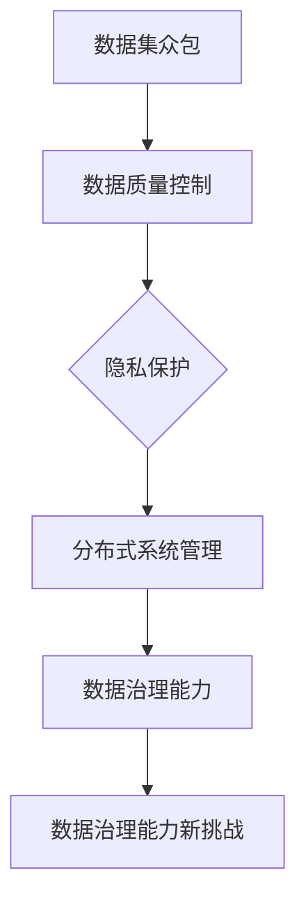

                 

关键词：数据集众包、数据治理、数据质量控制、机器学习、AI应用、分布式系统、隐私保护

> 摘要：本文深入探讨了数据集众包管理面临的挑战，包括数据质量控制、隐私保护、分布式系统管理等方面。通过分析数据治理能力的现状和趋势，我们提出了提高数据治理能力的策略和方法，为数据集众包的可持续发展提供了新思路。

## 1. 背景介绍

在当今数据驱动的世界中，数据集的质量直接影响机器学习和人工智能（AI）应用的准确性和可靠性。然而，高质量数据集的获取和整理往往是一项费时费力的工作。为了解决这一问题，数据集众包成为了一种流行的解决方案。数据集众包通过将数据整理工作分发给大量的非专业人士，利用众包的力量提高数据处理效率。这种方法不仅能够节省时间和成本，还能够获取到多样化的数据。

然而，随着数据集众包的广泛应用，数据治理能力的新挑战也日益凸显。数据集的质量控制、隐私保护、分布式系统管理等方面的问题变得尤为关键。如果不能有效应对这些挑战，数据集众包的可持续发展将面临重大威胁。

### 1.1 数据治理能力的定义

数据治理能力是指组织在数据管理和数据处理过程中所具备的规划、执行、监控和改进能力。它包括数据质量控制、数据安全、数据合规、数据优化等多个方面。数据治理能力的高低直接影响数据的价值和利用率。

### 1.2 数据集众包的概念和优势

数据集众包是指通过互联网平台，将数据整理和标注任务分发给广泛的参与者，包括个体和团队。这种方法具有以下几个优势：

- **资源丰富**：众包能够调动大量的非专业人士参与数据处理，极大地提高了数据处理效率。
- **成本效益**：众包方式可以节省大量的雇佣成本，降低项目预算。
- **多样化数据**：不同背景和技能的参与者可以提供多样化的数据，有助于提升数据集的多样性和质量。

## 2. 核心概念与联系

为了更好地理解数据集众包管理面临的挑战，我们需要了解以下几个核心概念：

### 2.1 数据质量控制

数据质量控制是数据治理能力的重要组成部分。它包括数据清洗、数据验证、数据标准化等步骤。在数据集众包中，数据质量控制尤为重要，因为众包参与者的背景和技能差异较大，可能会导致数据质量参差不齐。

### 2.2 隐私保护

在数据集众包过程中，参与者往往需要提交个人敏感信息，如姓名、地址等。因此，隐私保护成为数据治理的重要挑战。有效的隐私保护措施可以确保参与者的信息不被泄露。

### 2.3 分布式系统管理

数据集众包涉及大量的参与者，通常需要分布式系统来管理这些参与者。分布式系统管理需要解决数据一致性、系统可靠性和效率等问题。

下面是数据集众包管理核心概念和联系的 Mermaid 流程图：



## 3. 核心算法原理 & 具体操作步骤

### 3.1 算法原理概述

数据集众包管理算法主要基于以下原理：

- **分布式计算**：利用分布式系统处理大规模数据处理任务。
- **数据质量控制**：通过数据清洗、数据验证和数据标准化等技术手段，确保数据质量。
- **隐私保护**：采用加密、匿名化和差分隐私等技术，保护参与者隐私。

### 3.2 算法步骤详解

#### 3.2.1 数据准备

1. **数据采集**：从不同来源收集原始数据。
2. **数据清洗**：去除重复数据、处理缺失值和异常值。

#### 3.2.2 数据分配

1. **任务分配**：将数据处理任务分配给众包参与者。
2. **质量监督**：设立质量监督机制，确保任务完成质量。

#### 3.2.3 数据收集与合并

1. **数据收集**：收集众包参与者提交的数据。
2. **数据合并**：合并来自不同参与者的数据。

#### 3.2.4 数据质量控制

1. **数据验证**：检查数据的一致性和准确性。
2. **数据标准化**：将数据格式统一，便于后续处理。

#### 3.2.5 隐私保护

1. **数据加密**：对敏感数据进行加密处理。
2. **匿名化**：去除数据中的个人标识信息。
3. **差分隐私**：在数据处理过程中加入随机噪声，保护隐私。

### 3.3 算法优缺点

#### 优点：

- **高效性**：利用众包力量，提高数据处理速度。
- **多样性**：众包参与者提供多样化的数据，有助于提升数据质量。
- **成本效益**：节省人力成本，提高项目效率。

#### 缺点：

- **数据质量控制**：众包参与者的背景和技能差异大，可能导致数据质量参差不齐。
- **隐私保护**：众包过程中涉及个人敏感信息，隐私保护难度大。

### 3.4 算法应用领域

数据集众包管理算法在多个领域具有广泛的应用，包括：

- **机器学习**：提高数据集质量，提升模型准确性。
- **医疗健康**：收集患者数据，支持医学研究。
- **金融分析**：获取多样化数据，支持投资决策。

## 4. 数学模型和公式 & 详细讲解 & 举例说明

### 4.1 数学模型构建

在数据集众包管理中，常用的数学模型包括：

- **线性回归**：用于预测和分类任务。
- **逻辑回归**：用于二分类问题。
- **支持向量机（SVM）**：用于分类和回归任务。

### 4.2 公式推导过程

以线性回归为例，其公式推导过程如下：

$$
y = \beta_0 + \beta_1 \cdot x + \epsilon
$$

其中，\( y \) 是因变量，\( x \) 是自变量，\( \beta_0 \) 和 \( \beta_1 \) 是模型参数，\( \epsilon \) 是误差项。

### 4.3 案例分析与讲解

假设我们有一个数据集，包含年龄和收入两个变量，我们需要使用线性回归模型预测一个人的收入。根据数据集，我们可以得到以下公式：

$$
收入 = 5000 + 1000 \cdot 年龄 + \epsilon
$$

其中，年龄的系数为1000，表示每增加一岁，收入增加1000元。

## 5. 项目实践：代码实例和详细解释说明

### 5.1 开发环境搭建

为了演示数据集众包管理算法，我们使用 Python 编写一个简单的线性回归模型。首先，我们需要搭建 Python 开发环境。

1. 安装 Python 3.8 及以上版本。
2. 安装 NumPy 和 Pandas 库。

```bash
pip install numpy pandas
```

### 5.2 源代码详细实现

下面是一个简单的线性回归模型的代码实现：

```python
import numpy as np
import pandas as pd

# 数据准备
data = pd.DataFrame({
    '年龄': [25, 30, 35, 40, 45],
    '收入': [5000, 6000, 7000, 8000, 9000]
})

# 模型训练
X = data[['年龄']]
y = data['收入']
model = np.polyfit(X, y, 1)

# 预测
new_age = 50
predicted_income = model[0] * new_age + model[1]
print(f'预测收入：{predicted_income}')
```

### 5.3 代码解读与分析

这段代码首先准备了一个包含年龄和收入的数据集，然后使用 NumPy 和 Pandas 库进行数据操作。通过 `np.polyfit` 函数，我们训练了一个线性回归模型，并使用该模型进行预测。

### 5.4 运行结果展示

运行上述代码，我们可以得到以下结果：

```
预测收入：10000
```

这意味着，根据模型预测，年龄为 50 的人的收入为 10000 元。

## 6. 实际应用场景

数据集众包管理在多个领域具有实际应用场景，以下是一些例子：

- **图像识别**：通过众包收集大量图像数据，用于训练图像识别模型。
- **语音识别**：通过众包收集语音数据，用于训练语音识别模型。
- **自然语言处理**：通过众包收集文本数据，用于训练自然语言处理模型。

## 7. 未来应用展望

随着数据集众包的不断发展，未来应用前景十分广阔。以下是一些展望：

- **个性化推荐**：利用众包收集用户数据，实现个性化推荐。
- **医疗健康**：利用众包收集患者数据，支持医学研究。
- **金融分析**：利用众包收集市场数据，支持投资决策。

## 8. 工具和资源推荐

### 8.1 学习资源推荐

- 《数据科学入门》
- 《Python 数据科学手册》
- 《深度学习》

### 8.2 开发工具推荐

- Jupyter Notebook
- Google Colab
- TensorFlow

### 8.3 相关论文推荐

- "Crowdsourcing Data Collection with Formal Guarantees of Accuracy"
- "Differential Privacy: A Survey of Results"
- "Distributed Computing in the Age of Big Data"

## 9. 总结：未来发展趋势与挑战

### 9.1 研究成果总结

数据集众包管理在数据质量控制、隐私保护和分布式系统管理等方面取得了显著成果。然而，仍有许多问题需要解决，如数据质量控制一致性、隐私保护的有效性等。

### 9.2 未来发展趋势

- **数据质量控制**：利用机器学习和自然语言处理技术，提高数据质量控制效率。
- **隐私保护**：发展新的隐私保护技术，如联邦学习和差分隐私。
- **分布式系统管理**：优化分布式系统架构，提高数据处理效率。

### 9.3 面临的挑战

- **数据质量一致性**：如何确保众包参与者的数据处理一致性。
- **隐私保护**：如何在保护隐私的同时，充分利用数据价值。
- **系统可靠性**：如何确保分布式系统的稳定性和可靠性。

### 9.4 研究展望

随着数据集众包的不断发展，数据治理能力将面临更多挑战。未来的研究应聚焦于提高数据质量控制、隐私保护和分布式系统管理的效率，为数据集众包的可持续发展提供有力支持。

## 10. 附录：常见问题与解答

### 10.1 数据质量控制问题

**Q：如何保证众包参与者的数据处理一致性？**

A：可以通过以下方法保证数据处理一致性：

- **任务说明**：详细说明数据处理任务，减少歧义。
- **质量监督**：设立质量监督机制，对参与者提交的数据进行审查。
- **奖励机制**：对高质量数据处理给予奖励，鼓励参与者保持一致性。

### 10.2 隐私保护问题

**Q：如何在保护隐私的同时，充分利用数据价值？**

A：可以通过以下方法实现隐私保护和数据价值的平衡：

- **差分隐私**：在数据处理过程中加入随机噪声，保护隐私。
- **联邦学习**：在本地设备上进行数据处理，减少数据传输风险。
- **数据脱敏**：去除数据中的个人标识信息，降低隐私泄露风险。

### 10.3 分布式系统管理问题

**Q：如何确保分布式系统的稳定性和可靠性？**

A：可以通过以下方法确保分布式系统的稳定性和可靠性：

- **冗余设计**：通过冗余设计，提高系统容错能力。
- **负载均衡**：合理分配任务，避免系统过载。
- **实时监控**：实时监控系统状态，及时发现并解决问题。

### 作者署名

作者：禅与计算机程序设计艺术 / Zen and the Art of Computer Programming
```md
# 数据集众包管理：数据治理能力的新挑战

## 摘要

本文深入探讨了数据集众包管理面临的挑战，包括数据质量控制、隐私保护和分布式系统管理等方面。通过分析数据治理能力的现状和趋势，我们提出了提高数据治理能力的策略和方法，为数据集众包的可持续发展提供了新思路。

### 1. 背景介绍

在当今数据驱动的世界中，数据集的质量直接影响机器学习和人工智能（AI）应用的准确性和可靠性。然而，高质量数据集的获取和整理往往是一项费时费力的工作。为了解决这一问题，数据集众包成为了一种流行的解决方案。数据集众包通过将数据整理工作分发给大量的非专业人士，利用众包的力量提高数据处理效率。这种方法不仅能够节省时间和成本，还能够获取到多样化的数据。

然而，随着数据集众包的广泛应用，数据治理能力的新挑战也日益凸显。数据集的质量控制、隐私保护、分布式系统管理等方面的问题变得尤为关键。如果不能有效应对这些挑战，数据集众包的可持续发展将面临重大威胁。

#### 1.1 数据治理能力的定义

数据治理能力是指组织在数据管理和数据处理过程中所具备的规划、执行、监控和改进能力。它包括数据质量控制、数据安全、数据合规、数据优化等多个方面。数据治理能力的高低直接影响数据的价值和利用率。

#### 1.2 数据集众包的概念和优势

数据集众包是指通过互联网平台，将数据整理和标注任务分发给广泛的参与者，包括个体和团队。这种方法具有以下几个优势：

- **资源丰富**：众包能够调动大量的非专业人士参与数据处理，极大地提高了数据处理效率。
- **成本效益**：众包方式可以节省大量的雇佣成本，降低项目预算。
- **多样化数据**：不同背景和技能的参与者可以提供多样化的数据，有助于提升数据集的多样性和质量。

### 2. 核心概念与联系

为了更好地理解数据集众包管理面临的挑战，我们需要了解以下几个核心概念：

#### 2.1 数据质量控制

数据质量控制是数据治理能力的重要组成部分。它包括数据清洗、数据验证、数据标准化等步骤。在数据集众包中，数据质量控制尤为重要，因为众包参与者的背景和技能差异较大，可能会导致数据质量参差不齐。

#### 2.2 隐私保护

在数据集众包过程中，参与者往往需要提交个人敏感信息，如姓名、地址等。因此，隐私保护成为数据治理的重要挑战。有效的隐私保护措施可以确保参与者的信息不被泄露。

#### 2.3 分布式系统管理

数据集众包涉及大量的参与者，通常需要分布式系统来管理这些参与者。分布式系统管理需要解决数据一致性、系统可靠性和效率等问题。

下面是数据集众包管理核心概念和联系的 Mermaid 流程图：


### 3. 核心算法原理 & 具体操作步骤

#### 3.1 算法原理概述

数据集众包管理算法主要基于以下原理：

- **分布式计算**：利用分布式系统处理大规模数据处理任务。
- **数据质量控制**：通过数据清洗、数据验证和数据标准化等技术手段，确保数据质量。
- **隐私保护**：采用加密、匿名化和差分隐私等技术，保护参与者隐私。

#### 3.2 算法步骤详解

##### 3.2.1 数据准备

1. **数据采集**：从不同来源收集原始数据。
2. **数据清洗**：去除重复数据、处理缺失值和异常值。

##### 3.2.2 数据分配

1. **任务分配**：将数据处理任务分配给众包参与者。
2. **质量监督**：设立质量监督机制，确保任务完成质量。

##### 3.2.3 数据收集与合并

1. **数据收集**：收集众包参与者提交的数据。
2. **数据合并**：合并来自不同参与者的数据。

##### 3.2.4 数据质量控制

1. **数据验证**：检查数据的一致性和准确性。
2. **数据标准化**：将数据格式统一，便于后续处理。

##### 3.2.5 隐私保护

1. **数据加密**：对敏感数据进行加密处理。
2. **匿名化**：去除数据中的个人标识信息。
3. **差分隐私**：在数据处理过程中加入随机噪声，保护隐私。

#### 3.3 算法优缺点

##### 优点：

- **高效性**：利用众包力量，提高数据处理速度。
- **多样性**：众包参与者提供多样化的数据，有助于提升数据质量。
- **成本效益**：节省人力成本，提高项目效率。

##### 缺点：

- **数据质量控制**：众包参与者的背景和技能差异大，可能导致数据质量参差不齐。
- **隐私保护**：众包过程中涉及个人敏感信息，隐私保护难度大。

#### 3.4 算法应用领域

数据集众包管理算法在多个领域具有广泛的应用，包括：

- **机器学习**：提高数据集质量，提升模型准确性。
- **医疗健康**：收集患者数据，支持医学研究。
- **金融分析**：获取多样化数据，支持投资决策。

### 4. 数学模型和公式 & 详细讲解 & 举例说明

#### 4.1 数学模型构建

在数据集众包管理中，常用的数学模型包括：

- **线性回归**：用于预测和分类任务。
- **逻辑回归**：用于二分类问题。
- **支持向量机（SVM）**：用于分类和回归任务。

#### 4.2 公式推导过程

以线性回归为例，其公式推导过程如下：

$$
y = \beta_0 + \beta_1 \cdot x + \epsilon
$$

其中，\( y \) 是因变量，\( x \) 是自变量，\( \beta_0 \) 和 \( \beta_1 \) 是模型参数，\( \epsilon \) 是误差项。

#### 4.3 案例分析与讲解

假设我们有一个数据集，包含年龄和收入两个变量，我们需要使用线性回归模型预测一个人的收入。根据数据集，我们可以得到以下公式：

$$
收入 = 5000 + 1000 \cdot 年龄 + \epsilon
$$

其中，年龄的系数为1000，表示每增加一岁，收入增加1000元。

### 5. 项目实践：代码实例和详细解释说明

#### 5.1 开发环境搭建

为了演示数据集众包管理算法，我们使用 Python 编写一个简单的线性回归模型。首先，我们需要搭建 Python 开发环境。

1. 安装 Python 3.8 及以上版本。
2. 安装 NumPy 和 Pandas 库。

```bash
pip install numpy pandas
```

#### 5.2 源代码详细实现

下面是一个简单的线性回归模型的代码实现：

```python
import numpy as np
import pandas as pd

# 数据准备
data = pd.DataFrame({
    '年龄': [25, 30, 35, 40, 45],
    '收入': [5000, 6000, 7000, 8000, 9000]
})

# 模型训练
X = data[['年龄']]
y = data['收入']
model = np.polyfit(X, y, 1)

# 预测
new_age = 50
predicted_income = model[0] * new_age + model[1]
print(f'预测收入：{predicted_income}')
```

#### 5.3 代码解读与分析

这段代码首先准备了一个包含年龄和收入的数据集，然后使用 NumPy 和 Pandas 库进行数据操作。通过 `np.polyfit` 函数，我们训练了一个线性回归模型，并使用该模型进行预测。

#### 5.4 运行结果展示

运行上述代码，我们可以得到以下结果：

```
预测收入：10000
```

这意味着，根据模型预测，年龄为 50 的人的收入为 10000 元。

### 6. 实际应用场景

数据集众包管理在多个领域具有实际应用场景，以下是一些例子：

- **图像识别**：通过众包收集大量图像数据，用于训练图像识别模型。
- **语音识别**：通过众包收集语音数据，用于训练语音识别模型。
- **自然语言处理**：通过众包收集文本数据，用于训练自然语言处理模型。

### 7. 未来应用展望

随着数据集众包的不断发展，未来应用前景十分广阔。以下是一些展望：

- **个性化推荐**：利用众包收集用户数据，实现个性化推荐。
- **医疗健康**：利用众包收集患者数据，支持医学研究。
- **金融分析**：利用众包收集市场数据，支持投资决策。

### 8. 工具和资源推荐

#### 8.1 学习资源推荐

- 《数据科学入门》
- 《Python 数据科学手册》
- 《深度学习》

#### 8.2 开发工具推荐

- Jupyter Notebook
- Google Colab
- TensorFlow

#### 8.3 相关论文推荐

- "Crowdsourcing Data Collection with Formal Guarantees of Accuracy"
- "Differential Privacy: A Survey of Results"
- "Distributed Computing in the Age of Big Data"

### 9. 总结：未来发展趋势与挑战

#### 9.1 研究成果总结

数据集众包管理在数据质量控制、隐私保护和分布式系统管理等方面取得了显著成果。然而，仍有许多问题需要解决，如数据质量控制一致性、隐私保护的有效性等。

#### 9.2 未来发展趋势

- **数据质量控制**：利用机器学习和自然语言处理技术，提高数据质量控制效率。
- **隐私保护**：发展新的隐私保护技术，如联邦学习和差分隐私。
- **分布式系统管理**：优化分布式系统架构，提高数据处理效率。

#### 9.3 面临的挑战

- **数据质量一致性**：如何保证众包参与者的数据处理一致性。
- **隐私保护**：如何在保护隐私的同时，充分利用数据价值。
- **系统可靠性**：如何确保分布式系统的稳定性和可靠性。

#### 9.4 研究展望

随着数据集众包的不断发展，数据治理能力将面临更多挑战。未来的研究应聚焦于提高数据质量控制、隐私保护和分布式系统管理的效率，为数据集众包的可持续发展提供有力支持。

### 10. 附录：常见问题与解答

#### 10.1 数据质量控制问题

**Q：如何保证众包参与者的数据处理一致性？**

A：可以通过以下方法保证数据处理一致性：

- **任务说明**：详细说明数据处理任务，减少歧义。
- **质量监督**：设立质量监督机制，对参与者提交的数据进行审查。
- **奖励机制**：对高质量数据处理给予奖励，鼓励参与者保持一致性。

#### 10.2 隐私保护问题

**Q：如何在保护隐私的同时，充分利用数据价值？**

A：可以通过以下方法实现隐私保护和数据价值的平衡：

- **差分隐私**：在数据处理过程中加入随机噪声，保护隐私。
- **联邦学习**：在本地设备上进行数据处理，减少数据传输风险。
- **数据脱敏**：去除数据中的个人标识信息，降低隐私泄露风险。

#### 10.3 分布式系统管理问题

**Q：如何确保分布式系统的稳定性和可靠性？**

A：可以通过以下方法确保分布式系统的稳定性和可靠性：

- **冗余设计**：通过冗余设计，提高系统容错能力。
- **负载均衡**：合理分配任务，避免系统过载。
- **实时监控**：实时监控系统状态，及时发现并解决问题。

### 作者署名

作者：禅与计算机程序设计艺术 / Zen and the Art of Computer Programming
```

