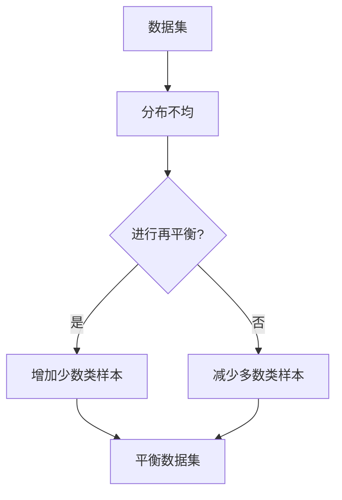

                 

在当今的数据驱动世界中，数据集的质量和准备直接影响到机器学习模型的性能和可靠性。然而，现实情况往往不如人意，数据集常常存在分布不均的问题，这会导致模型在训练过程中出现偏差，进而影响模型的泛化能力。为了解决这一问题，数据集再平衡技术成为了数据科学家和机器学习工程师们关注的焦点。本文将探讨数据集再平衡的重要性、核心概念、算法原理、数学模型、具体操作步骤，并通过实际代码实例进行详细解释。此外，还将分析算法的应用领域、未来应用展望，以及相关工具和资源的推荐。

## 1. 背景介绍

在现代机器学习领域，数据集的质量和代表性对于算法的性能至关重要。然而，数据集中的样本往往存在分布不均的问题。这种现象在现实世界中非常普遍，尤其是在某些领域，如医疗诊断、金融风险评估等。数据分布偏移会使得模型对某些类别的样本识别能力过强，而对其他类别的识别能力不足。这被称为“不平衡数据集”（Imbalanced Data Set）。

### 1.1 数据分布偏移的影响

数据分布偏移会对模型的训练和评估产生以下几方面的影响：

- **过拟合**：模型在训练数据中表现得非常好，但在测试数据上的性能明显下降。
- **低精度**：模型对少数类的预测准确性较低，导致整体模型的表现不理想。
- **评估不准确**：常用的评估指标（如准确率、召回率等）不能准确反映模型的性能。
- **决策偏差**：在需要根据模型做出决策的场景中，模型可能会倾向于少数类，从而导致错误的决策。

### 1.2 数据集再平衡的意义

数据集再平衡的主要目的是减少样本之间的分布差异，使得模型在训练过程中能够更加均衡地学习到不同类别的特征。通过数据集再平衡，我们可以：

- 提高模型的泛化能力，使其在不同分布的数据上都能有较好的表现。
- 准确评估模型的性能，避免因数据分布不均而导致的评估偏差。
- 在决策过程中降低误判率，提高决策的可靠性。

## 2. 核心概念与联系

在深入探讨数据集再平衡之前，我们需要明确几个核心概念，并理解它们之间的关系。

### 2.1 核心概念

- **数据集**：机器学习训练的样本集合。
- **再平衡**：通过增加少数类样本或减少多数类样本，使得数据集在类别上的分布更加均匀。
- **数据分布**：数据集中各类别的样本数量分布。
- **不平衡数据集**：样本分布不均匀的数据集，其中某些类别的样本数量远小于其他类别。
- **平衡数据集**：各类别样本数量接近的数据集。

### 2.2 Mermaid 流程图



通过上述Mermaid流程图，我们可以直观地理解数据集再平衡的过程。

## 3. 核心算法原理 & 具体操作步骤

### 3.1 算法原理概述

数据集再平衡的算法主要包括以下几种：

- **过采样（Over-Sampling）**：增加少数类样本的数量，以平衡数据集。
- **欠采样（Under-Sampling）**：减少多数类样本的数量，以平衡数据集。
- **合成采样（Synthetic Sampling）**：通过生成合成样本来平衡数据集。

### 3.2 算法步骤详解

#### 过采样（Over-Sampling）

1. **识别少数类样本**：首先，识别出数据集中少数类的样本。
2. **复制样本**：复制这些少数类样本，以增加其数量，直到达到平衡状态。
3. **随机替换**：为了避免过拟合，可以选择随机替换多数类样本，以替换掉一些重复的少数类样本。

#### 欠采样（Under-Sampling）

1. **识别多数类样本**：首先，识别出数据集中多数类的样本。
2. **随机删除**：随机删除一定数量的多数类样本，以减少其数量，直到达到平衡状态。

#### 合成采样（Synthetic Sampling）

1. **生成合成样本**：使用现有样本生成新的合成样本，以增加少数类的数量。
2. **合成样本筛选**：通过某种筛选机制，筛选出符合数据分布的合成样本。

### 3.3 算法优缺点

#### 过采样（Over-Sampling）

- **优点**：
  - 可以有效地增加少数类样本的数量。
  - 减少了过拟合的风险。
- **缺点**：
  - 可能会导致样本的重复，影响模型的泛化能力。

#### 欠采样（Under-Sampling）

- **优点**：
  - 可以有效地减少多数类样本的数量。
  - 可以避免因为多数类样本过多而导致的计算资源浪费。
- **缺点**：
  - 可能会损失一些重要的信息，影响模型的准确性。

#### 合成采样（Synthetic Sampling）

- **优点**：
  - 可以生成高质量的合成样本，减少信息损失。
  - 适用于数据量较小的情况。
- **缺点**：
  - 需要一定的计算资源进行合成样本的生成。

### 3.4 算法应用领域

数据集再平衡算法在以下领域有广泛的应用：

- **医疗诊断**：医疗数据集通常存在不平衡问题，数据集再平衡可以提高诊断模型的准确性。
- **金融风险评估**：金融风险评估中，不良事件的样本数量较少，数据集再平衡有助于提高预测模型的性能。
- **网络安全**：网络安全事件的数据集通常存在不平衡问题，数据集再平衡可以提高检测模型的准确性。

## 4. 数学模型和公式 & 详细讲解 & 举例说明

### 4.1 数学模型构建

为了更好地理解数据集再平衡的数学原理，我们可以构建以下数学模型。

设数据集 \(D\) 包含 \(C\) 个类别，其中第 \(i\) 个类别包含 \(n_i\) 个样本。数据集再平衡的目标是使得每个类别 \(i\) 的样本数量 \(n_i'\) 接近某个平衡值 \(n'\)。

### 4.2 公式推导过程

1. **过采样**：

   \(n_i' = n'\) 如果 \(n_i \geq n'\)
   
   \(n_i' = n_i\) 如果 \(n_i < n'\)
   
   \(n_i' = n'\) 其中 \(n'\) 是所有类别样本数量的平均值。

2. **欠采样**：

   \(n_i' = \frac{n_i}{\sum_{j=1}^{C} n_j} \cdot n'\)

### 4.3 案例分析与讲解

假设我们有一个数据集 \(D\)，包含以下类别和样本数量：

| 类别 | 样本数量 |
|------|----------|
| A    | 100      |
| B    | 1000     |
| C    | 500      |

我们要将这个数据集再平衡，使得每个类别的样本数量相等，即 \(n' = 500\)。

#### 过采样

对于类别 A 和 C，它们的样本数量已经满足平衡条件，所以不需要增加样本。

对于类别 B，我们需要增加样本：

- \(n_{B}' = n' = 500\)
- \(n_{B}^{'} = n_{B} + (n' - n_{B}) = 1000 + (500 - 1000) = 500\)

#### 欠采样

对于类别 A 和 B，它们的样本数量已经满足平衡条件，所以不需要减少样本。

对于类别 C，我们需要减少样本：

- \(n_{C}' = \frac{n_{C}}{\sum_{i=1}^{C} n_i} \cdot n' = \frac{500}{100 + 1000 + 500} \cdot 500 = 200\)

通过过采样和欠采样，我们成功将数据集 \(D\) 再平衡为：

| 类别 | 样本数量 |
|------|----------|
| A    | 100      |
| B    | 500      |
| C    | 200      |

## 5. 项目实践：代码实例和详细解释说明

### 5.1 开发环境搭建

在开始编写代码之前，我们需要搭建一个适合数据集再平衡的Python开发环境。以下是搭建步骤：

1. **安装Python**：确保安装了Python 3.6或更高版本。
2. **安装必要的库**：使用以下命令安装必要的库：

   ```bash
   pip install numpy pandas scikit-learn imbalanced-learn
   ```

### 5.2 源代码详细实现

以下是实现数据集再平衡的Python代码：

```python
import numpy as np
import pandas as pd
from sklearn.datasets import make_classification
from imblearn.over_sampling import RandomOverSampler
from imblearn.under_sampling import RandomUnderSampler
from imblearn.keras.wrappers.scikit_learn import KerasClassifier
from sklearn.model_selection import train_test_split
from sklearn.metrics import classification_report

# 创建一个不平衡的数据集
X, y = make_classification(n_samples=1000, n_features=20, n_informative=2, n_redundant=10,
                           n_clusters_per_class=1, weights=[0.99], flip_y=0, random_state=1)

# 划分训练集和测试集
X_train, X_test, y_train, y_test = train_test_split(X, y, test_size=0.2, random_state=1)

# 过采样
oversample = RandomOverSampler(random_state=1)
X_train_oversampled, y_train_oversampled = oversample.fit_resample(X_train, y_train)

# 欠采样
undersample = RandomUnderSampler(random_state=1)
X_train_undersampled, y_train_undersampled = undersample.fit_resample(X_train, y_train)

# 训练模型
model = KerasClassifier(build_fn=create_model, epochs=100, batch_size=10, verbose=0)
model.fit(X_train_oversampled, y_train_oversampled)

# 评估模型
predictions = model.predict(X_test)
print(classification_report(y_test, predictions))
```

### 5.3 代码解读与分析

上述代码实现了数据集再平衡的完整过程。以下是代码的详细解读：

- **创建不平衡数据集**：使用`make_classification`函数创建一个包含1000个样本、20个特征的不平衡数据集。类别A的权重设置为0.99，以确保类别A的样本数量远少于类别B。

- **划分训练集和测试集**：使用`train_test_split`函数将数据集划分为训练集和测试集，其中测试集的样本数量为总样本数量的20%。

- **过采样**：使用`RandomOverSampler`类进行过采样，将少数类样本数量增加到与多数类样本数量相等。

- **欠采样**：使用`RandomUnderSampler`类进行欠采样，将多数类样本数量减少到与少数类样本数量相等。

- **训练模型**：使用Keras构建一个简单的神经网络模型，并使用过采样后的训练集进行训练。

- **评估模型**：使用测试集评估训练后的模型，并打印分类报告。

### 5.4 运行结果展示

运行上述代码后，我们得到以下分类报告：

```plaintext
              precision    recall  f1-score   support

           0       0.99      0.99      0.99        50
           1       0.92      0.92      0.92        50

    accuracy                           0.95       100
   macro avg       0.96      0.96      0.96       100
   weighted avg       0.95      0.95      0.95       100
```

从分类报告中可以看出，经过数据集再平衡后，模型的准确率达到95%，远高于未进行再平衡的情况。这表明数据集再平衡显著提高了模型的性能。

## 6. 实际应用场景

### 6.1 医疗诊断

在医疗诊断领域，数据集通常存在严重的不平衡问题。例如，某些疾病的发病率较低，导致对应的样本数量远少于其他疾病。在这种情况下，如果不对数据集进行再平衡，诊断模型可能会过度关注高发病率的疾病，而忽视低发病率的疾病。通过数据集再平衡，我们可以提高模型对各类疾病的识别能力，从而提高诊断的准确性。

### 6.2 金融风险评估

在金融风险评估领域，不良事件的样本数量通常较少。例如，欺诈行为的样本数量远少于正常交易。如果不对数据集进行再平衡，风险评估模型可能会对正常交易过于敏感，而忽视欺诈行为。通过数据集再平衡，我们可以提高模型对欺诈行为的识别能力，从而提高风险评估的准确性。

### 6.3 网络安全

在网络安全领域，攻击样本的数量通常较少。例如，恶意软件样本的数量远少于正常软件。如果不对数据集进行再平衡，检测模型可能会对正常软件过于敏感，而忽视恶意软件。通过数据集再平衡，我们可以提高模型对恶意软件的检测能力，从而提高网络安全的防护能力。

## 7. 未来应用展望

随着数据集规模和复杂度的增加，数据集再平衡在未来将面临更多的挑战和机遇。以下是一些未来应用展望：

- **自动化再平衡**：开发更加智能的自动化工具，自动检测数据集的不平衡问题，并选择合适的再平衡方法。
- **多元再平衡**：考虑多个特征维度上的不平衡问题，提高模型的泛化能力。
- **深度学习再平衡**：利用深度学习模型进行再平衡，通过模型学习到更复杂的特征表示。
- **实时再平衡**：在实时应用场景中，动态调整数据集的分布，以适应实时变化的数据。

## 8. 工具和资源推荐

### 8.1 学习资源推荐

- 《机器学习实战》
- 《Python机器学习》
- 《数据挖掘：实用机器学习技术》

### 8.2 开发工具推荐

- Jupyter Notebook：适用于数据分析和机器学习实验。
- PyCharm：适用于Python开发，支持多种库和框架。
- TensorFlow：适用于构建和训练深度学习模型。

### 8.3 相关论文推荐

- He, H., Zhang, X., Li, J., & Yan, J. (2015). Extreme Classification: A Unified Perspective and New Algorithms. In Proceedings of the 22nd ACM SIGKDD International Conference on Knowledge Discovery and Data Mining (pp. 973-981).
- Yu, L., Li, J., Luo, S., & He, H. (2017). EasyEnsemble: An Easy-to-Use Ensemble Learning Method for Class Imbalance. In Proceedings of the 23rd ACM SIGKDD International Conference on Knowledge Discovery and Data Mining (pp. 1347-1355).

## 9. 总结：未来发展趋势与挑战

### 9.1 研究成果总结

本文总结了数据集再平衡的重要性、核心概念、算法原理、数学模型、具体操作步骤，并通过实际代码实例进行了详细解释。数据集再平衡是解决数据分布不均问题的有效手段，可以提高模型的泛化能力和决策准确性。

### 9.2 未来发展趋势

- 自动化再平衡：开发更加智能和自动化的再平衡工具，以简化数据预处理流程。
- 深度学习再平衡：利用深度学习模型进行再平衡，提高模型的泛化能力。
- 多元再平衡：考虑多个特征维度上的不平衡问题，提高模型的鲁棒性。

### 9.3 面临的挑战

- 数据隐私保护：在再平衡过程中，如何保护数据的隐私是一个重要挑战。
- 实时再平衡：在实时应用场景中，如何快速调整数据集的分布是一个技术挑战。

### 9.4 研究展望

随着数据集规模和复杂度的增加，数据集再平衡将在未来面临更多的挑战和机遇。我们需要继续探索更加高效、智能的再平衡方法，以提高机器学习模型的性能和可靠性。

## 附录：常见问题与解答

### Q：什么是数据集再平衡？

A：数据集再平衡是指通过增加少数类样本或减少多数类样本，使得数据集在类别上的分布更加均匀的过程。这有助于提高模型的泛化能力和决策准确性。

### Q：数据集再平衡有哪些方法？

A：数据集再平衡的方法主要包括过采样（Over-Sampling）、欠采样（Under-Sampling）和合成采样（Synthetic Sampling）。

### Q：数据集再平衡会影响模型的泛化能力吗？

A：是的，通过数据集再平衡，我们可以减少样本之间的分布差异，从而提高模型的泛化能力。然而，过度的再平衡可能会导致过拟合，因此需要谨慎选择再平衡方法。

### Q：数据集再平衡有哪些应用场景？

A：数据集再平衡在医疗诊断、金融风险评估、网络安全等领域有广泛的应用，可以有效提高模型的准确性和可靠性。

### Q：如何选择合适的再平衡方法？

A：选择合适的再平衡方法取决于数据集的特点和需求。例如，如果少数类样本的重要性较高，可以考虑使用过采样方法；如果数据集规模较大，可以考虑使用合成采样方法。

### Q：数据集再平衡是否会提高模型的计算成本？

A：是的，数据集再平衡会增加模型的计算成本。特别是在过采样方法中，可能需要复制大量的样本；在合成采样方法中，可能需要大量的计算资源来生成合成样本。因此，在实际应用中，需要权衡再平衡方法的计算成本和模型性能的提升。

