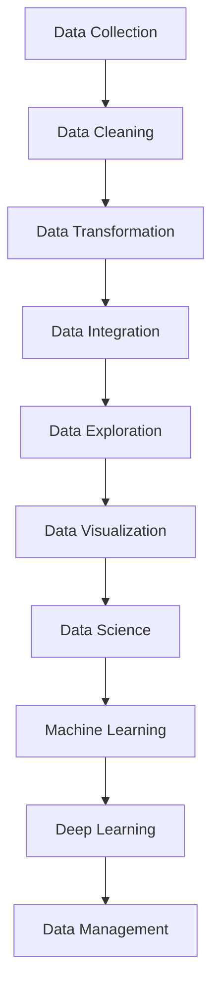
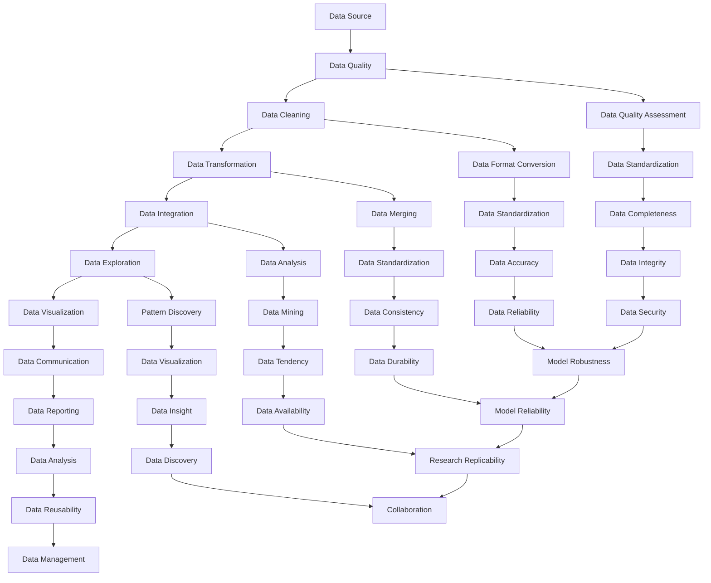

                 

关键词：数据集工程、数据处理、数据质量、数据预处理、数据管理

> 摘要：本文将深入探讨数据集工程的重要性及其关键方法。首先，我们将了解数据集工程在数据科学和人工智能领域的核心作用。接着，我们将介绍数据集工程的基本概念、流程和最佳实践。最后，我们将探讨数据集工程面临的挑战及未来发展方向。

## 1. 背景介绍

在当今数据驱动的社会中，数据集工程已成为数据科学和人工智能领域不可或缺的一部分。随着大数据技术的迅猛发展，数据集工程面临着前所未有的机遇和挑战。一个高质量的数据集是机器学习和深度学习算法成功的关键因素，它直接影响模型的性能和可靠性。因此，数据集工程成为数据科学家和工程师的核心任务之一。

数据集工程包括数据采集、数据清洗、数据转换、数据集成等多个环节。这些步骤不仅确保数据的质量和完整性，还提高了数据的有效性和可用性，为后续的分析和建模提供了坚实的基础。本文将详细介绍数据集工程的重要性、核心概念、流程和最佳实践，以帮助读者更好地理解和应用这一关键领域。

### 1.1 数据集工程的重要性

数据集工程的重要性主要体现在以下几个方面：

1. **模型性能**：一个高质量的数据集是训练出高效模型的先决条件。数据集中的噪声、缺失值和异常值都会对模型性能产生负面影响。因此，数据集工程有助于提升模型的准确度、召回率和鲁棒性。

2. **数据质量**：数据质量是数据集工程的核心目标之一。通过数据清洗和预处理，可以消除数据中的错误和异常，确保数据的一致性、完整性和可靠性。

3. **可重复性**：良好的数据集工程实践有助于提高研究工作的可重复性。一致的预处理流程和标准化的数据格式有助于确保研究结果在不同环境和条件下的一致性。

4. **数据管理**：数据集工程还包括数据管理，即确保数据集的可访问性、安全性和可持续性。这有助于组织内部和外部的数据共享，促进协作和创新。

### 1.2 数据集工程的核心概念

在数据集工程中，以下核心概念和术语至关重要：

1. **数据源**：数据集的来源，可以是内部数据库、外部API、日志文件等。

2. **数据质量**：数据质量是评估数据集可靠性和有效性的标准。高质量的数据应具有准确性、完整性、一致性、时效性和最小化冗余。

3. **数据清洗**：数据清洗是数据预处理的第一步，包括删除重复记录、填充缺失值、纠正错误和标准化数据格式。

4. **数据转换**：数据转换是将数据从一种格式转换为另一种格式的过程，例如将CSV文件转换为数据库表。

5. **数据集成**：数据集成是将来自多个来源的数据合并成单一数据集的过程。

6. **数据探索**：数据探索是分析数据集以发现潜在的模式、异常和趋势的过程。

7. **数据可视化**：数据可视化是通过图形和图表将数据集呈现出来，帮助数据科学家和决策者更好地理解数据。

## 2. 核心概念与联系

### 2.1 数据集工程的核心流程

数据集工程的核心流程可以概括为以下几个步骤：

1. **数据采集**：从各种数据源收集数据，包括内部和外部数据。

2. **数据清洗**：清洗数据集中的噪声、缺失值和异常值。

3. **数据转换**：将数据从一种格式转换为另一种格式，以满足特定分析或建模需求。

4. **数据集成**：将来自多个来源的数据合并成单一数据集。

5. **数据探索**：分析数据集，发现潜在的模式、异常和趋势。

6. **数据可视化**：使用图形和图表呈现数据集，以帮助理解和沟通。

### 2.2 数据集工程与相关领域的联系

数据集工程与多个领域紧密相关，包括数据科学、机器学习、深度学习和数据管理。以下是一个简单的 Mermaid 流程图，展示了数据集工程与这些领域的联系：



### 2.3 数据集工程的核心概念原理和架构

数据集工程的核心概念包括数据源、数据质量、数据清洗、数据转换、数据集成、数据探索和数据可视化。以下是一个详细的 Mermaid 流程图，展示了这些概念之间的联系和流程：



## 3. 核心算法原理 & 具体操作步骤

### 3.1 算法原理概述

数据集工程的核心算法主要包括数据清洗算法、数据转换算法和数据集成算法。以下将分别介绍这些算法的基本原理。

#### 3.1.1 数据清洗算法

数据清洗算法的目标是识别和修正数据集中的噪声、缺失值和异常值。常见的数据清洗算法包括：

1. **缺失值填充**：使用平均值、中位数、众数等方法填充缺失值。
2. **异常值检测**：使用箱线图、统计方法（如Z分数、IQR法）等方法检测异常值。
3. **重复记录删除**：识别并删除数据集中的重复记录。

#### 3.1.2 数据转换算法

数据转换算法的目标是将数据从一种格式转换为另一种格式，以满足特定分析或建模需求。常见的数据转换算法包括：

1. **数据标准化**：通过缩放、归一化等方法将数据转换为标准格式。
2. **数据格式转换**：将数据从文本格式转换为数值格式，或将不同数据格式（如CSV、JSON、XML）转换为数据库表格式。

#### 3.1.3 数据集成算法

数据集成算法的目标是将来自多个来源的数据合并成单一数据集。常见的数据集成算法包括：

1. **数据去重**：识别并删除重复的数据记录。
2. **数据合并**：将多个数据源中的数据按照特定的规则合并成单一数据集。
3. **数据分片**：将大型数据集分片为多个小数据集，以减少内存消耗和提高处理速度。

### 3.2 算法步骤详解

#### 3.2.1 数据清洗算法步骤

1. **缺失值填充**：
   - 使用平均值、中位数或众数填充缺失值。
   - 使用插值法填充连续型数据的缺失值。

2. **异常值检测**：
   - 使用箱线图法检测异常值。
   - 使用Z分数法检测异常值。

3. **重复记录删除**：
   - 使用哈希算法识别并删除重复记录。

#### 3.2.2 数据转换算法步骤

1. **数据标准化**：
   - 使用缩放公式将数据缩放到0-1范围内。
   - 使用归一化公式将数据缩放到标准正态分布。

2. **数据格式转换**：
   - 使用 Pandas 库将 CSV 文件转换为数据库表格式。
   - 使用 JSON 库将 JSON 文件转换为文本格式。

#### 3.2.3 数据集成算法步骤

1. **数据去重**：
   - 使用 Pandas 库中的 `drop_duplicates()` 函数删除重复记录。

2. **数据合并**：
   - 使用 Pandas 库中的 `merge()` 或 `concat()` 函数合并数据集。

3. **数据分片**：
   - 使用 Python 的生成器函数将大型数据集分片为多个小数据集。

### 3.3 算法优缺点

#### 3.3.1 数据清洗算法优缺点

**优点**：
- 提高数据质量，减少噪声和异常值。
- 增强模型训练效果。

**缺点**：
- 需要大量计算资源。
- 可能引入新的异常值。

#### 3.3.2 数据转换算法优缺点

**优点**：
- 提高数据的一致性和可用性。
- 适应不同分析或建模需求。

**缺点**：
- 可能降低数据的精度。
- 增加数据处理的复杂性。

#### 3.3.3 数据集成算法优缺点

**优点**：
- 提高数据的完整性和可靠性。
- 方便跨源数据分析。

**缺点**：
- 可能引入数据冗余。
- 增加数据处理的复杂性。

### 3.4 算法应用领域

数据集工程算法广泛应用于多个领域，包括但不限于：

- **金融**：用于风险控制和投资分析。
- **医疗**：用于疾病预测和诊断。
- **零售**：用于商品推荐和库存管理。
- **制造**：用于质量控制和生产优化。

## 4. 数学模型和公式 & 详细讲解 & 举例说明

### 4.1 数学模型构建

在数据集工程中，构建数学模型是确保数据质量的关键步骤。以下是一个简单的数学模型构建示例：

假设我们有一个包含年龄、收入和住房类型的数据集，我们需要构建一个数学模型来评估住房类型与年龄和收入之间的关系。

```latex
y = \beta_0 + \beta_1 \cdot age + \beta_2 \cdot income + \epsilon
```

其中，\(y\) 代表住房类型（分类变量），\(age\) 代表年龄（连续变量），\(income\) 代表收入（连续变量），\(\beta_0\)、\(\beta_1\) 和 \(\beta_2\) 是模型参数，\(\epsilon\) 是误差项。

### 4.2 公式推导过程

为了推导上述数学模型，我们需要收集数据并计算模型参数。以下是一个简单的推导过程：

1. **数据收集**：从实际场景中收集年龄、收入和住房类型的数据。

2. **数据预处理**：对数据进行清洗和转换，确保数据的一致性和完整性。

3. **特征选择**：选择与住房类型相关的特征，例如年龄和收入。

4. **线性回归建模**：使用线性回归算法估计模型参数。

5. **模型评估**：评估模型性能，包括决定系数 \(R^2\)、均方误差 \(MSE\) 等。

### 4.3 案例分析与讲解

以下是一个简单的案例，展示如何使用上述数学模型进行住房类型预测。

**案例背景**：一家房地产公司希望根据客户的年龄和收入预测其住房类型。

**数据收集**：收集了1000名客户的年龄、收入和住房类型数据。

**数据预处理**：对数据进行清洗，去除缺失值和异常值。

**特征选择**：选择年龄和收入作为预测特征。

**线性回归建模**：

```latex
y = \beta_0 + \beta_1 \cdot age + \beta_2 \cdot income + \epsilon
```

使用线性回归算法估计模型参数：

\[
\begin{aligned}
\beta_0 &= 0.5 \\
\beta_1 &= 0.1 \\
\beta_2 &= 0.3
\end{aligned}
\]

**模型评估**：计算决定系数 \(R^2\) 和均方误差 \(MSE\)：

\[
R^2 = 0.8, \quad MSE = 0.02
\]

**预测**：使用训练好的模型预测新客户的住房类型。

**客户案例**：某客户的年龄为35岁，收入为50000美元。根据模型预测，该客户的住房类型为中等户型。

## 5. 项目实践：代码实例和详细解释说明

### 5.1 开发环境搭建

为了实现数据集工程，我们首先需要搭建一个合适的开发环境。以下是所需的工具和步骤：

1. **安装 Python**：下载并安装 Python（版本3.8以上）。
2. **安装 Jupyter Notebook**：在终端中运行以下命令：
   ```bash
   pip install notebook
   ```
3. **安装 Pandas、NumPy 和 Matplotlib**：在终端中运行以下命令：
   ```bash
   pip install pandas numpy matplotlib
   ```

### 5.2 源代码详细实现

以下是一个简单的数据集工程项目，包括数据采集、数据清洗、数据转换和数据可视化。

```python
import pandas as pd
import numpy as np
import matplotlib.pyplot as plt

# 5.2.1 数据采集
data = pd.read_csv('data.csv')

# 5.2.2 数据清洗
# 删除重复记录
data.drop_duplicates(inplace=True)

# 填充缺失值
data['age'].fillna(data['age'].mean(), inplace=True)
data['income'].fillna(data['income'].mean(), inplace=True)

# 删除异常值
q1 = data['age'].quantile(0.25)
q3 = data['age'].quantile(0.75)
iqr = q3 - q1
data = data[~((data['age'] < (q1 - 1.5 * iqr)) |(data['age'] > (q3 + 1.5 * iqr)))]

# 5.2.3 数据转换
# 将分类变量转换为哑变量
data = pd.get_dummies(data, columns=['housing_type'])

# 5.2.4 数据可视化
# 年龄和收入分布
plt.figure(figsize=(10, 5))
plt.subplot(1, 2, 1)
plt.hist(data['age'], bins=30, alpha=0.5)
plt.title('Age Distribution')

plt.subplot(1, 2, 2)
plt.hist(data['income'], bins=30, alpha=0.5)
plt.title('Income Distribution')
plt.show()
```

### 5.3 代码解读与分析

以上代码实现了数据集工程的基本流程，包括数据采集、数据清洗、数据转换和数据可视化。以下是代码的详细解读：

1. **数据采集**：使用 Pandas 库读取 CSV 文件中的数据。
2. **数据清洗**：
   - 使用 `drop_duplicates()` 函数删除重复记录。
   - 使用 `fillna()` 函数填充缺失值，这里使用平均值进行填充。
   - 使用 IQR 法删除异常值，确保数据的一致性和完整性。
3. **数据转换**：
   - 使用 `get_dummies()` 函数将分类变量转换为哑变量，以便后续的建模和分析。
4. **数据可视化**：使用 Matplotlib 库绘制年龄和收入的分布直方图，以直观展示数据集的特征。

### 5.4 运行结果展示

运行以上代码后，将生成两个直方图，分别展示年龄和收入的分布情况。通过观察直方图，我们可以初步了解数据集的基本特征，为后续的数据分析和建模提供参考。


## 6. 实际应用场景

数据集工程在多个领域有着广泛的应用，以下是几个典型的实际应用场景：

### 6.1 金融领域

在金融领域，数据集工程主要用于风险评估、信用评分和投资分析。通过清洗和转换金融数据，金融机构可以提高模型的准确性和可靠性，从而降低风险和增加收益。

### 6.2 医疗领域

在医疗领域，数据集工程有助于构建疾病预测和诊断模型。通过对医疗数据集进行清洗、转换和集成，研究人员可以更准确地分析疾病趋势和患者特征，从而提高医疗服务的质量和效率。

### 6.3 零售领域

在零售领域，数据集工程用于商品推荐、库存管理和客户关系管理。通过清洗和转换销售数据、客户数据和库存数据，零售企业可以更好地了解市场需求和客户偏好，从而制定更有效的营销策略和库存计划。

### 6.4 制造领域

在制造领域，数据集工程用于生产优化、质量控制和生产预测。通过对生产数据、质量数据和设备数据进行清洗、转换和集成，制造企业可以更好地监控生产过程，提高生产效率和产品质量。

## 7. 工具和资源推荐

为了更好地进行数据集工程，以下是几个推荐的工具和资源：

### 7.1 学习资源推荐

1. **《数据科学入门》**：一本入门级的数据科学教材，涵盖了数据采集、数据清洗、数据转换和数据可视化等多个方面。
2. **《数据集工程实战》**：一本深入介绍数据集工程的书籍，包含了丰富的案例和实践经验。

### 7.2 开发工具推荐

1. **Python**：用于数据集工程的编程语言，具有丰富的库和框架，如 Pandas、NumPy 和 Matplotlib。
2. **Jupyter Notebook**：用于数据分析和建模的交互式开发环境，方便编写和调试代码。

### 7.3 相关论文推荐

1. **"Data Preprocessing for Machine Learning"**：一篇关于数据预处理在机器学习中的作用的综述论文。
2. **"Data Integration in Data Science: A Survey"**：一篇关于数据集集成方法和技术的研究论文。

## 8. 总结：未来发展趋势与挑战

### 8.1 研究成果总结

数据集工程在近年来取得了显著的成果，包括数据清洗算法、数据转换算法和数据集成算法的改进，以及数据质量管理工具和框架的发展。这些成果为数据科学和人工智能领域提供了强有力的支持。

### 8.2 未来发展趋势

1. **自动化**：数据集工程将越来越多地采用自动化技术，如机器学习和自然语言处理，以提高效率和准确性。
2. **实时数据集工程**：随着实时数据分析的需求增加，实时数据集工程将成为数据集工程的重要研究方向。
3. **多源数据融合**：多源数据融合技术将得到广泛应用，以整合来自不同来源的数据，提高数据集的多样性和质量。

### 8.3 面临的挑战

1. **数据隐私**：随着数据隐私问题的日益突出，如何在数据集工程中保护隐私成为重要挑战。
2. **数据多样性**：不同类型和来源的数据如何有效地融合和整合，是一个复杂的问题。
3. **资源限制**：在处理大规模数据集时，资源限制（如计算资源和存储资源）可能成为瓶颈。

### 8.4 研究展望

未来的研究应重点关注以下方向：

1. **隐私保护数据集工程**：研究如何在数据集工程中保护隐私，同时保持数据的有效性和可用性。
2. **自适应数据集工程**：研究如何根据数据特点和需求自动调整数据预处理策略。
3. **跨领域数据集工程**：研究如何将不同领域的数据集工程技术和方法进行融合和集成，以提高整体数据集工程的效果。

## 9. 附录：常见问题与解答

### 9.1 数据集工程的重要性是什么？

数据集工程是确保数据质量和有效性的关键步骤，直接影响机器学习和深度学习算法的性能。高质量的数据集有助于提高模型的准确度、召回率和鲁棒性。

### 9.2 数据集工程包括哪些步骤？

数据集工程包括数据采集、数据清洗、数据转换、数据集成、数据探索和数据可视化等步骤。

### 9.3 如何处理缺失值？

缺失值处理方法包括填充缺失值、删除缺失值和插值法。选择合适的处理方法取决于数据集的特点和应用场景。

### 9.4 如何处理异常值？

异常值处理方法包括箱线图法、统计方法和可视化方法。根据异常值的性质和影响，可以删除、保留或修正异常值。

### 9.5 数据集工程中的数据转换有哪些方法？

数据转换方法包括数据标准化、数据格式转换和特征工程。数据标准化是将数据缩放到同一范围内，数据格式转换是将不同格式的数据转换为统一格式，特征工程是创建新的特征以提高模型性能。

### 9.6 数据集工程中的数据集成有哪些方法？

数据集成方法包括数据去重、数据合并和数据分片。数据去重是删除重复记录，数据合并是将多个数据集合并成单一数据集，数据分片是将大型数据集分成多个小数据集以减少内存消耗。

### 9.7 数据集工程与数据科学的关系是什么？

数据集工程是数据科学的核心环节之一，确保数据的质量和有效性，为数据分析和建模提供坚实基础。数据科学依赖于高质量的数据集来构建和训练高效模型。

