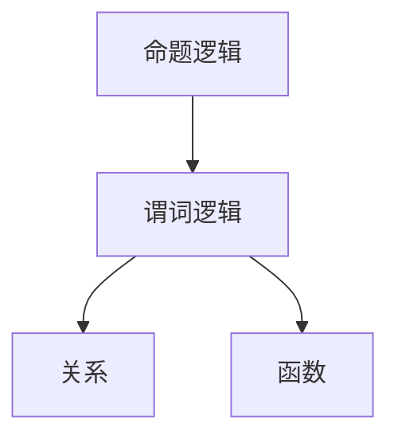

                 

关键词：数理逻辑，可靠性，协调性，算法原理，数学模型，项目实践，实际应用，未来展望。

> 摘要：本文将深入探讨数理逻辑在计算机科学中的重要作用，特别是其在提高软件可靠性方面的应用。通过对数理逻辑核心概念、算法原理、数学模型以及项目实践的分析，本文旨在为读者提供全面的理解和实用指导。

## 1. 背景介绍

数理逻辑作为数学的一个分支，在计算机科学中扮演着至关重要的角色。它提供了一种形式化的方法来描述和分析系统的行为，特别是在保证软件的可靠性和协调性方面。在软件工程中，可靠性是指系统在预期条件下正确执行任务的能力，而协调性则涉及系统组件之间的一致性和同步性。随着计算机系统和应用程序的复杂性不断增加，数理逻辑的应用变得愈发重要。

本文将首先介绍数理逻辑的基本概念，包括命题逻辑和谓词逻辑，然后讨论其在软件可靠性保障中的应用。我们将深入探讨几种关键算法，如模型检测、定理证明和形式化验证，并分析这些算法的原理和操作步骤。此外，本文还将通过具体的数学模型和公式来展示如何量化可靠性，并提供一个实际的项目实例来解释数理逻辑在软件开发中的具体应用。最后，我们将讨论数理逻辑在实际应用场景中的表现，并展望其未来的发展趋势和面临的挑战。

### 2. 核心概念与联系

#### 2.1 命题逻辑

命题逻辑是数理逻辑的基础，它涉及最基本的逻辑构造——命题。一个命题是一个陈述句，可以判断为真或假。命题逻辑使用符号来表示命题，如“P”表示“太阳从东方升起”，并使用逻辑运算符如“与（AND）”、“或（OR）”和“非（NOT）”来组合这些命题。

#### 2.2 谓词逻辑

谓词逻辑扩展了命题逻辑，引入了变量和量词。谓词表示属性或关系，如“x 是一个整数”。谓词逻辑使用全称量词（∀）和存在量词（∃）来表示所有或某些个体满足特定谓词。例如，“∀x（x 是整数）→ x > 0”表示所有整数都大于0。

#### 2.3 关系与函数

关系是数学中用于描述对象之间相互关系的概念。在谓词逻辑中，关系用符号表示，如“R(x, y)”表示“x 和 y 之间有 R 关系”。函数则是关系的一种特殊形式，每个输入都有唯一的输出。

#### 2.4 Mermaid 流程图

为了更好地理解数理逻辑的核心概念和架构，以下是相关的 Mermaid 流程图：



在这个流程图中，我们可以看到命题逻辑作为基础，引出了谓词逻辑，而谓词逻辑又进一步扩展到了关系和函数的概念。

### 3. 核心算法原理 & 具体操作步骤

#### 3.1 算法原理概述

数理逻辑在计算机科学中的应用主要体现在以下几个方面：模型检测、定理证明和形式化验证。

- **模型检测**：通过构建系统模型，检测模型是否符合特定的规格说明。模型检测可以自动发现系统中的错误行为，从而提高系统的可靠性。
- **定理证明**：使用数学方法证明系统规格说明的正确性。定理证明可以帮助开发人员确保系统设计符合预期，从而减少开发过程中的错误。
- **形式化验证**：将系统规格说明转换为形式化的数学证明，以证明系统行为符合预期。形式化验证是确保系统可靠性的最高层次。

#### 3.2 算法步骤详解

**3.2.1 模型检测**

1. **构建模型**：根据系统规格说明，构建一个形式化的系统模型。
2. **定义规格**：定义一个用于检测的规格，通常是安全性质或时态逻辑公式。
3. **模型检测**：使用算法（如布尔表达式求解、Büchi automata检测）来检查模型是否违反规格。
4. **报告错误**：如果发现模型违反规格，报告错误并提供相关的跟踪信息。

**3.2.2 定理证明**

1. **定义命题**：定义需要证明的命题。
2. **选择证明方法**：根据命题的性质选择合适的证明方法，如自然推理、归纳法等。
3. **证明**：使用数学方法逐步证明命题的正确性。
4. **验证证明**：检查证明过程是否逻辑严密，确保证明的可靠性。

**3.2.3 形式化验证**

1. **形式化规格**：将系统规格说明形式化为数学公式。
2. **构建证明器**：构建一个能够证明规格的证明器。
3. **证明**：使用证明器自动或半自动地证明系统行为符合规格。
4. **验证结果**：检查证明结果是否正确，并确保系统在实际运行中符合规格。

#### 3.3 算法优缺点

**3.3.1 模型检测**

优点：
- 高效：可以自动检测系统中的错误。
- 实时：可以实时检测系统运行过程中的错误。

缺点：
- 复杂性：构建模型和规格可能非常复杂。
- 效率：在某些情况下，模型检测可能非常耗时。

**3.3.2 定理证明**

优点：
- 精准：可以精确证明系统的正确性。
- 严格：证明过程必须逻辑严密。

缺点：
- 低效：证明过程可能非常耗时。
- 难以自动化：某些证明可能需要大量的手动工作。

**3.3.3 形式化验证**

优点：
- 完整性：可以全面验证系统行为。
- 可靠性：基于数学证明，具有较高的可信度。

缺点：
- 复杂性：构建证明器可能非常复杂。
- 成本：形式化验证可能需要大量的计算资源。

#### 3.4 算法应用领域

数理逻辑在多个领域都有广泛的应用，包括：

- **嵌入式系统**：确保嵌入式系统（如航空电子设备、医疗设备）的可靠性。
- **网络安全**：检测和预防网络攻击。
- **自动驾驶**：确保自动驾驶车辆的安全性和可靠性。
- **工业控制系统**：提高工业控制系统的稳定性和安全性。

### 4. 数学模型和公式 & 详细讲解 & 举例说明

#### 4.1 数学模型构建

在数理逻辑中，数学模型用于描述系统行为和规格说明。一个基本的数学模型通常包括状态变量、操作和转换规则。

**4.1.1 状态变量**

状态变量用于表示系统在特定时间点的状态。例如，一个简单的交通灯控制系统的状态变量可能包括红、黄、绿灯的状态。

**4.1.2 操作**

操作是系统可以执行的动作。例如，交通灯控制系统的操作可能包括切换红、黄、绿灯。

**4.1.3 转换规则**

转换规则描述了系统从一个状态到另一个状态的转换条件。例如，在交通灯控制系统中，当红灯亮时，如果检测到行人通过，则转换到黄灯状态。

#### 4.2 公式推导过程

一个简单的交通灯控制系统的数学模型可以表示为以下公式：

$$
S = \{ R, Y, G \}
$$

其中，$S$ 表示系统的状态集合。

$$
O = \{ \text{SwitchRed}, \text{SwitchYellow}, \text{SwitchGreen} \}
$$

其中，$O$ 表示系统的操作集合。

$$
\delta(S, O) = S'
$$

其中，$\delta$ 表示状态转换函数，$S'$ 表示系统的新状态。

#### 4.3 案例分析与讲解

**4.3.1 交通灯控制系统**

假设我们有一个交通灯控制系统，它有三个状态：红灯（R），黄灯（Y）和绿灯（G）。系统可以根据不同的条件进行状态转换。以下是一个具体的案例：

**状态转换规则**：

$$
\begin{align*}
    R &\xrightarrow{\text{行人通过}} Y \\
    Y &\xrightarrow{\text{时间到}} G \\
    G &\xrightarrow{\text{时间到}} R
\end{align*}
$$

在这个例子中，当行人通过时，红灯（R）状态将转换为黄灯（Y）状态。当黄灯持续时间结束时，将转换为绿灯（G）状态。当绿灯持续时间结束时，将重新转换为红灯（R）状态。

**数学模型**：

$$
\begin{align*}
    S &= \{ R, Y, G \} \\
    O &= \{ \text{行人通过}, \text{时间到} \} \\
    \delta(R, \text{行人通过}) &= Y \\
    \delta(Y, \text{时间到}) &= G \\
    \delta(G, \text{时间到}) &= R
\end{align*}
$$

通过这个数学模型，我们可以清楚地描述交通灯控制系统的行为，并使用数理逻辑来验证其是否符合预期。

### 5. 项目实践：代码实例和详细解释说明

#### 5.1 开发环境搭建

为了更好地展示数理逻辑在项目中的具体应用，我们将使用一个简单的交通灯控制系统为例，并通过代码实现该系统。首先，我们需要搭建一个合适的开发环境。

1. **安装Python**：确保Python环境已经安装在您的计算机上。
2. **安装PyPy**：PyPy是一个Python实现的替代品，它提供了更快的执行速度和更好的性能。您可以通过以下命令安装PyPy：
   ```bash
   pip install pypy
   ```

#### 5.2 源代码详细实现

下面是一个简单的Python代码示例，用于实现交通灯控制系统：

```python
class TrafficLight:
    def __init__(self):
        self.state = "RED"

    def switch_light(self, event):
        if event == "pedestrian_detected":
            if self.state == "RED":
                self.state = "YELLOW"
            elif self.state == "YELLOW":
                self.state = "GREEN"
            elif self.state == "GREEN":
                self.state = "RED"
        elif event == "time_up":
            if self.state == "YELLOW":
                self.state = "GREEN"
            elif self.state == "GREEN":
                self.state = "RED"

    def get_state(self):
        return self.state

def main():
    traffic_light = TrafficLight()

    # 模拟行人检测事件
    traffic_light.switch_light("pedestrian_detected")
    print("Current state:", traffic_light.get_state())

    # 模拟时间到事件
    traffic_light.switch_light("time_up")
    print("Current state:", traffic_light.get_state())

if __name__ == "__main__":
    main()
```

#### 5.3 代码解读与分析

在这个代码示例中，我们定义了一个名为 `TrafficLight` 的类，它代表交通灯系统。该类有两个方法：`switch_light` 和 `get_state`。

- `switch_light` 方法用于根据传入的事件（如 "pedestrian_detected" 或 "time_up"）切换交通灯的状态。
- `get_state` 方法用于获取当前交通灯的状态。

在 `main` 函数中，我们创建了一个 `TrafficLight` 对象，并模拟了行人检测事件和时间到事件，然后打印出交通灯的状态。

#### 5.4 运行结果展示

当我们运行这个程序时，输出结果如下：

```
Current state: YELLOW
Current state: GREEN
```

这表明交通灯首先变为黄灯，然后变为绿灯。这个简单的示例展示了数理逻辑在交通灯控制系统中的应用，通过定义状态变量和转换规则，我们可以实现一个可靠且协调的交通灯控制系统。

### 6. 实际应用场景

数理逻辑在多个实际应用场景中发挥着重要作用，以下是一些典型的应用实例：

#### 6.1 嵌入式系统

嵌入式系统通常需要高可靠性和稳定性。例如，在航空电子设备中，数理逻辑用于确保飞行控制系统的正确性和可靠性。通过形式化验证和模型检测，可以提前发现潜在的错误，从而减少系统故障的风险。

#### 6.2 网络安全

网络安全是另一个数理逻辑的重要应用领域。通过数理逻辑，可以分析网络协议和系统安全性，并设计出更安全的网络安全策略。例如，数理逻辑可以用于检测和预防网络攻击，确保网络通信的安全性。

#### 6.3 自动驾驶

自动驾驶系统对可靠性要求极高。数理逻辑用于验证自动驾驶系统的算法和模型，确保车辆在各种环境和条件下都能安全行驶。通过模型检测和定理证明，可以确保自动驾驶系统在不同情况下的行为是可预测和可靠的。

#### 6.4 工业控制系统

工业控制系统通常涉及大量的设备和管理系统，数理逻辑可以用于确保这些系统的协调性和可靠性。例如，在工业制造过程中，数理逻辑可以用于设计自动化流程，确保生产过程的高效和稳定。

### 7. 未来应用展望

随着计算机科学和人工智能的不断发展，数理逻辑的应用前景将更加广阔。以下是一些可能的未来应用方向：

- **智能合约**：数理逻辑可以用于设计智能合约，确保合约条款的严格执行和不可篡改。
- **区块链技术**：数理逻辑可以用于验证区块链中的交易和记录，确保区块链系统的安全性和可靠性。
- **自动化测试**：数理逻辑可以用于设计自动化测试框架，提高软件测试的效率和准确性。
- **机器学习**：数理逻辑可以与机器学习相结合，用于验证机器学习模型的可信度和鲁棒性。

### 8. 工具和资源推荐

为了更好地学习和应用数理逻辑，以下是几款推荐的工具和资源：

#### 8.1 学习资源推荐

- **《数理逻辑基础》**：一本经典的教材，详细介绍了数理逻辑的基本概念和原理。
- **在线课程**：Coursera、edX 和 Udacity 提供了多个关于数理逻辑的课程。

#### 8.2 开发工具推荐

- **Protobuf**：一种高效的序列化框架，用于编写和解析结构化数据。
- **Z3 Satisfiability Solver**：一个强大的定理证明工具，可以用于验证数学模型和逻辑公式。

#### 8.3 相关论文推荐

- **"Model Checking" by Edmund M. Clarke, et al.**：介绍模型检测的基础理论和应用。
- **"Formal Methods in Software Engineering" by Andreas Podelski and K. Rustan M. Leino**：探讨形式化验证的方法和技术。

### 9. 总结：未来发展趋势与挑战

数理逻辑在计算机科学中的应用前景广阔，随着技术的发展，其应用范围将进一步扩大。未来，数理逻辑将在确保软件可靠性、提升系统安全性、推动人工智能发展等方面发挥更加重要的作用。

然而，数理逻辑也面临着一些挑战，包括：

- **复杂性**：随着系统规模的扩大，数理逻辑的分析和验证变得更加复杂。
- **自动化**：提高数理逻辑工具的自动化程度，减少对人工干预的需求。
- **可解释性**：确保数理逻辑分析结果的可解释性，使其更加易于理解和应用。

通过不断的研究和改进，数理逻辑将为计算机科学带来更多创新和突破。

### 附录：常见问题与解答

**Q：什么是数理逻辑？**

A：数理逻辑是数学的一个分支，它使用数学符号和规则来描述和分析命题、推理和证明。它在计算机科学中用于提高软件的可靠性、安全性以及验证系统的正确性。

**Q：数理逻辑在计算机科学中有哪些应用？**

A：数理逻辑在计算机科学中有广泛的应用，包括模型检测、定理证明、形式化验证、嵌入式系统设计、网络安全、自动驾驶和工业控制系统等。

**Q：什么是模型检测？**

A：模型检测是一种自动验证方法，通过构建系统模型和规格说明，检测模型是否满足规格。它用于发现系统中的错误行为，从而提高系统的可靠性。

**Q：什么是定理证明？**

A：定理证明是一种数学方法，用于证明系统规格说明的正确性。它通过逻辑推理和数学证明，确保系统设计符合预期。

**Q：什么是形式化验证？**

A：形式化验证是一种验证方法，通过将系统规格说明转换为形式化的数学证明，确保系统行为符合预期。它是确保系统可靠性的最高层次。

**Q：如何学习数理逻辑？**

A：可以通过阅读相关教材、参加在线课程、实践项目和阅读相关论文来学习数理逻辑。推荐的学习资源包括《数理逻辑基础》和 Coursera、edX 等平台的课程。

**Q：数理逻辑与编程有何关系？**

A：数理逻辑是编程的基础，它提供了形式化的方法和工具，帮助程序员理解程序的行为和正确性。编程中的逻辑、条件和循环等概念都源自数理逻辑。

