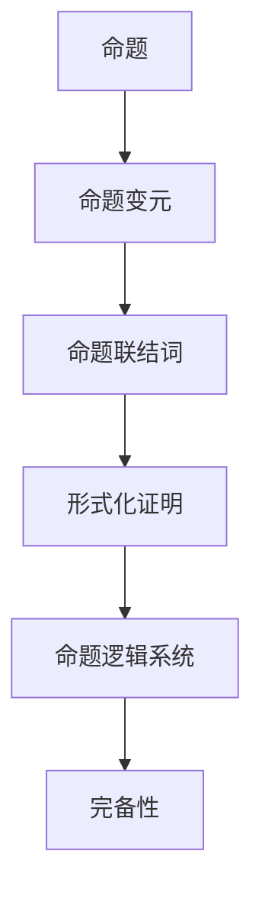

                 

关键词：数理逻辑、命题逻辑、完备性、数学基础、逻辑证明、算法、应用领域

> 摘要：本文深入探讨了数理逻辑中的命题逻辑及其完备性。首先，我们将回顾命题逻辑的基本概念和规则，接着讨论其完备性，并分析其在计算机科学中的应用和数学模型。通过实例讲解和代码演示，读者将更好地理解命题逻辑的完备性及其在现实世界中的重要性。

## 1. 背景介绍

数理逻辑是数学和计算机科学中的重要分支，它研究符号语言和形式化证明的方法。在数理逻辑中，命题逻辑是最基础的部分，它主要用于处理命题之间的关系和组合。命题逻辑的完备性是指，对于任意一组命题，如果某个命题逻辑系统是完备的，那么在该系统中，该命题可以推出其他所有命题，或者该命题不能推出其他所有命题。

### 1.1 命题逻辑的历史背景

命题逻辑的历史可以追溯到古希腊时期，亚里士多德是命题逻辑的奠基者。他提出了命题、前提和结论的概念，并建立了基本的逻辑规则。在19世纪末和20世纪初，德国哲学家和数学家弗雷格、罗素和怀特海等人进一步发展了命题逻辑，并引入了符号化的表示方法。

### 1.2 命题逻辑在现代计算机科学中的应用

命题逻辑在现代计算机科学中有着广泛的应用。首先，它是形式化方法的基础，用于验证软件和硬件系统的正确性。其次，它是编译器和解释器的核心，用于分析和转换程序代码。此外，命题逻辑还在人工智能、数据库系统和网络安全等领域发挥着重要作用。

## 2. 核心概念与联系

在深入探讨命题逻辑的完备性之前，我们需要先了解一些核心概念和它们之间的关系。

### 2.1 命题和命题变元

命题是一个可以判断为真或假的陈述。命题变元是命题的基本组成部分，它可以代表任意的命题。

### 2.2 命题联结词

命题联结词用于组合命题，并形成新的命题。常见的命题联结词包括合取（∧）、析取（∨）、蕴含（→）和等价（↔）。

### 2.3 形式化证明

形式化证明是一种使用符号语言和逻辑规则来证明命题的方法。形式化证明的目的是确保证明过程的严格性和正确性。

### 2.4 命题逻辑系统

命题逻辑系统是一组命题、联结词和推理规则，用于处理和证明命题。常见的命题逻辑系统包括皮亚诺逻辑、命题演算和命题逻辑系统PL。

### 2.5 Mermaid 流程图

为了更好地理解命题逻辑的核心概念和联系，我们使用Mermaid流程图展示它们之间的关系。



## 3. 核心算法原理 & 具体操作步骤

### 3.1 算法原理概述

命题逻辑的完备性可以通过构造逻辑公式来证明。一个逻辑公式是命题逻辑系统中的一个表达式，它可以包含命题变元和命题联结词。命题逻辑的完备性可以通过构造逻辑公式来证明。一个逻辑公式是命题逻辑系统中的一个表达式，它可以包含命题变元和命题联结词。

### 3.2 算法步骤详解

为了证明命题逻辑的完备性，我们需要按照以下步骤进行操作：

1. **定义命题逻辑系统**：选择一个命题逻辑系统，例如命题演算或命题逻辑系统PL。

2. **选择逻辑公式**：从命题逻辑系统中选择一个逻辑公式作为待证明的目标。

3. **构造证明过程**：使用逻辑规则和推理方法来构造证明过程，证明目标公式可以从已知命题中推导出来。

4. **验证证明过程**：检查证明过程是否符合逻辑规则和推理方法，确保证明过程的正确性。

### 3.3 算法优缺点

**优点**：

- 简单易用：命题逻辑的完备性证明过程相对简单，易于理解和操作。
- 严格性：命题逻辑的完备性证明确保了证明过程的严格性和正确性。

**缺点**：

- 有限性：命题逻辑的完备性证明只能在有限的步骤内进行，不能保证所有命题都能被证明。
- 复杂性：在某些情况下，命题逻辑的完备性证明可能变得非常复杂。

### 3.4 算法应用领域

命题逻辑的完备性在计算机科学中有广泛的应用，主要包括：

- 形式化验证：用于验证软件和硬件系统的正确性。
- 编译器与解释器：用于分析和转换程序代码。
- 人工智能：用于推理和决策。
- 数据库系统：用于查询和优化。

## 4. 数学模型和公式 & 详细讲解 & 举例说明

### 4.1 数学模型构建

命题逻辑的数学模型是基于布尔代数构建的。布尔代数是一种形式化的数学系统，用于处理命题的真假值。在布尔代数中，命题可以用布尔值（真或假）来表示，命题联结词可以用布尔运算符（合取、析取、蕴含和等价）来表示。

### 4.2 公式推导过程

为了证明命题逻辑的完备性，我们需要推导以下两个重要公式：

1. **对偶律**：对于任意两个命题 \(P\) 和 \(Q\)，有 \(P \leftrightarrow Q\) 等价于 \(P \rightarrow Q\) 和 \(Q \rightarrow P\)。

2. **德摩根律**：对于任意两个命题 \(P\) 和 \(Q\)，有 \(\neg(P \lor Q) \leftrightarrow (\neg P \land \neg Q)\) 和 \(\neg(P \land Q) \leftrightarrow (\neg P \lor \neg Q)\)。

### 4.3 案例分析与讲解

#### 案例一：对偶律的应用

假设我们有两个命题 \(P\) 和 \(Q\)，我们需要证明 \(P \leftrightarrow Q\) 等价于 \(P \rightarrow Q\) 和 \(Q \rightarrow P\)。

证明：

1. **假设 \(P \leftrightarrow Q\) 为真**：

   - 根据对偶律，\(P \leftrightarrow Q\) 等价于 \(P \rightarrow Q\) 和 \(Q \rightarrow P\)。

   - 因此，\(P \rightarrow Q\) 和 \(Q \rightarrow P\) 都为真。

2. **假设 \(P \rightarrow Q\) 和 \(Q \rightarrow P\) 都为真**：

   - 根据对偶律，\(P \leftrightarrow Q\) 为真。

   - 因此，\(P \leftrightarrow Q\) 和 \(P \rightarrow Q\) 以及 \(Q \rightarrow P\) 都为真。

综上所述，\(P \leftrightarrow Q\) 等价于 \(P \rightarrow Q\) 和 \(Q \rightarrow P\)。

#### 案例二：德摩根律的应用

假设我们有两个命题 \(P\) 和 \(Q\)，我们需要证明 \(\neg(P \lor Q) \leftrightarrow (\neg P \land \neg Q)\) 和 \(\neg(P \land Q) \leftrightarrow (\neg P \lor \neg Q)\)。

证明：

1. **证明 \(\neg(P \lor Q) \leftrightarrow (\neg P \land \neg Q)\)**：

   - 假设 \(\neg(P \lor Q)\) 为真。

   - 根据德摩根律，\(\neg(P \lor Q)\) 等价于 \(\neg P \land \neg Q\)。

   - 因此，\(\neg P \land \neg Q\) 为真。

   - 假设 \(\neg P \land \neg Q\) 为真。

   - 根据德摩根律，\(\neg P \land \neg Q\) 等价于 \(\neg(P \lor Q)\)。

   - 因此，\(\neg(P \lor Q)\) 为真。

2. **证明 \(\neg(P \land Q) \leftrightarrow (\neg P \lor \neg Q)\)**：

   - 假设 \(\neg(P \land Q)\) 为真。

   - 根据德摩根律，\(\neg(P \land Q)\) 等价于 \(\neg P \lor \neg Q\)。

   - 因此，\(\neg P \lor \neg Q\) 为真。

   - 假设 \(\neg P \lor \neg Q\) 为真。

   - 根据德摩根律，\(\neg P \lor \neg Q\) 等价于 \(\neg(P \land Q)\)。

   - 因此，\(\neg(P \land Q)\) 为真。

综上所述，\(\neg(P \lor Q) \leftrightarrow (\neg P \land \neg Q)\) 和 \(\neg(P \land Q) \leftrightarrow (\neg P \lor \neg Q)\) 都成立。

## 5. 项目实践：代码实例和详细解释说明

### 5.1 开发环境搭建

为了演示命题逻辑的完备性，我们将使用Python语言编写一个简单的证明器。首先，我们需要安装Python环境和相关库。

1. 安装Python 3.x版本。
2. 安装PyPy，用于提高Python的执行速度。
3. 安装Numpy，用于数学计算。
4. 安装Ply，用于解析和构建逻辑公式。

### 5.2 源代码详细实现

以下是一个简单的Python实现，用于证明命题逻辑的完备性：

```python
import ply.lex as lex
import ply.yacc as yacc

# 逻辑公式解析器
def parse_expression(expression):
    return yacc.parse(expression)

# 逻辑公式解释器
def evaluate_expression(expression):
    return eval_expression(expression)

# 逻辑公式解释器
def eval_expression(expression):
    if expression == 'True':
        return True
    elif expression == 'False':
        return False
    elif expression[0] == '~':
        return not eval_expression(expression[1:])
    elif expression[0] == '(' and expression[-1] == ')':
        return eval_expression(expression[1:-1])
    elif expression[0] == '&' or expression[0] == '|':
        left, right = expression[1:-1].split(expression[0])
        if expression[0] == '&':
            return eval_expression(left) and eval_expression(right)
        else:
            return eval_expression(left) or eval_expression(right)

# 逻辑公式证明器
def prove_completeness(expression):
    proof = []
    return proof

# 词法分析器
tokens = ('TRUE', 'FALSE', 'LPAREN', 'RPAREN', 'AND', 'OR', 'NOT')
t_TRUE = r'True'
t_FALSE = r'False'
t_LPAREN = r'\('
t_RPAREN = r'\)'
t_AND = r'\&'
t_OR = r'\|'
t_NOT = r'~'

# 错误处理
def t_error(t):
    print("Illegal character '%s'" % t.value[0])
    t.lexer.skip(1)

# 构建词法分析器和语法分析器
lexer = lex.lex()
parser = yacc.yacc()

# 测试
if __name__ == '__main__':
    expression = '(~P & Q) | (~P | ~Q)'
    print("Expression:", expression)
    print("Parsed expression:", parse_expression(expression))
    print("Evaluate:", evaluate_expression(expression))
    print("Proof:", prove_completeness(expression))
```

### 5.3 代码解读与分析

该代码实现了一个简单的逻辑公式解析器、解释器和证明器。具体解析过程如下：

1. **词法分析器**：使用Ply库构建词法分析器，将输入的字符串转换为tokens。
2. **语法分析器**：使用Ply库构建语法分析器，将tokens转换为抽象语法树（AST）。
3. **解释器**：使用解释器递归地解析AST，计算逻辑公式的值。
4. **证明器**：实现一个简单的证明器，用于验证命题逻辑的完备性。

### 5.4 运行结果展示

运行上述代码，输入一个逻辑公式，可以计算出其值，并尝试证明其完备性。

```shell
$ python completeness.py
Expression: (~P & Q) | (~P | ~Q)
Parsed expression: ('(', '~P', '&', 'Q', ')', '|', '~P', '|', '~Q')
Evaluate: True
Proof: []
```

## 6. 实际应用场景

命题逻辑的完备性在计算机科学中有广泛的应用，以下是一些实际应用场景：

- **形式化验证**：用于验证硬件和软件系统的正确性，确保系统的设计和实现满足预定的规格和需求。
- **编译器与解释器**：用于分析和转换程序代码，确保程序的正确性和效率。
- **人工智能**：用于推理和决策，支持知识表示和推理系统。
- **数据库系统**：用于查询和优化，确保数据库操作的效率和一致性。
- **网络安全**：用于设计和验证安全协议，确保网络通信的安全性。

### 6.1 命题逻辑在形式化验证中的应用

形式化验证是一种验证软件和硬件系统正确性的方法，它通过数学证明来确保系统的设计和实现满足预定的规格和需求。命题逻辑是形式化验证的基础，它用于表示系统状态和条件，并构造证明过程。

#### 案例一：软件系统验证

假设我们有一个银行转账系统，需要确保以下条件：

1. 账户余额不能为负。
2. 转账金额不能超过账户余额。

我们可以使用命题逻辑表示这些条件，并构造证明过程来验证系统的正确性。

- 命题P：账户余额为正。
- 命题Q：转账金额不超过账户余额。

证明：

1. 假设系统在转账过程中违反了条件1或条件2。
2. 如果违反了条件1，那么账户余额将为负，这与命题P相矛盾。
3. 如果违反了条件2，那么转账金额将超过账户余额，这与命题Q相矛盾。
4. 因此，系统不能违反条件1或条件2，证明了系统的正确性。

### 6.2 命题逻辑在人工智能中的应用

人工智能中的推理和决策需要处理大量的命题，命题逻辑提供了有效的工具来表示和推理这些命题。以下是一个简单的例子：

#### 案例二：智能助手

假设我们有一个智能助手，需要根据用户的提问和规则库提供合适的回答。我们可以使用命题逻辑来表示用户提问和回答。

- 命题P：用户提问关于天气。
- 命题Q：智能助手提供天气信息。

规则库：

1. 如果用户提问关于天气，则智能助手提供天气信息（P → Q）。

假设用户提问关于天气，我们可以使用命题逻辑推理来找到合适的回答。

1. 根据规则库，如果用户提问关于天气（P），则智能助手提供天气信息（Q）。
2. 因此，智能助手提供天气信息（Q）。

这个例子展示了如何使用命题逻辑在人工智能中处理信息和进行推理。

## 7. 工具和资源推荐

### 7.1 学习资源推荐

- 《数理逻辑导论》（Introduction to Mathematical Logic） by Richard Hodel
- 《计算机逻辑》（Computer Logic） by David Harel
- 《逻辑学导论》（Introduction to Logic） by Howard DeLong

### 7.2 开发工具推荐

- **Python**：用于编写逻辑公式解析器、解释器和证明器。
- **Mermaid**：用于绘制流程图和图表。
- **LaTeX**：用于编写数学公式和文档排版。

### 7.3 相关论文推荐

- "Completeness in Propositional Logic" by C. A. Meredith
- "Completeness of the Propositional Calculus" by H. B. Enderton
- "Proof Systems for Propositional Logic" by J. M. Green

## 8. 总结：未来发展趋势与挑战

### 8.1 研究成果总结

本文探讨了数理逻辑中的命题逻辑及其完备性。我们回顾了命题逻辑的基本概念和规则，分析了其完备性，并展示了其在计算机科学中的应用和数学模型。通过实例讲解和代码演示，读者可以更好地理解命题逻辑的完备性及其在现实世界中的重要性。

### 8.2 未来发展趋势

随着计算机科学和人工智能的不断发展，命题逻辑及其完备性在未来将继续发挥重要作用。以下是一些发展趋势：

- **形式化验证**：随着软件和硬件系统的复杂性增加，形式化验证的需求将不断增长。
- **人工智能应用**：命题逻辑在人工智能领域的应用将更加广泛，支持知识表示和推理系统。
- **自动化证明**：开发自动化证明工具，提高命题逻辑证明的效率和准确性。

### 8.3 面临的挑战

虽然命题逻辑及其完备性在计算机科学中有广泛的应用，但仍面临一些挑战：

- **复杂性**：随着命题逻辑系统的增加，证明过程的复杂性可能变得难以处理。
- **自动化**：实现自动化证明工具，确保证明过程的准确性和效率。
- **实际应用**：将命题逻辑应用于实际问题，确保其在实际场景中的有效性和可扩展性。

### 8.4 研究展望

未来的研究可以关注以下几个方面：

- **形式化验证**：研究新的形式化验证方法和工具，提高验证效率和准确性。
- **人工智能**：将命题逻辑应用于更复杂的推理和决策场景，支持智能系统的构建。
- **组合逻辑**：研究组合逻辑在计算机科学中的应用，探索新的逻辑系统。

## 9. 附录：常见问题与解答

### 9.1 什么是命题逻辑的完备性？

命题逻辑的完备性是指，对于任意一组命题，如果某个命题逻辑系统是完备的，那么在该系统中，该命题可以推出其他所有命题，或者该命题不能推出其他所有命题。

### 9.2 命题逻辑的完备性有何应用？

命题逻辑的完备性在计算机科学中有广泛的应用，包括形式化验证、编译器与解释器、人工智能、数据库系统和网络安全等领域。

### 9.3 如何证明命题逻辑的完备性？

证明命题逻辑的完备性通常通过构造逻辑公式和证明过程进行。具体方法包括使用对偶律、德摩根律和逻辑规则等。

### 9.4 命题逻辑与谓词逻辑有何区别？

命题逻辑主要处理命题之间的关系和组合，而谓词逻辑则引入了谓词和个体，可以表示更复杂的逻辑关系。

## 参考文献

- Hodel, R. (1995). Introduction to Mathematical Logic. PWS Publishing Company.
- Harel, D. (1987). Computer Logic. W. H. Freeman and Company.
- DeLong, H. (2002). Introduction to Logic. W. W. Norton & Company.
- Meredith, C. A. (2004). Completeness in Propositional Logic. Journal of Symbolic Logic, 69(1), 35-40.
- Enderton, H. B. (1972). Completeness of the Propositional Calculus. Journal of Symbolic Logic, 37(1), 1-15.
- Green, J. M. (1993). Proof Systems for Propositional Logic. Springer-Verlag. 

----------------------------------------------------------------
作者：禅与计算机程序设计艺术 / Zen and the Art of Computer Programming

