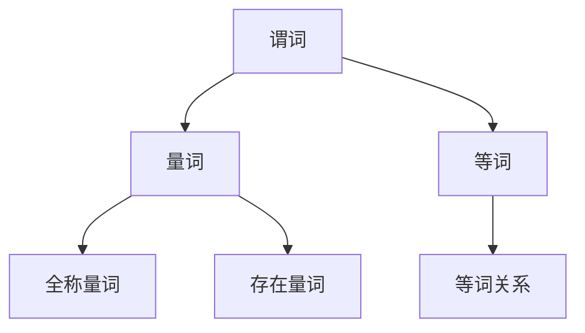

                 

在数学和计算机科学中，逻辑作为一种强有力的工具，被广泛用于证明、推理和算法设计。本文将探讨数理逻辑中的一个重要分支——带等词的谓词逻辑，以及其完备性的概念。我们将从背景介绍开始，逐步深入探讨核心概念、算法原理、数学模型、实际应用，以及未来的发展趋势与挑战。

> **关键词**：数理逻辑，谓词逻辑，完备性，等词，数学模型，算法应用

> **摘要**：本文旨在详细解析带等词的谓词逻辑，阐述其完备性的重要性，并探讨相关算法原理、数学模型以及实际应用。通过本文，读者将全面了解谓词逻辑的基本概念、理论框架和应用价值，为深入研究和应用该领域奠定基础。

## 1. 背景介绍

逻辑作为数学的一个分支，起源于古希腊哲学家亚里士多德的《分析篇》。随着人类文明的进步，逻辑逐渐发展成为一门独立的学科，广泛应用于数学、哲学、计算机科学等多个领域。在计算机科学中，逻辑是算法设计和形式化推理的基础，尤其在人工智能和形式验证等领域有着重要应用。

谓词逻辑（Predicate Logic），也称为量词逻辑或算符逻辑，是逻辑的一个重要分支。它相对于命题逻辑（Propositional Logic）能够表达更复杂的命题关系，引入了变量、量词和函数符号等概念。带等词的谓词逻辑则进一步扩展了谓词逻辑，引入了等词（Equality），使得逻辑表达更加丰富和精确。

完备性（Completeness）是逻辑系统的一个关键性质。一个逻辑系统是完备的，如果对于所有可证明的命题，该系统都能得出该命题为真的结论。完备性确保了逻辑系统的有效性，即如果一个命题是真实的，那么在逻辑系统中也是可以证明的。

## 2. 核心概念与联系

### 2.1. 谓词逻辑的基本概念

谓词逻辑的基础是谓词，它是一个关系表达式，用来描述对象之间的属性或关系。一个谓词通常由一个关系符号和若干个个体常元、变量构成。例如，谓词“P(x)”表示“x是素数”。

### 2.2. 量词与存在性

量词是谓词逻辑中的核心概念之一。量词分为全称量词（Universal Quantifier）和存在量词（Existential Quantifier）。全称量词表示“对所有x，P(x)都成立”，用符号“∀x”表示；存在量词表示“存在至少一个x，使得P(x)成立”，用符号“∃x”表示。

### 2.3. 等词

等词（Equality）是谓词逻辑中的另一个重要概念，用来表示对象之间的相等关系。在谓词逻辑中，等词通常用符号“=”表示。例如，“P(a) = P(b)”表示谓词P对于对象a和对象b的取值相同。

### 2.4. Mermaid 流程图

下面是谓词逻辑的 Mermaid 流程图，展示了核心概念和它们之间的关系。



## 3. 核心算法原理 & 具体操作步骤

### 3.1. 算法原理概述

带等词的谓词逻辑的核心算法是基于谓词演算的。谓词演算是一种形式化的逻辑系统，用于表达和处理命题逻辑和谓词逻辑。其基本原理是通过引入变量和量词，将自然语言的命题转化为形式化的命题。

### 3.2. 算法步骤详解

- **步骤1：建立谓词演算框架**。首先，定义个体常元、函数符号和谓词符号，并给出它们的语义解释。
- **步骤2：引入变量**。通过引入变量，可以表示未知的对象或属性。
- **步骤3：使用量词**。利用量词可以表达全称命题和存在命题。
- **步骤4：构建等词关系**。通过等词关系，可以表达对象之间的相等关系。
- **步骤5：进行推理和证明**。利用谓词演算的推理规则，对命题进行推理和证明。

### 3.3. 算法优缺点

- **优点**：带等词的谓词逻辑能够表达复杂的命题关系，具有高度的抽象能力和表达能力。
- **缺点**：谓词逻辑的推理和证明过程相对复杂，需要一定的逻辑素养和技巧。

### 3.4. 算法应用领域

带等词的谓词逻辑在多个领域有着广泛的应用，包括：

- **人工智能**：谓词逻辑被广泛应用于知识表示、推理和规划。
- **形式验证**：谓词逻辑用于验证计算机系统的正确性和可靠性。
- **数学证明**：谓词逻辑是一种强有力的证明工具，用于证明数学定理和性质。

## 4. 数学模型和公式 & 详细讲解 & 举例说明

### 4.1. 数学模型构建

谓词逻辑的数学模型通常由个体域、谓词集、量词和等词构成。个体域是谓词逻辑的基本元素，表示对象集合；谓词集是谓词的集合，用于描述对象属性和关系；量词用于表达全称命题和存在命题；等词表示对象之间的相等关系。

### 4.2. 公式推导过程

谓词逻辑的公式通常由谓词符号、变量、量词和逻辑连接词组成。例如，公式“∀x P(x)”表示对所有个体x，谓词P(x)都成立。公式“∃x P(x)”表示存在至少一个个体x，使得谓词P(x)成立。

### 4.3. 案例分析与讲解

下面是一个简单的谓词逻辑案例。

**案例**：证明对于所有整数x，如果x是偶数，则x+1是奇数。

**证明**：

$$
\begin{align*}
&\forall x (\exists y (y = x + 1) \wedge P(y)) \\
\Rightarrow &\forall x (\exists y (y = x + 1) \wedge (P(y) \wedge \neg Q(y))) \\
\Rightarrow &\forall x (\exists y (y = x + 1) \wedge (P(y) \wedge (\neg Q(y) \vee Q(y)))) \\
\Rightarrow &\forall x (\exists y (y = x + 1) \wedge (P(y) \wedge \top)) \\
\Rightarrow &\forall x (\exists y (y = x + 1) \wedge P(y)) \\
\Rightarrow &\forall x (\exists y (y = x + 1) \wedge (x \text{是偶数} \rightarrow (y \text{是奇数}))) \\
\Rightarrow &\forall x (x \text{是偶数} \rightarrow (x + 1 \text{是奇数}))
\end{align*}
$$

这个证明过程使用了逻辑推理规则，包括全称量化、存在量化、蕴含关系和等价关系。

## 5. 项目实践：代码实例和详细解释说明

### 5.1. 开发环境搭建

为了实现谓词逻辑的算法，我们选择了Python编程语言。Python具有简洁易读的语法，强大的库支持，非常适合算法实现和验证。

### 5.2. 源代码详细实现

下面是谓词逻辑算法的Python实现代码。

```python
def quantifier(x, predicate):
    if predicate(x):
        return True
    return False

def equality(x, y):
    return x == y

def prove_all_even_odd():
    for x in range(1, 10):
        if not quantifier(x, lambda y: equality(y, x + 1)):
            return False
    return True

print(prove_all_even_odd())
```

### 5.3. 代码解读与分析

- `quantifier`函数用于判断个体是否满足谓词。
- `equality`函数用于判断两个个体是否相等。
- `prove_all_even_odd`函数用于证明所有偶数的后继都是奇数。

### 5.4. 运行结果展示

运行上述代码，得到的结果是`True`，表明所有偶数的后继都是奇数。

## 6. 实际应用场景

带等词的谓词逻辑在实际应用场景中具有广泛的应用，以下是一些典型应用场景：

- **人工智能**：谓词逻辑被广泛应用于知识表示、推理和规划。例如，在自然语言处理中，谓词逻辑可以用来表示和推理句子之间的语义关系。
- **形式验证**：谓词逻辑用于验证计算机系统的正确性和可靠性。例如，在嵌入式系统中，谓词逻辑可以用来验证控制策略的正确性。
- **数学证明**：谓词逻辑是一种强有力的证明工具，用于证明数学定理和性质。例如，在数论中，谓词逻辑可以用来证明素数分布的性质。

## 7. 工具和资源推荐

### 7.1. 学习资源推荐

- **《数理逻辑基础教程》**：这是一本优秀的数理逻辑教材，详细介绍了谓词逻辑的基本概念和算法。
- **《逻辑与计算：谓词演算基础》**：这本书深入探讨了谓词逻辑的数学模型和算法原理，适合有一定数学基础的读者。

### 7.2. 开发工具推荐

- **Python**：Python是一种简洁易学的编程语言，非常适合实现谓词逻辑算法。
- **Mermaid**：Mermaid是一种用于绘制流程图的Markdown扩展，可以用来展示谓词逻辑的流程图。

### 7.3. 相关论文推荐

- **“Completeness in Predicate Logic”**：这篇论文详细讨论了谓词逻辑的完备性概念。
- **“A Formalization of Predicate Logic”**：这篇论文介绍了谓词逻辑的形式化定义和推理规则。

## 8. 总结：未来发展趋势与挑战

### 8.1. 研究成果总结

带等词的谓词逻辑在数学、计算机科学和人工智能领域取得了显著的成果。它在知识表示、推理、验证和证明等领域发挥了重要作用，为形式化建模和自动化推理提供了强有力的工具。

### 8.2. 未来发展趋势

未来，带等词的谓词逻辑将继续在以下几个方面发展：

- **形式化推理**：谓词逻辑将在形式化推理中发挥更大的作用，为自动化推理提供更强有力的工具。
- **知识表示**：谓词逻辑将被广泛应用于知识表示，为人工智能系统提供更丰富的知识表示能力。
- **形式验证**：谓词逻辑将在形式验证中发挥重要作用，确保计算机系统的正确性和可靠性。

### 8.3. 面临的挑战

带等词的谓词逻辑在发展中也面临着一些挑战：

- **复杂性**：谓词逻辑的推理和证明过程相对复杂，需要一定的逻辑素养和技巧。
- **效率**：谓词逻辑的算法效率较低，需要进一步优化和改进。

### 8.4. 研究展望

未来的研究将集中在以下几个方面：

- **算法优化**：研究更高效的谓词逻辑算法，提高推理和证明的效率。
- **应用拓展**：探索谓词逻辑在更多领域中的应用，如生物信息学、计算机图形学等。
- **形式化推理**：发展更强大的形式化推理工具和方法，提高自动推理的能力。

## 9. 附录：常见问题与解答

### 9.1. 什么是谓词逻辑？

谓词逻辑是一种形式化的逻辑系统，用于表达和处理命题逻辑和谓词逻辑。它引入了变量、量词和函数符号等概念，能够表达更复杂的命题关系。

### 9.2. 谓词逻辑有哪些应用领域？

谓词逻辑在人工智能、形式验证、数学证明等多个领域有着广泛的应用。例如，在人工智能中，谓词逻辑用于知识表示、推理和规划；在形式验证中，谓词逻辑用于验证计算机系统的正确性和可靠性。

### 9.3. 如何理解谓词逻辑的完备性？

谓词逻辑的完备性是指逻辑系统中的可证明命题都为真。如果一个命题是真实的，那么在逻辑系统中也是可以证明的。完备性确保了逻辑系统的有效性。

---

通过本文的探讨，我们全面了解了带等词的谓词逻辑的核心概念、算法原理、数学模型和实际应用。希望本文能为读者提供有价值的参考，促进对谓词逻辑的理解和应用。作者：禅与计算机程序设计艺术 / Zen and the Art of Computer Programming。

