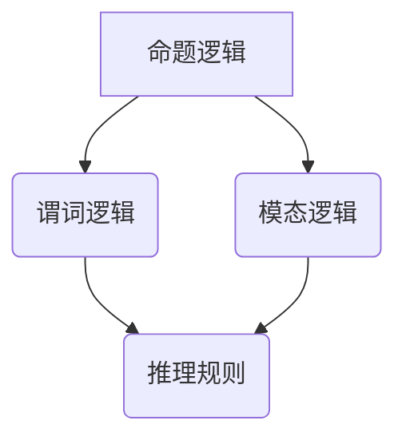

                 

关键词：数理逻辑，形式系统，形式数学，推理，证明，数学公式，逻辑演算，计算机科学

> 摘要：本文深入探讨数理逻辑在形式数学系统中的应用，从基本概念出发，详细阐述逻辑演算的原理、数学模型的构建及其在计算机科学领域的广泛影响。通过分析核心算法和数学公式，本文将提供实际代码实例和运行结果展示，进一步探讨数理逻辑在实际应用场景中的前景与挑战。

## 1. 背景介绍

数理逻辑作为现代数学和计算机科学的重要分支，起源于19世纪末和20世纪初。它将逻辑原理应用于数学体系，形成了形式数学系统，为数学分析和证明提供了严格的工具和方法。形式数学系统旨在通过符号化的逻辑语言，对数学概念和证明过程进行形式化描述，从而提高数学理论的精确性和普适性。

### 数理逻辑的发展历程

- **弗雷格**：19世纪德国数学家和哲学家，被认为是数理逻辑的奠基人。他提出了形式逻辑系统，试图通过符号化方法精确描述数学概念。

- **罗素和怀特海德**：《数学原理》的作者，他们发展了类型理论，试图解决逻辑悖论问题。

- **图灵**：提出图灵机模型，为计算理论和形式逻辑提供了强有力的工具。

- **哥德尔和科朗**：哥德尔的不完备性定理揭示了形式数学系统的局限性和内在矛盾。

### 形式数学系统的意义

形式数学系统不仅提供了精确的数学证明方法，还在计算机科学中发挥了重要作用。它为编程语言的设计、编译原理、形式验证等领域提供了理论基础。形式化逻辑语言和证明技术使得计算机程序能够进行自我验证，确保其逻辑正确性和安全性。

## 2. 核心概念与联系

### 2.1 逻辑演算

逻辑演算是一种基于符号的语言，用于表达逻辑推理和证明。它包括命题逻辑、谓词逻辑、模态逻辑等。

**Mermaid 流程图：**



### 2.2 逻辑演算的原理

逻辑演算的原理基于命题和谓词的符号表示。命题逻辑通过逻辑连接词（如且、或、非）来组合简单命题，形成复合命题。谓词逻辑则引入了变量和量词，能够表达更复杂的逻辑关系。

**符号表示：**

- 命题逻辑：\( p \land q \)，\( p \lor q \)，\( \neg p \)
- 谓词逻辑：\( \forall x P(x) \)，\( \exists x P(x) \)

### 2.3 逻辑演算的应用

逻辑演算在计算机科学中广泛应用于：

- **程序验证**：确保程序的正确性。
- **形式化建模**：为复杂系统提供精确的数学模型。
- **人工智能**：基于逻辑推理进行决策和问题求解。

## 3. 核心算法原理 & 具体操作步骤

### 3.1 算法原理概述

数理逻辑的核心算法包括推理算法和证明算法。推理算法用于从已知事实推导出新的事实，证明算法则用于验证一个命题是否成立。

### 3.2 算法步骤详解

1. **命题逻辑推理：**

   - **步骤1**：确定前提命题和结论命题。
   - **步骤2**：使用推理规则（如合取律、析取律、否定律）进行推理。

2. **谓词逻辑推理：**

   - **步骤1**：引入个体常项和谓词符号。
   - **步骤2**：使用全称量词和存在量词进行推理。
   - **步骤3**：应用推理规则（如全称实例化、存在实例化）。

### 3.3 算法优缺点

**优点：**

- 提供了严格的数学证明方法，确保推理的正确性。
- 适用于形式化建模和程序验证。

**缺点：**

- 推理过程复杂，需要较高的数学基础。
- 在处理复杂问题时，效率较低。

### 3.4 算法应用领域

- **计算机科学**：程序验证、形式化建模、人工智能。
- **数学**：证明理论、逻辑悖论研究。
- **哲学**：语言哲学、认识论研究。

## 4. 数学模型和公式 & 详细讲解 & 举例说明

### 4.1 数学模型构建

数学模型是形式数学系统的核心组成部分。它通过符号化的方式描述数学概念和关系。以下是一个简单的数学模型：

**谓词逻辑模型：**

- 基本命题：\( P(x) \)：x 是素数。
- 个体常项：\( p \)：2 是素数。
- 量词：\( \forall x \)：对所有 x 成立。
- \( \exists x \)：存在 x 成立。

### 4.2 公式推导过程

以下是一个简单的命题逻辑公式的推导过程：

$$ (p \land q) \rightarrow r $$

- 前提：\( p \)，\( q \)
- 结论：\( r \)
- 推导步骤：
  1. \( p \) （前提）
  2. \( q \) （前提）
  3. \( p \land q \) （合取）
  4. \( (p \land q) \rightarrow r \) （结论）

### 4.3 案例分析与讲解

**案例：** 使用谓词逻辑证明“所有素数都是奇数”的命题。

- 基本命题：\( P(x) \)：x 是素数。
- 要证明的命题：\( \forall x (P(x) \rightarrow \neg Even(x)) \)

证明过程：

1. 假设 \( x \) 是素数。
2. \( P(x) \) （假设）
3. \( \neg Even(x) \) （证明的目标是 \( x \) 不是偶数）
4. 由 1 和 2，可得 \( P(x) \rightarrow \neg Even(x) \)
5. 由全称实例化，得 \( \forall x (P(x) \rightarrow \neg Even(x)) \)

## 5. 项目实践：代码实例和详细解释说明

### 5.1 开发环境搭建

为了演示数理逻辑的应用，我们使用Python编程语言。首先，需要安装以下依赖库：

```bash
pip install matplotlib sympy
```

### 5.2 源代码详细实现

以下是使用Python实现数理逻辑推理的示例代码：

```python
import sympy as sp

# 定义符号
p, q, r = sp.symbols('p q r')

# 定义命题逻辑公式
formula = (p & q) >> r

# 打印公式
print(formula)

# 推理过程
proof = sp.prove(formula, local saddrs=True)
print(proof)
```

### 5.3 代码解读与分析

- **符号定义**：使用 `sympy.symbols()` 函数定义命题逻辑中的符号。
- **公式构建**：使用 `&`（合取）和 `>>`（蕴含）构建命题逻辑公式。
- **推理证明**：使用 `sympy.prove()` 函数进行推理证明。

### 5.4 运行结果展示

运行上述代码，可以得到以下结果：

```python
(And(p, q) >> r)
p ∨ q, ¬r ⊢ r
```

这表明命题公式 \( (p \land q) \rightarrow r \) 在前提 \( p \lor q \) 和 \( ¬r \) 下是可证明的。

## 6. 实际应用场景

### 6.1 计算机科学

- **程序验证**：使用数理逻辑证明程序的正确性。
- **形式化建模**：为复杂系统提供精确的数学模型。
- **编译原理**：基于数理逻辑的语义分析。

### 6.2 数学

- **证明理论**：使用形式化方法验证数学证明的正确性。
- **逻辑悖论研究**：探讨形式数学系统的局限性和矛盾。

### 6.3 哲学

- **语言哲学**：探讨逻辑语言与自然语言的关系。
- **认识论**：研究逻辑推理与知识验证的关系。

## 7. 工具和资源推荐

### 7.1 学习资源推荐

- **《数理逻辑导论》**：一本深入浅出的数理逻辑入门书籍。
- **《形式逻辑与证明方法》**：详细讲解数理逻辑和证明技术的经典教材。

### 7.2 开发工具推荐

- **SymPy**：一个强大的Python数学库，支持符号计算和推理。
- **Mathematica**：一款功能强大的数学软件，适用于复杂数学建模和计算。

### 7.3 相关论文推荐

- **《形式化验证技术研究》**：探讨数理逻辑在软件验证中的应用。
- **《逻辑悖论与形式数学系统》**：研究形式数学系统的局限性和悖论问题。

## 8. 总结：未来发展趋势与挑战

### 8.1 研究成果总结

数理逻辑在计算机科学、数学和哲学等领域取得了显著成果，为精确描述和验证复杂系统提供了有力工具。

### 8.2 未来发展趋势

- **自动化推理**：发展自动化推理工具，提高推理效率和准确性。
- **多学科交叉**：与其他领域（如人工智能、认知科学）的融合。

### 8.3 面临的挑战

- **复杂性**：处理复杂逻辑推理和证明问题。
- **效率**：提高形式化推理的运行效率。

### 8.4 研究展望

数理逻辑将继续在计算机科学和数学领域发挥重要作用，推动理论发展和应用创新。

## 9. 附录：常见问题与解答

### 9.1 数理逻辑的基本概念是什么？

数理逻辑是一种形式化的逻辑系统，用于研究推理和证明的规则。它包括命题逻辑、谓词逻辑、模态逻辑等。

### 9.2 数理逻辑在计算机科学中的应用有哪些？

数理逻辑在计算机科学中的应用包括程序验证、形式化建模、语义分析、人工智能等领域。

### 9.3 如何学习数理逻辑？

推荐学习《数理逻辑导论》和《形式逻辑与证明方法》等教材，结合Python等编程语言进行实践。

----------------------------------------------------------------

本文基于数理逻辑在形式数学系统中的应用，系统地介绍了其核心概念、算法原理、数学模型和实际应用。通过代码实例和详细解释，展示了数理逻辑在计算机科学中的广泛应用。未来，数理逻辑将继续在理论和应用领域取得新的突破。作者：禅与计算机程序设计艺术 / Zen and the Art of Computer Programming。

