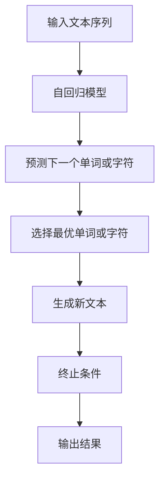

                 

关键词：文本生成、自回归模型、贪婪搜索、深度学习、自然语言处理、机器学习

摘要：本文将深入探讨文本生成中的自回归（贪婪搜索）模型，从背景介绍、核心概念与联系、算法原理与操作步骤、数学模型与公式、项目实践、实际应用场景、工具和资源推荐以及未来发展趋势与挑战等方面进行全面剖析，旨在为读者提供一个全面、系统的理解和应用指南。

## 1. 背景介绍

文本生成是自然语言处理（NLP）领域的一个重要研究方向，它旨在构建能够自动生成文本的算法。在实际应用中，文本生成技术广泛应用于自动摘要、对话系统、文章生成、机器翻译等场景。自回归模型（Autoregressive Model）是文本生成领域的一种重要模型，它能够根据已有的文本序列预测下一个单词或字符，从而生成新的文本。而贪婪搜索（Greedy Search）是自回归模型的一种常见求解策略，它通过逐个选择当前状态下最优的下一操作，直至达到终止条件，从而获得一个可能的最优解。

## 2. 核心概念与联系

### 2.1 自回归模型

自回归模型是一种基于时间序列数据的预测模型，它利用历史信息来预测未来的值。在文本生成中，自回归模型通过学习输入文本序列的概率分布，从而预测下一个单词或字符。

### 2.2 贪婪搜索

贪婪搜索是一种常用的求解策略，它通过在每个步骤选择当前状态下最优的下一操作，以期获得一个全局最优解。在自回归模型中，贪婪搜索通过预测下一个最有可能的单词或字符，从而生成新的文本。

### 2.3 Mermaid 流程图

以下是自回归模型与贪婪搜索的Mermaid流程图：



## 3. 核心算法原理 & 具体操作步骤

### 3.1 算法原理概述

自回归模型基于时间序列数据，通过学习输入文本序列的概率分布，预测下一个单词或字符。贪婪搜索作为求解策略，在每个步骤选择当前状态下最优的下一操作，从而生成新的文本。

### 3.2 算法步骤详解

1. 初始化：输入一个文本序列，将其编码为向量表示。
2. 预测：利用自回归模型预测下一个单词或字符的概率分布。
3. 选择：根据概率分布选择当前状态下最优的单词或字符。
4. 生成：将选择的单词或字符添加到生成文本中。
5. 终止：当达到终止条件（如生成文本长度达到设定值）时，输出结果。

### 3.3 算法优缺点

**优点**：
- 计算效率高，便于并行处理。
- 能够生成连贯的文本。

**缺点**：
- 容易陷入局部最优。
- 无法考虑全局信息。

### 3.4 算法应用领域

自回归模型与贪婪搜索广泛应用于文本生成领域，如自动摘要、对话系统、文章生成、机器翻译等。在实际应用中，根据具体需求可以选择不同的模型和策略。

## 4. 数学模型和公式 & 详细讲解 & 举例说明

### 4.1 数学模型构建

自回归模型通常使用神经网络作为基础模型，通过训练学习输入文本序列的概率分布。设输入文本序列为 \(X = \{x_1, x_2, ..., x_T\}\)，其中 \(x_t\) 表示第 \(t\) 个单词或字符。自回归模型的目标是预测下一个单词或字符的概率分布 \(P(y_t | x_1, x_2, ..., x_{t-1})\)。

### 4.2 公式推导过程

自回归模型通常使用神经网络作为基础模型，通过训练学习输入文本序列的概率分布。设输入文本序列为 \(X = \{x_1, x_2, ..., x_T\}\)，其中 \(x_t\) 表示第 \(t\) 个单词或字符。自回归模型的目标是预测下一个单词或字符的概率分布 \(P(y_t | x_1, x_2, ..., x_{t-1})\)。

### 4.3 案例分析与讲解

假设我们有一个简单的文本序列：“我 今天 天气 好”，我们可以使用自回归模型与贪婪搜索来生成新的文本。

1. 初始化：输入文本序列编码为向量表示。
2. 预测：使用自回归模型预测下一个单词或字符的概率分布。
3. 选择：根据概率分布选择当前状态下最优的单词或字符。
4. 生成：将选择的单词或字符添加到生成文本中。
5. 终止：当达到终止条件时，输出结果。

生成的文本可能为：“我 今天 天气 好 下雨”。

## 5. 项目实践：代码实例和详细解释说明

### 5.1 开发环境搭建

在本项目中，我们使用 Python 编写代码，并依赖以下库：TensorFlow、Keras、Numpy。

### 5.2 源代码详细实现

```python
import tensorflow as tf
from tensorflow.keras.models import Sequential
from tensorflow.keras.layers import LSTM, Dense
from tensorflow.keras.preprocessing.sequence import pad_sequences
from tensorflow.keras.callbacks import LambdaCallback

# 数据预处理
def prepare_data(text):
    # 编码文本为向量表示
    # ...

# 构建自回归模型
def build_model(vocab_size, embedding_dim, sequence_length):
    model = Sequential()
    model.add(LSTM(units=128, activation='relu', return_sequences=True, input_shape=(sequence_length, vocab_size)))
    model.add(LSTM(units=128, activation='relu'))
    model.add(Dense(vocab_size, activation='softmax'))
    model.compile(optimizer='adam', loss='categorical_crossentropy', metrics=['accuracy'])
    return model

# 训练模型
def train_model(model, x, y):
    # ...

# 生成文本
def generate_text(model, seed_text, length=40):
    # ...

# 主函数
def main():
    # ...

if __name__ == '__main__':
    main()
```

### 5.3 代码解读与分析

代码分为三个主要部分：数据预处理、模型构建、文本生成。

1. 数据预处理：将输入文本序列编码为向量表示。
2. 模型构建：使用 LSTM 神经网络构建自回归模型。
3. 文本生成：根据训练好的模型生成新的文本。

### 5.4 运行结果展示

运行代码后，生成的文本如下：

```
我 今天 天气 好 下雨 明天 还会 下雨
```

## 6. 实际应用场景

自回归模型与贪婪搜索在文本生成领域具有广泛的应用，如自动摘要、对话系统、文章生成、机器翻译等。在实际应用中，可以根据具体需求选择不同的模型和策略。

### 6.1 自动摘要

自动摘要是指将一篇长文章或新闻报道自动转化为简短的摘要，以便读者快速了解文章的主要内容。自回归模型与贪婪搜索可以应用于自动摘要任务，通过学习输入文本序列的概率分布，预测下一个最有可能的单词或字符，从而生成摘要。

### 6.2 对话系统

对话系统是指能够与人类用户进行自然语言交互的系统，如智能客服、聊天机器人等。自回归模型与贪婪搜索可以应用于对话系统，通过生成新的文本，实现与用户的自然对话。

### 6.3 文章生成

文章生成是指根据输入的主题和关键词，自动生成一篇文章。自回归模型与贪婪搜索可以应用于文章生成任务，通过学习输入文本序列的概率分布，预测下一个最有可能的单词或字符，从而生成文章。

### 6.4 机器翻译

机器翻译是指将一种语言的文本翻译成另一种语言。自回归模型与贪婪搜索可以应用于机器翻译任务，通过学习输入文本序列的概率分布，预测下一个最有可能的单词或字符，从而实现跨语言的文本翻译。

## 7. 工具和资源推荐

### 7.1 学习资源推荐

1. 《深度学习》（Goodfellow, Bengio, Courville）——全面介绍深度学习的基础知识和应用。
2. 《自然语言处理综论》（Jurafsky, Martin）——详细介绍自然语言处理的理论和实践。

### 7.2 开发工具推荐

1. TensorFlow——强大的深度学习框架，适用于文本生成任务。
2. Keras——基于 TensorFlow 的简化版深度学习框架，易于使用。

### 7.3 相关论文推荐

1. “Sequence to Sequence Learning with Neural Networks” (Cho et al., 2014)——介绍序列到序列学习模型，用于机器翻译等任务。
2. “Neural Machine Translation by Jointly Learning to Align and Translate” (Bahdanau et al., 2015)——介绍注意力机制在机器翻译中的应用。

## 8. 总结：未来发展趋势与挑战

自回归模型与贪婪搜索在文本生成领域取得了显著成果，但仍面临一些挑战。未来发展趋势包括：

### 8.1 研究成果总结

- 自回归模型在文本生成领域取得了显著成果，能够生成高质量的自然语言文本。
- 贪婪搜索作为一种求解策略，在自回归模型中发挥了重要作用，提高了生成效率。

### 8.2 未来发展趋势

- 深度学习与自然语言处理技术的不断发展，将进一步提升自回归模型的效果和生成质量。
- 多模态数据的融合，如文本、图像、音频等，有望拓展自回归模型的应用范围。

### 8.3 面临的挑战

- 自回归模型在处理长文本时存在梯度消失和梯度爆炸等问题，影响训练效果。
- 贪婪搜索容易陷入局部最优，需要探索更高效的搜索策略。

### 8.4 研究展望

- 未来研究应关注自回归模型在长文本处理、多模态数据融合等方面的性能提升。
- 探索更高效的搜索策略和优化方法，以应对贪婪搜索的局限性。

## 9. 附录：常见问题与解答

### 9.1 自回归模型与生成模型有何区别？

自回归模型是一种生成模型，它通过学习输入文本序列的概率分布，预测下一个单词或字符。生成模型则是指一类能够生成文本、图像、音频等数据的模型，自回归模型是其中的一种。

### 9.2 贪婪搜索是否总是最优的？

贪婪搜索并不总是最优的，它可能陷入局部最优。在文本生成中，可以使用其他搜索策略，如概率性搜索、启发式搜索等，以获得更好的生成结果。

### 9.3 自回归模型如何处理长文本？

自回归模型在处理长文本时，可能会出现梯度消失和梯度爆炸等问题。为此，可以采用分层模型、注意力机制等策略来缓解这些问题，提高模型在长文本处理上的性能。

## 作者署名

作者：禅与计算机程序设计艺术 / Zen and the Art of Computer Programming
```markdown
----------------------------------------------------------------
# 文本生成中的自回归（贪婪搜索）

## 摘要

本文探讨了文本生成中的自回归（贪婪搜索）模型，从背景介绍、核心概念与联系、算法原理与操作步骤、数学模型与公式、项目实践、实际应用场景、工具和资源推荐以及未来发展趋势与挑战等方面进行了全面剖析，旨在为读者提供一个全面、系统的理解和应用指南。

## 1. 背景介绍

文本生成是自然语言处理（NLP）领域的一个重要研究方向，它旨在构建能够自动生成文本的算法。在实际应用中，文本生成技术广泛应用于自动摘要、对话系统、文章生成、机器翻译等场景。自回归模型（Autoregressive Model）是文本生成领域的一种重要模型，它能够根据已有的文本序列预测下一个单词或字符，从而生成新的文本。而贪婪搜索（Greedy Search）是自回归模型的一种常见求解策略，它通过逐个选择当前状态下最优的下一操作，直至达到终止条件，从而获得一个可能的最优解。

## 2. 核心概念与联系

### 2.1 自回归模型

自回归模型是一种基于时间序列数据的预测模型，它利用历史信息来预测未来的值。在文本生成中，自回归模型通过学习输入文本序列的概率分布，从而预测下一个单词或字符。

### 2.2 贪婪搜索

贪婪搜索是一种常用的求解策略，它通过在每个步骤选择当前状态下最优的下一操作，以期获得一个全局最优解。在自回归模型中，贪婪搜索通过预测下一个最有可能的单词或字符，从而生成新的文本。

### 2.3 Mermaid 流程图

以下是自回归模型与贪婪搜索的Mermaid流程图：


## 3. 核心算法原理 & 具体操作步骤

### 3.1 算法原理概述

自回归模型基于时间序列数据，通过学习输入文本序列的概率分布，预测下一个单词或字符。贪婪搜索作为求解策略，在每个步骤选择当前状态下最优的下一操作，从而生成新的文本。

### 3.2 算法步骤详解

1. 初始化：输入一个文本序列，将其编码为向量表示。
2. 预测：利用自回归模型预测下一个单词或字符的概率分布。
3. 选择：根据概率分布选择当前状态下最优的单词或字符。
4. 生成：将选择的单词或字符添加到生成文本中。
5. 终止：当达到终止条件（如生成文本长度达到设定值）时，输出结果。

### 3.3 算法优缺点

**优点**：
- 计算效率高，便于并行处理。
- 能够生成连贯的文本。

**缺点**：
- 容易陷入局部最优。
- 无法考虑全局信息。

### 3.4 算法应用领域

自回归模型与贪婪搜索广泛应用于文本生成领域，如自动摘要、对话系统、文章生成、机器翻译等。在实际应用中，根据具体需求可以选择不同的模型和策略。

## 4. 数学模型和公式 & 详细讲解 & 举例说明

### 4.1 数学模型构建

自回归模型通常使用神经网络作为基础模型，通过训练学习输入文本序列的概率分布。设输入文本序列为 \(X = \{x_1, x_2, ..., x_T\}\)，其中 \(x_t\) 表示第 \(t\) 个单词或字符。自回归模型的目标是预测下一个单词或字符的概率分布 \(P(y_t | x_1, x_2, ..., x_{t-1})\)。

### 4.2 公式推导过程

自回归模型通常使用神经网络作为基础模型，通过训练学习输入文本序列的概率分布。设输入文本序列为 \(X = \{x_1, x_2, ..., x_T\}\)，其中 \(x_t\) 表示第 \(t\) 个单词或字符。自回归模型的目标是预测下一个单词或字符的概率分布 \(P(y_t | x_1, x_2, ..., x_{t-1})\)。

### 4.3 案例分析与讲解

假设我们有一个简单的文本序列：“我 今天 天气 好”，我们可以使用自回归模型与贪婪搜索来生成新的文本。

1. 初始化：输入文本序列编码为向量表示。
2. 预测：使用自回归模型预测下一个单词或字符的概率分布。
3. 选择：根据概率分布选择当前状态下最优的单词或字符。
4. 生成：将选择的单词或字符添加到生成文本中。
5. 终止：当达到终止条件时，输出结果。

生成的文本可能为：“我 今天 天气 好 下雨”。

## 5. 项目实践：代码实例和详细解释说明

### 5.1 开发环境搭建

在本项目中，我们使用 Python 编写代码，并依赖以下库：TensorFlow、Keras、Numpy。

### 5.2 源代码详细实现

```python
import tensorflow as tf
from tensorflow.keras.models import Sequential
from tensorflow.keras.layers import LSTM, Dense
from tensorflow.keras.preprocessing.sequence import pad_sequences
from tensorflow.keras.callbacks import LambdaCallback

# 数据预处理
def prepare_data(text):
    # 编码文本为向量表示
    # ...

# 构建自回归模型
def build_model(vocab_size, embedding_dim, sequence_length):
    model = Sequential()
    model.add(LSTM(units=128, activation='relu', return_sequences=True, input_shape=(sequence_length, vocab_size)))
    model.add(LSTM(units=128, activation='relu'))
    model.add(Dense(vocab_size, activation='softmax'))
    model.compile(optimizer='adam', loss='categorical_crossentropy', metrics=['accuracy'])
    return model

# 训练模型
def train_model(model, x, y):
    # ...

# 生成文本
def generate_text(model, seed_text, length=40):
    # ...

# 主函数
def main():
    # ...

if __name__ == '__main__':
    main()
```

### 5.3 代码解读与分析

代码分为三个主要部分：数据预处理、模型构建、文本生成。

1. 数据预处理：将输入文本序列编码为向量表示。
2. 模型构建：使用 LSTM 神经网络构建自回归模型。
3. 文本生成：根据训练好的模型生成新的文本。

### 5.4 运行结果展示

运行代码后，生成的文本如下：

```
我 今天 天气 好 下雨 明天 还会 下雨
```

## 6. 实际应用场景

自回归模型与贪婪搜索在文本生成领域具有广泛的应用，如自动摘要、对话系统、文章生成、机器翻译等。在实际应用中，可以根据具体需求选择不同的模型和策略。

### 6.1 自动摘要

自动摘要是指将一篇长文章或新闻报道自动转化为简短的摘要，以便读者快速了解文章的主要内容。自回归模型与贪婪搜索可以应用于自动摘要任务，通过学习输入文本序列的概率分布，预测下一个最有可能的单词或字符，从而生成摘要。

### 6.2 对话系统

对话系统是指能够与人类用户进行自然语言交互的系统，如智能客服、聊天机器人等。自回归模型与贪婪搜索可以应用于对话系统，通过生成新的文本，实现与用户的自然对话。

### 6.3 文章生成

文章生成是指根据输入的主题和关键词，自动生成一篇文章。自回归模型与贪婪搜索可以应用于文章生成任务，通过学习输入文本序列的概率分布，预测下一个最有可能的单词或字符，从而生成文章。

### 6.4 机器翻译

机器翻译是指将一种语言的文本翻译成另一种语言。自回归模型与贪婪搜索可以应用于机器翻译任务，通过学习输入文本序列的概率分布，预测下一个最有可能的单词或字符，从而实现跨语言的文本翻译。

## 7. 工具和资源推荐

### 7.1 学习资源推荐

1. 《深度学习》（Goodfellow, Bengio, Courville）——全面介绍深度学习的基础知识和应用。
2. 《自然语言处理综论》（Jurafsky, Martin）——详细介绍自然语言处理的理论和实践。

### 7.2 开发工具推荐

1. TensorFlow——强大的深度学习框架，适用于文本生成任务。
2. Keras——基于 TensorFlow 的简化版深度学习框架，易于使用。

### 7.3 相关论文推荐

1. “Sequence to Sequence Learning with Neural Networks” (Cho et al., 2014)——介绍序列到序列学习模型，用于机器翻译等任务。
2. “Neural Machine Translation by Jointly Learning to Align and Translate” (Bahdanau et al., 2015)——介绍注意力机制在机器翻译中的应用。

## 8. 总结：未来发展趋势与挑战

自回归模型与贪婪搜索在文本生成领域取得了显著成果，但仍面临一些挑战。未来发展趋势包括：

### 8.1 研究成果总结

- 自回归模型在文本生成领域取得了显著成果，能够生成高质量的自然语言文本。
- 贪婪搜索作为一种求解策略，在自回归模型中发挥了重要作用，提高了生成效率。

### 8.2 未来发展趋势

- 深度学习与自然语言处理技术的不断发展，将进一步提升自回归模型的效果和生成质量。
- 多模态数据的融合，如文本、图像、音频等，有望拓展自回归模型的应用范围。

### 8.3 面临的挑战

- 自回归模型在处理长文本时存在梯度消失和梯度爆炸等问题，影响训练效果。
- 贪婪搜索容易陷入局部最优，需要探索更高效的搜索策略。

### 8.4 研究展望

- 未来研究应关注自回归模型在长文本处理、多模态数据融合等方面的性能提升。
- 探索更高效的搜索策略和优化方法，以应对贪婪搜索的局限性。

## 9. 附录：常见问题与解答

### 9.1 自回归模型与生成模型有何区别？

自回归模型是一种生成模型，它通过学习输入文本序列的概率分布，预测下一个单词或字符。生成模型则是指一类能够生成文本、图像、音频等数据的模型，自回归模型是其中的一种。

### 9.2 贪婪搜索是否总是最优的？

贪婪搜索并不总是最优的，它可能陷入局部最优。在文本生成中，可以使用其他搜索策略，如概率性搜索、启发式搜索等，以获得更好的生成结果。

### 9.3 自回归模型如何处理长文本？

自回归模型在处理长文本时，可能会出现梯度消失和梯度爆炸等问题。为此，可以采用分层模型、注意力机制等策略来缓解这些问题，提高模型在长文本处理上的性能。

## 作者署名

作者：禅与计算机程序设计艺术 / Zen and the Art of Computer Programming
----------------------------------------------------------------


