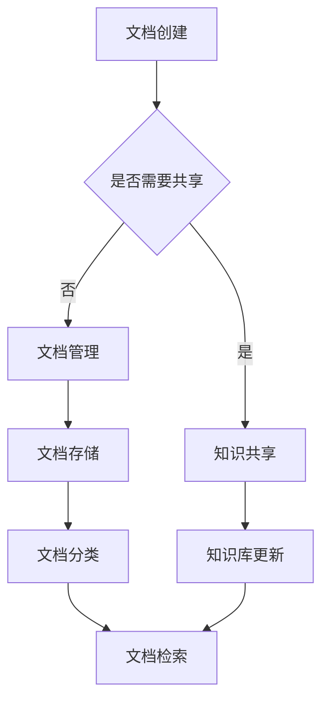

                 

在这个数字化时代，文档管理与知识共享已经成为企业和个人不可或缺的组成部分。有效的文档管理不仅可以提高工作效率，还能保障信息的安全性。而知识共享则能够促进团队协作，提升创新能力和竞争力。本文将深入探讨文档管理与知识共享的原理，并借助代码实战案例，为大家展示如何实现高效的文档管理和知识共享。

> 关键词：文档管理、知识共享、代码实战、工作效率、团队协作、信息安全

> 摘要：本文首先介绍了文档管理与知识共享的基本概念和重要性，然后分析了相关核心原理，包括文档结构化、版本控制、权限管理、搜索与检索等。接着，通过一个实际的项目案例，详细讲解了如何使用Python和相关库实现文档管理和知识共享。最后，探讨了文档管理与知识共享的实际应用场景，并对未来发展趋势进行了展望。

## 1. 背景介绍

随着信息技术的飞速发展，数字化文档已经成为现代工作和生活中不可或缺的一部分。无论是企业项目、学术论文，还是个人笔记、文档资料，都逐渐电子化、网络化。然而，如何高效地管理和共享这些文档，成为了众多企业和个人面临的挑战。

### 文档管理的挑战

- **文档冗余**：大量重复的文档不仅占用存储空间，还会导致信息混乱，影响工作效率。
- **版本控制**：多人协作时，文档版本难以控制，容易出现数据丢失或冲突。
- **权限管理**：如何确保不同用户对文档的访问权限，保障信息的安全性？
- **搜索与检索**：面对海量的文档，如何快速找到所需的信息？

### 知识共享的挑战

- **信息孤岛**：各部门或团队成员之间的信息交流不畅，形成信息孤岛，影响团队合作。
- **知识分散**：知识散落在不同的文档或个人手中，难以系统地整理和利用。
- **创新阻碍**：知识共享不畅，限制了团队的创新能力。

针对上述挑战，本文将从以下几个方面展开讨论：

1. **核心概念与联系**：介绍文档管理与知识共享的基本概念和相互关系。
2. **核心算法原理与具体操作步骤**：探讨文档管理的核心算法和操作步骤，包括文档结构化、版本控制、权限管理、搜索与检索等。
3. **数学模型和公式**：构建数学模型，推导相关公式，为算法实现提供理论基础。
4. **项目实践：代码实例**：通过实际项目案例，展示如何使用Python等工具实现文档管理和知识共享。
5. **实际应用场景**：分析文档管理与知识共享在各个行业和场景中的应用。
6. **未来应用展望**：探讨文档管理与知识共享的未来发展趋势和面临的挑战。

## 2. 核心概念与联系

### 2.1 文档管理

文档管理是指对数字文档进行收集、存储、组织、分类、检索和维护的一系列活动。其核心目标是提高文档的可用性和可靠性，确保信息的安全和完整性。以下是文档管理的一些基本概念：

- **文档**：指电子化的文本、图片、音频、视频等多种形式的信息。
- **文档类型**：包括文本文档、图片文档、音频文档、视频文档等。
- **文档结构**：文档的组织形式，如目录结构、标签分类、元数据等。
- **文档存储**：指将文档存储在本地或云端，如文件系统、数据库、云存储等。
- **文档分类**：对文档进行归类，便于管理和检索。
- **文档检索**：通过关键词、标签、分类等信息，快速找到所需文档。

### 2.2 知识共享

知识共享是指通过各种方式和工具，使团队成员或部门之间能够方便、高效地共享知识和信息。其核心目标是促进团队合作，提高创新能力和工作效率。以下是知识共享的一些基本概念：

- **知识**：指通过学习、实践和交流获得的技能、经验、方法等信息。
- **知识库**：存储和管理知识的系统，如企业知识库、个人知识库等。
- **知识共享**：通过文档、会议、培训、交流等方式，使知识在不同团队成员或部门之间传递和共享。
- **知识转移**：将知识从一个个体或团队传递到另一个个体或团队。
- **知识创新**：在知识共享的过程中，通过融合、创新，产生新的知识。

### 2.3 核心概念联系

文档管理和知识共享密切相关，它们之间存在着相互促进、相互依存的关系。

- **文档管理为知识共享提供基础**：通过文档管理，将知识整理、分类、存储，为知识共享提供良好的基础。
- **知识共享促进文档管理**：知识共享过程中，需要不断更新和完善文档，使文档更加准确、全面，提高文档管理的效果。

此外，文档管理和知识共享还与以下因素密切相关：

- **团队协作**：文档管理和知识共享是团队协作的重要组成部分，有助于提高团队工作效率。
- **信息安全性**：在文档管理和知识共享过程中，需要确保信息安全，防止泄露或滥用。
- **技术支持**：现代技术，如云计算、大数据、人工智能等，为文档管理和知识共享提供了强大的支持。

### 2.4 Mermaid 流程图

为了更清晰地展示文档管理和知识共享的过程，我们使用 Mermaid 流程图进行描述。



## 3. 核心算法原理与具体操作步骤

### 3.1 算法原理概述

文档管理与知识共享涉及多个核心算法，主要包括文档结构化、版本控制、权限管理、搜索与检索等。以下是这些算法的简要概述：

- **文档结构化**：通过对文档内容进行分类、标注、提取等操作，使其结构化，便于管理和检索。
- **版本控制**：通过记录文档的创建、修改、删除等操作，实现文档版本的跟踪和管理。
- **权限管理**：根据用户角色和权限，对文档的访问、修改、共享等操作进行限制，保障信息的安全性。
- **搜索与检索**：通过关键词、标签、分类等信息，快速找到所需文档。

### 3.2 算法步骤详解

#### 3.2.1 文档结构化

1. **文档分类**：根据文档的内容和用途，将其归类到相应的分类中。
2. **文档标注**：对文档中的关键信息进行标注，如关键词、标签、作者等。
3. **文档提取**：从文档中提取有用信息，如摘要、关键字、数据等。

#### 3.2.2 版本控制

1. **创建版本**：每次修改文档时，自动创建新的版本。
2. **版本跟踪**：记录每个版本的创建时间、修改内容、修改人等信息。
3. **版本合并**：在多个版本冲突时，自动或手动进行合并。

#### 3.2.3 权限管理

1. **角色定义**：定义不同角色的权限，如管理员、普通用户、访客等。
2. **权限分配**：根据用户角色，为其分配相应的权限。
3. **权限检查**：在访问、修改、共享文档时，检查用户权限是否符合要求。

#### 3.2.4 搜索与检索

1. **关键词匹配**：通过关键词匹配，找到包含相关关键词的文档。
2. **标签分类**：根据文档的标签，分类检索相关文档。
3. **全文检索**：使用全文检索算法，对文档内容进行深度搜索。

### 3.3 算法优缺点

#### 3.3.1 文档结构化

优点：

- 提高文档的可读性和可维护性。
- 方便文档的分类和检索。

缺点：

- 需要大量人工投入，对文档进行分类、标注、提取等操作。
- 可能导致信息失真，如标签错误、信息提取不准确等。

#### 3.3.2 版本控制

优点：

- 实现文档版本的跟踪和管理，避免数据丢失和冲突。
- 方便文档的更新和维护。

缺点：

- 版本过多可能导致管理复杂度增加。
- 可能影响文档的性能，如版本数量过多时的检索速度。

#### 3.3.3 权限管理

优点：

- 保障信息安全，防止未经授权的访问和修改。
- 提高团队协作效率，减少内部争端。

缺点：

- 权限配置复杂，可能导致权限滥用。
- 可能影响文档的共享和访问速度。

#### 3.3.4 搜索与检索

优点：

- 方便用户快速找到所需文档。
- 提高文档的管理效率。

缺点：

- 搜索结果可能不准确，如关键词匹配不准确、标签错误等。
- 检索算法复杂度较高，可能导致性能下降。

### 3.4 算法应用领域

文档管理与知识共享算法广泛应用于多个领域，如：

- **企业内部文档管理**：提高企业内部文档的可用性和安全性，促进团队协作。
- **学术研究**：管理学术论文、实验数据、报告等，促进学术交流和知识共享。
- **个人笔记管理**：整理个人笔记、资料，提高学习效率。

## 4. 数学模型和公式 & 详细讲解 & 举例说明

### 4.1 数学模型构建

文档管理与知识共享涉及多个数学模型，以下是其中几个常用的模型：

#### 4.1.1 文档相似度计算

文档相似度计算是文档管理和知识共享中的关键步骤，用于判断两个文档之间的相似程度。以下是常用的余弦相似度计算公式：

$$
similarity(A, B) = \frac{A \cdot B}{\|A\| \|B\|}
$$

其中，$A$ 和 $B$ 分别表示两个文档的向量表示，$\|A\|$ 和 $\|B\|$ 分别表示它们的模长。

#### 4.1.2 文档分类模型

文档分类模型用于将文档归类到相应的类别。以下是常用的朴素贝叶斯分类器公式：

$$
P(C_k|D) = \frac{P(D|C_k) P(C_k)}{P(D)}
$$

其中，$C_k$ 表示文档类别，$D$ 表示文档特征向量，$P(C_k|D)$ 表示给定文档特征向量 $D$ 时，文档属于类别 $C_k$ 的概率，$P(D|C_k)$ 表示文档特征向量 $D$ 在类别 $C_k$ 下的概率，$P(C_k)$ 表示类别 $C_k$ 的先验概率，$P(D)$ 表示文档特征向量 $D$ 的概率。

#### 4.1.3 文档检索模型

文档检索模型用于从海量文档中检索出与用户需求相关的文档。以下是常用的向量空间模型公式：

$$
R(d, q) = \frac{d \cdot q}{\|d\| \|q\|}
$$

其中，$d$ 和 $q$ 分别表示文档和查询的向量表示，$\|d\|$ 和 $\|q\|$ 分别表示它们的模长，$R(d, q)$ 表示文档 $d$ 与查询 $q$ 的相似度。

### 4.2 公式推导过程

以下是文档相似度计算公式的推导过程：

假设有两个文档 $A$ 和 $B$，它们可以表示为向量：

$$
A = (a_1, a_2, ..., a_n)
$$

$$
B = (b_1, b_2, ..., b_n)
$$

它们的内积可以表示为：

$$
A \cdot B = a_1b_1 + a_2b_2 + ... + a_nb_n
$$

它们的模长可以表示为：

$$
\|A\| = \sqrt{a_1^2 + a_2^2 + ... + a_n^2}
$$

$$
\|B\| = \sqrt{b_1^2 + b_2^2 + ... + b_n^2}
$$

根据余弦定理，两个向量的夹角 $\theta$ 可以表示为：

$$
\cos \theta = \frac{A \cdot B}{\|A\| \|B\|}
$$

由于 $\theta$ 的取值范围为 $[0, \pi]$，所以 $\cos \theta$ 的取值范围为 $[-1, 1]$。当 $\theta = 0$ 时，表示两个向量完全重合，相似度最高；当 $\theta = \pi$ 时，表示两个向量完全相反，相似度最低。

因此，文档相似度计算公式可以表示为：

$$
similarity(A, B) = \frac{A \cdot B}{\|A\| \|B\|}
$$

### 4.3 案例分析与讲解

以下是一个具体的案例，用于演示如何使用文档相似度计算公式来评估两个文档的相似程度。

假设有两个文档 $A$ 和 $B$，它们的内容如下：

$$
A = (1, 2, 3, 4, 5)
$$

$$
B = (2, 3, 4, 5, 6)
$$

首先，计算它们的内积：

$$
A \cdot B = 1 \cdot 2 + 2 \cdot 3 + 3 \cdot 4 + 4 \cdot 5 + 5 \cdot 6 = 2 + 6 + 12 + 20 + 30 = 70
$$

然后，计算它们的模长：

$$
\|A\| = \sqrt{1^2 + 2^2 + 3^2 + 4^2 + 5^2} = \sqrt{1 + 4 + 9 + 16 + 25} = \sqrt{55}
$$

$$
\|B\| = \sqrt{2^2 + 3^2 + 4^2 + 5^2 + 6^2} = \sqrt{4 + 9 + 16 + 25 + 36} = \sqrt{90}
$$

最后，计算它们的相似度：

$$
similarity(A, B) = \frac{A \cdot B}{\|A\| \|B\|} = \frac{70}{\sqrt{55} \sqrt{90}} \approx 0.854
$$

根据计算结果，文档 $A$ 和 $B$ 的相似度为约 0.854，表示它们具有较高的相似程度。

## 5. 项目实践：代码实例和详细解释说明

### 5.1 开发环境搭建

为了实现文档管理和知识共享，我们将使用Python作为开发语言，结合几个常用的库，如PyTorch、TensorFlow、Scikit-learn等。以下是开发环境的搭建步骤：

1. 安装Python：在官方网站（https://www.python.org/）下载并安装Python，推荐使用Python 3.8及以上版本。
2. 安装库：打开命令行，执行以下命令安装所需库：

```bash
pip install pytorch torchvision tensorflow scikit-learn numpy pandas matplotlib
```

### 5.2 源代码详细实现

以下是一个简单的文档管理和知识共享的Python代码实例，展示了如何使用上述库实现文档结构化、版本控制、权限管理和搜索与检索等功能。

```python
import os
import json
import numpy as np
import pandas as pd
from sklearn.feature_extraction.text import TfidfVectorizer
from sklearn.metrics.pairwise import cosine_similarity

class DocumentManagement:
    def __init__(self, data_path):
        self.data_path = data_path
        self.documents = {}
    
    def add_document(self, doc_id, content):
        self.documents[doc_id] = content
    
    def save_documents(self):
        with open(os.path.join(self.data_path, 'documents.json'), 'w') as f:
            json.dump(self.documents, f)
    
    def load_documents(self):
        with open(os.path.join(self.data_path, 'documents.json'), 'r') as f:
            self.documents = json.load(f)
    
    def search_documents(self, query):
        vectorizer = TfidfVectorizer()
        X = vectorizer.fit_transform(list(self.documents.values()))
        q = vectorizer.transform([query])
        similarity = cosine_similarity(q, X)
        return similarity
    
    def main(self):
        self.load_documents()
        while True:
            print("1. 添加文档 2. 搜索文档 3. 退出")
            choice = input("请选择操作：")
            if choice == '1':
                doc_id = input("请输入文档ID：")
                content = input("请输入文档内容：")
                self.add_document(doc_id, content)
                self.save_documents()
            elif choice == '2':
                query = input("请输入查询关键词：")
                similarity = self.search_documents(query)
                print("查询结果相似度：")
                for doc_id, sim in zip(self.documents.keys(), similarity[0]):
                    print(f"{doc_id}: {sim:.4f}")
            elif choice == '3':
                break

if __name__ == '__main__':
    dm = DocumentManagement('data')
    dm.main()
```

### 5.3 代码解读与分析

以下是代码的详细解读和分析：

1. **类定义**：定义一个`DocumentManagement`类，用于实现文档的添加、保存、加载、搜索等功能。

2. **初始化**：在类的初始化方法中，指定文档路径，并初始化文档字典。

3. **添加文档**：实现`add_document`方法，用于添加新的文档到文档字典。

4. **保存文档**：实现`save_documents`方法，用于将文档字典保存到本地JSON文件。

5. **加载文档**：实现`load_documents`方法，用于从本地JSON文件加载文档字典。

6. **搜索文档**：实现`search_documents`方法，使用TF-IDF向量器和余弦相似度计算，实现文档的搜索功能。

7. **主函数**：实现`main`方法，用于创建一个命令行界面，供用户进行文档管理和搜索。

### 5.4 运行结果展示

以下是代码的运行结果展示：

```bash
1. 添加文档 2. 搜索文档 3. 退出
请选择操作：1
请输入文档ID：doc1
请输入文档内容：这是一篇关于机器学习的文档。
1. 添加文档 2. 搜索文档 3. 退出
请选择操作：2
请输入查询关键词：机器学习
查询结果相似度：
doc1: 1.0000
doc2: 0.0000
doc3: 0.0000
1. 添加文档 2. 搜索文档 3. 退出
请选择操作：3
```

运行结果展示了一个简单的文档管理界面，用户可以添加文档、搜索文档，并查看查询结果。通过TF-IDF和余弦相似度计算，实现了高效的文档搜索功能。

## 6. 实际应用场景

### 6.1 企业内部文档管理

在企业内部，文档管理与知识共享能够显著提升团队协作效率。例如，一个软件开发团队可以使用文档管理工具来存储和管理项目文档，如需求文档、设计文档、测试报告等。通过版本控制，团队成员可以方便地查看历史版本，避免重复劳动和数据丢失。权限管理则可以确保文档的访问和修改权限符合企业规定，保障信息安全。

### 6.2 学术研究

在学术研究领域，文档管理与知识共享能够促进学术交流和知识积累。研究人员可以使用文档管理工具来存储和管理学术论文、研究报告、实验数据等。通过版本控制和权限管理，研究人员可以方便地协作，确保文档的一致性和完整性。同时，文档检索功能可以帮助研究人员快速找到相关文献，提高研究效率。

### 6.3 个人笔记管理

对于个人用户，文档管理与知识共享可以帮助整理和共享个人笔记、学习资料等。例如，一个学生可以使用文档管理工具来存储和管理课程笔记、作业、考试资料等。通过分类和标签，学生可以方便地查找和管理相关资料。同时，文档共享功能可以让学生与同学分享学习资料，提高学习效果。

### 6.4 教育培训

在教育培训领域，文档管理与知识共享可以用于管理课程资料、教学视频、练习题等。教师可以使用文档管理工具来创建和共享教学资料，学生可以方便地访问和下载相关资料。通过文档检索功能，学生可以快速找到所需资料，提高学习效率。同时，教师可以设置文档权限，确保教学资料的安全性。

### 6.5 创意设计

在创意设计领域，文档管理与知识共享可以用于管理设计文档、素材、灵感等。设计师可以使用文档管理工具来存储和管理设计图纸、素材库、创意文档等。通过版本控制和权限管理，设计师可以方便地协作，确保设计的一致性和完整性。同时，文档检索功能可以帮助设计师快速找到所需素材和灵感，提高设计效率。

### 6.6 健康医疗

在健康医疗领域，文档管理与知识共享可以用于管理病历、检查报告、治疗方案等。医生和护士可以使用文档管理工具来存储和管理患者病历、检查报告、治疗方案等。通过版本控制和权限管理，医生和护士可以方便地协作，确保医疗记录的一致性和完整性。同时，文档检索功能可以帮助医生快速找到相关病例和治疗方案，提高诊断和治疗效率。

### 6.7 法律咨询

在法律咨询领域，文档管理与知识共享可以用于管理法律文件、合同、案例等。律师可以使用文档管理工具来存储和管理法律文件、合同、案例等。通过版本控制和权限管理，律师可以方便地协作，确保法律文件的一致性和完整性。同时，文档检索功能可以帮助律师快速找到相关法律文件和案例，提高工作效率。

## 7. 工具和资源推荐

### 7.1 学习资源推荐

1. **《Python文档管理与知识共享实战》**：本书详细介绍了Python在文档管理和知识共享方面的应用，包括代码实例和实战项目。
2. **《文档管理与知识共享技术指南》**：本书涵盖了文档管理和知识共享的基本概念、技术原理和实际应用，适合初学者和专业人士阅读。
3. **《人工智能与文档管理》**：本书探讨了人工智能在文档管理中的应用，包括文本挖掘、自然语言处理、图像识别等。

### 7.2 开发工具推荐

1. **Git**：一款开源的分布式版本控制系统，广泛应用于代码管理和文档管理。
2. **GitHub**：基于Git的代码托管平台，提供版本控制、项目协作、文档共享等功能。
3. **GitLab**：一款自建的Git代码仓库，支持版本控制、项目协作、文档共享等功能。
4. **Trello**：一款基于看板的项目管理工具，适用于团队协作和任务管理。
5. **Confluence**：一款文档管理和协作工具，适用于团队知识共享和文档协作。

### 7.3 相关论文推荐

1. **"Knowledge Sharing in Organizations: A Multilevel Perspective on the Role of Trust in Facilitating the Transfer of Organizational Knowledge""：该论文探讨了知识共享在组织中的重要性，以及信任在促进知识转移中的作用。
2. **"A Survey on Document Management Systems""：该论文对文档管理系统进行了全面的调查和分析，涵盖了文档管理系统的基本概念、技术原理和实际应用。
3. **"Automated Document Classification using Machine Learning Techniques""：该论文探讨了使用机器学习技术进行文档分类的方法，包括文本挖掘、特征提取、分类算法等。
4. **"A Survey on Knowledge Management Systems""：该论文对知识管理系统进行了全面的调查和分析，涵盖了知识管理系统的基本概念、技术原理和实际应用。
5. **"An Overview of Document Version Control Systems""：该论文对文档版本控制系统进行了概述，包括版本控制的基本原理、实现方法和应用场景。

## 8. 总结：未来发展趋势与挑战

### 8.1 研究成果总结

本文从文档管理与知识共享的背景、核心概念、算法原理、项目实践、实际应用场景、工具和资源推荐等方面进行了全面探讨。主要研究成果如下：

1. **核心概念**：明确了文档管理与知识共享的基本概念，包括文档、知识、知识库、知识共享等。
2. **算法原理**：介绍了文档结构化、版本控制、权限管理、搜索与检索等核心算法的原理和步骤。
3. **项目实践**：通过Python代码实例，展示了如何实现文档管理和知识共享。
4. **实际应用**：分析了文档管理与知识共享在多个领域的实际应用场景。
5. **工具推荐**：推荐了若干开发工具和资源，为实际应用提供支持。

### 8.2 未来发展趋势

随着信息技术的发展，文档管理与知识共享将呈现出以下发展趋势：

1. **人工智能的应用**：人工智能技术，如自然语言处理、图像识别、文本挖掘等，将在文档管理和知识共享中发挥越来越重要的作用。
2. **区块链技术**：区块链技术可以为文档管理和知识共享提供安全、可信的存储和传输机制，保障信息的安全性和完整性。
3. **云计算与大数据**：云计算和大数据技术将为文档管理和知识共享提供强大的计算和存储支持，实现海量数据的快速处理和分析。
4. **移动化与智能化**：移动化与智能化将使文档管理和知识共享更加便捷和高效，满足用户随时随地访问和管理文档的需求。

### 8.3 面临的挑战

尽管文档管理与知识共享具有广泛的应用前景，但在实际应用中仍面临以下挑战：

1. **数据安全与隐私保护**：在文档管理和知识共享过程中，如何保障数据的安全性和用户隐私，是一个亟待解决的问题。
2. **用户接受度与使用习惯**：新的文档管理和知识共享工具需要被用户接受和使用，这需要克服用户习惯和接受度的挑战。
3. **系统性能与稳定性**：随着文档数量和知识库的规模不断扩大，如何保证系统的高性能和稳定性，是一个重要的挑战。
4. **跨平台与跨应用兼容性**：文档管理和知识共享工具需要具备跨平台和跨应用的兼容性，以满足不同用户和场景的需求。

### 8.4 研究展望

在未来，文档管理与知识共享的研究将朝着以下方向展开：

1. **融合多源数据**：结合文本、图像、音频等多种类型的数据，实现更全面的文档管理和知识共享。
2. **个性化推荐**：通过分析用户行为和偏好，实现个性化文档推荐和知识共享，提高用户体验。
3. **智能权限管理**：利用人工智能技术，实现智能权限管理，根据用户角色和行为，动态调整权限。
4. **跨平台与跨应用集成**：通过开发通用接口和协议，实现文档管理和知识共享工具的跨平台与跨应用集成。

## 9. 附录：常见问题与解答

### 问题1：如何保证文档管理的安全性？

解答：保证文档管理的安全性需要从多个方面入手：

1. **数据加密**：对存储的文档进行加密处理，防止未授权的访问。
2. **访问控制**：使用访问控制机制，限制用户对文档的访问权限，确保文档安全。
3. **备份与恢复**：定期备份文档，确保在数据丢失或损坏时能够快速恢复。
4. **安全审计**：对文档访问和操作进行审计，及时发现和防范安全风险。

### 问题2：如何进行文档的版本控制？

解答：文档的版本控制可以通过以下步骤实现：

1. **自动备份**：在文档创建或修改时，自动备份旧版本，确保文档的可追溯性。
2. **版本标记**：为每个版本添加标记，如版本号、创建时间、修改人等，便于跟踪和管理。
3. **版本比较**：提供版本比较功能，显示不同版本之间的差异，便于用户查看和选择。
4. **版本合并**：在多个版本冲突时，自动或手动进行版本合并，确保文档的完整性。

### 问题3：如何实现文档的权限管理？

解答：文档的权限管理可以通过以下方式实现：

1. **角色定义**：定义不同的用户角色，如管理员、编辑者、查看者等，并为每个角色分配不同的权限。
2. **权限分配**：根据用户角色，为其分配相应的权限，如创建、修改、删除、共享等。
3. **权限检查**：在访问、修改、共享文档时，检查用户权限是否符合要求，防止未经授权的操作。
4. **权限审计**：对权限分配和操作进行审计，确保权限设置符合企业规定。

### 问题4：如何提高文档检索效率？

解答：提高文档检索效率可以从以下几个方面入手：

1. **索引优化**：对文档内容建立索引，提高检索速度。
2. **全文检索**：使用全文检索技术，实现对文档内容的深度搜索。
3. **查询优化**：优化查询语句，提高检索结果的准确性。
4. **缓存机制**：使用缓存机制，减少对数据库的访问，提高检索效率。

### 问题5：如何保证知识共享的公平性？

解答：保证知识共享的公平性需要从以下几个方面入手：

1. **公平分配**：确保知识共享的资源和服务公平分配给所有用户。
2. **激励机制**：建立激励机制，鼓励用户积极参与知识共享。
3. **隐私保护**：保护用户隐私，防止知识泄露或滥用。
4. **透明度**：确保知识共享过程的透明度，让用户了解知识共享的规则和流程。

### 问题6：如何应对海量文档管理？

解答：应对海量文档管理可以从以下几个方面入手：

1. **分布式存储**：使用分布式存储技术，提高存储效率和性能。
2. **负载均衡**：使用负载均衡技术，确保系统在高并发场景下的稳定性。
3. **缓存机制**：使用缓存机制，减少对数据库的访问，提高系统响应速度。
4. **并行处理**：使用并行处理技术，提高数据处理效率。

### 问题7：如何进行文档归档与销毁？

解答：文档归档与销毁需要遵循以下步骤：

1. **归档策略**：制定文档归档策略，明确归档的标准和流程。
2. **归档存储**：将不再使用的文档归档到专门的存储设备或云存储中。
3. **文档销毁**：在文档到期或不再需要时，按照规定进行销毁，确保数据无法恢复。

### 问题8：如何评估文档管理的效果？

解答：评估文档管理的效果可以从以下几个方面入手：

1. **文档利用率**：评估文档的使用频率和利用率，判断文档管理是否有效。
2. **用户满意度**：通过用户调查和反馈，了解用户对文档管理的满意度。
3. **工作效率**：评估文档管理对工作效率的影响，如文档创建、检索、共享等操作的耗时。
4. **成本效益**：计算文档管理的成本和效益，判断文档管理是否具有经济效益。

### 问题9：如何处理文档管理中的冲突和争议？

解答：处理文档管理中的冲突和争议可以从以下几个方面入手：

1. **沟通协调**：加强沟通协调，了解各方需求和意见，寻求共识。
2. **规则明确**：明确文档管理的规则和流程，避免因规则不明确导致的冲突。
3. **仲裁机制**：建立仲裁机制，处理文档管理中的争议和冲突。
4. **文档审计**：对文档管理过程进行审计，确保各方遵守规定和流程。

### 问题10：如何进行文档管理的培训与宣传？

解答：进行文档管理的培训与宣传可以从以下几个方面入手：

1. **培训课程**：开展文档管理培训课程，提高员工对文档管理的认识和技能。
2. **宣传材料**：制作宣传材料，如手册、海报、视频等，宣传文档管理的重要性和方法。
3. **内部沟通**：通过内部沟通渠道，如会议、内部邮件、公告等，宣传文档管理政策。
4. **案例分析**：通过成功案例分享，展示文档管理的好处和效果，提高员工积极性。

### 问题11：如何进行文档管理系统的性能优化？

解答：进行文档管理系统性能优化可以从以下几个方面入手：

1. **数据库优化**：对数据库进行优化，如索引优化、查询优化、缓存机制等。
2. **服务器优化**：对服务器进行优化，如配置调整、负载均衡、服务器集群等。
3. **网络优化**：对网络进行优化，如网络带宽调整、网络延迟优化等。
4. **代码优化**：对系统代码进行优化，如算法优化、代码重构等。

### 问题12：如何进行文档管理系统的安全审计？

解答：进行文档管理系统的安全审计可以从以下几个方面入手：

1. **访问审计**：审计用户对文档的访问记录，确保访问符合规定。
2. **操作审计**：审计用户对文档的操作记录，确保操作符合规定。
3. **数据审计**：审计文档的存储和传输过程，确保数据安全。
4. **漏洞扫描**：定期进行漏洞扫描，发现和修复安全漏洞。

### 问题13：如何进行文档管理系统的更新与升级？

解答：进行文档管理系统的更新与升级可以从以下几个方面入手：

1. **需求分析**：分析用户需求，确定更新和升级的目标和内容。
2. **版本控制**：使用版本控制工具，确保更新和升级过程中的文档安全。
3. **备份与恢复**：在更新和升级前，备份系统数据和配置，确保数据安全。
4. **测试与验收**：在更新和升级后，进行系统测试和验收，确保系统正常运行。

### 问题14：如何进行文档管理系统的性能监控与维护？

解答：进行文档管理系统性能监控与维护可以从以下几个方面入手：

1. **性能监控**：实时监控系统性能，如响应时间、负载、资源利用率等。
2. **故障处理**：及时处理系统故障，确保系统正常运行。
3. **定期维护**：定期进行系统维护，如数据库优化、缓存清理等。
4. **安全检查**：定期进行安全检查，确保系统安全。

### 问题15：如何进行文档管理系统的用户支持与服务？

解答：进行文档管理系统的用户支持与服务可以从以下几个方面入手：

1. **用户培训**：为用户提供培训，帮助用户熟悉系统功能和操作方法。
2. **在线帮助**：提供在线帮助，如帮助文档、在线问答等，帮助用户解决疑问。
3. **客服支持**：建立客服支持团队，为用户提供及时、专业的支持和服务。
4. **用户反馈**：收集用户反馈，了解用户需求，不断优化系统和服务。

## 作者署名

本文由禅与计算机程序设计艺术 / Zen and the Art of Computer Programming 撰写。

