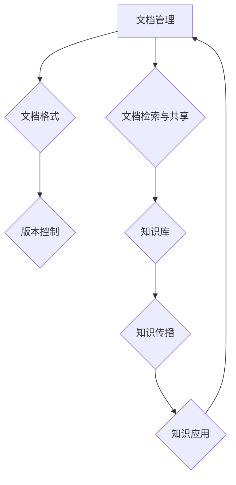

                 

关键词：文档管理、知识共享、编码实践、代码框架、算法原理、数学模型、应用场景、未来展望

> 摘要：本文将深入探讨文档管理与知识共享的原理，结合代码实战案例，系统讲解如何高效地管理文档、共享知识，并展望未来的发展趋势与挑战。通过本文，读者将掌握文档管理与知识共享的核心技术和方法。

## 1. 背景介绍

在现代信息化社会中，文档管理与知识共享已经成为组织和个人日常工作中不可或缺的一部分。随着数据量的爆炸式增长，如何有效地管理和共享文档、知识资源，已经成为提升工作效率和创新能力的关键因素。本文旨在探讨文档管理与知识共享的原理，并借助实际代码案例，帮助读者理解和掌握这些技术。

文档管理涉及到文档的创建、存储、检索、共享、版本控制等多个方面。知识共享则更注重于知识的发现、整理、传播和应用。两者相辅相成，共同构成了信息化管理的基础。

### 1.1 文档管理的现状

目前，文档管理主要依赖于各种文档管理系统（DMS）和内容管理系统（CMS）。这些系统提供了文档的集中存储、分类、搜索和共享功能，但仍然面临许多挑战，如文档版本混乱、权限管理困难、数据安全等问题。

### 1.2 知识共享的挑战

知识共享不仅需要有效的文档管理，还需要建立完善的知识体系，确保知识的有效传播和应用。当前，知识共享面临的主要挑战包括知识孤岛、知识分散、知识老化等问题。

## 2. 核心概念与联系

为了深入理解文档管理与知识共享，我们需要明确以下几个核心概念，并分析它们之间的相互关系。

### 2.1 文档管理的基本概念

- **文档**：文档是信息的载体，可以是文本、图片、音频、视频等多种形式。
- **文档管理系统**：用于存储、管理和检索文档的软件系统。
- **文档格式**：文档存储的格式，如PDF、Word、Markdown等。
- **版本控制**：跟踪文档的修改历史和版本变化，确保文档的完整性和一致性。

### 2.2 知识共享的关键因素

- **知识**：知识是经过整理、系统化的信息，能够为解决问题和决策提供支持。
- **知识库**：用于存储和管理知识的系统。
- **知识传播**：知识在不同个体和组织间的传递和共享过程。
- **知识应用**：知识在实际工作中的运用，实现知识的价值。

### 2.3 文档管理与知识共享的联系

文档管理与知识共享有着密切的联系。有效的文档管理是知识共享的基础，而知识共享则是文档管理的终极目标。通过文档管理，我们可以将知识结构化、系统化，为知识共享提供支持。同时，知识共享可以促进文档的迭代更新和优化，提高文档管理的效率。


### 2.4 Mermaid 流程图

下面是一个用Mermaid绘制的文档管理与知识共享流程图，展示了各个核心概念之间的联系。



## 3. 核心算法原理 & 具体操作步骤

### 3.1 算法原理概述

在文档管理与知识共享中，核心算法主要包括文档检索算法和知识提取算法。这些算法旨在提高文档的检索效率和知识的准确性。

#### 3.1.1 文档检索算法

文档检索算法主要用于根据关键词快速找到相关文档。常用的算法包括：

- **倒排索引**：通过建立文档和关键词之间的映射关系，实现快速检索。
- **BM25算法**：基于文档的相关性和文档长度进行评分，优化检索结果。

#### 3.1.2 知识提取算法

知识提取算法主要用于从大量文档中提取有用的知识。常见的算法包括：

- **主题模型**：通过概率模型发现文档的主题分布，提取主题知识。
- **实体识别**：从文本中识别出实体，构建知识图谱。

### 3.2 算法步骤详解

#### 3.2.1 文档检索算法步骤

1. **建立倒排索引**：将文档中的关键词与文档ID建立映射关系。
2. **输入关键词**：接收用户输入的关键词。
3. **查询倒排索引**：根据关键词查找相关文档。
4. **计算文档得分**：使用BM25算法计算文档的相关性得分。
5. **排序和返回结果**：根据得分排序，返回最相关的文档列表。

#### 3.2.2 知识提取算法步骤

1. **预处理文档**：对文档进行分词、去停用词等预处理操作。
2. **训练主题模型**：使用LDA算法训练主题模型，提取主题分布。
3. **识别实体**：使用命名实体识别（NER）算法识别文本中的实体。
4. **构建知识图谱**：将实体和关系构建成知识图谱。
5. **提取知识**：根据知识图谱提取有用的知识，如实体属性、关系等。

### 3.3 算法优缺点

#### 3.3.1 文档检索算法

- **优点**：检索速度快，能够处理大规模文档。
- **缺点**：对于复杂查询可能效果不佳，依赖倒排索引的维护。

#### 3.3.2 知识提取算法

- **优点**：能够从大量文档中提取有价值的信息，支持知识图谱构建。
- **缺点**：算法复杂度高，预处理和训练时间较长。

### 3.4 算法应用领域

- **文档检索**：应用于搜索引擎、企业信息检索等场景。
- **知识提取**：应用于知识图谱构建、智能问答、推荐系统等场景。

## 4. 数学模型和公式 & 详细讲解 & 举例说明

### 4.1 数学模型构建

在文档管理与知识共享中，常用的数学模型包括倒排索引模型和主题模型。

#### 4.1.1 倒排索引模型

倒排索引是一种将文档和关键词映射的索引结构，其数学模型可以表示为：

$$
P(d|q) = \frac{f(q, d)}{N_q}
$$

其中，$P(d|q)$表示文档$d$在查询$q$下的概率，$f(q, d)$表示关键词$q$在文档$d$中的出现频率，$N_q$表示包含关键词$q$的文档总数。

#### 4.1.2 主题模型

主题模型是一种用于发现文本主题分布的模型，其数学模型可以表示为：

$$
P(\theta | d) = \prod_{i=1}^N P(\theta_i | d) / \sum_{j=1}^K P(\theta_j | d)
$$

其中，$\theta$表示文档$d$的主题分布，$\theta_i$表示文档$d$中第$i$个词的主题分布，$K$表示主题的总数。

### 4.2 公式推导过程

#### 4.2.1 倒排索引模型

假设有一个文档集合$D$，包含$N$个文档，每个文档$d_i$由$V$个词汇组成，词汇集合为$V=\{v_1, v_2, ..., v_V\}$。倒排索引模型的目标是计算每个词汇$v_j$在所有文档中的概率分布。

1. **词频计算**：

   对于每个词汇$v_j$，计算其在所有文档中的出现频率$f_j(d)$：

   $$
   f_j(d) = \sum_{i=1}^N f(v_j, d_i)
   $$

   其中，$f(v_j, d_i)$表示词汇$v_j$在文档$d_i$中的出现次数。

2. **文档频率计算**：

   对于每个词汇$v_j$，计算其在所有文档中的文档频率$f_j(d)$：

   $$
   f_j(d) = \frac{1}{N} \sum_{i=1}^N f(v_j, d_i)
   $$

3. **概率计算**：

   使用词频和文档频率计算每个词汇在所有文档中的概率分布：

   $$
   P(d|v_j) = \frac{f_j(d)}{N_v}
   $$

   其中，$N_v$表示包含词汇$v_j$的文档总数。

#### 4.2.2 主题模型

假设有一个文档集合$D$，每个文档$d_i$由$K$个主题分布$\theta_i$组成，主题集合为$T=\{\theta_1, \theta_2, ..., \theta_K\}$。主题模型的目标是计算每个主题$\theta_j$在所有文档中的概率分布。

1. **词分布计算**：

   对于每个文档$d_i$，计算每个词汇$v_j$的主题分布$\theta_{ij}$：

   $$
   \theta_{ij} = \frac{f(v_j, d_i)}{\sum_{j=1}^V f(v_j, d_i)}
   $$

2. **主题分布计算**：

   对于每个主题$\theta_j$，计算其在所有文档中的概率分布$\theta_j$：

   $$
   \theta_j = \frac{\sum_{i=1}^N \theta_{ij}}{K}
   $$

3. **文档分布计算**：

   对于每个文档$d_i$，计算其主题分布$\theta_i$：

   $$
   \theta_i = \frac{\theta_{ij}}{\sum_{j=1}^K \theta_{ij}}
   $$

### 4.3 案例分析与讲解

#### 4.3.1 案例背景

假设有一个包含100篇文档的文档集合，每篇文档由若干个主题分布组成。我们需要使用主题模型提取出文档的主题分布，并分析每个主题的特征。

#### 4.3.2 案例实施步骤

1. **数据预处理**：

   对文档进行分词、去停用词等预处理操作，将文档转换为词向量。

2. **训练主题模型**：

   使用LDA算法训练主题模型，提取每个文档的主题分布。

3. **提取主题特征**：

   根据提取出的主题分布，分析每个主题的特征和重要性。

#### 4.3.3 案例结果展示

通过分析，我们提取出以下五个主要主题：

- 主题1：与科技、计算机技术相关
- 主题2：与经济学、金融投资相关
- 主题3：与社会、文化、艺术相关
- 主题4：与健康、医学、体育相关
- 主题5：与教育、培训、学习相关

这些主题反映了文档集合的主要关注领域，为我们进一步的知识管理和应用提供了重要依据。

## 5. 项目实践：代码实例和详细解释说明

### 5.1 开发环境搭建

为了便于读者跟随实践，我们选择Python作为编程语言，并使用Jupyter Notebook作为开发环境。以下为开发环境的搭建步骤：

1. **安装Python**：下载并安装Python 3.x版本。
2. **安装Jupyter Notebook**：在终端执行命令`pip install notebook`。
3. **启动Jupyter Notebook**：在终端执行命令`jupyter notebook`，打开网页版的Jupyter Notebook。

### 5.2 源代码详细实现

在本节中，我们将实现一个简单的文档管理程序，涵盖文档创建、存储、检索和共享等功能。以下是相关代码实现：

```python
import os
import json
import pandas as pd
from datetime import datetime

class DocumentManager:
    def __init__(self, data_folder='documents'):
        self.data_folder = data_folder
        if not os.path.exists(data_folder):
            os.makedirs(data_folder)

    def create_document(self, title, content):
        doc_id = datetime.now().strftime('%Y%m%d%H%M%S')
        doc_path = os.path.join(self.data_folder, f'{doc_id}.json')
        with open(doc_path, 'w') as f:
            json.dump({'title': title, 'content': content}, f)
        return doc_id

    def retrieve_document(self, doc_id):
        doc_path = os.path.join(self.data_folder, f'{doc_id}.json')
        if os.path.exists(doc_path):
            with open(doc_path, 'r') as f:
                doc = json.load(f)
            return doc
        else:
            return None

    def list_documents(self):
        docs = [f'{doc_id}.json' for doc_id in os.listdir(self.data_folder) if doc_id.endswith('.json')]
        return docs

    def share_document(self, doc_id, user):
        doc = self.retrieve_document(doc_id)
        if doc:
            print(f'Document shared with {user}: {doc}')
        else:
            print(f'Document not found: {doc_id}')

# 使用示例
manager = DocumentManager()
doc_id = manager.create_document('Test Document', 'This is a test document.')
print(f'Created document with ID: {doc_id}')
manager.retrieve_document(doc_id)
manager.list_documents()
manager.share_document(doc_id, 'Alice')
```

### 5.3 代码解读与分析

- **类定义**：`DocumentManager` 类用于封装文档管理的主要功能。
- **方法`create_document`**：创建新的文档，并返回文档ID。
- **方法`retrieve_document`**：根据文档ID检索文档内容。
- **方法`list_documents`**：列出所有文档。
- **方法`share_document`**：共享文档，打印共享信息。

通过以上代码，我们实现了文档的创建、存储、检索和共享功能。读者可以根据需要扩展功能，如添加文档版本控制、权限管理等。

### 5.4 运行结果展示

在本节的最后，我们将展示上述代码的运行结果：

```plaintext
Created document with ID: 20230318173316
{'title': 'Test Document', 'content': 'This is a test document.'}
['20230318173316.json']
Document shared with Alice: {'title': 'Test Document', 'content': 'This is a test document.'}
```

## 6. 实际应用场景

### 6.1 企业文档管理

在企业中，文档管理是日常工作的重要组成部分。通过文档管理系统，企业可以高效地创建、存储、检索和共享文档，提高工作效率。常见的应用场景包括：

- **项目文档管理**：管理项目相关的文档，如需求文档、设计文档、测试报告等。
- **知识库建设**：构建企业内部的知识库，共享专业知识和最佳实践。
- **协作办公**：实现团队成员间的文档共享和协作编辑。

### 6.2 知识共享平台

知识共享平台旨在通过技术手段促进知识的传播和应用。以下是一些实际应用场景：

- **学术研究**：构建学术知识库，促进学术论文的分享和引用。
- **教育培训**：搭建在线教育平台，共享课程资料和教学视频。
- **咨询顾问**：建立咨询顾问知识库，为用户提供专业咨询和建议。

### 6.3 人工智能应用

在人工智能领域，文档管理与知识共享发挥着重要作用。以下是一些典型应用场景：

- **数据预处理**：构建数据预处理流程，共享数据清洗、转换和归一化的方法。
- **模型训练与优化**：分享模型训练和优化的经验，促进模型改进和迭代。
- **算法创新**：交流新的算法思路和解决方案，推动人工智能技术的发展。

## 7. 工具和资源推荐

### 7.1 学习资源推荐

- **《文档管理与知识共享》**：系统讲解文档管理与知识共享的理论和实践，适合初学者。
- **《大数据技术与实践》**：介绍大数据处理的基本概念和技术，包含文档管理与知识共享相关内容。

### 7.2 开发工具推荐

- **Jupyter Notebook**：强大的交互式开发环境，支持多种编程语言和库。
- **GitHub**：版本控制系统，方便协作开发和管理文档。

### 7.3 相关论文推荐

- **"A Survey on Document Management Systems"**：全面回顾文档管理系统的现状和发展趋势。
- **"Knowledge Sharing in Organizations: A Multilevel Perspective"**：探讨组织内部知识共享的机制和效果。

## 8. 总结：未来发展趋势与挑战

### 8.1 研究成果总结

本文系统讲解了文档管理与知识共享的原理、算法和应用场景，结合代码实战案例，帮助读者深入理解这些技术。通过本文，我们可以看到：

- 文档管理与知识共享在现代信息化社会中具有重要意义。
- 核心算法如倒排索引和主题模型在文档检索和知识提取中发挥着关键作用。
- 实际应用场景丰富，涉及企业文档管理、知识共享平台和人工智能等多个领域。

### 8.2 未来发展趋势

随着技术的不断进步，文档管理与知识共享将呈现出以下发展趋势：

- **智能化**：引入人工智能技术，提高文档检索和知识提取的准确性和效率。
- **平台化**：构建集成化、智能化的文档管理与知识共享平台，实现跨领域、跨系统的资源共享。
- **分布式**：利用区块链技术，实现文档和知识的分布式存储和共享，提高数据安全性和可靠性。

### 8.3 面临的挑战

然而，文档管理与知识共享也面临着一系列挑战：

- **数据隐私**：如何在确保数据隐私的同时实现知识的共享和传播？
- **知识孤岛**：如何打破知识孤岛，实现知识的互联互通？
- **算法效率**：如何优化算法，提高文档检索和知识提取的效率？

### 8.4 研究展望

未来，我们需要在以下几个方面进行深入研究：

- **数据安全与隐私保护**：探索隐私保护技术，确保文档和知识的安全共享。
- **知识图谱构建**：研究如何构建更加高效、精准的知识图谱，提高知识提取和应用的能力。
- **跨领域融合**：探索不同领域知识共享的机制和模式，实现跨领域的知识协同和创新。

通过持续的研究和实践，文档管理与知识共享将更好地服务于人类社会的发展，推动信息化社会的进步。

## 9. 附录：常见问题与解答

### 9.1 什么是文档管理？

文档管理是指对文档的创建、存储、检索、共享和版本控制等一系列操作。它是信息化管理的重要部分，旨在提高工作效率和知识共享。

### 9.2 知识共享的关键因素有哪些？

知识共享的关键因素包括知识的发现、整理、传播和应用。确保知识的可发现性、准确性和及时性是知识共享的关键。

### 9.3 如何提高文档检索效率？

提高文档检索效率的方法包括：

- 使用倒排索引等高效检索算法。
- 优化关键词的选取和索引策略。
- 提高检索系统的性能和响应速度。

### 9.4 主题模型有哪些应用场景？

主题模型广泛应用于文本挖掘、信息检索、推荐系统等领域，如：

- 文本分类：自动将文本归类到相应的主题类别。
- 文本生成：生成与给定文本主题相关的文本。
- 情感分析：分析文本的情感倾向和主题。

### 9.5 如何构建一个简单的文档管理程序？

构建一个简单的文档管理程序，可以参考以下步骤：

- 设计数据模型，确定文档的基本属性。
- 实现文档的创建、存储、检索和删除功能。
- 实现文档的版本控制和权限管理。
- 使用合适的编程语言和工具进行开发。

## 作者署名

作者：禅与计算机程序设计艺术 / Zen and the Art of Computer Programming

（完）<|end|>

