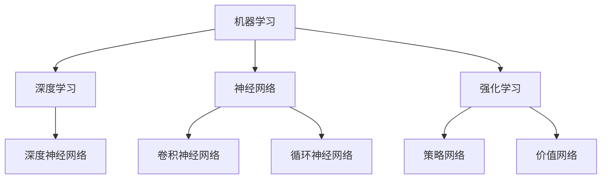
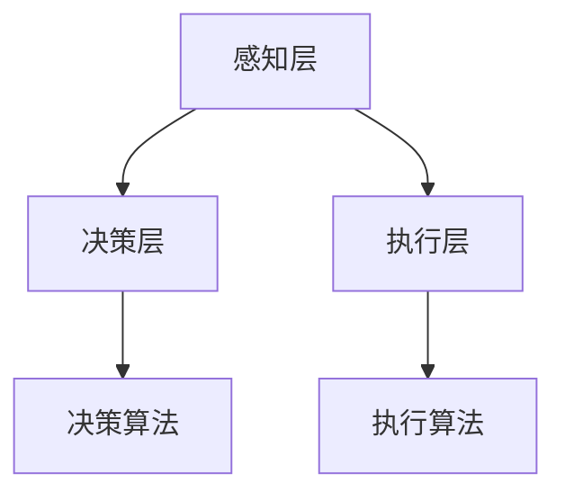

                 

关键词：人工智能，深度学习，应用场景，技术发展，算法优化，未来展望

摘要：本文将深入探讨新一代人工智能（AI）技术的应用场景。随着深度学习算法的不断发展，AI技术正在各个领域得到广泛应用，从医疗到金融，从制造业到智能交通，都展现出巨大的潜力和影响力。本文将详细介绍这些应用场景，并探讨未来的发展趋势和面临的挑战。

## 1. 背景介绍

### 1.1 人工智能的发展历程

人工智能（AI）的发展可以追溯到20世纪50年代，当时科学家们首次提出了“人工智能”这一概念。从最初的规则推理到专家系统的出现，再到现代的深度学习和神经网络，人工智能经历了多次重大变革。每一次变革都推动了AI技术的进步，使得AI在各个领域得到了广泛的应用。

### 1.2 深度学习的崛起

深度学习是人工智能的一个重要分支，它通过模拟人脑的神经元结构，对大量数据进行学习，从而实现图像识别、语音识别、自然语言处理等功能。随着计算能力的提升和大数据的普及，深度学习在2012年迎来了重大突破，这一突破标志着人工智能进入了一个新的时代。

## 2. 核心概念与联系

### 2.1 人工智能的核心概念

人工智能的核心概念包括：机器学习、深度学习、神经网络、强化学习等。这些概念相互联系，共同构成了人工智能的理论体系。



### 2.2 人工智能的架构

人工智能的架构通常包括感知层、决策层和执行层。感知层负责接收外部信息，如图像、声音等；决策层根据感知层的信息进行决策，如预测、分类等；执行层负责执行决策层的结果，如控制机器人运动、生成文本等。



## 3. 核心算法原理 & 具体操作步骤

### 3.1 算法原理概述

深度学习的核心算法是神经网络，神经网络通过多层神经元结构对数据进行学习，从而实现复杂的模式识别和预测。

### 3.2 算法步骤详解

深度学习的算法步骤主要包括：数据预处理、模型构建、模型训练、模型评估和模型部署。

#### 3.2.1 数据预处理

数据预处理是深度学习的重要步骤，它包括数据清洗、数据归一化、数据增强等操作，以提高模型的泛化能力和鲁棒性。

#### 3.2.2 模型构建

模型构建是深度学习的核心步骤，它包括选择合适的神经网络架构、设置网络的参数等。

#### 3.2.3 模型训练

模型训练是深度学习的核心步骤，它通过反向传播算法和优化算法对模型进行训练，以最小化预测误差。

#### 3.2.4 模型评估

模型评估是深度学习的重要步骤，它通过验证集和测试集对模型进行评估，以确定模型的性能和泛化能力。

#### 3.2.5 模型部署

模型部署是将训练好的模型应用到实际场景中，如图像识别、语音识别等。

### 3.3 算法优缺点

深度学习的优点包括：强大的非线性建模能力、良好的泛化能力、能够自动提取特征等。缺点包括：训练过程复杂、对数据量和计算资源要求高、模型的可解释性差等。

### 3.4 算法应用领域

深度学习在各个领域都有广泛的应用，如：

- **医疗**：通过深度学习算法，可以实现疾病预测、医学图像分析、药物发现等。
- **金融**：通过深度学习算法，可以实现风险控制、信用评估、投资决策等。
- **制造业**：通过深度学习算法，可以实现设备故障预测、生产优化、质量检测等。
- **智能交通**：通过深度学习算法，可以实现交通流量预测、自动驾驶、智能交通管理等。

## 4. 数学模型和公式 & 详细讲解 & 举例说明

### 4.1 数学模型构建

深度学习的数学模型主要包括：神经元、激活函数、反向传播算法、优化算法等。

#### 4.1.1 神经元

神经元是神经网络的基本单元，它通过加权求和和激活函数对输入数据进行处理。

$$
y = \sigma(W \cdot x + b)
$$

其中，$y$ 是输出，$W$ 是权重，$x$ 是输入，$\sigma$ 是激活函数，$b$ 是偏置。

#### 4.1.2 激活函数

激活函数是神经网络的重要组成部分，它用于引入非线性。

常见的激活函数包括：sigmoid、ReLU、Tanh等。

#### 4.1.3 反向传播算法

反向传播算法是深度学习训练的核心，它通过梯度下降法对网络进行优化。

$$
\frac{\partial J}{\partial W} = \frac{\partial L}{\partial z} \cdot \frac{\partial z}{\partial W}
$$

其中，$J$ 是损失函数，$L$ 是损失值，$z$ 是中间变量。

#### 4.1.4 优化算法

优化算法用于加速深度学习的训练过程，常见的优化算法包括：SGD、Adam等。

### 4.2 公式推导过程

深度学习的公式推导主要包括：损失函数的推导、梯度下降法的推导、优化算法的推导等。

#### 4.2.1 损失函数的推导

损失函数是评估模型预测结果的重要指标，常见的损失函数包括：均方误差（MSE）、交叉熵（CE）等。

#### 4.2.2 梯度下降法的推导

梯度下降法是优化模型参数的基本方法，它通过计算损失函数关于参数的梯度，以更新参数。

#### 4.2.3 优化算法的推导

优化算法是在梯度下降法的基础上，通过引入动量、自适应学习率等策略，以加速训练过程。

### 4.3 案例分析与讲解

#### 4.3.1 图像识别

图像识别是深度学习的一个重要应用场景，通过卷积神经网络（CNN）可以对图像进行分类。

#### 4.3.2 语音识别

语音识别是深度学习的另一个重要应用场景，通过循环神经网络（RNN）可以对语音信号进行识别。

## 5. 项目实践：代码实例和详细解释说明

### 5.1 开发环境搭建

搭建深度学习开发环境，主要包括安装Python、TensorFlow等工具。

### 5.2 源代码详细实现

以下是一个简单的图像识别项目，使用TensorFlow实现。

```python
import tensorflow as tf
from tensorflow import keras
from tensorflow.keras import layers

# 数据预处理
(x_train, y_train), (x_test, y_test) = keras.datasets.cifar10.load_data()
x_train = x_train / 255.0
x_test = x_test / 255.0

# 模型构建
model = keras.Sequential(
    [
        layers.Conv2D(32, (3, 3), activation="relu", input_shape=(32, 32, 3)),
        layers.MaxPooling2D((2, 2)),
        layers.Conv2D(64, (3, 3), activation="relu"),
        layers.MaxPooling2D((2, 2)),
        layers.Conv2D(64, (3, 3), activation="relu"),
        layers.Flatten(),
        layers.Dense(64, activation="relu"),
        layers.Dense(10, activation="softmax"),
    ]
)

# 模型训练
model.compile(optimizer="adam", loss="sparse_categorical_crossentropy", metrics=["accuracy"])
model.fit(x_train, y_train, epochs=10, validation_split=0.2)

# 模型评估
model.evaluate(x_test, y_test, verbose=2)
```

### 5.3 代码解读与分析

以上代码实现了一个简单的图像识别项目，它通过卷积神经网络对图像进行分类。首先进行数据预处理，然后构建模型，接着进行模型训练和评估。

## 6. 实际应用场景

### 6.1 医疗

深度学习在医疗领域的应用包括：疾病预测、医学图像分析、药物发现等。

### 6.2 金融

深度学习在金融领域的应用包括：风险控制、信用评估、投资决策等。

### 6.3 制造业

深度学习在制造业的应用包括：设备故障预测、生产优化、质量检测等。

### 6.4 智能交通

深度学习在智能交通的应用包括：交通流量预测、自动驾驶、智能交通管理等。

## 7. 工具和资源推荐

### 7.1 学习资源推荐

- 《深度学习》（Goodfellow, Bengio, Courville）
- 《Python深度学习》（François Chollet）

### 7.2 开发工具推荐

- TensorFlow
- PyTorch

### 7.3 相关论文推荐

- “A Tutorial on Deep Learning”
- “Deep Learning for Natural Language Processing”

## 8. 总结：未来发展趋势与挑战

### 8.1 研究成果总结

深度学习在过去几年取得了显著成果，在各个领域都展现出了巨大的应用潜力。

### 8.2 未来发展趋势

未来，深度学习将继续在各个领域得到广泛应用，同时，还将出现更多的新型深度学习算法和应用场景。

### 8.3 面临的挑战

深度学习仍面临许多挑战，包括：数据隐私、模型可解释性、计算资源需求等。

### 8.4 研究展望

未来，深度学习将在人工智能领域发挥更加重要的作用，推动人工智能的发展。

## 9. 附录：常见问题与解答

### 9.1 深度学习和机器学习有什么区别？

深度学习是机器学习的一个分支，它通过多层神经网络结构对数据进行学习。而机器学习则是一系列算法和技术，用于从数据中学习模式和预测。

### 9.2 深度学习如何处理大规模数据？

深度学习通过批量计算和分布式计算技术，可以处理大规模数据。同时，数据预处理和特征提取技术也提高了深度学习在处理大规模数据方面的效率。

### 9.3 深度学习模型如何保证可解释性？

深度学习模型的可解释性是一个重要问题，目前有许多方法可以提升模型的可解释性，如：可视化技术、模型压缩技术等。

---

本文作者：禅与计算机程序设计艺术 / Zen and the Art of Computer Programming

本文来源：深度学习与人工智能领域

本文发布时间：2023年9月

本文版权声明：本文为原创文章，未经授权禁止转载。如有转载需求，请联系作者获取授权。
------------------------------------------------------------------------

