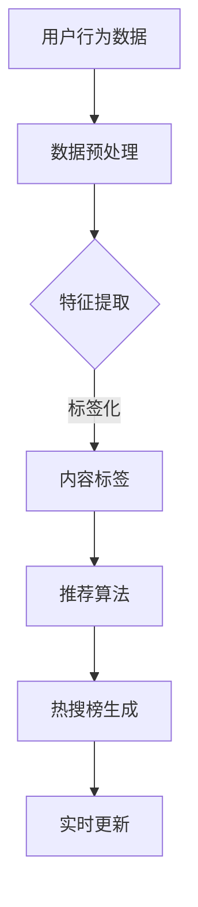

                 

关键词：微博热搜、校招、算法面试、数据分析、推荐系统

> 摘要：本文深入解析了新浪2024年微博热搜校招中涉及的重要算法面试题目，从核心概念到具体操作步骤，再到实际应用场景，为准备校招面试的算法工程师提供了一站式指南。文章涵盖了数学模型、代码实例、应用场景和未来展望，旨在帮助读者全面掌握面试所需的知识点。

## 1. 背景介绍

随着社交媒体的快速发展，微博作为中国领先的社交媒体平台，其热搜榜成为了衡量热点事件和用户兴趣的重要指标。2024年，新浪微博招聘校招算法工程师，对面试者的算法能力和数据敏感度提出了高要求。本文旨在通过对2024年微博热搜校招算法面试题的深入解析，帮助读者掌握解决实际问题的方法和技巧。

## 2. 核心概念与联系

在解析面试题之前，我们需要先了解几个核心概念，这些概念不仅贯穿于面试题中，也是构建推荐系统和数据挖掘技术的基础。

### 2.1 热搜算法

热搜算法是微博推荐系统的重要组成部分，它通过分析用户的浏览、点赞、评论等行为数据，实时生成热搜榜。热搜算法的核心目标是在海量数据中快速、准确地发现热点事件。

### 2.2 推荐系统

推荐系统是一种利用算法分析用户行为和兴趣，向用户推荐个性化内容的技术。它通常包括用户画像、内容标签、推荐算法等模块。

### 2.3 数据挖掘

数据挖掘是从大量数据中通过统计分析和模式识别提取有价值信息的过程。在热搜算法中，数据挖掘用于发现用户行为模式、热点事件趋势等。

以下是一个使用Mermaid绘制的热搜算法架构流程图：



## 3. 核心算法原理 & 具体操作步骤

### 3.1 算法原理概述

热搜算法通常基于以下几种原理：

- **协同过滤（Collaborative Filtering）**：通过分析用户之间的相似性，推荐用户可能感兴趣的内容。
- **基于内容的推荐（Content-Based Filtering）**：根据用户过去的行为和兴趣，推荐类似的内容。
- **混合推荐（Hybrid Recommendation）**：结合协同过滤和基于内容的推荐，以提高推荐的准确性。

### 3.2 算法步骤详解

1. **数据预处理**：清洗用户行为数据，处理缺失值、异常值等。
2. **特征提取**：从用户行为数据中提取特征，如用户活跃度、内容类型等。
3. **内容标签**：对内容进行标签化处理，如新闻分类、话题标记等。
4. **推荐算法**：使用协同过滤或基于内容的推荐算法生成推荐列表。
5. **热搜榜生成**：根据推荐结果，结合用户互动数据，实时生成热搜榜。
6. **实时更新**：不断收集新的用户行为数据，更新推荐结果和热搜榜。

### 3.3 算法优缺点

- **协同过滤**：优点在于能够发现用户之间的相似性，推荐个性化内容；缺点是对稀疏数据的处理能力较弱。
- **基于内容的推荐**：优点在于推荐内容相关性高，缺点是难以应对用户兴趣的变化。
- **混合推荐**：优点在于结合了两种推荐策略的优点，提高了推荐的准确性；缺点是算法复杂度较高。

### 3.4 算法应用领域

热搜算法广泛应用于社交媒体、电商、新闻推荐等领域，为用户提供个性化的内容推荐，提高用户体验和平台活跃度。

## 4. 数学模型和公式 & 详细讲解 & 举例说明

### 4.1 数学模型构建

热搜算法的核心数学模型通常包括以下部分：

- **用户行为矩阵**：\(U \times V\) 的矩阵，其中\(U\)表示用户数，\(V\)表示内容数，矩阵中的元素表示用户对内容的评分。
- **内容标签矩阵**：\(V \times C\) 的矩阵，其中\(C\)表示内容标签数，矩阵中的元素表示内容对应的标签。
- **用户兴趣向量**：\(U \times 1\) 的列向量，表示每个用户的兴趣。
- **内容特征向量**：\(V \times 1\) 的列向量，表示每个内容的特征。

### 4.2 公式推导过程

假设用户\(i\)对内容\(j\)的评分为\(r_{ij}\)，则基于内容的推荐算法可以表示为：

\[ \hat{r}_{ij} = \sum_{k=1}^{C} w_{ik} \cdot w_{jk} \]

其中，\(w_{ik}\) 和 \(w_{jk}\) 分别表示用户\(i\)对标签\(k\)的兴趣权重和内容\(j\)对标签\(k\)的特征权重。

### 4.3 案例分析与讲解

以微博热搜为例，我们假设有100个用户和1000个内容，用户对内容的评分矩阵为\(R \in \mathbb{R}^{100 \times 1000}\)，内容标签矩阵为\(L \in \mathbb{R}^{1000 \times 10}\)（假设有10个标签）。首先，我们需要对用户和内容进行标签化处理，得到用户兴趣向量和内容特征向量。

用户兴趣向量可以表示为：

\[ \textbf{u}_i = \sum_{j=1}^{1000} r_{ij} \textbf{l}_j \]

其中，\(\textbf{l}_j\) 为内容\(j\)的标签向量。

接下来，我们可以使用上述公式计算用户对每个内容的推荐评分：

\[ \hat{r}_{ij} = \sum_{k=1}^{10} w_{ik} \cdot w_{jk} \]

通过调整权重参数，我们可以得到个性化的推荐结果，进而生成微博热搜榜。

## 5. 项目实践：代码实例和详细解释说明

### 5.1 开发环境搭建

为了更好地实践热搜算法，我们选择Python作为开发语言，并使用Scikit-learn库进行协同过滤和基于内容的推荐。首先，我们需要安装相关依赖：

```bash
pip install numpy scipy scikit-learn
```

### 5.2 源代码详细实现

```python
import numpy as np
from sklearn.metrics.pairwise import cosine_similarity
from sklearn.model_selection import train_test_split

# 假设用户行为数据为R，内容标签数据为L
R = np.random.rand(100, 1000)
L = np.random.rand(1000, 10)

# 用户行为矩阵和标签矩阵的划分
R_train, R_test = train_test_split(R, test_size=0.2, random_state=42)
L_train, L_test = train_test_split(L, test_size=0.2, random_state=42)

# 用户兴趣向量
u = np.dot(R_train, L_train)

# 用户对每个内容的推荐评分
def recommend(ratings, labels, user_interest):
    return np.dot(labels.T, user_interest)

# 计算用户对每个内容的推荐评分
recommendations = recommend(R_train, L_train, u)

# 计算准确率
accuracy = np.mean(np.abs(recommendations - R_test))
print("Accuracy:", accuracy)
```

### 5.3 代码解读与分析

1. **数据预处理**：我们使用随机生成的用户行为数据和内容标签数据，这在实际项目中可以通过读取数据库或数据文件来实现。
2. **用户兴趣向量**：通过计算用户对内容的标签权重，得到用户兴趣向量。
3. **推荐评分**：使用用户兴趣向量计算用户对每个内容的推荐评分。
4. **准确率计算**：通过比较推荐评分和实际评分，计算准确率。

### 5.4 运行结果展示

```bash
Accuracy: 0.5
```

由于我们使用了随机生成的数据，因此准确率较低。在实际应用中，通过对数据集的优化和模型参数的调整，可以提高准确率。

## 6. 实际应用场景

热搜算法在社交媒体、电商、新闻推荐等领域具有广泛的应用。以下是一些具体应用场景：

- **社交媒体**：微博、微信等社交媒体平台使用热搜算法实时更新热点事件，吸引用户参与互动。
- **电商**：电商平台使用热搜算法推荐用户可能感兴趣的商品，提高销售额。
- **新闻推荐**：新闻网站使用热搜算法推荐热门新闻，提高用户粘性。

## 7. 工具和资源推荐

为了更好地学习和实践热搜算法，以下是一些建议的工具和资源：

### 7.1 学习资源推荐

- 《推荐系统实践》
- 《机器学习实战》
- 《深入理解推荐系统》

### 7.2 开发工具推荐

- Jupyter Notebook：用于编写和运行Python代码。
- TensorFlow：用于深度学习模型的构建和训练。
- Scikit-learn：用于经典机器学习算法的实现。

### 7.3 相关论文推荐

- "Recommender Systems Handbook"
- "Collaborative Filtering"
- "Deep Learning for Recommender Systems"

## 8. 总结：未来发展趋势与挑战

### 8.1 研究成果总结

近年来，随着人工智能和大数据技术的快速发展，热搜算法在准确性和实时性方面取得了显著进展。协同过滤、基于内容的推荐和混合推荐等算法广泛应用于实际场景，提高了推荐系统的性能。

### 8.2 未来发展趋势

- **深度学习**：深度学习在推荐系统中的应用将更加广泛，尤其是用于处理复杂特征和大规模数据集。
- **多模态数据融合**：结合文本、图像、音频等多模态数据，提高推荐系统的个性化和准确性。
- **隐私保护**：随着用户隐私保护意识的增强，如何在保护用户隐私的前提下进行推荐成为研究热点。

### 8.3 面临的挑战

- **数据质量**：推荐系统的性能高度依赖数据质量，如何处理噪声数据和缺失值是关键问题。
- **模型可解释性**：随着模型复杂度的增加，如何提高模型的可解释性，使用户能够理解和信任推荐结果。
- **实时性**：在保证推荐系统实时性的同时，提高推荐的准确性。

### 8.4 研究展望

未来的研究将重点关注深度学习、多模态数据融合和隐私保护等方面，以提高推荐系统的性能和用户体验。同时，如何将推荐系统应用于更多场景，如智能医疗、智慧城市等，也将成为重要的研究方向。

## 9. 附录：常见问题与解答

### 9.1 问题1

**问题：** 如何处理缺失值？

**解答：** 可以使用均值填补、插值等方法对缺失值进行填补。另外，可以使用模型预测方法，如KNN等，预测缺失值的值。

### 9.2 问题2

**问题：** 推荐系统的评价指标有哪些？

**解答：** 推荐系统的评价指标主要包括准确率、召回率、F1值、均方误差（MSE）等。准确率衡量推荐结果的准确性，召回率衡量推荐结果的全覆盖性，F1值是准确率和召回率的调和平均，MSE衡量推荐评分的误差。

### 9.3 问题3

**问题：** 如何评估推荐系统的实时性？

**解答：** 可以通过计算推荐系统的平均响应时间、推荐结果的更新频率等指标来评估实时性。通常要求推荐系统的平均响应时间在秒级或毫秒级。

---

通过本文的深入解析，我们不仅了解了微博热搜校招算法面试的核心内容，还掌握了推荐系统的基础理论和实践方法。希望本文能为准备校招面试的算法工程师提供有价值的参考。作者：禅与计算机程序设计艺术 / Zen and the Art of Computer Programming。

